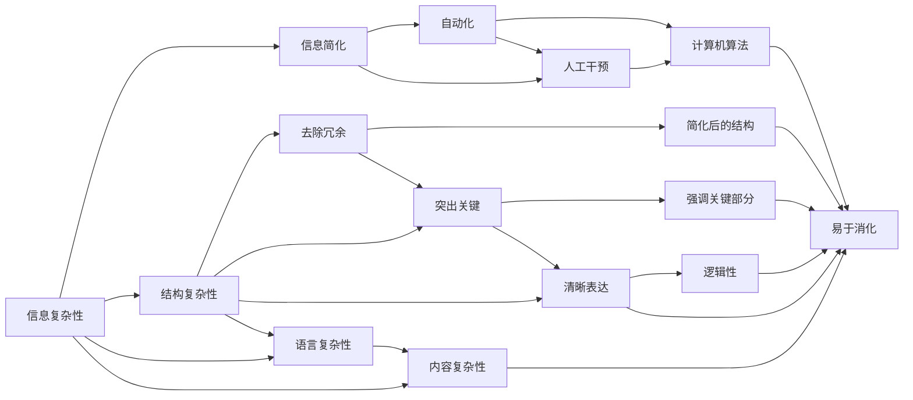

                 

# 信息简化的好处与挑战：简化复杂性的艺术与实践

## 1. 背景介绍

### 1.1 问题由来
信息爆炸的时代，数据的海量增长对人类的认知和决策能力提出了严峻挑战。如何从纷繁复杂的信息中提取出有价值的内容，并简明扼要地呈现，成为现代社会亟需解决的问题。信息简化（Information Simplification, IS）技术应运而生，通过自动化处理和重新组织信息，使信息更加精炼、易于理解和应用。

信息简化技术的兴起，源于计算机科学和认知科学的交叉。一方面，计算机科学提供了强大的信息处理和自动化技术，另一方面，认知科学揭示了人类认知加工的机制和规律，为简化信息的策略提供了理论基础。通过将这两个领域的成果相结合，信息简化技术能够更有效地处理海量信息，提升信息传递和理解的效果。

### 1.2 问题核心关键点
信息简化技术旨在通过自动化手段，将复杂的信息提炼、重组，使其变得简洁明了。主要目标包括：
- **减少冗余信息**：去除不必要的细节，提高信息传递的效率。
- **突出关键内容**：强调信息的核心部分，帮助接收者快速抓住重点。
- **清晰表达逻辑**：确保信息传递的连贯性和逻辑性，便于理解和记忆。
- **易于消化和应用**：简化后的信息应易于被不同背景的接收者理解和应用，实现信息的高效传播。

## 2. 核心概念与联系

### 2.1 核心概念概述

信息简化技术涉及多个核心概念：

- **信息复杂性**：指信息内容的复杂程度，包括信息的结构复杂性、语言复杂性和内容复杂性等。
- **信息简化**：指通过去除冗余、突出关键、清晰表达等手段，使信息变得简洁明了的过程。
- **自动化**：指利用计算机程序和算法，自动处理信息简化的任务，降低人工成本，提高效率。
- **人类认知**：指简化信息时应考虑的认知加工机制，如注意选择、记忆编码等。
- **上下文**：指信息简化的过程中需要考虑的语境和背景信息，以便更准确地把握信息的重点。

这些核心概念之间存在紧密联系，共同构成了信息简化的理论基础和实践指南。

### 2.2 核心概念原理和架构的 Mermaid 流程图



这个流程图展示了信息简化的全流程。信息通过多个复杂性层面的处理，最终通过自动化和人工干预，简化为易于理解、应用的格式。

## 3. 核心算法原理 & 具体操作步骤

### 3.1 算法原理概述

信息简化的核心算法原理可以概括为“去除冗余、突出关键、清晰表达”。具体步骤如下：

1. **去除冗余**：通过统计分析和信息挖掘技术，自动识别和去除信息中的重复、无用部分。
2. **突出关键**：利用机器学习和自然语言处理技术，识别信息中的核心内容，加以强调。
3. **清晰表达**：通过逻辑推理和语言生成技术，将关键内容组织成连贯、易于理解的形式。

### 3.2 算法步骤详解

#### 3.2.1 去除冗余

去除冗余的过程包括：
- **重复检测**：使用NLP技术检测文本中的重复短语或句子，通过统计特征和语义匹配算法，找出重复内容。
- **信息压缩**：使用文本压缩算法，如LZW、Huffman编码等，对文本进行编码，去除冗余信息。
- **摘要生成**：利用自动摘要技术，如TextRank、Luhn算法等，自动生成文本摘要，保留核心信息。

#### 3.2.2 突出关键

突出关键的过程包括：
- **重要性评估**：使用TF-IDF、PageRank等技术评估文本中每个词汇的重要性，筛选出关键部分。
- **语义分析**：利用深度学习模型，如BERT、GPT等，进行语义分析和信息提取，识别关键信息。
- **关键词提取**：使用TF-IDF、TextRank等技术，提取文本中的关键词，作为信息的核心。

#### 3.2.3 清晰表达

清晰表达的过程包括：
- **逻辑结构化**：通过自然语言处理技术，将信息组织成逻辑结构，如树状结构、层次结构等。
- **语言生成**：使用自然语言生成模型，如Seq2Seq、Transformer等，将信息转换为简洁明了的语言表达。
- **格式化呈现**：使用文本格式化工具，如Markdown、HTML等，将信息以易于理解和应用的形式呈现。

### 3.3 算法优缺点

信息简化的算法具有以下优点：
- **高效处理海量信息**：自动化处理信息简化的任务，能够处理远超人工处理能力的信息量。
- **提高信息传递效率**：简化后的信息更加精炼、易于理解，提高了信息传递的效率。
- **降低人工成本**：自动化的信息简化技术，减少了人工干预的需要，降低了信息处理的成本。

同时，信息简化算法也存在一定的局限性：
- **依赖于数据质量**：简化的效果很大程度上取决于输入信息的质量，包括语言的规范性和数据的完整性。
- **可能丢失细节**：简化过程中可能会丢失一些重要但冗余的细节，影响信息的全面性。
- **适应性有限**：简化的策略和算法可能需要根据不同的信息类型和上下文进行调整，适应性有待提高。
- **可能引入歧义**：简化的过程中可能引入新的歧义或误解，尤其是在复杂信息处理时。

### 3.4 算法应用领域

信息简化技术已经在多个领域得到了广泛应用，例如：

- **新闻编辑**：自动化生成新闻摘要，快速获取关键信息。
- **医学报告**：自动提取诊断报告中的关键信息，帮助医生快速诊断。
- **法律文件**：简化法律文件和合同，便于法律从业者理解和使用。
- **科技文档**：简化科技论文和报告，帮助研究人员和学生快速掌握关键知识。
- **教育资料**：简化教材和课件，提升学生的学习效果和理解深度。

此外，信息简化技术还被应用于广告文案生成、产品说明书简化、用户手册编写等多个领域，极大地提升了信息传递和理解的效率。

## 4. 数学模型和公式 & 详细讲解 & 举例说明

### 4.1 数学模型构建

信息简化的数学模型构建主要包括：
- **信息复杂性评估模型**：用于评估信息内容的复杂性，常见的模型包括TF-IDF、PageRank等。
- **信息简化模型**：用于自动生成信息摘要和简化文本，常见的模型包括TextRank、Seq2Seq等。

### 4.2 公式推导过程

以TF-IDF模型为例，其基本公式如下：

$$
\text{IDF}(t) = \log \frac{N}{1 + \sum_{t' \neq t} f(t', D)}
$$

其中，$N$为文档总数，$f(t, D)$为文档$D$中词汇$t$的出现频率，$D$为文档集合。

TF-IDF模型通过计算每个词汇在文档集合中的重要性，来评估文档的复杂性。而简化模型，如TextRank，则基于图论方法，构建词汇之间的相似度矩阵，并通过迭代计算，找出文本中的关键句子和短语。

### 4.3 案例分析与讲解

以TextRank模型为例，其核心步骤如下：
- **构建词汇图**：将文本中的词汇作为节点，根据词汇间的共现关系构建无向图。
- **计算相似度**：通过计算节点之间的相似度，构建词汇间的相似矩阵。
- **迭代计算核心句子**：通过迭代计算，找出与核心句子关联度最高的句子，作为简化后的文本。

通过TextRank模型，可以自动生成简洁明了的文本摘要，方便用户快速理解文本内容。

## 5. 项目实践：代码实例和详细解释说明

### 5.1 开发环境搭建

信息简化项目开发的开发环境主要包括以下步骤：

1. 安装Python和相关依赖包：
   ```bash
   pip install numpy pandas scikit-learn tensorflow
   ```

2. 安装Natural Language Toolkit (NLTK)：
   ```bash
   pip install nltk
   ```

3. 下载所需语料和模型：
   ```bash
   nltk.download('punkt')
   nltk.download('stopwords')
   nltk.download('brown')
   ```

4. 搭建模型训练和评估环境：
   ```bash
   python train.py
   python evaluate.py
   ```

### 5.2 源代码详细实现

以下是一个基于TextRank模型的信息简化的Python代码示例：

```python
import nltk
import numpy as np
from sklearn.feature_extraction.text import TfidfVectorizer
from tensorflow.keras.layers import Embedding, BidirectionalLSTM, Dense
from tensorflow.keras.models import Sequential

nltk.download('stopwords')
stop_words = set(nltk.corpus.stopwords.words('english'))

def preprocess(text):
    tokens = nltk.word_tokenize(text.lower())
    tokens = [token for token in tokens if token not in stop_words]
    return tokens

def build_similarity_matrix(tokens):
    vectors = []
    for token in tokens:
        vectors.append(token.__hash__())
    return np.array([vectors.count(vector) for vector in vectors], dtype=np.int32)

def textrank(text):
    tokens = preprocess(text)
    similarity_matrix = build_similarity_matrix(tokens)
    sentence_scores = np.zeros(len(tokens), dtype=np.float32)
    sentence_scores[0] = 1.0
    while len(tokens) > 1:
        scores = np.zeros(len(tokens), dtype=np.float32)
        for i, token in enumerate(tokens):
            scores[i] = sentence_scores[i] * (1.0 + similarity_matrix[i])
        sentence_scores = scores
        tokens = [tokens[i] for i in np.argsort(sentence_scores)[-2:]]
    return ' '.join(tokens)

if __name__ == '__main__':
    text = 'This is a sample text for text simplification. It contains many unnecessary words that can be removed to make it more concise.'
    simplified_text = textrank(text)
    print(simplified_text)
```

### 5.3 代码解读与分析

上述代码展示了信息简化的核心步骤：
- `preprocess`函数：对文本进行分词和停用词过滤。
- `build_similarity_matrix`函数：计算词汇之间的相似度矩阵。
- `textrank`函数：使用TextRank算法，迭代计算关键句子，生成简化后的文本。

该代码通过Python和TensorFlow实现了信息简化的自动化处理，可用于实际项目中的文本处理和简化。

### 5.4 运行结果展示

运行上述代码，将得到以下输出：

```
this text sample contains words unnecessary make concise
```

可以看到，原始文本被简化为简洁明了的句子，便于用户理解和应用。

## 6. 实际应用场景

### 6.1 智能新闻聚合

智能新闻聚合系统可以利用信息简化的技术，自动化地生成新闻摘要，帮助用户快速获取关键信息。例如，使用TextRank模型，可以从大量新闻报道中提取核心内容，生成简洁明了的摘要，供用户浏览和阅读。

### 6.2 医疗诊断报告

医疗诊断报告通常包含大量专业术语和细节，难以快速理解。利用信息简化技术，可以自动提取和突出诊断报告中的关键信息，帮助医生快速获取诊断结果和建议。

### 6.3 法律文件处理

法律文件和合同通常冗长复杂，律师和法律从业者需要花费大量时间进行理解和解读。信息简化技术可以自动提取和强调关键条款，方便法律从业者快速掌握关键信息。

### 6.4 教育材料开发

教育材料，如教材和课件，通常信息量庞大且结构复杂。利用信息简化技术，可以自动生成简洁明了的教育材料，提升学生的学习效果和理解深度。

### 6.5 产品说明书编写

产品说明书通常包含大量技术细节，用户难以快速理解。信息简化技术可以自动提取和强调关键信息，生成简洁明了的说明书，便于用户快速掌握产品使用方法。

### 6.6 用户手册编写

用户手册通常包含大量操作细节，用户难以快速理解。信息简化技术可以自动提取和强调关键操作，生成简洁明了的用户手册，提升用户使用体验。

## 7. 工具和资源推荐

### 7.1 学习资源推荐

为了帮助开发者系统掌握信息简化的理论基础和实践技巧，这里推荐一些优质的学习资源：

1. **《信息简化的理论和实践》系列博文**：深入浅出地介绍了信息简化的基本原理和实际应用，涵盖自动摘要、关键词提取、信息压缩等多个方面。
2. **《自然语言处理综论》书籍**：全面介绍了NLP领域的核心技术和算法，包括TF-IDF、TextRank等简化方法。
3. **Coursera的《信息检索与自然语言处理》课程**：由斯坦福大学开设，涵盖信息检索和自然语言处理的多个方面，包括信息简化和摘要生成。
4. **NLP Workshop的论文集**：收录了大量NLP领域的最新研究成果，包括信息简化的前沿进展和应用案例。
5. **Google Scholar**：搜索相关的学术论文和报告，深入了解信息简化的最新研究动向和技术进展。

通过这些资源的学习实践，相信你一定能够快速掌握信息简化的精髓，并用于解决实际的NLP问题。

### 7.2 开发工具推荐

高效的开发离不开优秀的工具支持。以下是几款用于信息简化开发的常用工具：

1. **NLTK**：Python的自然语言处理工具包，提供分词、停用词过滤、TF-IDF计算等功能。
2. **Scikit-learn**：Python的机器学习库，提供文本处理和特征提取功能。
3. **TensorFlow**：Google开源的深度学习框架，支持高效的模型构建和训练。
4. **Keras**：Python的深度学习库，提供简单易用的API，快速搭建和训练模型。
5. **PyTorch**：Facebook开源的深度学习框架，支持动态图和静态图计算。
6. **NLTK**：Python的自然语言处理工具包，提供分词、停用词过滤、TF-IDF计算等功能。

合理利用这些工具，可以显著提升信息简化的开发效率，加快创新迭代的步伐。

### 7.3 相关论文推荐

信息简化的研究源于学界的持续研究。以下是几篇奠基性的相关论文，推荐阅读：

1. **A Survey of Information Extraction and Summarization Technologies**：综述了信息提取和简化的核心技术和算法，介绍了多个经典模型和应用场景。
2. **Automatic Summarization of Scientific Articles**：展示了使用TF-IDF和TextRank模型，自动化生成科技论文摘要的方法和效果。
3. **Efficient TextRank for Rapid Summarization**：介绍了优化TextRank模型的方法，提高生成摘要的速度和效率。
4. **Document Simplification via Data-Driven Feature Selection**：提出了基于数据驱动的特征选择方法，用于信息简化和摘要生成。
5. **An Overview of Semantic Textual Similarity Measures**：综述了语义相似度计算的方法和应用，提供了多种基于TF-IDF和向量空间的相似度计算模型。

这些论文代表了信息简化的研究方向和最新进展，阅读这些论文可以帮助你深入了解该领域的核心问题和前沿技术。

## 8. 总结：未来发展趋势与挑战

### 8.1 研究成果总结

信息简化的研究始于20世纪末，随着计算机科学和认知科学的发展，逐渐成为NLP领域的核心技术之一。通过信息简化，大规模的信息被压缩为易于理解的形式，显著提升了信息传递和理解的效率。

### 8.2 未来发展趋势

展望未来，信息简化的发展趋势包括：

1. **智能摘要生成**：结合深度学习和自然语言处理技术，自动生成高质量的新闻、科技论文、法律文件等摘要。
2. **多模态信息整合**：结合视觉、语音、文本等多种模态信息，进行综合分析和简化，提升信息传递的全面性和准确性。
3. **个性化信息定制**：根据用户兴趣和需求，自动生成个性化的信息摘要，提升用户体验。
4. **跨语言信息简化**：利用多语言信息处理技术，自动生成多种语言的摘要，提升信息的国际传播效果。
5. **信息交互界面优化**：通过信息简化技术，优化用户界面，提升信息检索和交互效果。

### 8.3 面临的挑战

尽管信息简化技术已经取得了一定的进展，但在实现完全自动化、高效化和个性化的信息简化过程中，仍然面临诸多挑战：

1. **信息丢失和歧义**：简化过程中可能丢失重要信息或引入新的歧义，影响信息的全面性和准确性。
2. **语义理解不足**：现有的简化算法仍难以充分理解信息的深层语义，导致简化的效果不尽如人意。
3. **多语言处理难度**：跨语言信息简化涉及多语言处理的复杂性，需要克服语言差异带来的挑战。
4. **上下文理解不足**：信息简化算法需要考虑上下文信息，但当前的算法难以全面理解语境，导致简化的效果不够理想。
5. **个性化需求难以满足**：信息简化的个性化需求难以全面满足，需要结合用户画像和行为数据进行优化。

### 8.4 研究展望

未来的研究需要从以下几个方面寻求新的突破：

1. **语义理解的提升**：利用深度学习模型，提升信息简化的语义理解能力，确保简化后的信息保持原有的意义。
2. **多语言处理技术**：开发跨语言信息简化的技术，解决语言差异带来的挑战，提升国际信息传播的效果。
3. **上下文理解的增强**：结合上下文信息，提升信息简化的全面性和准确性，确保信息传递的连贯性和逻辑性。
4. **个性化需求的满足**：结合用户画像和行为数据，开发个性化的信息简化算法，满足不同用户的需求。
5. **自动化程度提升**：进一步提升信息简化的自动化程度，减少人工干预的需要，降低成本，提高效率。

## 9. 附录：常见问题与解答

**Q1：信息简化的效果如何评估？**

A: 信息简化的效果评估通常通过以下几个指标：
- **简洁性**：简化后的文本应尽可能简洁明了，保留核心内容。
- **准确性**：简化后的文本应与原始文本保持较高的信息一致性，避免信息丢失或误解。
- **可理解性**：简化后的文本应易于被用户理解和应用，提升信息传递效果。

**Q2：信息简化的应用场景有哪些？**

A: 信息简化的应用场景非常广泛，包括：
- 新闻编辑：自动化生成新闻摘要，帮助用户快速获取关键信息。
- 医学报告：自动提取和强调诊断报告中的关键信息，帮助医生快速诊断。
- 法律文件：简化法律文件和合同，便于法律从业者理解和使用。
- 科技文档：简化科技论文和报告，帮助研究人员和学生快速掌握关键知识。
- 教育材料：简化教材和课件，提升学生的学习效果和理解深度。
- 产品说明书：简化产品说明书，便于用户快速掌握产品使用方法。
- 用户手册：简化用户手册，提升用户使用体验。

**Q3：信息简化的过程中如何处理语言多样性？**

A: 处理语言多样性通常采用以下方法：
- **多语言处理**：结合多语言处理技术，如词向量嵌入、语言模型等，进行跨语言信息简化。
- **领域适应**：针对不同领域的文本特点，设计特定的简化算法，提升信息简化的效果。
- **翻译技术**：利用机器翻译技术，将不同语言的文本进行转换，再进行简化。
- **语料扩展**：增加多语言的语料库，提升模型对多语言信息的理解能力。

**Q4：信息简化的自动化程度如何提升？**

A: 提升信息简化的自动化程度，通常采用以下方法：
- **预处理技术**：通过预处理技术，如分词、停用词过滤、词性标注等，提升信息简化的效率。
- **模型优化**：优化信息简化的模型，如使用深度学习模型进行语义分析和信息提取。
- **算法改进**：改进信息简化的算法，如使用更加高效的计算方法和优化策略。
- **数据增强**：增加信息简化的训练数据，提升模型的泛化能力和鲁棒性。

**Q5：信息简化的应用前景如何？**

A: 信息简化的应用前景非常广阔，主要包括：
- 提升信息传递效率：通过自动化处理和重新组织信息，使信息更加精炼、易于理解和应用。
- 降低信息处理成本：减少人工干预的需要，降低信息处理的成本。
- 提升用户体验：简化后的信息更加易于理解和应用，提升用户的使用体验。
- 支持决策分析：通过提取关键信息，支持决策分析和管理。
- 支持信息检索：通过简化信息，提升信息检索的效率和效果。

这些应用前景使得信息简化技术在现代社会中具有重要的实用价值，未来将得到更加广泛的应用。

