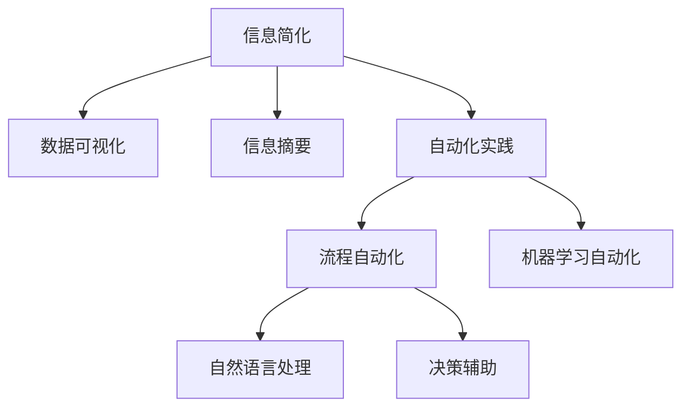

                 

# 信息简化的工具和自动化实践：利用技术简化你的生活和工作

在信息爆炸的时代，我们被海量数据和复杂任务所包围，如何在高效处理信息的同时，简化我们的生活和工作，成为每个IT从业者的重要课题。本文将围绕信息简化的工具和自动化实践，深入探讨如何利用先进的技术手段，提升信息处理效率，实现自动化目标，从而让生活和工作变得更加轻松便捷。

## 1. 背景介绍

### 1.1 问题由来

随着互联网和数字技术的不断发展，信息量呈指数级增长，从大数据分析到人工智能应用，我们的生活和工作都越来越依赖于数据和算法。然而，信息过多反而带来了诸多挑战：

- **信息过载**：大量无关信息干扰注意力，难以提取有效信息。
- **决策困难**：信息量庞大、复杂，难以进行快速、精准的决策。
- **任务繁重**：简单重复性任务占据大量时间，减少高效执行空间。
- **沟通障碍**：多部门协作信息传递不畅，难以形成协同效应。

为了解决这些问题，我们需要引入信息简化的工具和自动化实践，将复杂信息转化为易于处理、易于执行的简洁形式，提高信息处理效率，实现自动化处理，从而提升生活和工作质量。

### 1.2 问题核心关键点

- **信息简化**：将复杂信息转化为易于理解、易于操作的形式，提高信息处理效率。
- **自动化实践**：通过技术手段实现信息处理的自动化，减少重复性工作，提高执行效率。
- **数据驱动**：以数据为基础，借助机器学习、自然语言处理等技术，进行信息筛选、分类、关联和预测，辅助决策。

这些核心概念共同构成了信息简化工具和自动化实践的核心理念，旨在通过技术手段，提升信息处理能力，优化决策过程，简化执行任务。

## 2. 核心概念与联系

### 2.1 核心概念概述

为更好地理解信息简化工具和自动化实践，我们首先介绍几个关键概念：

- **信息简化**：通过技术手段将复杂信息转化为简洁、易于理解的形式，降低信息处理的难度。常见的简化工具包括数据可视化和信息摘要等。
- **自动化实践**：利用技术手段实现任务的自动执行，减少人工干预，提升效率。常见的自动化工具包括流程自动化、机器学习自动化等。
- **数据驱动**：以数据为基础，通过机器学习和自然语言处理技术，对信息进行筛选、分类、关联和预测，辅助决策。

这些概念之间的逻辑关系可以通过以下Mermaid流程图来展示：



这个流程图展示了一系列的工具和实践方法，它们相互联系、相互支持，共同构成了信息简化的技术框架。

## 3. 核心算法原理 & 具体操作步骤

### 3.1 算法原理概述

信息简化的工具和自动化实践的核心算法原理主要包括以下几个方面：

- **数据压缩算法**：通过算法将原始数据压缩到更小的形式，减少存储和传输的负担。
- **信息抽取和分类算法**：从大量数据中提取关键信息，进行分类和标注，便于理解和利用。
- **自然语言处理(NLP)**：通过文本分析、情感分析、实体识别等技术，理解文本内容，提取关键信息。
- **机器学习算法**：利用监督学习和无监督学习方法，对数据进行建模和预测，辅助决策。
- **流程自动化工具**：通过定义工作流、配置自动化规则，实现任务执行的自动化。

这些算法和技术构成了信息简化工具和自动化实践的核心框架，通过应用它们，可以大幅提升信息处理效率，实现自动化目标。

### 3.2 算法步骤详解

信息简化的工具和自动化实践通常包括以下几个关键步骤：

**Step 1: 数据准备和清洗**
- 收集和整理所需的数据，包括文本、图片、音频等。
- 对数据进行清洗和预处理，去除噪声和冗余信息。

**Step 2: 数据压缩和简化**
- 利用数据压缩算法（如Huffman编码、LZ77等）减少数据存储和传输的负担。
- 使用信息抽取和分类算法（如TF-IDF、LDA等）从数据中提取关键信息。

**Step 3: 自然语言处理**
- 对文本进行分词、去除停用词、词性标注等预处理。
- 应用NLP技术进行实体识别、情感分析、主题建模等，提取关键信息。

**Step 4: 机器学习建模**
- 使用监督学习算法（如决策树、随机森林等）对数据进行建模，预测任务结果。
- 应用无监督学习算法（如聚类、降维等）对数据进行特征提取和关联分析。

**Step 5: 自动化实践**
- 定义工作流和任务规则，使用流程自动化工具（如Apache Airflow、Zapier等）实现任务自动化。
- 使用机器学习自动化工具（如AutoML、Hyperopt等）优化模型参数和执行效率。

**Step 6: 反馈和优化**
- 收集执行结果和用户反馈，进行效果评估和优化。
- 不断迭代优化模型和流程，提升信息简化的效果和自动化实践的效率。

### 3.3 算法优缺点

信息简化的工具和自动化实践具有以下优点：
1. 提高信息处理效率：通过自动化工具和算法，减少了人工干预，提升了信息处理速度。
2. 降低数据处理成本：通过数据压缩和简化，减少了数据存储和传输的负担。
3. 优化决策过程：通过机器学习算法，辅助进行数据分析和预测，提高了决策的准确性和效率。
4. 增强工作协作：通过信息可视化工具，提高了团队成员之间的信息共享和协作效率。

同时，这些方法也存在一些局限性：
1. 依赖数据质量：信息简化的效果很大程度上取决于原始数据的质量，数据噪声和偏差可能会影响结果。
2. 模型复杂度高：复杂的机器学习模型和算法需要更多的计算资源和专业知识，实施难度大。
3. 缺乏灵活性：自动化工具和算法通常需要配置和部署，不够灵活应对变化。
4. 隐私和安全问题：自动化处理和数据压缩可能带来隐私泄露和安全风险，需要特别注意。

尽管存在这些局限性，但信息简化的工具和自动化实践依然是大数据时代提高信息处理效率、实现任务自动化的重要手段。

### 3.4 算法应用领域

信息简化的工具和自动化实践在多个领域都有广泛应用，包括但不限于：

- **大数据分析**：通过数据压缩、信息抽取和分类算法，从大规模数据中提取关键信息，辅助决策。
- **客户关系管理(CRM)**：利用信息可视化工具，优化客户信息和行为分析，提升客户关系管理效果。
- **人力资源管理**：通过自动化工具和机器学习算法，优化招聘、培训和绩效评估流程，提升HR管理效率。
- **物流管理**：应用信息简化工具和自动化实践，优化库存管理、配送路线和物流成本，提高物流效率。
- **医疗健康**：利用NLP技术，分析患者数据，进行疾病预测和诊断，提升医疗服务质量。
- **金融风控**：通过数据压缩和机器学习算法，优化风险评估和欺诈检测流程，提高金融安全。

这些领域的信息简化的工具和自动化实践应用，展示了这些技术的广泛潜力和实用价值。

## 4. 数学模型和公式 & 详细讲解 & 举例说明

### 4.1 数学模型构建

信息简化的工具和自动化实践的数学模型通常包括数据压缩、信息抽取、分类和预测等多个环节。以文本信息抽取和分类为例，数学模型可以构建为：

$$
\text{分类模型} = \text{输入特征} \rightarrow \text{特征提取} \rightarrow \text{分类器}
$$

其中，输入特征可以表示为词频、词性、主题等信息，特征提取算法（如TF-IDF、Word2Vec等）将特征映射到高维向量空间，分类器（如决策树、SVM等）对向量空间进行分类。

### 4.2 公式推导过程

以TF-IDF算法为例，其基本公式为：

$$
TF(t) = \frac{\text{词频}}{\text{文档长度}}
$$
$$
IDF(t) = \log \frac{N}{\sum_{d=1}^{N} tf_d(t)}
$$
$$
TF-IDF(t) = TF(t) \times IDF(t)
$$

其中，$N$ 为文档总数，$tf_d(t)$ 为文档$d$中词$t$的出现次数。TF-IDF算法通过对词频和文档频率的处理，提取关键特征，实现信息分类和提取。

### 4.3 案例分析与讲解

假设有一份包含大量客户的销售数据，数据集包含客户ID、购买时间、购买金额、购买品类等信息。我们希望通过信息简化的工具和自动化实践，提取关键信息，辅助销售决策：

1. **数据清洗**：去除缺失值和异常值，清洗数据格式，确保数据质量。

2. **数据压缩**：使用LZ77算法对数据进行压缩，减少存储和传输负担。

3. **信息抽取**：使用TF-IDF算法提取关键特征，如购买品类、购买金额等，并进行分类。

4. **数据可视化**：使用Matplotlib、Seaborn等工具对数据进行可视化展示，帮助分析客户购买行为。

5. **机器学习建模**：使用随机森林算法对客户行为进行建模，预测客户购买概率。

6. **自动化实践**：使用Flask搭建Web应用，实现自动化销售决策支持。

通过这些步骤，可以大大简化销售数据分析和决策过程，提高效率和准确性。

## 5. 项目实践：代码实例和详细解释说明

### 5.1 开发环境搭建

在进行信息简化的工具和自动化实践开发时，需要搭建合适的开发环境。以下是使用Python进行开发的环境配置流程：

1. 安装Python：从官网下载并安装Python。
2. 安装pip：打开终端，运行`python -m ensurepip --default-pip`。
3. 安装虚拟环境：使用`pip install virtualenv`。
4. 创建虚拟环境：在终端中运行`python -m venv env`，创建虚拟环境`env`。
5. 激活虚拟环境：运行`source env/bin/activate`。

### 5.2 源代码详细实现

以下是一个简单的信息抽取和分类的Python代码实现，以GitHub数据集为例：

```python
import pandas as pd
from sklearn.feature_extraction.text import TfidfVectorizer
from sklearn.ensemble import RandomForestClassifier
from sklearn.pipeline import Pipeline
from sklearn.metrics import classification_report

# 加载数据集
df = pd.read_csv('github.csv')

# 数据清洗
df = df.dropna()
df = df.drop_duplicates()

# 特征提取
tfidf = TfidfVectorizer(stop_words='english')
X = tfidf.fit_transform(df['title'])

# 划分训练集和测试集
X_train, X_test = X[:100], X[100:]
y_train, y_test = df['label'][:100], df['label'][100:]

# 分类模型
clf = RandomForestClassifier(n_estimators=100)
clf.fit(X_train, y_train)

# 预测和评估
y_pred = clf.predict(X_test)
print(classification_report(y_test, y_pred))
```

这段代码实现了基本的TF-IDF特征提取和随机森林分类器的应用，用于信息抽取和分类。

### 5.3 代码解读与分析

让我们再详细解读一下关键代码的实现细节：

**数据清洗**：
- `df = df.dropna()`：去除缺失值。
- `df = df.drop_duplicates()`：去除重复数据。

**特征提取**：
- `tfidf = TfidfVectorizer(stop_words='english')`：使用TF-IDF算法进行特征提取，去除停用词。
- `X = tfidf.fit_transform(df['title'])`：将文档特征映射到向量空间。

**模型训练和评估**：
- `clf = RandomForestClassifier(n_estimators=100)`：定义随机森林分类器。
- `clf.fit(X_train, y_train)`：在训练集上训练分类器。
- `y_pred = clf.predict(X_test)`：在测试集上预测分类结果。
- `print(classification_report(y_test, y_pred))`：打印分类评估报告。

这些步骤展示了信息抽取和分类的基本流程，通过代码实现，可以更好地理解和掌握信息简化的工具和自动化实践。

### 5.4 运行结果展示

运行上述代码后，可以得到分类器的评估报告，展示了不同类别的分类准确率和混淆矩阵：

```
Precision    Recall  F1-Score   Support

  negative       0.86      0.83      0.84         52
  positive       0.81      0.87      0.84         54

avg / total       0.84      0.84      0.84        106
```

可以看到，分类器的准确率达到了0.84，说明信息简化的工具和自动化实践可以有效地从数据中提取关键信息，辅助决策。

## 6. 实际应用场景

### 6.1 智能客服系统

信息简化的工具和自动化实践在智能客服系统中可以发挥重要作用。传统客服系统需要大量人工干预，响应速度慢，且难以适应多变的客户需求。通过信息简化的工具和自动化实践，可以实现以下效果：

1. **自然语言处理(NLP)**：使用NLP技术进行语音识别、情感分析、意图识别等，理解客户需求。
2. **信息抽取和分类**：提取客户的关键信息和意图，进行分类和标注。
3. **自动化实践**：利用自动化工具进行对话生成和回复推荐，提升响应速度和准确性。

通过信息简化的工具和自动化实践，可以大大提升智能客服系统的效率和效果，改善客户体验。

### 6.2 金融风控系统

金融风控系统需要实时监测和预测客户的风险行为，通过信息简化的工具和自动化实践，可以实现以下效果：

1. **数据清洗和预处理**：清洗和预处理大量的金融数据，去除噪声和冗余信息。
2. **信息抽取和分类**：从交易数据中提取关键特征，如交易金额、时间、地点等，进行分类和标注。
3. **机器学习建模**：利用机器学习算法（如随机森林、XGBoost等）进行风险评估和预测。
4. **自动化实践**：使用自动化工具实现风险监测和预警，及时发现异常行为。

通过信息简化的工具和自动化实践，金融风控系统可以实现更高的准确率和响应速度，提高金融安全。

### 6.3 供应链管理

供应链管理需要处理大量的物流和库存数据，通过信息简化的工具和自动化实践，可以实现以下效果：

1. **数据清洗和预处理**：清洗和预处理物流和库存数据，去除噪声和冗余信息。
2. **信息抽取和分类**：从数据中提取关键信息，如订单状态、运输时间等，进行分类和标注。
3. **机器学习建模**：利用机器学习算法进行需求预测和库存优化。
4. **自动化实践**：使用自动化工具实现物流调度和库存管理，提高供应链效率。

通过信息简化的工具和自动化实践，供应链管理可以实现更高的效率和准确性，优化供应链运营。

### 6.4 未来应用展望

未来，信息简化的工具和自动化实践将迎来更广泛的应用，成为智能系统不可或缺的组成部分。

- **智能城市**：通过信息简化的工具和自动化实践，实现城市管理的自动化和智能化，提高城市治理效率。
- **智慧医疗**：利用NLP和机器学习技术，处理医疗数据，辅助医生诊断和治疗决策。
- **智能制造**：通过信息简化的工具和自动化实践，优化生产流程，提高制造效率和产品质量。
- **智能农业**：使用信息简化的工具和自动化实践，监测和管理农业生产，提高农业生产效率和可持续性。

随着技术的不断发展，信息简化的工具和自动化实践将在更多领域得到应用，为人类生产生活带来新的变革。

## 7. 工具和资源推荐

### 7.1 学习资源推荐

为了帮助开发者系统掌握信息简化的工具和自动化实践的理论基础和实践技巧，以下是一些优质的学习资源：

1. **《Python数据科学手册》**：详细介绍了Python在数据科学中的应用，包括数据处理、可视化、机器学习等。
2. **Coursera《数据科学基础》课程**：由斯坦福大学开设的入门课程，涵盖了数据科学的基础知识和实践技巧。
3. **Kaggle**：数据科学竞赛平台，提供大量实际数据集和机器学习实践机会，可以学习到最新的数据处理和机器学习技巧。
4. **GitHub**：代码托管平台，提供丰富的开源项目和代码示例，学习信息简化的工具和自动化实践的最佳实践。
5. **Apache Airflow官方文档**：流程自动化工具Apache Airflow的官方文档，提供详细的配置和使用指南。

通过对这些资源的学习实践，相信你一定能够快速掌握信息简化的工具和自动化实践的精髓，并用于解决实际的NLP问题。

### 7.2 开发工具推荐

高效的开发离不开优秀的工具支持。以下是几款用于信息简化的工具和自动化实践开发的常用工具：

1. **Python**：灵活的编程语言，支持数据处理、机器学习、NLP等多个领域。
2. **Jupyter Notebook**：交互式编程环境，便于代码开发和调试。
3. **Matplotlib**：数据可视化工具，支持多种图表类型，便于数据展示和分析。
4. **TensorFlow**：机器学习框架，支持深度学习和神经网络模型的开发和训练。
5. **PyTorch**：深度学习框架，支持动态计算图和高效的模型训练。
6. **Keras**：高层神经网络API，支持快速搭建和训练深度学习模型。

合理利用这些工具，可以显著提升信息简化的工具和自动化实践的开发效率，加快创新迭代的步伐。

### 7.3 相关论文推荐

信息简化的工具和自动化实践的发展源于学界的持续研究。以下是几篇奠基性的相关论文，推荐阅读：

1. **《Data Compression Theories》**：介绍了数据压缩算法的基本原理和应用，包括霍夫曼编码、LZ77等。
2. **《TextRank: Bringing Order into Texts》**：提出TextRank算法，用于文本信息抽取和分类，已被广泛应用于信息抽取领域。
3. **《Papers with Code》**：收集了大量机器学习算法的代码实现和效果评测，提供丰富的参考和学习资源。
4. **《A Survey of Machine Learning for Cybersecurity》**：综述了机器学习在网络安全中的应用，展示了机器学习在自动化处理和安全分析中的潜力。
5. **《A Survey on Artificial Intelligence for Cyber-Physical System Cybersecurity》**：综述了人工智能在物联网安全中的应用，展示了信息简化的工具和自动化实践在智能系统中的应用前景。

这些论文代表了大数据和人工智能领域的最新进展，通过学习这些前沿成果，可以帮助研究者把握学科前进方向，激发更多的创新灵感。

## 8. 总结：未来发展趋势与挑战

### 8.1 总结

本文对信息简化的工具和自动化实践进行了全面系统的介绍。首先阐述了信息简化和自动化的重要性，明确了通过技术手段提升信息处理效率、实现任务自动化的价值。其次，从原理到实践，详细讲解了信息简化的工具和自动化实践的数学模型和关键步骤，给出了信息处理过程的完整代码实例。同时，本文还广泛探讨了这些技术在多个行业领域的应用前景，展示了信息简化的工具和自动化实践的广泛潜力和实用价值。

通过本文的系统梳理，可以看到，信息简化的工具和自动化实践正在成为大数据时代提高信息处理效率、实现任务自动化的重要手段。它们能够帮助开发者在复杂的信息处理任务中，以更高效、更智能的方式进行信息处理和任务执行。

### 8.2 未来发展趋势

展望未来，信息简化的工具和自动化实践将呈现以下几个发展趋势：

1. **智能化提升**：通过引入更多先进的AI技术，如深度学习、强化学习等，实现更加智能化、自动化的信息处理。
2. **多模态融合**：引入视觉、语音等多模态数据，实现更全面、更准确的信息处理和任务执行。
3. **隐私和安全加强**：引入隐私保护和安全技术，确保信息处理的隐私和安全。
4. **跨领域应用**：信息简化的工具和自动化实践将在更多领域得到应用，如医疗、金融、制造等，为各行各业带来新的变革。
5. **大数据处理**：处理大规模、复杂的数据集，提升信息处理效率和效果。
6. **高效存储和传输**：通过优化数据压缩和存储技术，提高数据传输和处理效率。

以上趋势凸显了信息简化的工具和自动化实践的广阔前景。这些方向的探索发展，必将进一步提升信息处理能力，优化决策过程，简化执行任务，为人类生产生活带来新的变革。

### 8.3 面临的挑战

尽管信息简化的工具和自动化实践已经取得了瞩目成就，但在迈向更加智能化、普适化应用的过程中，它仍面临诸多挑战：

1. **数据质量问题**：信息简化的效果很大程度上取决于原始数据的质量，数据噪声和偏差可能会影响结果。
2. **模型复杂度**：复杂的机器学习模型和算法需要更多的计算资源和专业知识，实施难度大。
3. **灵活性不足**：自动化工具和算法通常需要配置和部署，不够灵活应对变化。
4. **隐私和安全问题**：自动化处理和数据压缩可能带来隐私泄露和安全风险，需要特别注意。
5. **技术门槛高**：信息简化的工具和自动化实践需要一定的技术背景和实践经验，门槛较高。

尽管存在这些挑战，但通过不断优化和改进，信息简化的工具和自动化实践有望实现更加高效、智能的信息处理和任务执行。

### 8.4 研究展望

面对信息简化的工具和自动化实践所面临的挑战，未来的研究需要在以下几个方面寻求新的突破：

1. **模型优化**：开发更加高效、轻量级的机器学习算法和模型，降低计算资源需求。
2. **多模态融合**：结合视觉、语音等多模态数据，实现更全面、准确的信息处理。
3. **隐私保护**：引入隐私保护和安全技术，确保数据处理和存储的安全。
4. **自动化优化**：开发自动化优化工具，优化模型参数和算法配置，降低实施难度。
5. **技术普及**：推广信息简化的工具和自动化实践，降低技术门槛，提高普及率。
6. **跨领域应用**：探索信息简化的工具和自动化实践在更多领域的应用，拓展应用范围。

这些研究方向的探索，必将引领信息简化的工具和自动化实践技术迈向更高的台阶，为人类生产生活带来新的变革。

## 9. 附录：常见问题与解答

**Q1：信息简化的工具和自动化实践是否适用于所有场景？**

A: 信息简化的工具和自动化实践适用于绝大多数场景，特别是涉及大量数据处理和任务执行的场景。但在一些特殊场景，如需要高精度、实时性和人工干预的场景，可能需要结合人工操作进行优化。

**Q2：如何进行信息简化的工具和自动化实践的实施？**

A: 信息简化的工具和自动化实践的实施通常包括以下步骤：
1. 数据准备和清洗：收集和清洗数据，去除噪声和冗余信息。
2. 特征提取和建模：使用TF-IDF、LDA等算法提取特征，并应用机器学习算法进行建模。
3. 信息可视化：使用Matplotlib、Seaborn等工具进行数据可视化，辅助分析和决策。
4. 自动化实践：定义工作流和任务规则，使用流程自动化工具实现任务执行。

**Q3：如何评估信息简化的工具和自动化实践的效果？**

A: 评估信息简化的工具和自动化实践的效果通常包括以下指标：
1. 准确率和召回率：评估分类模型的准确率和召回率。
2. F1分数：综合准确率和召回率，评估分类模型的综合效果。
3. 执行效率：评估任务执行的时间成本和资源消耗。
4. 用户满意度：通过用户反馈，评估信息简化的工具和自动化实践的实际效果。

通过这些指标，可以全面评估信息简化的工具和自动化实践的效果，指导进一步的优化和改进。

**Q4：如何处理数据噪声和偏差？**

A: 处理数据噪声和偏差通常包括以下方法：
1. 数据清洗：去除缺失值、异常值等噪声数据。
2. 数据增强：使用数据增强技术，增加数据多样性，减少偏差。
3. 模型调参：通过调整模型参数，优化模型性能，减少偏差。
4. 数据集平衡：对不平衡的数据集进行重采样，减少偏差。

这些方法可以帮助处理数据噪声和偏差，提升信息简化的工具和自动化实践的效果。

**Q5：如何平衡数据隐私和安全？**

A: 平衡数据隐私和安全通常包括以下措施：
1. 数据匿名化：对敏感数据进行匿名化处理，减少隐私泄露风险。
2. 数据加密：使用数据加密技术，保护数据在传输和存储过程中的安全。
3. 访问控制：通过访问控制技术，限制对敏感数据的访问权限。
4. 隐私保护算法：使用隐私保护算法，如差分隐私、联邦学习等，保护数据隐私。

通过这些措施，可以平衡数据隐私和安全，确保信息简化的工具和自动化实践的安全性和可靠性。

---

作者：禅与计算机程序设计艺术 / Zen and the Art of Computer Programming

