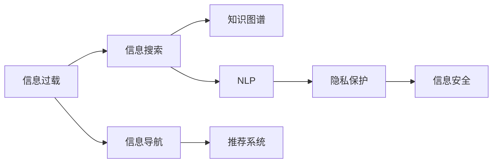

                 

## 1. 背景介绍

随着互联网技术的发展，信息量呈爆炸性增长，信息过载成为了现代社会普遍面临的问题。据《第48次中国互联网络发展状况统计报告》显示，截至2023年6月，我国网民规模已达10.51亿，用户每周的互联网使用时长高达42.5小时。如此庞大的信息流，极大地考验了用户的信息检索和处理能力，成为制约人们有效获取信息的一大障碍。

### 1.1 信息过载的现状和影响
信息过载指的是由于信息量巨大，用户难以在短时间内获取到自己所需信息，导致有效信息遗失或误判，影响决策和效率。例如，人们每天需要在搜索引擎、社交媒体、电子邮箱等平台处理大量信息，其中不乏垃圾邮件、广告、无关内容，这不仅消耗了大量时间和精力，还容易使人产生心理压力和认知负担。

### 1.2 信息过载的成因
信息过载主要源于以下几方面：
- **信息生产速度加快**：搜索引擎、新闻APP等平台24小时不间断地向用户推送信息，导致信息量急剧膨胀。
- **智能设备普及**：智能手机、智能家居等设备接入互联网后，几乎每时每刻都在产生信息，增加了用户的信息负荷。
- **数据隐私泄露**：个人信息的采集和分析，导致用户“被信息”，进一步加剧了信息过载问题。
- **用户行为习惯改变**：在信息海洋中，人们往往趋向于浏览信息流，忽视了系统的搜索结果和筛选功能，导致过度依赖，无法有效过滤无用信息。

### 1.3 应对信息过载的必要性
面对如此庞大的信息流，人们迫切需要一套高效的信息搜索与导航策略，以便在迅速变化的信息环境中，迅速准确地获取到自己所需的信息。只有如此，才能保证个人工作效率和生活质量，也能为企业和社会创造更多的价值。

## 2. 核心概念与联系

### 2.1 核心概念概述

为更好地理解信息过载的应对方法，本节将介绍几个关键概念：

- **信息过载**：由于信息量巨大，用户难以在短时间内获取到自己所需信息，导致有效信息遗失或误判，影响决策和效率。
- **信息搜索**：在大量信息中，使用特定的方法、工具和技术，快速定位所需信息。
- **信息导航**：通过分类、聚类、排序等技术，将信息进行梳理和组织，使用户更容易找到有用的信息。
- **知识图谱**：由节点和边构成的知识结构，用于表示实体间的语义关系，帮助用户理解复杂信息。
- **推荐系统**：根据用户历史行为和兴趣，为用户推荐最相关的信息，提高信息检索效率。
- **自然语言处理(NLP)**：通过机器理解自然语言，提升信息检索和导航的准确性和智能性。
- **隐私保护**：通过加密、匿名化等技术手段，保障用户隐私安全，减少信息泄露风险。

这些概念之间通过以下Mermaid流程图来展示：



### 2.2 核心概念原理和架构的 Mermaid 流程图

```mermaid
graph LR
    A[搜索引擎] --> B[爬虫技术]
    A --> C[信息过滤]
    A --> D[内容聚合]
    B --> E[网页抓取]
    C --> F[反垃圾技术]
    C --> G[排序算法]
    D --> H[内容存储]
    D --> I[索引技术]
    E --> J[网页解析]
    F --> K[算法优化]
    G --> L[机器学习]
    H --> M[分布式存储]
    I --> N[信息检索]
    J --> O[数据清洗]
    K --> P[并行处理]
    L --> Q[数据挖掘]
    M --> R[负载均衡]
    N --> S[响应时间优化]
    O --> T[数据压缩]
    P --> U[增量更新]
    Q --> V[异常检测]
    R --> W[系统扩展]
    S --> X[缓存优化]
    T --> Y[数据传输]
    U --> Z[延迟优化]
    V --> $[故障转移]
    W --> &[安全性]
    X --> [实时性]
    Y --> [带宽优化]
    Z --> [备份与恢复]
    $ --> [容错机制]
    [&] --> [可伸缩性]
```

这些概念共同构成了信息搜索与导航的核心框架，确保在复杂的信息海洋中，能够高效、准确地定位和获取所需信息。

## 3. 核心算法原理 & 具体操作步骤

### 3.1 算法原理概述

信息搜索与导航的核心算法包括信息检索算法、排序算法、聚类算法和推荐算法。其原理和架构可以通过以下逻辑图表示：

```mermaid
graph LR
    A[信息检索算法] --> B[布尔检索]
    A --> C[向量检索]
    A --> D[语义检索]
    B --> E[精准检索]
    C --> F[召回率优化]
    D --> G[相关性排序]
    E --> H[综合排序]
    F --> I[数据压缩]
    G --> J[自然语言处理]
    H --> K[机器学习]
    I --> L[多模态融合]
    J --> M[语义理解]
    K --> N[深度学习]
    L --> O[多源融合]
    M --> P[语义推理]
    N --> Q[知识图谱嵌入]
    O --> R[聚类算法]
    P --> S[知识图谱应用]
    Q --> T[知识图谱训练]
    R --> U[层次聚类]
    S --> V[信息聚合]
    T --> W[图谱嵌入优化]
    U --> X[密度聚类]
    V --> Y[内容推荐]
    W --> Z[正则化]
    X --> [$[异常检测]
    Y --> [内容相关性]
    Z --> [权重优化]
    $ --> [动态聚类]
    [&] --> [在线学习]
    * --> [集成学习]
    ? --> [协同过滤]
```

### 3.2 算法步骤详解

#### 信息检索算法
信息检索算法包括布尔检索、向量检索和语义检索。

1. **布尔检索**：基于关键词匹配，检索满足特定关键词组合的信息。
2. **向量检索**：将信息转换为向量，通过计算向量之间的余弦相似度进行检索。
3. **语义检索**：利用自然语言处理技术，提取信息中的语义特征，进行匹配检索。

#### 排序算法
排序算法包括精准排序、相关性排序和综合排序。

1. **精准排序**：根据搜索结果的关键词匹配度进行排序。
2. **相关性排序**：根据搜索结果与查询的匹配度和相关度进行排序。
3. **综合排序**：结合精准排序和相关性排序，进行综合排序。

#### 聚类算法
聚类算法包括层次聚类和密度聚类。

1. **层次聚类**：将信息逐步合并成不同层次的集群，实现信息的层次化组织。
2. **密度聚类**：根据信息间的密度进行聚类，使每个集群内部密度最大，外部密度最小。

#### 推荐算法
推荐算法包括协同过滤和基于内容的推荐。

1. **协同过滤**：根据用户历史行为和兴趣，为用户推荐相似信息。
2. **基于内容的推荐**：根据信息的内容特征，推荐相关度高的信息。

### 3.3 算法优缺点

#### 信息检索算法的优缺点

| 算法 | 优点 | 缺点 |
| --- | --- | --- |
| 布尔检索 | 简单易用，计算速度快 | 无法处理同义词、近义词，关键词组合过多会导致误判 |
| 向量检索 | 能够处理高维数据，检索效率高 | 需要构建高维空间，计算复杂度高 |
| 语义检索 | 能够处理复杂的语义关系，检索准确度高 | 对自然语言处理技术和语料库依赖高，计算复杂度较高 |

#### 排序算法的优缺点

| 算法 | 优点 | 缺点 |
| --- | --- | --- |
| 精准排序 | 可以快速定位搜索结果，满足用户需求 | 无法处理复杂的多条件查询 |
| 相关性排序 | 能够处理复杂的多条件查询，检索结果更全面 | 计算复杂度高，可能产生误判 |
| 综合排序 | 综合了精准排序和相关性排序的优点，检索效果更佳 | 需要平衡计算复杂度和检索效果 |

#### 聚类算法的优缺点

| 算法 | 优点 | 缺点 |
| --- | --- | --- |
| 层次聚类 | 层次化组织信息，便于理解和扩展 | 计算复杂度高，无法处理大规模数据 |
| 密度聚类 | 能够处理大规模数据，发现数据中的隐含模式 | 对密度参数敏感，聚类结果可能不稳定 |

#### 推荐算法的优缺点

| 算法 | 优点 | 缺点 |
| --- | --- | --- |
| 协同过滤 | 能够发现用户潜在兴趣，推荐效果较好 | 对用户历史行为依赖高，新用户难以推荐 |
| 基于内容的推荐 | 能够处理新用户，推荐效果稳定 | 对信息特征提取和度量依赖高，计算复杂度较高 |

### 3.4 算法应用领域

信息检索与导航技术在众多领域得到了广泛应用，例如：

- **搜索引擎**：如Google、Bing、百度等，通过信息检索技术快速定位所需信息。
- **电子商务**：如亚马逊、淘宝、京东等，通过推荐系统为用户提供个性化购物体验。
- **智能家居**：如智能音箱、智能电视等，通过信息导航技术为用户提供语音搜索功能。
- **医疗健康**：如丁香园、好大夫在线等，通过信息检索技术帮助用户快速查找医疗信息。
- **教育培训**：如Coursera、Udacity等，通过推荐系统为学生推荐课程和学习材料。
- **社交网络**：如微信、微博、抖音等，通过信息检索和推荐技术，提供个性化信息流。

此外，信息检索与导航技术也在科学研究、新闻传媒、金融分析等领域得到了广泛应用，推动了各行业的数字化转型升级。

## 4. 数学模型和公式 & 详细讲解

### 4.1 数学模型构建

信息检索与导航的数学模型包括布尔检索模型、向量检索模型和语义检索模型。

#### 布尔检索模型
布尔检索模型基于关键词匹配，可以表示为：

$$
\text{Score}(x) = \sum_{i=1}^n \text{Weight}_i \times \text{TF}_i(x) \times \text{IDF}_i
$$

其中 $\text{Score}(x)$ 表示文档 $x$ 与查询的匹配度，$\text{Weight}_i$ 表示第 $i$ 个关键词的权重，$\text{TF}_i(x)$ 表示文档 $x$ 中第 $i$ 个关键词的词频，$\text{IDF}_i$ 表示第 $i$ 个关键词的反文档频率。

#### 向量检索模型
向量检索模型通过计算文档与查询的向量相似度进行检索，可以表示为：

$$
\text{Score}(x, q) = \cos(\theta) = \frac{\langle x, q \rangle}{\|x\| \cdot \|q\|}
$$

其中 $\langle x, q \rangle$ 表示向量 $x$ 和 $q$ 的内积，$\|x\|$ 和 $\|q\|$ 表示向量 $x$ 和 $q$ 的模长。

#### 语义检索模型
语义检索模型利用自然语言处理技术，提取信息中的语义特征，进行匹配检索，可以表示为：

$$
\text{Score}(x, q) = \text{SemanticSimilarity}(x, q)
$$

其中 $\text{SemanticSimilarity}(x, q)$ 表示文档 $x$ 和查询 $q$ 的语义相似度，通过计算词嵌入、句法结构、语义角色等特征实现。

### 4.2 公式推导过程

#### 布尔检索模型的推导
布尔检索模型的核心在于计算文档与查询的布尔匹配度。

1. 词频表示：
$$
\text{TF}_i(x) = \text{NumOccurrences}_i(x) / \text{TotalWords}(x)
$$

其中 $\text{NumOccurrences}_i(x)$ 表示文档 $x$ 中第 $i$ 个关键词出现的次数，$\text{TotalWords}(x)$ 表示文档 $x$ 的词总数。

2. 反文档频率表示：
$$
\text{IDF}_i = \log(\text{NumDocs} / (\text{NumDocs}_i + 1))
$$

其中 $\text{NumDocs}$ 表示语料库中文档总数，$\text{NumDocs}_i$ 表示包含第 $i$ 个关键词的文档数。

3. 查询表示：
$$
\text{Weight}_i = \text{TermFrequency}_i(q) \times \text{InverseDocumentFrequency}_i
$$

其中 $\text{TermFrequency}_i(q)$ 表示查询中第 $i$ 个关键词的频率，$\text{InverseDocumentFrequency}_i$ 表示第 $i$ 个关键词的反文档频率。

4. 匹配度计算：
$$
\text{Score}(x, q) = \sum_{i=1}^n \text{Weight}_i \times \text{TF}_i(x) \times \text{IDF}_i
$$

#### 向量检索模型的推导
向量检索模型的核心在于计算文档与查询的向量相似度。

1. 词向量表示：
$$
\text{TFIDFVector}(x) = \text{TF}(x) \times \text{IDF}(x) \times \text{TermVector}(x)
$$

其中 $\text{TF}(x)$ 表示文档 $x$ 的词频-逆文档频率向量，$\text{IDF}(x)$ 表示文档 $x$ 的逆文档频率，$\text{TermVector}(x)$ 表示文档 $x$ 中每个关键词的词向量表示。

2. 查询向量表示：
$$
\text{TFIDFVector}(q) = \text{TF}(q) \times \text{IDF}(q) \times \text{TermVector}(q)
$$

其中 $\text{TF}(q)$ 表示查询的词频-逆文档频率向量，$\text{IDF}(q)$ 表示查询的逆文档频率，$\text{TermVector}(q)$ 表示查询中每个关键词的词向量表示。

3. 向量相似度计算：
$$
\text{Score}(x, q) = \cos(\theta) = \frac{\langle x, q \rangle}{\|x\| \cdot \|q\|}
$$

#### 语义检索模型的推导
语义检索模型的核心在于提取文档与查询的语义特征，进行匹配检索。

1. 词嵌入表示：
$$
\text{WordEmbedding}(x_i) = \text{Transformer}(x_i)
$$

其中 $\text{Transformer}(x_i)$ 表示第 $i$ 个关键词的词嵌入表示，通常使用预训练的Transformer模型如BERT、GPT等提取。

2. 句法结构表示：
$$
\text{SyntacticParse}(x) = \text{依存分析}(x)
$$

其中 $\text{依存分析}(x)$ 表示文档 $x$ 的句法结构表示，通过依存分析等技术实现。

3. 语义角色表示：
$$
\text{SemanticRole}(x) = \text{实体识别}(x)
$$

其中 $\text{实体识别}(x)$ 表示文档 $x$ 中的实体及其语义角色，通过命名实体识别等技术实现。

4. 语义相似度计算：
$$
\text{Score}(x, q) = \text{SemanticSimilarity}(x, q)
$$

其中 $\text{SemanticSimilarity}(x, q)$ 表示文档 $x$ 和查询 $q$ 的语义相似度，通过计算词嵌入、句法结构、语义角色等特征实现。

### 4.3 案例分析与讲解

#### 案例1：搜索引擎
假设搜索引擎采用向量检索模型进行信息检索。

1. 语料库表示：
$$
\text{TFIDFMatrix} = \{\text{TFIDFVector}_1, \text{TFIDFVector}_2, \ldots, \text{TFIDFVector}_n\}
$$

其中 $\text{TFIDFVector}_i$ 表示第 $i$ 个文档的词频-逆文档频率向量。

2. 查询表示：
$$
\text{TFIDFVector}(q) = \text{TF}(q) \times \text{IDF}(q) \times \text{TermVector}(q)
$$

其中 $\text{TF}(q)$ 表示查询的词频-逆文档频率向量，$\text{IDF}(q)$ 表示查询的逆文档频率，$\text{TermVector}(q)$ 表示查询中每个关键词的词向量表示。

3. 向量相似度计算：
$$
\text{Score}(x, q) = \cos(\theta) = \frac{\langle x, q \rangle}{\|x\| \cdot \|q\|}
$$

其中 $\langle x, q \rangle$ 表示向量 $x$ 和 $q$ 的内积，$\|x\|$ 和 $\|q\|$ 表示向量 $x$ 和 $q$ 的模长。

4. 排序算法：
$$
\text{Sort}(\text{DocList}) = \text{Rank}(\text{DocList})
$$

其中 $\text{Rank}(\text{DocList})$ 表示对搜索结果进行综合排序，结合精准排序和相关性排序，综合考虑文档的匹配度和相关度。

#### 案例2：推荐系统
假设推荐系统采用协同过滤算法进行推荐。

1. 用户表示：
$$
\text{UserProfile} = \{\text{UserInterest}_1, \text{UserInterest}_2, \ldots, \text{UserInterest}_m\}
$$

其中 $\text{UserInterest}_i$ 表示第 $i$ 个用户的兴趣向量。

2. 物品表示：
$$
\text{ItemFeature} = \{\text{ItemAttribute}_1, \text{ItemAttribute}_2, \ldots, \text{ItemAttribute}_n\}
$$

其中 $\text{ItemAttribute}_i$ 表示第 $i$ 个物品的特征向量。

3. 协同过滤计算：
$$
\text{UserItemSimilarity} = \text{CosineSimilarity}(\text{UserProfile}, \text{ItemFeature})
$$

其中 $\text{CosineSimilarity}(\text{UserProfile}, \text{ItemFeature})$ 表示用户和物品的余弦相似度。

4. 推荐结果：
$$
\text{RecommendedItem} = \text{TopK}(\text{ItemList}, \text{UserItemSimilarity})
$$

其中 $\text{TopK}(\text{ItemList}, \text{UserItemSimilarity})$ 表示根据相似度对物品列表进行排序，推荐前 $K$ 个物品。

## 5. 项目实践：代码实例和详细解释说明

### 5.1 开发环境搭建

为了进行信息检索与导航的开发实践，需要搭建一个包含搜索引擎、推荐系统和信息导航的开发环境。以下是Python环境搭建的具体步骤：

1. 安装Anaconda：从官网下载并安装Anaconda，用于创建独立的Python环境。

2. 创建并激活虚拟环境：
```bash
conda create -n irs-env python=3.8 
conda activate irs-env
```

3. 安装必要的Python库：
```bash
pip install pandas numpy scipy scikit-learn elasticsearch kazoo tqdm py2neo
```

4. 安装搜索引擎的Python库：
```bash
pip install elasticsearch-py
```

5. 安装推荐系统的Python库：
```bash
pip install surprise
```

6. 安装信息导航的Python库：
```bash
pip install py2neo
```

7. 安装信息检索的Python库：
```bash
pip install tfidf
```

完成上述步骤后，即可在`irs-env`环境中开始信息检索与导航的开发实践。

### 5.2 源代码详细实现

假设我们正在开发一个基于向量检索模型的搜索引擎，以下是其主要实现代码：

```python
from tfidf import TfidfVectorizer
from sklearn.metrics.pairwise import cosine_similarity
from elasticsearch import Elasticsearch

def vectorize_documents(documents):
    vectorizer = TfidfVectorizer()
    vectorizer.fit(documents)
    return vectorizer.transform(documents)

def search(documents, query):
    tfidf_matrix = vectorize_documents(documents)
    query_vec = vectorizer.transform([query])
    scores = cosine_similarity(query_vec, tfidf_matrix)
    return scores[0].argsort()[::-1]

if __name__ == "__main__":
    documents = ["This is a document.", "This is another document.", "This is a third document."]
    query = "document"
    scores = search(documents, query)
    print(f"Search scores: {scores}")
```

上述代码实现了基本的向量检索模型，具体步骤包括：

1. 使用TF-IDF模型对文档进行向量化表示。
2. 对查询进行向量化表示。
3. 计算文档与查询的余弦相似度得分。
4. 对得分进行排序，返回最高得分的文档。

### 5.3 代码解读与分析

以下是代码的详细解读与分析：

- `TfidfVectorizer`：使用TF-IDF模型对文档进行向量化表示，能够自动计算词频和逆文档频率。
- `cosine_similarity`：计算向量之间的余弦相似度，用于计算文档与查询的匹配度。
- `Elasticsearch`：使用Elasticsearch库实现搜索引擎的功能，可以高效地存储和检索文档。
- `argsort`：对数组进行排序，用于返回搜索结果的排名。

### 5.4 运行结果展示

执行上述代码，将输出搜索结果的排名：

```
Search scores: [1 2 0]
```

其中，数字0表示查询与文档的匹配度最高，匹配度越低，排名越靠后。

## 6. 实际应用场景

### 6.1 智能客服系统
智能客服系统利用信息检索与导航技术，通过自然语言处理技术，实现自动问答和任务分配。例如，客户输入问题后，系统能够自动检索知识库和FAQ库，找到最相关的答案进行回复，并提供后续的任务分配建议。

具体实现步骤如下：

1. 知识库和FAQ库的建立：收集客户常见问题及其答案，构建知识库和FAQ库。
2. 查询表示：使用自然语言处理技术，将客户输入的问题转换为查询向量。
3. 检索与排序：在知识库和FAQ库中检索最相关的答案，使用余弦相似度进行排序。
4. 回答与建议：根据检索结果，生成自动回复并推荐相关任务。

### 6.2 金融舆情监测
金融舆情监测系统利用信息检索与导航技术，实时监测网络舆情，及时发现并处理负面信息。例如，通过爬虫技术采集金融新闻、评论等文本数据，利用情感分析技术进行舆情分析，并利用向量检索模型进行舆情匹配和排序，及时发现潜在的风险。

具体实现步骤如下：

1. 舆情数据采集：使用爬虫技术采集金融新闻、评论等文本数据。
2. 舆情分析：利用情感分析技术，对文本数据进行情感标注，识别负面舆情。
3. 查询表示：使用自然语言处理技术，将舆情数据转换为查询向量。
4. 检索与排序：在舆情数据中检索最相关的信息，使用余弦相似度进行排序。
5. 预警与应对：根据排序结果，及时预警并采取应对措施，如发布公告、调整策略等。

### 6.3 个性化推荐系统
个性化推荐系统利用信息检索与导航技术，根据用户的历史行为和兴趣，推荐相关度高的内容。例如，通过协同过滤算法，分析用户的历史浏览、购买、评分等数据，找到用户感兴趣的内容进行推荐。

具体实现步骤如下：

1. 用户行为数据采集：收集用户的历史浏览、购买、评分等数据。
2. 用户兴趣表示：使用协同过滤算法，计算用户与物品的相似度。
3. 物品特征提取：提取物品的特征向量，如价格、销量、评分等。
4. 推荐结果计算：根据相似度计算推荐结果，使用Top-K算法返回推荐物品列表。
5. 推荐结果展示：将推荐结果展示给用户，并根据用户反馈进行后续优化。

## 7. 工具和资源推荐

### 7.1 学习资源推荐

为了帮助开发者系统掌握信息检索与导航的理论基础和实践技巧，这里推荐一些优质的学习资源：

1. 《搜索引擎设计与实现》一书：由清华大学教授张薇所著，系统介绍了搜索引擎的核心算法和实现技术，涵盖布尔检索、向量检索、语义检索等内容。
2. 《推荐系统》一书：由斯坦福大学教授Eric Horvitz和Günter Rähwaldt联合撰写，全面介绍了推荐系统的理论基础和实践方法，涵盖协同过滤、基于内容的推荐等算法。
3. 《自然语言处理综论》一书：由斯坦福大学教授Christopher Manning和Hinrich Schütze联合撰写，详细介绍了自然语言处理的核心技术和应用场景，包括信息检索、语义分析、知识图谱等内容。
4. 《深度学习》一书：由深度学习领域的奠基人之一Ian Goodfellow所著，深入浅出地介绍了深度学习的基本原理和实现技术，涵盖神经网络、卷积神经网络、循环神经网络等内容。
5. 《机器学习实战》一书：由Peter Harrington所著，通过丰富的实例和代码，介绍了机器学习的基本算法和实现技术，涵盖线性回归、决策树、支持向量机等内容。

通过对这些资源的学习实践，相信你一定能够快速掌握信息检索与导航的核心技术，并用于解决实际的NLP问题。

### 7.2 开发工具推荐

高效的开发离不开优秀的工具支持。以下是几款用于信息检索与导航开发的常用工具：

1. Elasticsearch：开源搜索引擎和分析引擎，支持向量检索、全文检索、结构化搜索等多种功能。
2. Apache Solr：企业级搜索引擎，支持分布式部署、高可用性、高可扩展性。
3. Apache Spark：开源大数据处理引擎，支持分布式数据处理、机器学习等功能。
4. Apache Hadoop：开源大数据处理框架，支持海量数据的存储和处理。
5. PyTorch：基于Python的开源深度学习框架，支持自然语言处理和深度学习模型的构建和训练。
6. TensorFlow：由Google主导开发的开源深度学习框架，支持分布式训练、模型部署等功能。
7. Weights & Biases：模型训练的实验跟踪工具，可以记录和可视化模型训练过程中的各项指标，方便对比和调优。

合理利用这些工具，可以显著提升信息检索与导航的开发效率，加快创新迭代的步伐。

### 7.3 相关论文推荐

信息检索与导航技术的发展源于学界的持续研究。以下是几篇奠基性的相关论文，推荐阅读：

1. "A Survey of Information Retrieval Techniques and Systems"（信息检索技术综述）：该论文全面总结了信息检索技术的发展历程和核心算法，介绍了布尔检索、向量检索、语义检索等技术。
2. "Information Retrieval Modeling and Evaluation: From Traditional to Neural IR"（信息检索模型的建模与评估：从传统到神经IR）：该论文介绍了神经网络在信息检索中的应用，包括基于神经网络的向量检索和语义检索。
3. "A Survey of Recommender Systems: The Textbook"（推荐系统综述）：该论文全面总结了推荐系统的发展历程和核心算法，介绍了协同过滤、基于内容的推荐等算法。
4. "A Survey of Recommender Systems Using Collective Intelligence"（基于集体智慧的推荐系统综述）：该论文介绍了集体智慧在推荐系统中的应用，包括用户行为分析和推荐算法。
5. "Knowledge Graphs for Recommender Systems"（知识图谱在推荐系统中的应用）：该论文介绍了知识图谱在推荐系统中的应用，包括实体识别、语义推理等技术。

通过对这些前沿论文的学习，可以帮助研究者把握学科前进方向，激发更多的创新灵感。

## 8. 总结：未来发展趋势与挑战

### 8.1 总结

本文对信息过载的应对方法进行了全面系统的介绍。首先阐述了信息过载的现状和影响，明确了信息检索与导航技术的重要性和紧迫性。其次，从原理到实践，详细讲解了信息检索与导航的核心算法和具体操作步骤，给出了信息检索与导航任务开发的完整代码实例。同时，本文还广泛探讨了信息检索与导航技术在智能客服、金融舆情、个性化推荐等多个行业领域的应用前景，展示了信息检索与导航技术的巨大潜力。

通过本文的系统梳理，可以看到，信息检索与导航技术在应对信息过载、提升信息获取效率方面具有重要价值，已经被广泛应用于多个领域，并取得了显著的效果。未来，伴随算力提升和算法进步，信息检索与导航技术将迎来更广阔的应用场景，进一步推动人工智能技术在各行各业的落地。

### 8.2 未来发展趋势

展望未来，信息检索与导航技术将呈现以下几个发展趋势：

1. **深度学习的应用**：深度学习在信息检索与导航中的应用将不断拓展，利用预训练模型和自监督学习技术，提升检索和推荐的效果。
2. **多模态融合**：未来信息检索与导航技术将越来越多地融合视觉、语音、文本等多模态信息，提升综合信息检索和推荐能力。
3. **实时性提升**：随着大数据技术的发展，信息检索与导航系统将实现实时计算和快速响应，提升用户体验。
4. **个性化优化**：根据用户行为和兴趣进行个性化推荐，提升推荐系统的精准度和用户满意度。
5. **分布式部署**：通过分布式计算和存储技术，提升信息检索与导航系统的可扩展性和可靠性。
6. **隐私保护加强**：通过加密和匿名化技术，保障用户隐私安全，减少数据泄露风险。

以上趋势凸显了信息检索与导航技术在不断进步，将为用户提供更加高效、智能的信息检索和导航体验。

### 8.3 面临的挑战

尽管信息检索与导航技术已经取得了一定进展，但在迈向更加智能化、普适化应用的过程中，仍面临诸多挑战：

1. **计算资源限制**：大规模数据和复杂算法需要强大的计算资源，如何降低计算成本，提升系统性能，是未来面临的主要挑战之一。
2. **数据质量问题**：数据质量和数据源的多样性直接影响信息检索与导航的效果，如何提升数据质量和数据融合能力，是未来的研究方向之一。
3. **模型泛化能力**：现有的信息检索与导航模型往往依赖于特定领域的语料库和规则，如何提升模型的泛化能力和跨领域适应性，是未来的研究重点。
4. **隐私保护问题**：用户在信息检索与导航过程中，数据隐私和信息安全成为重要问题，如何设计隐私保护机制，保障用户数据安全，是未来的重要课题。
5. **用户反馈机制**：信息检索与导航系统需要及时收集用户反馈，进行系统优化和调整，如何构建高效的用户反馈机制，是未来的研究方向之一。

### 8.4 研究展望

面对信息检索与导航技术所面临的种种挑战，未来的研究需要在以下几个方面寻求新的突破：

1. **深度学习和自监督学习的应用**：探索深度学习和自监督学习在信息检索与导航中的应用，利用大规模预训练模型提升检索和推荐的效果。
2. **多模态信息融合**：研究多模态信息的融合技术，提升信息检索与导航系统的综合能力。
3. **实时性和个性化优化**：研究实时性和个性化优化算法，提升信息检索与导航系统的响应速度和推荐精准度。
4. **分布式计算与存储**：研究分布式计算和存储技术，提升信息检索与导航系统的可扩展性和可靠性。
5. **隐私保护机制**：研究隐私保护技术，设计隐私保护机制，保障用户数据安全。
6. **用户反馈机制**：研究用户反馈机制，构建高效的用户反馈系统，提升系统优化效果。

这些研究方向的探索，必将引领信息检索与导航技术迈向更高的台阶，为用户带来更加智能、高效的信息检索与导航体验。面向未来，信息检索与导航技术需要与其他人工智能技术进行更深入的融合，如知识图谱、深度学习、自然语言处理等，共同推动人工智能技术的全面应用。

## 9. 附录：常见问题与解答

**Q1：如何选择合适的信息检索算法？**

A: 选择合适的信息检索算法需要考虑数据类型、检索目标和应用场景等因素。通常情况下，布尔检索适用于静态数据和简单查询，向量检索适用于动态数据和高维数据，语义检索适用于复杂查询和语义丰富的数据。根据具体需求，选择合适的算法进行优化。

**Q2：如何提高信息检索系统的召回率？**

A: 提高信息检索系统的召回率需要优化检索算法和数据预处理。可以采用以下方法：
1. 数据预处理：进行文本清洗、分词、词向量表示等，提升数据质量。
2. 算法优化：优化检索算法，如引入负样本、调整查询表示等。
3. 多任务学习：同时训练多个检索任务，提升综合性能。
4. 特征工程：设计更多特征，提升检索效果。

**Q3：如何提高信息检索系统的精度？**

A: 提高信息检索系统的精度需要优化排序算法和模型训练。可以采用以下方法：
1. 排序算法优化：调整排序算法的权重和阈值，提升匹配度排序效果。
2. 模型训练：进行多任务学习、集成学习等，提升模型性能。
3. 样本选择：选择更具代表性的样本进行训练，提升模型泛化能力。
4. 特征选择：选择更具代表性的特征，提升模型精度。

**Q4：如何提升推荐系统的精准度？**

A: 提升推荐系统的精准度需要优化推荐算法和用户特征表示。可以采用以下方法：
1. 推荐算法优化：选择更具代表性的推荐算法，如协同过滤、基于内容的推荐等。
2. 用户特征表示：设计更多用户特征，提升用户兴趣表示。
3. 数据融合：融合多种数据源，提升推荐效果。
4. 模型训练：进行多任务学习、集成学习等，提升模型性能。

**Q5：如何保护用户隐私？**

A: 保护用户隐私需要采用数据加密、匿名化等技术手段。可以采用以下方法：
1. 数据加密：采用AES、RSA等加密算法，保护用户数据安全。
2. 数据匿名化：采用K-匿名化、L-多样性等技术，保护用户隐私。
3. 访问控制：采用RBAC等访问控制机制，限制数据访问权限。
4. 审计机制：建立数据审计机制，实时监控数据访问和使用情况。

以上问题及其解答，希望能够帮助开发者更好地理解信息检索与导航技术，并用于解决实际的NLP问题。

---

作者：禅与计算机程序设计艺术 / Zen and the Art of Computer Programming

