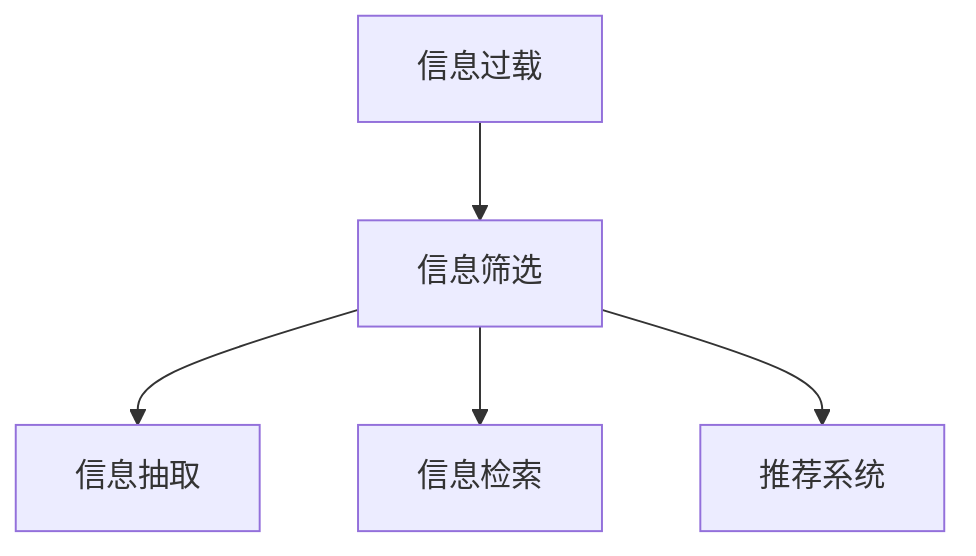

                 

## 1. 背景介绍

### 1.1 问题由来
随着互联网的普及和信息技术的进步，全球范围内的信息量呈爆炸式增长。人们每天都被海量的文本、图像、视频等数据信息所包围，其中包含了大量有价值和无价值、有偏见和无偏见、有误导和有事实的信息。如何从这信息洪流中筛选出对自身有用的信息，成为了现代人面临的巨大挑战。

### 1.2 问题核心关键点
信息过载的本质在于信息的超量和不充分标注。在这种背景下，信息筛选的本质是要在大量不充分标注的信息中找到有价值的部分，从而节省时间和注意力，提升信息获取的效率和质量。

### 1.3 问题研究意义
对于信息筛选的研究，具有以下重要意义：

1. **提升信息获取效率**：有效信息筛选能够显著减少用户在信息获取过程中的筛选时间和成本。
2. **避免信息误导**：在海量信息中，许多信息可能存在误导或错误，筛选出有价值、可靠的信息有助于避免信息误导。
3. **提高决策质量**：高质量的信息筛选能够为决策提供坚实的依据，减少决策中的不确定性和错误。
4. **增强知识积累**：通过筛选，用户能够高效积累有价值知识，提升个人或企业的知识水平。
5. **支持智能交互**：智能系统通过学习用户筛选行为，能够提升交互的智能性和个性化水平。

## 2. 核心概念与联系

### 2.1 核心概念概述

本节将介绍几个核心概念，并解释它们之间的联系。

- **信息过载（Information Overload）**：指在短时间内接收到超量信息，导致难以处理的现象。
- **信息筛选（Information Filtering）**：指从大量信息中筛选出有价值信息的过程。
- **信息漏斗（Information Funnel）**：信息筛选的过程往往呈现漏斗状，从信息洪流中逐渐缩小筛选范围。
- **信息抽取（Information Extraction）**：从原始数据中抽取结构化信息，供后续处理使用。
- **信息检索（Information Retrieval）**：通过查询从大量信息中获取所需信息的过程。
- **推荐系统（Recommendation System）**：利用用户行为数据，推荐用户可能感兴趣的信息。

这些概念之间存在紧密联系，信息过载催生了信息筛选的需求，信息抽取和检索则提供了技术手段，推荐系统则是信息筛选的一种典型应用。

### 2.2 核心概念原理和架构的 Mermaid 流程图



## 3. 核心算法原理 & 具体操作步骤
### 3.1 算法原理概述

信息筛选的本质是通过算法从海量的、不完全标注的信息中挑选出有价值的部分。常见的方法包括：

- **基于内容的过滤（Content-based Filtering）**：根据信息的内容特征（如文本关键词、图像特征等）进行筛选。
- **基于协同过滤（Collaborative Filtering）**：根据用户的历史行为和偏好，进行相似度计算，筛选出相似信息。
- **基于规则的过滤（Rule-based Filtering）**：通过预设的规则，自动执行信息筛选。
- **基于机器学习的过滤（Machine Learning-based Filtering）**：通过构建分类器或回归模型，从数据中学习信息筛选的规律。

这些方法各有优劣，具体应用需要结合数据特点和任务需求进行选择。

### 3.2 算法步骤详解

以下以基于机器学习的过滤方法为例，详细介绍信息筛选的具体操作步骤。

#### 3.2.1 数据准备
- 收集和标注数据集。通常包含大量无标签的原始数据，以及部分标注好的有价值信息。
- 对数据进行预处理，包括去重、清洗、分词、特征提取等。

#### 3.2.2 模型训练
- 选择合适的算法模型，如决策树、随机森林、SVM、神经网络等。
- 将标注数据分为训练集和测试集，利用训练集对模型进行训练。
- 使用交叉验证等技术，优化模型超参数。

#### 3.2.3 模型评估
- 在测试集上评估模型性能，使用准确率、召回率、F1-score等指标评估分类效果。
- 通过混淆矩阵、ROC曲线等工具，可视化模型分类结果。

#### 3.2.4 信息筛选
- 对于新信息，输入到训练好的模型中，获取分类结果。
- 根据分类结果，决定是否过滤掉该信息。
- 对于多分类任务，可以设计相应的策略，如只保留评分最高的前n条信息。

### 3.3 算法优缺点

基于机器学习的筛选方法具有以下优点：

- **灵活性高**：可以根据特定任务需求设计模型。
- **泛化能力强**：能够在不同数据集上表现稳定。
- **可解释性强**：可以通过特征重要性分析，了解模型决策依据。

其缺点包括：

- **数据标注成本高**：需要大量高质量的标注数据。
- **模型复杂度高**：模型构建和训练耗时较长。
- **可解释性不足**：黑盒模型的决策过程难以解释。

### 3.4 算法应用领域

信息筛选技术广泛应用于以下领域：

- **新闻推荐**：根据用户浏览历史和兴趣标签，推荐新闻信息。
- **广告投放**：筛选适合用户特征的广告，提升广告效果。
- **内容生成**：自动推荐阅读内容，提高用户阅读体验。
- **搜索引擎**：在搜索结果中筛选出最相关的网页，提升搜索效率。
- **电商推荐**：根据用户浏览和购买历史，推荐商品。
- **社交网络**：推荐用户可能感兴趣的内容，增加用户粘性。

## 4. 数学模型和公式 & 详细讲解 & 举例说明

### 4.1 数学模型构建

基于机器学习的信息筛选方法，通常以分类任务为例，构建二分类模型 $f(x)$。假设训练集为 $D=\{(x_i, y_i)\}_{i=1}^N$，其中 $x_i$ 为特征向量，$y_i \in \{0,1\}$ 为标签。模型的目标是最小化损失函数 $\mathcal{L}(f)$。

### 4.2 公式推导过程

以逻辑回归模型为例，损失函数为：

$$
\mathcal{L}(f) = -\frac{1}{N}\sum_{i=1}^N[y_i\log f(x_i)+(1-y_i)\log(1-f(x_i))]
$$

其中 $f(x_i)=\frac{1}{1+\exp(-\theta^T\phi(x_i))}$ 为逻辑回归模型的输出，$\phi(x)$ 为特征映射函数，$\theta$ 为模型参数。

### 4.3 案例分析与讲解

以广告点击率预测为例，假设数据集 $D=\{(x_i, y_i)\}_{i=1}^N$，其中 $x_i$ 为广告的特征向量，如广告词、点击位置、用户属性等，$y_i \in \{0,1\}$ 为是否点击标签。

可以构建逻辑回归模型 $f(x)=\frac{1}{1+\exp(-\theta^T\phi(x))}$，其中 $\phi(x)$ 为特征映射函数，如多项式特征、哈希特征等。模型训练和测试过程与前文所述类似，最终得到模型参数 $\theta$。对于新的广告 $x'$，计算其特征向量 $\phi(x')$ 并输入模型，预测是否点击的概率，如 $\hat{y}'=f(x')=\frac{1}{1+\exp(-\theta^T\phi(x'))}$。根据阈值 $\tau$，决定是否过滤掉该广告。

## 5. 项目实践：代码实例和详细解释说明
### 5.1 开发环境搭建

安装Python 3.7以上版本，安装必要的库包括scikit-learn、pandas、numpy等。可以使用Jupyter Notebook或PyCharm等IDE进行开发。

### 5.2 源代码详细实现

以下是一个简单的广告点击率预测的逻辑回归模型实现。

```python
from sklearn.linear_model import LogisticRegression
from sklearn.model_selection import train_test_split
from sklearn.metrics import roc_auc_score, precision_recall_curve
import pandas as pd
import numpy as np

# 加载数据集
df = pd.read_csv('ad clicks.csv')

# 数据预处理
X = df.drop('click', axis=1)
y = df['click']

# 划分训练集和测试集
X_train, X_test, y_train, y_test = train_test_split(X, y, test_size=0.2, random_state=42)

# 构建逻辑回归模型
clf = LogisticRegression()
clf.fit(X_train, y_train)

# 预测测试集
y_pred = clf.predict_proba(X_test)[:, 1]

# 计算AUC
auc = roc_auc_score(y_test, y_pred)
print('AUC:', auc)

# 绘制ROC曲线
fpr, tpr, _ = precision_recall_curve(y_test, y_pred)
plt.plot(fpr, tpr)
plt.xlabel('False Positive Rate')
plt.ylabel('True Positive Rate')
plt.title('ROC Curve')
plt.show()
```

### 5.3 代码解读与分析

- 数据加载：使用pandas库从CSV文件中加载数据集。
- 数据预处理：对特征和标签进行划分，保留特征X和标签y。
- 模型训练：使用scikit-learn的LogisticRegression模型训练。
- 预测和评估：对测试集进行预测，计算AUC和绘制ROC曲线。

## 6. 实际应用场景

### 6.1 新闻推荐

新闻推荐系统通过用户的阅读历史、评论和兴趣标签，自动推荐相关新闻。基于内容的过滤和协同过滤方法均在此场景中得到了广泛应用。

### 6.2 电商推荐

电商推荐系统根据用户的浏览、购买历史，推荐相关商品。推荐方法包括基于内容的过滤、协同过滤和混合推荐等。

### 6.3 社交网络推荐

社交网络推荐系统通过分析用户的行为和偏好，推荐可能感兴趣的内容，提高用户粘性。推荐方法包括基于内容的过滤、协同过滤等。

## 7. 工具和资源推荐
### 7.1 学习资源推荐

- **《Python机器学习》**：这是一本关于Python机器学习的经典书籍，涵盖机器学习基础知识和常用算法，适合初学者学习。
- **Coursera上的《Machine Learning》课程**：由斯坦福大学的Andrew Ng教授主讲的机器学习课程，内容系统全面，适合进一步提升理论基础。
- **Kaggle**：数据科学竞赛平台，提供丰富的数据集和竞赛机会，适合实践锻炼。
- **GitHub上的开源项目**：如Scikit-learn、TensorFlow等，提供了大量经典算法和数据集。

### 7.2 开发工具推荐

- **Jupyter Notebook**：适用于快速迭代实验和分享代码。
- **PyCharm**：功能强大的Python开发IDE，支持代码高亮、调试和版本控制。
- **TensorBoard**：可视化工具，适合展示模型训练和推理过程。
- **Wealth & Biases**：模型实验跟踪工具，帮助优化模型性能。

### 7.3 相关论文推荐

- **《信息检索技术》**：介绍了搜索引擎中的信息检索原理和技术。
- **《推荐系统》**：介绍了推荐系统中的协同过滤和内容推荐算法。
- **《机器学习：模型、算法与应用》**：介绍了机器学习的基础理论和常用算法。

## 8. 总结：未来发展趋势与挑战
### 8.1 研究成果总结

基于机器学习的筛选方法在信息筛选领域取得了显著进展，被广泛应用于新闻推荐、电商推荐、社交网络推荐等场景。

### 8.2 未来发展趋势

1. **深度学习的应用**：深度学习模型在信息筛选中的应用将更加广泛，如CNN、RNN、Transformer等。
2. **多模态融合**：结合文本、图像、语音等多种模态信息，提升筛选效果。
3. **个性化推荐**：通过多任务学习等技术，提升推荐系统的个性化水平。
4. **实时推荐**：通过流数据处理技术，实现实时信息筛选和推荐。
5. **跨领域应用**：将信息筛选技术应用于更多领域，如金融、医疗等。

### 8.3 面临的挑战

1. **数据质量问题**：数据的标注质量直接影响筛选效果。
2. **算法复杂度**：深度学习模型的训练和推理复杂度较高，需要高性能计算资源。
3. **可解释性不足**：黑盒模型的决策过程难以解释，影响用户信任。
4. **隐私保护**：用户数据的隐私保护问题需要充分考虑，避免数据泄露。

### 8.4 研究展望

未来的研究将重点关注以下方向：

1. **高效算法**：开发更高效的信息筛选算法，提升模型性能和实时性。
2. **可解释性**：增强筛选模型的可解释性，提升用户信任度。
3. **隐私保护**：设计隐私保护机制，确保用户数据安全。
4. **跨领域应用**：将信息筛选技术应用于更多领域，提升社会生产力和生活质量。

## 9. 附录：常见问题与解答

**Q1: 如何提高信息筛选的准确率？**

A: 可以通过以下方式提高信息筛选的准确率：

1. 数据清洗和预处理：去除噪声和无用数据，提高数据质量。
2. 特征工程：设计更好的特征，提升模型的泛化能力。
3. 模型优化：选择更好的算法和模型结构，优化模型超参数。
4. 集成学习：结合多种模型，提升整体性能。
5. 持续学习和更新：定期更新模型，适应数据分布的变化。

**Q2: 如何处理信息筛选中的冷启动问题？**

A: 冷启动问题指在新用户或新信息的情况下，缺乏足够的标注数据和行为数据。可以采用以下方法：

1. 基于内容的筛选：利用用户的历史行为数据和兴趣标签，进行初步筛选。
2. 推荐系统算法：利用协同过滤等算法，进行相似度计算，推荐相似信息。
3. 混合推荐：结合基于内容的筛选和协同过滤，提升推荐效果。
4. 数据注入：通过引导用户进行数据标注，快速提升模型性能。

**Q3: 如何优化信息筛选算法的计算效率？**

A: 可以通过以下方式优化信息筛选算法的计算效率：

1. 模型裁剪和剪枝：去除不必要的层和参数，减小模型尺寸。
2. 量化加速：将浮点模型转为定点模型，压缩存储空间，提高计算效率。
3. 分布式计算：利用多台机器进行并行计算，提升计算速度。
4. 增量学习：通过持续学习，逐步优化模型性能。

**Q4: 如何确保信息筛选算法的公平性和公正性？**

A: 确保信息筛选算法的公平性和公正性，可以从以下几个方面入手：

1. 数据采集：确保数据采集过程公平，不带有偏见。
2. 算法设计：在设计算法时，加入公平性约束，避免算法偏见。
3. 数据清洗：清洗数据集中的偏见信息，确保数据公平。
4. 评估指标：使用公平性指标，如偏差度量、召回率等，评估模型公平性。
5. 持续监控：定期监控模型输出，确保公平性。

**Q5: 信息筛选算法如何处理信息过载问题？**

A: 信息过载问题通常通过以下方式处理：

1. 数据压缩：对原始数据进行压缩和降维，减少存储空间和计算量。
2. 高效算法：采用高效的算法，提升信息筛选效率。
3. 优先级排序：对信息进行优先级排序，只筛选高价值信息。
4. 多通道筛选：通过多通道信息筛选，提高信息处理能力。

总之，信息筛选算法需要不断优化和改进，以适应不断变化的信息环境和用户需求。

