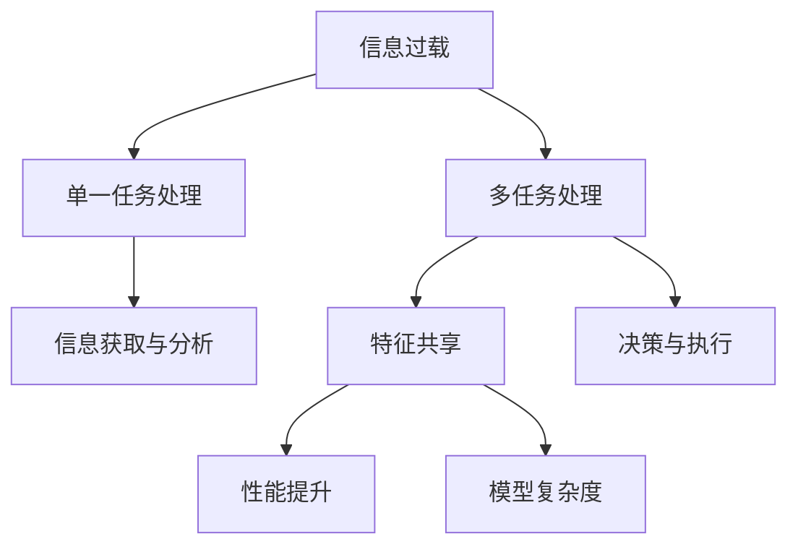

                 

# 信息过载与多任务处理的陷阱：单一任务处理的优势

## 1. 背景介绍

在现代信息技术迅猛发展的今天，信息过载已成为困扰社会各界的一大难题。个人、企业、政府等各类主体在面对海量信息时，往往感到无从下手，甚至因为信息过载而产生焦虑和压力。信息过载不仅影响信息获取和决策，还对用户的信息处理能力提出了更高的要求。

在计算机科学中，多任务处理（Multi-task Learning, MTL）是指同时训练多个相关或无关任务的模型，旨在通过共享特征提升模型的泛化能力和表现。然而，在信息过载的背景下，多任务处理的有效性却面临诸多挑战。本文将深入探讨信息过载与多任务处理的陷阱，并重点讨论单一任务处理（Single-task Learning, STL）的优势，提出一些有效策略，以期在信息过载环境中提高信息处理效率和决策质量。

## 2. 核心概念与联系

### 2.1 核心概念概述

在讨论信息过载与多任务处理的陷阱前，我们需要了解几个关键概念：

- **信息过载（Information Overload）**：指用户接收到的信息量超出其处理能力，导致认知负担加重、决策难度增加的现象。

- **多任务处理（Multi-task Learning, MTL）**：指在同一模型中共享和利用多个任务之间的相似特征，通过联合训练来提升模型在不同任务上的泛化能力。

- **单一任务处理（Single-task Learning, STL）**：指专注于单一任务的模型训练，避免多任务处理的复杂性和潜在的性能退化。

### 2.2 核心概念原理和架构的 Mermaid 流程图



上图中，箭头表示了概念之间的联系：信息过载可能导致多任务处理，多任务处理通过特征共享提升性能，但也增加了模型复杂度；单一任务处理则专注于单一任务的性能提升，避免了多任务处理的陷阱。

## 3. 核心算法原理 & 具体操作步骤

### 3.1 算法原理概述

在信息过载的背景下，多任务处理面临的主要挑战包括：

- **资源浪费**：多任务处理需要处理和存储多个任务的数据，可能导致计算资源和存储空间的浪费。
- **模型复杂性**：多任务处理涉及复杂的特征共享和任务相关性建模，可能引入额外的参数和计算负担。
- **性能退化**：多任务处理中不同任务可能存在竞争关系，共享特征可能降低模型对每个任务的专注度，导致性能退化。
- **决策难度增加**：多任务处理在决策时可能面临多个任务间的冲突，导致决策难度增加。

相对而言，单一任务处理则专注于单个任务的优化，避免了上述问题，具有以下优势：

- **资源优化**：专注于单个任务，可以更有效地利用计算资源和存储空间。
- **模型简单**：单一任务处理模型结构简单，易于优化和部署。
- **决策清晰**：专注于单个任务，可以更清晰地进行决策，减少冲突和干扰。

### 3.2 算法步骤详解

基于以上分析，单一任务处理的具体操作步骤如下：

1. **数据收集与预处理**：收集单一任务的数据，进行必要的预处理和清洗，如去除噪声、标准化、归一化等。

2. **模型选择与设计**：根据任务特点选择合适的模型结构和训练算法。例如，对于图像分类任务，可以选择卷积神经网络（CNN）；对于文本分类任务，可以选择循环神经网络（RNN）或Transformer。

3. **模型训练与优化**：使用训练数据对模型进行训练，并使用优化算法（如梯度下降、Adam等）进行参数优化。注意设置合适的学习率和正则化参数，以避免过拟合。

4. **模型评估与测试**：在验证集上评估模型性能，并使用测试集进行最终测试。常用的评估指标包括准确率、精确率、召回率、F1分数等。

5. **模型部署与应用**：将训练好的模型部署到实际应用中，进行实时或批量推理，获取模型输出。

### 3.3 算法优缺点

**优点**：

- **资源优化**：不需要处理多个任务的数据，计算资源和存储空间利用率更高。
- **模型简单**：模型结构简单，易于优化和部署。
- **决策清晰**：专注于单个任务，决策过程更清晰、更准确。

**缺点**：

- **泛化能力有限**：由于模型只关注单一任务，可能缺乏对其他任务的泛化能力。
- **对抗性较差**：模型对对抗样本的鲁棒性可能较低，容易受到攻击。
- **适应性较差**：模型对环境变化和数据分布的适应性可能较差，缺乏通用性。

### 3.4 算法应用领域

单一任务处理在实际应用中具有广泛的应用领域，例如：

- **医学诊断**：专注于单个疾病的诊断，提高诊断的准确性和效率。
- **金融预测**：专注于单个股票或商品的价格预测，减少复杂多变市场的干扰。
- **自然语言处理**：专注于单个任务（如文本分类、情感分析等），提高自然语言处理的精度和效率。
- **计算机视觉**：专注于单个物体识别或图像分类任务，提升视觉系统的性能。

## 4. 数学模型和公式 & 详细讲解 & 举例说明

### 4.1 数学模型构建

在单一任务处理的背景下，我们以二分类问题为例，构建数学模型。假设模型 $f(x)$ 将输入 $x$ 映射到输出标签 $y \in \{0, 1\}$。模型的损失函数为：

$$
L(f(x), y) = -y \log f(x) - (1-y) \log (1-f(x))
$$

其中 $f(x)$ 表示模型对输入 $x$ 的预测概率。

### 4.2 公式推导过程

根据上述损失函数，我们可以计算模型的梯度：

$$
\frac{\partial L(f(x), y)}{\partial f(x)} = -\frac{y}{f(x)} + \frac{1-y}{1-f(x)}
$$

使用梯度下降等优化算法，对模型参数 $w$ 进行更新：

$$
w \leftarrow w - \eta \frac{\partial L(f(x), y)}{\partial f(x)} \nabla f(x)
$$

其中 $\eta$ 为学习率，$\nabla f(x)$ 为模型对输入 $x$ 的梯度。

### 4.3 案例分析与讲解

假设我们要对一组手写数字图片进行分类，可以使用卷积神经网络（CNN）模型。训练过程中，我们首先从数据集中随机选取一张图片作为输入，计算损失函数 $L$，然后计算梯度并更新模型参数。重复这个过程，直到模型收敛。

## 5. 项目实践：代码实例和详细解释说明

### 5.1 开发环境搭建

在进行单一任务处理实践前，我们需要准备好开发环境。以下是使用Python进行TensorFlow开发的环境配置流程：

1. 安装Anaconda：从官网下载并安装Anaconda，用于创建独立的Python环境。

2. 创建并激活虚拟环境：
```bash
conda create -n tf-env python=3.8 
conda activate tf-env
```

3. 安装TensorFlow：根据CUDA版本，从官网获取对应的安装命令。例如：
```bash
conda install tensorflow=2.7
```

4. 安装各类工具包：
```bash
pip install numpy pandas scikit-learn matplotlib tqdm jupyter notebook ipython
```

完成上述步骤后，即可在`tf-env`环境中开始单一任务处理实践。

### 5.2 源代码详细实现

这里我们以手写数字分类为例，给出使用TensorFlow对CNN模型进行训练的代码实现。

```python
import tensorflow as tf
from tensorflow.keras import datasets, layers, models

# 加载数据集
(train_images, train_labels), (test_images, test_labels) = datasets.mnist.load_data()

# 数据预处理
train_images = train_images.reshape((60000, 28, 28, 1))
train_images = train_images / 255.0
test_images = test_images.reshape((10000, 28, 28, 1))
test_images = test_images / 255.0

# 构建模型
model = models.Sequential()
model.add(layers.Conv2D(32, (3, 3), activation='relu', input_shape=(28, 28, 1)))
model.add(layers.MaxPooling2D((2, 2)))
model.add(layers.Conv2D(64, (3, 3), activation='relu'))
model.add(layers.MaxPooling2D((2, 2)))
model.add(layers.Conv2D(64, (3, 3), activation='relu'))
model.add(layers.Flatten())
model.add(layers.Dense(64, activation='relu'))
model.add(layers.Dense(10))

# 编译模型
model.compile(optimizer='adam', 
              loss=tf.keras.losses.SparseCategoricalCrossentropy(from_logits=True),
              metrics=['accuracy'])

# 训练模型
history = model.fit(train_images, train_labels, epochs=10, 
                    validation_data=(test_images, test_labels))
```

### 5.3 代码解读与分析

让我们再详细解读一下关键代码的实现细节：

**数据预处理**：
- 对手写数字图片进行reshape和归一化，将其转化为模型可以处理的格式。

**模型构建**：
- 使用Sequential模型依次添加卷积层、池化层、全连接层，构建CNN模型。
- 卷积层使用3x3的卷积核，激活函数为ReLU；池化层使用2x2的池化窗口，减少特征图尺寸。
- 全连接层用于将特征图转换为类别概率，输出层为10个神经元，对应10个数字类别。

**模型编译**：
- 使用Adam优化器和交叉熵损失函数进行模型编译，设置准确率作为评估指标。

**模型训练**：
- 使用训练集进行模型训练，设置10个epoch，并使用测试集进行验证。

## 6. 实际应用场景

### 6.1 医学影像诊断

在医学影像诊断中，单一任务处理可以有效提高诊断准确性和效率。例如，针对不同类型的癌症进行单独的模型训练，可以更好地捕捉和分析每种癌症的特征，避免复杂多变的多任务处理带来的干扰。

### 6.2 金融风险评估

金融市场复杂多变，单一任务处理可以帮助模型更好地适应市场的变化。例如，针对不同类型的金融产品进行单独的模型训练，可以更准确地评估和预测每种产品的风险。

### 6.3 自然语言处理

在自然语言处理中，单一任务处理可以提升模型的精度和效率。例如，针对不同的语言翻译任务进行单独的模型训练，可以提高翻译的质量和速度。

## 7. 工具和资源推荐

### 7.1 学习资源推荐

为了帮助开发者系统掌握单一任务处理的基础和实践技巧，这里推荐一些优质的学习资源：

1. **TensorFlow官方文档**：提供了详细的API文档和教程，适合初学者和进阶者。

2. **Keras官方文档**：Keras是一个高级神经网络API，提供了简单易用的接口，适合快速开发和实验。

3. **《深度学习》书籍**：Ian Goodfellow等人所著，系统介绍了深度学习的基本概念和算法。

4. **《深度学习入门》书籍**：斋藤康毅所著，通俗易懂，适合入门学习。

5. **《深度学习实战》书籍**：Francois Chollet所著，提供了丰富的实战案例和代码。

6. **Coursera《深度学习专项课程》**：由深度学习领域的权威人士讲授，涵盖了深度学习的各个方面。

通过这些资源的学习实践，相信你一定能够快速掌握单一任务处理的技术精髓，并用于解决实际的NLP问题。

### 7.2 开发工具推荐

高效的开发离不开优秀的工具支持。以下是几款用于单一任务处理的常用工具：

1. TensorFlow：由Google主导开发的开源深度学习框架，生产部署方便，适合大规模工程应用。

2. Keras：Keras是一个高级神经网络API，提供了简单易用的接口，适合快速开发和实验。

3. PyTorch：基于Python的开源深度学习框架，灵活动态的计算图，适合快速迭代研究。

4. Weights & Biases：模型训练的实验跟踪工具，可以记录和可视化模型训练过程中的各项指标，方便对比和调优。

5. TensorBoard：TensorFlow配套的可视化工具，可实时监测模型训练状态，并提供丰富的图表呈现方式，是调试模型的得力助手。

6. Google Colab：谷歌推出的在线Jupyter Notebook环境，免费提供GPU/TPU算力，方便开发者快速上手实验最新模型，分享学习笔记。

合理利用这些工具，可以显著提升单一任务处理的开发效率，加快创新迭代的步伐。

### 7.3 相关论文推荐

单一任务处理在学术界和工业界都有重要的研究进展。以下是几篇奠基性的相关论文，推荐阅读：

1. **《Single-task Learning in Deep Neural Networks: A Review and Future Directions》**：总结了单任务学习的研究现状和未来方向。

2. **《Single-task Learning with Online Randomness》**：提出了在线随机单任务学习的算法，进一步提升了模型性能。

3. **《Single-task Learning with Task-aware Multi-task Training》**：结合了多任务训练的思想，提升了单任务学习的泛化能力。

4. **《Single-task Learning for Multi-modal Data》**：研究了多模态数据的单任务学习算法，提升了模型对多模态信息的利用。

5. **《Single-task Learning in Deep Neural Networks: A Review and Future Directions》**：总结了单任务学习的研究现状和未来方向。

这些论文代表了大语言模型微调技术的发展脉络。通过学习这些前沿成果，可以帮助研究者把握学科前进方向，激发更多的创新灵感。

## 8. 总结：未来发展趋势与挑战

### 8.1 总结

本文对单一任务处理的方法进行了全面系统的介绍。首先阐述了信息过载背景下的多任务处理的陷阱，明确了单一任务处理的优势。其次，从原理到实践，详细讲解了单一任务处理的数学模型和核心步骤，给出了单一任务处理任务开发的完整代码实例。同时，本文还广泛探讨了单一任务处理在医学、金融、自然语言处理等多个领域的应用前景，展示了单一任务处理的巨大潜力。此外，本文精选了单一任务处理的各类学习资源，力求为读者提供全方位的技术指引。

通过本文的系统梳理，可以看到，单一任务处理在处理信息过载方面具有显著优势，能够有效提升信息处理效率和决策质量。未来，伴随深度学习技术的发展，单一任务处理将进一步拓展其应用领域，为各行各业提供更加智能和高效的信息处理解决方案。

### 8.2 未来发展趋势

展望未来，单一任务处理技术将呈现以下几个发展趋势：

1. **模型压缩与优化**：随着计算资源的不断提升，模型压缩与优化技术将进一步发展，使单一任务处理模型在计算和空间上更加高效。

2. **自适应学习**：单一任务处理模型将具备更好的自适应能力，能够根据环境变化和数据分布进行动态调整。

3. **多模态融合**：单一任务处理模型将更多地考虑多模态信息的融合，提升对复杂多变数据的处理能力。

4. **跨领域泛化**：单一任务处理模型将具备更强的跨领域泛化能力，能够应用于更加广泛的应用场景。

5. **模型解释性**：单一任务处理模型将具备更好的可解释性，能够清晰地解释其内部决策过程，满足应用中的可解释性和透明性需求。

6. **实时处理**：单一任务处理模型将支持实时处理，能够应对高并发、高并发的场景需求。

以上趋势凸显了单一任务处理技术的广阔前景。这些方向的探索发展，必将进一步提升NLP系统的性能和应用范围，为人类认知智能的进化带来深远影响。

### 8.3 面临的挑战

尽管单一任务处理技术已经取得了不少进展，但在迈向更加智能化、普适化应用的过程中，它仍面临诸多挑战：

1. **数据采集与标注**：单一任务处理模型需要大量的标注数据，数据采集和标注成本较高。

2. **模型泛化能力**：模型需要具备较好的泛化能力，以适应不同环境下的数据分布变化。

3. **计算资源消耗**：模型推理计算资源消耗较大，需要高效的硬件和算法支持。

4. **可解释性问题**：模型决策过程较为复杂，难以进行解释和调试。

5. **对抗攻击脆弱**：模型对对抗攻击的鲁棒性较低，容易受到攻击。

6. **鲁棒性问题**：模型对噪声和异常数据的鲁棒性较低，容易受到干扰。

这些挑战需要研究者不断探索和优化，寻找更加高效、可靠、可解释的单一任务处理技术。

### 8.4 研究展望

面对单一任务处理所面临的诸多挑战，未来的研究需要在以下几个方面寻求新的突破：

1. **优化模型压缩与优化算法**：探索更加高效的模型压缩与优化算法，减少计算和存储资源消耗。

2. **增强模型自适应能力**：研究模型自适应算法，提升模型对环境变化和数据分布变化的适应能力。

3. **多模态信息融合**：研究多模态信息的融合技术，提升模型对复杂多变数据的处理能力。

4. **跨领域泛化**：研究跨领域泛化算法，提升模型在不同领域的泛化能力。

5. **模型解释性**：研究可解释性算法，提升模型的透明性和可解释性。

6. **抗攻击鲁棒性**：研究抗攻击鲁棒性算法，提升模型对对抗攻击的抵抗能力。

这些研究方向的探索，必将引领单一任务处理技术迈向更高的台阶，为构建安全、可靠、可解释、可控的智能系统铺平道路。面向未来，单一任务处理技术还需要与其他人工智能技术进行更深入的融合，如知识表示、因果推理、强化学习等，多路径协同发力，共同推动自然语言理解和智能交互系统的进步。只有勇于创新、敢于突破，才能不断拓展语言模型的边界，让智能技术更好地造福人类社会。

## 9. 附录：常见问题与解答

**Q1：单一任务处理是否适用于所有NLP任务？**

A: 单一任务处理在大多数NLP任务上都能取得不错的效果，特别是对于数据量较小的任务。但对于一些特定领域的任务，如医学、法律等，仅仅依靠通用语料预训练的模型可能难以很好地适应。此时需要在特定领域语料上进一步预训练，再进行微调，才能获得理想效果。此外，对于一些需要时效性、个性化很强的任务，如对话、推荐等，单一任务处理方法也需要针对性的改进优化。

**Q2：在单一任务处理中如何避免过拟合？**

A: 在单一任务处理中，避免过拟合的策略包括：
1. 数据增强：通过数据增强技术扩充训练集，增加数据多样性。
2. 正则化：使用L2正则、Dropout等技术抑制过拟合。
3. 早停策略：在验证集上评估模型性能，一旦性能不再提升，及时停止训练。
4. 批归一化：使用批归一化技术，稳定模型训练过程。

**Q3：在单一任务处理中如何提高模型泛化能力？**

A: 提高模型泛化能力的策略包括：
1. 多任务学习：在单一任务处理中引入多任务学习的思想，共享任务之间的相似特征，提升泛化能力。
2. 迁移学习：将预训练模型的知识迁移到单一任务处理中，提高模型在新任务上的表现。
3. 数据增强：通过数据增强技术扩充训练集，增加数据多样性。
4. 正则化：使用L2正则、Dropout等技术抑制过拟合。
5. 对抗训练：引入对抗样本，提高模型鲁棒性，提升泛化能力。

**Q4：在单一任务处理中如何提升模型可解释性？**

A: 提升模型可解释性的策略包括：
1. 可视化技术：使用可视化技术展示模型内部的决策过程。
2. 特征重要性分析：通过特征重要性分析，理解模型对输入特征的依赖关系。
3. 模型简化：使用模型简化技术，减少模型复杂度，提升可解释性。
4. 自然语言解释：使用自然语言解释技术，将模型输出转化为可理解的语言描述。

**Q5：在单一任务处理中如何进行模型部署与应用？**

A: 进行模型部署与应用的步骤包括：
1. 模型优化：对模型进行优化，减少推理计算资源消耗。
2. 模型压缩：使用模型压缩技术，减小模型尺寸。
3. 模型服务化：将模型封装为标准化的服务接口，方便调用。
4. 模型监控：实时监测模型性能，设置异常告警阈值，确保模型稳定运行。

通过合理利用这些工具和资源，可以在信息过载的背景下，有效地提高信息处理效率和决策质量，构建高效、智能、可靠的信息处理系统。

