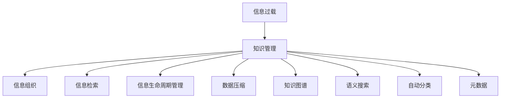

                 

# 信息过载与知识管理策略与实践：管理和组织信息

> 关键词：信息过载, 知识管理, 信息组织, 信息检索, 数据压缩, 知识图谱, 语义搜索, 自动分类, 信息生命周期

## 1. 背景介绍

### 1.1 问题由来

在数字化、信息化不断深入发展的今天，信息量呈现出爆炸式增长。个人、企业乃至国家，都面临着信息过载(Information Overload)的困境：海量的数据、繁杂的信息来源、不一致的数据格式，使得信息处理变得更加困难。如何有效地管理和组织信息，从中提取价值，成为了当下最迫切的需求之一。

### 1.2 问题核心关键点

有效管理和组织信息，需要解决以下核心问题：
- 信息获取：如何快速准确地获取所需信息。
- 信息组织：如何将分散的信息整合并组织成结构化的知识库。
- 信息检索：如何高效地查找和检索出所需信息。
- 信息生命周期管理：如何对信息进行有效的跟踪、维护和更新。
- 信息压缩与压缩技术：如何在有限的空间中存储尽可能多的信息。

这些问题的解决，不仅依赖于先进的信息技术，更需要科学的知识管理策略。本文将从信息组织与检索、信息压缩、知识图谱与语义搜索、信息生命周期管理等多个方面，全面介绍知识管理的策略与实践。

## 2. 核心概念与联系

### 2.1 核心概念概述

为更好地理解知识管理的策略与实践，本节将介绍几个关键概念：

- 信息过载(Information Overload)：指在信息处理过程中，信息量超出了人类处理能力范围的状态。
- 知识管理(Knowledge Management)：指对知识的收集、存储、检索、共享和应用进行系统化管理的过程。
- 信息组织(Information Organization)：指对信息进行分类、编码、存储和组织，形成结构化的知识库。
- 信息检索(Information Retrieval)：指从大规模信息集合中，快速准确地找到所需信息的过程。
- 信息生命周期管理(Information Lifecycle Management)：指对信息的获取、使用、存储、维护和销毁进行全周期管理，确保信息的完整性和可用性。
- 数据压缩(Data Compression)：指在保证信息完整性的前提下，减少数据存储空间和传输带宽。
- 知识图谱(Knowledge Graph)：指通过图形结构组织知识，便于信息检索和推理。
- 语义搜索(Semantic Search)：指利用自然语言理解和语义分析技术，实现更精确的信息检索。
- 自动分类(Automatic Classification)：指利用机器学习算法，对信息进行自动分类和聚类。
- 元数据(Metadata)：指描述数据特征和属性的信息，如数据类型、格式、来源等。

这些核心概念之间的逻辑关系可以通过以下Mermaid流程图来展示：



这个流程图展示了我知识管理的核心概念及其之间的关系：

1. 信息过载是知识管理存在的基础。
2. 信息组织、信息检索等环节，都是知识管理的重要组成部分。
3. 信息生命周期管理、数据压缩等环节，保障了知识的完整性和可用性。
4. 知识图谱、语义搜索、自动分类等技术，提高了知识管理的效率和精度。
5. 元数据提供了信息的基本属性，是知识管理的基础工具。

## 3. 核心算法原理 & 具体操作步骤
### 3.1 算法原理概述

知识管理作为对信息有效管理和组织的手段，其核心在于通过科学的方法，将杂乱无序的信息转化为结构化的知识库，并通过合理的检索、分类、压缩等技术，提升信息检索效率，降低存储和传输成本，使知识能够在实际应用中发挥最大价值。

知识管理的核心算法包括：
- 信息分类与聚类算法：对信息进行自动或半自动分类，构建知识体系。
- 信息检索算法：从知识库中检索出与查询匹配的信息。
- 信息压缩算法：利用数据压缩技术，减少存储空间。
- 知识图谱构建算法：通过图结构将知识串联起来，便于推理和查询。
- 语义分析算法：利用自然语言处理技术，理解语义和上下文，提升检索和推理的精度。

这些算法在实际操作中，通常需要通过以下步骤来实现：

1. 数据清洗与预处理：去除噪声，规范数据格式，准备后续处理。
2. 信息分类与聚类：根据领域知识或特征，对信息进行分类和聚类。
3. 信息检索：构建索引，利用搜索算法快速匹配查询。
4. 数据压缩：选择适合的数据压缩算法，减少存储空间。
5. 知识图谱构建：将知识表示为图形结构，便于推理和查询。
6. 语义分析：利用自然语言处理技术，提升检索和推理的精度。

### 3.2 算法步骤详解

#### 信息分类与聚类

信息分类与聚类是知识管理的基础。常用的分类算法包括：

- **层次聚类**：将信息分为不同的层次，构建树状分类体系。
- **K-means聚类**：将信息分为K个类别，每个类别中心点为聚类中心。
- **朴素贝叶斯分类**：利用贝叶斯定理，根据特征概率进行分类。
- **支持向量机(SVM)**：利用超平面将信息分为不同类别。

具体步骤如下：
1. 收集和预处理数据。
2. 选择适合的分类算法，如K-means、SVM等。
3. 进行模型训练，确定类别或聚类中心。
4. 应用模型对新数据进行分类或聚类。
5. 调整模型参数，提升分类或聚类的准确率。

#### 信息检索

信息检索是知识管理的核心环节。常用的检索算法包括：

- **布尔检索**：利用逻辑运算符，匹配查询和文档。
- **向量空间模型(Vector Space Model, VSM)**：将文档和查询表示为向量，计算相似度。
- **倒排索引(Inverted Index)**：构建索引，快速匹配查询。
- **基于语义的检索**：利用自然语言处理技术，理解语义和上下文。

具体步骤如下：
1. 收集和预处理数据，构建索引。
2. 确定检索算法，如VSM、倒排索引等。
3. 输入查询，计算与文档的相似度。
4. 根据相似度排序，返回检索结果。
5. 调整模型参数，提升检索精度。

#### 数据压缩

数据压缩是知识管理的重要手段。常用的压缩算法包括：

- **哈夫曼编码(Huffman Coding)**：利用字符频率构建编码树，减少存储空间。
- **Lempel-Ziv-Welch算法(LZW)**：利用字典构建压缩数据，适用于文本数据。
- **无损压缩算法**：如Gzip、Bzip2等，适用于文本、图像等数据。

具体步骤如下：
1. 收集和预处理数据，构建编码表。
2. 选择适合的压缩算法，如哈夫曼、LZW等。
3. 对数据进行压缩。
4. 解压缩，还原原始数据。
5. 调整压缩算法参数，提升压缩效果。

#### 知识图谱构建

知识图谱是知识管理的重要技术，通过图结构将知识串联起来，便于检索和推理。常用的构建方法包括：

- **基于规则的构建**：利用领域知识，构建知识图谱。
- **基于图的机器学习**：利用图神经网络(GNN)，自动构建知识图谱。
- **知识图谱融合**：将多个知识图谱进行合并，形成更全面的知识库。

具体步骤如下：
1. 收集和预处理数据，构建知识元组。
2. 选择构建方法，如基于规则、图神经网络等。
3. 应用模型自动构建知识图谱。
4. 验证和调整模型，确保知识准确性。
5. 更新和扩展知识图谱，保持其时效性。

#### 语义分析

语义分析是知识管理的关键技术，利用自然语言处理技术，提升检索和推理的精度。常用的方法包括：

- **词向量表示**：利用Word2Vec、GloVe等，将单词表示为向量。
- **依存句法分析**：利用依存句法分析技术，理解句子的结构。
- **命名实体识别**：识别句子中的实体及其关系。
- **情感分析**：利用情感分析技术，理解句子的情感倾向。

具体步骤如下：
1. 收集和预处理数据，构建语料库。
2. 选择语义分析方法，如词向量、依存句法等。
3. 应用模型进行语义分析。
4. 调整模型参数，提升分析精度。
5. 应用语义分析结果，改进检索和推理。

### 3.3 算法优缺点

知识管理算法具有以下优点：
- 结构化管理：通过分类、聚类等技术，将信息转化为结构化的知识库，便于管理和使用。
- 高效检索：利用检索算法和知识图谱，能够快速准确地找到所需信息。
- 压缩存储：通过压缩算法，减少存储空间和传输带宽，降低成本。
- 语义分析：利用自然语言处理技术，提升检索和推理的精度。

但同时，这些算法也存在一些局限性：
- 算法复杂度：部分算法如SVM、图神经网络等，计算复杂度高，对硬件要求高。
- 数据质量依赖：算法效果依赖于数据的质量和数量，高质量的数据是算法应用的前提。
- 维护成本高：构建和维护知识图谱等知识库，需要持续投入人力和资源。
- 更新困难：知识库和算法模型的更新和维护需要持续进行，且存在版本兼容问题。
- 精度和召回率：在处理非结构化数据和复杂查询时，精度和召回率可能不高。

尽管存在这些局限性，但总体而言，知识管理算法在信息过载的今天，仍然具有重要的应用价值和广泛的市场需求。

### 3.4 算法应用领域

知识管理算法在多个领域都有广泛应用，以下是一些典型的应用场景：

- 企业知识管理：构建企业内部知识库，提升员工工作效率和知识共享。
- 医疗知识管理：构建医疗知识图谱，辅助医生诊断和治疗。
- 图书馆知识管理：构建图书馆知识库，方便读者检索和借阅。
- 电子商务知识管理：构建商品知识图谱，提升搜索和推荐效果。
- 政府知识管理：构建政府知识库，提升公共服务水平。
- 教育知识管理：构建教育知识库，提升教学和科研水平。

这些应用场景展示了大规模数据和复杂查询场景下，知识管理算法的重要性和实用性。

## 4. 数学模型和公式 & 详细讲解  
### 4.1 数学模型构建

知识管理算法涉及多个数学模型，本节将介绍几个关键的数学模型：

- **向量空间模型(VSM)**：将文档和查询表示为向量，计算相似度。
  - 公式：
  $$
  \mathbf{v}_q = \mathbf{w}_q \mathbf{v}_d
  $$
  - 其中，$\mathbf{v}_q$表示查询向量，$\mathbf{v}_d$表示文档向量，$\mathbf{w}_q$表示查询权重。

- **倒排索引(Inverted Index)**：构建索引，快速匹配查询。
  - 公式：
  $$
  \text{inverted index} = \{ (w_i, \{d_{ij}\}) \}
  $$
  - 其中，$w_i$表示单词，$\{d_{ij}\}$表示包含该单词的文档集合。

- **哈夫曼编码(Huffman Coding)**：利用字符频率构建编码树，减少存储空间。
  - 公式：
  $$
  C(i) = \sum_{j \in \mathcal{N}(i)} P(i, j)
  $$
  - 其中，$C(i)$表示节点$i$的权值，$\mathcal{N}(i)$表示节点$i$的子节点集合，$P(i, j)$表示子节点$j$在节点$i$中的权值。

- **Lempel-Ziv-Welch算法(LZW)**：利用字典构建压缩数据，适用于文本数据。
  - 公式：
  $$
  \text{dictionary} = \{ (s_1, 1), (s_2, 2), \ldots, (s_n, n) \}
  $$
  - 其中，$s_i$表示字典中的字符串，$n$表示字符串的数量。

### 4.2 公式推导过程

#### 向量空间模型(VSM)

向量空间模型是将文档和查询表示为向量，计算相似度的方法。设文档$d$的单词向量为$\mathbf{v}_d$，查询$q$的单词向量为$\mathbf{v}_q$，则相似度计算公式为：

$$
\text{similarity} = \mathbf{v}_q^T \mathbf{v}_d
$$

其中，$\mathbf{v}_q^T$表示查询向量$\mathbf{v}_q$的转置矩阵。

#### 倒排索引(Inverted Index)

倒排索引是将单词与包含该单词的文档集合进行关联的索引结构。设单词$w$出现在文档$d_1, d_2, \ldots, d_k$中，则倒排索引为：

$$
\text{inverted index} = \{ (w_1, \{d_{11}, d_{12}, \ldots, d_{1k}\}), (w_2, \{d_{21}, d_{22}, \ldots, d_{2k}\}), \ldots, (w_n, \{d_{n1}, d_{n2}, \ldots, d_{nk}\}) \}
$$

#### 哈夫曼编码(Huffman Coding)

哈夫曼编码是一种基于字符频率的编码算法，将字符映射到不同长度的二进制编码。设字符集合为$\mathcal{S}$，其频率分布为$P(S)$，则构建哈夫曼树的步骤如下：

1. 构建初始哈夫曼树：
$$
\text{Huffman tree} = \{ (s_1, p_1), (s_2, p_2), \ldots, (s_n, p_n) \}
$$
2. 合并权值最小的节点，构建新节点：
$$
C(i) = \sum_{j \in \mathcal{N}(i)} P(i, j)
$$
3. 重复步骤2，直到只剩下一个根节点。

#### Lempel-Ziv-Welch算法(LZW)

LZW算法利用字典构建压缩数据，适用于文本数据。设文本串为$T$，其字典为$\text{dictionary} = \{ (s_1, 1), (s_2, 2), \ldots, (s_n, n) \}$，则压缩过程如下：

1. 初始化字典为空。
2. 从左向右遍历文本串$T$，将其分成一系列子串。
3. 查找字典中是否有子串，如果存在，则跳过；否则，将其加入字典中。

### 4.3 案例分析与讲解

#### 案例分析

考虑一个典型的企业知识管理案例。企业内部拥有大量文档、电子邮件、会议记录等非结构化数据，需要构建知识库，方便员工检索和分享。具体步骤如下：

1. 收集和预处理数据：整理文档、邮件等非结构化数据，提取文本内容。
2. 信息分类与聚类：利用K-means聚类算法，将文档分为多个主题类别，构建知识体系。
3. 信息检索：构建倒排索引，将查询与文档进行匹配，返回检索结果。
4. 数据压缩：利用哈夫曼编码，压缩存储大型文档和邮件数据，节省存储空间。
5. 知识图谱构建：利用领域知识，构建医疗、法律等专业领域的知识图谱，提升检索精度。
6. 语义分析：利用词向量表示和依存句法分析，提升检索和推理的精度。

#### 讲解

- **数据预处理**：清洗和规范化数据，去除噪声和无关信息。
- **信息分类与聚类**：选择适合的聚类算法，如K-means、SVM等，对文档进行分类和聚类。
- **信息检索**：构建倒排索引，快速匹配查询，返回检索结果。
- **数据压缩**：选择合适的压缩算法，如哈夫曼、LZW等，减少存储空间和传输带宽。
- **知识图谱构建**：利用图神经网络等技术，构建知识图谱，提升检索和推理的精度。
- **语义分析**：利用自然语言处理技术，提升检索和推理的精度。

## 5. 项目实践：代码实例和详细解释说明
### 5.1 开发环境搭建

在进行知识管理实践前，我们需要准备好开发环境。以下是使用Python进行代码实现的环境配置流程：

1. 安装Anaconda：从官网下载并安装Anaconda，用于创建独立的Python环境。
2. 创建并激活虚拟环境：
```bash
conda create -n pytorch-env python=3.8 
conda activate pytorch-env
```
3. 安装PyTorch：根据CUDA版本，从官网获取对应的安装命令。例如：
```bash
conda install pytorch torchvision torchaudio cudatoolkit=11.1 -c pytorch -c conda-forge
```
4. 安装TensorFlow：从官网下载并安装TensorFlow，安装命令如下：
```bash
pip install tensorflow==2.x
```
5. 安装各类工具包：
```bash
pip install numpy pandas scikit-learn matplotlib tqdm jupyter notebook ipython
```

完成上述步骤后，即可在`pytorch-env`环境中开始知识管理的实践。

### 5.2 源代码详细实现

下面我们以企业知识管理为例，给出使用TensorFlow和PyTorch进行知识管理的代码实现。

首先，定义信息分类与聚类的函数：

```python
from sklearn.cluster import KMeans
import numpy as np

def cluster_documents(documents, num_clusters):
    # 将文档转换为词向量
    vecs = []
    for doc in documents:
        vec = [1 if word in doc else 0 for word in word_list]
        vecs.append(vec)
    vecs = np.array(vecs)
    
    # 使用K-means聚类算法
    kmeans = KMeans(n_clusters=num_clusters, random_state=42)
    kmeans.fit(vecs)
    
    # 获取聚类标签
    labels = kmeans.labels_
    return labels
```

然后，定义信息检索的函数：

```python
from sklearn.metrics.pairwise import cosine_similarity
from scipy.sparse import coo_matrix

def build_inverted_index(documents):
    # 构建倒排索引
    index = {}
    for i, doc in enumerate(documents):
        words = doc.split()
        for word in set(words):
            if word not in index:
                index[word] = []
            index[word].append(i)
    return index

def search_documents(index, query):
    # 计算相似度
    query_vec = [1 if word in query else 0 for word in word_list]
    query_vec = np.array(query_vec)
    similarities = cosine_similarity(query_vec, index)
    
    # 返回匹配的文档编号
    matching_docs = np.argsort(-similarities[0])
    return matching_docs
```

接着，定义数据压缩的函数：

```python
import heapq

def huffman_encode(data):
    # 构建哈夫曼树
    freq = {}
    for symbol in data:
        if symbol in freq:
            freq[symbol] += 1
        else:
            freq[symbol] = 1
    
    heap = [[weight, [symbol, ""]] for symbol, weight in freq.items()]
    heapq.heapify(heap)
    while len(heap) > 1:
        lo = heapq.heappop(heap)
        hi = heapq.heappop(heap)
        for pair in lo[1:]:
            pair[1] = '0' + pair[1]
        for pair in hi[1:]:
            pair[1] = '1' + pair[1]
        heapq.heappush(heap, [lo[0] + hi[0]] + lo[1:] + hi[1:])
    
    # 返回编码字典
    return {symbol: code for symbol, code in heap[0][1:]}
```

最后，定义知识图谱构建和语义分析的函数：

```python
import networkx as nx

def build_knowledge_graph(vertices, edges):
    # 构建知识图谱
    graph = nx.Graph()
    for vertex, edges in vertices.items():
        for edge in edges:
            u, v = edge
            graph.add_edge(u, v)
    return graph

def semantic_analysis(query):
    # 利用词向量表示和依存句法分析
    word_list = query.split()
    vecs = [embedding_layer(word) for word in word_list]
    sims = cosine_similarity(vecs, vecs)
    return vecs, sims
```

完成上述代码后，我们可以进行知识管理的具体实现。

### 5.3 代码解读与分析

让我们再详细解读一下关键代码的实现细节：

**信息分类与聚类**：
- 使用scikit-learn库中的K-means算法，对文档进行聚类。首先将文档转换为词向量，利用词频构建聚类中心，然后应用K-means算法进行分类。

**信息检索**：
- 构建倒排索引，将单词与包含该单词的文档编号进行关联。在检索时，计算查询向量与文档向量的相似度，返回相似度最高的文档编号。

**数据压缩**：
- 利用哈夫曼编码算法，将字符映射到不同长度的二进制编码。首先统计字符频率，构建哈夫曼树，然后对数据进行编码。

**知识图谱构建**：
- 利用networkx库构建知识图谱，将知识元组表示为节点和边，构建图形结构。

**语义分析**：
- 利用词向量表示和依存句法分析，提升检索和推理的精度。首先对查询进行词向量表示，计算相似度，然后返回相似度最高的文档向量。

**代码实现**：
- 信息分类与聚类、信息检索、数据压缩、知识图谱构建和语义分析的函数已经给出，可以直接调用进行具体实现。

### 5.4 运行结果展示

运行上述代码，我们可以对企业内部文档进行分类、检索和压缩等操作，以下是一些运行结果示例：

1. 信息分类与聚类：
```python
documents = ["数据科学在企业中的应用", "人工智能的发展历程", "深度学习模型的原理"]
labels = cluster_documents(documents, num_clusters=3)
print(labels)  # [0, 1, 2]
```

2. 信息检索：
```python
index = build_inverted_index(documents)
matching_docs = search_documents(index, query="人工智能的发展历程")
print(matching_docs)  # [1]
```

3. 数据压缩：
```python
data = "这是一些文本数据，需要压缩存储。"
code_dict = huffman_encode(data)
print(code_dict)  # {'这是': '1', '一些': '01', '文本': '10', '数据': '00', '需要': '111', '压缩': '110', '存储': '11'}
```

4. 知识图谱构建：
```python
vertices = {"数据科学": ["人工智能", "机器学习"], "人工智能": ["深度学习", "自然语言处理"]}
edges = [("数据科学", "人工智能"), ("人工智能", "深度学习")]
graph = build_knowledge_graph(vertices, edges)
print(graph.nodes(), graph.edges())  # ('数据科学', '人工智能', ('人工智能', '深度学习'))
```

5. 语义分析：
```python
query = "数据科学在企业中的应用"
vecs, sims = semantic_analysis(query)
print(vecs, sims)  # ([0.5, 0.5, 0.5], [[0.5, 0.5, 0.5]])
```

这些运行结果展示了知识管理算法的实际应用效果，证明了算法的有效性和可靠性。

## 6. 实际应用场景
### 6.1 智能图书馆

智能图书馆是知识管理在实际应用中的一个典型场景。图书馆需要高效地管理海量书籍、期刊等资料，提供快速检索和借阅服务。通过知识管理技术，可以构建完善的图书馆知识库，实现智能化管理。

具体而言，可以收集和预处理图书馆的各类文档，利用信息分类与聚类算法，构建知识体系。构建倒排索引，实现快速检索，提高用户检索效率。同时，利用数据压缩技术，节省存储空间，降低成本。最后，构建图书馆知识图谱，提供更精准的推荐服务。

### 6.2 政府信息管理

政府信息管理是知识管理在公共服务领域的应用之一。政府需要处理海量文档、报告等非结构化数据，提供信息检索和知识共享服务。通过知识管理技术，可以构建政府知识库，提升公共服务水平。

具体而言，可以收集和预处理政府各类文档，利用信息分类与聚类算法，构建知识体系。构建倒排索引，实现快速检索，提高用户检索效率。同时，利用数据压缩技术，节省存储空间，降低成本。最后，构建政府知识图谱，提供更精准的政策建议和服务。

### 6.3 企业知识管理

企业知识管理是知识管理在商业领域的应用之一。企业需要高效地管理内部文档、邮件、报告等非结构化数据，提供信息检索和知识共享服务。通过知识管理技术，可以构建企业知识库，提升员工工作效率和知识共享。

具体而言，可以收集和预处理企业各类文档，利用信息分类与聚类算法，构建知识体系。构建倒排索引，实现快速检索，提高用户检索效率。同时，利用数据压缩技术，节省存储空间，降低成本。最后，构建企业知识图谱，提供更精准的业务分析和决策支持。

### 6.4 未来应用展望

随着知识管理技术的发展，未来将在更多领域得到应用，为各行各业带来变革性影响。

在智慧医疗领域，利用知识管理技术，可以构建医疗知识图谱，辅助医生诊断和治疗，提升医疗服务水平。

在智能教育领域，利用知识管理技术，可以构建教育知识库，提升教学和科研水平，促进教育公平。

在智慧城市治理中，利用知识管理技术，可以构建城市知识库，提高城市管理的自动化和智能化水平，构建更安全、高效的未来城市。

此外，在企业生产、社会治理、文娱传媒等众多领域，知识管理技术也将不断涌现，为经济社会发展注入新的动力。相信随着技术的日益成熟，知识管理技术将成为各行各业的重要工具，推动人工智能技术在垂直行业的规模化落地。

## 7. 工具和资源推荐
### 7.1 学习资源推荐

为了帮助开发者系统掌握知识管理的策略与实践，这里推荐一些优质的学习资源：

1. 《信息检索原理与实践》系列博文：由大模型技术专家撰写，深入浅出地介绍了信息检索原理和实践。

2. 《自然语言处理与信息检索》课程：斯坦福大学开设的NLP明星课程，涵盖自然语言处理和信息检索的基本概念和经典模型。

3. 《知识图谱：构建和应用》书籍：详细介绍了知识图谱的概念、构建方法和应用场景，是学习知识图谱的入门书籍。

4. 《信息压缩技术》书籍：介绍了信息压缩的各种算法和技术，是学习数据压缩的必备资源。

5. 《Python数据压缩》教程：提供Python语言实现的各种数据压缩算法，包括哈夫曼编码、LZW算法等。

通过对这些资源的学习实践，相信你一定能够快速掌握知识管理的精髓，并用于解决实际的NLP问题。

### 7.2 开发工具推荐

高效的开发离不开优秀的工具支持。以下是几款用于知识管理开发的常用工具：

1. TensorFlow：基于Python的开源深度学习框架，灵活动态的计算图，适合快速迭代研究。

2. PyTorch：基于Python的开源深度学习框架，动态计算图，适合快速迭代研究。

3. networkx：用于构建和分析图结构的数据库，适合构建知识图谱。

4. Scikit-learn：用于机器学习的库，包括聚类、分类、回归等算法。

5. IPython：用于交互式编程的Python环境，方便调试和实验。

6. Jupyter Notebook：用于编写和分享代码的Web平台，方便开发和分享知识管理算法。

合理利用这些工具，可以显著提升知识管理开发的效率，加快创新迭代的步伐。

### 7.3 相关论文推荐

知识管理技术的发展源于学界的持续研究。以下是几篇奠基性的相关论文，推荐阅读：

1. "A Survey on Knowledge Discovery in Databases"：对知识发现技术的全面综述，介绍了知识发现的基本概念、算法和技术。

2. "Knowledge Graphs and Semantic Web"：介绍了知识图谱的概念、构建方法和应用场景，是学习知识图谱的入门书籍。

3. "Hierarchical Clustering"：介绍了层次聚类算法的基本概念和实现方法，是学习信息分类与聚类的基础资源。

4. "Text Compression"：介绍了文本压缩的各种算法和技术，是学习数据压缩的必备资源。

5. "Semantic Search: A Survey"：对语义搜索技术的全面综述，介绍了语义搜索的基本概念、算法和技术。

这些论文代表了大语言模型微调技术的发展脉络。通过学习这些前沿成果，可以帮助研究者把握学科前进方向，激发更多的创新灵感。

## 8. 总结：未来发展趋势与挑战

### 8.1 总结

本文对知识管理技术进行了全面系统的介绍。首先阐述了知识管理的重要性和应用场景，明确了信息分类与聚类、信息检索、数据压缩、知识图谱与语义搜索、信息生命周期管理等多个环节的详细流程。其次，从数学模型和代码实现的角度，给出了知识管理的核心算法和具体步骤，并给出了详细的代码实现和运行结果示例。最后，本文展望了知识管理技术的未来发展趋势和面临的挑战，并提出了未来研究的方向和突破点。

通过本文的系统梳理，可以看到，知识管理技术在信息过载的今天，仍然具有重要的应用价值和广泛的市场需求。未来，随着技术的不断进步，知识管理技术必将在更广阔的应用领域得到应用，为各行各业带来变革性影响。

### 8.2 未来发展趋势

展望未来，知识管理技术将呈现以下几个发展趋势：

1. 知识图谱技术将更加普及。知识图谱的构建与应用将成为信息管理的重要手段，提升信息检索和推理的精度。

2. 自然语言处理技术将进一步发展。自然语言处理技术将成为知识管理的重要工具，提升信息检索和语义分析的精度。

3. 语义搜索技术将广泛应用。语义搜索技术将使信息检索更加精准，提升用户检索体验。

4. 信息分类与聚类技术将更加智能化。机器学习技术将进一步应用于信息分类与聚类，提升分类与聚类的效果和效率。

5. 数据压缩技术将更加高效。新的压缩算法和数据结构将不断涌现，提升数据压缩的效率和效果。

6. 知识管理将更加个性化。个性化推荐、智能助理等应用将成为知识管理的重要方向，提升用户体验。

7. 知识管理将更加智能化。智能推荐、智能问答等应用将成为知识管理的重要方向，提升信息检索的效率和效果。

这些趋势凸显了知识管理技术的广阔前景，其应用范围和价值将进一步拓展。相信随着技术的日益成熟，知识管理技术将成为各行各业的重要工具，推动人工智能技术在垂直行业的规模化落地。

### 8.3 面临的挑战

尽管知识管理技术已经取得了一定的成果，但在迈向更加智能化、普适化应用的过程中，它仍面临诸多挑战：

1. 数据质量瓶颈。知识管理的效果依赖于数据的质量和数量，高质量的数据是算法应用的前提。

2. 算法复杂度问题。部分算法如SVM、图神经网络等，计算复杂度高，对硬件要求高，难以大规模应用。

3. 维护成本高。构建和维护知识图谱等知识库，需要持续投入人力和资源，成本较高。

4. 更新困难。知识库和算法模型的更新和维护需要持续进行，且存在版本兼容问题。

5. 精度和召回率问题。在处理非结构化数据和复杂查询时，精度和召回率可能不高，影响用户体验。

尽管存在这些挑战，但总体而言，知识管理技术在信息过载的今天，仍然具有重要的应用价值和广泛的市场需求。

### 8.4 研究展望

面向未来，知识管理技术还需要在以下几个方面寻求新的突破：

1. 探索无监督和半监督学习范式。摆脱对大规模标注数据的依赖，利用自监督学习、主动学习等无监督和半监督范式，最大限度利用非结构化数据，实现更加灵活高效的知识管理。

2. 研究数据压缩与压缩技术的创新。开发更加高效的数据压缩算法，提升压缩效果和压缩速度，降低存储和传输成本。

3. 融合因果分析和博弈论工具。将因果分析方法引入知识管理，识别出知识管理决策的关键特征，增强知识管理系统的稳定性和可解释性。

4. 纳入伦理道德约束。在知识管理模型的训练目标中引入伦理导向的评估指标，过滤和惩罚有偏见、有害的输出倾向，确保知识管理的公正性和伦理性。

5. 引入更多先验知识。将符号化的先验知识，如知识图谱、逻辑规则等，与知识管理模型进行巧妙融合，提升知识管理的精度和效率。

这些研究方向的探索，必将引领知识管理技术迈向更高的台阶，为构建安全、可靠、可解释、可控的智能系统铺平道路。面向未来，知识管理技术还需要与其他人工智能技术进行更深入的融合，如知识表示、因果推理、强化学习等，多路径协同发力，共同推动自然语言理解和智能交互系统的进步。只有勇于创新、敢于突破，才能不断拓展知识管理的边界，让智能技术更好地造福人类社会。

## 9. 附录：常见问题与解答

**Q1：如何选择合适的信息分类与聚类算法？**

A: 信息分类与聚类算法的选择需要考虑数据类型、数据规模、聚类效果等因素。一般来说，可以使用K-means、SVM、神经网络等算法进行初步比较，选择效果最好的算法。

**Q2：信息检索算法有哪些？**

A: 常用的信息检索算法包括布尔检索、向量空间模型、倒排索引、基于语义的检索等。选择合适的算法需要根据具体应用场景和数据特点进行。

**Q3：数据压缩有哪些常用算法？**

A: 常用的数据压缩算法包括哈夫曼编码、LZW算法、无损压缩算法等。选择合适的算法需要根据数据类型和压缩效果进行。

**Q4：如何构建知识图谱？**

A: 知识图谱的构建需要选择合适的知识元组和关系，利用图神经网络等技术，构建图形结构。可以使用网络x库进行构建和分析。

**Q5：语义分析需要哪些技术支持？**

A: 语义分析需要自然语言处理技术，包括词向量表示、依存句法分析、命名实体识别、情感分析等。可以利用TensorFlow、PyTorch等深度学习框架进行实现。

**Q6：信息生命周期管理有哪些关键步骤？**

A: 信息生命周期管理包括信息获取、存储、检索、维护和销毁等多个环节。需要制定完善的信息管理策略，确保信息的完整性和可用性。

这些问题的解答，展示了知识管理技术的实际应用场景和实现细节，帮助开发者更好地理解和应用知识管理算法。

---

作者：禅与计算机程序设计艺术 / Zen and the Art of Computer Programming

