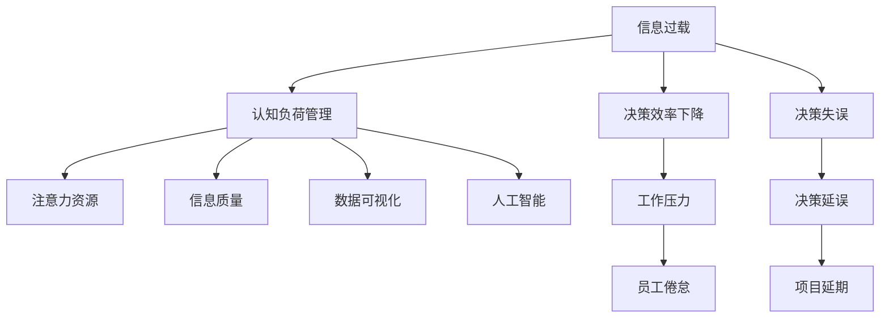

                 

# 信息过载与认知负荷管理：提高决策和问题解决能力的策略

在数字化时代，信息量爆炸性增长，人们面对的信息量越来越大，这不仅意味着知识积累的丰富，同时也带来了信息过载的问题。信息过载导致认知负荷增加，影响了人们的决策能力和问题解决能力。本文将探讨信息过载的本质、认知负荷管理的理论基础，以及如何通过技术手段减轻信息过载，提高认知负荷管理效率，进而提升人们的决策和问题解决能力。

## 1. 背景介绍

### 1.1 问题由来
随着信息技术的发展，信息获取、存储和处理变得前所未有的便捷，但也带来了一系列问题。信息过载就是其中之一，它指的是人们在面对超出其处理能力的信息量时，心理和认知负荷过度，导致工作效率下降、决策失误等问题。

### 1.2 问题核心关键点
信息过载的核心在于信息量的巨大和信息接收速度的加快。在处理大量信息时，认知负荷增加，人们需要更多的认知资源来理解和筛选信息，这直接影响了决策的准确性和效率。

### 1.3 问题研究意义
研究信息过载及其管理方法，对于提升个体和组织的决策能力、问题解决能力具有重要意义：
1. **提升效率**：通过有效管理信息，减少信息过载带来的负面影响，提高决策和问题解决的效率。
2. **增强准确性**：降低信息过载对决策的干扰，提高决策和问题解决的准确性。
3. **改善用户体验**：在信息时代，改善用户体验，使其在面对大量信息时能够更加轻松和高效地处理。

## 2. 核心概念与联系

### 2.1 核心概念概述

为更好地理解信息过载及其管理方法，本节将介绍几个密切相关的核心概念：

- **信息过载（Information Overload）**：指人们在面对超出其处理能力的信息量时，心理和认知负荷过度，导致工作效率下降、决策失误等问题。
- **认知负荷管理（Cognitive Load Management）**：通过优化信息处理过程，减轻认知负荷，提升信息处理效率和决策质量。
- **注意力资源（Attention Resources）**：认知负荷管理中的关键资源，用于筛选和处理信息，分配优先级。
- **信息质量（Information Quality）**：影响决策和问题解决的重要因素，高质量的信息能够提高决策的准确性和效率。
- **数据可视化（Data Visualization）**：通过图表、图像等形式呈现信息，直观展示数据关系，帮助理解和决策。
- **人工智能（AI）**：利用算法和模型，自动分析和处理信息，辅助决策和问题解决。

这些核心概念之间的逻辑关系可以通过以下Mermaid流程图来展示：



这个流程图展示了大语言模型的核心概念及其之间的关系：

1. 信息过载导致决策效率下降和决策失误。
2. 认知负荷管理通过优化信息处理过程，减轻认知负荷，提升决策效率和准确性。
3. 注意力资源和信息质量直接影响认知负荷管理的成效。
4. 数据可视化和人工智能是辅助决策和问题解决的重要工具。

这些概念共同构成了信息过载及其管理框架，使其能够在各种场景下发挥作用。

## 3. 核心算法原理 & 具体操作步骤
### 3.1 算法原理概述

信息过载及其管理本质上是一个信息处理与认知负荷平衡的过程。其核心思想是：通过优化信息获取、处理和决策的各个环节，减轻认知负荷，提升信息处理效率和决策能力。

形式化地，假设人们在处理信息时需要消耗的认知资源为 $C$，可获取的信息量为 $I$，信息质量为 $Q$，注意力资源的分配策略为 $A$。则认知负荷管理的优化目标为最小化 $C$，即：

$$
\mathop{\arg\min}_{C} C = f(I, Q, A)
$$

其中 $f$ 为与信息量、信息质量和注意力分配策略相关的函数。

### 3.2 算法步骤详解

信息过载及其管理一般包括以下几个关键步骤：

**Step 1: 信息评估与筛选**
- 评估信息的价值和可靠性，筛选出与任务相关的关键信息。
- 使用信息过滤算法（如PageRank、TF-IDF等）对信息进行排序和选择。

**Step 2: 信息分类与整合**
- 将信息进行分类，整合到结构化知识库中。
- 使用文本挖掘和信息抽取技术，自动分析和提取关键信息。

**Step 3: 信息可视化与展示**
- 利用数据可视化工具（如Tableau、Power BI等）呈现信息。
- 设计易于理解的图表、图像等形式，帮助用户快速获取信息。

**Step 4: 信息交互与反馈**
- 设计用户友好的信息交互界面，支持信息输入、查询、反馈等操作。
- 通过用户反馈优化信息处理策略，逐步改进认知负荷管理效果。

**Step 5: 认知负荷评估与调整**
- 评估用户在处理信息时的认知负荷，使用心理测量工具（如问卷调查、生理监测等）。
- 根据评估结果调整注意力分配策略，优化信息处理过程。

### 3.3 算法优缺点

信息过载及其管理方法具有以下优点：
1. 提高信息处理效率。通过系统化的方法筛选、分类和整合信息，减少不必要的信息处理。
2. 提升决策准确性。高质量的信息和有效的注意力分配能够提高决策的准确性和效率。
3. 增强用户体验。友好的信息交互和可视化设计，提升了用户的使用体验。

同时，该方法也存在一定的局限性：
1. 依赖高质量的数据源。信息过载管理的效果很大程度上取决于数据的质量和可靠性。
2. 技术要求较高。实现有效的信息过载管理需要较高级的信息处理和认知负荷评估技术。
3. 用户适应性问题。信息过载管理需要用户主动参与，用户适应性和接受度可能影响管理效果。

尽管存在这些局限性，但就目前而言，信息过载及其管理方法仍然是提升信息处理效率和决策能力的有效手段。未来相关研究的重点在于如何进一步降低信息过载管理的技术门槛，提高系统的可扩展性和可适应性。

### 3.4 算法应用领域

信息过载及其管理的方法在各个领域都有广泛的应用，例如：

- **企业决策**：在企业决策过程中，信息过载管理可以帮助管理者筛选关键信息，提高决策的效率和准确性。
- **医疗诊断**：医疗工作者面对大量患者信息，信息过载管理可以辅助医生快速获取关键信息，提高诊断准确性。
- **教育培训**：在教育培训过程中，信息过载管理可以帮助学生快速获取和理解学习内容，提高学习效率。
- **金融投资**：投资者需要处理大量的市场数据和新闻，信息过载管理可以帮助其快速获取关键信息，做出合理的投资决策。
- **新闻编辑**：新闻编辑面对海量新闻信息，信息过载管理可以帮助其快速筛选和处理关键新闻，提升编辑效率。

除了上述这些领域，信息过载及其管理技术还将广泛应用于更多的行业和场景中，为信息处理和决策提供新的工具和支持。

## 4. 数学模型和公式 & 详细讲解 & 举例说明

### 4.1 数学模型构建

本节将使用数学语言对信息过载及其管理过程进行更加严格的刻画。

假设人们处理信息时需要消耗的认知资源为 $C$，可获取的信息量为 $I$，信息质量为 $Q$，注意力资源的分配策略为 $A$。认知负荷管理的优化目标是最小化 $C$，即：

$$
\mathop{\arg\min}_{C} C = f(I, Q, A)
$$

其中 $f$ 为与信息量、信息质量和注意力分配策略相关的函数。

### 4.2 公式推导过程

以下我们以信息过载管理为例，推导信息质量对认知负荷的影响。

假设信息量 $I$ 为 $n$ 条，每条信息的价值为 $v_i$，信息质量为 $Q_i$。则信息总价值 $V$ 为：

$$
V = \sum_{i=1}^n v_iQ_i
$$

假设用户每次处理信息需要消耗的认知资源为 $c$，则总认知资源消耗 $C$ 为：

$$
C = \sum_{i=1}^n cQ_i
$$

因此，信息质量 $Q_i$ 对认知负荷 $C$ 的影响可以表示为：

$$
C = \frac{V}{n}c
$$

即，信息质量越高，认知负荷越小。

### 4.3 案例分析与讲解

在实际应用中，信息过载管理的效果可以通过以下案例来分析：

**案例1：企业决策**
- 企业高管在决策时，面对大量市场报告、财务报表等数据。使用信息过载管理方法，可以筛选关键指标，快速获取关键信息，辅助决策。
- 通过数据可视化工具，将关键信息图表化展示，帮助高管快速理解和决策。

**案例2：医疗诊断**
- 医生在诊断时，面对大量病历、影像数据等，信息过载管理可以帮助其快速获取关键症状和诊断结果。
- 通过知识图谱和信息抽取技术，自动提取关键信息，辅助医生进行诊断。

**案例3：新闻编辑**
- 新闻编辑在处理大量新闻稿件时，信息过载管理可以帮助其快速筛选和处理关键新闻。
- 通过信息分类和过滤算法，将新闻稿件自动分类，帮助编辑快速获取重要新闻。

通过这些案例，可以看到信息过载管理在实际应用中的具体效果和应用场景。

## 5. 项目实践：代码实例和详细解释说明
### 5.1 开发环境搭建

在进行信息过载管理实践前，我们需要准备好开发环境。以下是使用Python进行的信息过载管理开发环境配置流程：

1. 安装Anaconda：从官网下载并安装Anaconda，用于创建独立的Python环境。

2. 创建并激活虚拟环境：
```bash
conda create -n info overload python=3.8 
conda activate info overload
```

3. 安装PyTorch：根据CUDA版本，从官网获取对应的安装命令。例如：
```bash
conda install pytorch torchvision torchaudio cudatoolkit=11.1 -c pytorch -c conda-forge
```

4. 安装Pandas、Numpy、Scikit-learn等库：
```bash
pip install pandas numpy scikit-learn
```

5. 安装相关数据处理和可视化工具：
```bash
pip install seaborn matplotlib pandas
```

完成上述步骤后，即可在`info overload`环境中开始信息过载管理的开发实践。

### 5.2 源代码详细实现

我们以一个简单的信息筛选和可视化工具为例，给出信息过载管理的Python代码实现。

首先，定义信息处理函数：

```python
import pandas as pd
import seaborn as sns

def process_info(data, key_features):
    """
    处理信息，筛选关键特征，生成可视化图表
    """
    # 数据预处理
    data = data.dropna()
    
    # 筛选关键特征
    selected_features = [feature for feature in key_features if feature in data.columns]
    selected_data = data[selected_features]
    
    # 生成可视化图表
    sns.histplot(selected_data[key_features[0]], kde=True, label=key_features[0])
    sns.histplot(selected_data[key_features[1]], kde=True, label=key_features[1])
    plt.legend()
    plt.show()
```

然后，定义主函数进行信息筛选和可视化：

```python
if __name__ == '__main__':
    # 数据读取
    data = pd.read_csv('info.csv')
    
    # 定义关键特征
    key_features = ['feature1', 'feature2']
    
    # 信息处理
    process_info(data, key_features)
```

在实际应用中，可以将信息筛选和可视化的逻辑进行封装，构建通用的信息过载管理工具，方便各类场景下使用。

### 5.3 代码解读与分析

让我们再详细解读一下关键代码的实现细节：

**process_info函数**：
- `data` 参数为原始数据集。
- `key_features` 参数为需要筛选的关键特征列表。
- 数据预处理：使用 `dropna` 方法去除缺失值。
- 特征筛选：遍历关键特征列表，筛选出数据集中存在的特征。
- 数据选取：使用筛选出的特征，生成新的数据集。
- 可视化：使用 Seaborn 库生成两个关键特征的分布图，并展示出来。

**主函数**：
- 读取数据集。
- 定义关键特征。
- 调用信息处理函数，对数据进行筛选和可视化。

可以看到，信息过载管理的代码实现相对简单，但需要根据具体应用场景进行定制化设计。

## 6. 实际应用场景

### 6.1 企业决策支持

信息过载管理在企业决策支持中具有广泛应用。通过系统化的方法，企业可以快速获取关键数据和指标，辅助决策。具体场景包括：

- **市场分析**：企业需要处理大量市场数据，包括销售数据、客户反馈等。信息过载管理可以帮助其快速筛选关键指标，生成关键图表，辅助市场分析。
- **财务分析**：财务人员需要处理大量财务报表和交易数据，信息过载管理可以帮助其快速获取关键财务指标，生成关键图表，辅助财务分析。
- **运营监控**：企业需要监控各类运营数据，包括生产、库存、物流等。信息过载管理可以帮助其快速获取关键数据，生成关键图表，辅助运营监控。

### 6.2 医疗诊断辅助

在医疗诊断中，信息过载管理可以帮助医生快速获取关键信息，提高诊断准确性。具体场景包括：

- **病历分析**：医生需要处理大量患者病历，包括病史、影像数据等。信息过载管理可以帮助其快速获取关键症状和诊断结果，生成关键图表，辅助诊断。
- **影像诊断**：影像科医生需要处理大量影像数据，包括X光片、CT片等。信息过载管理可以帮助其快速获取关键影像特征，生成关键图表，辅助诊断。
- **药物管理**：药师需要处理大量药物信息，包括药效、副作用等。信息过载管理可以帮助其快速获取关键药物信息，生成关键图表，辅助药物管理。

### 6.3 教育培训支持

在教育培训中，信息过载管理可以帮助学生快速获取和理解学习内容，提高学习效率。具体场景包括：

- **教材辅助**：学生需要处理大量教材内容，包括文字、图表等。信息过载管理可以帮助其快速获取关键知识点，生成关键图表，辅助学习。
- **在线学习**：在线学习平台需要处理大量学习数据，包括课程、练习等。信息过载管理可以帮助其快速获取关键学习内容，生成关键图表，辅助学习。
- **学习反馈**：教师需要处理大量学生反馈数据，包括作业、考试等。信息过载管理可以帮助其快速获取关键反馈信息，生成关键图表，辅助教学。

### 6.4 金融投资分析

在金融投资中，信息过载管理可以帮助投资者快速获取关键信息，提高投资决策的准确性。具体场景包括：

- **市场分析**：投资者需要处理大量市场数据，包括股票价格、交易量等。信息过载管理可以帮助其快速获取关键指标，生成关键图表，辅助市场分析。
- **财务分析**：财务分析师需要处理大量财务数据，包括报表、交易数据等。信息过载管理可以帮助其快速获取关键财务指标，生成关键图表，辅助财务分析。
- **风险评估**：投资者需要评估各类投资风险，包括市场风险、信用风险等。信息过载管理可以帮助其快速获取关键风险信息，生成关键图表，辅助风险评估。

### 6.5 新闻编辑支持

在新闻编辑中，信息过载管理可以帮助编辑快速获取关键新闻，提高编辑效率。具体场景包括：

- **新闻筛选**：新闻编辑需要处理大量新闻稿件，包括新闻来源、标题等。信息过载管理可以帮助其快速筛选关键新闻，生成关键图表，辅助编辑。
- **内容审核**：编辑需要对新闻内容进行审核，包括语法、事实等。信息过载管理可以帮助其快速获取关键内容信息，生成关键图表，辅助审核。
- **稿件管理**：新闻编辑需要管理大量稿件，包括分类、存储等。信息过载管理可以帮助其快速管理关键稿件，生成关键图表，辅助管理。

## 7. 工具和资源推荐
### 7.1 学习资源推荐

为了帮助开发者系统掌握信息过载及其管理理论基础和实践技巧，这里推荐一些优质的学习资源：

1. **《认知负荷管理：提升信息处理效率》系列博文**：由认知负荷管理专家撰写，深入浅出地介绍了认知负荷管理的理论基础和实践技巧。

2. **《信息过载管理技术》课程**：斯坦福大学开设的认知负荷管理明星课程，有Lecture视频和配套作业，带你入门认知负荷管理的核心概念和经典模型。

3. **《认知负荷管理理论与实践》书籍**：权威认知负荷管理专家所著，全面介绍了认知负荷管理理论的演进和应用，是掌握认知负荷管理的重要资料。

4. **W3Schools在线教程**：提供丰富的Python代码示例和教程，帮助你快速上手信息过载管理开发。

5. **Kaggle竞赛平台**：包含大量信息过载管理相关的数据集和竞赛项目，可以锻炼你的数据分析和处理能力。

通过对这些资源的学习实践，相信你一定能够快速掌握信息过载管理的精髓，并用于解决实际的信息过载问题。

### 7.2 开发工具推荐

高效的开发离不开优秀的工具支持。以下是几款用于信息过载管理开发的常用工具：

1. **Python**：基于Python的信息过载管理开发，简单易学，生态丰富，适合快速迭代研究。

2. **Jupyter Notebook**：提供交互式代码执行和数据分析环境，适合信息过载管理的研究和开发。

3. **TensorFlow**：由Google主导开发的深度学习框架，适合处理大规模数据集和复杂模型，适合信息过载管理的深度学习应用。

4. **Pandas**：数据处理和分析库，适合数据预处理和特征工程，是信息过载管理的常用工具。

5. **Seaborn**：基于Matplotlib的数据可视化库，适合快速生成高质量的图表和图像。

6. **Tableau**：商业智能和数据可视化工具，适合复杂数据集的可视化和分析。

合理利用这些工具，可以显著提升信息过载管理的开发效率，加快创新迭代的步伐。

### 7.3 相关论文推荐

信息过载及其管理的研究源于学界的持续研究。以下是几篇奠基性的相关论文，推荐阅读：

1. **《信息过载管理：理论与实践》**：作者详细探讨了信息过载管理的基本概念、理论框架和实际应用。

2. **《认知负荷管理：理论与实践》**：探讨了认知负荷管理的原理和应用，是理解信息过载管理的重要参考。

3. **《信息质量对认知负荷的影响》**：研究了信息质量对认知负荷的直接影响，为信息过载管理提供了理论依据。

4. **《注意力分配策略对认知负荷的影响》**：研究了注意力分配策略对认知负荷的影响，为信息过载管理提供了优化方法。

这些论文代表了大语言模型微调技术的发展脉络。通过学习这些前沿成果，可以帮助研究者把握学科前进方向，激发更多的创新灵感。

## 8. 总结：未来发展趋势与挑战

### 8.1 总结

本文对信息过载及其管理方法进行了全面系统的介绍。首先阐述了信息过载的本质和认知负荷管理的理论基础，明确了信息过载管理的意义和作用。其次，从原理到实践，详细讲解了信息过载管理的数学模型和关键步骤，给出了信息过载管理任务开发的完整代码实例。同时，本文还广泛探讨了信息过载管理在企业决策、医疗诊断、教育培训、金融投资等多个领域的应用前景，展示了信息过载管理的广泛应用。

通过本文的系统梳理，可以看到，信息过载及其管理方法正在成为提升信息处理效率和决策能力的有效手段。未来的研究需要进一步降低信息过载管理的技术门槛，提高系统的可扩展性和可适应性，才能更好地满足实际应用需求。

### 8.2 未来发展趋势

展望未来，信息过载及其管理技术将呈现以下几个发展趋势：

1. **自动化程度提升**：随着自动化技术的进步，信息过载管理将更加智能化，自动筛选和分类信息，减少人工干预。

2. **跨领域应用拓展**：信息过载管理的应用范围将进一步拓展到更多领域，如医疗、教育、金融等。

3. **深度学习融合**：信息过载管理将与深度学习技术深度融合，利用模型自动学习和处理信息，提升管理效果。

4. **用户体验优化**：信息过载管理的设计将更加注重用户体验，提供友好的交互界面和直观的可视化效果。

5. **个性化管理增强**：信息过载管理将根据用户行为和偏好，动态调整信息处理策略，提供个性化的信息服务。

6. **数据安全保障**：信息过载管理将更加重视数据安全和隐私保护，确保信息处理过程中数据的安全性。

以上趋势凸显了信息过载管理技术的广阔前景。这些方向的探索发展，必将进一步提升信息处理效率和决策能力，为各个行业带来新的变革和机遇。

### 8.3 面临的挑战

尽管信息过载管理技术已经取得了一定的成果，但在迈向更加智能化、普适化应用的过程中，它仍面临着诸多挑战：

1. **数据质量瓶颈**：信息过载管理的效果很大程度上依赖于数据质量，数据不准确或不完整将严重影响管理效果。

2. **算法复杂性**：信息过载管理涉及复杂的算法和模型，需要较高的技术门槛和专业知识。

3. **用户适应性**：信息过载管理需要用户主动参与，用户适应性和接受度可能影响管理效果。

4. **系统可扩展性**：信息过载管理需要处理大量数据，系统的可扩展性和可适应性仍需改进。

5. **伦理与安全**：信息过载管理需要重视数据安全和隐私保护，避免数据泄露和滥用。

6. **跨领域整合**：信息过载管理需要与不同领域的知识体系和工具进行整合，实现跨领域的协同工作。

正视信息过载管理面临的这些挑战，积极应对并寻求突破，将是大语言模型微调走向成熟的必由之路。相信随着学界和产业界的共同努力，这些挑战终将一一被克服，信息过载管理必将在提升信息处理效率和决策能力中发挥更大的作用。

### 8.4 未来突破

面对信息过载管理所面临的种种挑战，未来的研究需要在以下几个方面寻求新的突破：

1. **提升数据质量**：开发更加高效的数据清洗和标注方法，提升数据质量，确保信息过载管理的效果。

2. **降低技术门槛**：开发更加易用和友好的信息过载管理工具，降低技术门槛，提高用户体验。

3. **引入深度学习**：利用深度学习技术，自动分析和处理信息，提高信息过载管理的效果。

4. **优化注意力分配**：研究更加智能和高效的注意力分配算法，动态调整信息处理策略，提供个性化的信息服务。

5. **融合多模态数据**：将视觉、语音、文本等多模态数据进行融合，提升信息处理效果和决策能力。

6. **增强数据安全**：采用先进的加密和保护技术，确保数据安全和隐私保护，提升信息过载管理的可信度。

这些研究方向的探索，必将引领信息过载管理技术迈向更高的台阶，为信息处理和决策提供新的工具和支持。面向未来，信息过载管理技术还需要与其他人工智能技术进行更深入的融合，如知识表示、因果推理、强化学习等，多路径协同发力，共同推动信息处理和决策系统的进步。只有勇于创新、敢于突破，才能不断拓展信息过载管理的边界，让信息处理和决策系统更好地服务于各个行业。

## 9. 附录：常见问题与解答

**Q1：信息过载管理是否可以完全自动化？**

A: 尽管信息过载管理可以通过自动化技术提升效率，但完全自动化仍然存在挑战。用户的行为和偏好具有多样性，需要根据实际情况进行动态调整和优化。因此，信息过载管理仍然需要一定的人工干预和参与，才能确保效果最佳。

**Q2：信息过载管理是否适用于所有领域？**

A: 信息过载管理在大多数领域都有广泛的应用，特别是对于数据量较大、信息处理需求较高的领域。但对于一些特定领域，如医疗、法律等，信息过载管理仍需结合领域特点进行优化。

**Q3：信息过载管理如何提升决策准确性？**

A: 信息过载管理通过筛选关键信息、整合信息、可视化信息等方式，帮助用户快速获取关键信息，减少信息过载带来的干扰，从而提升决策准确性。同时，通过深度学习和模型优化，进一步提高信息处理和决策的准确性。

**Q4：信息过载管理如何优化用户体验？**

A: 信息过载管理通过友好的交互界面和直观的可视化效果，帮助用户快速获取和理解信息，提升用户体验。同时，通过个性化推荐和定制化服务，提供更加贴合用户需求的信息服务。

**Q5：信息过载管理如何保障数据安全？**

A: 信息过载管理需要重视数据安全和隐私保护，采用加密、脱敏等技术手段，确保数据的安全性和隐私性。同时，需要对数据访问和使用进行严格控制，避免数据泄露和滥用。

通过这些常见问题的解答，可以看到信息过载管理在实际应用中的具体实现和优化方法。

---

作者：禅与计算机程序设计艺术 / Zen and the Art of Computer Programming

