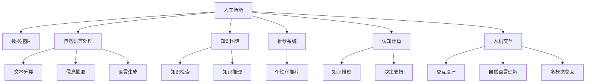

                 

## 1. 背景介绍

### 1.1 问题由来

随着互联网的快速发展和普及，信息生成和传播的速度与规模达到了前所未有的水平。据统计，全球互联网用户每天产生的数据量已经超过2500亿字节，这背后是庞大的信息流与人类接收能力的矛盾。信息过载不仅影响了人们的生活质量，还引发了认知负荷过重、决策困难等一系列问题。如何在信息过载时代，有效整合和利用这些数据，提升人类工作生活的效率，成为了一个亟待解决的技术难题。

### 1.2 问题核心关键点

信息过载问题不仅涉及信息的采集、处理和呈现，还牵涉到人机交互、认知辅助等多个层面。核心关键点包括：

- **数据质量**：如何从海量无序数据中提取高质量信息，是信息过载的根本问题。
- **智能筛选**：利用人工智能技术对信息进行智能筛选和分类，提高信息获取的效率和准确性。
- **认知辅助**：通过智能算法辅助人类进行决策和思考，减轻认知负荷，提升工作效率。
- **个性化推荐**：根据用户行为和兴趣，定制化推荐信息，提升用户体验。
- **跨领域知识融合**：将不同领域的信息和知识进行融合，提升智能系统的广度和深度。

这些关键点贯穿于信息过载问题的始终，需要从技术、应用和用户需求等多个维度进行综合考虑和解决。

### 1.3 问题研究意义

解决信息过载问题，对于提升社会工作效率、改善用户体验、促进信息资源的合理利用具有重要意义：

- **提高工作效率**：通过智能筛选和推荐，快速定位有用信息，减少决策过程中的信息冗余。
- **改善用户体验**：提供个性化、即时性的信息服务，提升用户满意度和粘性。
- **促进信息资源利用**：有效利用大规模数据，提升数据利用率和价值。
- **推动技术创新**：信息过载问题的解决催生了多种前沿AI技术，如自然语言处理、智能推荐、认知计算等。

解决信息过载问题，不仅对信息产业的可持续发展具有重大意义，还将为智慧城市、智能教育、个性化健康管理等多个领域带来变革性影响。

## 2. 核心概念与联系

### 2.1 核心概念概述

为了更好地理解信息过载问题的AI解决方案，本节将介绍几个密切相关的核心概念：

- **人工智能(AI)**：使计算机系统具备智能行为的技术，通过学习、推理、自适应等方式，实现对复杂环境的高效处理。
- **数据挖掘(Data Mining)**：从大规模数据中发现有用信息的过程，通常包括分类、聚类、关联分析等。
- **自然语言处理(NLP)**：使计算机能够理解、处理和生成人类自然语言的技术，包括文本分类、信息抽取、语言生成等。
- **知识图谱(Knowledge Graph)**：通过语义网技术，构建实体和关系的结构化知识库，辅助知识检索和推理。
- **推荐系统(Recommendation System)**：通过算法为用户推荐个性化信息，提升用户体验。
- **认知计算(Cognitive Computing)**：模拟人类认知过程，进行知识推理和决策支持，辅助人类进行深度思考。
- **人机交互(Human-Computer Interaction, HCI)**：研究如何通过交互设计，提升人机互动的自然性和效率。

这些核心概念之间的逻辑关系可以通过以下Mermaid流程图来展示：



这个流程图展示了一系列核心概念及其之间的联系：

1. 人工智能通过学习算法和智能推理，处理和理解大规模数据。
2. 数据挖掘从数据中提取有用信息，支持知识图谱的构建。
3. 自然语言处理使计算机具备自然语言理解能力，支持文本分类、信息抽取等任务。
4. 知识图谱通过语义网技术，构建知识库，辅助知识检索和推理。
5. 推荐系统根据用户行为，进行个性化信息推荐。
6. 认知计算模拟人类认知过程，进行知识推理和决策支持。
7. 人机交互设计提升自然语言理解和多模态交互的效率。

这些概念共同构成了信息过载问题的解决框架，通过技术手段实现信息的高效整合和利用。

## 3. 核心算法原理 & 具体操作步骤

### 3.1 算法原理概述

解决信息过载问题的核心算法通常包括：

- **数据清洗和预处理**：去除噪声和冗余信息，提升数据质量。
- **特征提取和表示**：从原始数据中提取关键特征，形成结构化表示。
- **智能筛选和分类**：利用机器学习算法对信息进行筛选和分类。
- **个性化推荐**：通过推荐算法为用户推荐个性化信息。
- **知识图谱构建**：构建结构化知识库，支持知识检索和推理。
- **认知计算与决策支持**：模拟人类认知过程，进行知识推理和决策支持。

这些算法共同构成了信息过载问题的解决框架，通过技术手段实现信息的高效整合和利用。

### 3.2 算法步骤详解

以下是解决信息过载问题的一般流程：

**Step 1: 数据收集与清洗**
- 收集原始数据，如文本、图像、视频等。
- 进行数据清洗，去除噪声和冗余信息。

**Step 2: 特征提取与表示**
- 利用NLP技术进行文本特征提取，如TF-IDF、Word2Vec等。
- 利用图像处理技术提取图像特征，如CNN、SIFT等。
- 利用语义分析技术构建知识图谱。

**Step 3: 智能筛选与分类**
- 利用机器学习算法对信息进行智能筛选和分类。
- 常见的算法包括决策树、随机森林、支持向量机、深度学习等。

**Step 4: 个性化推荐**
- 根据用户行为和兴趣，进行个性化信息推荐。
- 常见的推荐算法包括协同过滤、基于内容的推荐、深度学习推荐等。

**Step 5: 知识图谱构建**
- 利用语义网技术构建知识图谱，支持知识检索和推理。
- 常见的工具包括RDF、OWL、SPARQL等。

**Step 6: 认知计算与决策支持**
- 利用认知计算技术进行知识推理和决策支持。
- 常见的工具包括IBM Watson、Google DeepMind等。

### 3.3 算法优缺点

解决信息过载问题的算法具有以下优点：

- **高效性**：通过智能算法处理和筛选信息，大幅提高信息获取的效率。
- **个性化**：能够根据用户行为和兴趣，定制化推荐信息，提升用户体验。
- **自动化**：利用机器学习和认知计算技术，实现自动化处理和决策支持。

同时，这些算法也存在一些局限性：

- **数据质量依赖**：算法的性能高度依赖于原始数据的质量和数量，低质量数据可能导致错误结论。
- **算法复杂性**：部分算法（如深度学习）对计算资源和数据量要求较高，需投入大量算力。
- **隐私和安全问题**：在数据收集和处理过程中，存在用户隐私泄露和数据安全问题。

### 3.4 算法应用领域

解决信息过载问题的算法在多个领域得到应用，例如：

- **智能客服**：利用NLP技术，进行智能筛选和分类，提升客服效率和质量。
- **电商推荐**：通过协同过滤和基于内容的推荐，为用户提供个性化商品推荐。
- **金融风控**：利用数据挖掘和知识图谱技术，进行风险评估和监控。
- **智能医疗**：通过认知计算和决策支持，提升诊疗和健康管理的效果。
- **智慧城市**：利用数据清洗和智能筛选，提升城市管理效率和市民生活质量。

此外，这些算法还在教育、交通、能源等多个领域得到广泛应用，为社会发展和产业升级提供了强大的技术支撑。

## 4. 数学模型和公式 & 详细讲解 & 举例说明

### 4.1 数学模型构建

以文本分类为例，我们假设有一个二分类任务，输入为文本 $x$，输出为类别标签 $y \in \{0, 1\}$。我们的目标是最小化损失函数 $\ell(y, \hat{y})$，其中 $\hat{y}$ 为模型预测的类别标签。

假设模型 $M$ 的输出为 $M(x) \in [0, 1]$，表示样本属于正类的概率。则二分类交叉熵损失函数定义为：

$$
\ell(y, \hat{y}) = -y\log \hat{y} - (1-y)\log(1-\hat{y})
$$

其梯度为：

$$
\nabla_{\theta}\ell(y, \hat{y}) = \frac{y}{\hat{y}} - \frac{1-y}{1-\hat{y}}
$$

其中 $\theta$ 为模型的参数。

### 4.2 公式推导过程

以下是文本分类的详细推导过程：

**Step 1: 模型构建**
- 定义输入 $x$ 和输出 $y$。
- 定义模型 $M$，输出 $M(x) \in [0, 1]$。
- 定义损失函数 $\ell(y, \hat{y})$。

**Step 2: 模型训练**
- 通过反向传播算法计算梯度 $\nabla_{\theta}\ell(y, \hat{y})$。
- 使用优化算法（如SGD、Adam等）更新模型参数 $\theta$。

**Step 3: 模型评估**
- 在测试集上评估模型性能，如准确率、召回率、F1值等。

**Step 4: 模型部署**
- 将训练好的模型部署到实际应用中，进行信息筛选和分类。

### 4.3 案例分析与讲解

以下以电商推荐系统为例，说明如何利用机器学习算法实现个性化推荐：

**Step 1: 数据收集**
- 收集用户历史行为数据，如浏览、点击、购买等。
- 收集商品信息，如属性、标签、评分等。

**Step 2: 数据处理**
- 清洗数据，去除噪声和冗余信息。
- 进行特征提取，如特征选择、降维等。

**Step 3: 模型训练**
- 选择合适的推荐算法，如协同过滤、基于内容的推荐、深度学习推荐等。
- 在训练集上训练模型，调整超参数。

**Step 4: 模型评估**
- 在验证集上评估模型性能，如精度、召回率、ROC曲线等。
- 调整模型参数，优化性能。

**Step 5: 模型部署**
- 将训练好的模型部署到推荐系统中，进行个性化推荐。
- 实时监测系统性能，优化推荐效果。

## 5. 项目实践：代码实例和详细解释说明

### 5.1 开发环境搭建

在进行信息过载解决方案的开发时，需要准备好开发环境。以下是使用Python进行开发的环境配置流程：

1. 安装Anaconda：从官网下载并安装Anaconda，用于创建独立的Python环境。

2. 创建并激活虚拟环境：
```bash
conda create -n ai-env python=3.8 
conda activate ai-env
```

3. 安装必要的Python包：
```bash
pip install numpy pandas sklearn scikit-learn torch transformers
```

4. 安装深度学习框架：
```bash
pip install tensorflow pytorch
```

5. 安装自然语言处理库：
```bash
pip install nltk gensim spacy
```

完成上述步骤后，即可在`ai-env`环境中开始开发。

### 5.2 源代码详细实现

这里我们以电商推荐系统为例，给出使用TensorFlow实现推荐算法的PyTorch代码实现。

首先，定义数据集和模型：

```python
import tensorflow as tf
from tensorflow.keras.layers import Input, Dense, Embedding, Dropout, concatenate
from tensorflow.keras.models import Model

# 定义数据集
input_user = Input(shape=(1,), name='user')
input_item = Input(shape=(1,), name='item')

# 定义用户特征和物品特征
user_embedding = Embedding(input_dim=num_users, output_dim=embedding_size, name='user_embedding')(input_user)
item_embedding = Embedding(input_dim=num_items, output_dim=embedding_size, name='item_embedding')(input_item)

# 定义隐藏层
hidden_layer = Dense(hidden_size, activation='relu', name='hidden')(concatenate([user_embedding, item_embedding]))
dropout = Dropout(dropout_rate)(hidden_layer)

# 定义输出层
output = Dense(1, activation='sigmoid', name='output')(dropout)

# 定义模型
model = Model(inputs=[input_user, input_item], outputs=output)
model.compile(loss='binary_crossentropy', optimizer='adam', metrics=['accuracy'])
```

然后，训练和评估模型：

```python
# 训练模型
model.fit([user_ids_train, item_ids_train], ratings_train, epochs=num_epochs, batch_size=batch_size, validation_data=([user_ids_val, item_ids_val], ratings_val))

# 评估模型
loss, accuracy = model.evaluate([user_ids_test, item_ids_test], ratings_test)
print(f'Test loss: {loss:.4f}, Test accuracy: {accuracy:.4f}')
```

### 5.3 代码解读与分析

让我们再详细解读一下关键代码的实现细节：

**电商推荐系统模型构建**
- `Input`层：定义用户和物品的输入。
- `Embedding`层：将用户和物品的ID映射到低维向量表示。
- `Dense`层：定义隐藏层，采用ReLU激活函数。
- `Dropout`层：进行正则化，防止过拟合。
- `Dense`层：定义输出层，采用sigmoid激活函数进行二分类。
- `Model`层：定义模型结构。

**模型训练与评估**
- `fit`函数：在训练集上训练模型，使用Adam优化器和交叉熵损失函数。
- `evaluate`函数：在测试集上评估模型性能，输出损失和准确率。

这些代码实现了基本的电商推荐系统模型，通过用户和物品的向量表示，进行二分类预测。

## 6. 实际应用场景

### 6.1 智能客服系统

智能客服系统是信息过载问题解决的重要应用场景。传统客服系统依赖人力处理客户咨询，高峰期响应速度慢，处理效率低。通过智能客服系统，利用NLP技术和推荐算法，实现自动问答和个性化推荐，可以大幅提升客服效率和用户满意度。

在技术实现上，可以收集历史客服数据，训练NLP模型进行自然语言理解和对话生成。同时，根据用户的历史行为和反馈，进行个性化推荐，引导用户选择解决方案。

### 6.2 电商推荐系统

电商推荐系统通过推荐算法，为用户推荐个性化商品，提升购物体验和转化率。传统推荐系统依赖用户的历史行为数据，无法处理新用户或少样本用户。通过利用NLP和认知计算技术，可以进一步提升推荐系统的鲁棒性和智能化水平。

例如，可以利用文本挖掘技术提取商品描述和用户评论中的情感信息，进行情感分析。同时，结合用户的行为数据，进行情感倾向的预测，实现更准确的个性化推荐。

### 6.3 智慧医疗

智慧医疗系统通过信息过载问题的解决，提升诊疗和健康管理的效果。传统医疗系统依赖医生经验，难以处理海量病例和复杂信息。通过构建知识图谱和认知计算模型，可以实现疾病的智能诊断和个性化治疗方案推荐。

例如，可以构建基于知识图谱的医学知识库，利用语义分析技术进行疾病推理和症状匹配。同时，结合患者的历史诊疗数据，进行个性化治疗方案的推荐，提升诊疗效果。

### 6.4 未来应用展望

随着信息过载问题的解决，AI技术将在更多领域得到应用，为社会发展和产业升级提供新的动力。

在智慧城市中，通过智能监控和数据分析，提升城市管理效率和市民生活质量。在智能教育中，利用个性化推荐和认知辅助，提升教育公平和教学效果。在个性化健康管理中，通过智能诊断和健康监控，提升疾病预防和健康管理的精准性。

## 7. 工具和资源推荐

### 7.1 学习资源推荐

为了帮助开发者系统掌握信息过载问题的AI解决方案，这里推荐一些优质的学习资源：

1. 《深度学习》系列书籍：由Yoshua Bengio、Ian Goodfellow、Aaron Courville合著，深入浅出地介绍了深度学习的基本原理和应用。

2. 《自然语言处理综论》：由Daniel Jurafsky和James H. Martin合著，全面介绍了自然语言处理的技术和应用。

3. 《推荐系统实践》：由Adrian Rendle和Fabian Kuhn合著，详细介绍了推荐系统的工作原理和优化技巧。

4. IBM Watson和Google DeepMind的官方文档和教程，提供了丰富的AI应用案例和开发资源。

5. TensorFlow和PyTorch的官方文档和教程，提供了强大的深度学习开发环境。

6. Coursera和edX上的相关课程，提供高质量的AI和机器学习教育资源。

通过对这些资源的学习实践，相信你一定能够快速掌握信息过载问题的AI解决方案，并用于解决实际的NLP问题。

### 7.2 开发工具推荐

高效的开发离不开优秀的工具支持。以下是几款用于信息过载问题解决开发的常用工具：

1. Jupyter Notebook：交互式的开发环境，支持Python、R、SQL等多种语言，方便代码调试和数据可视化。

2. TensorFlow和PyTorch：强大的深度学习框架，提供丰富的模型和算法支持。

3. HuggingFace Transformers库：NLP工具库，集成了多个预训练语言模型，支持NLP任务的开发。

4. Weights & Biases：模型训练的实验跟踪工具，可以记录和可视化模型训练过程中的各项指标，方便对比和调优。

5. Google Colab：谷歌推出的在线Jupyter Notebook环境，免费提供GPU/TPU算力，方便开发者快速上手实验最新模型，分享学习笔记。

合理利用这些工具，可以显著提升信息过载问题解决的开发效率，加快创新迭代的步伐。

### 7.3 相关论文推荐

信息过载问题的解决源于学界的持续研究。以下是几篇奠基性的相关论文，推荐阅读：

1. "Text Mining: Concepts and Techniques" by Charles Elkan：全面介绍了文本挖掘的概念和技术。

2. "The Elements of Statistical Learning" by Trevor Hastie, Robert Tibshirani and Jerome Friedman：介绍了统计学习的基本理论和应用，包括特征提取、分类、回归等。

3. "Recommender Systems Handbook" by Nicholas J. S Isnard和Tanay Anapurnapandian：详细介绍了推荐系统的工作原理和优化方法。

4. "Cognitive Computing: Foundations of Reasoning and Intelligent Interaction" by Pierre Marcellin和Gerhard Stollnau：介绍了认知计算的基本原理和应用。

5. "Deep Learning for NLP: A Survey" by Yoon Kim：介绍了深度学习在自然语言处理中的应用。

这些论文代表了大语言模型微调技术的发展脉络。通过学习这些前沿成果，可以帮助研究者把握学科前进方向，激发更多的创新灵感。

## 8. 总结：未来发展趋势与挑战

### 8.1 总结

本文对信息过载问题的AI解决方案进行了全面系统的介绍。首先阐述了信息过载问题的背景和意义，明确了AI技术在解决信息过载中的独特价值。其次，从原理到实践，详细讲解了信息过载问题解决的技术流程和核心算法，给出了具体的代码实现和解释。同时，本文还广泛探讨了信息过载问题在多个领域的应用前景，展示了AI技术的广泛应用潜力。

通过本文的系统梳理，可以看到，AI技术在解决信息过载问题中具有重要地位。这些技术不仅提升了信息获取和处理的效率，还为智慧城市、智能教育、个性化健康管理等多个领域带来了变革性影响。未来，伴随AI技术的不断进步，信息过载问题必将在更多领域得到解决，为社会发展和产业升级提供新的动力。

### 8.2 未来发展趋势

展望未来，信息过载问题的AI解决方案将呈现以下几个发展趋势：

1. **多模态信息融合**：随着多模态数据（如文本、图像、音频等）的融合，AI系统将具备更强大的感知和理解能力，提升信息处理效率。

2. **知识图谱的深度学习**：结合知识图谱和深度学习技术，AI系统将具备更强的知识推理和关系挖掘能力，提升决策的准确性和可靠性。

3. **认知计算的普及**：认知计算技术将更多地应用于智慧医疗、智能教育等领域，辅助人类进行决策和思考。

4. **个性化和自适应**：AI系统将根据用户行为和环境变化，进行动态调整和优化，提升用户体验和系统性能。

5. **跨领域知识的融合**：AI系统将结合不同领域的专业知识，提升跨领域信息处理的广度和深度。

6. **自动化和智能化**：AI系统将更多地应用于自动化任务处理，如自动驾驶、智能客服、智能制造等。

以上趋势凸显了AI技术在信息过载问题解决中的广阔前景。这些方向的探索发展，必将进一步提升AI系统的性能和应用范围，为人类生产和生活带来更多的便利和智能化。

### 8.3 面临的挑战

尽管AI技术在解决信息过载问题中取得了显著进展，但在迈向更加智能化、普适化应用的过程中，仍面临诸多挑战：

1. **数据质量问题**：AI系统的性能高度依赖于数据质量，低质量数据可能导致错误结论。如何提升数据采集和处理的效率和准确性，仍是一个重要问题。

2. **算法复杂性**：部分算法（如深度学习）对计算资源和数据量要求较高，需投入大量算力。如何降低算法复杂性，提高系统效率，需要更多研究和优化。

3. **隐私和安全问题**：在数据收集和处理过程中，存在用户隐私泄露和数据安全问题。如何在确保隐私安全的前提下，优化算法性能，仍是一个重要挑战。

4. **公平性和偏见**：AI系统可能存在偏见和歧视，影响公平性。如何设计公平、透明的算法，避免偏见，仍是一个重要问题。

5. **可解释性和可控性**：AI系统的决策过程缺乏可解释性，难以进行调试和优化。如何增强系统的可解释性和可控性，仍是一个重要挑战。

6. **普适性和鲁棒性**：AI系统需要在不同领域和环境中具备普适性和鲁棒性，避免过拟合和泛化不足。如何提升系统的普适性和鲁棒性，仍是一个重要问题。

正视这些挑战，积极应对并寻求突破，将是大语言模型微调走向成熟的必由之路。相信随着学界和产业界的共同努力，这些挑战终将一一被克服，AI技术必将在信息过载问题解决中发挥更大的作用。

### 8.4 研究展望

面对信息过载问题的解决面临的诸多挑战，未来的研究需要在以下几个方面寻求新的突破：

1. **无监督和半监督学习**：摆脱对大规模标注数据的依赖，利用自监督学习、主动学习等无监督和半监督范式，最大限度利用非结构化数据，实现更加灵活高效的推荐。

2. **知识图谱的深度学习**：结合知识图谱和深度学习技术，提升AI系统在知识推理和关系挖掘方面的能力，提升决策的准确性和可靠性。

3. **多模态信息融合**：结合不同模态的数据，提升AI系统在感知和理解方面的能力，实现多模态信息的高效处理和融合。

4. **认知计算的普及**：利用认知计算技术，提升AI系统在决策和思考方面的能力，辅助人类进行深度思考和复杂决策。

5. **隐私保护和安全**：设计隐私保护和安全机制，确保用户隐私和数据安全，同时提升算法性能。

6. **公平性和偏见**：设计公平、透明的算法，避免偏见和歧视，提升系统的公平性。

7. **可解释性和可控性**：增强AI系统的可解释性和可控性，确保决策过程透明和可解释。

这些研究方向将引领AI技术在信息过载问题解决中迈向更高的台阶，为构建安全、可靠、可解释、可控的智能系统铺平道路。面向未来，AI技术还需要与其他AI技术进行更深入的融合，如自然语言处理、图像处理、知识图谱等，多路径协同发力，共同推动信息过载问题的解决。

## 9. 附录：常见问题与解答

**Q1：信息过载问题如何影响工作和生活的各个方面？**

A: 信息过载问题不仅影响了信息获取和处理的效率，还对人们的认知负荷、决策能力、心理健康等方面产生了负面影响。具体表现为：

1. **认知负荷过重**：在海量信息面前，人们难以有效地筛选和处理信息，导致注意力分散，认知负荷增加。
2. **决策困难**：信息过载使得决策变得更加困难，人们难以从大量信息中找到关键点和参考依据，无法做出明智的决策。
3. **工作效率下降**：在信息爆炸的环境下，人们需要更多的时间和精力来处理和分析信息，工作效率降低。
4. **心理压力增大**：信息的不断涌入使得人们感到焦虑和压力，心理状态受到影响。

这些问题的存在，严重影响了人们的工作和生活质量，需要通过AI技术进行有效缓解和解决。

**Q2：信息过载问题如何解决？**

A: 解决信息过载问题，主要通过以下几个步骤：

1. **数据清洗和预处理**：去除噪声和冗余信息，提升数据质量。
2. **特征提取和表示**：从原始数据中提取关键特征，形成结构化表示。
3. **智能筛选和分类**：利用机器学习算法对信息进行筛选和分类。
4. **个性化推荐**：通过推荐算法为用户推荐个性化信息。
5. **知识图谱构建**：构建结构化知识库，支持知识检索和推理。
6. **认知计算与决策支持**：模拟人类认知过程，进行知识推理和决策支持。

这些步骤通过技术和算法手段，实现信息的高效整合和利用，缓解信息过载问题。

**Q3：如何提升AI系统的可解释性和可控性？**

A: 提升AI系统的可解释性和可控性，是当前AI研究的重要方向之一。以下是一些可行的方法：

1. **可解释性模型**：设计可解释性强的模型，如线性模型、决策树等，使得模型的决策过程透明、可解释。
2. **模型可视化**：利用可视化工具，展示模型的决策过程和特征重要性，帮助用户理解模型。
3. **解释生成工具**：开发生成解释的工具，如LIME、SHAP等，解释模型的预测结果和决策依据。
4. **公平性和透明性**：设计公平、透明的算法，避免偏见和歧视，提升系统的公平性。
5. **多模型集成**：利用多个模型的结果进行集成，提升系统的鲁棒性和可解释性。
6. **人工干预和反馈**：引入人工干预和反馈机制，辅助模型进行决策和优化。

通过这些方法，可以提升AI系统的可解释性和可控性，确保其决策过程透明、公正、可靠。

**Q4：未来AI技术在信息过载问题解决中将扮演什么角色？**

A: 未来，AI技术在信息过载问题解决中将扮演更加重要的角色，具体体现在以下几个方面：

1. **高效的信息处理**：AI技术通过智能算法处理和筛选信息，大幅提高信息获取的效率。
2. **个性化推荐和智能辅助**：AI技术能够根据用户行为和兴趣，进行个性化推荐和智能辅助，提升用户体验。
3. **自动化和智能化**：AI技术通过自动化处理和智能化决策，提升信息处理的效率和准确性。
4. **跨领域知识融合**：AI技术能够结合不同领域的专业知识，提升跨领域信息处理的广度和深度。
5. **人机协同工作**：AI技术通过人机协同，提升信息处理的效率和质量，减轻人类认知负荷。

未来，随着AI技术的不断进步，其在信息过载问题解决中的应用将更加广泛和深入，为社会发展和产业升级提供新的动力。

**Q5：如何构建跨领域知识图谱？**

A: 构建跨领域知识图谱，需要结合多个领域的专业知识，形成综合性的知识库。以下是一些可行的方法：

1. **数据采集和整合**：从不同领域的数据源中收集数据，并进行整合和清洗，形成统一的知识库。
2. **语义分析技术**：利用语义分析技术，识别和提取知识图谱中的实体和关系，提升知识图谱的准确性和完整性。
3. **知识推理和融合**：利用知识推理技术，将不同领域的知识进行融合和关联，提升知识图谱的广度和深度。
4. **用户反馈和迭代**：引入用户反馈机制，不断更新和优化知识图谱，提升其适用性和可用性。

通过这些方法，可以构建跨领域知识图谱，提升AI系统在跨领域信息处理方面的能力。

**Q6：信息过载问题解决的核心是什么？**

A: 信息过载问题解决的核心在于通过技术手段实现信息的高效整合和利用，具体包括以下几个方面：

1. **数据清洗和预处理**：去除噪声和冗余信息，提升数据质量。
2. **特征提取和表示**：从原始数据中提取关键特征，形成结构化表示。
3. **智能筛选和分类**：利用机器学习算法对信息进行筛选和分类。
4. **个性化推荐**：通过推荐算法为用户推荐个性化信息。
5. **知识图谱构建**：构建结构化知识库，支持知识检索和推理。
6. **认知计算与决策支持**：模拟人类认知过程，进行知识推理和决策支持。

这些步骤通过技术和算法手段，实现信息的高效整合和利用，缓解信息过载问题。

---

作者：禅与计算机程序设计艺术 / Zen and the Art of Computer Programming

