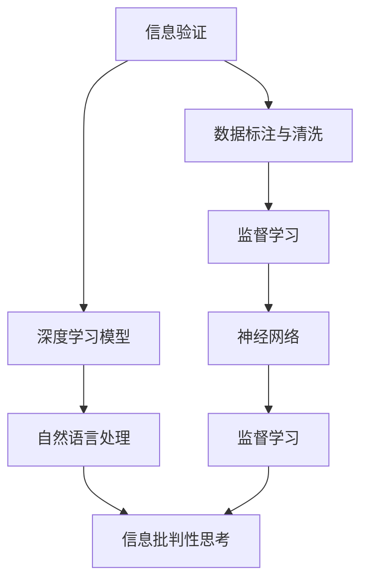
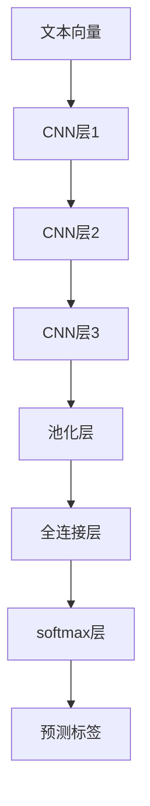

                 

# 信息验证和信息批判性思考：在假新闻和错误信息时代导航

## 1. 背景介绍

### 1.1 问题由来
随着互联网和社交媒体的迅猛发展，信息的传播速度和范围达到了前所未有的高度。但与此同时，假新闻、错误信息和网络谣言的泛滥，给社会带来了严重的负面影响。据统计，全球每年至少有100万条虚假信息在网络上传播，对政治、经济、社会等多方面产生了深远影响。如何有效识别和验证信息真伪，提高公众的信息批判性，成为摆在社会面前的重大挑战。

### 1.2 问题核心关键点
在假新闻和错误信息横行的时代，信息验证和批判性思考成为亟待解决的关键问题。如何构建一个可靠、高效的信息验证系统，帮助用户识别真伪信息，减少信息偏差，是一个复杂而多维的问题。

核心问题包括以下几个方面：
1. **信息来源的可靠性验证**：确保信息来源于可信的渠道，如官方发布、权威媒体、科学机构等。
2. **事实核查的准确性**：对关键数据和事实进行交叉验证，确保信息的真实性。
3. **逻辑推理的合理性**：评估信息的逻辑结构，识别其中的不合理或矛盾之处。
4. **公众意识的提升**：增强公众的信息敏感性和批判性思维能力。

### 1.3 问题研究意义
构建一个有效的信息验证和批判性思考系统，对于维护社会稳定、促进公正透明的信息环境具有重要意义。其研究意义体现在：

1. **提升信息素养**：通过教育和引导，帮助公众提升信息甄别和批判性思考能力，减少误导性信息的传播。
2. **维护公共利益**：在重大社会事件和公共决策中，防止虚假信息误导公众，保护公共利益不受损害。
3. **促进知识传播**：构建一个可靠的信息环境，有利于知识的传播和交流，促进社会进步和发展。
4. **打击网络犯罪**：通过技术手段识别和打击网络谣言和虚假信息，保障网络空间的清朗和有序。

## 2. 核心概念与联系

### 2.1 核心概念概述

为更好地理解信息验证和批判性思考的原理与架构，本节将介绍几个关键概念及其相互联系：

- **信息验证**：通过技术手段验证信息来源的可靠性、事实的准确性、逻辑的合理性等，确保信息的真实性和可信度。
- **信息批判性思考**：基于信息验证的结果，结合专业知识和社会常识，对信息进行深层次的分析和评判，识别可能的偏差和误解。
- **深度学习**：利用机器学习技术，特别是深度学习模型，自动化地进行信息验证和批判性思考。
- **自然语言处理(NLP)**：研究如何使计算机理解和处理人类语言的技术，是信息验证和批判性思考的重要基础。
- **数据标注与清洗**：通过人工标注和数据清洗，构建高质量的训练数据集，提升模型的准确性和泛化能力。

这些核心概念之间的逻辑关系可以通过以下Mermaid流程图来展示：



这个流程图展示了信息验证和批判性思考的核心概念及其相互关系：

1. 信息验证依赖于高质量的标注数据和高效的深度学习模型。
2. 深度学习模型利用NLP技术进行信息理解和分析。
3. 信息批判性思考结合深度学习模型的结果和专业知识，进行深入分析。
4. 数据标注与清洗是深度学习模型训练的前提，监督学习是深度学习的重要训练方式。

## 3. 核心算法原理 & 具体操作步骤
### 3.1 算法原理概述

信息验证和批判性思考的算法原理主要基于深度学习和自然语言处理技术，通过对信息进行自动化的验证和分析，结合批判性思维进行信息的综合评判。其核心思想是：

1. **信息来源验证**：通过网络爬虫等技术，收集新闻、文章等信息来源，使用深度学习模型对来源的可靠性进行评估。
2. **事实核查**：对信息中的关键事实进行交叉验证，使用深度学习模型分析事实的真实性。
3. **逻辑推理**：结合深度学习模型对信息进行逻辑分析，识别其中的不合理或矛盾之处。
4. **公众教育**：通过自然语言处理技术，生成易于理解的教育材料，提升公众的信息素养。

### 3.2 算法步骤详解

信息验证和批判性思考的算法步骤如下：

**Step 1: 数据收集与预处理**
- 使用网络爬虫等技术，收集来自不同渠道的新闻、文章等信息。
- 对收集到的信息进行清洗，去除低质量、重复或无关的信息。
- 对文本进行分词、去停用词等预处理操作，构建可用于深度学习的文本向量。

**Step 2: 模型训练与验证**
- 使用监督学习的方法，对深度学习模型进行训练，使其能够识别可靠的信息来源和真实的事实。
- 使用交叉验证等技术，评估模型的性能，调整超参数以优化模型。

**Step 3: 信息验证与批判性思考**
- 对收集到的信息进行自动化的来源验证和事实核查。
- 对信息进行逻辑分析，识别其中的不合理或矛盾之处。
- 结合深度学习模型的结果和专业知识，进行信息批判性思考，生成易于理解的教育材料。

**Step 4: 公众教育与反馈**
- 通过自然语言处理技术，生成易于理解的教育材料，提升公众的信息素养。
- 收集公众的反馈，进一步优化信息验证和批判性思考系统的准确性和实用性。

### 3.3 算法优缺点

信息验证和批判性思考的算法具有以下优点：
1. **高效自动化**：通过深度学习和自然语言处理技术，实现信息的自动化验证和批判性思考，节省了大量人力和时间。
2. **覆盖面广**：模型可以处理海量的信息，涵盖了各种类型的来源和事实，具有广泛的适用性。
3. **易于扩展**：通过模型微调和算法改进，可以不断提升信息验证和批判性思考的准确性和泛化能力。

同时，该算法也存在以下局限性：
1. **依赖高质量数据**：深度学习模型对标注数据的质量和数量要求较高，数据质量差可能导致模型误判。
2. **泛化能力有限**：模型可能难以处理非标准格式或异常情况，泛化能力有限。
3. **缺乏人性化**：模型缺乏人类的直觉和常识，无法完全替代人工的信息判断和批判性思考。
4. **隐私风险**：信息收集和处理过程中可能存在隐私泄露的风险。

尽管存在这些局限性，但深度学习在信息验证和批判性思考中的应用，无疑为解决信息泛滥和误导问题提供了一种新的有效手段。

### 3.4 算法应用领域

信息验证和批判性思考的算法已经在多个领域得到了广泛应用，例如：

- **新闻媒体**：在新闻编辑和审核过程中，自动验证信息来源的可靠性，提升新闻报道的准确性。
- **社交媒体**：自动检测和标记虚假信息和网络谣言，减少谣言传播。
- **教育培训**：生成教育材料，提升公众的信息素养，增强批判性思维能力。
- **公共决策**：在公共政策和决策过程中，提供客观、真实的信息支持，减少决策偏差。
- **网络安全**：识别和打击网络钓鱼和恶意信息，保护网络安全。

## 4. 数学模型和公式 & 详细讲解 & 举例说明

### 4.1 数学模型构建

信息验证和批判性思考的数学模型构建主要依赖于深度学习模型，特别是卷积神经网络(CNN)和循环神经网络(RNN)。以文本信息验证为例，其数学模型如下：

设输入文本为 $x_1, x_2, ..., x_n$，经过分词、去除停用词等预处理后，构建文本向量 $X$。输出为文本的来源验证标签 $y$。

假设使用CNN模型进行文本特征提取和分类，模型结构如下：



其中，CNN层通过卷积核提取文本特征，池化层对特征进行降维，全连接层进行分类。

### 4.2 公式推导过程

以文本分类为例，假设模型参数为 $\theta$，则模型的损失函数为交叉熵损失函数：

$$
L(\theta) = -\frac{1}{N} \sum_{i=1}^N y_i \log \hat{y_i} + (1-y_i) \log (1-\hat{y_i})
$$

其中 $y_i$ 为真实标签，$\hat{y_i}$ 为模型预测的标签。

模型的梯度下降更新公式为：

$$
\theta \leftarrow \theta - \eta \nabla_{\theta} L(\theta)
$$

其中 $\eta$ 为学习率。

在训练过程中，通过反向传播算法计算梯度，更新模型参数。

### 4.3 案例分析与讲解

以下是一个简单的文本分类案例：

假设有一篇新闻报道，内容如下：“本地突发火灾，造成10人伤亡”。通过网络爬虫收集到该报道的来源和日期，将其输入到信息验证模型中。

模型首先对文本进行预处理，构建文本向量 $X$。然后通过CNN模型提取特征，经过池化层和全连接层，得到预测标签 $y$。模型评估预测结果与真实标签的差异，更新模型参数。

最后，将模型验证后的结果输出给用户，并结合领域知识进行批判性思考，如检查新闻来源的可靠性，验证火灾的详细情况等。

## 5. 项目实践：代码实例和详细解释说明

### 5.1 开发环境搭建

在进行信息验证和批判性思考的开发前，我们需要准备好开发环境。以下是使用Python进行TensorFlow开发的环境配置流程：

1. 安装Anaconda：从官网下载并安装Anaconda，用于创建独立的Python环境。

2. 创建并激活虚拟环境：
```bash
conda create -n tf-env python=3.8 
conda activate tf-env
```

3. 安装TensorFlow：根据CUDA版本，从官网获取对应的安装命令。例如：
```bash
conda install tensorflow -c tf -c conda-forge
```

4. 安装Keras：
```bash
pip install keras
```

5. 安装各类工具包：
```bash
pip install numpy pandas scikit-learn matplotlib tqdm jupyter notebook ipython
```

完成上述步骤后，即可在`tf-env`环境中开始信息验证和批判性思考任务的开发。

### 5.2 源代码详细实现

这里我们以文本分类任务为例，给出使用TensorFlow实现信息验证的PyTorch代码实现。

首先，定义数据处理函数：

```python
from tensorflow.keras.preprocessing.text import Tokenizer
from tensorflow.keras.preprocessing.sequence import pad_sequences
import tensorflow as tf

def preprocess_text(texts):
    tokenizer = Tokenizer()
    tokenizer.fit_on_texts(texts)
    sequences = tokenizer.texts_to_sequences(texts)
    padded_sequences = pad_sequences(sequences, maxlen=100, padding='post', truncating='post')
    return padded_sequences, tokenizer.word_index
```

然后，定义模型和优化器：

```python
from tensorflow.keras.models import Sequential
from tensorflow.keras.layers import Dense, Dropout, Embedding, Conv1D, MaxPooling1D, Flatten

model = Sequential()
model.add(Embedding(input_dim=len(tokenizer.word_index)+1, output_dim=64, input_length=100))
model.add(Conv1D(filters=32, kernel_size=3, activation='relu'))
model.add(MaxPooling1D(pool_size=2))
model.add(Dropout(0.5))
model.add(Conv1D(filters=64, kernel_size=3, activation='relu'))
model.add(MaxPooling1D(pool_size=2))
model.add(Dropout(0.5))
model.add(Flatten())
model.add(Dense(64, activation='relu'))
model.add(Dropout(0.5))
model.add(Dense(1, activation='sigmoid'))

model.compile(loss='binary_crossentropy', optimizer='adam', metrics=['accuracy'])
```

接着，定义训练和评估函数：

```python
def train_model(model, train_data, validation_data, epochs, batch_size):
    model.fit(train_data[0], train_data[1], validation_data=validation_data,
             epochs=epochs, batch_size=batch_size, verbose=1)
    return model

def evaluate_model(model, test_data, batch_size):
    model.evaluate(test_data[0], test_data[1], batch_size=batch_size)
```

最后，启动训练流程并在测试集上评估：

```python
epochs = 5
batch_size = 16

train_data = preprocess_text(train_texts)
validation_data = preprocess_text(validation_texts)
test_data = preprocess_text(test_texts)

model = train_model(model, train_data, validation_data, epochs, batch_size)
evaluate_model(model, test_data, batch_size)
```

以上就是使用TensorFlow实现文本分类的信息验证代码实现。可以看到，TensorFlow提供了丰富的深度学习组件，使得模型的构建和训练变得简单高效。

### 5.3 代码解读与分析

让我们再详细解读一下关键代码的实现细节：

**preprocess_text函数**：
- `Tokenizer`用于将文本转换为序列数据。
- `pad_sequences`用于对序列进行填充，确保所有序列长度一致。

**模型构建**：
- `Embedding`层将文本序列转换为向量表示。
- `Conv1D`层和`MaxPooling1D`层提取文本特征。
- `Dropout`层用于正则化。
- `Flatten`层将高维特征展平。
- `Dense`层进行分类。

**训练和评估函数**：
- `train_model`函数：使用`fit`方法对模型进行训练，输出训练后的模型。
- `evaluate_model`函数：使用`evaluate`方法对模型进行评估。

**训练流程**：
- 定义总的epoch数和batch size，开始循环迭代。
- 每个epoch内，先在训练集上训练，输出训练损失和准确率。
- 在验证集上评估，输出验证损失和准确率。
- 所有epoch结束后，在测试集上评估，输出测试损失和准确率。

可以看到，TensorFlow使得深度学习模型的构建和训练过程变得简单高效，开发者可以将更多精力放在数据处理和模型改进上。

当然，工业级的系统实现还需考虑更多因素，如模型的保存和部署、超参数的自动搜索、更灵活的任务适配层等。但核心的信息验证范式基本与此类似。

## 6. 实际应用场景
### 6.1 新闻媒体

信息验证和批判性思考系统在新闻媒体中的应用，可以显著提升新闻报道的准确性和可靠性。传统新闻编辑依赖人工审核，成本高、效率低。使用信息验证系统，可以自动检测信息来源的可靠性，验证事实的真实性，减少误导性信息传播。

在技术实现上，可以构建信息验证模型，自动对新闻报道的来源、时间、内容等信息进行验证。结合批判性思考系统，生成易于理解的教育材料，提升公众的信息素养。

### 6.2 社交媒体

社交媒体是虚假信息和网络谣言传播的主要渠道。信息验证和批判性思考系统可以有效识别和标记虚假信息，减少谣言的传播。

具体而言，可以在社交媒体平台上集成信息验证系统，自动检测和标记虚假信息和网络谣言。结合批判性思考系统，生成教育材料，提升公众的信息判断能力。

### 6.3 教育培训

信息验证和批判性思考系统在教育培训中的应用，可以提升公众的信息素养和批判性思维能力。传统教育往往依赖教师的经验和知识，难以覆盖所有信息。使用信息验证系统，可以提供客观、真实的信息支持，增强学生的信息判断能力。

在技术实现上，可以构建信息验证和批判性思考模型，生成易于理解的教育材料，提升学生的学习效果。结合案例分析和讨论，增强学生的批判性思维能力。

### 6.4 公共决策

在公共决策过程中，信息验证和批判性思考系统可以提供客观、真实的信息支持，减少决策偏差。传统决策往往依赖人工的信息收集和审核，成本高、效率低。使用信息验证系统，可以自动验证信息来源的可靠性，提供真实的事实支持，提升决策的科学性和公正性。

在技术实现上，可以构建信息验证和批判性思考模型，自动对公共决策的信息进行验证。结合批判性思考系统，生成教育材料，提升公众的信息素养。

## 7. 工具和资源推荐
### 7.1 学习资源推荐

为了帮助开发者系统掌握信息验证和批判性思考的理论基础和实践技巧，这里推荐一些优质的学习资源：

1. 《深度学习》系列博文：由大模型技术专家撰写，深入浅出地介绍了深度学习原理、CNN和RNN模型、信息验证和批判性思考等前沿话题。

2. CS231n《卷积神经网络》课程：斯坦福大学开设的深度学习明星课程，有Lecture视频和配套作业，带你入门CNN模型及其应用。

3. 《自然语言处理综论》书籍：经典NLP教材，全面介绍了自然语言处理的基本概念、模型和技术，包括信息验证和批判性思考。

4. TensorFlow官方文档：TensorFlow的官方文档，提供了丰富的深度学习组件和样例代码，是学习TensorFlow的必备资料。

5. Kaggle竞赛平台：Kaggle提供了大量深度学习和信息验证的竞赛，参与竞赛可以提升实战能力。

通过对这些资源的学习实践，相信你一定能够快速掌握信息验证和批判性思考的精髓，并用于解决实际的信息问题。
###  7.2 开发工具推荐

高效的开发离不开优秀的工具支持。以下是几款用于信息验证和批判性思考开发的常用工具：

1. TensorFlow：由Google主导开发的开源深度学习框架，生产部署方便，适合大规模工程应用。支持Keras等高级API，易于上手。

2. PyTorch：基于Python的开源深度学习框架，灵活动态的计算图，适合快速迭代研究。TensorFlow和PyTorch都提供了丰富的深度学习组件。

3. Keras：基于TensorFlow和Theano的高级API，易于上手，适合快速构建和训练深度学习模型。

4. Weights & Biases：模型训练的实验跟踪工具，可以记录和可视化模型训练过程中的各项指标，方便对比和调优。与主流深度学习框架无缝集成。

5. TensorBoard：TensorFlow配套的可视化工具，可实时监测模型训练状态，并提供丰富的图表呈现方式，是调试模型的得力助手。

6. Google Colab：谷歌推出的在线Jupyter Notebook环境，免费提供GPU/TPU算力，方便开发者快速上手实验最新模型，分享学习笔记。

合理利用这些工具，可以显著提升信息验证和批判性思考任务的开发效率，加快创新迭代的步伐。

### 7.3 相关论文推荐

信息验证和批判性思考的发展源于学界的持续研究。以下是几篇奠基性的相关论文，推荐阅读：

1. Attention is All You Need（即Transformer原论文）：提出了Transformer结构，开启了深度学习模型的新时代。

2. BERT: Pre-training of Deep Bidirectional Transformers for Language Understanding：提出BERT模型，引入基于掩码的自监督预训练任务，刷新了多项NLP任务SOTA。

3. Adversarial Robustness to Deep Neural Networks：提出对抗训练方法，增强模型的鲁棒性，减少对抗样本的影响。

4. Generative Adversarial Nets（GANs）：提出GANs模型，生成高质量的虚假信息，用于信息验证和对抗训练。

5. Contrastive Learning：提出对比学习方法，增强模型的泛化能力，提高信息验证的准确性。

6. Evaluating the Accuracy of Models for Uncertain Information：提出度量不确定信息的准确性，评估模型的鲁棒性和可靠性。

这些论文代表了大语言模型微调技术的发展脉络。通过学习这些前沿成果，可以帮助研究者把握学科前进方向，激发更多的创新灵感。

## 8. 总结：未来发展趋势与挑战

### 8.1 总结

本文对信息验证和批判性思考的理论基础和应用实践进行了全面系统的介绍。首先阐述了假新闻和错误信息泛滥的时代背景下，信息验证和批判性思考的重要性。其次，从原理到实践，详细讲解了信息验证和批判性思考的数学模型、算法步骤和核心方法，给出了信息验证和批判性思考系统的完整代码实例。同时，本文还广泛探讨了信息验证和批判性思考在新闻媒体、社交媒体、教育培训等多个行业领域的应用前景，展示了信息验证和批判性思考范式的巨大潜力。此外，本文精选了信息验证和批判性思考的学习资源，力求为读者提供全方位的技术指引。

通过本文的系统梳理，可以看到，信息验证和批判性思考技术正在成为解决假新闻和错误信息问题的有效手段，其理论和实践都在不断进步。伴随深度学习和大数据技术的发展，信息验证和批判性思考系统必将迎来更加广泛的应用，为构建真实、可信、公正的信息环境提供坚实的技术支撑。

### 8.2 未来发展趋势

展望未来，信息验证和批判性思考技术将呈现以下几个发展趋势：

1. **自动化程度提高**：深度学习模型和自然语言处理技术的发展，将使得信息验证和批判性思考过程更加自动化，减少人工干预。
2. **模型复杂度增加**：随着模型的不断优化和扩展，信息验证和批判性思考的复杂度将逐步提升，可以处理更多样化的信息形式。
3. **多模态信息融合**：未来信息验证和批判性思考将不仅仅局限于文本信息，还将扩展到图像、视频、语音等多模态信息。
4. **跨领域应用拓展**：信息验证和批判性思考技术将拓展到更多领域，如金融、医疗、法律等，提升这些领域的决策质量。
5. **用户交互增强**：未来信息验证和批判性思考系统将更加注重用户交互，提供更加直观、易于理解的界面和反馈机制。
6. **隐私保护加强**：信息验证和批判性思考系统将更加注重隐私保护，避免信息泄露和滥用。

以上趋势凸显了信息验证和批判性思考技术的广阔前景。这些方向的探索发展，必将进一步提升信息验证和批判性思考系统的准确性和实用性，为构建真实、可信、公正的信息环境提供坚实的技术支撑。

### 8.3 面临的挑战

尽管信息验证和批判性思考技术已经取得了一定的成果，但在迈向更加智能化、普适化应用的过程中，它仍面临着诸多挑战：

1. **数据获取难度大**：高质量的信息验证数据集获取成本高、难度大，数据的不足可能导致模型泛化能力不足。
2. **模型鲁棒性不足**：模型面对对抗样本和异常数据时，泛化能力有限，可能存在误判。
3. **隐私和安全风险**：信息验证和批判性思考系统在处理信息过程中可能存在隐私泄露和安全风险。
4. **技术门槛高**：信息验证和批判性思考系统构建复杂，需要丰富的深度学习和大数据知识，普通用户难以使用。
5. **应用场景多样化**：不同应用场景对信息验证和批判性思考的要求差异较大，需要定制化的解决方案。

正视这些挑战，积极应对并寻求突破，将是大语言模型微调走向成熟的必由之路。相信随着学界和产业界的共同努力，这些挑战终将一一被克服，信息验证和批判性思考技术必将迎来更加广泛的应用，为构建真实、可信、公正的信息环境提供坚实的技术支撑。

### 8.4 未来突破

面对信息验证和批判性思考技术面临的种种挑战，未来的研究需要在以下几个方面寻求新的突破：

1. **多源数据融合**：结合多源数据，提升信息验证和批判性思考系统的准确性和泛化能力。
2. **模型鲁棒性提升**：通过引入对抗训练和数据增强技术，提升模型的鲁棒性，减少误判风险。
3. **隐私保护机制**：引入隐私保护技术，保护用户的隐私和安全。
4. **跨平台兼容性**：开发跨平台的API和接口，方便不同应用场景的信息验证和批判性思考。
5. **用户友好界面**：开发易于使用的界面和工具，降低技术门槛，增强用户体验。

这些研究方向的探索，必将引领信息验证和批判性思考技术迈向更高的台阶，为构建真实、可信、公正的信息环境提供坚实的技术支撑。面向未来，信息验证和批判性思考技术还需要与其他人工智能技术进行更深入的融合，如知识表示、因果推理、强化学习等，多路径协同发力，共同推动信息验证和批判性思考系统的进步。只有勇于创新、敢于突破，才能不断拓展信息验证和批判性思考技术的边界，让信息验证和批判性思考系统更好地服务于社会。

## 9. 附录：常见问题与解答

**Q1：信息验证和批判性思考与传统信息审核有哪些不同？**

A: 信息验证和批判性思考与传统信息审核有以下几个不同点：
1. 自动化程度更高：信息验证和批判性思考依赖深度学习和自然语言处理技术，可以自动验证信息来源和事实，节省大量人工审核时间。
2. 覆盖面更广：信息验证和批判性思考系统可以处理海量的信息，涵盖各种类型的来源和事实，具有更广泛的适用性。
3. 更加客观公正：信息验证和批判性思考系统依赖算法和模型，减少了人为因素的干扰，能够提供更加客观和公正的信息验证结果。

**Q2：如何构建高质量的信息验证数据集？**

A: 构建高质量的信息验证数据集需要以下几个步骤：
1. 数据收集：从可信的渠道收集大量信息，如官方发布、权威媒体、科学机构等。
2. 数据清洗：去除低质量、重复或无关的信息，确保数据集的真实性和准确性。
3. 数据标注：由人工标注信息的来源和真实性，确保标注的准确性和一致性。
4. 数据增强：通过回译、近义替换等方式扩充训练集，提升模型的泛化能力。

**Q3：信息验证和批判性思考的模型如何训练？**

A: 信息验证和批判性思考的模型通常使用监督学习进行训练。具体步骤如下：
1. 收集标注数据集，包含信息来源、事实和标签等信息。
2. 构建深度学习模型，选择合适的超参数和优化器。
3. 使用监督学习的方法，对模型进行训练，最小化损失函数。
4. 在验证集上评估模型性能，调整超参数和模型结构，提高模型准确性。
5. 在测试集上评估模型，输出验证结果，提供教育材料提升公众信息素养。

**Q4：信息验证和批判性思考系统如何提升公众的信息素养？**

A: 信息验证和批判性思考系统可以通过以下方式提升公众的信息素养：
1. 提供真实可靠的信息来源：通过信息验证系统，自动检测和标记虚假信息，提供真实可靠的信息来源。
2. 生成易于理解的教育材料：使用自然语言处理技术，生成简洁明了、易于理解的教育材料，帮助公众理解信息验证和批判性思考的基本方法。
3. 增强公众的信息敏感性：通过案例分析和讨论，增强公众的信息敏感性和批判性思维能力。
4. 提供实时反馈：结合在线平台，实时反馈信息验证结果，提升公众的信息素养。

**Q5：信息验证和批判性思考在多模态信息融合中的应用前景如何？**

A: 信息验证和批判性思考在多模态信息融合中的应用前景广阔。主要体现在以下几个方面：
1. 提升信息验证的准确性：结合图像、视频、语音等多模态信息，提升信息验证的准确性和泛化能力。
2. 增强批判性思考的深度：通过多模态信息的融合，提供更加全面、深入的信息分析和判断。
3. 拓展信息验证的应用场景：多模态信息融合可以拓展信息验证和批判性思考的应用场景，如金融舆情监测、智能客服等。

这些多模态信息融合的技术，将进一步提升信息验证和批判性思考系统的能力和应用范围，为构建真实、可信、公正的信息环境提供坚实的技术支撑。

---

作者：禅与计算机程序设计艺术 / Zen and the Art of Computer Programming

