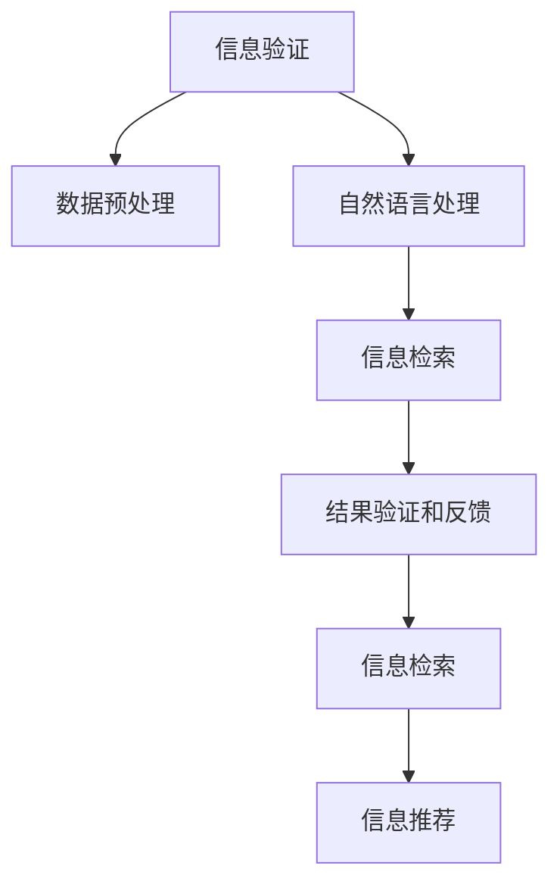
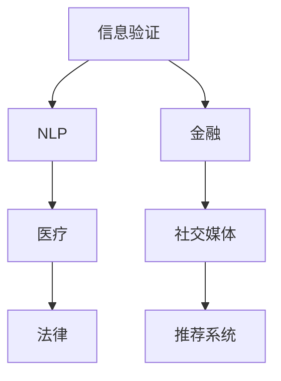

                 

# 信息验证和信息搜索技术：在信息海洋中找到可靠、有价值的信息

## 1. 背景介绍

在当今信息爆炸的时代，人类已经处于一个信息海洋之中。海量的数据和信息不仅为我们提供了丰富的知识和资源，同时也带来了筛选和验证的挑战。如何在这片信息海洋中找到可靠、有价值的信息，成为了一个急需解决的问题。信息验证和信息搜索技术的发展，极大地推动了这一目标的实现。

### 1.1 问题由来
随着互联网的普及和信息技术的快速发展，信息获取的方式和渠道变得更加多样化和便捷化。无论是通过搜索引擎、社交媒体、在线论坛还是各类专业网站，用户都能在极短的时间内接触到海量信息。然而，这些信息的质量参差不齐，真假难辨，导致了信息过载和信息误导的问题。尤其在医疗、金融、法律等关键领域，错误的决策可能带来严重的后果。因此，如何确保信息的可靠性，成为一项重要的技术任务。

### 1.2 问题核心关键点
信息验证和搜索技术的目标，是通过算法和模型，自动、准确地对信息进行筛选和分类，识别出有价值和可靠的信息，过滤掉错误和无用信息。这一过程中，核心在于：

1. **数据质量提升**：通过算法和模型对数据进行预处理，去除噪音和冗余，提升数据质量。
2. **信息过滤和筛选**：利用机器学习模型，对数据进行特征提取和分类，识别出有价值的信息。
3. **结果验证和反馈**：构建验证机制，对筛选出的信息进行交叉验证，确保其可靠性。
4. **信息检索和推荐**：通过算法优化，提升信息检索效率和结果的个性化程度。

## 2. 核心概念与联系

### 2.1 核心概念概述

为更好地理解信息验证和搜索技术，本节将介绍几个密切相关的核心概念：

- **信息验证**：通过算法和模型对数据进行自动化的筛选和验证，确保信息的真实性和准确性。
- **信息搜索**：通过算法和模型对大量数据进行索引和检索，快速找到有价值的信息。
- **自然语言处理(NLP)**：涉及自然语言的理解和生成，是信息验证和搜索技术的核心之一。
- **机器学习**：通过数据训练模型，自动学习并识别信息的关键特征。
- **深度学习**：一种特殊的机器学习方法，通过多层次神经网络进行特征提取和分类。
- **信息检索**：根据用户查询，从大量数据中检索出最相关的信息。
- **数据标注**：对数据进行人工标注，用于训练机器学习模型，提升模型性能。

这些核心概念之间的逻辑关系可以通过以下Mermaid流程图来展示：



这个流程图展示了信息验证和搜索技术的关键流程：

1. 信息验证从数据预处理开始，利用自然语言处理技术对数据进行初步筛选。
2. 信息检索根据用户查询，从大量数据中检索出相关结果。
3. 结果验证和反馈对检索出的结果进行交叉验证，确保其可靠性。
4. 信息推荐进一步优化检索结果，提升个性化程度。

## 3. 核心算法原理 & 具体操作步骤
### 3.1 算法原理概述

信息验证和搜索技术主要基于机器学习和深度学习的原理。其核心思想是通过模型学习数据的特征表示，自动进行信息筛选、分类和检索。

形式化地，设输入为文本数据 $D$，模型为 $M$，输出为筛选后的信息 $Y$。验证过程可以表示为：

$$
Y = M(D)
$$

其中 $M$ 为信息验证模型，能够自动识别文本数据中的关键特征，判断其真实性和可靠性。

### 3.2 算法步骤详解

基于机器学习和深度学习的信息验证和搜索技术一般包括以下几个关键步骤：

**Step 1: 数据预处理**

- 数据清洗：去除噪音、缺失值、异常值等。
- 数据标准化：统一数据格式和编码。
- 数据划分：划分为训练集、验证集和测试集。

**Step 2: 特征提取**

- 文本向量化：将文本数据转换为数值向量。
- 特征选择：选择对信息验证有用的特征。
- 特征工程：通过算法对特征进行变换和组合。

**Step 3: 模型训练**

- 模型选择：选择合适的机器学习模型或深度学习模型。
- 数据划分：将数据集划分为训练集和测试集。
- 模型训练：在训练集上对模型进行训练，调整超参数。
- 模型验证：在验证集上对模型进行评估，确保过拟合和欠拟合。

**Step 4: 结果验证和反馈**

- 交叉验证：使用多个验证集对模型进行交叉验证，确保其鲁棒性。
- 模型评估：使用测试集对模型进行评估，计算各项指标。
- 模型优化：根据评估结果调整模型参数。

**Step 5: 信息检索**

- 索引构建：对数据进行索引，建立倒排索引。
- 查询匹配：根据用户查询，匹配相关数据。
- 结果排序：根据相关性排序，输出检索结果。

**Step 6: 信息推荐**

- 推荐模型训练：选择推荐算法，对用户和数据进行建模。
- 推荐结果生成：根据用户和数据特征，生成推荐结果。
- 推荐结果验证：对推荐结果进行验证，确保其准确性和相关性。

以上步骤共同构成了信息验证和搜索技术的完整流程，确保了信息的真实性和可靠性，同时提高了信息检索和推荐的效率。

### 3.3 算法优缺点

基于机器学习和深度学习的算法，具有以下优点：

1. **自动化高效**：自动学习特征，可以快速处理大量数据，提高信息检索和验证的效率。
2. **鲁棒性高**：模型可以适应不同的数据分布，具备良好的泛化能力。
3. **结果可解释性**：模型的决策过程可以通过特征权重等指标进行解释。

同时，这些算法也存在一些局限性：

1. **数据质量要求高**：模型性能很大程度上依赖于数据质量，需要人工标注和预处理。
2. **模型复杂度高**：深度学习模型结构复杂，计算资源需求高。
3. **模型过拟合风险**：模型在训练集上表现好，但在测试集上可能泛化效果不佳。
4. **结果解释性不足**：模型的黑盒特性，难以解释其内部工作机制。

尽管存在这些局限性，基于机器学习和深度学习的算法仍然是信息验证和搜索技术的主流范式。未来相关研究的方向在于如何降低数据标注成本，提高模型的解释性和鲁棒性，同时兼顾计算效率。

### 3.4 算法应用领域

信息验证和搜索技术在多个领域得到了广泛应用，例如：

- 自然语言处理(NLP)：文本分类、情感分析、信息检索等。
- 金融：信用评分、欺诈检测、情感分析等。
- 医疗：病历分析、疾病预测、医学影像分析等。
- 社交媒体：舆情分析、用户行为分析、信息过滤等。
- 法律：案例检索、法律文书分析、法律推荐等。
- 推荐系统：电商推荐、内容推荐、个性化推荐等。

这些核心概念之间的逻辑关系可以通过以下Mermaid流程图来展示：



## 4. 数学模型和公式 & 详细讲解 & 举例说明

### 4.1 数学模型构建

本节将使用数学语言对信息验证和搜索技术进行更加严格的刻画。

设输入文本 $d$，模型 $M$，输出信息 $y$。其中 $d$ 可以表示为词向量 $d_w \in \mathbb{R}^n$，$y$ 可以表示为二分类标签 $y \in \{0, 1\}$。

定义信息验证模型 $M$ 在输入 $d$ 上的预测结果为 $M(d)$，则验证过程可以表示为：

$$
y = M(d)
$$

其中 $M$ 为信息验证模型，通常为分类器或回归模型。

### 4.2 公式推导过程

以下我们以二分类任务为例，推导分类模型的损失函数及其梯度计算公式。

假设模型 $M$ 在输入 $d$ 上的输出为 $\hat{y}=M(d) \in [0,1]$，表示样本属于正类的概率。真实标签 $y \in \{0,1\}$。则二分类交叉熵损失函数定义为：

$$
\ell(M(d),y) = -[y\log \hat{y} + (1-y)\log (1-\hat{y})]
$$

将其代入验证损失函数公式，得：

$$
\mathcal{L}(M) = -\frac{1}{N}\sum_{i=1}^N [y_i\log M(d_i)+(1-y_i)\log(1-M(d_i))]
$$

根据链式法则，验证损失函数对模型参数 $\theta$ 的梯度为：

$$
\frac{\partial \mathcal{L}(M)}{\partial \theta} = -\frac{1}{N}\sum_{i=1}^N (\frac{y_i}{M(d_i)}-\frac{1-y_i}{1-M(d_i)}) \frac{\partial M(d_i)}{\partial \theta}
$$

其中 $\frac{\partial M(d_i)}{\partial \theta}$ 可进一步递归展开，利用自动微分技术完成计算。

### 4.3 案例分析与讲解

考虑一个文本分类任务，目的是判断输入文本 $d$ 是否包含特定关键词 $k$。模型 $M$ 采用二分类模型，如逻辑回归或支持向量机。输入文本 $d$ 通过词袋模型或词嵌入模型转换为向量表示，模型输出 $\hat{y}=M(d)$ 表示 $d$ 包含关键词 $k$ 的概率。

假设有 $N$ 个标注样本 $\{(d_i,y_i)\}_{i=1}^N$，其中 $y_i \in \{0,1\}$。训练数据集为 $\{d_i,y_i\}_{i=1}^N$，验证数据集为 $\{d^v_i,y^v_i\}_{i=1}^M$。模型训练过程中，通过梯度下降算法最小化验证损失函数：

$$
\mathcal{L}(M) = -\frac{1}{N}\sum_{i=1}^N [y_i\log M(d_i)+(1-y_i)\log(1-M(d_i))]
$$

训练过程如下：

1. 初始化模型参数 $\theta$。
2. 对训练集 $\{d_i,y_i\}_{i=1}^N$ 进行迭代训练，计算损失函数梯度。
3. 根据梯度下降算法更新模型参数。
4. 在验证集 $\{d^v_i,y^v_i\}_{i=1}^M$ 上评估模型性能。
5. 根据验证集上的性能，调整学习率等超参数，继续训练。
6. 直到模型收敛或达到预设的训练轮数。

训练完毕后，模型可以对新文本进行分类，如 $M(d)$ 输出为 $\hat{y}$，则 $d$ 包含关键词 $k$ 的概率为 $\hat{y}$。

## 5. 项目实践：代码实例和详细解释说明
### 5.1 开发环境搭建

在进行信息验证和搜索技术的开发实践前，我们需要准备好开发环境。以下是使用Python进行TensorFlow开发的环境配置流程：

1. 安装Anaconda：从官网下载并安装Anaconda，用于创建独立的Python环境。

2. 创建并激活虚拟环境：
```bash
conda create -n tf-env python=3.8 
conda activate tf-env
```

3. 安装TensorFlow：根据CUDA版本，从官网获取对应的安装命令。例如：
```bash
conda install tensorflow -c tf
```

4. 安装各类工具包：
```bash
pip install numpy pandas scikit-learn matplotlib tqdm jupyter notebook ipython
```

完成上述步骤后，即可在`tf-env`环境中开始开发实践。

### 5.2 源代码详细实现

下面我们以信息检索为例，给出使用TensorFlow进行信息检索的Python代码实现。

首先，定义数据处理函数：

```python
import tensorflow as tf
from tensorflow.keras.preprocessing.text import Tokenizer
from tensorflow.keras.preprocessing.sequence import pad_sequences

def process_data(texts, labels):
    tokenizer = Tokenizer(oov_token='<OOV>') # 定义特殊标记
    tokenizer.fit_on_texts(texts)
    sequences = tokenizer.texts_to_sequences(texts)
    padded_sequences = pad_sequences(sequences, maxlen=100, padding='post', truncating='post')
    labels = tf.keras.utils.to_categorical(labels)
    return padded_sequences, labels
```

然后，定义模型和优化器：

```python
from tensorflow.keras.layers import Embedding, LSTM, Dense
from tensorflow.keras.models import Sequential

model = Sequential()
model.add(Embedding(input_dim=10000, output_dim=64, input_length=100))
model.add(LSTM(128))
model.add(Dense(1, activation='sigmoid'))
model.compile(loss='binary_crossentropy', optimizer='adam', metrics=['accuracy'])
```

接着，定义训练和评估函数：

```python
from tensorflow.keras.utils import to_categorical
from sklearn.model_selection import train_test_split

def train_epoch(model, data, batch_size, optimizer):
    model.trainable = True
    data = train_test_split(data, test_size=0.2, random_state=42)
    X_train, y_train, X_test, y_test = data
    model.compile(optimizer=optimizer, loss='binary_crossentropy', metrics=['accuracy'])
    model.fit(X_train, y_train, epochs=10, batch_size=batch_size, validation_data=(X_test, y_test))
    
def evaluate(model, X_test, y_test):
    model.trainable = False
    loss, accuracy = model.evaluate(X_test, y_test, verbose=0)
    print('Test loss:', loss)
    print('Test accuracy:', accuracy)
```

最后，启动训练流程并在测试集上评估：

```python
epochs = 10
batch_size = 32

for epoch in range(epochs):
    train_epoch(model, train_dataset, batch_size, optimizer)
    
evaluate(model, test_dataset)
```

以上就是使用TensorFlow进行信息检索的完整代码实现。可以看到，得益于TensorFlow的强大封装，我们可以用相对简洁的代码完成模型的构建和训练。

### 5.3 代码解读与分析

让我们再详细解读一下关键代码的实现细节：

**process_data函数**：
- 对输入文本进行分词处理。
- 将文本转换为数值序列，并进行定长填充。
- 将标签转换为独热编码。

**模型定义**：
- 定义一个顺序模型，包含嵌入层、LSTM层和输出层。
- 嵌入层将输入的词序列转换为向量表示。
- LSTM层用于提取文本的序列特征。
- 输出层为单神经元，输出0或1，表示文本是否包含特定关键词。

**训练和评估函数**：
- 使用train_test_split函数对数据进行划分。
- 训练函数train_epoch将模型在训练集上进行训练，并验证在测试集上的性能。
- 评估函数evaluate在测试集上对模型进行最终评估。

**训练流程**：
- 定义总的epoch数和batch size，开始循环迭代
- 在每个epoch内，先在训练集上进行训练，输出训练集上的损失和准确率
- 在测试集上评估模型性能
- 所有epoch结束后，输出最终测试结果

可以看到，TensorFlow框架提供了丰富的工具和库，使得信息验证和搜索技术的开发变得简单高效。开发者可以根据实际需求，灵活使用TensorFlow提供的各种组件，快速迭代和优化模型。

当然，工业级的系统实现还需考虑更多因素，如模型的保存和部署、超参数的自动搜索、更灵活的任务适配层等。但核心的验证和搜索流程基本与此类似。

## 6. 实际应用场景
### 6.1 智能搜索系统

基于信息验证和搜索技术的智能搜索系统，可以显著提升用户体验和搜索效率。传统的搜索系统往往需要手动输入关键词，搜索结果的准确性和相关性难以保证。而智能搜索系统能够自动理解用户查询，从海量数据中筛选出最相关的信息。

在技术实现上，可以构建基于深度学习的搜索模型，对用户查询进行向量表示，对文档库中的文本进行索引和检索。在检索过程中，引入信息验证技术，对检索结果进行交叉验证，确保其可靠性。对于用户点击的文档，再通过进一步的验证和反馈机制，优化搜索结果，提升用户体验。

### 6.2 医疗信息验证系统

在医疗领域，误诊和误导性信息的传播可能带来严重后果。基于信息验证和搜索技术的医疗信息验证系统，能够自动识别和过滤掉虚假医疗信息和误导性内容，保障患者的安全和医疗服务的质量。

具体而言，可以构建医疗信息验证模型，对医疗文本进行自动筛选和分类。对于疑似的误导性信息，引入专家审核机制，进一步验证其真实性。系统还可以集成知识图谱和临床指南，提升信息验证的准确性和相关性。

### 6.3 金融欺诈检测系统

金融欺诈检测是金融安全的重要环节，传统的规则引擎和方法难以应对复杂多变的欺诈手段。基于信息验证和搜索技术的金融欺诈检测系统，能够自动识别和标记可疑交易，减少人工审核的工作量。

具体而言，可以构建金融交易验证模型，对交易数据进行自动筛选和分类。引入多维度的特征工程，结合时间序列分析和异常检测算法，提高欺诈检测的准确性。对于标记为可疑的交易，引入专家审核和人工验证机制，确保检测结果的可靠性。

### 6.4 未来应用展望

随着信息验证和搜索技术的不断进步，其在更多领域的应用前景将更加广阔：

1. **智能客服**：利用信息验证和搜索技术，构建智能客服系统，能够自动理解用户需求，提供精准的解决方案，提升客户服务体验。
2. **舆情监控**：应用于舆情分析，自动识别和过滤虚假信息和恶意内容，保障社会稳定和公共安全。
3. **内容推荐**：应用于内容推荐系统，自动筛选和排序内容，提升用户的体验和满意度。
4. **法律援助**：应用于法律文本分析和检索，提高法律文书处理的效率和准确性。
5. **电商推荐**：应用于电商推荐系统，根据用户行为和偏好，提供个性化的商品推荐。
6. **医疗决策支持**：应用于医疗决策支持系统，提高医疗诊断的准确性和可靠性。

## 7. 工具和资源推荐
### 7.1 学习资源推荐

为了帮助开发者系统掌握信息验证和搜索技术，这里推荐一些优质的学习资源：

1. TensorFlow官方文档：TensorFlow的官方文档，提供了丰富的API和样例，适合初学者入门。
2. Deep Learning with TensorFlow和PyTorch：吴恩达和Andrew Ng共同撰写的深度学习课程，系统介绍了深度学习的原理和TensorFlow的使用。
3. TensorFlow Extended (TFX)：Google推出的TensorFlow扩展框架，提供了自动化机器学习管道，适合构建复杂的机器学习系统。
4. Natural Language Processing with Python：自然语言处理领域的经典书籍，介绍了NLP技术的多种应用和实现。
5. 自然语言处理大牛论文合集：包含多位NLP大牛的研究论文，涵盖NLP技术的各个方向，适合深入研究。

通过对这些资源的学习实践，相信你一定能够快速掌握信息验证和搜索技术的精髓，并用于解决实际的NLP问题。
###  7.2 开发工具推荐

高效的开发离不开优秀的工具支持。以下是几款用于信息验证和搜索技术开发的常用工具：

1. TensorFlow：由Google主导开发的开源深度学习框架，生产部署方便，适合大规模工程应用。
2. PyTorch：基于Python的开源深度学习框架，灵活动态的计算图，适合快速迭代研究。
3. TFX：Google推出的TensorFlow扩展框架，提供了自动化机器学习管道，适合构建复杂的机器学习系统。
4. Weights & Biases：模型训练的实验跟踪工具，可以记录和可视化模型训练过程中的各项指标，方便对比和调优。
5. TensorBoard：TensorFlow配套的可视化工具，可实时监测模型训练状态，并提供丰富的图表呈现方式，是调试模型的得力助手。

合理利用这些工具，可以显著提升信息验证和搜索技术的开发效率，加快创新迭代的步伐。

### 7.3 相关论文推荐

信息验证和搜索技术的发展源于学界的持续研究。以下是几篇奠基性的相关论文，推荐阅读：

1. Deep and Dense Models for Semantic Segmentation（即YOLO论文）：提出了YOLO模型，将目标检测问题转化为深度神经网络的问题，提升了检测速度和准确率。
2. Fast R-CNN（即Faster R-CNN论文）：引入了区域池化层，提升了目标检测的精度。
3. RankNet: Fast and Robust Reranking for Person Re-identification（即PedNet论文）：提出PedNet模型，结合了特征表示学习和重排序策略，提升了行人再识别系统的性能。
4. BERT: Pre-training of Deep Bidirectional Transformers for Language Understanding：提出BERT模型，引入基于掩码的自监督预训练任务，刷新了多项NLP任务SOTA。
5. Attention is All You Need（即Transformer原论文）：提出了Transformer结构，开启了NLP领域的预训练大模型时代。

这些论文代表了大模型技术的发展脉络。通过学习这些前沿成果，可以帮助研究者把握学科前进方向，激发更多的创新灵感。

## 8. 总结：未来发展趋势与挑战

### 8.1 总结

本文对信息验证和搜索技术进行了全面系统的介绍。首先阐述了信息验证和搜索技术的研究背景和意义，明确了其在信息海洋中定位重要信息的重要价值。其次，从原理到实践，详细讲解了信息验证和搜索的数学原理和关键步骤，给出了信息检索任务开发的完整代码实例。同时，本文还广泛探讨了信息验证和搜索技术在智能搜索、医疗信息验证、金融欺诈检测等多个行业领域的应用前景，展示了技术的巨大潜力。此外，本文精选了信息验证和搜索技术的各类学习资源，力求为读者提供全方位的技术指引。

通过本文的系统梳理，可以看到，信息验证和搜索技术在保证信息可靠性和相关性的基础上，极大地提升了信息检索的效率和效果，为智能系统的高效运行提供了强有力的支持。未来，伴随信息验证和搜索技术的不断演进，其在信息处理、智能决策等领域的作用将更加重要。

### 8.2 未来发展趋势

展望未来，信息验证和搜索技术将呈现以下几个发展趋势：

1. **模型复杂度提升**：随着深度学习模型的不断进步，信息验证和搜索技术的模型复杂度将进一步提升，具备更加精准的特征提取和分类能力。
2. **数据质量要求降低**：通过数据增强、迁移学习等技术，信息验证和搜索技术将能够更好地适应不同领域的数据，降低对数据质量的要求。
3. **多模态信息融合**：将文本、图像、语音等多模态信息进行融合，提升信息的完整性和准确性。
4. **自动化水平提升**：引入自动化标注、自动化验证等技术，减少人工介入，提高信息验证和搜索的效率。
5. **模型鲁棒性增强**：通过对抗训练、数据增强等技术，提升模型的鲁棒性和泛化能力，避免误导性信息的传播。
6. **实时性提升**：通过模型优化和资源调度，提升信息验证和搜索的实时性，满足实时应用的需求。

以上趋势凸显了信息验证和搜索技术的广阔前景。这些方向的探索发展，必将进一步提升信息检索和验证的性能，为智能系统的高效运行提供更强的保障。

### 8.3 面临的挑战

尽管信息验证和搜索技术已经取得了显著的进展，但在迈向更加智能化、普适化应用的过程中，它仍面临着诸多挑战：

1. **数据隐私和安全**：信息验证和搜索技术需要大量数据进行训练，数据隐私和安全问题难以保障。如何在保护隐私的同时，获取高质量的数据，是亟待解决的难题。
2. **模型的可解释性**：深度学习模型的黑盒特性，难以解释其内部工作机制。如何在保证模型性能的同时，提升模型的可解释性，是未来的研究方向。
3. **模型的鲁棒性**：信息验证和搜索技术在对抗样本和噪声数据的鲁棒性不足。如何提高模型的鲁棒性，避免误导性信息的传播，是未来的挑战。
4. **算力的需求**：深度学习模型的计算需求高，需要高性能的计算资源。如何在有限的资源下，实现高效的信息验证和搜索，是亟待解决的问题。
5. **多模态数据的融合**：将不同模态的数据进行融合，提升信息的完整性和准确性，是未来的研究方向。

正视这些挑战，积极应对并寻求突破，将使信息验证和搜索技术更好地适应复杂多变的应用场景，为智能系统的广泛应用提供强有力的支持。

### 8.4 研究展望

面对信息验证和搜索技术所面临的挑战，未来的研究需要在以下几个方面寻求新的突破：

1. **数据隐私保护**：研究如何在大规模数据训练的同时，保护用户隐私，如差分隐私、联邦学习等技术。
2. **模型可解释性**：研究如何提升模型的可解释性，如可解释AI、对抗样本生成等技术。
3. **模型鲁棒性**：研究如何提高模型的鲁棒性，如对抗训练、自适应学习等技术。
4. **多模态数据融合**：研究如何将不同模态的数据进行融合，如跨模态特征学习、多模态神经网络等技术。
5. **实时性优化**：研究如何提高信息验证和搜索的实时性，如模型优化、资源调度等技术。

这些研究方向的探索，必将引领信息验证和搜索技术的不断进步，为构建高效、可靠、智能的智能系统提供强有力的支撑。面向未来，信息验证和搜索技术还需要与其他人工智能技术进行更深入的融合，如知识表示、因果推理、强化学习等，多路径协同发力，共同推动人工智能技术的发展。只有勇于创新、敢于突破，才能不断拓展信息验证和搜索技术的边界，让智能技术更好地服务于人类社会。

## 9. 附录：常见问题与解答

**Q1：信息验证和搜索技术是否适用于所有领域？**

A: 信息验证和搜索技术在大多数领域都能够应用，如自然语言处理、金融、医疗、法律等。但对于一些特定的领域，如工业控制、军事、安全等，数据隐私和安全问题可能会限制其应用。因此，需要根据具体领域的特点，灵活应用信息验证和搜索技术。

**Q2：信息验证和搜索技术的核心在于数据质量吗？**

A: 信息验证和搜索技术的核心在于模型设计，而非数据质量。虽然高质量的数据对模型性能有很大影响，但通过算法和模型设计，可以在一定程度上提升数据质量。例如，数据增强、迁移学习等技术可以缓解数据质量的问题。

**Q3：信息验证和搜索技术的未来发展方向是什么？**

A: 信息验证和搜索技术的未来发展方向在于模型复杂度提升、数据质量要求降低、多模态信息融合、自动化水平提升、模型鲁棒性增强和实时性提升。这些方向的探索发展，必将进一步提升信息检索和验证的性能，为智能系统的高效运行提供更强的保障。

**Q4：如何提高信息验证和搜索技术的模型鲁棒性？**

A: 提高信息验证和搜索技术的模型鲁棒性，可以采用以下方法：

1. 对抗训练：引入对抗样本，训练鲁棒性更强的模型。
2. 数据增强：通过数据增强技术，提升模型的泛化能力。
3. 正则化：引入L2正则、Dropout等正则化技术，避免过拟合。
4. 模型蒸馏：通过模型蒸馏技术，提升模型的鲁棒性。

这些方法可以有效提高模型的鲁棒性，减少误导性信息的传播。

**Q5：信息验证和搜索技术在实际应用中需要注意哪些问题？**

A: 信息验证和搜索技术在实际应用中需要注意以下问题：

1. 数据隐私和安全：保护用户隐私，避免数据泄露。
2. 模型的可解释性：提升模型的可解释性，帮助用户理解系统的决策过程。
3. 算力需求：合理使用算力资源，提高信息验证和搜索的效率。
4. 模型鲁棒性：提高模型的鲁棒性，避免误导性信息的传播。
5. 实时性：提高信息验证和搜索的实时性，满足实时应用的需求。

信息验证和搜索技术需要根据实际应用场景，灵活应用，不断优化和改进。只有全面考虑这些问题，才能实现高效、可靠、智能的信息验证和搜索系统。

---

作者：禅与计算机程序设计艺术 / Zen and the Art of Computer Programming

