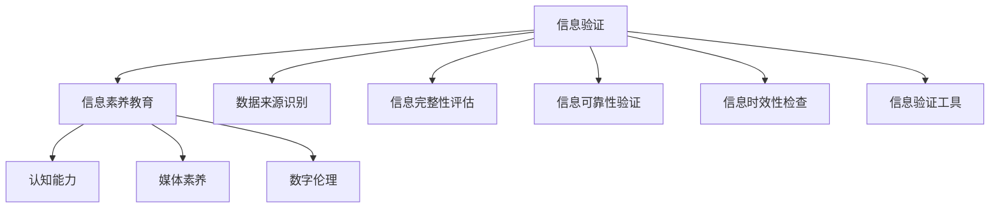

                 

# 信息验证和信息素养教育重要性：为数字时代培养信息素养能力

> 关键词：信息验证,信息素养教育,数字时代,认知能力,媒体素养,人工智能,数字伦理

## 1. 背景介绍

### 1.1 问题由来
随着信息技术的快速发展和普及，人们获取信息的渠道日益多样化，无论是新闻、社交媒体、在线论坛还是搜索引擎，海量的信息铺天盖地。在这样的背景下，如何甄别信息的真伪、评价信息的可靠性、筛选有用信息、构建知识体系，成为信息时代下每个人都需要面对的重要问题。尤其是对于学生而言，在面对海量信息的过程中，如何进行有效的信息验证和信息素养教育，已经成为他们能否适应未来数字化社会的关键。

### 1.2 问题核心关键点
在数字时代，信息素养教育的核心关键点在于培养学生的认知能力、媒体素养和数字伦理意识。具体来说，需要学生具备以下几个方面的能力：

- **信息识别能力**：能够快速识别和判断信息的真伪和可靠性。
- **信息评估能力**：能够对信息的来源、准确性、完整性和时效性进行全面评估。
- **信息筛选能力**：能够从大量信息中筛选出有价值、相关的信息，构建自己的知识体系。
- **批判性思维**：能够对信息进行深度分析，批判性地思考和质疑信息。
- **伦理意识**：理解信息的传播和使用过程中涉及的道德和法律问题，合理使用信息。

### 1.3 问题研究意义
培养学生的信息素养能力，不仅能够帮助他们在未来的学习、工作和生活中更好地应对信息爆炸带来的挑战，还能提升整个社会的媒体素养和数字伦理水平，构建一个更加健康、有序的数字社会。

在具体的应用场景中，信息素养能力的提升可以通过以下方式体现：

- **教育领域**：帮助学生提高学习效率，构建知识框架，培养批判性思维，从而提升教育质量。
- **职业发展**：使职场人士具备高效的信息获取、处理和传播能力，提升工作效率，推动职业发展。
- **社会治理**：增强公民的信息素养，提高社会整体的信息意识，促进社会和谐稳定。
- **媒体传播**：培养公众的媒体素养，提升信息的辨别和评价能力，维护媒体环境的健康发展。

## 2. 核心概念与联系

### 2.1 核心概念概述

为了更好地理解信息验证和信息素养教育的原理，本节将介绍几个密切相关的核心概念：

- **信息验证**：指通过一系列方法和工具，对信息的真伪、可靠性、完整性和时效性进行评估和验证的过程。
- **信息素养**：指个体在信息获取、评估、处理和传播过程中所具备的知识、技能和伦理意识。
- **数字伦理**：指在数字世界中，人们应遵循的道德规范和伦理标准，包括但不限于数据隐私、版权保护、算法偏见等方面。
- **认知能力**：指个体在信息处理过程中的思考、推理、判断和决策能力。
- **媒体素养**：指个体对媒体信息的制作、传播和接受过程的认识和理解能力。

这些核心概念之间的逻辑关系可以通过以下Mermaid流程图来展示：



这个流程图展示了大语言模型微调的各个核心概念及其之间的联系：

1. 信息验证是信息素养教育的基础，通过验证信息，培养学生的信息识别和评估能力。
2. 信息素养教育包括认知能力、媒体素养和数字伦理等诸多方面，是全面提升学生信息素养的关键。
3. 数据来源识别、信息完整性评估、信息可靠性验证和信息时效性检查是信息验证的具体步骤。
4. 信息验证工具是实现信息验证的技术手段，如数据库、搜索引擎、事实核查工具等。

## 3. 核心算法原理 & 具体操作步骤
### 3.1 算法原理概述

信息验证和信息素养教育的算法原理，可以从信息处理和用户教育两个方面进行阐述。

**信息处理方面**：
- **数据来源识别**：通过对数据来源的识别，判断信息是否来自可信的机构、个人或平台，以提高信息验证的准确性。
- **信息完整性评估**：分析信息的结构和内容，判断信息是否完整、有无缺失部分，以评估信息的质量。
- **信息可靠性验证**：通过对信息内容的交叉验证，查找相关信息源，验证信息是否可靠。
- **信息时效性检查**：判断信息的发布时间是否最新，是否存在过时或错误的信息。

**用户教育方面**：
- **认知能力提升**：通过培训和实践，提高用户的信息识别和评估能力，使其具备批判性思维。
- **媒体素养培养**：通过分析媒体信息的传播过程，培养用户对媒体信息的理解和判断能力。
- **数字伦理教育**：通过案例讨论和实践，增强用户对数字世界中伦理规范的认识，使其在传播和使用信息时能够遵守道德和法律。

### 3.2 算法步骤详解

信息验证和信息素养教育的算法步骤主要包括以下几个关键环节：

**步骤 1: 数据收集与预处理**
- 收集待验证的信息数据，包括文本、图像、视频等。
- 对数据进行清洗和预处理，去除噪声和冗余信息，为后续验证提供清晰的输入。

**步骤 2: 信息验证**
- **数据来源识别**：通过API接口、数据库查询等方法，识别数据的来源，判断其可信度。
- **信息完整性评估**：使用自然语言处理(NLP)技术，分析文本内容的逻辑性和结构完整性。
- **信息可靠性验证**：使用事实核查工具或人工核查方法，验证信息的准确性。
- **信息时效性检查**：通过时间戳、来源平台等线索，判断信息的时效性。

**步骤 3: 用户教育**
- **认知能力提升**：通过在线课程、案例分析等方式，教授用户信息识别的基本方法，培养其批判性思维。
- **媒体素养培养**：分析媒体信息的传播过程，讲解信息筛选和评价的方法，增强用户对媒体信息的理解和判断。
- **数字伦理教育**：通过讨论和实践，教授用户如何合理使用信息，遵守数字伦理规范。

**步骤 4: 持续评估与优化**
- 对用户的信息验证和教育效果进行评估，收集反馈，不断优化算法和教育内容。
- 根据新的信息和技术发展，及时更新信息验证工具和教育内容。

### 3.3 算法优缺点

信息验证和信息素养教育的算法具有以下优点：
- **提高信息质量**：通过系统的信息验证流程，大大提高了信息的准确性和可靠性。
- **增强用户能力**：通过用户教育，提升了信息素养能力，增强了用户的信息识别和评估能力。
- **促进社会和谐**：提高媒体素养和数字伦理水平，有助于构建更加健康、有序的数字社会。

同时，该算法也存在一定的局限性：
- **技术依赖**：信息验证的准确性依赖于数据来源、完整性评估、可靠性验证等技术手段的先进性和可靠性。
- **教育难度**：信息素养教育需要长期的投入和持续的更新，不易在短时间内见效。
- **数据隐私**：在验证和教育过程中，需要收集用户的部分信息，涉及隐私保护问题。
- **伦理挑战**：在信息验证和传播过程中，如何平衡信息的自由流动和数字伦理规范，是一个复杂的挑战。

### 3.4 算法应用领域

信息验证和信息素养教育在多个领域都有广泛的应用，以下是几个典型的应用场景：

**教育领域**：
- 在中小学教育中，通过信息验证和信息素养教育课程，提升学生的信息识别和评估能力，培养其批判性思维。
- 在高等教育中，通过数据科学、媒体学等课程，深入教授信息验证和信息素养教育的原理和方法。

**职场应用**：
- 在企业培训中，通过信息验证和信息素养教育，提升员工的信息获取、处理和传播能力，提高工作效率。
- 在职业资格考试中，加入信息验证和信息素养教育的考核内容，检验求职者的信息素养能力。

**社会治理**：
- 在政府公共信息服务中，通过信息验证和信息素养教育，提高公众的信息素养，增强社会的信息意识。
- 在公共安全领域，通过信息验证和信息素养教育，提高公众的防范意识和自我保护能力。

**媒体传播**：
- 在新闻编辑中，通过信息验证和信息素养教育，提升记者的信息素养，保证新闻报道的准确性和可靠性。
- 在公众信息传播中，通过信息验证和信息素养教育，增强公众的媒体素养，维护健康的信息传播环境。

## 4. 数学模型和公式 & 详细讲解  
### 4.1 数学模型构建

本节将使用数学语言对信息验证和信息素养教育的算法进行更加严格的刻画。

假设待验证的信息数据集为 $D=\{(x_i, y_i)\}_{i=1}^N, x_i \in \mathcal{X}, y_i \in \mathcal{Y}$，其中 $\mathcal{X}$ 为信息数据的特征空间，$\mathcal{Y}$ 为验证标签空间。信息验证的数学模型为：

$$
\mathcal{L}(f) = \frac{1}{N}\sum_{i=1}^N \ell(f(x_i), y_i)
$$

其中 $f(x_i)$ 为模型对信息数据 $x_i$ 的验证结果，$\ell$ 为验证损失函数，如交叉熵损失、平方损失等。

### 4.2 公式推导过程

以下我们以二分类任务为例，推导交叉熵损失函数及其梯度的计算公式。

假设模型 $f(x_i)$ 在输入 $x_i$ 上的输出为 $\hat{y}_i \in [0,1]$，表示信息数据 $x_i$ 的验证结果。真实标签 $y_i \in \{0,1\}$。则二分类交叉熵损失函数定义为：

$$
\ell(f(x_i), y_i) = -[y_i\log \hat{y}_i + (1-y_i)\log (1-\hat{y}_i)]
$$

将其代入经验风险公式，得：

$$
\mathcal{L}(f) = -\frac{1}{N}\sum_{i=1}^N [y_i\log f(x_i)+(1-y_i)\log(1-f(x_i))]
$$

根据链式法则，损失函数对模型参数 $\theta$ 的梯度为：

$$
\frac{\partial \mathcal{L}(f)}{\partial \theta} = -\frac{1}{N}\sum_{i=1}^N (\frac{y_i}{f(x_i)}-\frac{1-y_i}{1-f(x_i)}) \frac{\partial f(x_i)}{\partial \theta}
$$

其中 $\frac{\partial f(x_i)}{\partial \theta}$ 可进一步递归展开，利用自动微分技术完成计算。

### 4.3 案例分析与讲解

在实际应用中，信息验证和信息素养教育的核心在于构建一个系统的验证框架和教育体系。以下以教育领域为例，进行详细案例分析：

**案例 1: 学校信息素养课程设计**
- **课程目标**：培养学生的信息验证和信息素养能力，包括信息识别、评估、筛选和传播。
- **课程内容**：设计多个模块，涵盖数据来源识别、信息完整性评估、信息可靠性验证和信息时效性检查等内容。
- **教学方法**：结合理论讲解和实践操作，如案例分析、信息查找、事实核查工具使用等。
- **评估方式**：通过测试、项目报告、作业反馈等方式，评估学生的学习效果。

**案例 2: 企业信息素养培训**
- **培训目标**：提升员工的信息验证和信息素养能力，以提高工作效率和决策质量。
- **培训内容**：包括信息验证的基本方法、媒体素养、数字伦理等。
- **培训形式**：线上线下结合，使用视频课程、在线测试、模拟演练等多种形式。
- **培训效果**：通过培训前后测试、项目反馈等方式，评估培训效果。

## 5. 项目实践：代码实例和详细解释说明
### 5.1 开发环境搭建

在进行信息验证和信息素养教育的项目实践前，我们需要准备好开发环境。以下是使用Python进行PyTorch开发的环境配置流程：

1. 安装Anaconda：从官网下载并安装Anaconda，用于创建独立的Python环境。

2. 创建并激活虚拟环境：
```bash
conda create -n info-education-env python=3.8 
conda activate info-education-env
```

3. 安装PyTorch：根据CUDA版本，从官网获取对应的安装命令。例如：
```bash
conda install pytorch torchvision torchaudio cudatoolkit=11.1 -c pytorch -c conda-forge
```

4. 安装TensorFlow：
```bash
conda install tensorflow
```

5. 安装各类工具包：
```bash
pip install numpy pandas scikit-learn matplotlib tqdm jupyter notebook ipython
```

完成上述步骤后，即可在`info-education-env`环境中开始项目实践。

### 5.2 源代码详细实现

下面我们以信息素养教育课程设计为例，给出使用Python和Jupyter Notebook进行信息素养教育课程设计的代码实现。

首先，定义课程设计的基本框架：

```python
# 导入相关库
from IPython.display import display, HTML
import pandas as pd
import matplotlib.pyplot as plt
import numpy as np

# 定义课程设计的基本框架
class CourseDesign:
    def __init__(self, name, description):
        self.name = name
        self.description = description
        self.modules = []
    
    def add_module(self, module_name, content):
        self.modules.append({'module_name': module_name, 'content': content})
    
    def generate_html(self):
        html_code = "<h1>" + self.name + "</h1>"
        html_code += "<p>" + self.description + "</p>"
        
        for module in self.modules:
            html_code += "<h2>" + module['module_name'] + "</h2>"
            html_code += "<p>" + module['content'] + "</p>"
        
        display(HTML(html_code))

# 创建课程设计实例
course = CourseDesign("信息素养教育课程", "本课程旨在培养学生的信息验证和信息素养能力，包括信息识别、评估、筛选和传播。")
```

然后，定义课程的具体模块内容：

```python
# 定义课程模块内容
modules = [
    {"module_name": "数据来源识别", "content": "通过API接口、数据库查询等方法，识别数据的来源，判断其可信度。"},
    {"module_name": "信息完整性评估", "content": "使用自然语言处理(NLP)技术，分析文本内容的逻辑性和结构完整性。"},
    {"module_name": "信息可靠性验证", "content": "使用事实核查工具或人工核查方法，验证信息的准确性。"},
    {"module_name": "信息时效性检查", "content": "通过时间戳、来源平台等线索，判断信息的时效性。"},
    {"module_name": "认知能力提升", "content": "通过在线课程、案例分析等方式，教授用户信息识别的基本方法，培养其批判性思维。"},
    {"module_name": "媒体素养培养", "content": "分析媒体信息的传播过程，讲解信息筛选和评价的方法，增强用户对媒体信息的理解和判断。"},
    {"module_name": "数字伦理教育", "content": "通过讨论和实践，教授用户如何合理使用信息，遵守数字伦理规范。"}
]

# 将课程模块内容添加到课程设计中
for module in modules:
    course.add_module(module['module_name'], module['content'])

# 生成课程设计HTML页面
course.generate_html()
```

最后，展示生成的课程设计页面：

```python
# 显示课程设计HTML页面
display(course)
```

以上代码实现了信息素养教育课程设计的整体流程，通过定义课程框架和模块内容，并最终生成一个完整的HTML页面。开发者可以根据实际需求，进一步扩展和定制课程内容，满足不同的教育需求。

### 5.3 代码解读与分析

让我们再详细解读一下关键代码的实现细节：

**CourseDesign类**：
- `__init__`方法：初始化课程名称和描述，并定义一个空的模块列表。
- `add_module`方法：向课程中添加新的模块，模块内容作为参数传入。
- `generate_html`方法：将课程设计信息转换为HTML格式，并显示在页面上。

**模块内容定义**：
- 通过字典形式定义各个模块的名称和内容，模块内容可以是文字描述、图片、视频等多种形式。
- 将模块内容添加到课程设计实例中，并通过`generate_html`方法生成完整的HTML页面。

**课程设计展示**：
- 使用Jupyter Notebook的`display`函数展示生成的HTML页面，支持动态显示和互动。

可以看到，使用Python和Jupyter Notebook，信息素养教育课程设计的代码实现变得简洁高效。开发者可以根据实际需求，灵活扩展和定制课程内容，实现灵活的课程设计。

当然，工业级的系统实现还需考虑更多因素，如课程内容的更新和优化、用户交互体验的提升等。但核心的信息验证和信息素养教育算法基本与此类似。

## 6. 实际应用场景
### 6.1 智能学习平台

智能学习平台可以基于信息验证和信息素养教育技术，为学生提供个性化的学习资源和指导。通过推荐可信的学习资料、指导信息验证方法和信息素养技能，平台可以提升学生的学习效率和效果。

在技术实现上，智能学习平台可以通过数据分析和学习行为记录，精准推荐与学生当前学习进度和兴趣相关的学习资源，并集成事实核查工具，帮助学生验证学习内容的准确性。同时，平台还可以定期推送信息素养教育内容，引导学生提升信息识别和评估能力，培养其批判性思维和媒体素养。

### 6.2 企业培训系统

企业培训系统可以利用信息验证和信息素养教育技术，提升员工的信息获取、处理和传播能力，从而提高工作效率和决策质量。

在技术实现上，企业培训系统可以通过在线课程、模拟训练和案例分析等方式，教授员工信息验证和信息素养技能。系统还可以集成事实核查工具，帮助员工在实际工作中验证信息的可靠性。同时，系统可以通过数据分析和反馈机制，持续优化培训内容和效果，提升培训的针对性和实效性。

### 6.3 公共信息服务

公共信息服务可以基于信息验证和信息素养教育技术，为公众提供可信、可靠的信息服务，提升社会的信息意识和媒体素养。

在技术实现上，公共信息服务可以通过在线服务平台，集成事实核查工具和信息素养教育资源，帮助公众验证信息的真伪和可靠性。同时，平台还可以定期推送信息素养教育内容，提升公众的信息识别和评估能力，增强媒体素养和数字伦理意识。

## 7. 工具和资源推荐
### 7.1 学习资源推荐

为了帮助开发者系统掌握信息验证和信息素养教育的理论基础和实践技巧，这里推荐一些优质的学习资源：

1. 《信息素养教育导论》系列博文：由教育学专家撰写，深入浅出地介绍了信息素养教育的原理和实践方法。

2. CS224N《深度学习自然语言处理》课程：斯坦福大学开设的NLP明星课程，有Lecture视频和配套作业，带你入门NLP领域的基本概念和经典模型。

3. 《信息验证与信息素养教育》书籍：详细介绍了信息验证和信息素养教育的原理和方法，适合专业研究人员和教育工作者参考。

4. HuggingFace官方文档：提供了丰富的预训练语言模型和信息验证工具，是进行信息验证和信息素养教育开发的利器。

5. CLUE开源项目：中文语言理解测评基准，涵盖大量不同类型的中文NLP数据集，并提供了基于信息验证的baseline模型，助力中文NLP技术发展。

通过对这些资源的学习实践，相信你一定能够快速掌握信息验证和信息素养教育的精髓，并用于解决实际的NLP问题。
###  7.2 开发工具推荐

高效的开发离不开优秀的工具支持。以下是几款用于信息验证和信息素养教育开发的常用工具：

1. PyTorch：基于Python的开源深度学习框架，灵活动态的计算图，适合快速迭代研究。大部分信息验证算法都有PyTorch版本的实现。

2. TensorFlow：由Google主导开发的开源深度学习框架，生产部署方便，适合大规模工程应用。同样有丰富的信息验证和信息素养教育工具。

3. Transformers库：HuggingFace开发的NLP工具库，集成了众多SOTA语言模型，支持PyTorch和TensorFlow，是进行信息验证和信息素养教育开发的利器。

4. Weights & Biases：模型训练的实验跟踪工具，可以记录和可视化模型训练过程中的各项指标，方便对比和调优。与主流深度学习框架无缝集成。

5. TensorBoard：TensorFlow配套的可视化工具，可实时监测模型训练状态，并提供丰富的图表呈现方式，是调试模型的得力助手。

6. Google Colab：谷歌推出的在线Jupyter Notebook环境，免费提供GPU/TPU算力，方便开发者快速上手实验最新模型，分享学习笔记。

合理利用这些工具，可以显著提升信息验证和信息素养教育任务的开发效率，加快创新迭代的步伐。

### 7.3 相关论文推荐

信息验证和信息素养教育的发展源于学界的持续研究。以下是几篇奠基性的相关论文，推荐阅读：

1. 《信息素养教育：现状、挑战与未来》：综述了信息素养教育的研究进展和未来发展方向。

2. 《基于信息验证的智能学习平台设计》：介绍了信息验证技术在智能学习平台中的应用，提出了一种基于信息验证的智能学习框架。

3. 《企业信息素养培训框架研究》：提出了企业信息素养培训的框架，包括培训目标、内容、方法和效果评估等。

4. 《数字时代的信息素养教育：挑战与对策》：探讨了数字时代下信息素养教育的挑战和应对策略。

5. 《信息验证技术的演进与未来》：回顾了信息验证技术的发展历程，展望了未来的研究方向和应用前景。

这些论文代表了大语言模型微调技术的发展脉络。通过学习这些前沿成果，可以帮助研究者把握学科前进方向，激发更多的创新灵感。

## 8. 总结：未来发展趋势与挑战

### 8.1 总结

本文对信息验证和信息素养教育的重要性进行了全面系统的介绍。首先阐述了信息验证和信息素养教育在数字时代下的重要性和核心关键点，明确了培养学生信息素养能力的目标和意义。其次，从原理到实践，详细讲解了信息验证和信息素养教育的数学原理和关键步骤，给出了信息素养教育课程设计的完整代码实例。同时，本文还广泛探讨了信息验证和信息素养教育在多个行业领域的应用前景，展示了其在提升社会信息素养和数字伦理水平方面的巨大潜力。最后，本文精选了信息验证和信息素养教育的各类学习资源，力求为读者提供全方位的技术指引。

通过本文的系统梳理，可以看到，信息验证和信息素养教育在大数据、人工智能等技术支持下，正在逐步成为教育技术的重要组成部分，帮助学生更好地适应信息时代的挑战。未来，随着技术的不断进步和应用的深入，信息验证和信息素养教育必将成为提升社会整体信息素养能力的重要手段。

### 8.2 未来发展趋势

展望未来，信息验证和信息素养教育的发展趋势如下：

1. **技术进步**：随着人工智能和机器学习技术的不断发展，信息验证和信息素养教育将更加智能化和自动化。智能推荐系统、深度学习模型等技术手段将广泛应用，提高信息素养教育的精准性和实效性。

2. **教育创新**：信息验证和信息素养教育将融合更多的教育技术，如虚拟现实(VR)、增强现实(AR)、游戏化学习等，提升学生的学习兴趣和效果。

3. **跨学科融合**：信息验证和信息素养教育将与更多学科领域结合，如计算机科学、心理学、教育学等，形成跨学科的教育体系。

4. **国际合作**：全球化背景下，信息素养教育将加强国际合作，推动全球范围内的信息素养水平提升。

5. **标准制定**：信息验证和信息素养教育将制定国际标准，形成统一的信息素养评估体系，确保教育质量的统一性和可比性。

### 8.3 面临的挑战

尽管信息验证和信息素养教育已经取得了显著进展，但在迈向更加智能化、普适化应用的过程中，它仍面临着诸多挑战：

1. **技术门槛**：信息验证和信息素养教育需要较高的技术水平，对教师和学生的要求较高。如何降低技术门槛，使其更加易用，是未来需要解决的问题。

2. **资源不均**：信息素养教育需要丰富的教育资源，但不同地区和学校的资源分布不均，如何实现资源共享和均衡，是未来的重要课题。

3. **内容更新**：信息验证和信息素养教育的内容需要不断更新，以适应新的信息环境和教育需求。如何高效更新内容，保持教育的时效性，是未来的挑战。

4. **评价体系**：信息验证和信息素养教育的评估体系需要更加科学和全面，以准确评估学生的学习效果和教育质量。如何构建科学的评估体系，是未来的关键任务。

### 8.4 研究展望

面对信息验证和信息素养教育所面临的挑战，未来的研究需要在以下几个方面寻求新的突破：

1. **技术普及**：开发更易用、更友好的信息验证和信息素养教育工具，降低技术门槛，使更多人能够轻松使用。

2. **资源共享**：建立信息验证和信息素养教育资源库，实现资源的开放共享，提升教育资源的可及性和均衡性。

3. **内容更新**：开发自动化的内容更新机制，及时更新信息验证和信息素养教育的内容，保持教育的时效性和实用性。

4. **科学评估**：建立科学的信息验证和信息素养教育评估体系，全面评估学生的学习效果和教育质量。

5. **国际合作**：加强国际合作，推动全球范围内的信息素养教育发展，形成统一的信息素养标准和评估体系。

6. **多学科融合**：将信息验证和信息素养教育与更多学科领域结合，形成跨学科的教育体系，提升教育的效果和广度。

这些研究方向的探索，必将引领信息验证和信息素养教育技术迈向更高的台阶，为构建健康、有序的数字社会提供重要支持。

## 9. 附录：常见问题与解答

**Q1：信息验证和信息素养教育是否适用于所有行业和领域？**

A: 信息验证和信息素养教育的应用范围非常广泛，适用于各个行业和领域。尤其是在信息爆炸的时代，任何需要处理和传播信息的领域都可以从中受益。

**Q2：信息验证和信息素养教育与人工智能的关系是什么？**

A: 信息验证和信息素养教育是人工智能技术的补充和扩展。通过提升信息素养能力，人工智能系统可以更好地理解和处理信息，提高智能系统的可靠性、有效性和安全性。

**Q3：信息验证和信息素养教育如何与其他技术结合？**

A: 信息验证和信息素养教育可以与其他技术结合，如大数据、自然语言处理(NLP)、人工智能等，通过综合运用多种技术手段，提升信息验证和信息素养教育的效果。

**Q4：信息验证和信息素养教育如何应用于企业信息管理？**

A: 在企业信息管理中，通过信息验证和信息素养教育，可以提高员工的媒体素养和数字伦理水平，增强企业信息的准确性和可信度，提升企业信息管理的效率和质量。

**Q5：信息验证和信息素养教育如何应用于公共信息服务？**

A: 在公共信息服务中，通过信息验证和信息素养教育，可以提升公众的信息素养和媒体素养，增强公众的信息识别和评估能力，维护健康的信息传播环境。

**Q6：信息验证和信息素养教育如何应用于智能学习平台？**

A: 在智能学习平台中，通过信息验证和信息素养教育，可以为学生提供个性化的学习资源和指导，提升学生的学习效率和效果，培养其信息素养能力。

作者：禅与计算机程序设计艺术 / Zen and the Art of Computer Programming

