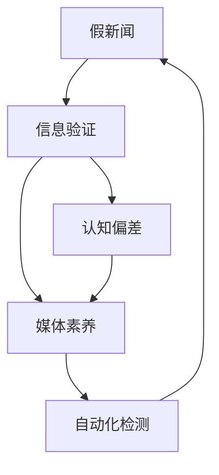

                 

# 信息验证和在线媒体素养：在假新闻和媒体操纵的时代导航

> 关键词：假新闻，信息验证，在线媒体素养，认知偏差，自动化检测

## 1. 背景介绍

在数字时代，信息传播的速度和范围较之以往任何时候都要迅速和广泛。然而，这一进步也带来了负面影响——假新闻和媒体操纵的盛行。信息验证和提升在线媒体素养成为现代社会中每一个人的必要技能。

### 1.1 假新闻和媒体操纵的兴起
假新闻（Fake News）指的是被故意捏造和传播的虚假信息，其目的是误导读者，达到特定的政治、经济或社会目的。随着社交媒体平台的普及，假新闻的传播速度和范围迅速增加，对公共舆论和社会稳定造成了严重影响。

媒体操纵（Media Manipulation）则是指有意识地扭曲或误导信息，以操控公众情绪、舆论和行为。这种方式通常与政治宣传、商业广告和社交媒体活动相关。

### 1.2 假新闻和媒体操纵的影响
假新闻和媒体操纵不仅损害了信息的真实性，还导致公众对媒体和信息的信任度下降，甚至引发社会动荡和政治不稳定。例如，2016年美国总统大选期间，假新闻和媒体操纵事件引起了广泛关注，对选举结果产生了直接影响。

### 1.3 在线媒体素养的重要性
在假新闻和媒体操纵泛滥的时代，提升在线媒体素养变得尤为重要。媒体素养是指正确解读、评估和利用媒体信息的能力，包括理解信息来源、识别信息真伪、批判性思考等。它能够帮助公众识别假新闻和媒体操纵，保护自己的认知安全。

## 2. 核心概念与联系

### 2.1 核心概念概述
本节将介绍几个核心概念，并解释它们之间的联系。

- **假新闻**：经过刻意伪造、误导的虚假信息。
- **信息验证**：识别和验证信息真伪的过程。
- **媒体素养**：正确解读、评估和利用媒体信息的能力。
- **认知偏差**：人们在信息处理过程中，受到已有信念、习惯等因素影响，产生偏差。
- **自动化检测**：利用计算机技术自动检测和识别假新闻的技术。

这些概念之间相互关联，形成一个完整的体系。假新闻和媒体操纵的识别和验证需要媒体素养作为基础，而媒体素养提升则依赖于自动化检测技术的支持。

### 2.2 核心概念原理和架构的 Mermaid 流程图



该图展示了假新闻识别和验证的流程。首先，假新闻通过信息验证被识别，然后通过媒体素养分析，认知偏差被识别，最后通过自动化检测进一步提升信息验证的效率和准确性。

## 3. 核心算法原理 & 具体操作步骤

### 3.1 算法原理概述

信息验证和在线媒体素养的提升涉及多个方面的算法和技术。核心算法包括文本分类、实体识别、情感分析、图网络等。

文本分类算法用于判断一篇文章是否为假新闻。实体识别算法用于查找文中提及的关键人物、地点、组织等实体，帮助识别信息来源的可靠性和真实性。情感分析算法用于判断文章的情绪倾向，辅助识别作者的主观意图和态度。图网络算法用于构建信息传播网络，分析信息的传播路径和影响范围。

### 3.2 算法步骤详解

以下是一个假新闻检测的算法步骤：

**Step 1: 数据预处理**
- 收集和标注假新闻样本数据。
- 对文本进行预处理，包括分词、去停用词、词干提取等。

**Step 2: 特征提取**
- 使用TF-IDF、Word2Vec、BERT等算法提取文本特征。
- 训练文本分类模型，如朴素贝叶斯、SVM、深度学习等。

**Step 3: 模型训练和评估**
- 使用标注数据训练模型，并进行交叉验证和参数调优。
- 在测试数据上评估模型性能，使用准确率、召回率、F1分数等指标。

**Step 4: 自动化检测**
- 构建自动化检测系统，集成文本分类、实体识别、情感分析等模块。
- 对用户上传的内容进行实时检测，提供假新闻标识和建议。

**Step 5: 持续学习和改进**
- 定期更新模型，加入新的假新闻样本。
- 分析用户反馈和系统表现，不断优化算法和模型。

### 3.3 算法优缺点

信息验证和在线媒体素养提升的算法具有以下优点：
- 自动化检测提升效率，减少人工工作量。
- 多维度分析提升识别准确性，减少认知偏差。
- 集成多种算法，提供全面的信息验证支持。

同时，这些算法也存在一些缺点：
- 对高质量标注数据依赖较高，数据标注成本较高。
- 算法复杂度较高，对计算资源和存储资源有较高要求。
- 依赖现有算法和数据集，难以应对新型假新闻和媒体操纵。

### 3.4 算法应用领域

信息验证和在线媒体素养提升的算法已经在以下领域得到了广泛应用：

- **新闻媒体**：提升新闻编辑和记者对假新闻的识别和验证能力。
- **社交媒体平台**：构建假新闻检测系统，减少虚假信息的传播。
- **在线教育**：提升用户的信息素养，培养批判性思维能力。
- **政府和公共机构**：加强对假新闻的监控和打击，维护公共信息安全。

## 4. 数学模型和公式 & 详细讲解

### 4.1 数学模型构建

信息验证和在线媒体素养的提升涉及多个数学模型，包括文本分类模型、情感分析模型、图网络模型等。

#### 4.1.1 文本分类模型
文本分类模型通过学习文本特征与类别的映射关系，对文本进行分类。常用模型包括朴素贝叶斯、支持向量机、深度学习等。

假设训练集为 $D=\{(x_i, y_i)\}_{i=1}^N$，其中 $x_i$ 为文本样本，$y_i$ 为类别标签，则文本分类模型的损失函数为：

$$
\mathcal{L}(w, b, D) = -\frac{1}{N}\sum_{i=1}^N y_i \log p(y_i|x_i; w, b)
$$

其中 $p(y_i|x_i; w, b)$ 为文本 $x_i$ 在类别 $y_i$ 下的概率，$w$ 为模型参数，$b$ 为偏置。

#### 4.1.2 情感分析模型
情感分析模型用于判断文本的情感倾向，常用模型包括LSTM、GRU、BERT等。

假设训练集为 $D=\{(x_i, y_i)\}_{i=1}^N$，其中 $x_i$ 为文本样本，$y_i$ 为情感标签，则情感分析模型的损失函数为：

$$
\mathcal{L}(w, b, D) = -\frac{1}{N}\sum_{i=1}^N y_i \log p(y_i|x_i; w, b)
$$

其中 $p(y_i|x_i; w, b)$ 为文本 $x_i$ 在情感标签 $y_i$ 下的概率，$w$ 为模型参数，$b$ 为偏置。

#### 4.1.3 图网络模型
图网络模型用于构建信息传播网络，分析信息的传播路径和影响范围。常用模型包括GNN、GCN、GAT等。

假设图网络为 $G=(V, E)$，其中 $V$ 为节点集，$E$ 为边集，则图网络模型的损失函数为：

$$
\mathcal{L}(G, D) = -\frac{1}{N}\sum_{i=1}^N \log p(y_i|x_i; G)
$$

其中 $p(y_i|x_i; G)$ 为节点 $i$ 在图 $G$ 中的传播概率，$y_i$ 为节点 $i$ 的标签，$x_i$ 为节点 $i$ 的特征向量。

### 4.2 公式推导过程

以下是假新闻检测算法中常用的公式推导过程：

**文本分类算法**：
- 假设训练集为 $D=\{(x_i, y_i)\}_{i=1}^N$，其中 $x_i$ 为文本样本，$y_i$ 为类别标签。
- 使用朴素贝叶斯算法，对文本进行分类。
- 损失函数为交叉熵损失：
$$
\mathcal{L}(w, b, D) = -\frac{1}{N}\sum_{i=1}^N y_i \log p(y_i|x_i; w, b)
$$

**情感分析算法**：
- 假设训练集为 $D=\{(x_i, y_i)\}_{i=1}^N$，其中 $x_i$ 为文本样本，$y_i$ 为情感标签。
- 使用LSTM模型，对文本进行情感分析。
- 损失函数为交叉熵损失：
$$
\mathcal{L}(w, b, D) = -\frac{1}{N}\sum_{i=1}^N y_i \log p(y_i|x_i; w, b)
$$

**图网络算法**：
- 假设图网络为 $G=(V, E)$，其中 $V$ 为节点集，$E$ 为边集。
- 使用GCN模型，对信息进行传播分析。
- 损失函数为交叉熵损失：
$$
\mathcal{L}(G, D) = -\frac{1}{N}\sum_{i=1}^N \log p(y_i|x_i; G)
$$

### 4.3 案例分析与讲解

以假新闻检测为例，分析信息验证和在线媒体素养的提升算法：

**案例1: 新闻媒体**
- **数据收集**：从社交媒体、新闻网站、论坛等平台收集大量新闻样本，标注为真实新闻和假新闻。
- **特征提取**：使用BERT等算法提取文本特征，得到高维向量表示。
- **模型训练**：使用深度学习算法训练分类模型，如GRU、BERT等。
- **结果评估**：在测试集上评估模型性能，使用准确率、召回率、F1分数等指标。
- **自动化检测**：构建自动化检测系统，集成文本分类、实体识别、情感分析等模块，实时检测新闻内容。

**案例2: 社交媒体平台**
- **数据收集**：从社交媒体平台收集大量用户上传的内容，标注为真实信息和假新闻。
- **特征提取**：使用TF-IDF、Word2Vec、BERT等算法提取文本特征。
- **模型训练**：使用朴素贝叶斯、SVM、深度学习等算法训练分类模型。
- **结果评估**：在测试集上评估模型性能，使用准确率、召回率、F1分数等指标。
- **自动化检测**：构建自动化检测系统，集成文本分类、实体识别、情感分析等模块，实时检测用户上传的内容。

## 5. 项目实践：代码实例和详细解释说明

### 5.1 开发环境搭建

在进行项目实践前，我们需要准备好开发环境。以下是使用Python进行项目开发的環境配置流程：

1. 安装Anaconda：从官网下载并安装Anaconda，用于创建独立的Python环境。

2. 创建并激活虚拟环境：
```bash
conda create -n news-env python=3.8 
conda activate news-env
```

3. 安装相关库：
```bash
pip install tensorflow pandas scikit-learn keras tensorflow-hub tensorflow-text
```

4. 安装TensorFlow库：
```bash
pip install tensorflow-gpu tensorflow-estimator tensorflow-text tensorflow-hub
```

完成上述步骤后，即可在`news-env`环境中开始项目实践。

### 5.2 源代码详细实现

这里以文本分类算法为例，给出使用TensorFlow进行假新闻检测的代码实现。

首先，定义数据集和模型：

```python
import tensorflow as tf
import pandas as pd
from sklearn.model_selection import train_test_split
from tensorflow.keras.models import Sequential
from tensorflow.keras.layers import Dense, Dropout, Embedding, LSTM, Bidirectional

# 定义数据集
df = pd.read_csv('news_dataset.csv')
X = df['text'].tolist()
y = df['label'].tolist()

# 划分训练集和测试集
X_train, X_test, y_train, y_test = train_test_split(X, y, test_size=0.2, random_state=42)

# 构建模型
model = Sequential([
    Embedding(input_dim=10000, output_dim=128, input_length=300),
    Bidirectional(LSTM(64, dropout=0.2, recurrent_dropout=0.2)),
    Dense(1, activation='sigmoid')
])
```

然后，训练模型：

```python
# 编译模型
model.compile(loss='binary_crossentropy', optimizer='adam', metrics=['accuracy'])

# 训练模型
model.fit(X_train, y_train, epochs=10, batch_size=64, validation_data=(X_test, y_test))
```

最后，进行模型评估：

```python
# 评估模型
loss, accuracy = model.evaluate(X_test, y_test)
print(f'Test Loss: {loss:.4f}')
print(f'Test Accuracy: {accuracy:.4f}')
```

以上就是使用TensorFlow进行假新闻检测的完整代码实现。可以看到，TensorFlow提供了高效的神经网络模型和训练框架，便于快速实现信息验证和在线媒体素养的提升算法。

### 5.3 代码解读与分析

让我们再详细解读一下关键代码的实现细节：

**数据集定义**：
- `pd.read_csv('news_dataset.csv')`：从CSV文件中读取新闻数据集，包含文本和标签。
- `train_test_split(X, y, test_size=0.2, random_state=42)`：将数据集划分为训练集和测试集，测试集占20%。

**模型构建**：
- `Embedding(input_dim=10000, output_dim=128, input_length=300)`：定义Embedding层，将文本转换为固定长度的向量。
- `Bidirectional(LSTM(64, dropout=0.2, recurrent_dropout=0.2))`：定义双向LSTM层，添加dropout正则化。
- `Dense(1, activation='sigmoid')`：定义输出层，输出为二分类结果。

**模型编译和训练**：
- `model.compile(loss='binary_crossentropy', optimizer='adam', metrics=['accuracy'])`：定义损失函数、优化器和评估指标。
- `model.fit(X_train, y_train, epochs=10, batch_size=64, validation_data=(X_test, y_test))`：训练模型，使用交叉验证。

**模型评估**：
- `model.evaluate(X_test, y_test)`：在测试集上评估模型性能，输出损失和准确率。

可以看到，TensorFlow提供了强大的工具和算法支持，方便进行信息验证和在线媒体素养的提升算法的开发和实践。

## 6. 实际应用场景

### 6.1 新闻媒体

新闻媒体是信息验证和在线媒体素养提升的重要应用场景。在假新闻泛滥的时代，新闻编辑和记者需要具备强大的信息验证能力，以确保新闻的准确性和真实性。

具体应用包括：
- **文本分类**：对新闻内容进行分类，判断是否为假新闻。
- **实体识别**：查找文中提及的关键人物、地点、组织等实体，辅助识别信息来源的可靠性和真实性。
- **情感分析**：判断文章的情绪倾向，辅助识别作者的主观意图和态度。

**案例1: 假新闻检测**
- **数据收集**：从社交媒体、新闻网站、论坛等平台收集大量新闻样本，标注为真实新闻和假新闻。
- **特征提取**：使用BERT等算法提取文本特征，得到高维向量表示。
- **模型训练**：使用深度学习算法训练分类模型，如GRU、BERT等。
- **结果评估**：在测试集上评估模型性能，使用准确率、召回率、F1分数等指标。
- **自动化检测**：构建自动化检测系统，集成文本分类、实体识别、情感分析等模块，实时检测新闻内容。

**案例2: 情感分析**
- **数据收集**：收集大量新闻样本，标注为正面、负面和中性情感。
- **特征提取**：使用LSTM模型提取文本特征。
- **模型训练**：使用深度学习算法训练情感分析模型，如LSTM、GRU等。
- **结果评估**：在测试集上评估模型性能，使用准确率、召回率、F1分数等指标。
- **自动化检测**：构建自动化检测系统，集成情感分析模型，实时分析新闻情感倾向。

### 6.2 社交媒体平台

社交媒体平台是信息验证和在线媒体素养提升的另一个重要应用场景。用户上传的大量内容中，可能包含假新闻和误导性信息。平台需要具备强大的信息验证能力，以减少虚假信息的传播。

具体应用包括：
- **文本分类**：对用户上传的内容进行分类，判断是否为假新闻。
- **实体识别**：查找文中提及的关键人物、地点、组织等实体，辅助识别信息来源的可靠性和真实性。
- **情感分析**：判断文章的情绪倾向，辅助识别作者的主观意图和态度。

**案例1: 文本分类**
- **数据收集**：从社交媒体平台收集大量用户上传的内容，标注为真实信息和假新闻。
- **特征提取**：使用TF-IDF、Word2Vec、BERT等算法提取文本特征。
- **模型训练**：使用朴素贝叶斯、SVM、深度学习等算法训练分类模型。
- **结果评估**：在测试集上评估模型性能，使用准确率、召回率、F1分数等指标。
- **自动化检测**：构建自动化检测系统，集成文本分类、实体识别、情感分析等模块，实时检测用户上传的内容。

**案例2: 情感分析**
- **数据收集**：收集大量用户上传的内容，标注为正面、负面和中性情感。
- **特征提取**：使用LSTM模型提取文本特征。
- **模型训练**：使用深度学习算法训练情感分析模型，如LSTM、GRU等。
- **结果评估**：在测试集上评估模型性能，使用准确率、召回率、F1分数等指标。
- **自动化检测**：构建自动化检测系统，集成情感分析模型，实时分析用户上传内容的情感倾向。

## 7. 工具和资源推荐

### 7.1 学习资源推荐

为了帮助开发者系统掌握信息验证和在线媒体素养提升的理论基础和实践技巧，这里推荐一些优质的学习资源：

1. 《信息验证与在线媒体素养：假新闻与媒体操纵》系列博文：由信息验证领域的专家撰写，深入浅出地介绍了假新闻检测、情感分析、信息传播网络等前沿话题。

2. Coursera《数据科学导论》课程：由斯坦福大学开设的入门级课程，涵盖数据预处理、特征工程、模型评估等基础概念。

3. 《深度学习与自然语言处理》书籍：介绍深度学习在NLP中的应用，包括文本分类、情感分析、信息检索等技术。

4. Kaggle假新闻检测比赛：参与实际的假新闻检测比赛，学习先进的技术和方法。

5. Hugging Face官方文档：Transformer库的官方文档，提供了海量预训练语言模型和完整的微调样例代码，是上手实践的必备资料。

通过对这些资源的学习实践，相信你一定能够快速掌握信息验证和在线媒体素养提升的精髓，并用于解决实际的信息验证问题。

### 7.2 开发工具推荐

高效的开发离不开优秀的工具支持。以下是几款用于信息验证和在线媒体素养提升开发的常用工具：

1. Python：作为最流行的编程语言之一，Python提供了丰富的第三方库和工具，方便进行信息验证和在线媒体素养的提升算法的开发和实践。

2. TensorFlow：由Google主导开发的深度学习框架，支持高效的神经网络模型和训练框架，适合进行复杂的深度学习任务。

3. Hugging Face Transformers库：提供了多种预训练语言模型，方便进行文本分类、情感分析等任务。

4. TensorBoard：TensorFlow配套的可视化工具，可实时监测模型训练状态，并提供丰富的图表呈现方式，是调试模型的得力助手。

5. Weights & Biases：模型训练的实验跟踪工具，可以记录和可视化模型训练过程中的各项指标，方便对比和调优。

6. Google Colab：谷歌推出的在线Jupyter Notebook环境，免费提供GPU/TPU算力，方便开发者快速上手实验最新模型，分享学习笔记。

合理利用这些工具，可以显著提升信息验证和在线媒体素养提升任务的开发效率，加快创新迭代的步伐。

### 7.3 相关论文推荐

信息验证和在线媒体素养提升的研究源于学界的持续研究。以下是几篇奠基性的相关论文，推荐阅读：

1. "A Survey on False News Detection in Social Media"：介绍了假新闻检测的最新进展，包括文本分类、实体识别、情感分析等技术。

2. "A Deep Learning Framework for Fake News Detection"：提出了一种基于深度学习的方法，使用卷积神经网络和LSTM模型对假新闻进行检测。

3. "Adversarial Training Methods for Fake News Detection"：提出了一种对抗训练方法，通过训练模型抵抗对抗样本，提高假新闻检测的鲁棒性。

4. "The Spread of True and False News Online"：分析了假新闻在网络中的传播机制，提出了基于社交网络传播路径的信息验证方法。

5. "AI Misinformation in the Age of Post-Truth"：探讨了人工智能在假新闻传播中的作用，提出了信息验证和在线媒体素养提升的必要性。

这些论文代表了大语言模型微调技术的发展脉络。通过学习这些前沿成果，可以帮助研究者把握学科前进方向，激发更多的创新灵感。

## 8. 总结：未来发展趋势与挑战

### 8.1 总结

本文对信息验证和在线媒体素养的提升方法进行了全面系统的介绍。首先阐述了假新闻和媒体操纵的兴起及其影响，明确了信息验证和在线媒体素养提升的重要性。其次，从原理到实践，详细讲解了假新闻检测和在线媒体素养提升的数学模型和关键算法。最后，结合实际应用场景，展示了信息验证和在线媒体素养的提升算法在新闻媒体、社交媒体平台等领域的广泛应用。

通过本文的系统梳理，可以看到，信息验证和在线媒体素养提升技术在假新闻和媒体操纵泛滥的时代具有重要的应用价值。这些技术的应用，不仅有助于提升公众的信息素养，还能有效减少假新闻和误导性信息的传播，维护公共信息安全。

### 8.2 未来发展趋势

展望未来，信息验证和在线媒体素养提升技术将呈现以下几个发展趋势：

1. **自动化检测技术提升**：随着深度学习、自然语言处理等技术的不断发展，自动化检测技术的准确性和效率将显著提升，减少人工工作量。

2. **多模态融合技术**：信息验证和在线媒体素养提升将不再局限于文本数据，融合视觉、语音等多模态信息，提升验证效果。

3. **跨领域迁移学习**：跨领域迁移学习技术将使得信息验证和在线媒体素养提升算法具备更强的泛化能力，适应不同领域的假新闻和媒体操纵。

4. **认知偏差纠正**：结合认知心理学和信息心理学知识，设计更加科学的验证算法，纠正用户的认知偏差。

5. **可解释性增强**：增强验证算法的可解释性，帮助用户理解模型的决策过程，提高信任度。

### 8.3 面临的挑战

尽管信息验证和在线媒体素养提升技术已经取得了一定的进展，但在迈向更加智能化、普适化应用的过程中，它仍面临着诸多挑战：

1. **数据质量问题**：高质量的标注数据是信息验证和在线媒体素养提升的基石。获取和维护高质量的标注数据，成本较高，且需要大量的专家参与。

2. **算法复杂性**：信息验证和在线媒体素养提升算法涉及多个学科的知识，如自然语言处理、深度学习、认知心理学等。算法复杂性较高，需要跨学科的合作和协同。

3. **技术落地困难**：信息验证和在线媒体素养提升技术需要与实际业务场景结合，技术落地难度较大。

4. **用户认知障碍**：用户对新技术的接受度和信任度不高，需要加强宣传和教育，提升用户的信息素养。

### 8.4 研究展望

面对信息验证和在线媒体素养提升所面临的挑战，未来的研究需要在以下几个方面寻求新的突破：

1. **跨学科合作**：结合信息科学、认知科学、心理学等多个学科的知识，提升信息验证和在线媒体素养提升算法的科学性和普适性。

2. **自动化标注技术**：研究自动化标注技术，减少对高质量标注数据的依赖，降低成本。

3. **可解释性和可信任性**：增强算法的可解释性和可信任性，提高用户对信息验证和在线媒体素养提升技术的接受度和信任度。

4. **多模态融合**：融合视觉、语音等多模态信息，提升信息验证和在线媒体素养提升的准确性和鲁棒性。

5. **智能推荐系统**：结合信息验证和在线媒体素养提升技术，构建智能推荐系统，为用户提供更准确、可靠的信息。

6. **新兴技术应用**：探索新兴技术，如区块链、人工智能增强现实等，提升信息验证和在线媒体素养提升的效果。

这些研究方向将引领信息验证和在线媒体素养提升技术迈向更高的台阶，为构建安全、可靠、可解释、可控的智能系统铺平道路。面向未来，信息验证和在线媒体素养提升技术还需要与其他人工智能技术进行更深入的融合，如知识表示、因果推理、强化学习等，多路径协同发力，共同推动信息验证和在线媒体素养提升技术的进步。只有勇于创新、敢于突破，才能不断拓展信息验证和在线媒体素养提升的边界，让智能技术更好地造福人类社会。

## 9. 附录：常见问题与解答

**Q1：信息验证和在线媒体素养提升技术的局限性是什么？**

A: 信息验证和在线媒体素养提升技术具有以下局限性：

1. **数据依赖性高**：高质量的标注数据是信息验证和在线媒体素养提升技术的基石。获取和维护高质量的标注数据，成本较高，且需要大量的专家参与。

2. **算法复杂度高**：信息验证和在线媒体素养提升算法涉及多个学科的知识，如自然语言处理、深度学习、认知心理学等。算法复杂性较高，需要跨学科的合作和协同。

3. **技术落地困难**：信息验证和在线媒体素养提升技术需要与实际业务场景结合，技术落地难度较大。

4. **用户认知障碍**：用户对新技术的接受度和信任度不高，需要加强宣传和教育，提升用户的信息素养。

**Q2：如何进行高质量的标注数据获取？**

A: 高质量的标注数据是信息验证和在线媒体素养提升技术的基石。获取高质量的标注数据，需要以下几个步骤：

1. **数据收集**：从可信的新闻网站、社交媒体平台等收集大量样本数据。

2. **专家标注**：邀请领域专家对数据进行标注，确保标注的准确性和一致性。

3. **众包标注**：通过众包平台，利用大量的志愿者对数据进行标注，并进行质量控制。

4. **数据清洗**：对标注数据进行清洗，去除噪声和错误标注，提高数据质量。

5. **持续更新**：定期更新数据集，添加新的样本和标注，保持数据的时效性。

**Q3：如何提升算法的可解释性和可信任度？**

A: 提升算法的可解释性和可信任度，可以从以下几个方面入手：

1. **特征可视化**：对算法中的关键特征进行可视化，帮助用户理解算法的决策过程。

2. **算法透明化**：公开算法的源代码和训练数据，增强算法的透明度和可信任度。

3. **用户反馈机制**：引入用户反馈机制，根据用户反馈不断优化算法，提升算法的效果和用户体验。

4. **实验验证**：通过大量的实验验证，证明算法的准确性和鲁棒性，增强用户信任度。

5. **跨学科合作**：结合信息科学、认知科学、心理学等多个学科的知识，提升算法的科学性和普适性。

**Q4：如何处理多模态信息？**

A: 处理多模态信息，可以从以下几个方面入手：

1. **特征融合**：将不同模态的信息进行融合，形成多模态特征向量，提升信息的表达能力。

2. **跨模态学习**：利用跨模态学习技术，提升算法在不同模态信息上的表现。

3. **多模态数据集构建**：构建包含多种模态数据的数据集，提升算法的泛化能力。

4. **多模态验证方法**：研究多模态信息的验证方法，提升算法在不同模态信息上的验证效果。

**Q5：如何设计有效的对抗样本生成技术？**

A: 设计有效的对抗样本生成技术，可以从以下几个方面入手：

1. **对抗样本库构建**：构建包含大量对抗样本的库，供算法训练和测试使用。

2. **对抗样本生成算法**：研究对抗样本生成算法，生成具有高对抗性的对抗样本。

3. **对抗训练技术**：引入对抗训练技术，训练模型抵抗对抗样本，提升模型的鲁棒性。

4. **对抗样本检测**：研究对抗样本检测技术，识别和过滤对抗样本，提高信息验证的准确性。

**Q6：如何应对假新闻的动态变化？**

A: 应对假新闻的动态变化，可以从以下几个方面入手：

1. **动态更新数据集**：定期更新数据集，添加新的假新闻样本，保持数据的时效性。

2. **实时监控技术**：引入实时监控技术，及时发现和处理新出现的假新闻。

3. **异常检测算法**：研究异常检测算法，识别和过滤异常信息，提高信息验证的效果。

4. **专家监控机制**：引入专家监控机制，利用专家的知识和经验，提升信息验证的准确性。

---

作者：禅与计算机程序设计艺术 / Zen and the Art of Computer Programming

