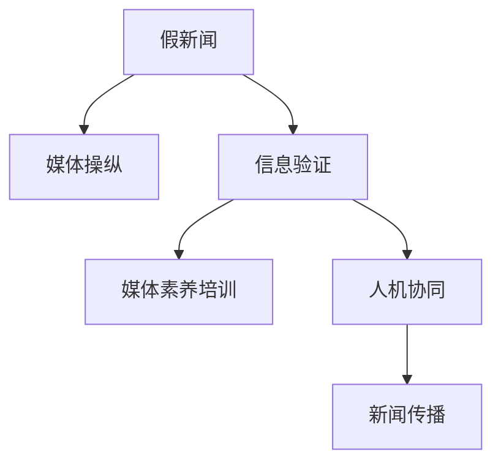

                 

# 信息验证和媒体素养能力培养：为假新闻和媒体操纵做好准备

## 1. 背景介绍

### 1.1 问题由来

在当今信息爆炸的时代，假新闻和媒体操纵现象愈发普遍。互联网平台上的海量内容往往真假难辨，误导性信息泛滥，给社会的和谐稳定带来严重威胁。传统的新闻审核机制难以应对如此庞大的信息量，公众的媒体素养能力也面临严峻挑战。信息验证和媒体素养能力培养已成为保障社会安全和公民权益的重要课题。

### 1.2 问题核心关键点

在信息爆炸的时代，准确、可靠的信息比以往任何时候都更加重要。对假新闻和媒体操纵的有效识别，不仅需要先进的技术手段，更需要提升公众的媒体素养能力，实现人机协同。

核心问题在于：

- 如何构建高效的信息验证系统，自动识别和筛选假新闻和媒体操纵行为？
- 如何设计合理、普适的媒体素养培训方案，提升公众的媒体识别和批判能力？
- 如何建立多方协同的信息验证和传播机制，营造健康的网络生态？

本文将从技术、教育和应用三个层面，深入探讨信息验证和媒体素养能力培养的实现路径，助力构建一个安全、可靠的信息社会。

## 2. 核心概念与联系

### 2.1 核心概念概述

为更好地理解信息验证和媒体素养能力培养的实现路径，本节将介绍几个关键概念及其相互联系：

- 假新闻(False News)：指通过伪造或篡改信息、图片、视频等手段，故意制造和传播不真实、误导性新闻的行为。
- 媒体操纵(Media Manipulation)：指通过控制信息源、传播渠道等手段，操纵公众舆论、影响选举、损害公共利益的行为。
- 信息验证(Information Verification)：指通过算法、规则和人工审核等手段，识别并过滤假新闻和媒体操纵行为，确保信息的真实性和可靠性。
- 媒体素养(Media Literacy)：指公众对新闻信息的理解和判断能力，包括辨识信息来源、判断信息真实性、批判信息内容等方面。
- 人机协同(Human-Machine Collaboration)：指结合先进算法和人工审核，实现信息验证和媒体素养能力培养的有机结合，充分发挥各自优势。

这些概念之间的关系可以用以下Mermaid流程图进行描述：

这个流程图展示了信息验证和媒体素养能力培养的主要流程：

1. 假新闻通过媒体操纵手段传播。
2. 信息验证系统自动识别并筛选假新闻。
3. 媒体素养培训提升公众识别假新闻的能力。
4. 人机协同机制实现信息的高效验证和传播。

## 3. 核心算法原理 & 具体操作步骤
### 3.1 算法原理概述

信息验证和媒体素养能力培养的实现，主要基于以下算法原理：

- 假新闻检测算法：通过检测文本中的语言模式、逻辑矛盾、数据源可靠性等特征，自动识别假新闻。
- 媒体操纵识别算法：通过分析新闻传播路径、来源可信度、信息发布频率等指标，识别媒体操纵行为。
- 媒体素养培训模型：通过推荐系统、知识图谱等技术，为公众推荐相关知识、引导批判性思维。
- 人机协同机制：将自动化验证结果与人工审核相结合，确保信息验证的准确性和公正性。

### 3.2 算法步骤详解

#### 3.2.1 假新闻检测算法

假新闻检测算法主要通过以下几个步骤实现：

1. 数据预处理：清洗数据，去除噪声，提取出关键特征。
2. 特征抽取：使用TF-IDF、词向量等方法，提取文本的语言模式、关键词、情感倾向等特征。
3. 模型训练：使用机器学习模型（如SVM、LSTM等）训练假新闻检测器。
4. 结果验证：在独立数据集上测试模型，调整参数，优化性能。
5. 部署应用：将模型部署到生产环境中，实时监控新闻内容。

#### 3.2.2 媒体操纵识别算法

媒体操纵识别算法主要通过以下几个步骤实现：

1. 数据收集：收集新闻发布时间、来源可信度、传播路径等数据。
2. 特征构建：计算新闻的传播速度、影响范围、来源可信度等指标。
3. 异常检测：使用异常检测算法（如孤立森林、聚类分析等）识别异常行为。
4. 结果验证：在独立数据集上测试算法，调整参数，优化性能。
5. 部署应用：将算法部署到生产环境中，实时监控新闻传播。

#### 3.2.3 媒体素养培训模型

媒体素养培训模型主要通过以下几个步骤实现：

1. 知识库构建：收集和整理与假新闻、媒体操纵相关的知识库。
2. 推荐系统设计：使用协同过滤、内容推荐等算法，为公众推荐相关知识。
3. 互动学习平台：开发互动学习平台，引导用户批判性思维，提升媒体素养。
4. 效果评估：对用户学习效果进行评估，持续改进培训方案。

#### 3.2.4 人机协同机制

人机协同机制主要通过以下几个步骤实现：

1. 自动化检测：使用假新闻检测和媒体操纵识别算法，自动检测和筛选信息。
2. 人工审核：对自动化结果进行人工审核，确保检测结果的准确性。
3. 结果反馈：将自动化结果和人工审核结果进行综合，反馈给用户和发布者。
4. 协同学习：利用用户反馈数据，不断改进算法和培训方案。

### 3.3 算法优缺点

#### 3.3.1 假新闻检测算法的优缺点

优点：

- 自动化程度高，可快速大规模检测假新闻。
- 可以处理多种格式的数据，如文本、图片、视频等。

缺点：

- 对复杂语境的判断能力有限。
- 对新颖的假新闻形式适应性较差。

#### 3.3.2 媒体操纵识别算法的优缺点

优点：

- 能够识别多种媒体操纵行为，如深度伪造、新闻劫持等。
- 能够分析新闻传播路径和来源可信度，提高判断准确性。

缺点：

- 数据收集和处理成本较高。
- 对特定领域的专业知识要求较高。

#### 3.3.3 媒体素养培训模型的优缺点

优点：

- 能够根据用户兴趣和行为推荐相关知识，提高学习效果。
- 可以持续优化培训方案，提升用户媒体素养能力。

缺点：

- 对用户交互数据的隐私保护要求较高。
- 培训效果受用户参与度和学习意愿影响较大。

#### 3.3.4 人机协同机制的优缺点

优点：

- 结合自动化和人工审核，提高信息验证的准确性和公正性。
- 能够快速响应突发事件，保障信息传播的及时性。

缺点：

- 对人工审核的依赖度较高，增加人力成本。
- 自动化算法和人工审核的结合度需要不断优化。

### 3.4 算法应用领域

假新闻检测、媒体操纵识别、媒体素养培训和人机协同机制在多个领域都有广泛应用：

1. 新闻业：帮助新闻机构识别和筛除非权威、虚假信息，提升新闻的公信力。
2. 社交媒体：识别和打击假新闻和媒体操纵，维护平台的健康发展。
3. 教育系统：提升公众媒体素养能力，帮助用户识别假新闻，培养批判性思维。
4. 政府机构：分析舆情动态，识别媒体操纵行为，提升公共决策的科学性和透明度。
5. 法律领域：识别和打击假新闻和媒体操纵，维护法律秩序和社会稳定。

## 4. 数学模型和公式 & 详细讲解 & 举例说明

### 4.1 数学模型构建

信息验证和媒体素养能力培养涉及多个复杂的数学模型。以下介绍几个关键模型及其构建方法：

- 假新闻检测模型：
$$
P(\text{False News}|\mathbf{x}) = \sigma(\mathbf{w}^T\phi(\mathbf{x})) + b
$$
其中，$\mathbf{x}$ 为输入的文本数据，$\phi(\mathbf{x})$ 为特征提取函数，$\mathbf{w}$ 和 $b$ 为模型参数。

- 媒体操纵识别模型：
$$
P(\text{Manipulation}|\mathbf{d}) = \sigma(\mathbf{w}^T\phi(\mathbf{d})) + b
$$
其中，$\mathbf{d}$ 为新闻数据，$\phi(\mathbf{d})$ 为特征提取函数，$\mathbf{w}$ 和 $b$ 为模型参数。

- 媒体素养培训模型：
$$
P(\text{Learning}|\mathbf{u}) = \sigma(\mathbf{w}^T\phi(\mathbf{u})) + b
$$
其中，$\mathbf{u}$ 为用户行为数据，$\phi(\mathbf{u})$ 为特征提取函数，$\mathbf{w}$ 和 $b$ 为模型参数。

### 4.2 公式推导过程

#### 4.2.1 假新闻检测模型的推导

假新闻检测模型主要通过逻辑回归模型实现，假设假新闻的概率分布为：
$$
P(\text{False News}|\mathbf{x}) = \frac{1}{1+\exp(-\mathbf{w}^T\phi(\mathbf{x}) - b)}
$$
其中，$\sigma$ 为 sigmoid 函数，$\mathbf{w}$ 和 $b$ 为模型参数。

#### 4.2.2 媒体操纵识别模型的推导

媒体操纵识别模型同样使用逻辑回归模型实现，假设媒体操纵的概率分布为：
$$
P(\text{Manipulation}|\mathbf{d}) = \frac{1}{1+\exp(-\mathbf{w}^T\phi(\mathbf{d}) - b)}
$$
其中，$\sigma$ 为 sigmoid 函数，$\mathbf{w}$ 和 $b$ 为模型参数。

#### 4.2.3 媒体素养培训模型的推导

媒体素养培训模型主要通过推荐系统实现，假设用户接受培训的概率分布为：
$$
P(\text{Learning}|\mathbf{u}) = \frac{1}{1+\exp(-\mathbf{w}^T\phi(\mathbf{u}) - b)}
$$
其中，$\sigma$ 为 sigmoid 函数，$\mathbf{w}$ 和 $b$ 为模型参数。

### 4.3 案例分析与讲解

#### 4.3.1 假新闻检测案例

假新闻检测系统通过分析新闻内容的语言模式、关键词分布等特征，自动检测和筛选假新闻。例如，假设有一篇新闻报道称“某国家地震导致大量人员伤亡”，系统可以检测出以下异常特征：

- 关键词分布不均衡，如“地震”出现次数远高于“人员伤亡”。
- 语言模式异常，如文章中大量使用夸张、虚构的描述。

基于这些特征，系统自动将这篇新闻标记为假新闻。

#### 4.3.2 媒体操纵识别案例

媒体操纵识别系统通过分析新闻的传播路径、来源可信度等指标，识别媒体操纵行为。例如，假设有一篇新闻报道称“某公司发布重要财务数据”，系统可以检测出以下异常特征：

- 新闻发布时间与公司实际财务数据发布时间不一致。
- 新闻来源可信度低，如发布于小众媒体或自媒体平台。
- 新闻传播路径异常，如新闻先被大量低质量媒体转载，再被主流媒体报道。

基于这些特征，系统自动将这篇新闻标记为媒体操纵行为。

#### 4.3.3 媒体素养培训案例

媒体素养培训系统通过推荐相关知识，帮助用户提升识别假新闻和媒体操纵的能力。例如，系统为一名用户推荐以下文章：

- 如何识别假新闻的常见技巧
- 媒体操纵行为的典型案例分析
- 媒体素养能力提升的实用建议

用户阅读这些文章后，对假新闻和媒体操纵的识别能力得到显著提升。

## 5. 项目实践：代码实例和详细解释说明

### 5.1 开发环境搭建

在进行项目实践前，我们需要准备好开发环境。以下是使用Python进行TensorFlow开发的环

