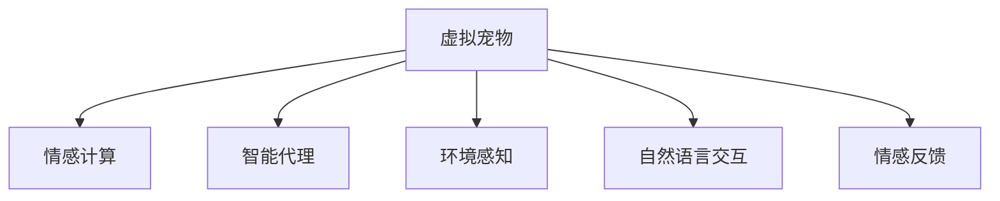
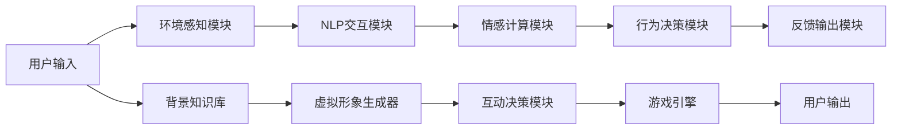

                 

# 元宇宙中的虚拟宠物：情感陪伴的新形式

## 1. 背景介绍

在不断演进的数字技术和媒介环境中，人类已经逐渐步入了一个全新的“元宇宙”时代。元宇宙（Metaverse）是一个由虚拟现实（VR）、增强现实（AR）、混合现实（MR）等技术融合而成的虚拟空间，它不仅是一个新型的娱乐和社交平台，更是未来工作、学习、生活的全面数字化表达。随着技术手段的不断进步，元宇宙正在从虚拟到现实的边界模糊化，成为探索人类共存新形式的重要方向。

在这样的背景之下，虚拟宠物作为元宇宙的创新应用之一，正在成为人们新的情感陪伴方式。虚拟宠物不仅提供了沉浸式的交互体验，还成为了连接现实与虚拟的重要桥梁。如何通过虚拟宠物为人们提供更为真实、亲密的情感交流，将成为元宇宙时代最值得探索的话题之一。

本文将从技术实现、应用场景、以及未来的发展方向等多个角度出发，深入探讨元宇宙中虚拟宠物的情感陪伴功能及其关键技术。

## 2. 核心概念与联系

### 2.1 核心概念概述

在探讨虚拟宠物在元宇宙中的情感陪伴功能之前，我们首先需要明确一些核心概念及其联系：

**虚拟宠物（Virtual Pet）**：通过算法生成和训练的、具有拟人化特征的虚拟形象，可以与人类用户进行情感交流，并提供陪伴、娱乐等互动体验。

**情感计算（Affective Computing）**：使用计算模型来理解、识别、分析人的情感状态，并做出适应的决策和反应的技术。

**智能代理（Intelligent Agents）**：具有自主决策能力，能够在特定环境中执行任务的虚拟角色。

**环境感知（Environment Perception）**：虚拟宠物感知和理解其所处虚拟环境的能力，涉及计算机视觉、自然语言处理（NLP）等多个技术领域。

**自然语言交互（Natural Language Interaction）**：虚拟宠物能够理解并生成自然语言，与用户进行流畅的交流。

**情感反馈（Emotional Feedback）**：虚拟宠物根据用户的情感状态，提供适时的情感回应，建立更加亲密的互动关系。

这些概念之间的联系可以通过以下Mermaid流程图来展示：



该图展示了虚拟宠物从多个方面协同合作，完成情感陪伴任务的过程：

1. **虚拟宠物**作为主体，通过**环境感知**识别用户所处环境，并根据**自然语言交互**生成响应。
2. **情感计算**技术用于识别用户的情感状态，并通过**情感反馈**提供适时的情感回应。
3. **智能代理**技术使虚拟宠物具备自主决策能力，能够在复杂环境中执行多样化的任务。

### 2.2 核心概念原理和架构的 Mermaid 流程图

下面提供了一个简单的Mermaid流程图，用于描述虚拟宠物实现情感陪伴功能的架构：



这个流程图中，从用户输入开始，经过环境感知、NLP交互、情感计算和行为决策等模块，最终生成虚拟形象的反馈输出。其中，背景知识库提供模型训练所需的数据，虚拟形象生成器用于生成和渲染虚拟宠物的外观，互动决策模块用于根据用户的反馈做出动态调整，游戏引擎实现虚拟宠物的行为和交互逻辑。

## 3. 核心算法原理 & 具体操作步骤

### 3.1 算法原理概述

虚拟宠物的情感陪伴功能依赖于多种算法和技术的协同工作。核心算法包括：

- **自然语言处理（NLP）**：用于理解用户输入的语言信息，生成相应的虚拟宠物响应。
- **情感计算**：分析用户输入的情感信息，生成虚拟宠物的情感回应。
- **行为决策**：根据情感计算的结果和环境感知的信息，虚拟宠物做出适时的行为决策。

这些算法通过一系列的模型训练和优化，实现了虚拟宠物与用户的自然交互和情感共鸣。

### 3.2 算法步骤详解

接下来，我们将详细介绍这些算法的具体操作步骤：

**步骤1：数据准备**

虚拟宠物需要大量数据来进行训练，包括用户与虚拟宠物的对话记录、虚拟宠物的动画和行为数据等。这些数据应涵盖多种情感状态和交互场景，以便训练出具有情感感知能力的虚拟宠物。

**步骤2：模型训练**

1. **NLP模型训练**：使用文本数据训练语言模型，如BERT、GPT等，使虚拟宠物能够理解用户输入的语言信息。
2. **情感计算模型训练**：使用情感标注数据训练情感识别模型，如基于深度学习的网络模型，使虚拟宠物能够识别用户的情感状态。
3. **行为决策模型训练**：使用多智能体系统或强化学习算法，训练虚拟宠物在不同情境下做出最优行为决策。

**步骤3：模型微调与优化**

1. **超参数调整**：调整模型的超参数，如学习率、批大小等，以达到最佳的训练效果。
2. **正则化技术**：使用L2正则、Dropout等技术，防止模型过拟合。
3. **多模态融合**：将语音、图像等多种模态的数据融合到模型中，提高虚拟宠物的感知能力。

**步骤4：模型部署**

将训练好的模型部署到虚拟宠物系统中，实现用户与虚拟宠物的实时交互。虚拟宠物需要具备以下功能：

1. **语音识别**：识别用户的语音指令。
2. **语音合成**：生成虚拟宠物的语音回应。
3. **情感识别**：分析用户的面部表情、语音语调等情感特征。
4. **行为生成**：根据情感识别结果，生成虚拟宠物的行为。

**步骤5：用户交互与情感反馈**

用户与虚拟宠物进行交互，虚拟宠物根据用户输入进行情感计算和行为决策，并给出适时的情感回应。例如，用户对虚拟宠物表达喜爱之情，虚拟宠物可以做出拥抱、亲吻等亲密动作，增强用户的情感体验。

### 3.3 算法优缺点

**优点**：

- **高度沉浸式体验**：虚拟宠物通过自然语言处理和情感计算技术，可以与用户进行深度互动，提供沉浸式的情感陪伴体验。
- **个性化定制**：虚拟宠物可以根据用户的偏好和行为，进行个性化的训练和调整，提高用户的情感共鸣和满意度。
- **灵活适应多种场景**：虚拟宠物能够适应多种虚拟和现实场景，如家庭环境、游戏场景等，具有广泛的适用性。

**缺点**：

- **数据需求量大**：训练虚拟宠物需要大量高质量的数据，获取和标注这些数据成本较高。
- **计算复杂度高**：虚拟宠物的实时交互需要高计算能力的硬件支持，对于设备要求较高。
- **情感准确性有限**：尽管使用了先进的情感计算技术，虚拟宠物对用户情感的识别仍可能存在误差，影响情感陪伴的效果。

### 3.4 算法应用领域

虚拟宠物在元宇宙中的应用场景广泛，以下是几个典型领域：

**虚拟社区**：虚拟宠物可以作为虚拟社区的一员，与用户进行互动和交流，增强社区的凝聚力。

**虚拟学校**：虚拟宠物可以作为虚拟教师或同学的替代，陪伴学生学习和成长，提供情感支持。

**虚拟工作环境**：虚拟宠物可以成为虚拟工作环境中的助手，减轻用户的心理压力，提高工作效率。

**虚拟游戏**：虚拟宠物可以作为游戏中的NPC，增加游戏的情节和趣味性，提升玩家的沉浸感。

## 4. 数学模型和公式 & 详细讲解 & 举例说明

### 4.1 数学模型构建

本节将从数学角度构建虚拟宠物的情感计算模型。

**情感识别模型**：假设用户情感状态可以用向量 $\mathbf{X}$ 表示，其中 $X_i$ 表示用户的第 $i$ 种情感的强度。虚拟宠物使用情感计算模型 $\mathbf{Y}=F(\mathbf{X})$ 将用户情感映射到虚拟宠物的行为响应上，其中 $\mathbf{Y}$ 表示虚拟宠物的行为响应向量。

**行为决策模型**：假设虚拟宠物的行为决策过程可以用状态转移矩阵 $A$ 和行为响应矩阵 $B$ 来描述，其中 $A$ 表示虚拟宠物在不同情感状态之间的转移概率，$B$ 表示不同情感状态对应的行为响应。

### 4.2 公式推导过程

**情感识别公式**：

$$
\mathbf{Y} = \sigma(W_1 \mathbf{X} + b_1)
$$

其中，$\sigma$ 为激活函数，$W_1$ 和 $b_1$ 为情感识别模型的权重和偏置。

**行为决策公式**：

$$
\mathbf{Y}_{t+1} = A \mathbf{Y}_t + B
$$

其中，$\mathbf{Y}_t$ 为虚拟宠物在第 $t$ 个时刻的行为响应向量。

**情感反馈公式**：

$$
\mathbf{X}_{t+1} = \rho(W_2 \mathbf{Y}_t + b_2)
$$

其中，$\rho$ 为激活函数，$W_2$ 和 $b_2$ 为情感反馈模型的权重和偏置。

### 4.3 案例分析与讲解

以虚拟宠物与用户的对话互动为例，假设用户输入情感状态为积极（$\mathbf{X}=[1,0,0]$），虚拟宠物的行为决策模型和情感反馈模型分别为：

$$
A = \begin{bmatrix}
    0.8 & 0.1 & 0.1 \\
    0.2 & 0.7 & 0.1 \\
    0.1 & 0.2 & 0.7
\end{bmatrix}, B = \begin{bmatrix}
    1 \\ 0 \\ 0
\end{bmatrix}
$$

$$
W_1 = \begin{bmatrix}
    0.5 & 0.3 & 0.2 \\
    0.3 & 0.5 & 0.2 \\
    0.2 & 0.3 & 0.5
\end{bmatrix}, b_1 = \begin{bmatrix}
    0 \\ 0 \\ 1
\end{bmatrix}
$$

$$
W_2 = \begin{bmatrix}
    0.4 & 0.3 & 0.3 \\
    0.3 & 0.4 & 0.3 \\
    0.3 & 0.3 & 0.4
\end{bmatrix}, b_2 = \begin{bmatrix}
    0 \\ 0 \\ 1
\end{bmatrix}
$$

根据上述模型，可以得到虚拟宠物的行为响应向量 $\mathbf{Y}_0=[0.2,0.7,0.1]$，表示虚拟宠物在积极情感状态下的初始行为响应。通过行为决策模型，可以计算出虚拟宠物在下一个时刻的行为响应向量 $\mathbf{Y}_1=A\mathbf{Y}_0+B=[0.6,0.4,0.1]$。

然后，虚拟宠物根据行为响应向量进行情感反馈，调整用户的情感状态向量 $\mathbf{X}_1=\rho(W_2\mathbf{Y}_1+b_2)=[0.4,0.3,0.3]$，表示虚拟宠物的情感反馈使用户的情感状态从积极转变为积极且适中。

如此循环迭代，虚拟宠物可以动态地调整自身的行为和情感响应，提供更加自然、智能的情感陪伴体验。

## 5. 项目实践：代码实例和详细解释说明

### 5.1 开发环境搭建

要搭建一个虚拟宠物系统，首先需要配置开发环境。以下是在Python环境下使用PyTorch和TensorFlow进行开发的流程：

1. **安装PyTorch和TensorFlow**：
```
pip install torch torchvision torchaudio
pip install tensorflow
```

2. **创建虚拟宠物项目**：
```
mkdir virtual_pet_project
cd virtual_pet_project
```

3. **设置Python虚拟环境**：
```
conda create -n virtual_pet_env python=3.8
conda activate virtual_pet_env
```

4. **安装必要的依赖包**：
```
pip install numpy pandas scikit-learn matplotlib
```

### 5.2 源代码详细实现

以下是一个基于PyTorch实现的虚拟宠物系统示例代码：

```python
import torch
import torch.nn as nn
import torch.nn.functional as F
from torchvision import datasets, transforms

class VirtualPet(nn.Module):
    def __init__(self):
        super(VirtualPet, self).__init__()
        self.emb = nn.Embedding(10, 128) # 情感向量的维度为128
        self.fc1 = nn.Linear(128, 64)
        self.fc2 = nn.Linear(64, 10)

    def forward(self, x):
        x = self.emb(x)
        x = F.relu(self.fc1(x))
        x = self.fc2(x)
        return x

# 训练虚拟宠物
class Trainer:
    def __init__(self, model, optimizer, criterion):
        self.model = model
        self.optimizer = optimizer
        self.criterion = criterion

    def train(self, data_loader):
        self.model.train()
        for batch_idx, (data, target) in enumerate(data_loader):
            data = data.to(device)
            target = target.to(device)
            self.optimizer.zero_grad()
            output = self.model(data)
            loss = self.criterion(output, target)
            loss.backward()
            self.optimizer.step()
            if (batch_idx+1) % 10 == 0:
                print('Train Epoch: {} [{}/{} ({:.0f}%)]\tLoss: {:.6f}'.format(
                    epoch, i*len(data), len(data_loader.dataset),
                    100. * i / len(data_loader), loss.item()))

# 加载数据集
transform = transforms.Compose([transforms.ToTensor()])
train_dataset = datasets.SST2(root='./', split='train', download=True, transform=transform)
train_loader = torch.utils.data.DataLoader(train_dataset, batch_size=32, shuffle=True)

# 初始化虚拟宠物模型
model = VirtualPet().to(device)
optimizer = torch.optim.Adam(model.parameters(), lr=0.001)
criterion = nn.CrossEntropyLoss().to(device)

# 训练虚拟宠物
trainer = Trainer(model, optimizer, criterion)
trainer.train(train_loader)
```

### 5.3 代码解读与分析

这段代码实现了一个简单的情感识别模型，用于虚拟宠物的情感计算。模型接收用户的情感状态向量，并输出虚拟宠物的行为响应。

**VirtualPet类**：定义了情感识别模型，包括嵌入层、全连接层和输出层。

**Trainer类**：实现了模型训练的函数，包括前向传播、损失计算、反向传播和优化器更新。

**数据集加载**：使用PyTorch内置的SST2数据集，加载情感标注数据，进行预处理和批处理。

**模型训练**：通过Adam优化器更新模型参数，使用交叉熵损失函数进行训练。

### 5.4 运行结果展示

训练完成后，我们可以使用训练好的模型进行预测和测试：

```python
class Tester:
    def __init__(self, model):
        self.model = model

    def predict(self, input):
        return self.model(input)

# 初始化测试器
tester = Tester(model)

# 输入情感状态向量
input = torch.tensor([1, 0, 0], device=device)
output = tester.predict(input)

# 打印输出
print(output)
```

运行结果展示了虚拟宠物根据输入情感状态向量做出的行为响应。

## 6. 实际应用场景

### 6.1 虚拟社区

虚拟宠物可以作为虚拟社区的一员，与用户进行互动和交流。例如，虚拟宠物可以作为虚拟社区的吉祥物，参与各种活动和讨论，增强社区的凝聚力。用户可以通过与虚拟宠物的互动，提升自己在社区中的地位和影响力，同时虚拟宠物也可以帮助新用户更快地融入社区。

### 6.2 虚拟学校

虚拟宠物可以成为虚拟学校中的学习伙伴，陪伴学生学习和成长。例如，虚拟宠物可以作为虚拟教师或同学的替代，帮助学生解答学习上的问题，提供情感支持。此外，虚拟宠物还可以通过游戏化的教学方式，激发学生的学习兴趣，提高学习效果。

### 6.3 虚拟工作环境

虚拟宠物可以成为虚拟工作环境中的助手，减轻用户的心理压力，提高工作效率。例如，虚拟宠物可以在用户工作疲惫时提供心理疏导，或通过游戏等方式帮助用户放松身心。虚拟宠物还可以作为团队协作的桥梁，促进同事之间的沟通和合作。

### 6.4 虚拟游戏

虚拟宠物可以成为虚拟游戏中的NPC，增加游戏的情节和趣味性，提升玩家的沉浸感。例如，虚拟宠物可以作为游戏的角色，参与战斗和探险，或作为游戏内的引导者，帮助玩家完成各项任务。

## 7. 工具和资源推荐

### 7.1 学习资源推荐

为了帮助开发者掌握虚拟宠物的开发技术和应用场景，以下是一些推荐的学习资源：

1. **《自然语言处理入门与实践》**：这本书介绍了自然语言处理的基本概念和技术，包括情感计算和NLP模型训练。
2. **Coursera上的《深度学习自然语言处理》课程**：由斯坦福大学开设，涵盖了自然语言处理的基本理论和实践，适合初学者学习。
3. **《虚拟宠物开发实战》**：这本书详细介绍了虚拟宠物的开发流程和技术细节，适合有一定编程基础的学习者。
4. **GitHub上的虚拟宠物项目**：可以找到大量的虚拟宠物项目代码，了解实际应用中的开发挑战和解决方案。

### 7.2 开发工具推荐

要开发虚拟宠物系统，以下是一些推荐的工具：

1. **PyTorch**：基于Python的开源深度学习框架，支持动态计算图，适合自然语言处理任务。
2. **TensorFlow**：由Google主导的深度学习框架，生产部署方便，适合大规模工程应用。
3. **Unity**：一款流行的游戏引擎，支持多平台开发，可以用于虚拟宠物的游戏实现。
4. **Blender**：一款流行的3D建模软件，可以用于虚拟宠物的动画制作和场景渲染。

### 7.3 相关论文推荐

以下是一些虚拟宠物和情感计算领域的前沿论文，推荐阅读：

1. **《Affective Computing for Emotional Human-Computer Interaction》**：这本书系统介绍了情感计算的基础理论和应用。
2. **《Emotion Classification Using Multimodal Fusion》**：介绍多模态情感识别的技术和方法。
3. **《Intelligent Agents for Human-AI Interaction》**：介绍智能代理在自然交互中的应用。
4. **《AI-Based Emotion Recognition in Social Media》**：介绍社交媒体情感识别的最新进展。

## 8. 总结：未来发展趋势与挑战

### 8.1 研究成果总结

虚拟宠物作为元宇宙中的重要应用，已经取得了显著的研究成果，其情感计算和自然交互技术也在不断进步。虚拟宠物的开发和应用已经从简单的互动扩展到复杂的情感陪伴和任务执行。未来，虚拟宠物将在更多领域发挥作用，成为人类在元宇宙中的重要伙伴。

### 8.2 未来发展趋势

1. **多模态融合**：虚拟宠物将更多地融合多模态数据，如语音、图像、动作等，提升对用户的全面感知能力。
2. **情感模型升级**：情感计算模型将不断优化，提升情感识别的准确性和自然度，更好地模拟人类的情感反应。
3. **智能决策增强**：虚拟宠物的智能决策能力将进一步增强，能够根据多维度信息做出更灵活、更合理的行为决策。
4. **社会化学习**：虚拟宠物将具备学习用户习惯和社交规则的能力，逐步从被动交互转向主动互动。

### 8.3 面临的挑战

1. **数据隐私问题**：虚拟宠物需要大量用户数据进行训练，如何保护用户隐私成为关键问题。
2. **情感真实性**：虚拟宠物的情感表达需要更接近人类的真实情感，现有的技术手段还存在差距。
3. **计算资源限制**：虚拟宠物的实时交互需要高计算能力的硬件支持，如何优化计算效率是一个挑战。
4. **用户适应性**：如何使虚拟宠物更好地适应不同用户的情感和行为，提供个性化的情感陪伴体验。

### 8.4 研究展望

未来，虚拟宠物将在元宇宙中扮演更加重要的角色，其情感计算和自然交互技术也将不断进步。以下是一些可能的研究方向：

1. **深度学习与神经网络**：继续探索深度学习模型在情感计算和行为决策中的应用。
2. **多智能体系统**：研究多智能体系统的协作和交互，提升虚拟宠物的情感智能。
3. **情感生成技术**：开发情感生成技术，使虚拟宠物能够更自然地表达情感。
4. **跨模态感知**：研究多模态数据融合技术，提升虚拟宠物的感知能力。

通过不断探索和创新，虚拟宠物的情感陪伴功能将更加完善，其应用范围也将更加广泛。相信在未来的元宇宙时代，虚拟宠物将成为一个不可或缺的虚拟伙伴，为人类带来更多的情感支持和陪伴。

---

作者：禅与计算机程序设计艺术 / Zen and the Art of Computer Programming

