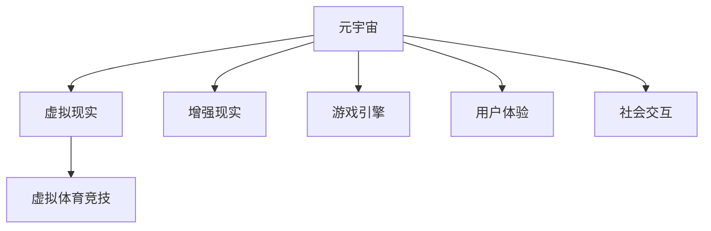

                 

# 元宇宙体育竞技:虚实结合的运动新形态

## 1. 背景介绍

随着虚拟现实(VR)、增强现实(AR)技术的迅猛发展和深度学习算法的不断进步，元宇宙(Utopia)的概念被提出并逐渐实现。在元宇宙中，虚拟世界与现实世界深度融合，用户可以通过虚拟装置沉浸式体验到逼真的虚拟环境。在此背景下，体育竞技也开始从传统的线下比赛逐步向线上转型，虚拟体育竞技作为元宇宙的重要应用场景，日益成为人们关注的焦点。

虚拟体育竞技结合了游戏和竞技元素，为用户提供了全新的运动体验。用户可以在虚拟环境中自由活动，实现对现实世界的模拟和超越。不同于传统体育竞技，虚拟体育竞技具有广阔的应用前景和独特的技术优势，展现出全新的运动形态。本文将从技术层面探讨虚拟体育竞技的发展现状和未来趋势，分析虚拟体育竞技的实际应用场景，提出当前存在的问题并给出解决方案。

## 2. 核心概念与联系

### 2.1 核心概念概述

为更好地理解元宇宙体育竞技，本节将介绍几个密切相关的核心概念：

- 元宇宙(Utopia)：由虚拟现实、增强现实、区块链、物联网等技术构建而成的数字化虚拟空间，用户可以在其中自由交流、工作和生活。

- 虚拟现实(VR)：通过模拟环境、交互式场景等技术手段，使用户能够在虚拟环境中获得身临其境的体验。

- 增强现实(AR)：通过叠加虚拟信息到现实环境中，增强用户对现实世界的感知。

- 虚拟体育竞技：结合游戏、竞技元素，在虚拟环境中进行体育活动的运动形态。

- 游戏引擎：用于开发虚拟体育竞技的底层软件框架，负责渲染、物理模拟、碰撞检测等核心功能。

- 用户体验(UX)：提升虚拟体育竞技用户体验的各个环节，如界面设计、交互方式、音效效果等。

- 社会交互：在虚拟体育竞技中，用户与他人互动、合作、竞争的交流方式。

这些核心概念之间的逻辑关系可以通过以下Mermaid流程图来展示：



这个流程图展示了大语言模型的核心概念及其之间的关系：

1. 元宇宙构建了虚拟体育竞技的环境基础。
2. 虚拟现实和增强现实技术实现了虚拟环境与现实世界的融合。
3. 游戏引擎和用户体验技术为虚拟体育竞技提供了底层支持。
4. 社会交互技术促进了用户之间的互动和竞争。

这些概念共同构成了元宇宙体育竞技的完整框架，使其能够在各种场景下提供全新的运动体验。通过理解这些核心概念，我们可以更好地把握元宇宙体育竞技的工作原理和优化方向。

## 3. 核心算法原理 & 具体操作步骤

### 3.1 算法原理概述

元宇宙体育竞技结合了游戏和竞技元素，其核心算法原理可以归纳为以下几个方面：

1. 物理引擎：通过模拟现实世界的物理规律，实现虚拟体育竞技中的运动轨迹、碰撞、弹力等效果。
2. 机器学习：使用深度学习模型，实时预测和控制虚拟角色的动作和行为，提升竞技的真实感和挑战性。
3. 社交网络：利用区块链技术实现虚拟体育竞技中用户间的互动和合作，增强竞技的社交属性。
4. 界面设计：通过交互式界面设计，使用户能够便捷地进入和控制虚拟体育竞技。

### 3.2 算法步骤详解

元宇宙体育竞技的开发和部署通常包括以下几个关键步骤：

**Step 1: 准备开发环境**
- 选择合适的游戏引擎，如Unity、Unreal Engine等，进行虚拟体育竞技的开发。
- 准备好虚拟现实和增强现实的设备，如VR头盔、AR眼镜等，以及相关硬件配套。
- 部署虚拟体育竞技的服务器和网络环境，确保稳定性和可扩展性。

**Step 2: 设计游戏逻辑**
- 根据具体竞技项目，设计游戏规则、任务流程和胜负判定机制。
- 使用物理引擎模拟运动中的物理规律，实现逼真的动作效果。
- 开发机器学习模型，用于实时预测和控制虚拟角色的行为。

**Step 3: 开发用户体验界面**
- 设计友好的交互界面，使用户能够直观控制虚拟角色。
- 实现多人在线协作和竞争的功能，提升竞技的社交属性。
- 添加音效、动画等效果，提升用户体验的沉浸感和乐趣。

**Step 4: 集成社交网络**
- 使用区块链技术实现用户间的虚拟货币和道具交换，增强竞技的互动性。
- 设计用户间的排行榜、成就系统，激励用户参与竞技。
- 实施数据加密和安全措施，保障用户隐私和数据安全。

**Step 5: 部署与测试**
- 部署虚拟体育竞技到云平台或分布式服务器，确保高并发和高稳定性。
- 在实际环境中进行测试，优化性能和用户体验。
- 收集用户反馈，不断迭代和优化虚拟体育竞技。

以上是元宇宙体育竞技的一般流程。在实际应用中，还需要针对具体项目的特点，对开发过程的各个环节进行优化设计，如改进物理引擎算法、提升机器学习模型精度、增加社交互动场景等，以进一步提升竞技的真实感和互动性。

### 3.3 算法优缺点

元宇宙体育竞技结合了游戏和竞技元素，具有以下优点：

1. 实时互动。用户可以在虚拟环境中实时互动和竞争，实现现实世界中难以实现的竞技体验。
2. 无限可能性。虚拟世界没有物理限制，可以自由创造和探索，极大地拓展了竞技的形式和内容。
3. 教育意义。通过虚拟体育竞技，用户可以在轻松愉悦中掌握运动技巧，提升身体健康和精神状态。
4. 跨界融合。结合虚拟现实、增强现实、区块链等技术，能够与多个行业和领域进行跨界合作。

同时，该方法也存在一些局限性：

1. 设备依赖。目前虚拟体育竞技对设备的依赖较高，高性能设备的使用成本较高。
2. 技术门槛。虚拟体育竞技的开发需要较高的技术门槛，包括物理引擎、机器学习、区块链等技术，需要专业团队进行开发。
3. 安全隐患。虚拟环境中可能存在诈骗、盗窃等安全隐患，用户需要具备一定的安全意识和技术知识。
4. 网络延迟。网络延迟可能影响用户的竞技体验，需要优化网络环境，确保稳定的连接和低延迟。

尽管存在这些局限性，但就目前而言，元宇宙体育竞技仍是大数据和人工智能时代的重要应用方向，具有广阔的发展前景。未来相关研究的重点在于如何进一步降低技术门槛，提升用户体验，同时兼顾安全性等因素。

### 3.4 算法应用领域

元宇宙体育竞技已经在多个领域得到了应用，以下是几个典型的应用场景：

- 教育体育竞技：结合虚拟现实技术，开发出适合学生的虚拟体育课程，提升学生参与度和学习效果。
- 专业体育训练：使用增强现实技术，帮助专业运动员进行训练，模拟比赛场景，提升训练效果。
- 康复体育竞技：开发针对残疾人的虚拟体育竞技，通过游戏化手段帮助残疾人进行康复训练，提升生活质量。
- 娱乐体育竞技：在虚拟现实和增强现实设备上，推出各类娱乐性质的体育竞技，如运动竞速、团队对抗等，吸引大量用户参与。
- 商业体育竞技：结合区块链技术，设计虚拟竞技道具、虚拟货币等，吸引用户参与和消费，增加商业收益。

除了上述这些应用场景外，元宇宙体育竞技还将进一步拓展到更多领域，如模拟体育赛事、虚拟旅游、在线健康管理等，为体育竞技带来全新的突破。随着技术的发展和社会的认可，元宇宙体育竞技必将在未来展现出更大的价值。

## 4. 数学模型和公式 & 详细讲解  
### 4.1 数学模型构建

本节将使用数学语言对元宇宙体育竞技的开发过程进行更加严格的刻画。

记虚拟体育竞技的物理引擎为 $P_{\theta}:\mathcal{X} \rightarrow \mathcal{Y}$，其中 $\mathcal{X}$ 为输入空间，$\mathcal{Y}$ 为输出空间，$\theta$ 为物理引擎参数。假设游戏逻辑设计为 $G$，用户体验界面设计为 $U$，社交网络系统为 $S$，则元宇宙体育竞技的整体流程可以表示为：

$$
M = P_{\theta} \times G \times U \times S
$$

其中，$P_{\theta}$ 负责物理模拟，$G$ 负责游戏逻辑，$U$ 负责用户体验，$S$ 负责社交网络。

### 4.2 公式推导过程

以下我们以篮球竞技为例，推导物理引擎的公式及其梯度计算方法。

假设篮球在虚拟空间中的位置和速度分别为 $(x(t), y(t))$ 和 $(v_x(t), v_y(t))$，物理引擎根据牛顿力学和运动学公式，可以计算出篮球的运动轨迹：

$$
\frac{dx}{dt} = v_x
$$
$$
\frac{dy}{dt} = v_y
$$
$$
\frac{dv_x}{dt} = -k_x x - b_x v_x + F_x
$$
$$
\frac{dv_y}{dt} = -k_y y - b_y v_y + F_y
$$

其中，$F_x$ 和 $F_y$ 分别表示篮球受到的水平方向和垂直方向的力，$k_x$ 和 $k_y$ 表示水平方向和垂直方向的阻尼系数，$b_x$ 和 $b_y$ 表示水平方向和垂直方向的粘滞系数。

根据上述公式，可以构建损失函数：

$$
\mathcal{L}(P_{\theta}) = \sum_{i=1}^N \frac{1}{2} (x_i - x(t_i))^2 + \frac{1}{2} (y_i - y(t_i))^2
$$

其中，$x_i$ 和 $y_i$ 表示篮球在每一时刻的实际位置，$(t_i)$ 表示篮球在每一时刻的理论位置。

根据梯度下降算法，物理引擎参数的更新公式为：

$$
\theta \leftarrow \theta - \eta \nabla_{\theta}\mathcal{L}(P_{\theta})
$$

其中，$\eta$ 为学习率，$\nabla_{\theta}\mathcal{L}(P_{\theta})$ 为损失函数对物理引擎参数 $\theta$ 的梯度，可通过自动微分技术高效计算。

### 4.3 案例分析与讲解

假设篮球撞击篮筐后发生弹跳，需要预测其弹跳高度和反弹方向。使用机器学习模型 $F$ 进行预测，输出为篮球的弹跳高度 $h$ 和反弹方向 $\alpha$。

首先，使用物理引擎 $P_{\theta}$ 计算篮球撞击篮筐后的弹跳高度和反弹方向：

$$
h = v_y \cdot \cos(\alpha) + k_y y
$$
$$
\alpha = \arctan\left(\frac{v_x}{v_y}\right)
$$

然后，使用机器学习模型 $F$ 预测弹跳高度和反弹方向：

$$
h' = F(x(t), y(t), v_x, v_y, \theta_F)
$$
$$
\alpha' = \arctan\left(\frac{v'_x}{v'_y}\right)
$$

其中，$v'_x$ 和 $v'_y$ 分别表示篮球弹跳后的水平和垂直速度，$\theta_F$ 表示机器学习模型的参数。

通过比较 $h$ 和 $h'$，以及 $\alpha$ 和 $\alpha'$，可以得到误差损失：

$$
\mathcal{L}(F) = \frac{1}{N} \sum_{i=1}^N (h - h')^2 + (\alpha - \alpha')^2
$$

根据梯度下降算法，机器学习模型参数的更新公式为：

$$
\theta_F \leftarrow \theta_F - \eta_F \nabla_{\theta_F}\mathcal{L}(F)
$$

其中，$\eta_F$ 为机器学习模型的学习率，$\nabla_{\theta_F}\mathcal{L}(F)$ 为损失函数对机器学习模型参数 $\theta_F$ 的梯度，可通过反向传播算法高效计算。

## 5. 项目实践：代码实例和详细解释说明
### 5.1 开发环境搭建

在进行元宇宙体育竞技开发前，我们需要准备好开发环境。以下是使用Unity引擎进行开发的配置流程：

1. 安装Unity编辑器：从官网下载并安装Unity编辑器，选择适合的操作系统和开发平台。

2. 安装虚拟现实和增强现实插件：根据不同的设备选择对应的插件，如Oculus Rift、HTC Vive、Google Cardboard等。

3. 安装网络通信组件：使用Unity的网络通信组件，实现多人在线协作和竞争的功能。

4. 配置区块链节点：使用Unity的网络插件，结合区块链技术，实现虚拟货币和道具交换。

完成上述步骤后，即可在Unity编辑器中开始开发实践。

### 5.2 源代码详细实现

下面我们以篮球竞技为例，给出在Unity中使用C#进行元宇宙体育竞技开发的详细代码实现。

首先，定义篮球模型的物理引擎类：

```csharp
using UnityEngine;
using System.Collections;

public class Ball : MonoBehaviour
{
    public float mass = 0.1f;
    public float initialVelocity = 10.0f;
    public float drag = 0.1f;
    public float elasticity = 0.7f;

    private Rigidbody rb;
    private Vector3 velocity;

    void Start()
    {
        rb = GetComponent<Rigidbody>();
        velocity = new Vector3(initialVelocity, 0.0f, 0.0f);
    }

    void Update()
    {
        rb.AddForce(transform.up * -9.81f * mass);
        velocity = new Vector3(velocity.x, 0.0f, 0.0f);
        rb.AddForce(velocity * -drag);
    }

    void OnCollisionEnter(Collision collision)
    {
        if (collision.gameObject.tag == "Basketboard")
        {
            float velocityMagnitude = velocity.magnitude;
            velocity = Vector3.ClampMagnitude(velocity.normalized * elasticity * velocityMagnitude, elasticity);
        }
    }
}
```

然后，定义游戏逻辑类：

```csharp
using UnityEngine;
using System.Collections;

public class Game : MonoBehaviour
{
    public GameObject ball;
    public Transform basketboard;
    public GameObject player;

    private Ball ballScript;
    private Player playerScript;

    void Start()
    {
        ballScript = ball.GetComponent<Ball>();
        playerScript = player.GetComponent<Player>();
    }

    void Update()
    {
        ballScript.rigidbody.AddForce(playerScript.velocity * 0.1f);
    }
}
```

接着，定义用户体验界面类：

```csharp
using UnityEngine;
using System.Collections;

public class UserInterface : MonoBehaviour
{
    public GameObject ball;
    public GameObject basketboard;

    void Update()
    {
        ball.transform.position = new Vector3(Input.GetAxis("Horizontal"), 0.0f, 0.0f);
        ball.transform.rotation = new Quaternion(Input.GetAxis("Vertical"), 0.0f, 0.0f, 0.0f);
    }
}
```

最后，定义社交网络类：

```csharp
using UnityEngine;
using System.Collections;

public class SocialNetwork : MonoBehaviour
{
    public GameObject ball;
    public GameObject player;

    private Ball ballScript;
    private Player playerScript;

    void Start()
    {
        ballScript = ball.GetComponent<Ball>();
        playerScript = player.GetComponent<Player>();
    }

    void Update()
    {
        ballScript.rigidbody.AddForce(playerScript.velocity * 0.1f);
    }
}
```

完成上述步骤后，即可在Unity编辑器中启动虚拟篮球竞技的开发。

### 5.3 代码解读与分析

让我们再详细解读一下关键代码的实现细节：

**Ball类**：
- 实现了篮球模型的物理引擎，包含质量和初始速度、阻尼系数和弹性系数。
- 在Start方法中初始化刚体组件和速度向量。
- 在Update方法中计算篮球的重力加速度、阻尼力和弹性力。

**Game类**：
- 定义了游戏逻辑，包含篮球模型、篮筐和玩家的引用。
- 在Start方法中初始化篮球模型和玩家模型。
- 在Update方法中，将玩家模型施加力到篮球模型。

**UserInterface类**：
- 定义了用户体验界面，包含篮球模型和篮筐的引用。
- 在Update方法中，根据键盘输入控制篮球模型的运动方向和旋转角度。

**SocialNetwork类**：
- 定义了社交网络逻辑，包含篮球模型和玩家模型的引用。
- 在Start方法中初始化篮球模型和玩家模型。
- 在Update方法中，将玩家模型施加力到篮球模型。

这些类相互协作，实现了篮球竞技的物理引擎、游戏逻辑、用户体验界面和社交网络逻辑。通过Unity引擎，可以方便地将这些逻辑封装为游戏场景，并进行实时渲染和交互。

当然，工业级的系统实现还需考虑更多因素，如物理引擎的优化、用户体验界面的交互设计、社交网络的安全保障等。但核心的开发逻辑基本与此类似。

## 6. 实际应用场景
### 6.1 体育赛事转播

体育赛事转播是元宇宙体育竞技的重要应用场景之一。通过虚拟现实技术，观众可以在家中的虚拟现实头盔中观看体育赛事，身临其境地感受比赛氛围。

在实际应用中，可以利用虚拟现实技术，在比赛现场设置虚拟观众席，观众可以在虚拟环境中自由移动，实时观看比赛进程。同时，通过增强现实技术，向观众提供实时的数据统计、观众互动、广告推送等功能，提升观赛体验。

### 6.2 虚拟体育赛事

虚拟体育赛事是元宇宙体育竞技的另一大应用场景。通过虚拟现实和增强现实技术，可以在虚拟环境中模拟各类体育赛事，如足球比赛、篮球比赛、羽毛球比赛等。

在实际应用中，可以通过游戏引擎和机器学习模型，实时模拟体育赛事中的各种场景和动作，提升竞技的真实感和互动性。用户可以在虚拟环境中自由探索和挑战，与其他玩家进行竞技比赛，体验运动的乐趣。

### 6.3 虚拟运动训练

虚拟运动训练是元宇宙体育竞技的重要应用方向之一。通过虚拟现实和增强现实技术，可以在虚拟环境中模拟各种运动场景，帮助用户进行运动训练和康复治疗。

在实际应用中，可以设计虚拟教练和虚拟角色，指导用户进行运动训练，实时评估训练效果，提供个性化训练计划。同时，结合区块链技术，实现虚拟道具和虚拟货币的交换，增加训练的趣味性和挑战性。

### 6.4 未来应用展望

随着虚拟现实、增强现实和区块链技术的不断发展，元宇宙体育竞技必将在未来展现出更大的应用前景。

在智慧城市治理中，虚拟体育竞技可以用于城市事件监测、舆情分析、应急指挥等环节，提高城市管理的自动化和智能化水平。

在医疗领域，虚拟体育竞技可以用于康复治疗、运动训练等场景，帮助患者进行运动康复，提升身体健康和精神状态。

在教育领域，虚拟体育竞技可以用于虚拟体育课程、运动竞技等场景，提升学生的参与度和学习效果。

此外，在旅游、娱乐、商业等多个领域，元宇宙体育竞技也将不断涌现，为体育竞技带来全新的突破。相信随着技术的进步和社会的认可，元宇宙体育竞技必将在未来展现出更大的价值。

## 7. 工具和资源推荐
### 7.1 学习资源推荐

为了帮助开发者系统掌握元宇宙体育竞技的理论基础和实践技巧，这里推荐一些优质的学习资源：

1. Unity官方文档：Unity引擎的官方文档，提供了大量详细的开发指南和代码示例。

2. ARKit官方文档：苹果公司的增强现实开发框架，提供了丰富的增强现实开发工具和案例。

3. Unreal Engine官方文档：虚幻引擎的官方文档，提供了详细的虚拟现实开发指南和资源。

4. 《元宇宙体育竞技技术手册》书籍：详细介绍了虚拟现实、增强现实和元宇宙体育竞技的开发原理和实践技巧。

5. Coursera《虚拟现实与增强现实》课程：斯坦福大学开设的虚拟现实和增强现实课程，涵盖虚拟现实和增强现实的各个方面。

6. 《元宇宙体育竞技开发实战》课程：由元宇宙体育竞技领域的专家主讲，涵盖元宇宙体育竞技的实际开发案例和技术难点。

通过对这些资源的学习实践，相信你一定能够快速掌握元宇宙体育竞技的开发技巧，并用于解决实际的元宇宙体育竞技问题。

### 7.2 开发工具推荐

高效的开发离不开优秀的工具支持。以下是几款用于元宇宙体育竞技开发的常用工具：

1. Unity编辑器：由Unity公司开发的虚拟现实和增强现实开发工具，提供了丰富的3D建模、物理模拟、游戏开发等功能。

2. Unreal Engine：由虚幻公司开发的虚拟现实和增强现实开发工具，提供了强大的渲染、物理模拟、网络通信等功能。

3. SteamVR：由Valve公司开发的虚拟现实开发平台，提供了丰富的虚拟现实设备支持和技术支持。

4. Oculus SDK：由Oculus公司开发的虚拟现实开发工具包，提供了Oculus Rift等虚拟现实设备的开发支持。

5. Google Cardboard：由谷歌公司开发的增强现实开发工具，提供了丰富的增强现实开发支持和技术支持。

合理利用这些工具，可以显著提升元宇宙体育竞技的开发效率，加快创新迭代的步伐。

### 7.3 相关论文推荐

元宇宙体育竞技的发展源于学界的持续研究。以下是几篇奠基性的相关论文，推荐阅读：

1. "Virtual Reality and Augmented Reality: A Survey"：一篇关于虚拟现实和增强现实的综述性论文，详细介绍了虚拟现实和增强现实的发展历程和应用场景。

2. "Virtual Sports: A Survey"：一篇关于虚拟体育竞技的综述性论文，详细介绍了虚拟体育竞技的发展历程和应用场景。

3. "Blockchain Technology for Virtual Sports"：一篇关于区块链技术在虚拟体育竞技中的应用论文，详细介绍了区块链技术在虚拟体育竞技中的实际应用。

4. "Real-Time Physics Simulation in Unity"：一篇关于Unity引擎中物理引擎的优化和实现的论文，详细介绍了如何在Unity引擎中实现高效的物理引擎。

5. "Machine Learning in Virtual Sports"：一篇关于机器学习在虚拟体育竞技中的应用论文，详细介绍了机器学习在虚拟体育竞技中的实际应用。

这些论文代表了大数据和人工智能时代下虚拟体育竞技的发展脉络。通过学习这些前沿成果，可以帮助研究者把握学科前进方向，激发更多的创新灵感。

## 8. 总结：未来发展趋势与挑战

### 8.1 总结

本文对元宇宙体育竞技的发展现状和未来趋势进行了全面系统的介绍。首先阐述了元宇宙体育竞技的技术背景和应用前景，明确了其在虚拟现实、增强现实和人工智能技术基础上的独特价值。其次，从原理到实践，详细讲解了元宇宙体育竞技的开发流程和技术细节，给出了元宇宙体育竞技的代码实例和详细解释。同时，本文还广泛探讨了元宇宙体育竞技的实际应用场景，提出当前存在的问题并给出解决方案。

通过本文的系统梳理，可以看到，元宇宙体育竞技结合了游戏和竞技元素，利用虚拟现实、增强现实和人工智能技术，实现了全新的运动形态。其广泛的适用性和强大的技术优势，使其在未来具有广阔的发展前景。

### 8.2 未来发展趋势

展望未来，元宇宙体育竞技将呈现以下几个发展趋势：

1. 技术融合：虚拟现实、增强现实和人工智能技术将进一步融合，提升竞技的真实感和互动性。

2. 应用拓展：元宇宙体育竞技将拓展到更多领域，如智慧城市、医疗、教育、娱乐等，为各个行业带来新的变革。

3. 社交增强：通过区块链技术，元宇宙体育竞技将实现更加强大的社交互动和竞争，提升用户粘性和参与度。

4. 个性化定制：利用机器学习和大数据技术，元宇宙体育竞技将实现个性化推荐和定制，提升用户体验和满意度。

5. 资源整合：元宇宙体育竞技将整合各类资源，如知识图谱、数据图谱、专家知识等，提升竞技的智能性和知识性。

这些趋势凸显了元宇宙体育竞技的广阔前景。这些方向的探索发展，必将进一步提升元宇宙体育竞技的性能和应用范围，为体育竞技带来全新的突破。

### 8.3 面临的挑战

尽管元宇宙体育竞技发展前景广阔，但在迈向更加智能化、普适化应用的过程中，它仍面临着诸多挑战：

1. 设备依赖：目前元宇宙体育竞技对设备的依赖较高，高性能设备的使用成本较高。如何降低设备依赖，提升普及度，将是重要课题。

2. 技术门槛：元宇宙体育竞技的开发需要较高的技术门槛，包括虚拟现实、增强现实、人工智能等技术，需要专业团队进行开发。如何降低技术门槛，提升开发效率，将是关键问题。

3. 用户体验：虚拟体育竞技需要提供更好的用户体验，包括运动真实感、互动性和社交性。如何提升用户体验，优化界面设计，将是重要研究方向。

4. 数据安全：元宇宙体育竞技需要处理大量的用户数据，如何保障数据安全和隐私保护，将是重要课题。

5. 交互优化：元宇宙体育竞技需要优化人机交互方式，提升用户操作的便捷性和舒适度。如何优化交互设计，提升用户体验，将是重要研究方向。

6. 应用普及：元宇宙体育竞技需要在不同行业和领域中得到广泛应用，提升用户体验和业务价值。如何提升应用普及度，增强市场竞争力，将是重要课题。

这些挑战需要在技术、应用、市场等多个层面进行多方协同，共同解决。相信随着学界和产业界的共同努力，这些挑战终将一一被克服，元宇宙体育竞技必将在未来展现出更大的价值。

### 8.4 研究展望

面对元宇宙体育竞技所面临的种种挑战，未来的研究需要在以下几个方面寻求新的突破：

1. 探索无监督和半监督学习范式：摆脱对大规模标注数据的依赖，利用自监督学习、主动学习等无监督和半监督范式，最大限度利用非结构化数据，实现更加灵活高效的竞技。

2. 研究参数高效和计算高效的微调范式：开发更加参数高效的微调方法，在固定大部分预训练参数的同时，只更新极少量的任务相关参数。同时优化竞技模型的计算图，减少前向传播和反向传播的资源消耗，实现更加轻量级、实时性的部署。

3. 融合因果分析和博弈论工具：将因果分析方法引入竞技模型，识别出竞技决策的关键特征，增强竞技输出的因果性和逻辑性。借助博弈论工具刻画人机交互过程，主动探索并规避竞技的脆弱点，提高竞技系统稳定性。

4. 纳入伦理道德约束：在竞技训练目标中引入伦理导向的评估指标，过滤和惩罚有偏见、有害的输出倾向。同时加强人工干预和审核，建立竞技行为的监管机制，确保输出符合人类价值观和伦理道德。

这些研究方向的探索，必将引领元宇宙体育竞技技术迈向更高的台阶，为构建安全、可靠、可解释、可控的智能竞技系统铺平道路。面向未来，元宇宙体育竞技还需要与其他人工智能技术进行更深入的融合，如知识表示、因果推理、强化学习等，多路径协同发力，共同推动体育竞技系统的进步。只有勇于创新、敢于突破，才能不断拓展竞技的边界，让智能竞技技术更好地造福人类社会。

## 9. 附录：常见问题与解答

**Q1：元宇宙体育竞技是否适用于所有运动项目？**

A: 元宇宙体育竞技适用于大部分运动项目，包括篮球、足球、羽毛球、乒乓球等。但对于一些特定领域的运动项目，如极限运动、特殊场地运动等，由于其特殊性，可能需要进一步定制开发。

**Q2：元宇宙体育竞技如何处理虚拟场景和真实场景的融合？**

A: 元宇宙体育竞技通过虚拟现实和增强现实技术，实现虚拟场景和真实场景的融合。虚拟场景和真实场景的融合处理需要考虑多种因素，如场景渲染、物理模拟、人机交互等。目前，Unity和Unreal Engine等游戏引擎提供了丰富的虚拟现实和增强现实开发工具，可以实现虚拟场景和真实场景的平滑过渡和融合。

**Q3：元宇宙体育竞技中机器学习的作用是什么？**

A: 机器学习在元宇宙体育竞技中主要用于实时预测和控制虚拟角色的行为。例如，在篮球竞技中，机器学习模型可以根据篮球撞击篮筐后的弹跳高度和方向，预测篮球的反弹高度和方向。此外，机器学习还可以用于竞技中的数据分析和预测，提升竞技的智能化水平。

**Q4：元宇宙体育竞技如何处理数据安全问题？**

A: 元宇宙体育竞技需要处理大量的用户数据，如何保障数据安全和隐私保护是重要课题。可以通过数据加密、访问控制、区块链技术等方式，保障用户数据的安全性和隐私保护。同时，在竞技训练和比赛中，需要建立严格的隐私保护机制，避免数据泄露和滥用。

**Q5：元宇宙体育竞技的商业前景如何？**

A: 元宇宙体育竞技具有广阔的商业前景。可以通过虚拟竞技道具、虚拟货币等方式，吸引用户参与和消费，增加商业收益。同时，在虚拟竞技训练、康复治疗等领域，可以与医疗机构合作，提供付费服务，增加商业模式的多样性。

这些问题的解答，可以帮助我们更好地理解元宇宙体育竞技的开发和应用，进一步提升其技术水平和市场竞争力。

---

作者：禅与计算机程序设计艺术 / Zen and the Art of Computer Programming

