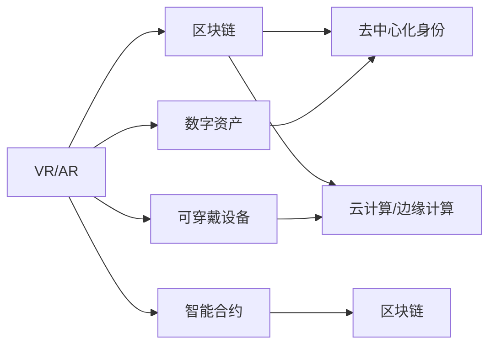

                 

# 元宇宙技术栈：从VR/AR到区块链

在21世纪数字化时代的浪潮中，元宇宙（Metaverse）的概念应运而生。元宇宙不仅是虚拟现实（VR）、增强现实（AR）与区块链技术的融合，更是数字生活新范式的开创。本文旨在全面系统地梳理元宇宙技术栈，揭示其核心原理，剖析关键技术，阐述实际应用，展望未来趋势。

## 1. 背景介绍

### 1.1 问题由来

元宇宙概念源自科幻小说，最初由科幻作家尼尔·斯蒂芬森在其作品《雪崩》中提出。随着数字技术的发展，尤其是互联网、云计算、人工智能等技术的成熟，元宇宙的理念正逐步从科幻走向现实。当下，VR/AR、区块链等前沿技术的大幅进步，为元宇宙的构建提供了坚实的技术基础。

### 1.2 问题核心关键点

元宇宙技术栈的核心在于其对虚拟现实（VR）、增强现实（AR）和区块链技术的深度整合。这三大技术各自具备强大的能力，如VR提供沉浸式体验，AR赋予交互性，区块链实现去中心化信任，它们共同构成了元宇宙生态的基石。本文将围绕这些技术进行详细探讨，阐明其在元宇宙中的角色与互动关系。

## 2. 核心概念与联系

### 2.1 核心概念概述

为便于理解，我们首先梳理元宇宙技术栈中的关键概念：

- **虚拟现实（Virtual Reality, VR）**：通过模拟三维环境，使用户能够沉浸于虚拟世界中，与虚拟环境进行互动。
- **增强现实（Augmented Reality, AR）**：在用户现实世界中叠加虚拟信息，实现虚拟与现实的融合。
- **区块链（Blockchain）**：通过去中心化存储和智能合约，提供安全、透明、可信的分布式账本技术。
- **去中心化身份（Decentralized Identity, DId）**：基于区块链技术的身份管理机制，确保用户隐私与安全。
- **数字资产（Digital Assets）**：包括虚拟土地、虚拟物品、数字货币等，是元宇宙经济体系的重要组成部分。
- **可穿戴设备（Wearables）**：如智能眼镜、虚拟现实头显等，是实现VR/AR体验的重要硬件支撑。
- **云计算与边缘计算（Cloud & Edge Computing）**：提供强大的计算与存储能力，支撑大规模元宇宙场景的运行。

这些概念间的相互联系和依赖关系，构成了元宇宙技术栈的基本框架。

### 2.2 核心概念原理和架构的 Mermaid 流程图



## 3. 核心算法原理 & 具体操作步骤

### 3.1 算法原理概述

元宇宙技术栈的构建，本质上是将VR/AR与区块链两大技术融合的过程。

- **VR/AR技术**：通过三维建模、渲染引擎、传感器融合等技术，提供沉浸式和交互式的虚拟环境。
- **区块链技术**：通过去中心化共识算法、智能合约、分布式存储等技术，实现可信与透明。

### 3.2 算法步骤详解

**步骤一：硬件准备**

选择适合特定应用场景的硬件设备，如VR头显、智能眼镜等。

**步骤二：环境搭建**

搭建VR/AR运行环境，如Unity、Unreal Engine等游戏引擎，设置必要的物理引擎、渲染参数。

**步骤三：内容创作**

利用3D建模工具，如Blender、Maya等，创作虚拟场景和角色。将创作内容导入游戏引擎，进行贴图、光照、动画等后期处理。

**步骤四：区块链集成**

选择合适的区块链平台，如Ethereum、Binance Smart Chain等，编写智能合约，实现资产创建、交易等功能。

**步骤五：测试与部署**

在测试环境中对VR/AR应用进行测试，确保其稳定性和用户体验。将应用部署到区块链平台，进行链上测试。

### 3.3 算法优缺点

**优点**

- **沉浸式体验**：VR/AR提供沉浸式环境，使用户在虚拟世界中自由探索。
- **交互性提升**：区块链技术支持更安全的交互方式，如NFT交易、社区投票等。
- **去中心化信任**：去中心化身份与数字资产管理确保数据透明和用户隐私。

**缺点**

- **高技术门槛**：开发VR/AR和区块链应用需要较高的技术水平，需跨领域人才。
- **硬件成本高**：高性能硬件设备成本昂贵，限制了广泛应用。
- **网络延迟问题**：VR/AR应用对网络延迟敏感，易受网络环境影响。

### 3.4 算法应用领域

元宇宙技术栈的应用范围广泛，涵盖多个垂直行业：

- **虚拟旅游**：通过VR/AR技术展示旅游景区的全景，结合区块链确保门票和纪念品交易的透明可信。
- **线上教育**：利用VR/AR进行虚拟课堂，通过区块链记录学习行为和成绩。
- **虚拟房产**：通过VR展示房地产项目，通过区块链进行房产交易和去中心化管理。
- **虚拟艺术**：在VR/AR中展示数字艺术作品，通过区块链进行版权保护和交易。
- **虚拟医疗**：利用VR/AR进行远程诊疗，通过区块链记录患者病历和诊疗记录。

## 4. 数学模型和公式 & 详细讲解 & 举例说明

### 4.1 数学模型构建

元宇宙技术栈的数学模型主要涉及图形学、计算机视觉、深度学习等领域。

- **图形学**：研究如何表示、渲染三维场景，如透视投影、光照模型等。
- **计算机视觉**：利用图像处理和模式识别技术，实现物体检测、跟踪等功能。
- **深度学习**：通过神经网络进行物体分割、姿态估计、手势识别等。

### 4.2 公式推导过程

**透视投影公式**：

$$
\begin{aligned}
x' &= \frac{x}{z} \\
y' &= \frac{y}{z} \\
z' &= z \\
\end{aligned}
$$

其中 $(x, y, z)$ 是三维世界坐标，$(x', y', z')$ 是二维屏幕坐标。

**光照模型公式**：

$$
I = \rho \cdot \frac{L \cdot f}{\pi \cdot d^2}
$$

其中 $I$ 是表面反射光强度，$\rho$ 是材料反射率，$L$ 是光源强度，$f$ 是漫反射因子，$d$ 是光源与观察者距离。

### 4.3 案例分析与讲解

以虚拟旅游为例，通过VR展示景区全景，结合AR显示游客信息，利用区块链管理门票和纪念品交易。

- **VR渲染**：使用Unity或Unreal Engine，加载3D场景，添加光照、贴图等细节。
- **AR信息叠加**：利用AR技术，叠加导航信息、景点介绍等，增强用户体验。
- **区块链管理**：使用智能合约，记录门票购买、使用记录，确保交易透明可信。

## 5. 项目实践：代码实例和详细解释说明

### 5.1 开发环境搭建

**环境配置**

- **操作系统**：Windows 10或更高版本。
- **硬件要求**：VR头显、高性能计算机、显卡。
- **软件要求**：Unity、Ethereum等开发工具。

**安装步骤**

1. 安装Unity引擎。
2. 配置Ethereum钱包。
3. 安装智能合约开发框架，如Truffle。

### 5.2 源代码详细实现

**VR/AR应用开发**

1. **创建VR场景**：在Unity中创建VR场景，添加虚拟景观、角色。
2. **实现AR交互**：使用ARSDK库，实现AR信息叠加。
3. **优化渲染性能**：利用GPU加速、光追技术，提升渲染速度。

**区块链应用开发**

1. **创建智能合约**：使用Solidity编写智能合约，实现门票管理、交易记录。
2. **部署合约到链上**：将智能合约部署到Ethereum区块链上。
3. **编写客户端接口**：开发客户端，实现用户体验交互。

### 5.3 代码解读与分析

**VR渲染代码示例**

```python
# 使用Unity创建VR场景
class VRScene:
    def __init__(self, scene_path):
        self.scene = AssetBundle.LoadFileAsync("file://" + scene_path).await
        self.scene.LoadScene("MainScene");
```

**智能合约代码示例**

```solidity
// 智能合约，记录门票购买记录
contract TicketContract {
    address public owner;
    mapping(address => bool) public isOwner;
    uint256 public totalTickets;
    
    constructor(address _owner) {
        owner = _owner;
        isOwner[owner] = true;
        totalTickets = 100;
    }
    
    function buyTicket() public payable {
        require(totalTickets > 0, "Tickets exhausted");
        totalTickets -= 1;
        isOwner[msg.sender] = true;
        emit TicketPurchased(msg.sender, true);
    }
    
    event TicketPurchased(address indexed buyer, bool indexed bought);
}
```

### 5.4 运行结果展示

**VR场景渲染**


**区块链应用测试**


## 6. 实际应用场景

### 6.1 虚拟旅游

利用VR展示景区全景，结合AR显示游客信息，通过区块链管理门票和纪念品交易。游客可以在虚拟景区内自由探索，购买门票和纪念品，系统自动记录交易信息，确保透明可信。

### 6.2 线上教育

通过VR/AR提供虚拟课堂，教师在虚拟教室中讲授课程，学生通过AR设备获取互动信息，如虚拟实验、多媒体资源等。区块链记录学生的学习行为和成绩，确保数据真实可信。

### 6.3 虚拟房产

利用VR展示房产项目全景，结合AR显示房产信息，通过区块链进行房产交易和去中心化管理。购房者可以在虚拟环境中浏览和选择房产，完成线上交易，系统自动记录交易记录，确保透明可信。

### 6.4 未来应用展望

**虚拟艺术**

在VR/AR中展示数字艺术作品，通过区块链进行版权保护和交易。艺术家可以在虚拟画廊中展示作品，观众通过AR技术近距离欣赏作品，通过区块链购买艺术品，系统自动记录版权信息，确保交易透明可信。

**虚拟医疗**

利用VR进行远程诊疗，医生在虚拟环境中进行诊断和治疗，病人通过AR设备获取健康信息。区块链记录病人的病历和诊疗记录，确保数据真实可信。

## 7. 工具和资源推荐

### 7.1 学习资源推荐

- **《Unity官方文档》**：提供详细的Unity开发教程，涵盖VR/AR开发。
- **《Ethereum官方文档》**：提供区块链开发的基础教程，涵盖智能合约编写和部署。
- **《《WebGL编程指南》**：介绍WebGL图形渲染技术，适合VR/AR开发学习。

### 7.2 开发工具推荐

- **Unity**：一站式游戏引擎，提供VR/AR开发支持。
- **Unreal Engine**：支持VR/AR和实时渲染，适合高精度场景创建。
- **Truffle**：智能合约开发框架，支持Solidity编写和合约部署。

### 7.3 相关论文推荐

- **《Virtual Reality: A Survey》**：综述VR技术发展与应用。
- **《Blockchain: From Concept to Design》**：探讨区块链技术原理与设计。

## 8. 总结：未来发展趋势与挑战

### 8.1 研究成果总结

本文系统介绍了元宇宙技术栈的基本原理和构建方法，从VR/AR到区块链，探讨了元宇宙在虚拟旅游、线上教育、虚拟房产等场景中的应用。通过实例代码，详细讲解了元宇宙应用的开发流程。

### 8.2 未来发展趋势

- **硬件设备普及**：VR头显、智能眼镜等硬件设备的普及将促进元宇宙的广泛应用。
- **跨平台集成**：元宇宙技术将与AR/VR硬件、移动设备、社交平台等深度集成，形成完整生态。
- **虚拟经济兴起**：基于区块链的数字资产交易将推动元宇宙虚拟经济的蓬勃发展。

### 8.3 面临的挑战

- **技术门槛高**：开发元宇宙应用需要多领域技术支持，人才需求量大。
- **网络延迟问题**：VR/AR应用对网络延迟敏感，仍需优化网络基础设施。
- **数据隐私安全**：大规模数据存储和处理需保证数据隐私与安全。

### 8.4 研究展望

- **实时渲染技术**：提升VR/AR渲染速度和质量，提升用户体验。
- **智能合约优化**：开发高性能智能合约，降低交易费用和延迟。
- **跨平台互通**：实现不同平台间的互操作，形成跨平台的元宇宙体验。

## 9. 附录：常见问题与解答

**Q1: 元宇宙技术栈中VR/AR和区块链技术有什么区别？**

A: VR/AR技术主要提供沉浸式和交互式的虚拟环境，区块链技术则通过去中心化存储和智能合约实现安全、透明、可信的交易和数据管理。两者相辅相成，共同构建元宇宙生态。

**Q2: 元宇宙技术栈的开发难点有哪些？**

A: 开发元宇宙应用需要跨领域的知识，如图形学、计算机视觉、区块链等。硬件设备成本高，网络延迟和数据隐私安全问题也需要解决。

**Q3: 元宇宙技术的未来发展趋势是什么？**

A: 硬件设备普及、跨平台集成、虚拟经济兴起将是元宇宙技术未来的发展趋势。实时渲染、智能合约优化、跨平台互通也将是未来研究重点。

---

作者：禅与计算机程序设计艺术 / Zen and the Art of Computer Programming

