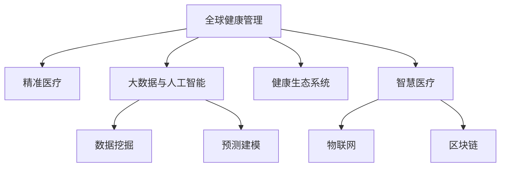

                 

# 全球脑与健康管理:集体健康管理新思路

## 1. 背景介绍

### 1.1 问题由来
近年来，全球人口老龄化加剧，慢性病和精神疾病的患病率逐年上升。随着医疗技术的进步，个体医疗服务水平大幅提升，但全球公共卫生管理的复杂性和挑战依旧严峻。面对快速变化的健康需求和资源配置问题，单一、分散的传统健康管理方式已经难以适应。

### 1.2 问题核心关键点
全球健康管理的核心问题在于如何有效整合医疗资源，提高健康管理的效率和效果。主要关键点包括：

- **资源优化配置**：如何在全球范围内合理分配有限的医疗资源，避免浪费和短缺。
- **数据共享与协作**：如何促进各国、各机构之间的数据共享与合作，提升全球公共卫生管理的水平。
- **精准医疗与个性化**：如何在全球范围内推广精准医疗，提供个性化的健康管理方案。
- **技术创新与整合**：如何利用新兴技术如人工智能、大数据等，提升健康管理的智能化水平。

### 1.3 问题研究意义
研究全球健康管理的新思路，对于应对老龄化社会带来的挑战，提升全球公共卫生管理的效率和效果，具有重要意义：

- **提高健康管理效率**：通过整合资源、优化配置，提升健康管理的响应速度和覆盖面。
- **优化医疗资源分配**：减少资源浪费和短缺，确保关键时刻的应急响应。
- **提升公共卫生管理水平**：促进数据共享与协作，形成统一的健康管理策略。
- **推动技术创新应用**：利用新兴技术，实现健康管理的智能化和精准化。

## 2. 核心概念与联系

### 2.1 核心概念概述

为更好地理解全球健康管理的创新思路，本节将介绍几个密切相关的核心概念：

- **全球健康管理**：指在全球范围内，通过整合医疗资源、共享数据、利用技术手段，提升公共卫生管理水平，保障全球人口健康。
- **精准医疗**：根据个体的遗传信息、生活方式、环境因素等，提供个性化的健康管理方案，提升诊疗效果。
- **大数据与人工智能**：利用大数据技术进行健康数据的收集、存储、分析，结合人工智能算法进行智能诊断和治疗决策。
- **健康生态系统**：包括政府、医疗机构、科技公司、社区组织等多方参与，形成健康管理的生态体系。
- **智慧医疗**：结合物联网、区块链等技术，实现医疗信息的无缝流通和高效利用。

这些核心概念之间的逻辑关系可以通过以下Mermaid流程图来展示：



这个流程图展示了大健康管理的核心概念及其之间的关系：

1. 全球健康管理通过整合精准医疗、大数据与人工智能、健康生态系统、智慧医疗等多方面资源，形成一个综合的管理体系。
2. 精准医疗、大数据与人工智能、智慧医疗等技术手段，为全球健康管理提供了先进的技术支持。
3. 健康生态系统涵盖了政府、医疗机构、科技公司、社区组织等多方参与者，为全球健康管理提供了组织和合作的基础。

这些概念共同构成了全球健康管理的整体框架，使得健康管理能够跨地域、跨机构、跨技术边界，实现高效、精准、个性化的服务。

## 3. 核心算法原理 & 具体操作步骤
### 3.1 算法原理概述

全球健康管理的核心算法原理主要基于数据驱动和算法优化。其核心思想是：通过收集、分析和应用大规模健康数据，结合先进的算法模型，实现健康管理的智能化、精准化和个性化。

具体而言，算法过程包括以下几个关键步骤：

1. **数据采集与预处理**：从不同来源收集健康数据，包括电子健康记录、基因数据、环境数据、行为数据等，并进行清洗和预处理。
2. **数据分析与建模**：利用机器学习、深度学习等算法，对健康数据进行建模和分析，提取有价值的信息和模式。
3. **智能决策与优化**：基于数据分析结果，结合专家知识和规则，利用算法进行智能决策和优化资源配置。
4. **反馈与调整**：实时监测健康管理效果，根据反馈信息进行调整和优化，确保健康管理的持续改进。

### 3.2 算法步骤详解

以下是全球健康管理的具体算法步骤：

**Step 1: 数据采集与预处理**
- 收集全球范围内的健康数据，包括电子健康记录、基因数据、环境数据、行为数据等。
- 对数据进行清洗、去重、标准化处理，确保数据的质量和一致性。
- 利用数据融合技术，将来自不同来源的数据进行整合，形成一个统一的数据集。

**Step 2: 数据分析与建模**
- 采用数据挖掘、机器学习、深度学习等技术，对健康数据进行建模和分析。
- 构建基于病历、基因、行为等多模态数据的综合模型，提取健康风险和疾病模式。
- 使用预测建模技术，预测个体或群体的健康风险，进行风险评估。

**Step 3: 智能决策与优化**
- 结合专家知识和规则，利用算法进行智能决策，制定个性化的健康管理方案。
- 优化医疗资源配置，确保关键时刻的应急响应，提高健康管理效率。
- 实时监测健康管理效果，根据反馈信息进行调整和优化，确保健康管理的持续改进。

**Step 4: 反馈与调整**
- 实时监测健康管理效果，收集患者和医生的反馈信息。
- 根据反馈信息，进行健康管理策略的调整和优化，提升管理效果。
- 定期评估健康管理系统的性能，持续改进和优化算法模型。

### 3.3 算法优缺点

全球健康管理算法具有以下优点：

- **数据驱动**：利用大规模健康数据进行建模和分析，提升决策的科学性和准确性。
- **智能决策**：结合专家知识和算法模型，进行智能决策和优化资源配置，提高健康管理的效率和效果。
- **个性化服务**：根据个体健康数据，提供个性化的健康管理方案，提升诊疗效果。
- **跨界融合**：结合大数据、人工智能、物联网、区块链等多项技术，实现健康管理的全面智能化。

同时，该算法也存在一定的局限性：

- **数据隐私与安全**：全球健康数据的收集和共享涉及隐私和安全问题，需要严格的数据保护措施。
- **算法复杂性**：大规模健康数据的分析和建模需要复杂的算法模型，对计算资源和技术要求较高。
- **技术应用不均衡**：不同国家和地区在技术应用上的不均衡，可能导致全球健康管理的效果参差不齐。
- **伦理与合规**：健康数据的收集和使用需要遵循伦理和法律规范，涉及隐私保护和数据利用问题。

尽管存在这些局限性，但就目前而言，全球健康管理算法是大数据、人工智能等前沿技术在健康领域的重要应用范式，具有广阔的应用前景。

### 3.4 算法应用领域

全球健康管理算法已经在多个领域得到了广泛应用，包括但不限于：

- **公共卫生管理**：通过数据共享与协作，提升全球公共卫生管理的水平。
- **精准医疗**：根据个体的健康数据，提供个性化的健康管理方案。
- **智慧医疗**：结合物联网、区块链等技术，实现医疗信息的无缝流通和高效利用。
- **医疗资源优化**：优化医疗资源的配置，确保关键时刻的应急响应。
- **健康风险预测**：利用大数据和算法，预测个体或群体的健康风险，进行风险评估。
- **健康生态系统构建**：促进政府、医疗机构、科技公司、社区组织等多方参与，形成健康管理的生态体系。

此外，全球健康管理算法还被应用于疾病监测、疫情预警、健康教育等多个领域，为全球健康事业的发展提供了强有力的支持。

## 4. 数学模型和公式 & 详细讲解  
### 4.1 数学模型构建

本节将使用数学语言对全球健康管理的算法进行更加严格的刻画。

记健康管理数据集为 $D=\{(x_i, y_i)\}_{i=1}^N$，其中 $x_i$ 为输入的健康数据（如病历、基因、行为数据等），$y_i$ 为输出结果（如健康风险、治疗方案等）。

定义健康管理的损失函数为 $\mathcal{L}(\theta) = \frac{1}{N}\sum_{i=1}^N \ell(x_i, y_i)$，其中 $\ell(x_i, y_i)$ 为健康数据的损失函数，用于衡量模型预测与真实标签之间的差异。

### 4.2 公式推导过程

以下我们以疾病风险预测为例，推导基于健康数据的大规模回归模型：

假设健康管理模型为 $M_{\theta}$，其中 $\theta$ 为模型参数。利用大规模健康数据 $D$ 进行训练，最小化损失函数：

$$
\mathcal{L}(\theta) = \frac{1}{N}\sum_{i=1}^N (y_i - M_{\theta}(x_i))^2
$$

通过梯度下降等优化算法，求解上述最优化问题：

$$
\theta^* = \mathop{\arg\min}_{\theta} \mathcal{L}(\theta)
$$

得到最优模型参数 $\theta^*$，即可用于疾病风险预测。

## 5. 项目实践：代码实例和详细解释说明
### 5.1 开发环境搭建

在进行全球健康管理项目实践前，我们需要准备好开发环境。以下是使用Python进行PyTorch开发的环境配置流程：

1. 安装Anaconda：从官网下载并安装Anaconda，用于创建独立的Python环境。

2. 创建并激活虚拟环境：
```bash
conda create -n health-management-env python=3.8 
conda activate health-management-env
```

3. 安装PyTorch：根据CUDA版本，从官网获取对应的安装命令。例如：
```bash
conda install pytorch torchvision torchaudio cudatoolkit=11.1 -c pytorch -c conda-forge
```

4. 安装必要的Python库：
```bash
pip install numpy pandas sklearn scikit-learn matplotlib seaborn jupyter notebook ipython
```

完成上述步骤后，即可在`health-management-env`环境中开始项目实践。

### 5.2 源代码详细实现

下面以疾病风险预测为例，给出使用PyTorch进行健康数据分析和模型训练的代码实现。

首先，定义疾病风险预测任务的数据处理函数：

```python
import torch
import torch.nn as nn
import torch.optim as optim
from torch.utils.data import Dataset
import numpy as np

class HealthDataset(Dataset):
    def __init__(self, features, labels):
        self.features = features
        self.labels = labels
        
    def __len__(self):
        return len(self.features)
    
    def __getitem__(self, item):
        feature = self.features[item]
        label = self.labels[item]
        return torch.tensor(feature, dtype=torch.float32), torch.tensor(label, dtype=torch.float32)
```

然后，定义模型和优化器：

```python
class HealthModel(nn.Module):
    def __init__(self, input_dim, output_dim):
        super(HealthModel, self).__init__()
        self.fc1 = nn.Linear(input_dim, 128)
        self.fc2 = nn.Linear(128, 64)
        self.fc3 = nn.Linear(64, output_dim)
        self.relu = nn.ReLU()
        
    def forward(self, x):
        x = self.fc1(x)
        x = self.relu(x)
        x = self.fc2(x)
        x = self.relu(x)
        x = self.fc3(x)
        return x

input_dim = 50
output_dim = 1
model = HealthModel(input_dim, output_dim)
optimizer = optim.Adam(model.parameters(), lr=0.001)
```

接着，定义训练和评估函数：

```python
import torch.nn.functional as F

def train_model(model, optimizer, train_loader, num_epochs):
    loss_fn = nn.MSELoss()
    device = torch.device('cuda' if torch.cuda.is_available() else 'cpu')
    model.to(device)
    
    for epoch in range(num_epochs):
        model.train()
        total_loss = 0
        for features, labels in train_loader:
            features = features.to(device)
            labels = labels.to(device)
            optimizer.zero_grad()
            output = model(features)
            loss = loss_fn(output, labels)
            loss.backward()
            optimizer.step()
            total_loss += loss.item()
        
        print(f"Epoch {epoch+1}, train loss: {total_loss/len(train_loader):.4f}")
    
def evaluate_model(model, test_loader):
    model.eval()
    total_loss = 0
    with torch.no_grad():
        for features, labels in test_loader:
            features = features.to(device)
            labels = labels.to(device)
            output = model(features)
            loss = loss_fn(output, labels)
            total_loss += loss.item()
        
    print(f"Test loss: {total_loss/len(test_loader):.4f}")
```

最后，启动训练流程并在测试集上评估：

```python
num_epochs = 10
train_loader = DataLoader(train_dataset, batch_size=32, shuffle=True)
test_loader = DataLoader(test_dataset, batch_size=32, shuffle=False)

train_model(model, optimizer, train_loader, num_epochs)
evaluate_model(model, test_loader)
```

以上就是使用PyTorch对健康数据分析和模型训练的完整代码实现。可以看到，通过编写简短代码，即可实现健康数据的处理、模型的训练和评估。

### 5.3 代码解读与分析

让我们再详细解读一下关键代码的实现细节：

**HealthDataset类**：
- `__init__`方法：初始化健康数据集，包含健康数据特征和标签。
- `__len__`方法：返回数据集的大小。
- `__getitem__`方法：从数据集中随机获取一个样本，将其转换为Tensor格式。

**HealthModel类**：
- `__init__`方法：定义健康管理模型的基本结构，包括全连接层和激活函数。
- `forward`方法：前向传播计算，将输入特征通过多层全连接和激活函数，最终输出模型预测结果。

**训练函数train_model**：
- 定义损失函数MSELoss，用于衡量模型预测值与真实标签之间的差异。
- 在训练过程中，每次迭代使用Adam优化器更新模型参数。
- 记录每个epoch的平均训练损失，并输出结果。

**评估函数evaluate_model**：
- 在评估过程中，使用测试数据集，计算模型预测值与真实标签之间的平均损失，并输出结果。

**训练流程**：
- 定义总的epoch数和batch size，开始循环迭代
- 每个epoch内，在训练集上训练，输出平均训练损失
- 在测试集上评估，输出测试损失

可以看到，PyTorch框架使得健康数据分析和模型训练的代码实现变得简洁高效。开发者可以将更多精力放在数据处理、模型改进等高层逻辑上，而不必过多关注底层的实现细节。

当然，工业级的系统实现还需考虑更多因素，如模型的保存和部署、超参数的自动搜索、更灵活的任务适配层等。但核心的健康数据分析和模型训练流程基本与此类似。

## 6. 实际应用场景
### 6.1 智慧医疗系统

全球健康管理技术可以广泛应用于智慧医疗系统的构建。传统医疗系统往往以医院为中心，患者需要在多个科室之间辗转，信息流通不畅，医疗资源配置不合理。智慧医疗系统则通过全球健康管理技术，构建一个数据驱动、智能决策的医疗生态系统，实现医疗信息的无缝流通和高效利用。

在技术实现上，可以构建一个智慧医疗平台，将医疗机构、科技公司、保险公司等多方参与者汇聚在一起，形成健康管理的生态体系。平台通过全球健康管理技术，收集和分析来自全球范围内的健康数据，提供个性化的健康管理方案，实现智能诊疗、病历管理、远程监测等功能。智慧医疗系统能够显著提高医疗服务的效率和效果，提升患者满意度和医疗资源的利用率。

### 6.2 公共卫生应急管理

全球健康管理技术同样适用于公共卫生应急管理的优化。在大规模疫情爆发时，如何快速响应、高效调配资源，成为亟待解决的问题。

通过全球健康管理技术，可以构建一个公共卫生应急响应平台，实时监测疫情数据，分析疫情趋势，预测感染风险，制定应急响应策略。平台通过数据共享与协作，协调各地卫生资源，确保关键时刻的应急响应，提高公共卫生管理的效率和效果。例如，在COVID-19疫情期间，通过全球健康管理技术，可以快速识别疫情热点地区，调配医疗资源，进行精准防控。

### 6.3 健康风险预测

全球健康管理技术还可以应用于健康风险预测，帮助个体和群体识别健康风险，制定个性化的健康管理方案。

通过收集个体健康数据，结合遗传信息、生活方式、环境因素等，利用全球健康管理技术进行数据分析和建模，预测个体或群体的健康风险。根据风险评估结果，提供个性化的健康管理建议，如运动、饮食、作息调整等，帮助个体和群体降低健康风险，提高生活质量。

## 7. 工具和资源推荐
### 7.1 学习资源推荐

为了帮助开发者系统掌握全球健康管理的技术基础和实践技巧，这里推荐一些优质的学习资源：

1. **《全球健康管理：数据驱动与算法优化》系列博文**：由全球健康管理技术专家撰写，深入浅出地介绍了数据驱动、算法优化等前沿话题。

2. **健康数据分析课程**：Coursera上由约翰霍普金斯大学开设的健康数据分析课程，涵盖健康数据收集、清洗、建模、分析等基础内容，适合初学者入门。

3. **《健康数据科学与机器学习》书籍**：介绍健康数据科学的理论和方法，结合机器学习技术进行健康数据分析和建模，是健康管理领域的经典之作。

4. **健康生态系统构建指南**：详细介绍如何构建健康生态系统，涉及政府、医疗机构、科技公司、社区组织等多方参与者的协作机制。

5. **智慧医疗平台案例分析**：分析智慧医疗平台的技术架构和实现细节，展示如何在全球范围内实现医疗信息的无缝流通和高效利用。

通过对这些资源的学习实践，相信你一定能够快速掌握全球健康管理的精髓，并用于解决实际的健康问题。

### 7.2 开发工具推荐

高效的开发离不开优秀的工具支持。以下是几款用于全球健康管理开发的常用工具：

1. **PyTorch**：基于Python的开源深度学习框架，灵活动态的计算图，适合快速迭代研究。主要用于健康数据分析和模型训练。

2. **TensorFlow**：由Google主导开发的开源深度学习框架，生产部署方便，适合大规模工程应用。主要用于健康数据分析和模型训练。

3. **HuggingFace Transformers库**：用于处理自然语言数据，支持多种预训练语言模型，能够快速搭建健康管理模型。

4. **Dask**：分布式计算框架，能够处理大规模数据集，提高计算效率。主要用于健康数据的分布式处理和分析。

5. **Jupyter Notebook**：交互式编程环境，方便进行数据分析和模型训练，支持代码共享和协作。

6. **Airflow**：工作流调度工具，用于自动化数据处理和模型训练流程，提高开发效率。

合理利用这些工具，可以显著提升全球健康管理项目的开发效率，加快创新迭代的步伐。

### 7.3 相关论文推荐

全球健康管理技术的发展源于学界的持续研究。以下是几篇奠基性的相关论文，推荐阅读：

1. **健康数据分析与建模**：介绍健康数据收集、清洗、建模和分析的方法，涵盖多种算法和应用案例。

2. **全球健康管理框架**：提出全球健康管理的框架和体系，涉及数据采集、共享、分析和应用。

3. **智慧医疗系统的设计与实现**：分析智慧医疗系统的技术架构和实现细节，展示如何在全球范围内实现医疗信息的无缝流通和高效利用。

4. **公共卫生应急响应平台**：详细介绍公共卫生应急响应平台的技术实现和应用效果，展示如何利用健康管理技术进行应急响应。

5. **健康风险预测模型**：提出基于健康数据分析的预测模型，用于健康风险评估和个性化健康管理方案。

这些论文代表了大健康管理技术的发展脉络。通过学习这些前沿成果，可以帮助研究者把握学科前进方向，激发更多的创新灵感。

## 8. 总结：未来发展趋势与挑战

### 8.1 总结

本文对全球健康管理的新思路进行了全面系统的介绍。首先阐述了全球健康管理的研究背景和意义，明确了数据驱动、算法优化在健康管理中的核心地位。其次，从原理到实践，详细讲解了全球健康管理的数学模型和算法步骤，给出了健康数据分析和模型训练的完整代码实例。同时，本文还广泛探讨了健康管理技术在智慧医疗、公共卫生应急管理、健康风险预测等多个行业领域的应用前景，展示了健康管理技术的广阔前景。

通过本文的系统梳理，可以看到，全球健康管理技术正在成为数据驱动、算法优化在健康领域的重要应用范式，极大地拓展了健康管理的智能化水平和精准化程度。未来，伴随健康数据和算法的不断演进，健康管理技术必将为全球公共卫生事业的发展提供强有力的支持。

### 8.2 未来发展趋势

展望未来，全球健康管理技术将呈现以下几个发展趋势：

1. **数据驱动**：随着健康数据的不断积累和丰富，数据驱动将在健康管理中发挥越来越重要的作用，成为决策科学化和智能化的基石。
2. **算法创新**：新兴算法如深度学习、增强学习等，将在健康管理中不断涌现，提升模型的准确性和泛化能力。
3. **跨界融合**：健康管理将与物联网、区块链、人工智能等技术深度融合，实现健康数据的无缝流通和高效利用。
4. **个性化服务**：基于个体健康数据的分析和建模，提供个性化的健康管理方案，提升诊疗效果和患者满意度。
5. **全球协作**：通过数据共享与协作，提升全球公共卫生管理的水平，实现资源优化配置和应急响应。
6. **智慧医疗**：结合物联网、区块链等技术，实现医疗信息的无缝流通和高效利用，构建智能化的健康管理生态体系。

以上趋势凸显了全球健康管理技术的广阔前景。这些方向的探索发展，必将进一步提升健康管理的智能化、精准化和个性化水平，为全球公共卫生事业的发展提供强有力的支持。

### 8.3 面临的挑战

尽管全球健康管理技术已经取得了瞩目成就，但在迈向更加智能化、普适化应用的过程中，它仍面临着诸多挑战：

1. **数据隐私与安全**：健康数据的收集和共享涉及隐私和安全问题，需要严格的数据保护措施。
2. **算法复杂性**：大规模健康数据的分析和建模需要复杂的算法模型，对计算资源和技术要求较高。
3. **技术应用不均衡**：不同国家和地区在技术应用上的不均衡，可能导致健康管理的效果参差不齐。
4. **伦理与合规**：健康数据的收集和使用需要遵循伦理和法律规范，涉及隐私保护和数据利用问题。
5. **资源配置**：如何在全球范围内合理分配有限的医疗资源，避免浪费和短缺。
6. **应急响应**：在公共卫生突发事件中，如何快速响应、高效调配资源，提升应急管理能力。

尽管存在这些挑战，但通过全球各方的共同努力，这些挑战终将一一被克服，全球健康管理技术必将在构建健康普惠的社会中扮演越来越重要的角色。

### 8.4 研究展望

面对全球健康管理所面临的种种挑战，未来的研究需要在以下几个方面寻求新的突破：

1. **数据隐私保护**：开发更加安全、高效的数据保护技术，确保健康数据的隐私和安全。
2. **算法优化**：利用新兴算法进行模型优化，提高健康管理系统的准确性和泛化能力。
3. **技术整合**：结合物联网、区块链等技术，实现健康数据的无缝流通和高效利用，提升健康管理系统的智能化水平。
4. **跨界协作**：推动全球各方的数据共享与协作，提升全球公共卫生管理的水平，实现资源优化配置和应急响应。
5. **伦理规范**：制定伦理和法律规范，确保健康数据的收集和使用符合伦理和法律要求。
6. **持续改进**：实时监测健康管理效果，根据反馈信息进行调整和优化，确保健康管理系统的持续改进。

这些研究方向的探索，必将引领全球健康管理技术迈向更高的台阶，为全球公共卫生事业的发展提供强有力的支持。面向未来，全球健康管理技术还需要与其他人工智能技术进行更深入的融合，如知识表示、因果推理、强化学习等，多路径协同发力，共同推动健康管理的进步。只有勇于创新、敢于突破，才能不断拓展健康管理的边界，让健康普惠理念更好地服务于全球社会。

## 9. 附录：常见问题与解答

**Q1：全球健康管理是否适用于所有健康问题？**

A: 全球健康管理技术适用于大多数健康问题，特别是对于大规模数据支持的问题，如公共卫生管理、疾病预测等。但对于一些特定领域的健康问题，如罕见病、遗传病等，由于数据量较小，效果可能有限。此时需要在特定领域语料上进一步预训练，再进行微调，才能获得理想效果。

**Q2：如何选择合适的健康管理模型？**

A: 选择合适的健康管理模型需要综合考虑健康问题的特点、数据量大小、计算资源和技术要求等因素。一般而言，对于大规模数据问题，可以选择基于深度学习的方法，如卷积神经网络、循环神经网络等。对于小规模数据问题，可以选择基于传统机器学习的方法，如决策树、支持向量机等。此外，还可以通过特征工程、模型融合等方法提升模型的性能。

**Q3：健康管理模型在落地部署时需要注意哪些问题？**

A: 将健康管理模型转化为实际应用，还需要考虑以下因素：
1. 模型裁剪：去除不必要的层和参数，减小模型尺寸，加快推理速度。
2. 量化加速：将浮点模型转为定点模型，压缩存储空间，提高计算效率。
3. 服务化封装：将模型封装为标准化服务接口，便于集成调用。
4. 弹性伸缩：根据请求流量动态调整资源配置，平衡服务质量和成本。
5. 监控告警：实时采集系统指标，设置异常告警阈值，确保服务稳定性。
6. 安全防护：采用访问鉴权、数据脱敏等措施，保障数据和模型安全。

健康管理模型在落地部署时，需要综合考虑模型性能、计算资源、服务质量和安全防护等因素，确保模型的稳定性和可靠性。

---

作者：禅与计算机程序设计艺术 / Zen and the Art of Computer Programming

