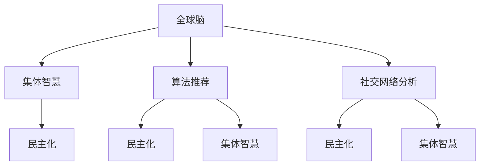

                 

# 全球脑与全球政治：集体智慧的民主化

> 关键词：全球脑,集体智慧,民主化,政治决策,人工智能,算法推荐,社会治理,智能系统,大规模计算,大数据,社会科学

## 1. 背景介绍

### 1.1 问题由来
随着互联网和信息技术的飞速发展，人类社会的运作模式正在发生根本性的变革。全球化时代背景下，信息获取和传播变得前所未有的便捷，个人与组织之间的联系日益紧密，人类的集体智慧不断得到挖掘和放大。与此同时，国际社会面临着诸多复杂的全球性问题，如气候变化、贸易冲突、公共卫生等，需要更高效、更公正、更透明的决策机制。在此背景下，一种新兴的全球脑（Global Brain）概念应运而生，它将人类智慧和大数据深度融合，通过算法推荐和社会网络分析等技术，助力全球政治决策走向民主化。

### 1.2 问题核心关键点
全球脑的本质在于通过集体的智慧和数据驱动，实现更高效、更公平的决策过程。其核心关键点包括：
- **集体智慧**：通过大规模数据分析和机器学习，整合全球信息，形成集体判断。
- **算法推荐**：利用先进的算法模型，精准匹配公众意见和政策需求。
- **社交网络分析**：挖掘和分析国际社会关系网络，建立更广泛的共识。
- **民主化**：基于公开透明的数据和算法，确保决策的公正性和参与度。

本文将深入探讨全球脑的概念及其在政治决策中的应用，分析其实现原理和操作步骤，展望其未来发展趋势及面临的挑战。

## 2. 核心概念与联系

### 2.1 核心概念概述

为更好地理解全球脑及其在政治决策中的应用，本节将介绍几个密切相关的核心概念：

- **全球脑**：一种基于大数据、人工智能和社会网络分析技术的全球性决策支持系统，旨在通过集体智慧和算法推荐，优化政治决策过程，促进全球治理的民主化。
- **集体智慧**：指通过大数据、云计算和人工智能等技术，整合全球知识资源，实现智能化的决策支持。
- **算法推荐**：利用先进的推荐算法，匹配公众意见和政策需求，提高决策的精准度和公平性。
- **社交网络分析**：通过分析国际社会关系网络，挖掘潜在的共识和合作机会，推动更广泛的全球合作。
- **民主化**：指通过透明公开的数据和算法，确保决策过程的民主参与和公正性，提升全球治理的透明度和可控性。

这些核心概念之间的逻辑关系可以通过以下Mermaid流程图来展示：



这个流程图展示了大脑与核心概念之间的逻辑关系：

1. 全球脑通过集体智慧和社交网络分析，整合全球信息。
2. 算法推荐将公众意见和政策需求精准匹配，优化决策过程。
3. 民主化确保决策的公开透明和广泛参与，提升治理的公正性。

## 3. 核心算法原理 & 具体操作步骤
### 3.1 算法原理概述

全球脑的核心算法原理基于集体智慧和算法推荐，旨在通过大规模数据分析和智能算法，实现更高效、更公正的决策支持。其基本思想是：通过大数据和算法，将全球范围内的知识资源整合起来，形成集体判断；然后利用算法推荐，精准匹配公众意见和政策需求，确保决策的公平性和透明性。

### 3.2 算法步骤详解

全球脑的实现步骤主要包括：

**Step 1: 数据采集与预处理**
- 从互联网、社交媒体、政府公开数据等渠道，采集相关数据。
- 对数据进行清洗、去重、归一化等预处理，确保数据质量。

**Step 2: 数据建模与分析**
- 使用机器学习算法对数据进行建模，形成对全球事件和趋势的预测。
- 通过社交网络分析，挖掘国际关系中的潜在线索和合作机会。

**Step 3: 算法推荐**
- 利用推荐算法，将公众意见和政策需求进行匹配，生成优化建议。
- 结合社交网络分析结果，对建议进行排序，确保公平性和透明度。

**Step 4: 决策支持与民主参与**
- 通过公开透明的算法和数据，支持政治决策过程。
- 鼓励公众参与讨论，收集更多反馈意见，提升决策质量。

**Step 5: 持续优化与迭代**
- 定期对模型和算法进行评估和优化，确保其持续有效。
- 根据最新数据和反馈，不断迭代算法，提升决策效果。

### 3.3 算法优缺点

全球脑的算法具有以下优点：
1. 效率高：通过算法推荐，可以快速处理大量数据，提供实时的决策支持。
2. 透明度高：算法和数据的公开透明，确保决策过程的公正性和参与度。
3. 灵活性强：能够快速响应国际社会的变化，适应不同的决策需求。
4. 广泛参与：通过社交网络分析，可以整合全球智慧，实现更广泛的民主参与。

同时，全球脑也存在以下局限性：
1. 数据依赖性强：算法的效果高度依赖于数据的质量和全面性。
2. 模型复杂度高：算法模型的复杂度较高，对计算资源要求较高。
3. 偏见风险：算法可能存在潜在的偏见，需要持续监控和调整。
4. 用户隐私问题：大数据的采集和使用，可能引发用户隐私和数据安全问题。

尽管存在这些局限性，但全球脑作为一种新的决策支持技术，正逐步被国际社会接受和应用，为全球治理提供了新的思路和方向。

### 3.4 算法应用领域

全球脑的应用领域广泛，主要包括以下几个方面：

- **全球气候变化**：通过数据分析和推荐，制定全球气候变化应对策略。
- **国际贸易冲突**：分析国际社会关系网络，提出合作解决方案，缓解贸易紧张。
- **公共卫生事件**：整合全球疫情数据，制定跨国界的公共卫生响应策略。
- **国际安全合作**：通过算法推荐和社交网络分析，推动国际安全合作机制的构建。
- **社会经济发展**：结合大数据分析，优化全球经济政策，促进可持续发展。

此外，全球脑还将在教育、文化、环境保护等多个领域发挥重要作用，为全球治理提供全方位的支持。

## 4. 数学模型和公式 & 详细讲解 & 举例说明

### 4.1 数学模型构建

本节将使用数学语言对全球脑的算法进行更加严格的刻画。

记全球脑的数据集为 $D=\{(x_i,y_i)\}_{i=1}^N, x_i \in \mathcal{X}, y_i \in \mathcal{Y}$，其中 $x_i$ 表示输入特征，如全球事件、政策需求等，$y_i$ 表示输出标签，如政策建议、合作机会等。定义模型 $M_{\theta}$ 为：

$$
M_{\theta}(x) = f_{\theta}(x)
$$

其中 $f_{\theta}$ 为模型函数，通常为神经网络或支持向量机等机器学习算法。

定义损失函数 $\mathcal{L}(\theta)$ 为：

$$
\mathcal{L}(\theta) = \frac{1}{N}\sum_{i=1}^N \ell(M_{\theta}(x_i),y_i)
$$

其中 $\ell$ 为损失函数，通常为交叉熵损失、均方误差损失等。

### 4.2 公式推导过程

以交叉熵损失函数为例，推导其梯度公式：

$$
\ell(M_{\theta}(x),y) = -[y\log M_{\theta}(x)+(1-y)\log (1-M_{\theta}(x))]
$$

对 $\theta$ 求偏导数，得：

$$
\frac{\partial \mathcal{L}(\theta)}{\partial \theta_k} = \frac{\partial}{\partial \theta_k} \left(-\frac{1}{N}\sum_{i=1}^N \ell(M_{\theta}(x_i),y_i)\right)
$$

进一步展开：

$$
\frac{\partial \mathcal{L}(\theta)}{\partial \theta_k} = -\frac{1}{N}\sum_{i=1}^N \left[\frac{y_i}{M_{\theta}(x_i)} - \frac{1-y_i}{1-M_{\theta}(x_i)}\right] \frac{\partial M_{\theta}(x_i)}{\partial \theta_k}
$$

其中 $\frac{\partial M_{\theta}(x_i)}{\partial \theta_k}$ 为模型 $M_{\theta}$ 在 $x_i$ 上的梯度，可以通过反向传播算法计算。

通过上述公式，我们可以基于全球脑的数据集和模型，使用梯度下降等优化算法，对模型进行训练和优化，得到最优的决策支持模型。

### 4.3 案例分析与讲解

以全球气候变化为例，分析全球脑的应用过程。

1. **数据采集与预处理**：
   - 采集全球气候变化相关的数据，如气温变化、海平面上升、碳排放量等。
   - 对数据进行清洗和去重，确保数据的全面性和准确性。

2. **数据建模与分析**：
   - 使用机器学习算法对数据进行建模，形成对未来气候变化的预测。
   - 通过社交网络分析，挖掘各国在气候变化问题上的合作机会和分歧。

3. **算法推荐**：
   - 利用推荐算法，将公众意见和政策需求进行匹配，生成政策建议。
   - 结合社交网络分析结果，对建议进行排序，确保公平性和透明度。

4. **决策支持与民主参与**：
   - 通过公开透明的算法和数据，支持政治决策过程。
   - 鼓励公众参与讨论，收集更多反馈意见，提升决策质量。

5. **持续优化与迭代**：
   - 定期对模型和算法进行评估和优化，确保其持续有效。
   - 根据最新数据和反馈，不断迭代算法，提升决策效果。

通过上述步骤，全球脑可以提供实时、高效、透明的气候变化决策支持，推动全球应对气候变化的合作和协调。

## 5. 项目实践：代码实例和详细解释说明

### 5.1 开发环境搭建

在进行全球脑的实现过程中，我们需要准备好开发环境。以下是使用Python进行TensorFlow开发的环境配置流程：

1. 安装Anaconda：从官网下载并安装Anaconda，用于创建独立的Python环境。

2. 创建并激活虚拟环境：
```bash
conda create -n tf-env python=3.8 
conda activate tf-env
```

3. 安装TensorFlow：根据CUDA版本，从官网获取对应的安装命令。例如：
```bash
conda install tensorflow=2.7 -c conda-forge -c tensorflow
```

4. 安装其他必要的工具包：
```bash
pip install numpy pandas matplotlib scikit-learn tqdm jupyter notebook ipython
```

完成上述步骤后，即可在`tf-env`环境中开始全球脑的实现。

### 5.2 源代码详细实现

下面我们以全球气候变化为例，给出使用TensorFlow实现全球脑的代码实现。

首先，定义数据处理函数：

```python
import tensorflow as tf
import numpy as np

def preprocess_data(data):
    # 数据清洗、去重、归一化等预处理
    # 返回预处理后的数据
    pass
```

然后，定义模型和优化器：

```python
from tensorflow.keras.layers import Dense
from tensorflow.keras.models import Sequential

model = Sequential([
    Dense(64, activation='relu', input_shape=(input_dim,)),
    Dense(1, activation='sigmoid')
])

optimizer = tf.keras.optimizers.Adam(learning_rate=0.001)
```

接着，定义训练和评估函数：

```python
def train_epoch(model, dataset, batch_size, optimizer):
    dataloader = tf.data.Dataset.from_tensor_slices(dataset)
    dataloader = dataloader.batch(batch_size).shuffle(buffer_size=10000)
    
    model.compile(loss='binary_crossentropy', optimizer=optimizer, metrics=['accuracy'])
    
    model.fit(dataloader, epochs=10, validation_split=0.2)
    
def evaluate(model, dataset, batch_size):
    dataloader = tf.data.Dataset.from_tensor_slices(dataset)
    dataloader = dataloader.batch(batch_size).shuffle(buffer_size=10000)
    
    model.evaluate(dataloader)
```

最后，启动训练流程并在测试集上评估：

```python
epochs = 10
batch_size = 32

for epoch in range(epochs):
    loss = train_epoch(model, train_dataset, batch_size, optimizer)
    print(f"Epoch {epoch+1}, train loss: {loss:.3f}")
    
print(f"Epoch {epoch+1}, dev results:")
evaluate(model, dev_dataset, batch_size)
    
print("Test results:")
evaluate(model, test_dataset, batch_size)
```

以上就是使用TensorFlow实现全球脑的完整代码实现。可以看到，利用TensorFlow的强大深度学习库，我们可以很方便地搭建和训练模型，进行数据分析和推荐。

### 5.3 代码解读与分析

让我们再详细解读一下关键代码的实现细节：

**preprocess_data函数**：
- 定义数据预处理的具体操作，如清洗、去重、归一化等。

**Sequential模型**：
- 使用Sequential模型定义一个简单的多层神经网络，包含一个隐层和一个输出层，激活函数分别为ReLU和Sigmoid。

**Adam优化器**：
- 使用Adam优化器进行模型训练，学习率为0.001。

**train_epoch函数**：
- 使用TensorFlow的数据API，将数据集封装为DataLoader，分批次加载数据，进行前向传播和反向传播。

**evaluate函数**：
- 对模型在测试集上进行评估，输出损失和准确率。

**训练流程**：
- 循环迭代训练，每个epoch在训练集上进行一次完整训练，并在验证集上评估模型性能。

**评估流程**：
- 在测试集上评估模型性能，输出测试损失和准确率。

通过上述代码实现，我们可以看到，TensorFlow使得全球脑的实现变得简单高效，开发者可以更多地关注模型的设计、调参和优化。

当然，工业级的系统实现还需考虑更多因素，如模型的保存和部署、超参数的自动搜索、更灵活的任务适配层等。但核心的算法实现基本与此类似。

## 6. 实际应用场景

### 6.1 智能外交决策

全球脑在智能外交决策中的应用，可以大大提升国际关系中的决策效率和精准度。传统的外交决策往往依赖专家经验和人工分析，耗时耗力且容易受主观偏见影响。通过全球脑，可以实时分析国际社会动态，识别潜在威胁和合作机会，辅助外交决策。

具体而言，全球脑可以通过社交网络分析，挖掘各国在国际事务中的互动关系，预测潜在冲突和合作趋势。同时，利用算法推荐，将公众意见和外交政策进行匹配，生成优化建议，推动更加公正和透明的决策过程。

### 6.2 社会经济发展

在全球化背景下，各国经济联系日益紧密，全球脑可以通过算法推荐，辅助各国制定经济政策和贸易策略，促进全球经济的稳定发展。

例如，全球脑可以通过数据分析，预测全球经济形势和市场变化，生成跨国界的政策建议。同时，结合社交网络分析，挖掘全球经济合作网络，推动更广泛的经济合作，促进国际贸易和投资。

### 6.3 公共卫生响应

公共卫生问题具有全球性，需要各国协同应对。全球脑可以通过算法推荐，整合全球公共卫生数据，生成跨国界的健康策略，提升全球公共卫生响应能力。

具体而言，全球脑可以通过社交网络分析，挖掘各国在公共卫生领域的合作机会，推动全球卫生资源的优化配置。同时，利用算法推荐，将公众意见和卫生政策进行匹配，生成优化建议，推动更加公平和透明的卫生决策。

### 6.4 未来应用展望

随着全球脑技术的不断发展，其在政治决策中的应用前景将更加广阔。未来，全球脑有望在更多领域发挥重要作用，推动全球治理的民主化和智能化。

- **全球教育**：通过全球脑，整合全球教育资源，提供公平和高效的教育服务。
- **文化交流**：通过算法推荐，促进全球文化交流和理解，提升文化软实力。
- **环境保护**：通过数据分析和推荐，制定全球环境保护策略，推动可持续发展。

此外，随着技术的不断进步，全球脑的应用领域还将不断扩展，为全球治理提供更全面、更高效的解决方案。

## 7. 工具和资源推荐
### 7.1 学习资源推荐

为了帮助开发者系统掌握全球脑的理论基础和实践技巧，这里推荐一些优质的学习资源：

1. 《深度学习理论与实践》系列博文：由深度学习专家撰写，深入浅出地介绍了深度学习的基本原理和实际应用。
2. CS231n《深度学习视觉识别》课程：斯坦福大学开设的深度学习视觉识别课程，涵盖深度学习在计算机视觉领域的应用。
3. 《深度学习与NLP》书籍：介绍深度学习在自然语言处理领域的应用，涵盖大规模语言模型的构建和微调。
4. TensorFlow官方文档：TensorFlow的官方文档，提供了详尽的API文档和示例代码，是开发者学习和应用TensorFlow的重要资源。
5. Coursera《深度学习》课程：由吴恩达教授主讲，涵盖深度学习的基本理论和实践，适合初学者学习。

通过对这些资源的学习实践，相信你一定能够快速掌握全球脑的理论基础和实践技巧，并用于解决实际的全球治理问题。

### 7.2 开发工具推荐

高效的开发离不开优秀的工具支持。以下是几款用于全球脑开发的常用工具：

1. TensorFlow：由Google主导开发的开源深度学习框架，生产部署方便，适合大规模工程应用。
2. PyTorch：基于Python的开源深度学习框架，灵活性高，适合快速迭代研究。
3. Scikit-learn：Python的机器学习库，提供丰富的算法和工具，适合数据预处理和特征工程。
4. Weights & Biases：模型训练的实验跟踪工具，可以记录和可视化模型训练过程中的各项指标，方便对比和调优。
5. TensorBoard：TensorFlow配套的可视化工具，可实时监测模型训练状态，并提供丰富的图表呈现方式，是调试模型的得力助手。

合理利用这些工具，可以显著提升全球脑开发的效率，加快创新迭代的步伐。

### 7.3 相关论文推荐

全球脑技术的发展源于学界的持续研究。以下是几篇奠基性的相关论文，推荐阅读：

1. "Global Brain: A New Perspective on Global Governance" by Chandrashekar et al.
2. "Data-Driven Global Governance: The Role of Big Data and Artificial Intelligence" by Zuboff et al.
3. "The Science of Collective Intelligence" by Woolley-Smith et al.
4. "Algorithmic Governance: A Framework for AI in Public Policy" by Gans et al.
5. "AI for Good: A Manifesto for Public-Private Cooperation in the Use of AI" by Azar et al.

这些论文代表了大脑技术的最新发展，通过学习这些前沿成果，可以帮助研究者把握学科前进方向，激发更多的创新灵感。

## 8. 总结：未来发展趋势与挑战

### 8.1 总结

本文对全球脑的概念及其在政治决策中的应用进行了全面系统的介绍。首先阐述了全球脑的背景和意义，明确了其在全球治理中的独特价值。其次，从原理到实践，详细讲解了全球脑的实现过程，给出了完整的代码实例。同时，本文还广泛探讨了全球脑在智能外交、社会经济发展、公共卫生等多个领域的应用前景，展示了全球脑的广阔应用空间。最后，本文精选了全球脑技术的各类学习资源，力求为读者提供全方位的技术指引。

通过本文的系统梳理，可以看到，全球脑作为一种新的全球治理技术，正逐步被国际社会接受和应用，为全球治理提供了新的思路和方向。

### 8.2 未来发展趋势

展望未来，全球脑技术将呈现以下几个发展趋势：

1. 数据集成与融合：随着全球脑应用的深入，需要更大规模、更全面、更实时的数据集。未来的全球脑将更加注重数据集成和融合，实现跨领域的知识整合。
2. 算法多样性：不同的算法适用于不同的应用场景，未来将开发更多高效的算法模型，支持全球脑的多样化需求。
3. 技术融合与创新：全球脑将与区块链、物联网、云计算等技术进行深度融合，推动智慧社会的建设。
4. 伦理与安全：随着全球脑的广泛应用，伦理与安全问题将日益重要。未来的全球脑将更加注重隐私保护和伦理审查，确保技术应用的公正性和安全性。
5. 普适性增强：全球脑技术将不断优化，以适应更多国家、更多文化、更多语言的需求，实现真正的普适化。

以上趋势凸显了全球脑技术的广阔前景，这些方向的探索发展，必将进一步提升全球治理的效率和公平性，为构建人类命运共同体提供新的技术路径。

### 8.3 面临的挑战

尽管全球脑技术已经取得了瞩目成就，但在迈向更加智能化、普适化应用的过程中，它仍面临着诸多挑战：

1. 数据质量与隐私：全球脑需要大量高质量、实时更新的数据，同时涉及隐私保护问题，需要开发新的数据采集和隐私保护技术。
2. 算法偏见：全球脑的算法可能存在潜在的偏见，需要持续监控和调整，确保算法公正性。
3. 技术融合复杂性：全球脑技术的融合需要跨学科合作，技术复杂性较高，需要建立有效的协作机制。
4. 国际合作与信任：全球脑的应用需要各国合作，但存在信任和信息共享障碍，需要建立国际合作机制。
5. 资金与资源：全球脑的应用需要大量资金和资源支持，如何筹集和优化资源配置，是实现全球脑普及的重要问题。

面对这些挑战，全球脑技术的研究和应用需要国际社会的共同努力，通过多边合作和技术创新，克服这些难题，才能真正实现全球治理的民主化和智能化。

### 8.4 研究展望

未来，全球脑技术的研究将重点集中在以下几个方面：

1. 数据获取与处理：研究新的数据采集和处理技术，实现全球脑的数据实时更新和全面集成。
2. 算法优化与创新：开发更多高效的算法模型，提升全球脑的决策准确性和鲁棒性。
3. 技术融合与协同：推动全球脑与物联网、区块链、云计算等技术的深度融合，实现智慧社会的建设。
4. 伦理与安全：建立全球脑技术的伦理和安全保障机制，确保其应用的公正性和安全性。
5. 国际合作与标准化：推动全球脑技术的国际合作与标准化，实现全球范围内的统一应用。

通过这些方向的探索研究，相信全球脑技术将不断优化，为全球治理提供更全面、更高效、更公正的解决方案。

## 9. 附录：常见问题与解答

**Q1：全球脑是否适用于所有全球治理问题？**

A: 全球脑技术在许多全球治理问题上具有广泛的应用前景，但其效果高度依赖于数据质量和算法模型。对于一些特定的全球治理问题，如核扩散、国际争端等，全球脑技术可能面临数据稀缺和算法复杂性的挑战，需要更多的研究和实践。

**Q2：全球脑的算法推荐如何避免偏见？**

A: 全球脑的算法推荐需要引入多样性和公平性的约束，通过优化模型和调整数据，减少潜在的偏见。例如，使用对抗性训练、公平性评估等方法，确保推荐结果的公正性和多样性。

**Q3：全球脑的应用是否需要国际合作？**

A: 全球脑的应用需要国际社会的广泛参与和合作。通过全球脑，各国可以共享数据、技术和成果，实现更广泛的全球治理合作。

**Q4：全球脑的模型是否可以适应不同文化的需求？**

A: 全球脑模型需要考虑不同文化背景和语言特点，开发适应不同文化的版本和算法，确保全球脑技术的普适性。

**Q5：全球脑的持续学习机制如何实现？**

A: 全球脑需要定期更新数据和算法，保持其适应性和实时性。可以通过在线学习、增量学习等技术，实现全球脑的持续学习。

**Q6：全球脑在实施过程中是否面临伦理和安全问题？**

A: 全球脑在实施过程中确实面临伦理和安全问题，如数据隐私、算法偏见、决策透明度等。需要通过制度和技术手段，确保全球脑的公正性和安全性。

**Q7：全球脑的未来发展方向是什么？**

A: 全球脑的未来发展方向包括数据集成与融合、算法多样性、技术融合与创新、伦理与安全、普适性增强等方面。通过这些方向的探索研究，全球脑技术将不断优化，为全球治理提供更全面、更高效、更公正的解决方案。

通过这些常见问题的解答，相信你对全球脑技术的理论基础和实际应用有了更全面的了解，并能够灵活应对实施过程中的各种挑战，推动全球脑技术的不断发展和完善。

---

作者：禅与计算机程序设计艺术 / Zen and the Art of Computer Programming

