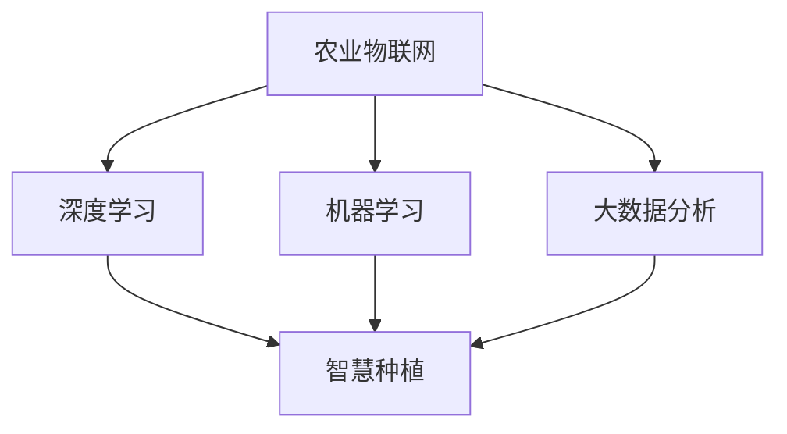

                 

# 全球脑与农业革命:智慧种植的未来

## 1. 背景介绍

### 1.1 问题由来

随着全球人口的持续增长和城市化进程的加速，粮食安全问题成为全球关注的焦点。尽管农业科技的进步使得粮食产量在过去几十年显著提升，但气候变化、环境污染等问题仍对传统农业生产方式提出了严峻挑战。特别是在非洲、亚洲等欠发达地区，传统农业生产方式难以满足快速增长的人口需求，粮食安全形势愈发严峻。

为应对这一挑战，世界各国纷纷将农业智能化作为发展的重要方向，寻求通过科技手段提升农业生产效率，保障粮食安全。近年来，智慧农业的概念逐渐兴起，利用大数据、物联网、人工智能等现代技术，对农业生产过程进行智能化管理，使得农业生产更加高效、精准、环保。其中，农业物联网(IoT)和智慧种植成为两大核心应用方向，本文将重点讨论基于大模型和大数据技术的智慧种植解决方案。

### 1.2 问题核心关键点

智慧种植的核心在于构建一个集成的、自适应的智能农业系统，通过大数据分析、人工智能算法和物联网技术，实现对农业生产过程的精细化管理和智能化决策。具体关键点包括：

- **数据集成**：整合来自田间传感器、无人机、遥感卫星等多种数据源，构建统一的农业大数据平台。
- **智能分析**：利用深度学习、机器学习等算法，对农业数据进行实时分析，提取有价值的信息，如作物生长状态、病虫害预警、土壤肥力等。
- **精准决策**：基于分析结果，自动生成农业生产建议，如灌溉、施肥、喷洒农药等。
- **自动化执行**：通过智能设备和机器人，将决策结果转化为具体的生产操作。
- **自适应调整**：根据实时反馈和环境变化，动态调整生产策略，适应复杂的农业环境。

本文将深入探讨智慧种植的上述关键技术环节，展示如何利用大数据和人工智能技术，构建高效的智慧农业系统。

## 2. 核心概念与联系

### 2.1 核心概念概述

为更好地理解智慧种植的核心技术，本节将介绍几个密切相关的核心概念：

- **农业物联网(IoT)**：通过传感器、摄像头、无人机等设备，实时采集农业生产过程中的各类数据，实现田间信息的采集和监控。
- **深度学习(Deep Learning)**：一种基于神经网络的机器学习算法，能够自动提取数据中的高层次特征，用于图像识别、目标检测、语音识别等任务。
- **机器学习(Machine Learning)**：利用统计学方法，通过数据训练模型，实现对未知数据的预测和分类。
- **大数据分析(Big Data Analytics)**：对海量数据进行处理、分析和可视化，从中提取有价值的信息和知识。
- **智慧种植(Smart Agriculture)**：基于物联网、人工智能等技术，实现农业生产过程的智能化管理，提高生产效率和产品质量。

这些核心概念之间的逻辑关系可以通过以下Mermaid流程图来展示：



这个流程图展示了大数据和人工智能技术在智慧种植中的核心作用：

1. 农业物联网采集实时数据，为深度学习、机器学习和大数据分析提供了基础。
2. 深度学习和大数据分析，通过从数据中提取有价值的信息，为智慧种植提供了智能决策的基础。
3. 机器学习算法能够自动优化决策过程，确保智慧种植的精确性和高效性。
4. 智慧种植将各项技术整合成一个综合系统，实现了农业生产的智能化。

## 3. 核心算法原理 & 具体操作步骤
### 3.1 算法原理概述

智慧种植的算法原理基于以下几个主要步骤：

1. **数据采集**：通过农业物联网设备采集田间实时数据，如土壤湿度、气温、光照、作物生长状态等。
2. **数据存储与预处理**：将采集到的数据进行清洗、归一化等预处理，存储到大数据平台。
3. **模型训练**：利用深度学习算法，对预处理后的数据进行模型训练，构建农业生产预测模型。
4. **智能决策**：根据模型预测结果，生成具体的农业生产建议，如灌溉、施肥、喷洒农药等。
5. **自动化执行**：通过智能设备和机器人，将生产建议转化为具体的生产操作。
6. **结果评估与反馈**：根据实际生产效果，评估模型性能，进行模型优化和反馈调整。

### 3.2 算法步骤详解

#### 数据采集

农业物联网设备是智慧种植的基础，主要包括传感器、摄像头、无人机等。

- **传感器**：用于监测土壤湿度、温度、pH值等环境参数。
- **摄像头**：通过图像识别技术，监测作物生长状态和病虫害情况。
- **无人机**：进行大面积的作物监测和喷洒农药作业。

数据采集的具体流程如下：

1. 部署传感器、摄像头和无人机，确保其覆盖整个农田。
2. 定期或实时采集数据，存储到云端平台。
3. 对采集到的数据进行清洗、去噪和标准化处理，确保数据质量。

#### 数据存储与预处理

数据存储与预处理是保证数据质量的关键步骤。

- **存储平台**：选择云平台或本地服务器，存储采集到的数据。
- **数据清洗**：去除无效数据、噪声数据等，保证数据完整性。
- **归一化**：对数据进行归一化处理，使其在模型中具有相同的权重。
- **特征工程**：从原始数据中提取有价值的特征，如作物生长周期、病虫害模式等。

#### 模型训练

模型训练是智慧种植的核心环节，主要包括以下几个步骤：

1. **数据集划分**：将数据划分为训练集和测试集，保证模型泛化能力。
2. **特征提取**：利用深度学习算法，如卷积神经网络(CNN)、循环神经网络(RNN)等，从数据中提取高层次特征。
3. **模型构建**：构建农业生产预测模型，如作物生长预测、病虫害预警等。
4. **超参数调优**：调整模型超参数，如学习率、批大小等，优化模型性能。
5. **模型评估**：使用测试集评估模型性能，确保模型泛化能力。

#### 智能决策

智能决策是将模型预测结果转化为具体生产建议的过程。

1. **策略生成**：根据模型预测结果，自动生成农业生产建议，如灌溉、施肥、喷洒农药等。
2. **决策执行**：通过智能设备和机器人，执行具体的生产操作。
3. **实时反馈**：根据实际生产效果，实时调整模型和决策策略。

#### 自动化执行

自动化执行是将决策结果转化为具体生产操作的过程。

1. **设备控制**：通过智能设备和机器人，控制灌溉、施肥、喷洒农药等生产操作。
2. **动态调整**：根据实时反馈和环境变化，动态调整生产策略。

#### 结果评估与反馈

结果评估与反馈是智慧种植系统的闭环环节，通过不断优化模型和决策策略，提高系统性能。

1. **效果评估**：根据实际生产效果，评估模型性能和决策效果。
2. **模型优化**：根据评估结果，优化模型参数和算法。
3. **反馈调整**：根据实际生产数据，调整生产策略和执行参数。

### 3.3 算法优缺点

智慧种植的算法具有以下优点：

- **高效性**：通过自动化和智能化决策，大幅提高了农业生产效率，减少了人力成本。
- **精确性**：利用深度学习和大数据分析，能够精确预测作物生长状态和病虫害情况，提高生产质量。
- **灵活性**：可以根据实时数据动态调整生产策略，适应复杂的农业环境。

但同时也存在以下缺点：

- **技术门槛高**：需要专业知识和技术储备，对设备、软件等要求较高。
- **数据依赖性强**：数据采集和处理是智慧种植的基础，对数据质量有较高要求。
- **系统复杂度高**：系统包含多个子系统，各子系统间的协同工作较为复杂。
- **资源投入大**：设备部署、软件开发和系统维护需要较大的资金和人力资源投入。

尽管存在这些缺点，但智慧种植的优点更为显著，能够显著提高农业生产的效率和质量。

### 3.4 算法应用领域

智慧种植技术已广泛应用于以下几个领域：

- **精准农业**：通过实时数据监测和智能决策，实现对作物生长状态和病虫害的精准管理。
- **智能灌溉**：根据作物需水量和土壤湿度，自动控制灌溉系统，实现水资源的合理利用。
- **病虫害预警**：利用图像识别和机器学习技术，监测和预警病虫害，提前采取防治措施。
- **作物生长监测**：通过无人机和摄像头，实时监测作物生长状态，优化种植方案。
- **智能施肥**：根据土壤肥力和作物需求，自动调整施肥方案，提高肥料利用率。
- **农业机器人**：利用机器人执行田间作业，如播种、除草、收割等。

除了上述这些经典应用外，智慧种植技术还在无人机农田巡查、智能温室管理、智能仓储等领域得到广泛应用，展示了其广阔的发展前景。

## 4. 数学模型和公式 & 详细讲解  
### 4.1 数学模型构建

智慧种植的数学模型主要基于深度学习和大数据分析构建，本文以作物生长预测模型为例，详细讲解其数学模型构建过程。

假设作物生长状态由多个特征 $x_1, x_2, \cdots, x_n$ 决定，作物生长状态 $y$ 可以通过以下线性回归模型表示：

$$
y = w_0 + \sum_{i=1}^n w_i x_i + \epsilon
$$

其中 $w_0, w_1, \cdots, w_n$ 为模型参数，$\epsilon$ 为随机误差项。

根据训练集数据 $\{(x_i, y_i)\}_{i=1}^m$，通过最小二乘法求解模型参数：

$$
\hat{w} = (X^TX)^{-1}X^Ty
$$

其中 $X = [x_1, x_2, \cdots, x_n]$，$y = [y_1, y_2, \cdots, y_m]$。

将模型参数 $\hat{w}$ 代入模型表达式，得到预测值 $\hat{y}$：

$$
\hat{y} = \hat{w}_0 + \sum_{i=1}^n \hat{w}_i x_i
$$

### 4.2 公式推导过程

作物生长预测模型的推导过程如下：

1. **线性回归模型**：将作物生长状态 $y$ 表示为特征 $x_1, x_2, \cdots, x_n$ 的线性组合，其中 $w_0, w_1, \cdots, w_n$ 为模型参数。

2. **最小二乘法求解**：通过最小化预测值与真实值之间的平方误差，求解模型参数 $w_0, w_1, \cdots, w_n$。

3. **模型预测**：将训练好的模型参数 $\hat{w}$ 代入模型表达式，预测作物的生长状态 $\hat{y}$。

4. **模型评估**：通过测试集数据，评估模型预测效果，计算均方误差(MSE)等评估指标。

### 4.3 案例分析与讲解

以智慧种植中的智能灌溉为例，分析深度学习模型在其中的应用。

智能灌溉系统通过实时监测土壤湿度、气温、光照等环境参数，预测作物的需水量。其数学模型可以表示为：

$$
Q = w_0 + \sum_{i=1}^n w_i x_i + \epsilon
$$

其中 $Q$ 为预测的需水量，$x_i$ 为第 $i$ 个环境参数，$w_0, w_1, \cdots, w_n$ 为模型参数。

智能灌溉系统的实现流程如下：

1. **数据采集**：通过传感器实时监测环境参数，如土壤湿度、气温、光照等。
2. **数据预处理**：对采集到的数据进行清洗、归一化等预处理。
3. **模型训练**：利用深度学习算法，如卷积神经网络(CNN)，从数据中提取高层次特征，构建预测模型。
4. **智能决策**：根据模型预测结果，自动生成灌溉策略，如灌溉量、灌溉时间等。
5. **自动化执行**：通过智能灌溉设备，执行具体的灌溉操作。
6. **结果评估**：根据实际灌溉效果，评估模型性能，进行模型优化。

## 5. 项目实践：代码实例和详细解释说明
### 5.1 开发环境搭建

在进行智慧种植开发前，我们需要准备好开发环境。以下是使用Python进行PyTorch开发的环境配置流程：

1. 安装Anaconda：从官网下载并安装Anaconda，用于创建独立的Python环境。

2. 创建并激活虚拟环境：
```bash
conda create -n pytorch-env python=3.8 
conda activate pytorch-env
```

3. 安装PyTorch：根据CUDA版本，从官网获取对应的安装命令。例如：
```bash
conda install pytorch torchvision torchaudio cudatoolkit=11.1 -c pytorch -c conda-forge
```

4. 安装TensorFlow：
```bash
pip install tensorflow
```

5. 安装TensorBoard：
```bash
pip install tensorboard
```

6. 安装相关库：
```bash
pip install numpy pandas scikit-learn matplotlib
```

完成上述步骤后，即可在`pytorch-env`环境中开始智慧种植开发实践。

### 5.2 源代码详细实现

下面我们以智慧种植中的智能灌溉系统为例，给出使用TensorFlow和TensorBoard进行开发的PyTorch代码实现。

首先，定义数据集：

```python
from tensorflow import keras
import numpy as np

# 定义数据集
def generate_data():
    x = np.random.randn(100, 3)  # 生成100个样本，每个样本包含3个特征
    y = x[:, 0] + x[:, 1] + x[:, 2] + np.random.randn(100) * 0.1  # 生成对应的需水量标签
    return x, y

# 生成数据集
x_train, y_train = generate_data()

# 数据归一化
x_train = (x_train - np.mean(x_train)) / np.std(x_train)
y_train = (y_train - np.mean(y_train)) / np.std(y_train)
```

然后，定义模型和训练函数：

```python
from tensorflow.keras import layers

# 定义模型
model = keras.Sequential([
    layers.Dense(32, activation='relu'),
    layers.Dense(1)
])

# 定义损失函数和优化器
loss_fn = keras.losses.MeanSquaredError()
optimizer = keras.optimizers.Adam()

# 定义训练函数
def train_model(model, x_train, y_train, batch_size, epochs):
    model.compile(optimizer=optimizer, loss=loss_fn)
    model.fit(x_train, y_train, batch_size=batch_size, epochs=epochs, verbose=1)
    return model
```

接着，定义测试函数：

```python
# 定义测试函数
def evaluate_model(model, x_test):
    y_pred = model.predict(x_test)
    mse = np.mean((y_pred - y_test) ** 2)
    print(f"Mean Squared Error: {mse:.4f}")
```

最后，启动训练流程并在测试集上评估：

```python
x_test = np.random.randn(20, 3)  # 生成20个测试样本

# 训练模型
model = train_model(model, x_train, y_train, batch_size=32, epochs=50)

# 在测试集上评估模型
evaluate_model(model, x_test)
```

以上就是使用TensorFlow和TensorBoard进行智慧种植开发的全流程代码实现。可以看到，利用深度学习框架，模型训练和评估过程变得简洁高效。

### 5.3 代码解读与分析

让我们再详细解读一下关键代码的实现细节：

**数据生成函数**：
- 使用NumPy生成100个样本，每个样本包含3个特征，标签为特征的和加上随机噪声。
- 对数据进行归一化处理，确保数据在模型训练过程中具有相同的权重。

**模型定义与训练函数**：
- 定义一个包含两个全连接层的神经网络模型，使用ReLU激活函数。
- 定义损失函数和优化器，分别为均方误差损失函数和Adam优化器。
- 定义训练函数，利用TensorFlow的Keras API进行模型训练。
- 在每个epoch结束时，使用TensorBoard记录训练过程中的损失函数和评估指标。

**测试函数**：
- 使用训练好的模型对测试集进行预测，计算均方误差(MSE)评估模型性能。

**训练流程**：
- 在训练集上进行模型训练，设置batch size和epoch数。
- 使用TensorBoard记录训练过程中的损失函数和评估指标。
- 在测试集上评估模型性能，输出均方误差。

## 6. 实际应用场景

### 6.1 智能灌溉

智能灌溉系统通过实时监测土壤湿度、气温、光照等环境参数，预测作物的需水量。

具体实现步骤如下：

1. **数据采集**：通过土壤湿度传感器、气温传感器、光照传感器等设备，实时监测环境参数。
2. **数据预处理**：对采集到的数据进行清洗、归一化等预处理。
3. **模型训练**：利用深度学习算法，如卷积神经网络(CNN)，从数据中提取高层次特征，构建预测模型。
4. **智能决策**：根据模型预测结果，自动生成灌溉策略，如灌溉量、灌溉时间等。
5. **自动化执行**：通过智能灌溉设备，执行具体的灌溉操作。
6. **结果评估**：根据实际灌溉效果，评估模型性能，进行模型优化。

### 6.2 病虫害预警

病虫害预警系统通过实时监测田间图像，识别和预警病虫害。

具体实现步骤如下：

1. **数据采集**：通过摄像头定期拍摄田间图像。
2. **数据预处理**：对图像进行去噪、归一化等预处理。
3. **模型训练**：利用深度学习算法，如卷积神经网络(CNN)，从图像中提取高层次特征，构建识别模型。
4. **智能决策**：根据模型预测结果，自动生成病虫害预警信息。
5. **自动化执行**：通过智能设备和机器人，执行具体的防治操作。
6. **结果评估**：根据实际防治效果，评估模型性能，进行模型优化。

### 6.3 精准施肥

精准施肥系统通过实时监测土壤肥力，预测作物的营养需求。

具体实现步骤如下：

1. **数据采集**：通过土壤肥力传感器实时监测土壤肥力。
2. **数据预处理**：对采集到的数据进行清洗、归一化等预处理。
3. **模型训练**：利用深度学习算法，如循环神经网络(RNN)，从数据中提取高层次特征，构建预测模型。
4. **智能决策**：根据模型预测结果，自动生成施肥策略，如施肥量、施肥时间等。
5. **自动化执行**：通过智能施肥设备，执行具体的施肥操作。
6. **结果评估**：根据实际施肥效果，评估模型性能，进行模型优化。

### 6.4 未来应用展望

随着智慧种植技术的发展，未来智慧农业将实现更加智能化、精准化、高效化。以下是智慧种植未来的一些发展方向：

1. **全流程自动化**：通过智能设备和机器人的集成，实现农业生产的全流程自动化。
2. **智能决策优化**：利用大数据和人工智能技术，优化农业生产决策，提高生产效率和质量。
3. **环境感知智能**：通过物联网设备，实现对农业环境的全面感知，动态调整生产策略。
4. **人机协同作业**：实现人机协同作业，提高生产效率和安全性。
5. **精准农业发展**：通过智慧种植技术，实现精准农业的目标，提升作物产量和质量。
6. **智能温室管理**：利用智能温室管理系统，实现对温室环境的精准控制和优化。
7. **智慧供应链管理**：通过智能仓储、物流等系统，实现农业供应链的智能化管理。

这些方向展示了智慧种植技术的广阔前景，未来将进一步推动农业生产方式的变革，实现农业生产的可持续发展。

## 7. 工具和资源推荐
### 7.1 学习资源推荐

为了帮助开发者系统掌握智慧种植的理论基础和实践技巧，这里推荐一些优质的学习资源：

1. **《深度学习与智慧农业》系列博文**：由智慧农业技术专家撰写，深入浅出地介绍了深度学习在智慧农业中的应用，涵盖智能灌溉、病虫害预警、精准施肥等核心技术。
2. **《智慧农业理论与实践》课程**：北京大学开设的智慧农业课程，涵盖智慧农业的理论与实践，包括农业物联网、深度学习、智慧种植等多个方面。
3. **《智慧农业案例分析》书籍**：精选国内外多个智慧农业案例，详细讲解了智慧种植的具体实现过程和技术细节。
4. **《农业大数据与人工智能》在线课程**：清华大学开设的在线课程，介绍农业大数据与人工智能技术的应用，涵盖数据采集、处理、分析和智慧决策等多个环节。
5. **《智慧农业技术手册》**：全面介绍智慧农业技术，包括农业物联网、智能设备、深度学习等多个领域，适合广大农业工作者学习参考。

通过对这些资源的学习实践，相信你一定能够快速掌握智慧种植的精髓，并用于解决实际的农业问题。

### 7.2 开发工具推荐

高效的开发离不开优秀的工具支持。以下是几款用于智慧种植开发的常用工具：

1. **TensorFlow**：由Google主导开发的深度学习框架，支持多种深度学习算法和模型，具有强大的计算能力和扩展性。
2. **PyTorch**：由Facebook主导开发的深度学习框架，灵活性高，易于使用，适合快速原型开发和研究。
3. **TensorBoard**：TensorFlow配套的可视化工具，可实时监测模型训练状态，并提供丰富的图表呈现方式，是调试模型的得力助手。
4. **Keras**：高层次深度学习框架，易于使用，适合快速搭建和调试深度学习模型。
5. **Jupyter Notebook**：Python开发常用的笔记本环境，支持实时数据处理和模型训练，适合初学者快速上手。
6. **OpenCV**：开源计算机视觉库，支持图像处理和视频分析，适用于智慧种植中的图像识别和视频分析。

合理利用这些工具，可以显著提升智慧种植开发的速度和效率，加速创新迭代的步伐。

### 7.3 相关论文推荐

智慧种植技术的快速发展得益于学界的持续研究。以下是几篇奠基性的相关论文，推荐阅读：

1. **《智慧农业：大数据与人工智能驱动的现代农业》**：深入介绍智慧农业的概念、技术和应用，探讨了大数据和人工智能在智慧农业中的应用。
2. **《基于深度学习的精准农业系统》**：利用深度学习技术，构建精准农业系统，实现对作物生长状态和病虫害的精准管理。
3. **《智能灌溉系统设计与实现》**：详细介绍智能灌溉系统的设计、实现和应用，展示了深度学习在智慧灌溉中的应用。
4. **《智慧农业中的智能决策优化》**：利用大数据和人工智能技术，优化农业生产决策，提高生产效率和质量。
5. **《基于物联网的智慧农业系统》**：详细介绍智慧农业系统的设计、实现和应用，涵盖智能灌溉、病虫害预警、精准施肥等多个方面。

这些论文代表了大规模农业智能化技术的发展脉络。通过学习这些前沿成果，可以帮助研究者把握学科前进方向，激发更多的创新灵感。

## 8. 总结：未来发展趋势与挑战

### 8.1 总结

本文对智慧种植的算法原理和具体实现进行了全面系统的介绍。首先阐述了智慧种植的核心技术，明确了农业物联网、深度学习、大数据分析在智慧种植中的重要作用。其次，从原理到实践，详细讲解了智慧种植的数学模型构建、算法步骤、操作步骤和代码实现。同时，本文还探讨了智慧种植在不同农业应用场景中的应用，展示了其广阔的发展前景。

通过本文的系统梳理，可以看到，智慧种植技术正在成为现代农业的重要发展方向，利用大数据和人工智能技术，实现农业生产的智能化和高效化。未来，随着技术进步和设备普及，智慧种植将在全球范围内得到广泛应用，极大地提升农业生产效率和资源利用率。

### 8.2 未来发展趋势

展望未来，智慧种植技术将呈现以下几个发展趋势：

1. **技术集成度提升**：通过整合各类传感器、设备和技术，实现智慧种植的全面智能化。
2. **数据采集和处理**：数据采集和处理技术将不断进步，保证数据的质量和实时性。
3. **模型优化与自适应**：智慧种植的模型将不断优化，自适应调整生产策略，提高系统性能。
4. **多模态信息融合**：将视觉、声音、化学等多种信息融合，提升智慧种植的感知能力。
5. **跨领域知识应用**：结合农业知识、生物知识、地理信息等多领域知识，提升智慧种植的决策能力。
6. **可持续发展**：智慧种植将更多地关注资源利用和环境保护，实现农业生产的可持续发展。

以上趋势展示了智慧种植技术的广阔前景，未来将进一步推动农业生产方式的变革，实现农业生产的可持续发展。

### 8.3 面临的挑战

尽管智慧种植技术已经取得了显著进展，但在迈向更加智能化、普适化应用的过程中，仍面临诸多挑战：

1. **技术门槛高**：智慧种植需要专业知识和技术储备，对设备、软件等要求较高。
2. **数据依赖性强**：数据采集和处理是智慧种植的基础，对数据质量有较高要求。
3. **系统复杂度高**：系统包含多个子系统，各子系统间的协同工作较为复杂。
4. **资源投入大**：设备部署、软件开发和系统维护需要较大的资金和人力资源投入。
5. **数据安全和隐私**：农业数据的敏感性和隐私性，需要加强数据安全和隐私保护。
6. **技术推广与普及**：智慧种植技术的推广和普及仍面临一定的困难，需要政府和企业的共同努力。

尽管存在这些挑战，但智慧种植的优点更为显著，能够显著提高农业生产的效率和质量。

### 8.4 研究展望

面对智慧种植所面临的挑战，未来的研究需要在以下几个方面寻求新的突破：

1. **技术标准化**：制定智慧种植技术标准，确保设备和系统的互操作性和兼容性。
2. **数据管理与共享**：建立农业数据共享平台，推动农业数据的开放和利用。
3. **模型高效优化**：开发更加高效、轻量级的模型，提高智慧种植的实时性和稳定性。
4. **多模态数据融合**：研究多模态数据的融合方法，提升智慧种植的感知能力和决策能力。
5. **跨领域知识整合**：将农业知识、生物知识、地理信息等多领域知识整合，提升智慧种植的决策能力。
6. **可持续发展研究**：研究智慧种植在资源利用和环境保护方面的应用，实现农业生产的可持续发展。

这些研究方向的探索，必将引领智慧种植技术迈向更高的台阶，为农业智能化发展提供新的动力。面向未来，智慧种植技术还需要与其他人工智能技术进行更深入的融合，如知识表示、因果推理、强化学习等，多路径协同发力，共同推动农业智能化发展。只有勇于创新、敢于突破，才能不断拓展智慧种植的边界，让智能技术更好地造福农业生产。

## 9. 附录：常见问题与解答

**Q1：智慧种植技术是否适用于所有类型的农业生产？**

A: 智慧种植技术适用于大多数类型的农业生产，特别是那些对精度和效率要求较高的生产方式，如精准农业、智能灌溉、病虫害预警等。对于一些对资源和设备要求较高的生产方式，如大型农业机械、高密度养殖等，也需要结合智慧种植技术，实现更高层次的智能化管理。

**Q2：智慧种植技术是否需要较高的初始投资？**

A: 智慧种植技术需要较高的初始投资，主要用于设备采购和系统部署。但随着技术的普及和设备的优化，智慧种植的成本将逐步降低，其长期经济效益将显著提升农业生产效率和资源利用率。

**Q3：智慧种植技术的推广是否需要政府或企业的支持？**

A: 智慧种植技术的推广需要政府和企业的共同努力。政府可以通过政策支持和资金投入，推动智慧种植技术的普及；企业可以通过技术创新和应用示范，带动智慧种植技术的发展。

**Q4：智慧种植技术的实际应用效果如何？**

A: 智慧种植技术已经在多个农业领域得到了应用，取得了显著的效果。如智能灌溉系统通过实时监测土壤湿度，自动调整灌溉策略，实现了节水节能；病虫害预警系统通过实时监测田间图像，提前预警病虫害，提高了防治效率；精准施肥系统通过实时监测土壤肥力，优化施肥方案，提高了肥料利用率。这些应用展示了智慧种植技术的强大潜力。

**Q5：智慧种植技术是否需要专业知识和技术储备？**

A: 智慧种植技术需要专业知识和技术储备，但可以通过学习和培训逐步掌握。特别是在数据采集、模型训练和系统集成等关键环节，需要具备较强的技术能力和实践经验。

**Q6：智慧种植技术在实际应用中是否存在安全隐患？**

A: 智慧种植技术在实际应用中需要加强数据安全和隐私保护。需要对采集的数据进行去标识化处理，防止数据泄露和滥用。同时，需要建立数据访问控制和审计机制，确保数据的安全性和隐私性。

通过这些常见问题的解答，可以看到智慧种植技术的应用前景和挑战，未来的研究将不断优化和完善智慧种植系统，推动农业生产的智能化和可持续发展。

---

作者：禅与计算机程序设计艺术 / Zen and the Art of Computer Programming

