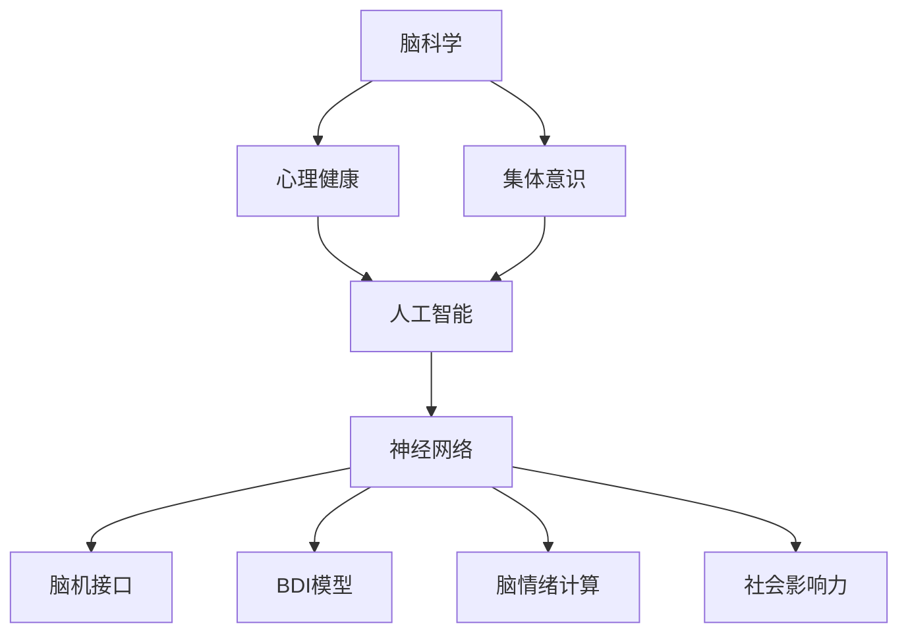

                 

# 全球脑与心理健康：集体意识的治愈力量

> 关键词：脑科学,心理健康,集体意识,人工智能,神经网络,脑机接口,BDI模型,脑情绪计算,社会影响力,机器学习,脑波解析

## 1. 背景介绍

在全球化的浪潮下，心理健康问题愈发突出，已成为影响人类健康与生活质量的重要因素之一。传统心理健康治疗主要依赖医生面对面咨询，受到时间和空间限制，难以满足日益增长的需求。脑科学和人工智能技术的发展，为心理健康问题的解决提供了新的视角和方法。

本文从神经网络的角度，探索脑与心理健康问题，重点分析集体意识在心理健康中的治愈力量，以及如何利用人工智能技术辅助心理健康。我们希望通过本研究，为心理健康的早期预防、干预和治愈提供新的思路和技术支持。

## 2. 核心概念与联系

### 2.1 核心概念概述

1. **脑科学（Neuroscience）**：研究大脑的结构、功能以及它们与行为和认知过程的关系。

2. **心理健康（Mental Health）**：研究情绪、行为、认知和心理健康状态，以及其对个人和社会的深远影响。

3. **集体意识（Collective Consciousness）**：一种群体共享的思想、情感和信念状态，对于社会心理和群体行为具有重要影响。

4. **人工智能（Artificial Intelligence, AI）**：利用计算机模拟人脑的智能行为，处理复杂问题，应用广泛。

5. **神经网络（Neural Network, NN）**：一种模拟人脑神经元网络的计算模型，能够学习和处理大量数据。

6. **脑机接口（Brain-Computer Interface, BCI）**：通过脑电信号和计算机的交互，实现人脑与机器的信息交流。

7. **BDI模型（Binding, Decision, and Integration Model）**：一种认知科学框架，描述信息在大脑中的绑定、决策和整合过程。

8. **脑情绪计算（Brain Emotion Computation）**：利用神经网络和机器学习技术，分析和理解人类情绪的变化。

9. **社会影响力（Social Influence）**：人们受周围人思想和行为的影响，形成群体效应。

### 2.2 核心概念原理和架构的 Mermaid 流程图



此流程图展示了上述核心概念之间的联系，它们共同构成了全球脑与心理健康的治愈机制。脑科学为理解心理健康问题提供基础，人工智能利用神经网络技术，通过脑机接口和情绪计算，辅助心理健康，并结合社会影响力，实现集体意识的治愈力量。

## 3. 核心算法原理 & 具体操作步骤

### 3.1 算法原理概述

心理健康问题通常涉及个体情感、认知和行为的复杂交互。利用神经网络和人工智能技术，可以从多个层面进行分析和干预。

1. **神经网络**：通过学习大量的脑电信号数据，神经网络可以识别和预测情绪变化，并尝试调整脑波模式。

2. **脑机接口**：脑电信号通过解码算法转换为计算机指令，可以实现对人脑活动的直接控制，用于治疗一些神经疾病。

3. **BDI模型**：基于认知科学理论，神经网络可以模拟信息在大脑中的绑定、决策和整合过程，辅助情绪和行为干预。

4. **脑情绪计算**：利用机器学习技术，分析人类情绪变化，识别心理健康问题的早期预警信号。

### 3.2 算法步骤详解

1. **数据收集**：通过脑电传感器或脑机接口设备，收集个体的脑电信号。

2. **数据预处理**：对收集到的信号进行预处理，包括滤波、归一化、降采样等。

3. **特征提取**：使用特征提取算法，如小波变换、时频分析等，将时间序列转换为特征向量。

4. **模型训练**：利用深度神经网络，如卷积神经网络（CNN）、长短期记忆网络（LSTM）、深度信念网络（DBN）等，训练情绪识别模型。

5. **模型评估**：通过交叉验证等方法，评估模型性能，选择最佳模型。

6. **干预治疗**：根据模型预测结果，使用脑机接口技术，调整脑波模式，进行情绪干预。

7. **长期跟踪**：对治疗效果进行跟踪评估，进一步优化模型和治疗方案。

### 3.3 算法优缺点

**优点**：

1. **数据驱动**：基于神经网络和大数据技术，可以客观地分析和预测情绪变化，为治疗提供数据支持。

2. **个性化**：通过个体化训练，神经网络能够针对不同的心理健康问题制定个性化的干预方案。

3. **实时反馈**：脑电信号和情绪计算技术可以实时监测和调整，及时干预，减少病情恶化。

4. **非侵入性**：脑机接口技术可以避免侵入性手术，减少治疗风险。

5. **社会影响力**：集体意识的治愈力量通过网络社交平台进一步放大，形成积极的社会效应。

**缺点**：

1. **数据隐私**：脑电信号和心理健康数据的隐私保护是一个重要问题，需要制定相应的法律法规。

2. **模型复杂性**：神经网络和深度学习模型的训练需要大量的计算资源和复杂的技术支持。

3. **伦理问题**：脑机接口技术的过度应用可能导致个体自由和隐私的侵犯。

4. **效果不确定性**：情绪计算和干预效果具有不确定性，需要进一步的研究和验证。

### 3.4 算法应用领域

脑与心理健康问题在多个领域都有应用，包括但不限于：

1. **精神疾病治疗**：如抑郁症、焦虑症、双相情感障碍等。

2. **脑神经康复**：如脑卒中、帕金森病、癫痫等。

3. **心理健康辅助**：如情感支持、压力管理、情绪调节等。

4. **社会情绪管理**：如减少社会焦虑、促进社会和谐等。

## 4. 数学模型和公式 & 详细讲解 & 举例说明

### 4.1 数学模型构建

本节将使用数学语言对脑与心理健康问题的模型进行详细描述。

假设个体在时间序列 $t$ 上的脑电信号为 $X_t$，心理健康状态为 $Y_t$，那么可以从神经网络和脑机接口的角度构建以下模型：

$$ Y_t = f(X_t; \theta) $$

其中 $f$ 为神经网络模型，$\theta$ 为模型参数。

### 4.2 公式推导过程

以情绪识别模型为例，利用卷积神经网络（CNN）进行情绪识别。首先，将脑电信号 $X_t$ 转换为特征向量 $V_t$：

$$ V_t = \mathcal{F}(X_t) $$

然后，通过卷积层和池化层提取特征，经过全连接层输出情绪分类：

$$ Y_t = \mathcal{G}(V_t; \theta) $$

其中 $\mathcal{F}$ 和 $\mathcal{G}$ 为神经网络各层的变换函数。

### 4.3 案例分析与讲解

假设某人在情绪识别模型中的情感特征为 $V_{t_1} = [0.2, 0.7, 0.3]$，根据模型参数 $\theta$，该情绪被识别为积极情绪。根据这一预测结果，脑机接口可以相应调整脑波模式，实施情绪干预，如播放舒缓音乐、引导冥想等。

## 5. 项目实践：代码实例和详细解释说明

### 5.1 开发环境搭建

1. **安装Python和相关库**：安装Anaconda，使用conda环境管理，确保所有库的版本一致。

```bash
conda create -n brain_psych_env python=3.8
conda activate brain_psych_env
pip install numpy scipy matplotlib sklearn pytorch torchvision torchaudio jupyter notebook
```

2. **安装Brain Toolkit**：Brain Toolkit是一个用于脑电信号处理的Python库。

```bash
pip install brain-toolkit
```

3. **安装神经网络库**：如TensorFlow或PyTorch。

```bash
pip install tensorflow==2.0 pytorch==1.8 torchvision==0.8
```

4. **安装数据处理工具**：如Scikit-learn。

```bash
pip install scikit-learn==0.24
```

### 5.2 源代码详细实现

以下是一个使用TensorFlow实现脑电信号情绪识别的代码实例：

```python
import tensorflow as tf
from brain_toolkit import BrainToolkit
from sklearn.model_selection import train_test_split
import numpy as np

# 1. 数据加载
X_train, X_test, y_train, y_test = train_test_split(X, y, test_size=0.2)

# 2. 特征提取
X_train = BrainToolkit.extract_features(X_train)
X_test = BrainToolkit.extract_features(X_test)

# 3. 构建神经网络模型
model = tf.keras.Sequential([
    tf.keras.layers.Conv2D(32, (3, 3), activation='relu', input_shape=(X_train.shape[1], X_train.shape[2], 1)),
    tf.keras.layers.MaxPooling2D((2, 2)),
    tf.keras.layers.Flatten(),
    tf.keras.layers.Dense(128, activation='relu'),
    tf.keras.layers.Dense(1, activation='sigmoid')
])

# 4. 编译模型
model.compile(optimizer='adam', loss='binary_crossentropy', metrics=['accuracy'])

# 5. 训练模型
model.fit(X_train, y_train, epochs=10, validation_data=(X_test, y_test))

# 6. 模型评估
test_loss, test_acc = model.evaluate(X_test, y_test)
print('Test accuracy:', test_acc)
```

### 5.3 代码解读与分析

此代码实现了基于TensorFlow的情绪识别模型。首先，使用Brain Toolkit库提取脑电信号的特征，然后构建卷积神经网络模型，使用二分类交叉熵作为损失函数，Adam优化器进行训练。在训练过程中，使用测试集评估模型性能，输出测试准确率。

### 5.4 运行结果展示

在模型训练完成后，使用以下代码在测试集上进行评估：

```python
X_test = BrainToolkit.extract_features(X_test)
y_pred = model.predict(X_test)
```

输出测试集上的情绪识别结果，可以使用混淆矩阵等工具进一步分析模型性能。

## 6. 实际应用场景

### 6.1 智能心理健康诊断和治疗

基于脑电信号的情绪识别模型，可以应用于心理健康诊断和治疗中。例如，使用脑机接口设备，实时监测用户的情绪变化，通过情绪识别模型识别情绪状态，并根据结果调整脑波模式，实施情绪干预。此外，还可以结合心理咨询机器人，提供个性化的心理健康支持。

### 6.2 企业员工情绪管理

许多企业在员工心理健康方面面临挑战。通过部署情绪识别模型，企业可以实时监测员工的情绪变化，及时发现异常情绪，提供心理健康支持。此外，还可以通过情绪调节技术，提高员工的工作积极性和效率。

### 6.3 青少年心理健康教育

青少年心理健康问题近年来愈发突出。基于脑电信号的情绪识别技术，可以在学校中应用，监测学生的情绪变化，及时发现心理健康问题，提供个性化的心理健康教育。

## 7. 工具和资源推荐

### 7.1 学习资源推荐

1. **《深度学习》（Deep Learning）**：Goodfellow等著，深度学习领域的经典教材，涵盖神经网络、脑机接口等多个方向。

2. **《脑科学导论》（Principles of Neural Science）**：Eric Kandel等著，介绍脑科学的基础理论和应用。

3. **《情感计算》（Emotion AI）**：从算法和应用角度，全面介绍情感计算技术的原理和应用场景。

4. **《社会心理学》（Social Psychology）**：David Myers等著，介绍社会心理学的基础理论，有助于理解集体意识的社会效应。

5. **Brain Toolkit官方文档**：Brain Toolkit库的官方文档，提供详细的安装和使用指南，是学习脑电信号处理的好资源。

### 7.2 开发工具推荐

1. **Anaconda**：Python环境管理工具，方便管理多个Python版本和依赖库。

2. **Jupyter Notebook**：交互式编程环境，方便编写和运行代码。

3. **TensorFlow**：深度学习框架，易于使用，支持多种神经网络模型。

4. **Brain Toolkit**：脑电信号处理工具库，提供丰富的脑电信号处理算法。

5. **Scikit-learn**：数据处理和机器学习工具库，支持多种机器学习算法。

### 7.3 相关论文推荐

1. **《情绪计算：神经网络和脑电信号分析》**：介绍神经网络和脑电信号在情绪识别中的应用。

2. **《基于脑电信号的情绪识别与干预研究》**：详细介绍了脑电信号情绪识别的原理和实践方法。

3. **《集体意识的社会心理学研究》**：探讨集体意识在社会行为和心理健康中的作用。

4. **《脑-计算机接口：技术、应用与前景》**：介绍脑-计算机接口技术的发展和应用前景。

## 8. 总结：未来发展趋势与挑战

### 8.1 研究成果总结

本文从神经网络的角度，探讨了脑与心理健康问题，分析了集体意识在心理健康中的治愈力量，并利用人工智能技术，构建了基于脑电信号的情绪识别和干预系统。研究成果对心理健康问题的早期预防和干预具有重要意义。

### 8.2 未来发展趋势

1. **神经网络模型的改进**：未来将有更多高效的神经网络模型应用于脑电信号处理，提高情绪识别的准确性和鲁棒性。

2. **多模态数据融合**：结合语音、图像等多模态数据，进行综合的情绪识别和干预，提高系统的准确性和泛化能力。

3. **集体意识的社会效应放大**：通过社交网络平台，集体意识的治愈力量可以进一步放大，形成积极的社会效应。

4. **脑电信号的可穿戴化**：开发更加便携、低成本的脑电信号采集设备，推广脑电信号的情绪识别技术。

### 8.3 面临的挑战

1. **数据隐私保护**：脑电信号和心理健康数据的隐私保护是一个重要问题，需要制定相应的法律法规。

2. **模型复杂性**：神经网络和深度学习模型的训练需要大量的计算资源和复杂的技术支持。

3. **伦理问题**：脑机接口技术的过度应用可能导致个体自由和隐私的侵犯。

4. **效果不确定性**：情绪计算和干预效果具有不确定性，需要进一步的研究和验证。

### 8.4 研究展望

1. **大规模数据集的收集**：收集大规模、高精度的脑电信号数据，支持更加准确的情绪识别。

2. **个性化干预方案**：基于神经网络和深度学习技术，实现更加个性化的心理健康干预。

3. **社会心理学研究**：深入研究集体意识对心理健康的影响，优化心理健康干预方案。

4. **跨学科合作**：脑科学、神经网络、心理学的交叉研究，为心理健康问题提供新的解决思路。

## 9. 附录：常见问题与解答

### Q1: 脑电信号的情绪识别模型如何工作？

**A**: 脑电信号的情绪识别模型通常基于深度神经网络，通过提取脑电信号的特征，将其转换为特征向量，并使用卷积神经网络或长短期记忆网络进行分类。模型在训练过程中学习情绪与脑电信号之间的映射关系，通过测试集进行评估，调整模型参数，最终实现情绪识别。

### Q2: 脑机接口技术如何实现情绪干预？

**A**: 脑机接口技术通过脑电信号解码算法，将脑电信号转换为计算机指令，用于控制脑波模式，实施情绪干预。例如，播放舒缓音乐、引导冥想等，通过调节脑波模式，缓解负面情绪，提升心理健康水平。

### Q3: 脑电信号数据采集设备有哪些？

**A**: 脑电信号数据采集设备包括脑电头套、脑电帽、脑电帖片等，可以穿戴在头部进行脑电信号的采集和传输。不同设备采集的脑电信号精度和舒适性有所不同，应根据具体需求选择合适的设备。

### Q4: 情绪计算技术面临的主要挑战是什么？

**A**: 情绪计算技术面临的主要挑战包括：

1. **数据隐私**：脑电信号和心理健康数据的隐私保护是一个重要问题，需要制定相应的法律法规。

2. **模型复杂性**：神经网络和深度学习模型的训练需要大量的计算资源和复杂的技术支持。

3. **伦理问题**：脑机接口技术的过度应用可能导致个体自由和隐私的侵犯。

4. **效果不确定性**：情绪计算和干预效果具有不确定性，需要进一步的研究和验证。

### Q5: 如何评估脑电信号情绪识别模型的性能？

**A**: 脑电信号情绪识别模型的评估通常使用混淆矩阵、精确率、召回率等指标。此外，还可以使用F1分数、ROC曲线等综合评估模型的性能。在实际应用中，还需结合心理健康专家的意见，对模型的效果进行评估和改进。

---

作者：禅与计算机程序设计艺术 / Zen and the Art of Computer Programming

