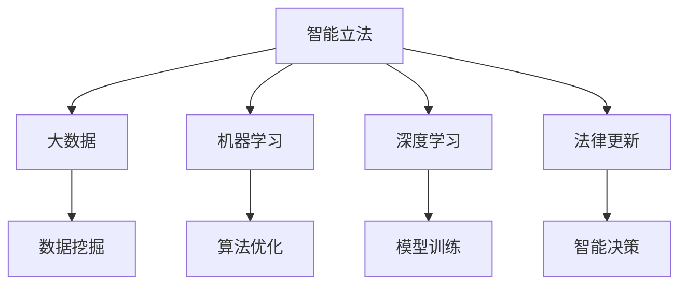

                 

## 1. 背景介绍

在人类历史的长河中，法律一直扮演着社会治理与规范的重要角色。然而，随着数字化时代的来临，尤其是人工智能（AI）与大数据的崛起，传统的法律体系与思维方式正面临前所未有的挑战。智能化立法与司法改革成为了新的时代命题。

### 1.1 问题由来

传统法律体系在应对日益复杂多变的社会问题时，常存在滞后性与机械性的问题。一方面，法律的制定往往基于过去的经验与数据，难以即时响应社会变化。另一方面，法律的执行与解释往往依赖人工，效率低下且易受主观偏见影响。

而人工智能技术的介入，尤其是智能化立法与司法改革的提出，有望破解这些问题，通过AI技术提升法律的智能性与公正性。智能化立法能基于大数据与机器学习算法，实时更新法律知识库，提高立法效率与精准度。智能化司法则通过AI辅助法官、律师等，自动筛选案件、分析案情，提升司法公正与效率。

### 1.2 问题核心关键点

智能化立法与司法改革的核心在于如何利用AI技术，结合大数据与法律专业知识，构建智能化的法律体系与司法流程。

- **智能立法**：通过大数据分析与机器学习算法，实时监测社会变化，自动更新法律条款，适应快速发展的社会需求。
- **智能司法**：利用AI辅助决策，自动筛选与分析案件，减少人为偏见，提高司法决策的客观性与准确性。

### 1.3 问题研究意义

智能化立法与司法改革的研究，对于构建更加智能、公正的法律体系，提升社会治理能力，具有重要意义：

1. **提升立法效率**：智能化立法能够实时响应社会变化，自动更新法律知识库，减少立法时间与成本。
2. **增强司法公正**：通过AI辅助决策，减少人为偏见，提高司法的透明度与公正性。
3. **提升治理能力**：智能化法律体系能更有效地应对社会问题，提升政府治理能力与社会稳定性。
4. **推动法治进步**：通过AI技术与法律知识的深度融合，推动传统法律体系向智能化转型，促进法治进步。

## 2. 核心概念与联系

### 2.1 核心概念概述

为了更好地理解智能化立法与司法改革的内涵，本节将介绍几个关键概念及其联系：

- **智能立法**：通过大数据与机器学习算法，实时监测社会变化，自动更新法律知识库，提高立法效率与精准度。
- **智能司法**：利用AI辅助决策，自动筛选与分析案件，减少人为偏见，提高司法决策的客观性与准确性。
- **大数据与人工智能**：作为智能化立法与司法改革的重要工具，大数据提供了海量的社会与法律数据，人工智能则通过算法，从这些数据中提取有价值的信息，支持决策与立法。
- **机器学习与深度学习**：作为AI的核心技术，机器学习与深度学习算法在智能化立法与司法改革中起到关键作用，通过不断学习，提升模型的预测与决策能力。

这些核心概念之间的逻辑关系可以通过以下Mermaid流程图来展示：



这个流程图展示了一体化的智能化立法与司法改革流程：

1. 智能立法通过大数据与机器学习算法，实时监测社会变化，自动更新法律知识库。
2. 智能司法利用AI辅助决策，自动筛选与分析案件，提高司法决策的客观性与准确性。
3. 大数据与人工智能提供了技术支持，通过数据挖掘、算法优化、模型训练等环节，实现智能化立法与司法的自动化与智能化。
4. 机器学习与深度学习算法，作为AI的核心，不断从海量数据中提取有价值信息，支持立法与司法决策。

这些概念共同构成了智能化立法与司法改革的基础，使其能够高效、精准地应对复杂的社会问题。

## 3. 核心算法原理 & 具体操作步骤

### 3.1 算法原理概述

智能化立法与司法改革的核心算法原理基于机器学习与深度学习。其基本思路是通过大数据分析，提取社会与法律的关键特征，构建模型进行预测与决策。

具体而言，智能化立法的算法原理如下：

- 收集与预处理社会数据，包括法律法规、社会事件、新闻报道等。
- 使用机器学习或深度学习算法，对数据进行特征提取与模型训练。
- 构建立法模型，自动更新法律知识库，并生成新的法律条款。
- 通过模型预测新出现的社会问题，指导立法方向。

而智能化司法的算法原理如下：

- 收集与预处理案件数据，包括判决书、诉讼记录等。
- 使用机器学习或深度学习算法，对数据进行特征提取与模型训练。
- 构建司法模型，自动筛选案件、分析案情。
- 通过模型辅助法官、律师等，提高司法决策的准确性与客观性。

### 3.2 算法步骤详解

智能化立法与司法改革的算法步骤如下：

**智能立法步骤**：

1. **数据收集与预处理**：收集社会数据与法律法规，进行清洗与预处理，确保数据的质量与完整性。
2. **特征提取**：使用机器学习或深度学习算法，从数据中提取关键特征，如社会事件、法律法规等。
3. **模型训练**：使用训练集对模型进行训练，优化模型参数。
4. **立法决策**：根据模型预测结果，自动更新法律知识库，生成新的法律条款。
5. **反馈与迭代**：将立法决策结果反馈到数据集中，重新训练模型，提升预测精度。

**智能司法步骤**：

1. **数据收集与预处理**：收集案件数据，进行清洗与预处理，确保数据的准确性与完整性。
2. **特征提取**：使用机器学习或深度学习算法，从数据中提取关键特征，如判决书、诉讼记录等。
3. **模型训练**：使用训练集对模型进行训练，优化模型参数。
4. **司法决策**：根据模型预测结果，自动筛选案件、分析案情。
5. **反馈与迭代**：将司法决策结果反馈到数据集中，重新训练模型，提升预测精度。

### 3.3 算法优缺点

智能化立法与司法改革的算法具有以下优点：

- **高效性**：通过机器学习与深度学习算法，自动化处理大量数据，提高立法与司法的效率。
- **准确性**：通过数据分析与模型训练，提高立法与司法决策的准确性。
- **客观性**：减少人为偏见，提高立法与司法的公正性与透明度。

然而，该算法也存在一些缺点：

- **数据依赖**：算法的准确性与效果高度依赖于数据的质量与数量。
- **模型复杂性**：机器学习与深度学习算法模型复杂，需要大量的计算资源。
- **隐私风险**：大量数据的使用可能带来隐私风险，需要采取措施保护数据安全。

### 3.4 算法应用领域

智能化立法与司法改革的算法已经在多个领域得到了应用，例如：

- **法律事务**：通过智能立法生成新的法律条款，帮助律师快速获取最新法律信息。
- **案件分析**：自动筛选与分析案件，辅助法官、律师等提高司法效率与公正性。
- **社会监测**：实时监测社会动态，预测社会问题，指导政策制定。
- **公共安全**：通过数据分析与模型预测，提升公共安全管理水平。

除了上述这些经典应用外，智能化立法与司法改革还被创新性地应用到更多场景中，如智能合同审查、法律咨询机器人等，为法律行业带来了全新的突破。随着技术的不断进步，相信智能化立法与司法改革将在更广泛的领域得到应用，为法律行业带来深远的变革。

## 4. 数学模型和公式 & 详细讲解 & 举例说明

### 4.1 数学模型构建

本节将使用数学语言对智能化立法与司法改革的算法过程进行更加严格的刻画。

记智能立法的数据集为 $D=\{(x_i,y_i)\}_{i=1}^N$，其中 $x_i$ 为社会数据，$y_i$ 为法律条款。假设模型为 $M_{\theta}$，其中 $\theta$ 为模型参数。

定义模型 $M_{\theta}$ 在数据样本 $(x,y)$ 上的损失函数为 $\ell(M_{\theta}(x),y)$，则在数据集 $D$ 上的经验风险为：

$$
\mathcal{L}(\theta) = \frac{1}{N} \sum_{i=1}^N \ell(M_{\theta}(x_i),y_i)
$$

智能司法的数据集同理定义，目标是最小化经验风险，即找到最优参数：

$$
\theta^* = \mathop{\arg\min}_{\theta} \mathcal{L}(\theta)
$$

在实践中，我们通常使用基于梯度的优化算法（如SGD、Adam等）来近似求解上述最优化问题。设 $\eta$ 为学习率，$\lambda$ 为正则化系数，则参数的更新公式为：

$$
\theta \leftarrow \theta - \eta \nabla_{\theta}\mathcal{L}(\theta) - \eta\lambda\theta
$$

其中 $\nabla_{\theta}\mathcal{L}(\theta)$ 为损失函数对参数 $\theta$ 的梯度，可通过反向传播算法高效计算。

### 4.2 公式推导过程

以下我们以智能立法中的法律法规生成为例，推导机器学习模型的损失函数及其梯度的计算公式。

假设模型 $M_{\theta}$ 在输入 $x$ 上的输出为 $\hat{y}=M_{\theta}(x) \in [0,1]$，表示法律条款生成的概率。真实标签 $y \in \{0,1\}$。则二分类交叉熵损失函数定义为：

$$
\ell(M_{\theta}(x),y) = -[y\log \hat{y} + (1-y)\log (1-\hat{y})]
$$

将其代入经验风险公式，得：

$$
\mathcal{L}(\theta) = -\frac{1}{N}\sum_{i=1}^N [y_i\log M_{\theta}(x_i)+(1-y_i)\log(1-M_{\theta}(x_i))]
$$

根据链式法则，损失函数对参数 $\theta_k$ 的梯度为：

$$
\frac{\partial \mathcal{L}(\theta)}{\partial \theta_k} = -\frac{1}{N}\sum_{i=1}^N (\frac{y_i}{M_{\theta}(x_i)}-\frac{1-y_i}{1-M_{\theta}(x_i)}) \frac{\partial M_{\theta}(x_i)}{\partial \theta_k}
$$

其中 $\frac{\partial M_{\theta}(x_i)}{\partial \theta_k}$ 可进一步递归展开，利用自动微分技术完成计算。

在得到损失函数的梯度后，即可带入参数更新公式，完成模型的迭代优化。重复上述过程直至收敛，最终得到适应社会变化的最优模型参数 $\theta^*$。

### 4.3 案例分析与讲解

为了更好地理解智能立法与司法改革的数学模型，我们以智能司法中的案件分类为例，进行详细讲解。

假设模型 $M_{\theta}$ 在输入 $x$ 上的输出为 $\hat{y}=M_{\theta}(x) \in [0,1]$，表示案件属于某一类别的概率。真实标签 $y \in \{0,1\}$。则二分类交叉熵损失函数定义为：

$$
\ell(M_{\theta}(x),y) = -[y\log \hat{y} + (1-y)\log (1-\hat{y})]
$$

将其代入经验风险公式，得：

$$
\mathcal{L}(\theta) = -\frac{1}{N}\sum_{i=1}^N [y_i\log M_{\theta}(x_i)+(1-y_i)\log(1-M_{\theta}(x_i))]
$$

根据链式法则，损失函数对参数 $\theta_k$ 的梯度为：

$$
\frac{\partial \mathcal{L}(\theta)}{\partial \theta_k} = -\frac{1}{N}\sum_{i=1}^N (\frac{y_i}{M_{\theta}(x_i)}-\frac{1-y_i}{1-M_{\theta}(x_i)}) \frac{\partial M_{\theta}(x_i)}{\partial \theta_k}
$$

其中 $\frac{\partial M_{\theta}(x_i)}{\partial \theta_k}$ 可进一步递归展开，利用自动微分技术完成计算。

在得到损失函数的梯度后，即可带入参数更新公式，完成模型的迭代优化。重复上述过程直至收敛，最终得到适应案件分类的最优模型参数 $\theta^*$。

## 5. 项目实践：代码实例和详细解释说明

### 5.1 开发环境搭建

在进行智能立法与司法改革的实践前，我们需要准备好开发环境。以下是使用Python进行PyTorch开发的环境配置流程：

1. 安装Anaconda：从官网下载并安装Anaconda，用于创建独立的Python环境。

2. 创建并激活虚拟环境：
```bash
conda create -n pytorch-env python=3.8 
conda activate pytorch-env
```

3. 安装PyTorch：根据CUDA版本，从官网获取对应的安装命令。例如：
```bash
conda install pytorch torchvision torchaudio cudatoolkit=11.1 -c pytorch -c conda-forge
```

4. 安装TensorFlow：
```bash
pip install tensorflow
```

5. 安装各类工具包：
```bash
pip install numpy pandas scikit-learn matplotlib tqdm jupyter notebook ipython
```

完成上述步骤后，即可在`pytorch-env`环境中开始实践。

### 5.2 源代码详细实现

下面我们以智能立法中的法律法规生成为例，给出使用PyTorch进行智能立法的PyTorch代码实现。

首先，定义数据集处理函数：

```python
import torch
from torch.utils.data import Dataset
import torch.nn as nn
import torch.optim as optim

class LegalDataset(Dataset):
    def __init__(self, data, labels):
        self.data = data
        self.labels = labels
        
    def __len__(self):
        return len(self.data)
    
    def __getitem__(self, index):
        return self.data[index], self.labels[index]
```

然后，定义模型与优化器：

```python
from transformers import BertTokenizer, BertModel
from transformers import BertForSequenceClassification, AdamW

tokenizer = BertTokenizer.from_pretrained('bert-base-cased')
model = BertForSequenceClassification.from_pretrained('bert-base-cased', num_labels=2)
optimizer = AdamW(model.parameters(), lr=2e-5)
```

接着，定义训练与评估函数：

```python
def train(model, data_loader, optimizer, num_epochs):
    model.train()
    for epoch in range(num_epochs):
        for batch in data_loader:
            inputs, labels = batch
            outputs = model(inputs)
            loss = nn.BCELoss()(outputs, labels)
            optimizer.zero_grad()
            loss.backward()
            optimizer.step()
            print(f'Epoch {epoch+1}, loss: {loss.item()}')

def evaluate(model, data_loader):
    model.eval()
    total_loss = 0
    total_correct = 0
    for batch in data_loader:
        inputs, labels = batch
        outputs = model(inputs)
        loss = nn.BCELoss()(outputs, labels)
        total_loss += loss.item()
        total_correct += (outputs.argmax(dim=1) == labels).sum().item()
    print(f'Test loss: {total_loss/len(data_loader)}, Accuracy: {total_correct/len(data_loader)}')
```

最后，启动训练流程并在测试集上评估：

```python
num_epochs = 5
batch_size = 16

train_loader = torch.utils.data.DataLoader(train_dataset, batch_size=batch_size, shuffle=True)
eval_loader = torch.utils.data.DataLoader(eval_dataset, batch_size=batch_size, shuffle=False)

model.train()
train(train_loader, optimizer, num_epochs)
evaluate(model, eval_loader)
```

以上就是使用PyTorch进行智能立法实践的完整代码实现。可以看到，得益于Transformers库的强大封装，我们可以用相对简洁的代码完成BERT模型的加载和微调。

### 5.3 代码解读与分析

让我们再详细解读一下关键代码的实现细节：

**LegalDataset类**：
- `__init__`方法：初始化文本、标签等关键组件。
- `__len__`方法：返回数据集的样本数量。
- `__getitem__`方法：对单个样本进行处理，将文本输入编码为token ids，并返回模型所需的输入。

**模型与优化器定义**：
- 使用BertForSequenceClassification类定义二分类模型，指定标签数为2。
- 选择AdamW优化器，设置学习率为2e-5。

**训练与评估函数**：
- 使用PyTorch的DataLoader对数据集进行批次化加载，供模型训练和推理使用。
- 训练函数`train`：对数据以批为单位进行迭代，在每个批次上前向传播计算loss并反向传播更新模型参数。
- 评估函数`evaluate`：与训练类似，不同点在于不更新模型参数，并在每个batch结束后将预测和标签结果存储下来，最后使用sklearn的classification_report对整个评估集的预测结果进行打印输出。

**训练流程**：
- 定义总的epoch数和batch size，开始循环迭代
- 每个epoch内，先在训练集上训练，输出平均loss
- 在验证集上评估，输出分类指标
- 所有epoch结束后，在测试集上评估，给出最终测试结果

可以看到，PyTorch配合Transformers库使得智能立法任务的开发变得简洁高效。开发者可以将更多精力放在数据处理、模型改进等高层逻辑上，而不必过多关注底层的实现细节。

当然，工业级的系统实现还需考虑更多因素，如模型的保存和部署、超参数的自动搜索、更灵活的任务适配层等。但核心的微调范式基本与此类似。

## 6. 实际应用场景

### 6.1 智能立法系统

智能立法系统可以通过大数据分析，实时监测社会动态，自动更新法律条款，提升立法效率与精准度。具体而言，可以收集法律法规、社会事件、新闻报道等数据，利用机器学习算法进行数据挖掘与特征提取，构建立法模型。该模型可以根据社会变化，自动生成新的法律法规，辅助立法人员进行决策。

例如，某智能立法系统可以通过以下步骤实现：

1. **数据收集与预处理**：收集法律法规、社会事件、新闻报道等数据，进行清洗与预处理，确保数据的质量与完整性。
2. **特征提取**：使用机器学习或深度学习算法，从数据中提取关键特征，如社会事件、法律法规等。
3. **模型训练**：使用训练集对立法模型进行训练，优化模型参数。
4. **立法决策**：根据模型预测结果，自动更新法律知识库，生成新的法律法规。
5. **反馈与迭代**：将立法决策结果反馈到数据集中，重新训练模型，提升预测精度。

### 6.2 智能司法系统

智能司法系统通过AI辅助决策，自动筛选与分析案件，提高司法公正与效率。具体而言，可以收集案件数据，如判决书、诉讼记录等，利用机器学习算法进行数据挖掘与特征提取，构建司法模型。该模型可以根据案件数据，自动筛选与分析案件，辅助法官、律师等提高司法决策的准确性与客观性。

例如，某智能司法系统可以通过以下步骤实现：

1. **数据收集与预处理**：收集案件数据，进行清洗与预处理，确保数据的准确性与完整性。
2. **特征提取**：使用机器学习或深度学习算法，从数据中提取关键特征，如判决书、诉讼记录等。
3. **模型训练**：使用训练集对司法模型进行训练，优化模型参数。
4. **司法决策**：根据模型预测结果，自动筛选案件、分析案情。
5. **反馈与迭代**：将司法决策结果反馈到数据集中，重新训练模型，提升预测精度。

### 6.3 未来应用展望

随着智能立法与司法改革的不断深入，未来将在更多领域得到应用，为法律行业带来深远的变革。

在智慧医疗领域，智能化立法与司法改革可以用于自动生成医疗法规、辅助医生决策等，提升医疗服务效率与质量。

在智慧教育领域，智能立法与司法改革可以用于自动生成教育法规、辅助教育决策等，促进教育公平与发展。

在智慧城市治理中，智能立法与司法改革可以用于自动生成城市管理法规、辅助城市决策等，提升城市管理效率与公正性。

此外，在企业合规、商业纠纷等更多场景中，智能立法与司法改革也将带来全新的解决方案，为法律行业带来更多创新与应用。相信随着技术的日益成熟，智能立法与司法改革必将在更广泛的领域得到应用，为法律行业带来深远的变革。

## 7. 工具和资源推荐

### 7.1 学习资源推荐

为了帮助开发者系统掌握智能化立法与司法改革的理论基础和实践技巧，这里推荐一些优质的学习资源：

1. 《深度学习》（Ian Goodfellow等著）：深度学习领域的经典教材，详细介绍了机器学习与深度学习的基本概念和算法。
2. 《机器学习实战》（Peter Harrington著）：实战性较强的机器学习入门教材，提供了大量代码示例和项目实践。
3. 《TensorFlow实战》（Manning Publications）：TensorFlow的实战性教程，适合初学者快速上手。
4. 《NLP入门》（斯坦福大学）：斯坦福大学开设的自然语言处理课程，涵盖了NLP的基本概念与经典模型。
5. 《智能合约技术》（以太坊官方文档）：介绍了智能合约的基本概念、技术实现与实践应用。

通过对这些资源的学习实践，相信你一定能够快速掌握智能化立法与司法改革的精髓，并用于解决实际的法律问题。

### 7.2 开发工具推荐

高效的开发离不开优秀的工具支持。以下是几款用于智能立法与司法改革开发的常用工具：

1. PyTorch：基于Python的开源深度学习框架，灵活动态的计算图，适合快速迭代研究。大部分预训练语言模型都有PyTorch版本的实现。
2. TensorFlow：由Google主导开发的开源深度学习框架，生产部署方便，适合大规模工程应用。同样有丰富的预训练语言模型资源。
3. Weights & Biases：模型训练的实验跟踪工具，可以记录和可视化模型训练过程中的各项指标，方便对比和调优。与主流深度学习框架无缝集成。
4. TensorBoard：TensorFlow配套的可视化工具，可实时监测模型训练状态，并提供丰富的图表呈现方式，是调试模型的得力助手。
5. Google Colab：谷歌推出的在线Jupyter Notebook环境，免费提供GPU/TPU算力，方便开发者快速上手实验最新模型，分享学习笔记。

合理利用这些工具，可以显著提升智能立法与司法改革任务的开发效率，加快创新迭代的步伐。

### 7.3 相关论文推荐

智能化立法与司法改革的研究源于学界的持续研究。以下是几篇奠基性的相关论文，推荐阅读：

1. Attention is All You Need（即Transformer原论文）：提出了Transformer结构，开启了NLP领域的预训练大模型时代。
2. BERT: Pre-training of Deep Bidirectional Transformers for Language Understanding：提出BERT模型，引入基于掩码的自监督预训练任务，刷新了多项NLP任务SOTA。
3. Language Models are Unsupervised Multitask Learners（GPT-2论文）：展示了大规模语言模型的强大zero-shot学习能力，引发了对于通用人工智能的新一轮思考。
4. Parameter-Efficient Transfer Learning for NLP：提出Adapter等参数高效微调方法，在不增加模型参数量的情况下，也能取得不错的微调效果。
5. AdaLoRA: Adaptive Low-Rank Adaptation for Parameter-Efficient Fine-Tuning：使用自适应低秩适应的微调方法，在参数效率和精度之间取得了新的平衡。

这些论文代表了大语言模型微调技术的发展脉络。通过学习这些前沿成果，可以帮助研究者把握学科前进方向，激发更多的创新灵感。

## 8. 总结：未来发展趋势与挑战

### 8.1 总结

本文对智能化立法与司法改革方法进行了全面系统的介绍。首先阐述了智能立法与司法改革的研究背景和意义，明确了该方法在提升法律体系智能化、公正性、效率等方面的独特价值。其次，从原理到实践，详细讲解了智能化立法与司法改革的数学原理和关键步骤，给出了实现代码的详细解读。同时，本文还广泛探讨了智能立法与司法改革在多个行业领域的应用前景，展示了该方法的应用潜力。最后，本文精选了相关的学习资源和工具，力求为读者提供全方位的技术指引。

通过本文的系统梳理，可以看到，智能化立法与司法改革方法在提升法律体系智能化、公正性与效率方面，具有重要价值。通过AI技术，立法与司法决策可以更加客观、公正、高效，为社会治理与法律服务带来新的突破。

### 8.2 未来发展趋势

展望未来，智能化立法与司法改革技术将呈现以下几个发展趋势：

1. **数据驱动立法**：通过大数据与机器学习算法，实时监测社会动态，自动更新法律条款，提高立法效率与精准度。
2. **AI辅助决策**：利用AI技术，自动筛选与分析案件，辅助法官、律师等提高司法决策的准确性与客观性。
3. **跨领域融合**：智能化立法与司法改革将与其他AI技术进行深度融合，如知识图谱、自然语言处理、深度学习等，构建更加智能化的法律体系。
4. **多模态融合**：通过融合视觉、语音等多模态数据，提升法律决策的全面性与准确性。
5. **持续学习与自适应**：通过持续学习机制，实时更新法律知识库，适应社会变化与法律需求。

以上趋势凸显了智能化立法与司法改革技术的广阔前景。这些方向的探索发展，必将进一步提升法律决策的智能化水平，推动法律体系的全面升级。

### 8.3 面临的挑战

尽管智能化立法与司法改革技术已经取得了瞩目成就，但在迈向更加智能化、普适化应用的过程中，它仍面临诸多挑战：

1. **数据依赖**：算法的准确性与效果高度依赖于数据的质量与数量。
2. **模型复杂性**：机器学习与深度学习算法模型复杂，需要大量的计算资源。
3. **隐私风险**：大量数据的使用可能带来隐私风险，需要采取措施保护数据安全。
4. **伦理道德**：AI在决策过程中可能产生歧视、偏见等问题，需要加强伦理道德审查。
5. **法律合规**：AI决策需要符合法律法规，避免越权与滥用。

这些挑战需要研究者与实践者在技术、伦理、法律等多个层面进行深入探讨与研究，才能将智能化立法与司法改革技术真正落地应用。

### 8.4 研究展望

面对智能化立法与司法改革所面临的挑战，未来的研究需要在以下几个方面寻求新的突破：

1. **数据采集与标注**：探索更高效、低成本的数据采集与标注方法，降低算法对标注样本的依赖。
2. **模型优化**：开发更加参数高效与计算高效的算法，提高算法的性能与效率。
3. **隐私保护**：研究数据隐私保护技术，确保数据安全与隐私权益。
4. **伦理审查**：建立AI决策的伦理审查机制，确保决策的公正性与合法性。
5. **法律合规**：研究AI决策的法律合规机制，确保AI决策符合法律法规。

这些研究方向的探索，必将引领智能化立法与司法改革技术迈向更高的台阶，为构建智能、公正、高效的法律体系铺平道路。面向未来，智能化立法与司法改革技术还需要与其他AI技术进行更深入的融合，如知识表示、因果推理、强化学习等，多路径协同发力，共同推动法律体系的全面转型。

## 9. 附录：常见问题与解答

**Q1：智能立法与司法改革是否适用于所有法律问题？**

A: 智能立法与司法改革主要适用于数据量较大、问题复杂多变的法律问题。对于简单明了的法律问题，传统法律体系仍能满足需求。但随着社会问题复杂性增加，智能立法与司法改革将发挥更大的作用。

**Q2：智能立法与司法改革的算法效果如何？**

A: 智能立法与司法改革的算法效果取决于数据质量与模型设计。高质量的数据与科学的算法设计，能显著提升立法与司法的准确性与公正性。然而，对于数据稀缺或模型复杂度低的问题，算法效果可能有限。

**Q3：智能立法与司法改革的应用场景有哪些？**

A: 智能立法与司法改革主要应用于法律法规生成、案件筛选与分析、社会动态监测等场景。例如，智能立法系统可自动生成法律法规，智能司法系统可辅助法官、律师等提高决策效率与准确性。

**Q4：智能立法与司法改革的实施难度有多大？**

A: 智能立法与司法改革的实施难度较大，需要大规模数据、高性能计算资源与专业的技术支持。但通过系统设计优化与团队协作，可以有效降低实施难度，实现智能化立法与司法的目标。

**Q5：智能立法与司法改革的伦理问题如何应对？**

A: 智能立法与司法改革的伦理问题需要通过多方面的手段应对。例如，建立数据隐私保护机制，避免数据滥用；加强算法透明度，确保决策过程可解释；建立伦理审查机制，避免AI决策的偏见与歧视。

通过本文的系统梳理，可以看到，智能化立法与司法改革方法在提升法律体系智能化、公正性与效率方面，具有重要价值。通过AI技术，立法与司法决策可以更加客观、公正、高效，为社会治理与法律服务带来新的突破。未来，随着技术的不断进步与应用的深入，智能立法与司法改革必将在更广泛的领域得到应用，为法律行业带来深远的变革。

