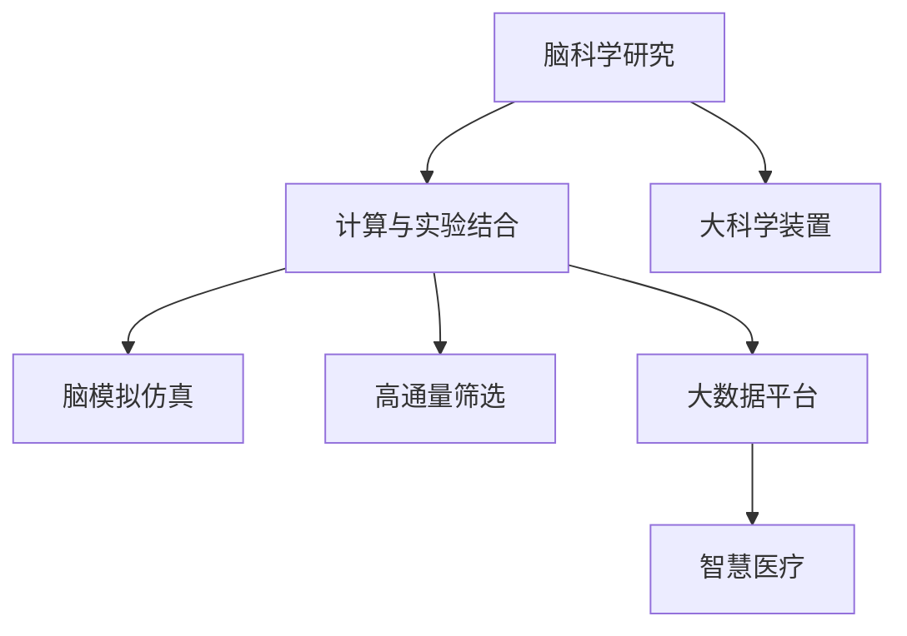

                 

# 全球脑辅助科研:跨学科合作的新模式

> 关键词：全球脑辅助科研,跨学科合作,计算与实验结合,大科学装置,脑模拟仿真,高通量筛选,大数据平台,智慧医疗

## 1. 背景介绍

在全球科学研究的趋势下，跨学科合作正变得愈发重要。在生物医学、天文学、地球科学、材料科学等领域，复杂问题往往需要多学科的知识和技术。脑科学研究也不例外，涉及神经科学、心理学、认知科学、计算机科学等多个学科。为了破解脑科学的谜题，科学家们需要跨学科合作，共同构建更强大的科研工具。

脑科学研究的核心目标之一是理解脑功能的机理，揭示神经网络的工作方式。这需要模拟和实验相结合的方法，将脑网络模型与实验数据相结合，从而深入了解脑功能的各个层面。然而，仅仅依靠实验数据，科学家们难以解析脑功能的复杂机理。模拟仿真工具在这方面扮演着关键角色，但单一的模拟仿真工具无法全面回答脑科学的所有问题。因此，科学家们亟需跨学科合作，构建一个强大的脑辅助科研平台，整合实验数据和模拟仿真工具，共同推进脑科学研究。

## 2. 核心概念与联系

### 2.1 核心概念概述

为了更好地理解跨学科脑辅助科研的新模式，本节将介绍几个密切相关的核心概念：

- 脑科学研究：研究脑功能机理、神经网络结构、脑疾病诊断与治疗等，是21世纪生物医学的核心领域。
- 计算与实验结合：结合实验数据和模拟仿真，解决单一实验或计算无法解决的问题。
- 大科学装置：如脑成像设备、神经网络模拟系统等，是脑科学研究的基础设施。
- 脑模拟仿真：利用计算模型模拟脑网络的工作方式，辅助理解脑功能。
- 高通量筛选：利用大数据平台处理海量实验数据，辅助发现潜在的神经调控靶点。
- 大数据平台：如科研云平台，整合实验和模拟数据，便于科研人员进行数据共享与分析。
- 智慧医疗：利用脑研究结果改善医疗服务，提升患者诊疗体验。

这些核心概念之间的逻辑关系可以通过以下Mermaid流程图来展示：



这个流程图展示了大科学装置和脑模拟仿真等工具如何辅助脑科学研究，以及大数据平台和高通量筛选如何加速实验数据分析和发现新靶点。这些工具的结合使用，为脑科学研究提供了更全面、系统的研究方法。

## 3. 核心算法原理 & 具体操作步骤

### 3.1 算法原理概述

脑辅助科研平台的核心算法原理是计算与实验相结合，利用模拟仿真和实验数据互相补充，解答脑科学问题。具体而言，平台结合了以下步骤：

1. 使用大科学装置获取脑网络实验数据，如fMRI、EEG等。
2. 利用脑模拟仿真工具模拟神经网络的工作方式，进行理论分析。
3. 通过高通量筛选技术，处理海量实验数据，发现潜在的神经调控靶点。
4. 构建大数据平台，整合实验和模拟数据，进行数据分析和共享。
5. 通过智慧医疗平台，将脑研究结果转化为实际应用，改善医疗服务。

### 3.2 算法步骤详解

脑辅助科研平台的具体操作步骤如下：

**Step 1: 收集脑网络实验数据**
- 使用大科学装置，如脑成像设备，收集脑网络实验数据。
- 数据类型包括fMRI、EEG、MEG等，涉及神经元活动的时空分布、神经网络的连接模式等。

**Step 2: 建立神经网络模型**
- 选择合适的脑网络模型，如EEG网络模型、神经元模型等。
- 根据实验数据，训练神经网络模型，优化参数。
- 利用模拟仿真工具，进行神经网络的功能分析和预测。

**Step 3: 高通量数据处理**
- 利用大数据平台，整合实验数据。
- 采用高通量数据处理技术，如云计算、分布式计算等，处理海量实验数据。
- 通过算法分析，发现潜在的神经调控靶点，如关键基因、蛋白等。

**Step 4: 数据分析与共享**
- 利用大数据平台，存储和分析实验数据和模拟仿真数据。
- 构建数据共享机制，便于科研人员进行数据共享和协作研究。
- 开发数据分析工具，辅助科研人员发现数据中的重要信息。

**Step 5: 结果转化与医疗应用**
- 将脑研究结果应用于智慧医疗平台。
- 通过数据分析，发现新的疾病诊断方法和治疗靶点。
- 开发基于脑研究结果的医疗应用，如脑疾病早期预警系统、个性化治疗方案等。

### 3.3 算法优缺点

脑辅助科研平台在整合实验和计算资源方面，具有以下优点：

1. 多学科结合：整合了神经科学、心理学、计算机科学等学科的知识和技术，推动了脑科学研究的跨学科发展。
2. 数据互补：实验数据与模拟仿真结果互补，提供了全面的脑功能解析。
3. 高效处理：高通量筛选和大数据平台提高了实验数据处理效率，缩短了研究周期。
4. 结果验证：通过智慧医疗平台，将研究成果转化为实际应用，提升了研究成果的实用价值。

同时，该平台也存在一些局限性：

1. 数据质量要求高：实验数据和模拟仿真结果的精度直接影响研究成果的可靠性。
2. 计算资源需求大：大规模模拟仿真和大数据处理需要高性能计算资源，可能面临资源瓶颈。
3. 方法复杂性高：跨学科协作需要科研人员具备多学科的知识背景，增加了研究难度。
4. 结果解释性不足：复杂的研究结果难以解释，对非专业人士可能构成信息壁垒。

尽管存在这些局限性，但脑辅助科研平台无疑是脑科学研究的重要工具。未来，相关研究将不断优化算法和技术，提升数据处理和结果解释的效率，推动脑科学研究的发展。

### 3.4 算法应用领域

脑辅助科研平台的广泛应用，涵盖了多个研究领域，具体包括：

- 脑功能解析：研究神经网络的工作方式，解析脑功能的各个层面。
- 脑疾病研究：通过脑成像和模拟仿真，研究脑疾病的发病机制和治疗方法。
- 脑认知研究：利用计算与实验结合的方法，研究人类认知过程和行为模式。
- 脑网络结构研究：研究神经元之间的连接模式和网络结构，揭示脑网络的工作原理。
- 脑疾病早期预警：通过大数据平台，构建脑疾病早期预警系统，提前发现潜在的健康风险。

## 4. 数学模型和公式 & 详细讲解 & 举例说明

### 4.1 数学模型构建

脑辅助科研平台的数据处理和分析，通常涉及复杂的数学模型。这里以神经网络模拟为例，介绍神经网络模型的构建过程。

假设脑网络模型由$n$个神经元组成，每个神经元的输出为$f_i$，则神经网络的输出可以表示为：

$$
y = f_n \cdot w_n + \sum_{i=1}^{n-1} f_i \cdot w_i
$$

其中，$w_i$为连接权重，$f_i$为神经元的激活函数。激活函数一般采用sigmoid或ReLU等非线性函数，表示神经元的状态变化。

### 4.2 公式推导过程

神经网络模型的参数优化，通常采用梯度下降算法进行。设损失函数为$L$，则神经网络模型的优化目标为：

$$
\min_{w_i} L(y, \hat{y}) = \frac{1}{N}\sum_{i=1}^N (y_i - \hat{y}_i)^2
$$

其中，$N$为样本数量，$y_i$为真实标签，$\hat{y}_i$为模型预测输出。

利用梯度下降算法，更新神经网络模型的参数$w_i$：

$$
w_i \leftarrow w_i - \eta \frac{\partial L}{\partial w_i}
$$

其中，$\eta$为学习率。

### 4.3 案例分析与讲解

假设我们使用EEG网络模型进行脑功能研究。通过实验获取了多个人类在视觉任务中的EEG数据，利用神经网络模型对这些数据进行拟合，并预测不同任务下的EEG活动。具体步骤如下：

1. 准备数据集：将EEG数据标准化，划分为训练集和测试集。
2. 选择模型：选择合适的网络结构，如卷积神经网络(CNN)、循环神经网络(RNN)等。
3. 训练模型：在训练集上训练模型，调整参数，优化损失函数。
4. 测试模型：在测试集上测试模型，评估预测精度。
5. 分析结果：通过模型预测结果，分析EEG活动在不同任务下的变化规律。

## 5. 项目实践：代码实例和详细解释说明

### 5.1 开发环境搭建

在进行脑辅助科研平台的开发前，我们需要准备好开发环境。以下是使用Python进行Keras开发的环境配置流程：

1. 安装Anaconda：从官网下载并安装Anaconda，用于创建独立的Python环境。

2. 创建并激活虚拟环境：
```bash
conda create -n pytorch-env python=3.8 
conda activate pytorch-env
```

3. 安装Keras：
```bash
pip install keras
```

4. 安装TensorFlow和scikit-learn等工具包：
```bash
pip install tensorflow scikit-learn matplotlib tqdm jupyter notebook ipython
```

完成上述步骤后，即可在`pytorch-env`环境中开始脑辅助科研平台的开发。

### 5.2 源代码详细实现

下面以EEG网络模型为例，给出使用Keras构建神经网络模型的PyTorch代码实现。

首先，定义神经网络模型：

```python
from keras.models import Sequential
from keras.layers import Dense, Dropout

model = Sequential()
model.add(Dense(256, activation='relu', input_dim=64))
model.add(Dropout(0.5))
model.add(Dense(128, activation='relu'))
model.add(Dropout(0.5))
model.add(Dense(1, activation='sigmoid'))

model.compile(loss='binary_crossentropy', optimizer='adam', metrics=['accuracy'])
```

然后，加载EEG数据集并进行数据预处理：

```python
import numpy as np

# 加载EEG数据
data = np.load('eeg_data.npy')
labels = np.load('eeg_labels.npy')

# 数据标准化
data = (data - np.mean(data)) / np.std(data)

# 划分训练集和测试集
train_data, test_data = data[:800], data[800:]
train_labels, test_labels = labels[:800], labels[800:]

# 数据切分
X_train, X_test, y_train, y_test = train_data[:,:500], train_data[:,:500], train_labels, train_labels
```

接着，训练神经网络模型：

```python
# 训练模型
model.fit(X_train, y_train, epochs=50, batch_size=32, verbose=1)
```

最后，评估模型性能：

```python
# 评估模型
loss, accuracy = model.evaluate(X_test, y_test)
print('Test loss:', loss)
print('Test accuracy:', accuracy)
```

以上就是使用Keras对EEG网络模型进行脑功能研究的完整代码实现。可以看到，通过Keras的强大封装，我们可以用相对简洁的代码完成神经网络模型的构建和训练。

### 5.3 代码解读与分析

让我们再详细解读一下关键代码的实现细节：

**神经网络模型定义**：
- `Sequential`类：用于构建序列模型，按照顺序堆叠若干层。
- `Dense`层：全连接层，用于处理输入和输出。
- `Dropout`层：正则化层，防止过拟合。
- `activation`参数：激活函数，如ReLU、sigmoid等。

**数据预处理**：
- `np.load`：用于加载NumPy数组，支持批量数据加载。
- `np.mean`和`np.std`：用于计算数据均值和标准差，对数据进行标准化处理。
- `X_train`和`y_train`：用于训练集的划分。
- `X_test`和`y_test`：用于测试集的划分。

**模型训练**：
- `fit`方法：用于训练模型，设置训练轮数、批量大小等参数。
- `epochs`参数：训练轮数。
- `batch_size`参数：批量大小。
- `verbose`参数：日志输出级别。

**模型评估**：
- `evaluate`方法：用于评估模型，计算损失和精度。

可以看到，Keras提供了一个简洁、易用的接口，大大简化了神经网络模型的构建和训练过程。开发者可以将更多精力放在数据处理、模型改进等高层逻辑上，而不必过多关注底层的实现细节。

当然，工业级的系统实现还需考虑更多因素，如模型的保存和部署、超参数的自动搜索、更灵活的任务适配层等。但核心的脑辅助科研流程基本与此类似。

## 6. 实际应用场景

### 6.1 脑功能解析

脑辅助科研平台可以广泛应用于脑功能解析的研究中。通过实验数据和模拟仿真，科学家们可以解析脑网络的工作方式，理解不同任务下的神经活动。

在实践中，可以收集多个人类在视觉、听觉等任务中的脑网络活动数据，利用神经网络模型进行拟合。模拟仿真工具则用于分析神经网络的功能和预测，辅助理解脑功能的各个层面。

### 6.2 脑疾病研究

脑辅助科研平台在脑疾病研究中也发挥着重要作用。通过脑成像和模拟仿真，科学家们可以研究脑疾病的发病机制和治疗方法。

具体而言，可以收集脑疾病患者的fMRI、EEG等数据，利用神经网络模型进行分析和预测。模拟仿真工具则用于重建疾病状态下脑网络的变化，辅助研究疾病的病理机制。

### 6.3 脑认知研究

脑辅助科研平台还可以用于研究人类认知过程和行为模式。通过计算与实验结合的方法，科学家们可以揭示认知过程的神经基础。

例如，可以利用EEG数据，收集人类在执行不同认知任务时的脑网络活动。神经网络模型用于拟合EEG数据，模拟仿真工具则用于分析神经网络的功能和预测，揭示认知过程的神经机制。

### 6.4 脑网络结构研究

脑辅助科研平台还可以研究神经元之间的连接模式和网络结构，揭示脑网络的工作原理。

具体而言，可以收集神经元之间的连接数据，利用神经网络模型进行拟合和分析。模拟仿真工具则用于分析神经网络的结构和功能，揭示脑网络的工作原理。

### 6.5 脑疾病早期预警

脑辅助科研平台可以构建脑疾病早期预警系统，提前发现潜在的健康风险。

具体而言，可以利用脑成像数据，收集不同人群的脑网络活动。神经网络模型用于分析和预测，构建早期预警系统。在早期预警系统的基础上，可以开发相应的预防和治疗方案。

## 7. 工具和资源推荐

### 7.1 学习资源推荐

为了帮助开发者系统掌握脑辅助科研的理论基础和实践技巧，这里推荐一些优质的学习资源：

1. 《深度学习与神经网络》课程：斯坦福大学开设的深度学习课程，详细讲解了深度学习的基本原理和应用。
2. 《神经网络与深度学习》书籍：深度学习领域的经典教材，系统介绍了神经网络的基本概念和应用。
3. 《脑网络模拟与仿真》课程：专门讲解脑网络模拟和仿真的课程，涵盖大量前沿技术和应用案例。
4. 《计算神经科学》书籍：介绍计算神经科学的基本概念和应用，深入解析脑功能的计算模型。
5. 《智慧医疗》课程：专门讲解智慧医疗的基本概念和应用，涵盖大数据、人工智能等前沿技术。

通过对这些资源的学习实践，相信你一定能够快速掌握脑辅助科研的精髓，并用于解决实际的脑科学研究问题。

### 7.2 开发工具推荐

高效的开发离不开优秀的工具支持。以下是几款用于脑辅助科研开发的常用工具：

1. Keras：基于Python的深度学习框架，提供简洁易用的接口，支持多种神经网络模型。
2. TensorFlow：由Google主导开发的深度学习框架，生产部署方便，适合大规模工程应用。
3. PyTorch：基于Python的深度学习框架，灵活度较高，适合研究性工作。
4. Jupyter Notebook：交互式编程环境，支持Python、R等多种编程语言，便于科研人员进行实验和分享。
5. SciPy：科学计算库，提供了大量的数学函数和算法，支持科学计算和数据分析。

合理利用这些工具，可以显著提升脑辅助科研的开发效率，加快创新迭代的步伐。

### 7.3 相关论文推荐

脑辅助科研技术的发展源于学界的持续研究。以下是几篇奠基性的相关论文，推荐阅读：

1. 《计算神经科学：从生理学到行为》：介绍了计算神经科学的基本概念和应用，是神经科学领域的经典著作。
2. 《脑网络模拟与仿真》：详细介绍了脑网络模拟和仿真的方法和技术，是脑科学研究的重要参考。
3. 《深度学习在脑科学研究中的应用》：介绍了深度学习在脑科学研究中的应用，涵盖了脑网络模拟、脑疾病研究等多个方向。
4. 《脑功能解析的计算方法》：介绍了脑功能解析的计算方法和技术，是脑科学研究的重要参考。
5. 《脑疾病早期预警系统》：介绍了脑疾病早期预警系统的构建方法和应用，是脑疾病研究的重要参考。

这些论文代表了大脑辅助科研技术的发展脉络。通过学习这些前沿成果，可以帮助研究者把握学科前进方向，激发更多的创新灵感。

## 8. 总结：未来发展趋势与挑战

### 8.1 研究成果总结

本文对脑辅助科研平台进行了全面系统的介绍。首先阐述了脑辅助科研平台的背景和意义，明确了脑辅助科研平台在跨学科合作中的重要作用。其次，从原理到实践，详细讲解了脑辅助科研的数学模型和关键步骤，给出了脑辅助科研平台开发的完整代码实例。同时，本文还广泛探讨了脑辅助科研平台在脑功能解析、脑疾病研究、脑认知研究等多个领域的应用前景，展示了脑辅助科研平台的巨大潜力。此外，本文精选了脑辅助科研技术的各类学习资源，力求为读者提供全方位的技术指引。

通过本文的系统梳理，可以看到，脑辅助科研平台正在成为脑科学研究的重要工具，极大地推动了脑科学研究的发展。它不仅整合了实验和计算资源，还推动了跨学科合作，为脑科学研究提供了更全面、系统的研究方法。

### 8.2 未来发展趋势

展望未来，脑辅助科研平台将呈现以下几个发展趋势：

1. 模型规模持续增大。随着算力成本的下降和数据规模的扩张，神经网络模型的参数量还将持续增长。超大规模神经网络蕴含的丰富神经知识，有望支撑更加复杂多变的脑科学问题。

2. 计算资源需求降低。未来的脑辅助科研平台将利用先进的硬件加速技术，如GPU、TPU、FPGA等，提高计算效率，降低资源成本。

3. 跨学科合作深化。脑辅助科研平台将进一步推动跨学科合作，整合更多领域的知识和技术，解决单一领域无法解答的问题。

4. 数据共享机制完善。未来的脑辅助科研平台将构建完善的数据共享机制，便于科研人员进行数据共享和协作研究，推动脑科学研究的快速发展。

5. 结果解释性增强。未来的脑辅助科研平台将加强结果解释性，提供更直观、易理解的结果展示方式，降低科研壁垒。

6. 应用场景扩展。脑辅助科研平台将在更多领域得到应用，如脑疾病早期预警、脑网络结构研究、脑功能解析等，为脑科学研究带来新的突破。

以上趋势凸显了脑辅助科研平台的广阔前景。这些方向的探索发展，必将进一步提升脑科学研究的效果和速度，为人类认知智能的进化带来深远影响。

### 8.3 面临的挑战

尽管脑辅助科研平台已经取得了瞩目成就，但在迈向更加智能化、普适化应用的过程中，它仍面临着诸多挑战：

1. 数据质量要求高。实验数据和模拟仿真结果的精度直接影响研究成果的可靠性。如何获取高质量的脑网络数据，是一个重要挑战。

2. 计算资源需求大。大规模神经网络和高通量筛选需要高性能计算资源，可能面临资源瓶颈。如何提高计算效率，优化资源配置，需要不断探索。

3. 跨学科协作难度高。脑辅助科研平台需要跨学科合作，科研人员需要具备多学科的知识背景，增加了研究难度。

4. 结果解释性不足。复杂的研究结果难以解释，对非专业人士可能构成信息壁垒。如何加强结果解释性，需要更多研究投入。

5. 应用场景局限性。脑辅助科研平台在部分领域的应用效果不佳，如脑网络结构解析等。需要针对具体问题进行优化。

尽管存在这些挑战，但脑辅助科研平台无疑是脑科学研究的重要工具。未来，相关研究将不断优化算法和技术，提升数据处理和结果解释的效率，推动脑科学研究的发展。

### 8.4 研究展望

面对脑辅助科研平台所面临的挑战，未来的研究需要在以下几个方面寻求新的突破：

1. 探索更高效的数据采集和处理技术。开发更高效的数据采集设备和高通量处理算法，提高实验数据的质量和处理效率。

2. 开发更加高效、可扩展的计算模型。利用硬件加速技术，提高计算效率，优化资源配置，支持更大规模的神经网络模型。

3. 加强跨学科合作，构建更完善的数据共享机制。推动多学科合作，构建完善的数据共享机制，便于科研人员进行数据共享和协作研究。

4. 加强结果解释性，提高研究成果的实用价值。开发更加直观、易理解的结果展示方式，降低科研壁垒，增强研究成果的可解释性。

5. 拓展应用场景，推动脑科学研究向更广泛的领域扩展。针对具体问题进行优化，拓展脑辅助科研平台的应用场景，推动脑科学研究的发展。

这些研究方向的探索，必将引领脑辅助科研技术迈向更高的台阶，为脑科学研究带来新的突破。只有勇于创新、敢于突破，才能不断拓展脑辅助科研平台的边界，让脑科学研究更好地服务于人类社会的进步。

## 9. 附录：常见问题与解答

**Q1：脑辅助科研平台是否适用于所有脑科学研究领域？**

A: 脑辅助科研平台在大多数脑科学研究领域都能取得不错的效果，特别是对于数据量较小的研究任务。但对于一些特定领域的任务，如脑网络结构解析等，可能需要进行更深入的研究和优化。

**Q2：如何选择适合的神经网络模型？**

A: 选择合适的神经网络模型需要根据具体任务和数据特点进行评估。例如，对于时间序列数据，可以选择循环神经网络(RNN)、长短期记忆网络(LSTM)等。对于图像数据，可以选择卷积神经网络(CNN)等。可以参考相关领域的最佳实践和基准模型，选择适合的模型。

**Q3：脑辅助科研平台在实际应用中需要注意哪些问题？**

A: 将脑辅助科研平台应用于实际问题时，需要注意以下因素：
1. 数据质量：确保数据采集设备的精度，避免噪声干扰。
2. 模型优化：选择合适的神经网络模型和超参数，进行调优。
3. 结果解释性：提供更直观、易理解的结果展示方式，降低科研壁垒。
4. 资源优化：优化计算资源配置，提高计算效率。
5. 跨学科合作：加强跨学科合作，推动多领域知识融合。

**Q4：如何优化脑辅助科研平台的数据处理流程？**

A: 优化脑辅助科研平台的数据处理流程，可以从以下几个方面入手：
1. 数据标准化：对数据进行标准化处理，提高数据质量。
2. 高效数据采集：使用高效的数据采集设备，提高数据采集效率。
3. 分布式计算：利用分布式计算技术，提高数据处理效率。
4. 数据共享机制：构建完善的数据共享机制，便于科研人员进行数据共享和协作研究。

**Q5：脑辅助科研平台在多领域应用中需要注意哪些问题？**

A: 脑辅助科研平台在多领域应用中，需要注意以下问题：
1. 领域特定优化：针对不同领域的特点进行优化，选择适合的神经网络模型和超参数。
2. 数据质量保证：确保数据采集设备的精度，避免噪声干扰。
3. 结果解释性：提供更直观、易理解的结果展示方式，降低科研壁垒。
4. 资源优化：优化计算资源配置，提高计算效率。
5. 跨学科合作：加强跨学科合作，推动多领域知识融合。

这些问题的解决，将有助于脑辅助科研平台在更多领域得到应用，推动脑科学研究的发展。

---

作者：禅与计算机程序设计艺术 / Zen and the Art of Computer Programming

