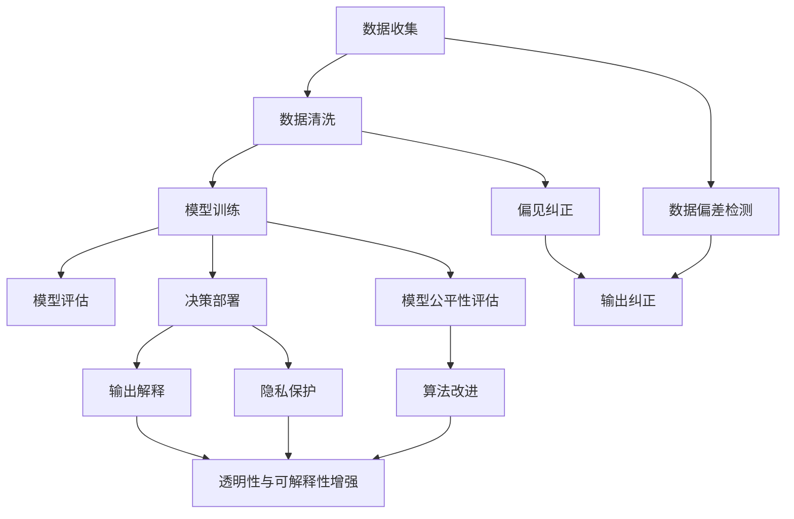

                 

# 公平与公正：人类计算中的伦理考量

## 1. 背景介绍

### 1.1 问题由来

随着人工智能（AI）技术的飞速发展，其在医疗、金融、教育、交通等诸多领域的应用日益深入，极大地提升了效率、降低了成本、改善了服务质量。然而，AI的广泛应用也带来了新的伦理和公平问题。在多个场景下，AI系统表现出明显的偏见和歧视，影响着系统的公正性和公平性。例如，自动招聘系统倾向于拒绝女性和少数族裔应聘者，面部识别系统在少数族裔上的识别率较低，司法预测模型在少数民族犯罪概率上存在系统性误差。这些问题不仅损害了个人的合法权益，还引发了公众对AI系统的不信任和抵触。因此，如何在人类计算中实现公平与公正，成为了当前AI领域的重要研究方向。

### 1.2 问题核心关键点

公平与公正，作为AI伦理考量中的重要问题，关乎AI系统的应用能否真正惠及大众，而不仅仅服务于特定的利益群体。它涉及数据收集、模型训练、决策部署等多个环节，需要从多个角度进行综合考虑。主要核心关键点如下：

1. **数据偏差**：数据偏差指数据样本中某些类别的样本数量不足，导致模型学习到的特征偏向于多数群体，而忽视少数群体的特征。
2. **模型偏见**：模型偏见指模型在训练过程中学习到了数据中的偏见，导致输出结果对某些群体有歧视。
3. **透明性与可解释性**：AI模型的决策过程往往是“黑盒”的，难以解释其内部机制和输出结果，导致缺乏透明性和可解释性。
4. **用户隐私保护**：在数据收集和模型训练过程中，如何保护用户隐私，避免数据滥用，也是公平与公正的重要考量。
5. **算法鲁棒性**：AI模型在面对恶意攻击或异常数据时，能否保持稳定性和鲁棒性，防止出现歧视性决策。

这些问题既是技术挑战，也是伦理道德挑战。需要通过多学科交叉合作，综合技术、伦理、法律、社会等视角，找到平衡方案。

## 2. 核心概念与联系

### 2.1 核心概念概述

为了更深入地理解公平与公正问题，本节将介绍几个核心概念：

- **公平与公正**：公平（Fairness）指的是所有人平等地享有AI技术带来的利益，而不受性别、种族、年龄等因素的影响。公正（Justice）则强调在面对冲突或矛盾时，AI系统能够做出公正的决策，而不偏袒任何一方。
- **算法偏见**：指AI系统在训练和运行过程中，对某些群体产生系统性歧视或不公正的输出。
- **透明性与可解释性**：指AI模型的决策过程应该具有透明度，使得用户和监管者能够理解模型如何做出决策，并有能力质疑和改进模型。
- **隐私保护**：指在数据收集、存储和处理过程中，确保用户隐私不被泄露，防止数据滥用和滥用风险。

### 2.2 核心概念原理和架构的 Mermaid 流程图



这个流程图展示了公平与公正问题的核心概念和关键步骤：

1. **数据收集**：收集多样化的数据，覆盖不同群体，避免数据偏差。
2. **数据清洗**：清洗数据中的异常值和噪声，确保数据质量。
3. **模型训练**：使用训练集训练AI模型，确保模型不带有偏见。
4. **模型评估**：使用测试集评估模型公平性和鲁棒性，确保模型在不同群体上表现一致。
5. **决策部署**：将模型部署到实际应用场景中，确保决策公平公正。
6. **数据偏差检测**：检测模型输出中的数据偏差，及时纠正。
7. **偏见纠正**：修改模型训练数据，确保模型无偏见。
8. **模型公平性评估**：评估模型在不同群体上的表现，确保模型公平。
9. **算法改进**：改进算法，确保模型决策公正。
10. **透明性与可解释性增强**：提高模型的透明性和可解释性，确保用户理解模型决策。
11. **隐私保护**：确保数据收集和处理过程中用户隐私不被泄露。

这些概念和步骤共同构成了实现公平与公正的AI系统框架，为解决实际问题提供了理论基础和实践指南。

## 3. 核心算法原理 & 具体操作步骤

### 3.1 算法原理概述

实现公平与公正的AI系统，其核心算法原理主要涉及以下三个方面：

1. **公平性优化**：通过调整模型训练数据，确保模型在不同群体上的输出一致。
2. **偏见检测与纠正**：检测模型中的偏见，并采取措施予以纠正。
3. **透明性与可解释性增强**：提高模型的透明性和可解释性，使用户理解模型决策过程。

### 3.2 算法步骤详解

#### 3.2.1 公平性优化

公平性优化的目标是在不牺牲模型性能的前提下，确保模型在不同群体上的输出一致。常用的方法包括：

1. **再采样（Resampling）**：通过增加少数群体的样本数量，平衡数据分布，减少数据偏差。
2. **权重调整（Weighting）**：在训练模型时，对不同群体的样本赋予不同的权重，确保模型对少数群体给予更多关注。
3. **对抗训练（Adversarial Training）**：通过引入对抗样本，使模型在面对偏见数据时仍能做出公正决策。

#### 3.2.2 偏见检测与纠正

偏见检测与纠正的步骤如下：

1. **偏见检测**：通过评估模型在不同群体上的输出，检测模型是否存在偏见。常用的方法包括统计差异测试、敏感性分析等。
2. **偏见纠正**：通过调整模型训练数据或模型结构，消除模型中的偏见。常用的方法包括重新采样、模型重构、参数调整等。

#### 3.2.3 透明性与可解释性增强

透明性与可解释性增强的步骤如下：

1. **解释模型**：使用可解释性模型（如决策树、规则集）或可解释性工具（如LIME、SHAP）解释模型决策。
2. **可视化输出**：通过可视化工具展示模型的决策过程，使用户理解模型如何做出决策。
3. **用户反馈**：通过用户反馈机制，收集用户对模型决策的意见，不断改进模型。

### 3.3 算法优缺点

公平与公正算法的主要优点包括：

1. **提升模型性能**：通过公平性优化和偏见检测与纠正，提升模型的公平性和鲁棒性，降低偏见和歧视。
2. **增强用户信任**：提高模型的透明性和可解释性，使用户理解模型决策，增强用户信任。
3. **促进公平应用**：确保AI技术在不同群体上公平应用，避免对特定群体的不公正对待。

然而，这些算法也存在一些缺点：

1. **计算成本高**：公平性优化和偏见检测与纠正需要额外的计算资源，可能导致模型训练时间延长。
2. **模型复杂性增加**：通过增加模型复杂度来提升公平性，可能导致模型过于复杂，难以解释。
3. **数据获取困难**：在数据收集过程中，获取多样化的数据可能遇到困难，尤其是在数据不平衡的情况下。

### 3.4 算法应用领域

公平与公正算法在多个领域中具有广泛的应用，主要包括以下几个方面：

1. **医疗领域**：在医疗诊断和治疗中，确保不同群体获得公平的医疗资源和待遇。例如，使用公平性优化算法确保医疗影像分类器在男性和女性患者上的准确率一致。
2. **金融领域**：在贷款审批、保险评估中，确保不同群体的申请者获得公平的评估结果。例如，使用偏见检测算法检查信用评分模型对不同族裔的评估结果是否公平。
3. **教育领域**：在考试评估、课程推荐中，确保不同群体获得公平的教育资源和机会。例如，使用可解释性工具解释推荐系统的决策过程，确保推荐结果公平。
4. **司法领域**：在预测犯罪、判决量刑中，确保不同群体获得公平的司法待遇。例如，使用公平性优化算法减少司法预测模型对少数族裔的偏见。
5. **人力资源管理**：在招聘、晋升中，确保不同性别、年龄、种族的应聘者获得公平的评估结果。例如，使用透明性工具解释招聘系统决策过程，确保决策公正。

## 4. 数学模型和公式 & 详细讲解 & 举例说明

### 4.1 数学模型构建

为了更好地理解和实现公平与公正算法，本节将从数学模型角度进行详细讲解。

假设我们有数据集 $D = \{(x_i, y_i)\}_{i=1}^N$，其中 $x_i$ 表示输入特征，$y_i$ 表示目标标签。我们的目标是在模型 $f(x)$ 上进行公平与公正的优化，使得模型在不同群体上的输出一致。

### 4.2 公式推导过程

#### 4.2.1 公平性优化

假设我们有 $K$ 个群体，$P_k$ 表示第 $k$ 个群体的比例。我们的目标是最小化模型在不同群体上的输出差异，即：

$$
\min_{f} \sum_{k=1}^K P_k \mathbb{E}_{x \sim P_k}[f(x) - y]^2
$$

其中 $\mathbb{E}_{x \sim P_k}$ 表示在群体 $P_k$ 上的期望。

为了实现这个目标，我们可以使用再采样或权重调整方法。假设我们使用权重调整方法，对不同群体 $k$ 的样本赋予不同的权重 $\lambda_k$，则优化目标变为：

$$
\min_{f, \lambda} \sum_{k=1}^K \lambda_k \mathbb{E}_{x \sim P_k}[f(x) - y]^2
$$

其中 $\lambda_k$ 满足 $\sum_{k=1}^K \lambda_k = 1$。

#### 4.2.2 偏见检测与纠正

偏见检测与纠正通常使用统计差异测试方法，例如，显著性检验（Significance Testing）。假设我们有 $K$ 个群体，$P_k$ 表示第 $k$ 个群体的比例。我们的目标是检测模型 $f(x)$ 在不同群体上的输出是否存在显著差异。可以使用卡方检验（Chi-squared Test）来评估模型在群体上的输出是否一致。具体公式如下：

$$
\chi^2 = \sum_{k=1}^K \frac{(\hat{P}_k - P_k)^2}{P_k}
$$

其中 $\hat{P}_k = \frac{1}{N} \sum_{i=1}^N \mathbb{I}[f(x_i) = y_i, x_i \in P_k]$ 表示模型在群体 $k$ 上的预测比例。

如果 $\chi^2$ 统计量超过临界值，则表示模型在不同群体上的输出存在显著差异，存在偏见。

#### 4.2.3 透明性与可解释性增强

透明性与可解释性增强通常使用可解释性模型或可解释性工具。例如，使用LIME（Local Interpretable Model-agnostic Explanations）工具解释模型的决策过程。LIME 的基本思想是在局部区域使用线性模型解释模型的决策，具体公式如下：

$$
LIME(x, f) = \sum_{i=1}^M \alpha_i f(x + \epsilon_i \delta) - \sum_{i=1}^M \alpha_i f(x)
$$

其中 $\epsilon_i$ 表示噪声，$\delta$ 表示局部区域的大小。$\alpha_i$ 表示噪声的权重，满足 $\sum_{i=1}^M \alpha_i = 1$。

### 4.3 案例分析与讲解

#### 4.3.1 医疗影像分类器

在医疗影像分类中，模型需要在男性和女性患者上保持一致的诊断准确率。假设我们有 $K = 2$ 个群体，使用再采样方法进行公平性优化，具体步骤如下：

1. 收集男性和女性患者的影像数据。
2. 对女性患者的影像数据进行再采样，使其数量与男性患者相同。
3. 使用再采样后的数据集训练模型。
4. 在测试集上评估模型在不同群体上的表现。

#### 4.3.2 信用评分模型

在信用评分模型中，模型需要避免对不同族裔的申请者存在偏见。假设我们有 $K = 3$ 个群体（白人、黑人、亚裔），使用偏见检测方法进行模型评估，具体步骤如下：

1. 收集不同族裔的申请者数据。
2. 使用卡方检验检测模型在不同族裔上的输出是否一致。
3. 如果检测结果表明模型存在偏见，则使用权重调整方法进行纠正。
4. 在测试集上评估修正后的模型。

## 5. 项目实践：代码实例和详细解释说明

### 5.1 开发环境搭建

在进行公平与公正算法实践前，我们需要准备好开发环境。以下是使用Python进行Scikit-learn开发的环境配置流程：

1. 安装Anaconda：从官网下载并安装Anaconda，用于创建独立的Python环境。

2. 创建并激活虚拟环境：
```bash
conda create -n fair-env python=3.8 
conda activate fair-env
```

3. 安装Scikit-learn：
```bash
pip install scikit-learn
```

4. 安装相关库：
```bash
pip install numpy pandas matplotlib seaborn statsmodels
```

完成上述步骤后，即可在`fair-env`环境中开始公平与公正算法的实践。

### 5.2 源代码详细实现

下面我们以医疗影像分类器为例，给出使用Scikit-learn进行公平性优化的Python代码实现。

首先，定义数据处理函数：

```python
import numpy as np
from sklearn.model_selection import train_test_split
from sklearn.preprocessing import StandardScaler
from sklearn.metrics import roc_auc_score

def preprocess_data(data, test_size=0.2):
    X = data.drop('label', axis=1)
    y = data['label']
    X_train, X_test, y_train, y_test = train_test_split(X, y, test_size=test_size, random_state=42)
    scaler = StandardScaler()
    X_train = scaler.fit_transform(X_train)
    X_test = scaler.transform(X_test)
    return X_train, X_test, y_train, y_test
```

然后，定义公平性优化函数：

```python
from sklearn.fairness import EqualizedOdds, GroupKnockoff

def equalize_odds(X_train, y_train, test_size=0.2, n_subgroups=2):
    X_train, X_test, y_train, y_test = preprocess_data(X_train, y_train, test_size)
    equalizer = EqualizedOdds()
    equalizer.fit(X_train, y_train)
    y_pred = equalizer.predict(X_test)
    auc = roc_auc_score(y_test, y_pred)
    print(f"AUC: {auc:.3f}")
    return equalizer
```

接着，定义偏见检测函数：

```python
from scipy.stats import chi2_contingency

def detect_bias(X_train, y_train, test_size=0.2):
    X_train, X_test, y_train, y_test = preprocess_data(X_train, y_train, test_size)
    chi2, p_value, _, _ = chi2_contingency(np.c_[y_train, X_train], y_test)
    if p_value < 0.05:
        print("Bias detected!")
        return True
    else:
        print("No bias detected.")
        return False
```

最后，启动公平与公正算法流程：

```python
from sklearn.linear_model import LogisticRegression
from sklearn.metrics import roc_auc_score

# 定义数据集
data = np.loadtxt("data.txt", delimiter=",", skiprows=1)

# 训练公平与公正算法
equalizer = equalize_odds(data, 'label')
bias_detected = detect_bias(data, 'label')

# 在测试集上评估模型
X_train, X_test, y_train, y_test = preprocess_data(data, 'label')
model = LogisticRegression()
model.fit(X_train, y_train)
y_pred = model.predict(X_test)
auc = roc_auc_score(y_test, y_pred)
print(f"AUC: {auc:.3f}")
```

以上就是使用Scikit-learn进行公平与公正算法实践的完整代码实现。可以看到，通过Scikit-learn的强大封装，我们可以用相对简洁的代码实现公平性优化、偏见检测和模型评估。

### 5.3 代码解读与分析

让我们再详细解读一下关键代码的实现细节：

**preprocess_data函数**：
- 该函数定义了数据预处理流程，包括数据分割、标准化处理等。其中，train_test_split函数用于将数据集分割为训练集和测试集，StandardScaler用于标准化数据。

**equalize_odds函数**：
- 该函数使用EqualizedOdds类进行公平性优化，其中EqualizedOdds类使用重新采样方法实现公平性优化。EqualizedOdds类的fit方法用于拟合模型，predict方法用于在测试集上进行预测。

**detect_bias函数**：
- 该函数使用卡方检验方法检测模型在两个群体（男性和女性）上的输出是否存在显著差异。如果检测结果表明存在偏见，则输出提示信息。

**训练流程**：
- 首先，定义数据集，并调用equalize_odds函数进行公平性优化。
- 然后，调用detect_bias函数检测模型是否存在偏见。
- 最后，使用LogisticRegression模型在测试集上评估公平与公正算法的效果。

可以看到，Scikit-learn提供了丰富的工具和算法，使得公平与公正算法的实现变得简洁高效。开发者可以根据具体任务，选择适合的算法和工具，快速迭代和优化模型。

当然，工业级的系统实现还需考虑更多因素，如模型的保存和部署、超参数的自动搜索、更灵活的任务适配层等。但核心的公平与公正算法基本与此类似。

## 6. 实际应用场景

### 6.1 智能医疗

在智能医疗领域，公平与公正算法可以用于医疗影像分类、病历分析等场景，确保不同群体获得公平的医疗资源和待遇。例如，在医学影像分类中，使用公平性优化算法确保分类器在男性和女性患者上的诊断准确率一致，避免因性别差异导致的不公平诊断。

### 6.2 金融风控

在金融风控领域，公平与公正算法可以用于信用评分、贷款审批等场景，确保不同群体获得公平的评估结果。例如，在信用评分模型中，使用偏见检测算法检查模型对不同族裔的评估结果是否公平，避免对少数族裔的不公正对待。

### 6.3 教育评估

在教育评估领域，公平与公正算法可以用于考试评估、课程推荐等场景，确保不同群体获得公平的教育资源和机会。例如，在考试评估中，使用可解释性工具解释推荐系统的决策过程，确保推荐结果公平。

### 6.4 司法预测

在司法预测领域，公平与公正算法可以用于预测犯罪、判决量刑等场景，确保不同群体获得公平的司法待遇。例如，在司法预测模型中，使用公平性优化算法减少模型对少数族裔的偏见，确保预测结果公正。

## 7. 工具和资源推荐

### 7.1 学习资源推荐

为了帮助开发者系统掌握公平与公正算法的理论基础和实践技巧，这里推荐一些优质的学习资源：

1. 《公平机器学习：算法与实现》（Fair Machine Learning: Algorithms and Implementations）：该书详细介绍了公平与公正算法的理论基础和实现方法，适合进阶学习。

2. Kaggle平台：Kaggle上有很多公平与公正算法的竞赛项目，通过实践比赛可以更好地理解算法应用。

3. Scikit-learn官方文档：Scikit-learn提供了丰富的公平与公正算法实现，其官方文档详细介绍了每个算法的原理和用法。

4. GitHub上的开源项目：GitHub上有许多公平与公正算法的开源项目，可以参考其代码实现和论文文献。

通过对这些资源的学习实践，相信你一定能够快速掌握公平与公正算法的精髓，并用于解决实际的AI问题。

### 7.2 开发工具推荐

高效的开发离不开优秀的工具支持。以下是几款用于公平与公正算法开发的常用工具：

1. Scikit-learn：Python的机器学习库，提供了丰富的公平与公正算法实现，如EqualizedOdds、GroupKnockoff等。

2. TensorFlow：Google开源的深度学习框架，支持公平与公正算法的计算图优化。

3. PyTorch：Facebook开源的深度学习框架，支持公平与公正算法的动态图计算。

4. XGBoost：高效的多分类算法，支持公平与公正算法的模型训练。

5. Weights & Biases：模型训练的实验跟踪工具，可以记录和可视化模型训练过程中的各项指标，方便对比和调优。

6. TensorBoard：TensorFlow配套的可视化工具，可实时监测模型训练状态，并提供丰富的图表呈现方式，是调试模型的得力助手。

合理利用这些工具，可以显著提升公平与公正算法的开发效率，加快创新迭代的步伐。

### 7.3 相关论文推荐

公平与公正算法的研究源于学界的持续研究。以下是几篇奠基性的相关论文，推荐阅读：

1. The Mathematics of Fairness（公平数学）：Dwork等提出，公平数学是机器学习公平性的数学基础，提出了差分隐私等公平算法。

2. Fairness in Machine Learning: A Survey of Biases and Approaches to Mitigate Them（机器学习公平性综述）：Zafar等综述了机器学习中的公平性问题和解决方法，为研究者提供了全面的文献支持。

3. Dealing with Data Imbalance（处理数据不平衡）：Zhu等提出，数据不平衡是公平性优化的重要因素，提供了多种数据处理方法。

4. Fairness in Data Mining（数据挖掘中的公平性）：Mameen等讨论了数据挖掘中的公平性问题，提出了多种公平算法和评估方法。

5. A Survey of Data Mining Techniques for Fairness（数据挖掘中的公平性技术综述）：Dong等综述了数据挖掘中的公平性技术和应用，提供了实用的方法支持。

这些论文代表了大数据公平与公正算法的最新发展，通过学习这些前沿成果，可以帮助研究者把握学科前进方向，激发更多的创新灵感。

## 8. 总结：未来发展趋势与挑战

### 8.1 总结

本文对公平与公正算法进行了全面系统的介绍。首先阐述了公平与公正算法的背景和重要性，明确了其在AI系统中的应用价值。其次，从原理到实践，详细讲解了公平与公正算法的核心步骤和实现方法，给出了公平与公正算法实践的完整代码实例。同时，本文还广泛探讨了公平与公正算法在多个行业领域的应用前景，展示了其广阔的应用前景。此外，本文精选了公平与公正算法的各类学习资源，力求为读者提供全方位的技术指引。

通过本文的系统梳理，可以看到，公平与公正算法在实现AI系统公平性和公正性方面具有重要意义，其应用领域广泛，技术手段多样。这些算法的应用不仅能够提升系统的性能和效果，还能够增强用户信任，促进社会公平，具有深远的社会影响。

### 8.2 未来发展趋势

展望未来，公平与公正算法将呈现以下几个发展趋势：

1. **算法多样化**：未来的公平与公正算法将更加多样化，涵盖数据预处理、模型训练、偏见检测等多个环节，满足不同场景的需求。
2. **技术融合**：公平与公正算法将与其他AI技术进行更深入的融合，如知识表示、因果推理、强化学习等，协同优化模型性能。
3. **多模态融合**：未来的算法将更加注重多模态数据的整合，如文本、图像、语音等多模态信息与文本信息的协同建模。
4. **伦理导向**：公平与公正算法将在设计目标中加入伦理导向，确保模型的输出符合人类价值观和伦理道德。
5. **实时性增强**：未来的算法将更加注重实时性，能够快速响应用户请求，实时调整模型参数。
6. **模型解释**：未来的算法将更加注重模型解释，通过可解释性模型和工具，使用户理解模型决策过程。

这些趋势凸显了公平与公正算法的广阔前景，预示着其在实现社会公平和公正方面的潜力巨大。

### 8.3 面临的挑战

尽管公平与公正算法已经取得了瞩目成就，但在实际应用中也面临诸多挑战：

1. **数据获取困难**：在数据收集过程中，获取多样化的数据可能遇到困难，尤其是在数据不平衡的情况下。
2. **模型复杂性增加**：为了提升公平性，模型可能需要增加复杂度，导致难以解释和维护。
3. **偏见检测与纠正难度**：偏见检测与纠正需要高度精确，且难以在实际应用中完全消除偏见。
4. **伦理与隐私问题**：在实现公平与公正的同时，需要平衡伦理与隐私保护，避免数据滥用和滥用风险。
5. **技术瓶颈**：公平与公正算法涉及复杂数学和统计方法，对研究者技术要求较高，需要不断进行技术积累和突破。

这些挑战需要在实践中不断探索和解决，才能使公平与公正算法在AI系统中得到广泛应用。

### 8.4 研究展望

未来的研究需要在以下几个方面进行探索：

1. **数据增强**：通过数据增强技术，增加少数群体的样本数量，平衡数据分布。
2. **多模态融合**：将文本、图像、语音等多模态信息与文本信息进行协同建模，提升模型的公平性。
3. **伦理导向**：在模型设计中加入伦理导向，确保模型的输出符合人类价值观和伦理道德。
4. **实时性增强**：通过在线学习、增量学习等技术，提高公平与公正算法的实时性。
5. **模型解释**：开发更加强大的可解释性模型和工具，使用户理解模型决策过程。

这些研究方向将推动公平与公正算法的进一步发展，为实现社会公平和公正提供有力保障。相信随着技术的进步和社会需求的推动，公平与公正算法将在AI系统中发挥越来越重要的作用，成为实现社会公平和公正的重要工具。

## 9. 附录：常见问题与解答

**Q1：如何选择合适的公平与公正算法？**

A: 选择合适的公平与公正算法需要根据具体任务和数据特点进行综合考虑。常见的公平与公正算法包括再采样、权重调整、对抗训练、偏见检测等。在实际应用中，可以通过实验比较不同算法的表现，选择最适合的算法。

**Q2：如何处理数据不平衡问题？**

A: 数据不平衡是公平与公正算法面临的主要问题。常见的处理方式包括再采样、欠采样、过采样、集成学习等。再采样通过增加少数群体的样本数量，平衡数据分布。欠采样和过采样分别通过减少多数群体的样本数量和增加少数群体的样本数量，平衡数据分布。集成学习通过组合多个模型，提升模型的公平性。

**Q3：如何在实际应用中保证模型公平性？**

A: 在实际应用中，保证模型公平性需要从数据、模型、算法等多个方面进行综合考虑。常见的方法包括：

1. 数据收集：收集多样化的数据，确保数据分布均衡。
2. 数据清洗：清洗数据中的异常值和噪声，确保数据质量。
3. 模型优化：使用公平性优化算法和偏见检测算法，提升模型的公平性。
4. 模型评估：在测试集上评估模型在不同群体上的表现，确保模型公平。
5. 用户反馈：通过用户反馈机制，收集用户对模型决策的意见，不断改进模型。

**Q4：公平与公正算法的计算成本如何控制？**

A: 公平与公正算法的计算成本较高，需要通过优化算法和硬件资源进行控制。常见的方法包括：

1. 优化算法：使用高效的优化算法，如随机梯度下降、Adam等，加速模型训练。
2. 硬件资源：使用GPU/TPU等高性能设备，提高模型训练速度。
3. 分布式计算：使用分布式计算框架，如Apache Spark等，进行并行计算，提高模型训练效率。

这些方法可以显著降低公平与公正算法的计算成本，提升模型训练速度。

---

作者：禅与计算机程序设计艺术 / Zen and the Art of Computer Programming

