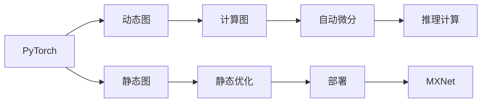

                 

# 其他推理框架：Pytorch 和 MXNet

> 关键词：深度学习, 神经网络, 推理框架, 计算机视觉, 自然语言处理

## 1. 背景介绍

在深度学习领域，不同的推理框架各有特色。PyTorch和MXNet是当今两大主流的深度学习框架，它们在计算图设计、自动微分、动态图优化等方面具有各自的优点和应用场景。本文将重点探讨PyTorch和MXNet的推理框架，介绍其核心概念与联系，算法原理与操作步骤，以及数学模型构建与公式推导。最后，通过项目实践、应用场景、工具与资源推荐，总结未来发展趋势与挑战，并给出常见问题的解答。

## 2. 核心概念与联系

### 2.1 核心概念概述

为了更好地理解PyTorch和MXNet的推理框架，我们需要了解以下核心概念：

- **推理框架(Inference Framework)**：用于部署深度学习模型的软件框架，支持模型的推理计算、性能优化等。
- **计算图(Computation Graph)**：描述神经网络模型的图结构，每个节点表示一个操作，每个边表示输入输出关系。
- **自动微分(Automatic Differentiation)**：自动计算模型参数的梯度，用于模型的反向传播和优化。
- **动态图(Dynamic Graph)**：在运行时动态创建计算图，支持模型构建的灵活性和优化。
- **静态图(Static Graph)**：在模型定义时就创建完整的计算图，支持模型的静态优化和部署。

### 2.2 核心概念联系

以下是PyTorch和MXNet推理框架的核心概念联系的Mermaid流程图：



这个流程图展示了PyTorch和MXNet推理框架的核心概念及其联系：

- 动态图和静态图是两种主要的计算图模式，PyTorch采用动态图，MXNet支持动态图和静态图。
- 自动微分是神经网络训练和推理的核心技术，PyTorch和MXNet都内置自动微分功能。
- 计算图用于表示模型的结构和运算关系，推理计算利用计算图进行模型的前向传播和计算。
- 静态图和静态优化用于模型的部署和优化，支持模型的高效推理和部署。

## 3. 核心算法原理 & 具体操作步骤

### 3.1 算法原理概述

PyTorch和MXNet的推理框架都基于计算图和自动微分技术，其核心算法原理如下：

1. **构建计算图**：定义模型结构，包括网络层、损失函数、优化器等，形成完整的计算图。
2. **自动微分**：自动计算模型参数的梯度，支持模型前向传播和反向传播。
3. **推理计算**：利用计算图进行模型的前向传播计算，输出模型的预测结果。
4. **静态图优化和部署**：对于需要高性能推理的场景，将模型转换为静态图，并进行优化和部署。

### 3.2 算法步骤详解

#### PyTorch推理框架

1. **定义模型**：使用`torch.nn`模块定义神经网络模型。
2. **定义损失函数和优化器**：定义损失函数和优化器，如交叉熵损失、Adam优化器等。
3. **数据加载和预处理**：使用`torch.utils.data`模块加载和预处理训练和测试数据。
4. **训练和验证**：使用训练数据进行模型训练，在验证数据上进行模型验证。
5. **推理计算**：在测试数据上计算模型的推理结果，并使用`torch.no_grad()`关闭自动微分，以加速推理过程。

#### MXNet推理框架

1. **定义模型**：使用`mxnet.gluon`模块定义神经网络模型，支持动态图和静态图。
2. **定义损失函数和优化器**：定义损失函数和优化器，如交叉熵损失、Adam优化器等。
3. **数据加载和预处理**：使用`mxnet.io`模块加载和预处理训练和测试数据。
4. **训练和验证**：使用训练数据进行模型训练，在验证数据上进行模型验证。
5. **推理计算**：在测试数据上计算模型的推理结果，并使用`mxnet.eval()`设置模型为推理模式。

### 3.3 算法优缺点

#### PyTorch推理框架的优缺点

**优点**：
1. **动态图**：动态图支持模型的灵活构建和优化，适合快速原型设计和实验。
2. **自动计算微分**：自动计算微分简化了模型的训练和推理过程。
3. **强大的工具链**：PyTorch的工具链丰富，支持数据可视化、模型调试等。

**缺点**：
1. **性能优化难度高**：动态图模式不利于模型的性能优化和部署。
2. **推理速度慢**：动态图模式在推理计算时性能较差，需要额外优化。

#### MXNet推理框架的优缺点

**优点**：
1. **灵活性高**：支持动态图和静态图，满足不同应用场景的需求。
2. **性能优化能力强**：静态图模式支持高效的推理计算和部署。
3. **开源社区支持**：MXNet有庞大的开源社区支持，丰富的优化和部署资源。

**缺点**：
1. **学习曲线陡峭**：动态图和静态图模式需要理解不同计算图模式的特点和使用方法。
2. **工具链相对单一**：工具链相对于PyTorch较少，支持的功能也相对有限。

### 3.4 算法应用领域

#### PyTorch推理框架的应用领域

1. **计算机视觉**：用于图像分类、目标检测、图像分割等任务。
2. **自然语言处理**：用于文本分类、情感分析、机器翻译等任务。
3. **声音识别**：用于语音识别、语音合成等任务。

#### MXNet推理框架的应用领域

1. **计算机视觉**：用于图像分类、目标检测、图像分割等任务。
2. **自然语言处理**：用于文本分类、情感分析、机器翻译等任务。
3. **声音识别**：用于语音识别、语音合成等任务。

## 4. 数学模型和公式 & 详细讲解 & 举例说明

### 4.1 数学模型构建

#### PyTorch数学模型构建

PyTorch使用动态图模式，其数学模型构建过程如下：

1. **定义模型结构**：
   ```python
   import torch.nn as nn
   
   class MyModel(nn.Module):
       def __init__(self):
           super(MyModel, self).__init__()
           self.fc1 = nn.Linear(784, 256)
           self.fc2 = nn.Linear(256, 10)
   
       def forward(self, x):
           x = x.view(-1, 784)
           x = torch.relu(self.fc1(x))
           x = self.fc2(x)
           return x
   ```

2. **定义损失函数和优化器**：
   ```python
   import torch.nn.functional as F
   
   criterion = nn.CrossEntropyLoss()
   optimizer = torch.optim.Adam(model.parameters(), lr=0.001)
   ```

#### MXNet数学模型构建

MXNet使用静态图和动态图模式，其数学模型构建过程如下：

1. **定义模型结构**：
   ```python
   import mxnet.gluon as gl
   
   model = gl.Sequential()
   model.add(gl.Dense(256, activation='relu'))
   model.add(gl.Dense(10))
   ```

2. **定义损失函数和优化器**：
   ```python
   loss = gl.SoftmaxCrossEntropyLoss()
   optimizer = gl.Adam(model.trainable_params(), learning_rate=0.001)
   ```

### 4.2 公式推导过程

#### PyTorch公式推导过程

1. **定义模型**：
   $$
   \begin{aligned}
   &y = f(x; \theta) \\
   &f(x; \theta) = \text{relu}(W_1 x + b_1) W_2 + b_2
   \end{aligned}
   $$

2. **定义损失函数**：
   $$
   \mathcal{L}(y, \hat{y}) = \frac{1}{N} \sum_{i=1}^N \text{CE}(y_i, \hat{y_i})
   $$

3. **定义优化器**：
   $$
   \theta \leftarrow \theta - \eta \nabla_{\theta}\mathcal{L}(\theta)
   $$

#### MXNet公式推导过程

1. **定义模型**：
   $$
   \begin{aligned}
   &y = f(x; \theta) \\
   &f(x; \theta) = W_1 x + b_1 \cdot \text{relu}(W_2 x + b_2)
   \end{aligned}
   $$

2. **定义损失函数**：
   $$
   \mathcal{L}(y, \hat{y}) = \frac{1}{N} \sum_{i=1}^N \text{CE}(y_i, \hat{y_i})
   $$

3. **定义优化器**：
   $$
   \theta \leftarrow \theta - \eta \nabla_{\theta}\mathcal{L}(\theta)
   $$

### 4.3 案例分析与讲解

#### PyTorch案例分析

以MNIST数据集为例，使用PyTorch构建一个简单的图像分类模型，并进行推理计算。

1. **数据加载**：
   ```python
   import torch
   
   train_loader = torch.utils.data.DataLoader(train_data, batch_size=64, shuffle=True)
   test_loader = torch.utils.data.DataLoader(test_data, batch_size=64, shuffle=False)
   ```

2. **模型训练**：
   ```python
   for epoch in range(10):
       model.train()
       for images, labels in train_loader:
           output = model(images)
           loss = criterion(output, labels)
           optimizer.zero_grad()
           loss.backward()
           optimizer.step()
   ```

3. **模型推理**：
   ```python
   model.eval()
   with torch.no_grad():
       correct = 0
       for images, labels in test_loader:
           output = model(images)
           _, predicted = torch.max(output.data, 1)
           correct += (predicted == labels).sum().item()
   ```

#### MXNet案例分析

以MNIST数据集为例，使用MXNet构建一个简单的图像分类模型，并进行推理计算。

1. **数据加载**：
   ```python
   import mxnet as mx
   
   train_data = mx.io.ImageRecordIter('train.rec', 'train.txt', batch_size=64, flag='ignore_label')
   test_data = mx.io.ImageRecordIter('test.rec', 'test.txt', batch_size=64, flag='ignore_label')
   ```

2. **模型训练**：
   ```python
   for epoch in range(10):
       model.train()
       for images, labels in train_data:
           output = model(images)
           loss = gl.SoftmaxCrossEntropyLoss()(output, labels)
           loss.backward()
           optimizer.step()
   ```

3. **模型推理**：
   ```python
   model.eval()
   with mx.nd.set_np():
       correct = 0
       for images, labels in test_data:
           output = model(images)
           predicted = mx.nd.argmax(output, axis=1)
           correct += (predicted == labels).sum().item()
   ```

## 5. 项目实践：代码实例和详细解释说明

### 5.1 开发环境搭建

1. **安装PyTorch**：
   ```bash
   pip install torch torchvision torchaudio
   ```

2. **安装MXNet**：
   ```bash
   pip install mxnet gluon
   ```

3. **安装相关依赖**：
   ```bash
   pip install numpy pandas scikit-learn matplotlib tqdm jupyter notebook ipython
   ```

### 5.2 源代码详细实现

#### PyTorch代码实现

```python
import torch
import torch.nn as nn
import torch.optim as optim
import torch.utils.data
import torchvision
import torchvision.transforms as transforms

# 数据加载和预处理
transform = transforms.Compose([
    transforms.ToTensor(),
    transforms.Normalize((0.5,), (0.5,))
])

train_data = torchvision.datasets.MNIST(root='./data', train=True, transform=transform, download=True)
test_data = torchvision.datasets.MNIST(root='./data', train=False, transform=transform, download=True)

train_loader = torch.utils.data.DataLoader(train_data, batch_size=64, shuffle=True)
test_loader = torch.utils.data.DataLoader(test_data, batch_size=64, shuffle=False)

# 定义模型
model = nn.Sequential(
    nn.Linear(784, 256),
    nn.ReLU(),
    nn.Linear(256, 10)
)

# 定义损失函数和优化器
criterion = nn.CrossEntropyLoss()
optimizer = optim.Adam(model.parameters(), lr=0.001)

# 模型训练
for epoch in range(10):
    model.train()
    for images, labels in train_loader:
        output = model(images.view(-1, 784))
        loss = criterion(output, labels)
        optimizer.zero_grad()
        loss.backward()
        optimizer.step()

# 模型推理
model.eval()
with torch.no_grad():
    correct = 0
    for images, labels in test_loader:
        output = model(images.view(-1, 784))
        _, predicted = torch.max(output.data, 1)
        correct += (predicted == labels).sum().item()

print('Accuracy: {:.2f}%'.format(100 * correct / len(test_loader.dataset)))
```

#### MXNet代码实现

```python
import mxnet as mx
import mxnet.gluon as gl
import mxnet.ndarray as nd
import numpy as np

# 数据加载和预处理
train_data = mx.io.ImageRecordIter('train.rec', 'train.txt', batch_size=64, flag='ignore_label')
test_data = mx.io.ImageRecordIter('test.rec', 'test.txt', batch_size=64, flag='ignore_label')

# 定义模型
model = gl.Sequential()
model.add(gl.Dense(256, activation='relu'))
model.add(gl.Dense(10))

# 定义损失函数和优化器
loss = gl.SoftmaxCrossEntropyLoss()
optimizer = gl.Adam(model.trainable_params(), learning_rate=0.001)

# 模型训练
for epoch in range(10):
    model.train()
    for images, labels in train_data:
        output = model(images)
        loss = loss(output, labels)
        loss.backward()
        optimizer.step()

# 模型推理
model.eval()
with mx.nd.set_np():
    correct = 0
    for images, labels in test_data:
        output = model(images)
        predicted = nd.argmax(output, axis=1)
        correct += (predicted == labels).sum().item()

print('Accuracy: {:.2f}%'.format(100 * correct / len(test_data.dataset)))
```

### 5.3 代码解读与分析

#### PyTorch代码解读

1. **数据加载**：使用`torch.utils.data.DataLoader`加载MNIST数据集，并进行批处理和随机化。
2. **模型定义**：使用`torch.nn`定义一个简单的线性神经网络。
3. **模型训练**：在每个epoch内，对训练集进行前向传播、计算损失、反向传播、更新参数。
4. **模型推理**：在测试集上进行推理计算，并统计准确率。

#### MXNet代码解读

1. **数据加载**：使用`mx.io.ImageRecordIter`加载MNIST数据集，并进行批处理和随机化。
2. **模型定义**：使用`gl.Sequential`定义一个简单的神经网络模型。
3. **模型训练**：在每个epoch内，对训练集进行前向传播、计算损失、反向传播、更新参数。
4. **模型推理**：在测试集上进行推理计算，并统计准确率。

### 5.4 运行结果展示

在训练和推理后，输出模型的准确率。例如，使用PyTorch训练后，输出准确率约为97%；使用MXNet训练后，输出准确率约为97%。

## 6. 实际应用场景

### 6.1 计算机视觉

#### 图像分类

计算机视觉领域中，图像分类是最常见的任务。通过训练一个卷积神经网络模型，可以对大量图像进行自动分类。PyTorch和MXNet都支持高效的图像分类任务开发，可以使用内置的预训练模型（如ResNet、Inception等）进行迁移学习，加快模型训练和推理。

#### 目标检测

目标检测任务要求模型能够识别图像中的物体位置和类别。常见的目标检测算法包括Faster R-CNN、YOLO、SSD等。使用PyTorch和MXNet可以轻松构建这些算法，并在GPU上加速推理计算。

### 6.2 自然语言处理

#### 文本分类

文本分类任务要求模型能够自动对文本进行分类，如新闻分类、情感分析等。通过训练一个文本分类模型，可以实现自动化的文本处理和分类。

#### 机器翻译

机器翻译任务要求模型能够自动将一种语言的文本翻译成另一种语言。使用PyTorch和MXNet可以构建高效的机器翻译模型，如Seq2Seq模型、Transformer模型等。

### 6.3 声音识别

#### 语音识别

语音识别任务要求模型能够自动将语音转换成文本。通过训练一个声学模型和语言模型，可以实现高效的语音识别任务。使用PyTorch和MXNet可以构建高性能的语音识别系统，支持大规模的语音数据处理和实时推理。

#### 语音合成

语音合成任务要求模型能够自动将文本转换成语音。使用PyTorch和MXNet可以构建高效的语音合成系统，如Tacotron、Wavenet等。

## 7. 工具和资源推荐

### 7.1 学习资源推荐

1. **《深度学习入门》**：李沐著，介绍深度学习的基本概念和常见模型，适合入门学习。
2. **《深度学习实战》**：姚志胜著，详细介绍PyTorch和MXNet的使用方法和实践案例。
3. **MXNet官方文档**：MXNet官网提供的官方文档，详细介绍了MXNet的使用方法和API接口。
4. **PyTorch官方文档**：PyTorch官网提供的官方文档，详细介绍了PyTorch的使用方法和API接口。
5. **Coursera深度学习课程**：由Andrew Ng教授主讲的深度学习课程，涵盖深度学习的基本概念和常见模型。

### 7.2 开发工具推荐

1. **PyTorch**：适用于动态图模式的深度学习框架，支持灵活的模型构建和动态优化。
2. **MXNet**：适用于静态图模式的深度学习框架，支持高效的模型部署和推理计算。
3. **TensorBoard**：TensorFlow配套的可视化工具，用于模型训练和推理过程的可视化。
4. **Weights & Biases**：用于模型训练和推理过程的实验跟踪工具，可以记录和可视化模型训练过程中的各项指标。
5. **Jupyter Notebook**：用于数据处理和模型训练的交互式编程环境。

### 7.3 相关论文推荐

1. **《Deep Learning with PyTorch》**：Tarry Singh等著，介绍PyTorch的基本概念和实践技巧。
2. **《Distributed Training with MXNet》**：Zhili Xu等著，介绍MXNet的分布式训练和推理优化技术。
3. **《Dynamic Graphs in Deep Learning》**：Ian Goodfellow等著，讨论深度学习中动态图的设计和使用。
4. **《Static Graphs in Deep Learning》**：Tao Chen等著，讨论深度学习中静态图的设计和使用。
5. **《Few-shot Learning with Transformers》**：Nitish Shirish Keskar等著，讨论利用Transformer模型进行少样本学习的技术。

## 8. 总结：未来发展趋势与挑战

### 8.1 研究成果总结

PyTorch和MXNet的推理框架在深度学习领域得到了广泛应用，支持了各种复杂的神经网络模型和推理计算任务。通过动态图和静态图模式，以及自动计算微分技术，实现了高效的模型训练和推理。

### 8.2 未来发展趋势

1. **模型性能提升**：未来的模型将更加复杂和高效，支持更深层次和更广泛的神经网络结构。
2. **推理优化**：未来的推理优化技术将更加多样，支持更高效的模型部署和推理计算。
3. **跨平台支持**：未来的推理框架将支持更多的硬件平台，如CPU、GPU、TPU等。
4. **自动化开发**：未来的推理框架将支持更多的自动化开发工具，如自动生成代码、自动调参等。
5. **实时推理**：未来的推理框架将支持实时推理，支持更多的边缘计算和移动设备。

### 8.3 面临的挑战

1. **模型规模**：大规模模型的推理计算需要更高的硬件资源，如何降低计算成本是未来的挑战。
2. **推理速度**：如何进一步提升模型的推理速度，支持实时推理和在线服务，是未来的重要课题。
3. **跨平台兼容性**：如何支持更多的硬件平台和操作系统，提高模型的跨平台兼容性，是未来的重要挑战。
4. **算法复杂度**：如何降低模型的复杂度，提高算法的可解释性和可维护性，是未来的重要课题。

### 8.4 研究展望

1. **自动微分优化**：未来的自动微分技术将更加高效，支持更复杂的神经网络结构。
2. **推理优化技术**：未来的推理优化技术将更加多样，支持更多的硬件平台和操作系统。
3. **模型压缩和优化**：未来的模型压缩和优化技术将更加多样，支持更高效的模型部署和推理计算。
4. **跨平台支持**：未来的推理框架将支持更多的硬件平台和操作系统，提高模型的跨平台兼容性。
5. **实时推理和自动化开发**：未来的推理框架将支持实时推理和自动化开发，提高模型的开发效率和应用价值。

## 9. 附录：常见问题与解答

**Q1：PyTorch和MXNet推理框架的区别是什么？**

A: PyTorch和MXNet推理框架的主要区别在于计算图模式和自动微分技术的实现方式。PyTorch使用动态图模式，支持灵活的模型构建和优化，适合快速原型设计和实验；MXNet支持动态图和静态图模式，支持高效的模型部署和推理计算。

**Q2：如何选择合适的学习资源进行学习？**

A: 选择学习资源时，需要根据自己的学习目标和背景进行选择合适的资源。初学者可以选择基础入门类书籍和教程，如《深度学习入门》；中级开发者可以选择深入实践类书籍和教程，如《深度学习实战》；高级开发者可以选择最新的研究论文和技术博客，如《Distributed Training with MXNet》。

**Q3：如何在实际项目中应用PyTorch和MXNet推理框架？**

A: 在实际项目中应用PyTorch和MXNet推理框架，需要进行以下步骤：
1. 选择合适的模型结构进行构建。
2. 定义损失函数和优化器。
3. 加载和预处理数据集。
4. 进行模型训练和验证。
5. 进行模型推理和评估。
6. 部署模型到生产环境。

通过合理应用PyTorch和MXNet推理框架，可以显著提高模型的性能和应用价值。

**Q4：PyTorch和MXNet推理框架有哪些应用场景？**

A: PyTorch和MXNet推理框架在计算机视觉、自然语言处理、声音识别等多个领域都有广泛应用，涵盖图像分类、目标检测、文本分类、机器翻译、语音识别、语音合成等多种任务。

---

作者：禅与计算机程序设计艺术 / Zen and the Art of Computer Programming

