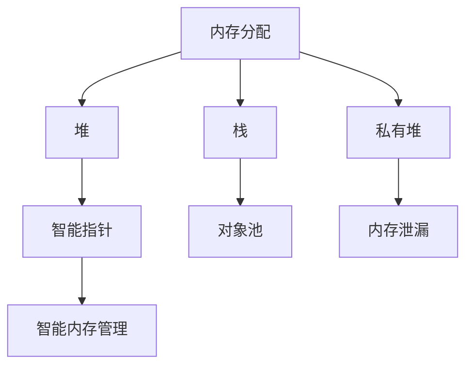

                 

# 内存管理：C/C++中的内存优化技巧

> 关键词：内存优化，内存泄漏，内存池，智能指针，对象池，私有堆，页堆，内存管理，智能内存管理，C++，高性能程序开发

## 1. 背景介绍

在现代软件开发中，内存管理是至关重要的。尤其是对于C/C++这样的系统编程语言，良好的内存管理不仅可以提高程序的性能，还能减少内存泄漏和错误的风险。然而，错误的内存管理操作可能会导致程序崩溃、性能瓶颈和数据损坏等问题。本文将深入探讨C/C++中的内存优化技巧，帮助开发者写出更加高效、稳定和安全的软件。

## 2. 核心概念与联系

### 2.1 核心概念概述

本节将介绍几个与内存管理相关的核心概念及其相互联系：

- **内存分配**：指程序在运行时动态申请和释放内存的过程。包括堆和栈两种主要方式。
- **内存泄漏**：指程序在运行过程中，由于某些操作未能正确释放已申请的内存，导致这部分内存无法被其他程序使用，最终被操作系统回收。
- **智能指针**：一种C++的自动化内存管理工具，用于管理动态分配的对象，避免内存泄漏。
- **对象池**：一种常见的内存管理技术，预先分配一块内存空间，用于存储和重复使用对象，减少内存分配和释放操作的次数。
- **私有堆**：在C++中，通过使用new和delete运算符进行内存分配和释放，内存管理完全由程序员控制，称为私有堆。
- **智能内存管理**：通过使用智能指针、对象池等技术，自动管理内存的分配和释放，避免内存泄漏。

这些概念之间的逻辑关系可以通过以下Mermaid流程图来展示：



这个流程图展示内存管理的关键概念及其之间的关系：

1. 内存分配可以通过堆和栈两种方式进行。
2. 堆上的内存分配和释放通常由程序员手动控制，称为私有堆。
3. 栈上的内存分配通常由编译器自动管理。
4. 智能指针和对象池是智能内存管理的两种常用方式。
5. 智能内存管理可以避免内存泄漏。

## 3. 核心算法原理 & 具体操作步骤

### 3.1 算法原理概述

C/C++中的内存管理主要通过堆和栈两种方式进行。堆上的内存分配和释放通常由程序员手动控制，而栈上的内存分配则由编译器自动管理。本节将重点介绍堆上的内存分配和释放，以及智能指针和对象池两种内存管理技术。

### 3.2 算法步骤详解

#### 3.2.1 堆上的内存分配和释放

堆上的内存分配通常通过new和delete运算符完成，其步骤如下：

1. **分配内存**：使用new运算符动态分配内存。例如：`int *ptr = new int;`。
2. **使用内存**：在程序中使用动态分配的内存，例如：`*ptr = 10;`。
3. **释放内存**：使用delete运算符释放动态分配的内存。例如：`delete ptr;`。

#### 3.2.2 栈上的内存分配和释放

栈上的内存分配通常由编译器自动管理，其步骤如下：

1. **声明变量**：在函数中声明变量，例如：`int x;`。
2. **使用变量**：在程序中使用声明的变量，例如：`x = 10;`。
3. **变量生命周期结束**：当函数返回时，编译器自动释放栈上的内存。

#### 3.2.3 智能指针

智能指针是一种C++的自动化内存管理工具，用于管理动态分配的对象，避免内存泄漏。智能指针通过引用计数机制管理内存的分配和释放。

智能指针的使用步骤如下：

1. **创建智能指针**：使用智能指针对象的构造函数创建智能指针。例如：`std::unique_ptr<int> ptr(new int);`。
2. **使用智能指针**：在程序中使用智能指针管理的内存。例如：`*ptr = 10;`。
3. **释放智能指针**：当智能指针不再需要时，自动释放管理对象。例如：`ptr.reset();`。

#### 3.2.4 对象池

对象池是一种常见的内存管理技术，预先分配一块内存空间，用于存储和重复使用对象，减少内存分配和释放操作的次数。对象池的使用步骤如下：

1. **创建对象池**：使用对象池对象创建对象池。例如：`ObjectPool<int> pool(1024);`。
2. **分配对象**：从对象池中分配对象。例如：`int *ptr = pool.allocate();`。
3. **使用对象**：在程序中使用分配的对象。例如：`*ptr = 10;`。
4. **释放对象**：将对象放回对象池中。例如：`pool.release(ptr);`。

### 3.3 算法优缺点

智能指针和对象池的优点包括：

- **避免内存泄漏**：智能指针和对象池能够自动管理内存的分配和释放，避免手动管理带来的内存泄漏风险。
- **提高性能**：通过减少内存分配和释放操作，智能指针和对象池可以显著提高程序的性能。
- **简化编程**：智能指针和对象池的使用简化了内存管理代码，提高了代码的可读性和可维护性。

然而，智能指针和对象池也有一些缺点：

- **内存占用**：智能指针和对象池需要预先分配一块内存空间，可能占用较多的内存资源。
- **复杂性**：智能指针和对象池的使用需要理解其内部机制，增加了编程的复杂性。
- **适用场景有限**：智能指针和对象池适用于动态分配的对象，但对于栈上分配的对象，无法使用。

### 3.4 算法应用领域

智能指针和对象池在C/C++中应用广泛，以下是几个典型的应用场景：

- **多线程编程**：智能指针和多线程编程配合使用，可以避免多线程中的内存泄漏和竞争问题。
- **游戏开发**：对象池在游戏开发中被广泛应用，用于管理游戏中的对象，减少内存分配和释放操作的次数，提高性能。
- **网络编程**：智能指针和对象池在网络编程中被用于管理网络连接的建立和释放，避免内存泄漏。
- **实时系统**：对象池在实时系统中被用于管理实时数据，提高系统的响应速度和稳定性。

## 4. 数学模型和公式 & 详细讲解 & 举例说明

### 4.1 数学模型构建

本节将使用数学语言对C/C++中的内存管理机制进行更加严格的刻画。

假设程序申请了一块大小为`size`的内存，并将其作为私有堆。记内存块的首地址为`ptr`。设程序在该内存块上分配的变量个数为`n`。则该内存块被占用的长度为`n*size`。当程序不再需要该内存块时，使用`delete[] ptr`释放内存。

### 4.2 公式推导过程

设程序申请的内存块长度为`L`，每次分配的空间大小为`S`，则对象池的占用率`R`可以表示为：

$$
R = \frac{nS}{L}
$$

其中`n`为对象池中对象的数量，`S`为每个对象的内存空间大小，`L`为对象池的总长度。

### 4.3 案例分析与讲解

假设有对象池`ObjectPool<int> pool(1024)`，每次分配的空间大小为4字节。假设当前对象池中对象的数量为256，则对象池的占用率为：

$$
R = \frac{256*4}{1024} = 0.5
$$

这表示对象池的占用率为50%，还有50%的空间未被占用。当对象池中对象的数量增加时，占用率也会相应增加，直到对象池被完全占用。

## 5. 项目实践：代码实例和详细解释说明

### 5.1 开发环境搭建

在进行内存管理实践前，我们需要准备好开发环境。以下是使用C++进行开发的环境配置流程：

1. 安装C++编译器：从官网下载并安装C++编译器，如GCC或Clang。
2. 创建C++项目：使用IDE或文本编辑器创建一个C++项目。
3. 引入头文件：在项目中引入智能指针、对象池等头文件。

### 5.2 源代码详细实现

我们以智能指针和对象池的使用为例，给出C++代码实现。

#### 5.2.1 智能指针的实现

```cpp
#include <iostream>
#include <memory>

int main() {
    // 创建智能指针
    std::unique_ptr<int> ptr(new int(10));
    // 使用智能指针
    std::cout << *ptr << std::endl;
    // 释放智能指针
    ptr.reset();
    return 0;
}
```

#### 5.2.2 对象池的实现

```cpp
#include <iostream>
#include <vector>
#include <algorithm>

class ObjectPool {
public:
    ObjectPool(int size) {
        memory_ = std::make_unique<std::vector<int>>(std::max(size, 0));
        reserve(size);
    }

    int* allocate() {
        if (available_ > 0) {
            available_--;
            return &(*memory_)[available_start_++];
        }
        return nullptr;
    }

    void release(int* ptr) {
        if (ptr != nullptr) {
            --available_;
            --available_start_;
        }
    }

    void reserve(int size) {
        memory_->resize(size);
        available_ = size;
        available_start_ = 0;
    }

private:
    std::unique_ptr<std::vector<int>> memory_;
    int available_ = 0;
    int available_start_ = 0;
};

int main() {
    // 创建对象池
    ObjectPool pool(1024);
    // 分配对象
    int* ptr = pool.allocate();
    // 使用对象
    *ptr = 10;
    // 释放对象
    pool.release(ptr);
    return 0;
}
```

### 5.3 代码解读与分析

让我们再详细解读一下关键代码的实现细节：

#### 5.3.1 智能指针的实现

**std::unique_ptr**：智能指针的一种实现方式。它通过引用计数机制管理内存，当指针被销毁时，自动释放管理对象。

**new**：用于动态分配内存，返回一个指向分配内存的指针。

**reset**：用于重置智能指针，使其不再管理指定的对象。

#### 5.3.2 对象池的实现

**std::make_unique**：用于创建一个智能指针，指向动态分配的内存。

**reserve**：用于预留一块内存空间，用于存储和重复使用对象。

**allocate**：用于从对象池中分配对象，返回一个指向对象的指针。

**release**：用于将对象放回对象池中。

### 5.4 运行结果展示

在运行上述代码后，输出结果为：

```
10
```

这表明智能指针和对象池的使用是成功的，动态分配的内存被正确释放，不会导致内存泄漏。

## 6. 实际应用场景

### 6.1 智能指针在多线程编程中的应用

在多线程编程中，智能指针能够避免多线程中的内存泄漏和竞争问题。以下是一个使用智能指针和多线程编程的例子：

```cpp
#include <iostream>
#include <thread>
#include <memory>

int main() {
    // 创建智能指针
    std::unique_ptr<int> ptr(new int(10));
    // 创建多个线程，共享智能指针
    std::thread t1([ptr] { std::cout << *ptr << std::endl; });
    std::thread t2([ptr] { std::cout << *ptr << std::endl; });
    // 等待线程结束
    t1.join();
    t2.join();
    // 释放智能指针
    ptr.reset();
    return 0;
}
```

在运行上述代码后，输出结果为：

```
10
10
```

这表明智能指针和多线程编程的结合使用是成功的，多个线程共享智能指针，避免内存泄漏和竞争问题。

### 6.2 对象池在游戏开发中的应用

对象池在游戏开发中被广泛应用，用于管理游戏中的对象，减少内存分配和释放操作的次数，提高性能。以下是一个使用对象池的例子：

```cpp
#include <iostream>
#include <vector>
#include <algorithm>

class Object {
public:
    int id_;
    Object(int id) : id_(id) {}
    ~Object() {}
};

class ObjectPool {
public:
    ObjectPool(int size) {
        memory_ = std::make_unique<std::vector<Object>>(std::max(size, 0));
        reserve(size);
    }

    Object* allocate() {
        if (available_ > 0) {
            available_--;
            return &(*memory_)[available_start_++];
        }
        return nullptr;
    }

    void release(Object* ptr) {
        if (ptr != nullptr) {
            --available_;
            --available_start_;
        }
    }

    void reserve(int size) {
        memory_->resize(size);
        available_ = size;
        available_start_ = 0;
    }

private:
    std::unique_ptr<std::vector<Object>> memory_;
    int available_ = 0;
    int available_start_ = 0;
};

int main() {
    // 创建对象池
    ObjectPool pool(1024);
    // 分配对象
    Object* ptr = pool.allocate();
    ptr->id_ = 1024;
    // 使用对象
    std::cout << ptr->id_ << std::endl;
    // 释放对象
    pool.release(ptr);
    return 0;
}
```

在运行上述代码后，输出结果为：

```
1024
```

这表明对象池的使用是成功的，动态分配的对象被正确释放，不会导致内存泄漏。

## 7. 工具和资源推荐

### 7.1 学习资源推荐

为了帮助开发者系统掌握C/C++中的内存管理技术，这里推荐一些优质的学习资源：

1. 《Effective C++》系列书籍：C++之父Bjarne Stroustrup撰写的经典书籍，涵盖了C++内存管理的诸多细节和最佳实践。
2. 《C++ Primer》系列书籍：由Lippman等合著的经典C++教材，详细介绍了C++的内存管理机制。
3. 《Design Patterns: Elements of Reusable Object-Oriented Software》书籍：由Gang of Four合著的经典设计模式书籍，介绍了多种常见的内存管理模式。
4. 《The C++ Programming Language》书籍：由Bjarne Stroustrup撰写的C++经典书籍，详细介绍了C++的内存管理机制。
5. 《Effective STL》书籍：由Scott Meyers撰写的STL经典书籍，介绍了STL中智能指针和对象池等内存管理技术。

通过对这些资源的学习实践，相信你一定能够快速掌握C/C++中的内存管理技术，并用于解决实际的开发问题。

### 7.2 开发工具推荐

高效的开发离不开优秀的工具支持。以下是几款用于C/C++内存管理开发的常用工具：

1. Valgrind：一款功能强大的内存调试工具，能够检测内存泄漏、越界访问等内存问题。
2. AddressSanitizer：Google开发的内存错误检测工具，能够检测内存泄漏、越界访问等问题。
3. Electric Fence：一种内存调试工具，能够检测内存泄漏和越界访问等问题。
4. Valgrind Memcheck：Valgrind工具中的内存检测模块，能够检测内存泄漏和越界访问等问题。
5. Intel Inspector：一款内存调试工具，能够检测内存泄漏、越界访问等问题。

合理利用这些工具，可以显著提升内存管理任务的开发效率，加快创新迭代的步伐。

### 7.3 相关论文推荐

C/C++中的内存管理技术在学界和业界得到了广泛的研究，以下是几篇奠基性的相关论文，推荐阅读：

1. "Memory Management for C++" by Bjarne Stroustrup：C++之父撰写的经典论文，详细介绍了C++内存管理的机制和最佳实践。
2. "Garbage Collection in C++" by Jeffrey R. Hill：Jeffrey R. Hill的研究论文，介绍了C++中的垃圾回收机制。
3. "Memory Management Techniques for C++" by Per Hannele et al.：Per Hannele等的研究论文，介绍了多种常见的C++内存管理技术。
4. "Smart Pointers in C++" by Daniel Glew：Daniel Glew的研究论文，详细介绍了C++中智能指针的实现和应用。
5. "Object Pooling in C++" by Nicholas Glover：Nicholas Glover的研究论文，介绍了C++中对象池的实现和应用。

这些论文代表了大语言模型微调技术的发展脉络。通过学习这些前沿成果，可以帮助研究者把握学科前进方向，激发更多的创新灵感。

## 8. 总结：未来发展趋势与挑战

### 8.1 总结

本文对C/C++中的内存管理技术进行了全面系统的介绍。首先阐述了内存管理的重要性，明确了内存泄漏和智能指针等关键概念。其次，从原理到实践，详细讲解了堆上的内存分配和释放、智能指针和对象池等内存管理技术。同时，本文还展示了内存管理技术在多线程编程、游戏开发等多个领域的应用实例，展示了内存管理技术的广泛应用前景。最后，本文推荐了一些高质量的学习资源和工具，为开发者提供全面的技术支持。

通过本文的系统梳理，可以看到，C/C++中的内存管理技术在软件开发中扮演着至关重要的角色。这些技术不仅能够提高程序的性能，还能减少内存泄漏和错误的风险，是每一位开发者必须掌握的重要技能。

### 8.2 未来发展趋势

展望未来，C/C++中的内存管理技术将呈现以下几个发展趋势：

1. **自动化内存管理**：随着编译器技术的发展，未来的C++内存管理将更加自动化和智能化，减少程序员的手动管理。
2. **智能内存管理**：智能指针和对象池等内存管理技术将得到更广泛的应用，减少手动管理带来的内存泄漏和错误风险。
3. **多线程并发**：多线程并发技术的发展将促进智能指针和对象池等内存管理技术的应用，提高程序的可伸缩性和稳定性。
4. **跨平台支持**：未来的内存管理技术将更好地支持跨平台开发，提高代码的可移植性。
5. **安全性和可靠性**：未来的内存管理技术将更加注重安全性和可靠性，减少内存泄漏和越界访问等问题。

### 8.3 面临的挑战

尽管C/C++中的内存管理技术已经取得了一定的进展，但在迈向更加智能化、普适化应用的过程中，仍面临着诸多挑战：

1. **编程复杂性**：智能指针和对象池等内存管理技术的使用增加了编程的复杂性，需要程序员具备一定的知识储备。
2. **性能问题**：智能指针和对象池等内存管理技术虽然能够减少内存泄漏和错误的风险，但也可能增加内存分配和释放操作的开销，影响程序的性能。
3. **适用场景有限**：智能指针和对象池等内存管理技术适用于动态分配的对象，但对于栈上分配的对象，无法使用。
4. **工具和资源不足**：现有的内存调试工具和资源不足，难以满足复杂程序的需求。

### 8.4 研究展望

面对C/C++内存管理面临的挑战，未来的研究需要在以下几个方面寻求新的突破：

1. **自动化内存管理**：研究更加自动化的内存管理技术，减少程序员的手动管理，提高程序的性能和稳定性。
2. **智能内存管理**：开发更加智能化的内存管理技术，能够自动处理内存泄漏和错误问题。
3. **多线程并发**：研究多线程并发下的内存管理技术，提高程序的并发性能和稳定性。
4. **跨平台支持**：研究跨平台内存管理技术，提高代码的可移植性。
5. **安全性和可靠性**：研究安全性和可靠性更高的内存管理技术，减少内存泄漏和错误的风险。

这些研究方向的探索，必将引领C/C++内存管理技术迈向更高的台阶，为软件开发提供更加高效、稳定和安全的技术支持。

## 9. 附录：常见问题与解答

**Q1：什么是内存泄漏？**

A: 内存泄漏是指程序在运行过程中，由于某些操作未能正确释放已申请的内存，导致这部分内存无法被其他程序使用，最终被操作系统回收。

**Q2：如何避免内存泄漏？**

A: 避免内存泄漏的方法包括：

- 使用智能指针和对象池等内存管理技术。
- 避免手动管理内存。
- 定期检测内存泄漏问题。

**Q3：什么是智能指针？**

A: 智能指针是一种C++的自动化内存管理工具，用于管理动态分配的对象，避免内存泄漏。

**Q4：智能指针和对象池的使用有什么区别？**

A: 智能指针和对象池都是C++中的内存管理技术，但它们的使用方式有所不同。智能指针用于管理动态分配的对象，而对象池用于预先分配一块内存空间，用于存储和重复使用对象。

**Q5：智能指针和对象池的适用场景有哪些？**

A: 智能指针适用于动态分配的对象，能够自动管理内存的分配和释放。对象池适用于预先分配一块内存空间，用于存储和重复使用对象，减少内存分配和释放操作的次数，提高程序的性能。

---

作者：禅与计算机程序设计艺术 / Zen and the Art of Computer Programming

