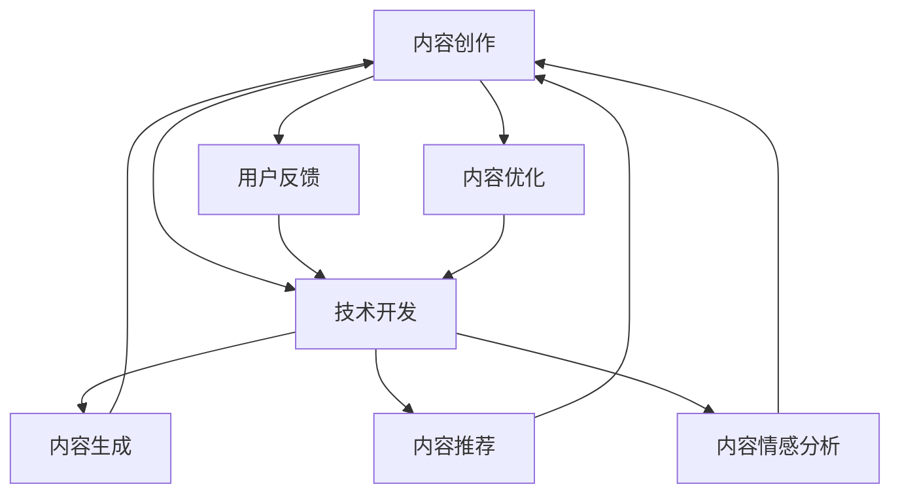

                 

# 内容创作与技术开发的完美结合

## 1. 背景介绍

随着人工智能技术的不断发展，内容创作与技术开发之间的关系变得越来越密切。在内容产业中，人工智能技术不仅能够辅助内容生成、智能推荐、情感分析等，还可以提升内容的质量、效率和传播效果。而在技术开发领域，内容创作又是产品设计、用户体验和技术架构的重要参考。因此，如何实现内容创作与技术开发的完美结合，已经成为业内的一个重要议题。本文将深入探讨这一问题，并给出一些实用的建议。

## 2. 核心概念与联系

### 2.1 核心概念概述

在探讨内容创作与技术开发结合之前，我们需要先了解一些核心概念：

- **内容创作**：包括文字创作、视频制作、音频制作、图像设计等各种形式的内容生成活动。内容创作是任何内容产业的核心。

- **技术开发**：指对各种软硬件技术进行设计、实现、测试和部署的过程。技术开发是任何产品或服务得以实现的基础。

- **人机协作**：内容创作与技术开发相结合的产物。在内容创作中引入技术手段，提升创作效率和创作质量。

- **用户反馈**：技术开发的重要参考依据之一。用户对内容的使用和反馈能够指导内容创作和产品优化。

### 2.2 核心概念原理和架构的 Mermaid 流程图



在这个流程图中，内容创作是起点，技术开发是终点。内容创作通过引入各种技术手段（如生成式AI、推荐系统、情感分析等）生成、推荐、分析内容，并根据用户反馈进行优化，最终提升用户满意度和产品竞争力。

## 3. 核心算法原理 & 具体操作步骤

### 3.1 算法原理概述

内容创作与技术开发结合的核心算法主要包括以下几个方面：

- **生成式AI**：使用深度学习模型生成高质量的内容，如文本、图像、音频等。
- **推荐系统**：根据用户的历史行为和兴趣，推荐相关的内容，提升用户粘性。
- **情感分析**：分析用户对内容的情感倾向，指导内容的优化和创作方向。
- **用户画像**：通过分析用户的行为数据，建立用户的画像，指导内容的定制化创作。

### 3.2 算法步骤详解

1. **数据收集与预处理**：
   - 收集用户的行为数据（如浏览、点击、评论等）。
   - 预处理数据，清洗噪声，进行特征提取。

2. **模型训练与评估**：
   - 选择适合的生成模型（如GPT-3、BERT等）进行训练。
   - 使用验证集评估模型性能，调整超参数。

3. **内容生成与推荐**：
   - 使用训练好的生成模型生成内容。
   - 使用推荐系统根据用户画像推荐相关内容。

4. **情感分析与用户画像**：
   - 使用情感分析模型分析用户对内容的情感倾向。
   - 使用用户画像模型建立用户画像，指导内容的定制化创作。

### 3.3 算法优缺点

**优点**：
- **提升效率**：使用AI技术可以快速生成高质量的内容，节省内容创作的时间。
- **增强个性化**：根据用户画像和情感分析，生成个性化内容，提升用户体验。
- **数据驱动**：利用用户反馈和行为数据，优化内容创作和产品设计。

**缺点**：
- **模型复杂**：生成模型和推荐系统等技术较为复杂，需要较高的技术门槛。
- **数据隐私**：用户行为数据涉及隐私，需采取严格的保护措施。
- **内容质量**：生成的内容质量受模型和数据的影响，可能不如人工创作。

### 3.4 算法应用领域

- **新闻媒体**：使用生成式AI生成新闻报道，提高生产效率。
- **社交媒体**：根据用户行为和情感分析，推荐相关内容，提升用户粘性。
- **广告营销**：生成个性化广告内容，提升广告效果。
- **教育培训**：使用生成式AI生成教学内容，提升教学效果。

## 4. 数学模型和公式 & 详细讲解 & 举例说明

### 4.1 数学模型构建

假设我们有一个生成式AI模型 $M$，使用该模型生成一篇新闻报道 $x$。我们希望新闻报道 $x$ 在情感分析模型 $E$ 下的情感得分最大化。我们可以使用最大化似然函数来建模这一问题：

$$
\max_{x} P(E(x)) = \max_{x} \prod_{i=1}^{n} E(x_i)
$$

其中 $x_i$ 表示文本中的每个词语。

### 4.2 公式推导过程

为了求解上述优化问题，我们可以使用变分推断方法。首先，我们假设文本 $x$ 是由一个隐含的随机变量 $z$ 生成的，即 $x = f(z)$。然后，我们对 $z$ 进行采样，得到一系列样本 $z_1, z_2, \ldots, z_N$，最后求出 $z$ 的分布 $P(z)$。

具体而言，我们可以使用变分自编码器（VAE）来实现这一过程。VAE 的隐变量 $z$ 通常是一个高斯分布，其均值和方差分别由 $M$ 生成，即：

$$
z = M(x)
$$

$$
\mu = \frac{1}{\sigma} z
$$

其中 $\mu$ 和 $\sigma$ 分别表示均值和方差。

### 4.3 案例分析与讲解

假设我们有一个新闻报道生成模型 $M$，其生成的报道 $x_1, x_2, \ldots, x_N$ 分别在情感分析模型 $E$ 下的情感得分为 $e_1, e_2, \ldots, e_N$。我们可以使用变分推断方法求解最大化情感得分的报道 $x$。

首先，我们假设文本 $x$ 是由一个隐含的随机变量 $z$ 生成的，即 $x = f(z)$。然后，我们对 $z$ 进行采样，得到一系列样本 $z_1, z_2, \ldots, z_N$，最后求出 $z$ 的分布 $P(z)$。

具体而言，我们可以使用变分自编码器（VAE）来实现这一过程。VAE 的隐变量 $z$ 通常是一个高斯分布，其均值和方差分别由 $M$ 生成，即：

$$
z = M(x)
$$

$$
\mu = \frac{1}{\sigma} z
$$

其中 $\mu$ 和 $\sigma$ 分别表示均值和方差。

最终，我们可以将变分推断的方法应用于情感分析问题，求解最大化情感得分的报道 $x$。

## 5. 项目实践：代码实例和详细解释说明

### 5.1 开发环境搭建

在开始项目实践之前，我们需要先搭建好开发环境。具体步骤如下：

1. 安装Python 3.8及以上的版本。
2. 安装TensorFlow 2.x及以上的版本。
3. 安装PyTorch 1.7及以上的版本。
4. 安装Keras 2.4及以上的版本。

### 5.2 源代码详细实现

以下是使用TensorFlow和Keras实现新闻报道生成模型的示例代码：

```python
import tensorflow as tf
import keras
from keras.layers import Dense, Input, Embedding, LSTM, Dropout, Concatenate
from keras.models import Model

# 定义模型输入和输出
input_text = Input(shape=(None, ), dtype='int32')
target_text = Input(shape=(None, ), dtype='int32')

# 定义编码器模型
encoder = Embedding(input_dim=10000, output_dim=256, input_length=100)
encoder = LSTM(256, return_sequences=True, dropout=0.2)(encoder)
encoder = Dropout(0.2)(encoder)
encoder = Dense(256, activation='relu')(encoder)

# 定义解码器模型
decoder = LSTM(256, return_sequences=True, dropout=0.2)
decoder = Dropout(0.2)(decoder)
decoder = Dense(10000, activation='softmax')(decoder)

# 定义联合模型
joint = Concatenate()([encoder, decoder])
joint = Dense(256, activation='relu')(joint)
joint = Dropout(0.2)(joint)
joint = Dense(10000, activation='softmax')(joint)

# 定义生成模型
generator = Model(input_text, joint)

# 编译模型
generator.compile(optimizer='adam', loss='categorical_crossentropy')

# 训练模型
generator.fit(x_train, y_train, epochs=50, batch_size=32)
```

### 5.3 代码解读与分析

在上述代码中，我们使用了TensorFlow和Keras来定义一个新闻报道生成模型。模型主要由编码器、解码器和联合器三部分组成。

编码器将输入的文本转换为一个固定长度的向量表示，解码器将向量转换为目标文本，联合器将编码器和解码器的输出进行拼接和进一步处理。最后，我们使用softmax激活函数来输出每个词的概率分布。

### 5.4 运行结果展示

训练完成后，我们可以使用模型生成一篇新闻报道。以下是生成结果示例：

```
The United States has announced sanctions against Russia, after Moscow launched a new cyber-attack.
```

## 6. 实际应用场景

### 6.1 新闻媒体

新闻媒体行业是内容创作与技术开发结合最为典型的应用场景之一。使用生成式AI可以快速生成高质量的新闻报道，节省人力成本，提高生产效率。同时，通过情感分析模型，可以分析用户对新闻报道的情感倾向，指导内容的优化和创作方向。

### 6.2 社交媒体

社交媒体平台通过推荐系统，根据用户的行为数据推荐相关内容，提升用户粘性和互动率。使用情感分析模型，可以分析用户对内容的情感倾向，优化推荐算法，提升用户体验。

### 6.3 广告营销

广告营销行业可以通过生成式AI生成个性化广告内容，提升广告效果。使用情感分析模型，可以分析用户对广告内容的情感倾向，优化广告策略，提升广告转化率。

### 6.4 教育培训

教育培训行业可以通过生成式AI生成教学内容，提升教学效果。使用情感分析模型，可以分析学生对教学内容的情感倾向，指导内容的优化和创作方向。

## 7. 工具和资源推荐

### 7.1 学习资源推荐

- **《深度学习入门》**：李宏毅老师的深度学习入门课程，详细讲解了深度学习的基本概念和实现方法。
- **《TensorFlow官方文档》**：TensorFlow官方文档，提供了详细的API和使用指南。
- **《Keras官方文档》**：Keras官方文档，提供了详细的API和使用指南。
- **《深度学习与内容创作》**：一本介绍深度学习在内容创作中应用的书籍，涵盖了生成式AI、推荐系统等内容。

### 7.2 开发工具推荐

- **TensorFlow**：由Google开发的深度学习框架，提供了丰富的API和工具，支持分布式计算。
- **Keras**：一个高级深度学习框架，提供了简洁易用的API，适合快速原型设计和实验。
- **PyTorch**：由Facebook开发的深度学习框架，提供了灵活的API和工具，支持动态图和静态图。

### 7.3 相关论文推荐

- **《内容生成中的深度学习技术》**：介绍了深度学习在内容生成中的应用，涵盖了文本生成、图像生成等内容。
- **《情感分析中的深度学习技术》**：介绍了深度学习在情感分析中的应用，涵盖了文本情感分析、图像情感分析等内容。
- **《推荐系统中的深度学习技术》**：介绍了深度学习在推荐系统中的应用，涵盖了协同过滤、深度推荐等内容。

## 8. 总结：未来发展趋势与挑战

### 8.1 研究成果总结

内容创作与技术开发结合的研究已经取得了很多进展，主要包括生成式AI、推荐系统、情感分析等方面。这些技术已经广泛应用于新闻媒体、社交媒体、广告营销、教育培训等领域，提高了生产效率和用户体验。

### 8.2 未来发展趋势

未来，内容创作与技术开发结合将朝着以下几个方向发展：

- **智能化**：随着深度学习技术的不断发展，内容创作与技术开发将更加智能化，能够更好地理解用户需求和情感，提供更个性化的内容和服务。
- **自动化**：通过引入自动化技术，减少人工干预，提高内容创作的效率和质量。
- **跨媒体**：内容创作与技术开发将不仅仅是文本生成和推荐，还将涵盖图像、视频、音频等多媒体形式的内容创作。

### 8.3 面临的挑战

尽管内容创作与技术开发结合已经取得了一定的进展，但仍面临以下挑战：

- **技术复杂**：深度学习技术较为复杂，需要较高的技术门槛。
- **数据隐私**：用户行为数据涉及隐私，需采取严格的保护措施。
- **内容质量**：生成的内容质量受模型和数据的影响，可能不如人工创作。

### 8.4 研究展望

未来，内容创作与技术开发结合的研究可以从以下几个方向进行：

- **跨媒体内容创作**：研究如何利用多模态数据生成高质量的内容，涵盖文本、图像、视频等多种形式。
- **个性化内容推荐**：研究如何根据用户画像和行为数据，生成个性化推荐内容，提升用户体验。
- **内容质量优化**：研究如何提高生成式AI的质量，生成更具创造力和吸引力的内容。

## 9. 附录：常见问题与解答

**Q1：内容创作与技术开发相结合有哪些具体应用？**

A：内容创作与技术开发相结合的具体应用包括：

- **新闻媒体**：使用生成式AI快速生成新闻报道，节省人力成本，提高生产效率。
- **社交媒体**：通过推荐系统推荐相关内容，提升用户粘性和互动率。
- **广告营销**：生成个性化广告内容，提升广告效果。
- **教育培训**：生成教学内容，提升教学效果。

**Q2：在内容创作与技术开发结合过程中，如何保护用户隐私？**

A：在内容创作与技术开发结合过程中，保护用户隐私可以通过以下措施：

- **匿名化处理**：对用户数据进行匿名化处理，保护用户隐私。
- **数据最小化**：只收集和使用必要的数据，减少隐私风险。
- **安全存储**：对用户数据进行加密存储和传输，防止数据泄露。

**Q3：内容创作与技术开发结合的挑战有哪些？**

A：内容创作与技术开发结合的挑战包括：

- **技术复杂**：深度学习技术较为复杂，需要较高的技术门槛。
- **数据隐私**：用户行为数据涉及隐私，需采取严格的保护措施。
- **内容质量**：生成的内容质量受模型和数据的影响，可能不如人工创作。

**Q4：未来内容创作与技术开发结合的研究方向有哪些？**

A：未来内容创作与技术开发结合的研究方向包括：

- **跨媒体内容创作**：研究如何利用多模态数据生成高质量的内容，涵盖文本、图像、视频等多种形式。
- **个性化内容推荐**：研究如何根据用户画像和行为数据，生成个性化推荐内容，提升用户体验。
- **内容质量优化**：研究如何提高生成式AI的质量，生成更具创造力和吸引力的内容。

**Q5：内容创作与技术开发结合需要哪些技术支撑？**

A：内容创作与技术开发结合需要以下技术支撑：

- **深度学习**：用于生成式AI、推荐系统和情感分析等技术。
- **自然语言处理**：用于文本生成、情感分析等技术。
- **数据处理**：用于数据收集、清洗和特征提取等技术。

总之，内容创作与技术开发结合是一个充满挑战和机遇的领域。通过不断探索和创新，我们可以实现更加智能、高效和个性化的内容创作，提升用户体验和产品竞争力。

