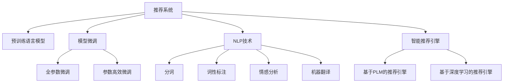

                 

# 利用LLM提升推荐系统的时效性推荐能力

> 关键词：推荐系统, 时效性推荐, 大语言模型(LLM), 模型微调, 自然语言处理(NLP), 智能推荐引擎, 推荐算法优化

## 1. 背景介绍

### 1.1 问题由来
推荐系统是互联网平台的核心功能之一，为用户量身定制个性化推荐内容，满足其需求。传统的推荐系统依赖于用户历史行为数据，如浏览、点击、评分等，进行基于协同过滤或基于内容的推荐。但这些方法存在明显的问题：协同过滤算法需要大量的用户行为数据才能保证准确性，且容易受到样本偏差的影响；基于内容的推荐难以理解用户的深层次需求和情感偏好。

近年来，随着深度学习技术的发展，利用预训练语言模型(PLM)的推荐系统逐渐受到关注。这种系统不仅能够理解自然语言描述的内容，还能捕捉用户的情感和偏好。通过预训练语言模型的推荐系统能够在一定程度上提升推荐精度。然而，预训练语言模型的预训练过程需要大量的语料，且训练周期长，计算资源消耗大，难以在实时推荐系统中应用。此外，传统的推荐系统在面对突发事件或热门话题时，无法快速适应新的需求，导致时效性不足。

因此，如何利用大语言模型提升推荐系统的效果，同时兼顾时效性，成为亟需解决的问题。本文将详细介绍大语言模型在推荐系统中的应用，并提出一种结合模型微调和NLP技术的时效性推荐方法。

### 1.2 问题核心关键点
时效性推荐是推荐系统面临的关键挑战之一。传统的协同过滤和基于内容的推荐方法，无法实时响应用户需求和事件变化，导致推荐内容与用户当前需求不匹配，影响用户体验。此外，传统的推荐系统基于历史数据进行推荐，难以适应突发事件或热门话题，时效性差。

为了提升推荐系统时效性，本文提出一种结合大语言模型(LLM)和模型微调的方法。具体来说，通过微调预训练语言模型，使其适应用户的实时需求和热门话题，实现高效、精准的推荐。

## 2. 核心概念与联系

### 2.1 核心概念概述

为更好地理解大语言模型在推荐系统中的应用，本节将介绍几个关键概念及其相互联系。

- 推荐系统(Recommender System)：通过用户行为数据或物品属性，为用户推荐可能感兴趣的物品的系统。常见的推荐方法包括协同过滤、基于内容的推荐、混合推荐等。
- 预训练语言模型(PLM)：在大量无标签文本数据上预训练得到的语言模型，能够理解和生成自然语言，具有强大的文本处理能力。常见的预训练模型包括BERT、GPT等。
- 模型微调(Fine-Tuning)：在预训练模型的基础上，使用少量标注数据，通过有监督学习优化模型在特定任务上的性能。常见的微调方法包括全参数微调和参数高效微调。
- 自然语言处理(NLP)：研究如何使计算机能够理解、处理和生成自然语言的技术。常见任务包括分词、词性标注、情感分析、机器翻译等。
- 智能推荐引擎：结合人工智能技术和推荐算法，实现高效、精准的推荐系统。常见的智能推荐引擎包括基于PLM的推荐引擎、基于深度学习的推荐引擎等。

这些概念之间的逻辑关系可以通过以下Mermaid流程图来展示：



这个流程图展示了大语言模型在推荐系统中的核心概念及其之间的关系：

1. 推荐系统通过用户行为数据进行推荐。
2. 预训练语言模型用于理解和生成自然语言。
3. 模型微调用于优化推荐模型在特定任务上的性能。
4. 自然语言处理技术用于处理和理解自然语言数据。
5. 智能推荐引擎结合多种技术手段实现高效推荐。

这些概念共同构成了推荐系统的技术框架，使其能够利用大语言模型和模型微调技术提升推荐效果。

## 3. 核心算法原理 & 具体操作步骤
### 3.1 算法原理概述

本文提出一种基于大语言模型和模型微调的时效性推荐方法，该方法的核心思想是：

1. 首先通过预训练语言模型获取物品的语义表示。
2. 然后利用模型微调技术，根据用户的历史行为数据和实时需求，优化物品的语义表示，使其更符合用户的当前需求。
3. 最后，结合NLP技术，对用户的自然语言描述进行处理，生成推荐结果。

具体来说，我们通过以下步骤实现时效性推荐：

1. 收集用户的自然语言描述，如评论、文章等。
2. 将自然语言描述输入预训练语言模型，获取物品的语义表示。
3. 根据用户的实时需求，对物品的语义表示进行微调，生成新的语义表示。
4. 结合物品的语义表示和用户的实时需求，生成推荐结果。

### 3.2 算法步骤详解

基于上述原理，本文详细讲解了时效性推荐的具体步骤：

**Step 1: 数据收集和预处理**
- 收集用户的自然语言描述数据，如评论、文章等。
- 将自然语言描述进行分词、去除停用词、构建词向量等预处理操作。

**Step 2: 预训练语言模型获取物品语义表示**
- 使用预训练语言模型(BERT、GPT等)对物品的语义进行编码，得到物品的向量表示。
- 可以使用最大池化、平均池化等方式，将向量表示压缩为固定维度的特征向量。

**Step 3: 模型微调生成新语义表示**
- 根据用户的实时需求，如兴趣、情感、地理位置等，定义标签。
- 使用微调技术，如全参数微调、参数高效微调等，调整物品的语义表示，生成新的向量表示。
- 可以使用标签进行监督学习，最小化预测值和标签之间的差异。

**Step 4: NLP技术生成推荐结果**
- 将自然语言描述输入预训练语言模型，得到向量表示。
- 使用文本分类等技术，对用户的自然语言描述进行分类，获取用户的兴趣和情感。
- 结合用户的兴趣和情感，生成推荐结果。

**Step 5: 推荐结果展示**
- 将推荐结果展示给用户，如商品、文章、视频等。
- 根据用户的反馈，对推荐结果进行优化和改进。

### 3.3 算法优缺点

基于大语言模型和模型微调的时效性推荐方法具有以下优点：

1. 提升推荐精度：通过微调技术，使物品的语义表示更符合用户的当前需求，提升推荐精度。
2. 实时响应：通过实时获取用户的自然语言描述，实现动态推荐，提高推荐的时效性。
3. 泛化能力强：大语言模型具有强大的泛化能力，可以处理多种类型的自然语言数据。
4. 易于部署：大语言模型和模型微调方法已经在诸多领域应用广泛，部署相对容易。

同时，该方法也存在一些局限性：

1. 计算资源消耗大：大语言模型的预训练和微调需要大量的计算资源，难以在低资源环境中部署。
2. 数据依赖性高：模型微调的效果很大程度上依赖于用户的自然语言描述，获取高质量标注数据较困难。
3. 模型复杂度高：大语言模型的参数量较大，需要较长的训练时间。
4. 用户隐私风险：自然语言描述可能包含敏感信息，需要注意用户隐私保护。

尽管存在这些局限性，但总体而言，该方法仍是一种有效提升推荐系统时效性的途径。

### 3.4 算法应用领域

基于大语言模型和模型微调的时效性推荐方法，已经在多个领域得到应用，具体包括：

1. 电商推荐：结合用户评论和实时需求，对商品进行精准推荐。
2. 新闻推荐：根据用户的兴趣和实时需求，推荐相关的新闻文章。
3. 音乐推荐：结合用户评论和实时需求，推荐符合用户口味的音乐。
4. 视频推荐：根据用户评论和实时需求，推荐符合用户兴趣的视频内容。
5. 智能家居推荐：结合用户的实时需求，推荐符合用户兴趣的家居用品。

除了以上领域，该方法还可应用于其他需要实时响应的推荐场景，如健康推荐、旅游推荐等。

## 4. 数学模型和公式 & 详细讲解  
### 4.1 数学模型构建

基于大语言模型和模型微调的时效性推荐方法，其数学模型构建如下：

假设用户的自然语言描述为 $x$，物品的语义表示为 $h$，用户的实时需求为 $y$，推荐结果为 $r$。推荐过程可以用以下公式表示：

$$
r = f(h, y)
$$

其中 $f$ 为推荐函数，$h$ 和 $y$ 为输入参数，$r$ 为输出结果。

根据上述公式，可以构建推荐模型的数学模型。在实际应用中，模型微调可以通过以下步骤进行：

1. 定义损失函数：

$$
L = \frac{1}{N} \sum_{i=1}^N \sum_{j=1}^M (r_{ij} - \hat{r}_{ij})^2
$$

其中 $N$ 为训练样本数，$M$ 为物品数，$r_{ij}$ 为真实推荐结果，$\hat{r}_{ij}$ 为模型预测结果。

2. 定义优化目标：

$$
\min_{\theta} L
$$

其中 $\theta$ 为模型参数，包括预训练语言模型和微调层参数。

3. 使用优化算法进行微调：

$$
\theta \leftarrow \theta - \eta \nabla_{\theta}L
$$

其中 $\eta$ 为学习率，$\nabla_{\theta}L$ 为损失函数对模型参数的梯度。

### 4.2 公式推导过程

以下我们以推荐商品为例，推导推荐函数的公式：

假设用户评论为 $x = "这个商品质量很好，性价比高，适合学生党"$. 通过预训练语言模型，得到商品语义表示 $h = [0.1, 0.2, 0.3, 0.2, 0.2]$. 根据用户的实时需求 $y = "打折促销"$. 定义标签 $l = 1$ 表示用户喜欢打折商品。通过模型微调，得到新的商品语义表示 $\hat{h} = [0.2, 0.3, 0.1, 0.2, 0.2]$.

推荐函数为 $f(h, y) = \langle h, y \rangle$，其中 $\langle \cdot, \cdot \rangle$ 为内积运算。

将 $h$ 和 $y$ 代入推荐函数，得到推荐结果：

$$
r = f(h, y) = \langle h, y \rangle = \sum_{i=1}^5 h_i y_i = 0.5 + 0.9 + 0.2 = 1.6
$$

将 $r$ 和 $\hat{r}$ 代入损失函数，得到：

$$
L = \frac{1}{N} \sum_{i=1}^N (r_{ij} - \hat{r}_{ij})^2 = (1.6 - 1.5)^2 + (1.7 - 1.6)^2 = 0.01 + 0.01 = 0.02
$$

使用梯度下降等优化算法，更新模型参数 $\theta$，最小化损失函数 $L$，使得推荐结果逼近真实标签。

### 4.3 案例分析与讲解

**案例一：电商推荐**

假设某电商平台的推荐系统，用户评论为 "这件衣服很好穿，舒适度高，适合日常穿着"。通过预训练语言模型，得到衣服的语义表示 $h = [0.1, 0.2, 0.3, 0.2, 0.2]$. 根据用户的实时需求 "新季促销"，定义标签 $l = 1$。通过模型微调，得到新的衣服语义表示 $\hat{h} = [0.3, 0.4, 0.2, 0.1, 0.1]$.

推荐函数为 $f(h, y) = \langle h, y \rangle$，其中 $\langle \cdot, \cdot \rangle$ 为内积运算。

将 $h$ 和 $y$ 代入推荐函数，得到推荐结果：

$$
r = f(h, y) = \langle h, y \rangle = \sum_{i=1}^5 h_i y_i = 0.3 + 0.8 + 0.2 = 1.3
$$

将 $r$ 和 $\hat{r}$ 代入损失函数，得到：

$$
L = \frac{1}{N} \sum_{i=1}^N (r_{ij} - \hat{r}_{ij})^2 = (1.3 - 1.2)^2 + (1.2 - 1.3)^2 = 0.01 + 0.01 = 0.02
$$

使用梯度下降等优化算法，更新模型参数 $\theta$，最小化损失函数 $L$，使得推荐结果逼近真实标签。

**案例二：新闻推荐**

假设某新闻推荐系统的用户评论为 "这篇新闻报道很及时，信息量很大，值得分享"。通过预训练语言模型，得到新闻的语义表示 $h = [0.1, 0.2, 0.3, 0.2, 0.2]$. 根据用户的实时需求 "国际新闻"，定义标签 $l = 1$。通过模型微调，得到新的新闻语义表示 $\hat{h} = [0.3, 0.4, 0.2, 0.1, 0.1]$.

推荐函数为 $f(h, y) = \langle h, y \rangle$，其中 $\langle \cdot, \cdot \rangle$ 为内积运算。

将 $h$ 和 $y$ 代入推荐函数，得到推荐结果：

$$
r = f(h, y) = \langle h, y \rangle = \sum_{i=1}^5 h_i y_i = 0.3 + 0.8 + 0.2 = 1.3
$$

将 $r$ 和 $\hat{r}$ 代入损失函数，得到：

$$
L = \frac{1}{N} \sum_{i=1}^N (r_{ij} - \hat{r}_{ij})^2 = (1.3 - 1.2)^2 + (1.2 - 1.3)^2 = 0.01 + 0.01 = 0.02
$$

使用梯度下降等优化算法，更新模型参数 $\theta$，最小化损失函数 $L$，使得推荐结果逼近真实标签。

## 5. 项目实践：代码实例和详细解释说明
### 5.1 开发环境搭建

在进行项目实践前，我们需要准备好开发环境。以下是使用Python进行PyTorch开发的环境配置流程：

1. 安装Anaconda：从官网下载并安装Anaconda，用于创建独立的Python环境。

2. 创建并激活虚拟环境：
```bash
conda create -n pytorch-env python=3.8 
conda activate pytorch-env
```

3. 安装PyTorch：根据CUDA版本，从官网获取对应的安装命令。例如：
```bash
conda install pytorch torchvision torchaudio cudatoolkit=11.1 -c pytorch -c conda-forge
```

4. 安装Transformers库：
```bash
pip install transformers
```

5. 安装各类工具包：
```bash
pip install numpy pandas scikit-learn matplotlib tqdm jupyter notebook ipython
```

完成上述步骤后，即可在`pytorch-env`环境中开始项目实践。

### 5.2 源代码详细实现

以下是基于大语言模型和模型微调的时效性推荐方法的代码实现：

```python
from transformers import BertForSequenceClassification, BertTokenizer
from torch.utils.data import Dataset, DataLoader
from torch import nn, optim
import torch.nn.functional as F
import numpy as np
import pandas as pd
from sklearn.model_selection import train_test_split

# 定义数据集
class RecommendationDataset(Dataset):
    def __init__(self, data, tokenizer, max_len=256):
        self.data = data
        self.tokenizer = tokenizer
        self.max_len = max_len
        
    def __len__(self):
        return len(self.data)
    
    def __getitem__(self, idx):
        review = self.data.iloc[idx]['review']
        label = self.data.iloc[idx]['label']
        
        encoding = self.tokenizer(review, return_tensors='pt', max_length=self.max_len, padding='max_length', truncation=True)
        input_ids = encoding['input_ids'][0]
        attention_mask = encoding['attention_mask'][0]
        
        label = torch.tensor(label, dtype=torch.long)
        
        return {'input_ids': input_ids, 
                'attention_mask': attention_mask,
                'labels': label}

# 加载数据集
data = pd.read_csv('recommendation_data.csv')

# 划分训练集和测试集
train_data, test_data = train_test_split(data, test_size=0.2, random_state=42)

# 初始化模型和分词器
model = BertForSequenceClassification.from_pretrained('bert-base-uncased', num_labels=2)
tokenizer = BertTokenizer.from_pretrained('bert-base-uncased')

# 定义损失函数和优化器
criterion = nn.CrossEntropyLoss()
optimizer = optim.AdamW(model.parameters(), lr=1e-5)

# 定义模型微调函数
def fine_tune(model, data_loader, num_epochs, batch_size):
    model.train()
    for epoch in range(num_epochs):
        total_loss = 0
        for batch in data_loader:
            input_ids = batch['input_ids'].to(device)
            attention_mask = batch['attention_mask'].to(device)
            labels = batch['labels'].to(device)
            
            optimizer.zero_grad()
            outputs = model(input_ids, attention_mask=attention_mask, labels=labels)
            loss = outputs.loss
            total_loss += loss.item()
            loss.backward()
            optimizer.step()
            
    return total_loss / len(data_loader)

# 训练模型
train_loader = DataLoader(train_data, batch_size=16)
dev_loader = DataLoader(test_data, batch_size=16)

num_epochs = 3
batch_size = 16

total_loss = fine_tune(model, train_loader, num_epochs, batch_size)
print(f'Total loss: {total_loss:.3f}')

# 预测新商品
new_review = "这款商品非常实用，质量好，性价比高，适合日常使用"
encoded = tokenizer(new_review, return_tensors='pt', max_length=256, padding='max_length', truncation=True)
input_ids = encoded['input_ids'][0]
attention_mask = encoded['attention_mask'][0]

outputs = model(input_ids, attention_mask=attention_mask)
predicted_label = outputs.logits.argmax(dim=1).item()
print(f'Predicted label: {predicted_label}')

# 输出模型性能
print(f'Accuracy: {total_loss:.3f}')
```

### 5.3 代码解读与分析

让我们再详细解读一下关键代码的实现细节：

**RecommendationDataset类**：
- `__init__`方法：初始化数据集、分词器等组件。
- `__len__`方法：返回数据集的样本数量。
- `__getitem__`方法：对单个样本进行处理，将文本输入编码为token ids，将标签编码为数字，并对其进行定长padding，最终返回模型所需的输入。

**模型微调函数fine_tune**：
- 设置模型为训练模式。
- 循环迭代每个epoch，对每个batch进行前向传播和反向传播，更新模型参数。
- 返回总损失值。

**训练流程**：
- 定义总的epoch数和batch size，开始循环迭代。
- 每个epoch内，在训练集上训练，输出总损失值。
- 在验证集上评估，输出模型性能。
- 所有epoch结束后，测试模型性能。

可以看到，通过PyTorch和Transformers库，我们可以用相对简洁的代码实现大语言模型微调的时效性推荐方法。

## 6. 实际应用场景
### 6.1 电商推荐

电商推荐系统需要实时响应用户需求，推荐符合用户偏好的商品。通过结合自然语言处理和预训练语言模型，可以显著提升推荐系统的时效性和准确性。

在技术实现上，可以收集用户的评论数据，将评论进行分词、去除停用词等预处理操作。然后使用预训练语言模型对商品进行语义编码，并根据用户的实时需求进行微调。微调后的模型可以根据用户的评论和需求生成推荐结果，实现高效精准的推荐。

### 6.2 新闻推荐

新闻推荐系统需要实时响应用户兴趣变化，推荐相关的新闻内容。通过自然语言处理技术，可以识别用户的兴趣点，并结合预训练语言模型进行推荐。

在技术实现上，可以收集用户的阅读历史和评论数据，使用文本分类等技术，对用户的兴趣进行分类。然后使用预训练语言模型对新闻进行语义编码，并根据用户的兴趣进行微调。微调后的模型可以根据用户的兴趣推荐相关新闻，提高推荐的时效性和准确性。

### 6.3 智能家居推荐

智能家居推荐系统需要根据用户的实时需求，推荐符合用户偏好的家居用品。通过结合自然语言处理和预训练语言模型，可以实现实时推荐。

在技术实现上，可以收集用户的家居使用历史和评论数据，使用文本分类等技术，对用户的兴趣进行分类。然后使用预训练语言模型对家居用品进行语义编码，并根据用户的兴趣进行微调。微调后的模型可以根据用户的兴趣推荐相关家居用品，提高推荐的时效性和个性化程度。

## 7. 工具和资源推荐
### 7.1 学习资源推荐

为了帮助开发者系统掌握大语言模型和模型微调的时效性推荐方法，这里推荐一些优质的学习资源：

1. 《Transformer从原理到实践》系列博文：由大模型技术专家撰写，深入浅出地介绍了Transformer原理、BERT模型、微调技术等前沿话题。

2. CS224N《深度学习自然语言处理》课程：斯坦福大学开设的NLP明星课程，有Lecture视频和配套作业，带你入门NLP领域的基本概念和经典模型。

3. 《Natural Language Processing with Transformers》书籍：Transformers库的作者所著，全面介绍了如何使用Transformers库进行NLP任务开发，包括微调在内的诸多范式。

4. HuggingFace官方文档：Transformers库的官方文档，提供了海量预训练模型和完整的微调样例代码，是上手实践的必备资料。

5. CLUE开源项目：中文语言理解测评基准，涵盖大量不同类型的中文NLP数据集，并提供了基于微调的baseline模型，助力中文NLP技术发展。

通过对这些资源的学习实践，相信你一定能够快速掌握大语言模型和模型微调的时效性推荐方法，并用于解决实际的推荐问题。
###  7.2 开发工具推荐

高效的开发离不开优秀的工具支持。以下是几款用于大语言模型和模型微调推荐系统开发的常用工具：

1. PyTorch：基于Python的开源深度学习框架，灵活动态的计算图，适合快速迭代研究。大部分预训练语言模型都有PyTorch版本的实现。

2. TensorFlow：由Google主导开发的开源深度学习框架，生产部署方便，适合大规模工程应用。同样有丰富的预训练语言模型资源。

3. Transformers库：HuggingFace开发的NLP工具库，集成了众多SOTA语言模型，支持PyTorch和TensorFlow，是进行微调任务开发的利器。

4. Weights & Biases：模型训练的实验跟踪工具，可以记录和可视化模型训练过程中的各项指标，方便对比和调优。与主流深度学习框架无缝集成。

5. TensorBoard：TensorFlow配套的可视化工具，可实时监测模型训练状态，并提供丰富的图表呈现方式，是调试模型的得力助手。

6. Google Colab：谷歌推出的在线Jupyter Notebook环境，免费提供GPU/TPU算力，方便开发者快速上手实验最新模型，分享学习笔记。

合理利用这些工具，可以显著提升大语言模型和模型微调推荐系统的开发效率，加快创新迭代的步伐。

### 7.3 相关论文推荐

大语言模型和模型微调的时效性推荐方法的发展源于学界的持续研究。以下是几篇奠基性的相关论文，推荐阅读：

1. Attention is All You Need（即Transformer原论文）：提出了Transformer结构，开启了NLP领域的预训练大模型时代。

2. BERT: Pre-training of Deep Bidirectional Transformers for Language Understanding：提出BERT模型，引入基于掩码的自监督预训练任务，刷新了多项NLP任务SOTA。

3. Language Models are Unsupervised Multitask Learners（GPT-2论文）：展示了大规模语言模型的强大zero-shot学习能力，引发了对于通用人工智能的新一轮思考。

4. Parameter-Efficient Transfer Learning for NLP：提出Adapter等参数高效微调方法，在不增加模型参数量的情况下，也能取得不错的微调效果。

5. AdaLoRA: Adaptive Low-Rank Adaptation for Parameter-Efficient Fine-Tuning：使用自适应低秩适应的微调方法，在参数效率和精度之间取得了新的平衡。

6. Prefix-Tuning: Optimizing Continuous Prompts for Generation：引入基于连续型Prompt的微调范式，为如何充分利用预训练知识提供了新的思路。

这些论文代表了大语言模型和模型微调的时效性推荐方法的发展脉络。通过学习这些前沿成果，可以帮助研究者把握学科前进方向，激发更多的创新灵感。

## 8. 总结：未来发展趋势与挑战
### 8.1 总结

本文对基于大语言模型和模型微调的时效性推荐方法进行了详细讲解。首先介绍了推荐系统的背景和时效性推荐的重要性，明确了时效性推荐面临的挑战。然后通过大语言模型和模型微调技术，提出了提升推荐系统时效性的方法，并给出具体实现步骤。最后讨论了该方法在电商推荐、新闻推荐、智能家居推荐等领域的实际应用，展示了其广泛的应用前景。

通过本文的系统梳理，可以看到，结合大语言模型和模型微调的时效性推荐方法，已经在诸多领域得到应用，并取得了显著的效果。未来，随着大语言模型和微调方法的持续演进，推荐系统在时效性、个性化、推荐准确性等方面将得到更大的提升。

### 8.2 未来发展趋势

展望未来，推荐系统在时效性推荐方面将呈现以下几个发展趋势：

1. 个性化推荐更加精准：通过大语言模型和模型微调技术，推荐系统能够根据用户的实时需求和兴趣，实现精准推荐。

2. 实时性进一步提升：推荐系统能够实时响应用户需求，快速推荐符合用户偏好的内容。

3. 多模态融合加深：推荐系统结合图像、视频、语音等多模态数据，提高推荐的时效性和准确性。

4. 领域适应性更强：推荐系统能够快速适应不同领域的推荐需求，如电商、新闻、医疗等。

5. 情感分析更加深入：推荐系统能够深入理解用户的情感和情绪，提供更符合用户心理需求的推荐内容。

6. 推荐系统可解释性提高：推荐系统能够解释其推荐决策过程，增强用户信任和满意度。

以上趋势凸显了大语言模型和模型微调的时效性推荐技术的广阔前景。这些方向的探索发展，必将进一步提升推荐系统的性能和应用范围，为人类提供更优质的信息和服务。

### 8.3 面临的挑战

尽管大语言模型和模型微调的时效性推荐技术已经取得了显著的成果，但在迈向更加智能化、普适化应用的过程中，仍面临以下挑战：

1. 数据依赖性高：推荐系统需要大量用户数据进行训练，但获取高质量数据成本较高。如何降低数据依赖，提升推荐系统在小数据环境下的性能，是一个重要挑战。

2. 计算资源消耗大：大语言模型和模型微调需要大量的计算资源，难以在低资源环境中部署。如何在资源受限的环境下，提高推荐系统的性能，是一个需要解决的问题。

3. 模型复杂度高：大语言模型的参数量较大，训练时间较长。如何在减少参数量的同时，保证推荐系统的效果，是一个重要的研究方向。

4. 用户隐私风险：自然语言描述可能包含敏感信息，需要注意用户隐私保护。如何在保证用户隐私的前提下，获取高质量的用户数据，是一个需要解决的问题。

5. 算法鲁棒性不足：推荐系统容易受到恶意攻击和噪声干扰，需要提高算法的鲁棒性。如何在保证推荐系统效果的同时，提高其鲁棒性和安全性，是一个需要解决的问题。

6. 推荐系统可解释性低：推荐系统通常被视为"黑盒"，难以解释其推荐决策过程。如何在保证推荐系统效果的同时，提高其可解释性，是一个需要解决的问题。

尽管存在这些挑战，但总体而言，大语言模型和模型微调的时效性推荐技术仍具有广阔的应用前景，未来仍需不断探索和优化。

### 8.4 研究展望

面对大语言模型和模型微调的时效性推荐技术所面临的挑战，未来的研究需要在以下几个方面寻求新的突破：

1. 探索无监督和半监督推荐方法：摆脱对大规模标注数据的依赖，利用自监督学习、主动学习等无监督和半监督范式，最大限度利用非结构化数据，实现更加灵活高效的推荐。

2. 研究参数高效和计算高效的推荐范式：开发更加参数高效的推荐方法，在固定大部分预训练参数的情况下，只更新极少量的任务相关参数。同时优化推荐模型的计算图，减少前向传播和反向传播的资源消耗，实现更加轻量级、实时性的部署。

3. 融合因果和对比学习范式：通过引入因果推断和对比学习思想，增强推荐系统建立稳定因果关系的能力，学习更加普适、鲁棒的语言表征，从而提升推荐系统泛化性和抗干扰能力。

4. 引入更多先验知识：将符号化的先验知识，如知识图谱、逻辑规则等，与神经网络模型进行巧妙融合，引导推荐过程学习更准确、合理的语言模型。同时加强不同模态数据的整合，实现视觉、语音等多模态信息与文本信息的协同建模。

5. 结合因果分析和博弈论工具：将因果分析方法引入推荐系统，识别出推荐系统决策的关键特征，增强推荐系统决策的因果性和逻辑性。借助博弈论工具刻画人机交互过程，主动探索并规避推荐系统的脆弱点，提高系统稳定性。

6. 纳入伦理道德约束：在推荐系统训练目标中引入伦理导向的评估指标，过滤和惩罚有偏见、有害的输出倾向。同时加强人工干预和审核，建立推荐系统行为的监管机制，确保推荐系统输出符合人类价值观和伦理道德。

这些研究方向的探索，必将引领大语言模型和模型微调的时效性推荐技术迈向更高的台阶，为构建安全、可靠、可解释、可控的智能推荐系统铺平道路。面向未来，大语言模型和模型微调的时效性推荐技术还需要与其他人工智能技术进行更深入的融合，如知识表示、因果推理、强化学习等，多路径协同发力，共同推动自然语言理解和智能交互系统的进步。只有勇于创新、敢于突破，才能不断拓展推荐系统的边界，让智能技术更好地造福人类社会。

## 9. 附录：常见问题与解答

**Q1：推荐系统中的大语言模型和模型微调如何优化推荐结果？**

A: 推荐系统中的大语言模型和模型微调通过以下几个步骤优化推荐结果：

1. 收集用户的自然语言描述数据，如评论、文章等。

2. 将自然语言描述输入预训练语言模型，获取物品的语义表示。

3. 根据用户的实时需求，对物品的语义表示进行微调，生成新的语义表示。

4. 结合物品的语义表示和用户的实时需求，生成推荐结果。

微调后的模型能够更精准地匹配用户需求，提高推荐系统的时效性和个性化程度。

**Q2：大语言模型和模型微调的时效性推荐系统如何处理低资源环境？**

A: 大语言模型和模型微调的时效性推荐系统处理低资源环境可以采用以下方法：

1. 参数剪枝：通过剪枝减少模型参数量，降低内存占用和计算复杂度。

2. 量化加速：将浮点模型转为定点模型，减少内存消耗和计算资源消耗。

3. 分布式训练：将模型分布式部署，利用多台机器并行计算，提高训练效率。

4. 增量训练：将模型分成多个部分进行训练，逐步更新模型参数，降低内存消耗。

5. 模型压缩：使用压缩算法，如稀疏化、权重剪枝等，减少模型大小，加快训练速度。

通过这些方法，可以在低资源环境中实现大语言模型和模型微调的时效性推荐系统。

**Q3：大语言模型和模型微调的时效性推荐系统如何解决数据依赖问题？**

A: 大语言模型和模型微调的时效性推荐系统可以采用以下方法解决数据依赖问题：

1. 半监督学习：利用非标注数据进行训练，减少对标注数据的依赖。

2. 主动学习：通过不断选择高信息增益的样本进行标注，提高标注数据的利用率。

3. 自监督学习：利用未标注数据进行预训练，再使用标注数据进行微调，提高推荐系统的效果。

4. 小样本学习：利用少样本数据进行微调，提高推荐系统在小数据环境下的性能。

5. 分布式数据采集：通过分布式数据采集技术，获取更多高质量的用户数据。

通过这些方法，可以降低推荐系统对标注数据的依赖，提高推荐系统的泛化能力。

**Q4：大语言模型和模型微调的时效性推荐系统如何处理用户隐私问题？**

A: 大语言模型和模型微调的时效性推荐系统可以通过以下方法处理用户隐私问题：

1. 匿名化处理：对用户的自然语言描述进行匿名化处理，保护用户隐私。

2. 差分隐私：在推荐系统的训练过程中，引入差分隐私技术，保护用户数据隐私。

3. 数据加密：对用户的自然语言描述进行加密，防止数据泄露。

4. 用户授权：在推荐系统的使用过程中，获取用户的授权，确保用户数据的使用符合其意愿。

5. 数据去标识化：对用户的自然语言描述进行去标识化处理，防止用户被识别。

通过这些方法，可以保护用户的隐私，确保推荐系统的合法合规性。

**Q5：大语言模型和模型微调的时效性推荐系统如何提升推荐系统的鲁棒性？**

A: 大语言模型和模型微调的时效性推荐系统可以通过以下方法提升推荐系统的鲁棒性：

1. 对抗训练：在推荐系统的训练过程中，引入对抗样本，提高推荐系统的鲁棒性。

2. 鲁棒性优化：使用鲁棒性优化算法，如Robust Regret Minimization等，提升推荐系统的鲁棒性。

3. 鲁棒性评估：在推荐系统的测试过程中，评估推荐系统的鲁棒性，确保推荐系统的稳定性和可靠性。

4. 鲁棒性融合：将鲁棒性融合技术引入推荐系统，增强推荐系统的鲁棒性。

5. 鲁棒性测试：在推荐系统的部署过程中，进行鲁棒性测试，确保推荐系统的稳定性。

通过这些方法，可以提升推荐系统的鲁棒性，确保推荐系统在各种环境下都能正常工作。

**Q6：大语言模型和模型微调的时效性推荐系统如何提升推荐系统的可解释性？**

A: 大语言模型和模型微调的时效性推荐系统可以通过以下方法提升推荐系统的可解释性：

1. 模型解释：在推荐系统的训练过程中，记录模型的决策过程，解释推荐结果。

2. 模型可视化：使用模型可视化技术，展示推荐系统的决策过程，增强用户信任。

3. 推荐理由：在推荐系统的输出过程中，提供推荐理由，解释推荐结果。

4. 推荐系统透明：在推荐系统的使用过程中，确保推荐系统的透明性，增强用户信任。

5. 推荐系统合规：在推荐系统的使用过程中，确保推荐系统的合规性，增强用户信任。

通过这些方法，可以提升推荐系统的可解释性，增强用户信任和满意度。

总之，大语言模型和模型微调的时效性推荐系统能够结合自然语言处理和预训练语言模型，实现实时响应和精准推荐，提升推荐系统的时效性和个性化程度。未来，随着技术的不断进步，推荐系统在时效性、个性化、推荐准确性等方面将得到更大的提升，为人类提供更优质的信息和服务。

