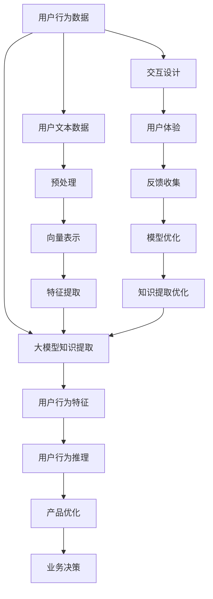

                 

# 利用大模型知识和推理能力理解用户行为

> 关键词：大模型知识提取,用户行为理解,推理能力,自然语言处理(NLP),深度学习,交互设计

## 1. 背景介绍

### 1.1 问题由来

在数字化和智能化的时代浪潮中，如何更准确、高效地理解用户行为，成为各大互联网公司和产品团队关注的焦点。传统的统计分析、问卷调查等方法，往往需要大量时间和资源，且难以捕捉用户行为的动态变化。而利用大模型和推理技术，可以大幅提升用户行为理解的精准度和时效性，为业务决策提供有力的数据支撑。

### 1.2 问题核心关键点

利用大模型理解和推理用户行为的核心在于：

1. **知识提取**：从海量的用户文本数据中，提取有价值的知识结构，如用户偏好、行为模式、情绪状态等。
2. **推理能力**：在提取的知识基础上，通过大模型的推理能力，预测用户未来行为或解释当前行为背后的动机。
3. **数据驱动**：将推理结果作为决策依据，推动产品迭代和业务优化。

### 1.3 问题研究意义

理解和推理用户行为，对于提升用户体验、优化产品设计、增加用户粘性、驱动业务增长具有重要意义。大模型的推理能力，使得产品团队能够更快速、精准地把握用户需求，实现业务的精细化运营和差异化服务。

## 2. 核心概念与联系

### 2.1 核心概念概述

为更好地理解利用大模型知识提取和推理用户行为的方法，本节将介绍几个密切相关的核心概念：

- **大模型知识提取**：指通过大模型对用户文本数据进行特征提取和模式识别，获取用户行为的关键特征和知识结构。
- **用户行为推理**：指在提取的知识基础上，利用大模型的推理能力，对用户行为进行预测或解释。
- **自然语言处理(NLP)**：指通过计算机处理和理解人类语言的技术，包括文本分析、情感分析、语义理解等。
- **深度学习**：指利用多层次神经网络模型对复杂数据进行学习和表示的技术，广泛应用于图像、语音、文本等领域。
- **交互设计**：指设计和优化用户与系统的交互方式，提升用户体验和满意度。
- **用户行为预测**：指利用大模型推理技术，预测用户未来的行为选择，为产品迭代和业务决策提供参考。

这些核心概念之间的逻辑关系可以通过以下Mermaid流程图来展示：



这个流程图展示了大模型知识提取和推理用户行为的总体流程：

1. 用户行为数据通过预处理和向量表示，输入大模型进行特征提取。
2. 大模型提取用户行为特征，生成用户行为知识。
3. 在知识基础上，利用推理能力预测用户行为，推动产品优化。
4. 产品优化和用户体验的提升，进一步反馈到模型，实现闭环优化。

## 3. 核心算法原理 & 具体操作步骤
### 3.1 算法原理概述

利用大模型知识提取和推理用户行为，本质上是一个将用户文本数据转化为结构化知识并用于推理预测的过程。其核心思想是：

- **知识提取**：将用户文本数据映射为向量表示，并通过大模型的特征提取能力，从文本中抽取出有价值的行为特征。
- **推理预测**：在提取的知识基础上，利用大模型的推理能力，对用户行为进行预测或解释。

形式化地，假设用户行为数据为 $\mathcal{D}$，用户文本数据为 $\mathcal{X}$，大模型为 $M$，提取的知识为 $K$，推理预测结果为 $Y$。知识提取和推理预测的流程可以表示为：

$$
K = M(\mathcal{X}) \\
Y = M(K)
$$

其中，$M$ 表示大模型，可以是Transformer、BERT等预训练语言模型。$\mathcal{X}$ 表示用户文本数据，$\mathcal{D}$ 表示用户行为数据。

### 3.2 算法步骤详解

利用大模型知识提取和推理用户行为的具体步骤如下：

**Step 1: 准备用户行为数据和文本数据**
- 收集用户行为数据，如浏览记录、点击日志、搜索历史等。
- 收集用户文本数据，如评论、留言、聊天记录等。

**Step 2: 数据预处理**
- 对用户行为数据进行清洗和标注，去除噪声和异常值。
- 对用户文本数据进行分词、去除停用词等预处理操作。

**Step 3: 向量表示**
- 使用Word2Vec、GloVe等词向量模型，将用户文本数据转化为向量表示。
- 对于长文本，可以使用TF-IDF、BERT等方法进行降维和编码。

**Step 4: 特征提取**
- 将向量表示输入到大模型进行特征提取，获取用户行为的关键特征。
- 可以使用Transformer、BERT等预训练语言模型，进行特征提取和模式识别。

**Step 5: 推理预测**
- 在提取的知识基础上，利用大模型的推理能力，对用户行为进行预测或解释。
- 可以使用推理框架，如PyTorch、TensorFlow等，构建预测模型。

**Step 6: 模型评估与优化**
- 在验证集上评估模型的预测性能，使用准确率、召回率、F1分数等指标。
- 根据评估结果，优化模型的超参数和结构，提升推理准确性。

### 3.3 算法优缺点

利用大模型知识提取和推理用户行为的方法具有以下优点：

1. **高效准确**：大模型通过大规模预训练获得了丰富的语言知识和推理能力，可以在较短的时间内高效地提取和推理用户行为。
2. **适应性强**：大模型可以在不同领域、不同规模的数据上表现良好，具有较强的泛化能力。
3. **可解释性好**：大模型的推理过程可以通过 attentions、feature maps 等机制进行可视化，帮助理解用户行为背后的动机。

同时，该方法也存在以下局限性：

1. **依赖数据质量**：模型的效果很大程度上依赖于输入数据的质量，低质量数据可能导致模型推理失效。
2. **计算资源需求高**：大规模预训练和推理过程需要较高的计算资源，对硬件要求较高。
3. **复杂度较高**：构建和大模型推理相关的模型结构和优化算法较为复杂，需要一定的专业知识和经验。

尽管存在这些局限性，但就目前而言，利用大模型知识提取和推理用户行为的方法，在大规模应用场景下，仍具有显著优势。

### 3.4 算法应用领域

利用大模型知识提取和推理用户行为的方法，在NLP和产品设计领域有着广泛的应用，例如：

- **推荐系统**：通过用户文本数据，提取用户偏好和行为特征，预测用户对特定商品或内容的态度，实现个性化推荐。
- **智能客服**：利用用户对话历史，提取用户情绪和意图，提供个性化的回答和建议，提升客户满意度。
- **社交网络分析**：通过用户评论和互动数据，提取社交网络特征，预测用户行为变化趋势，帮助企业把握市场动态。
- **市场营销**：利用用户反馈和行为数据，提取用户情感和偏好，指导产品设计和市场推广策略。
- **健康医疗**：通过患者文本数据，提取行为和情绪特征，预测疾病发展和治疗效果，辅助医生决策。
- **智能家居**：通过用户行为数据，提取习惯和偏好，实现智能设备自动化控制和推荐，提升用户生活便捷性。

除了上述这些应用外，大模型知识提取和推理用户行为的方法，还在金融、教育、交通等多个领域，为各种业务决策提供有力支持。

## 4. 数学模型和公式 & 详细讲解  
### 4.1 数学模型构建

本节将使用数学语言对利用大模型知识提取和推理用户行为的过程进行更加严格的刻画。

假设用户文本数据为 $\mathcal{X}=\{x_1,x_2,...,x_N\}$，大模型为 $M_{\theta}$，提取的用户行为特征为 $K_{M_{\theta}}(\mathcal{X})$，推理预测结果为 $Y$。假设用户行为数据与文本数据的关系为 $f: \mathcal{D} \rightarrow \mathcal{X}$，则推理预测的数学模型可以表示为：

$$
Y = M_{\theta}(K_{M_{\theta}}(\mathcal{X}))
$$

其中，$K_{M_{\theta}}(\mathcal{X})$ 表示大模型 $M_{\theta}$ 对用户文本数据 $\mathcal{X}$ 进行特征提取后的结果。

### 4.2 公式推导过程

以下我们以推荐系统为例，推导大模型知识提取和推理用户行为的公式。

假设推荐系统需要预测用户对商品 $i$ 的评分 $y_i$，用户文本数据 $\mathcal{X}=\{x_1,x_2,...,x_N\}$，其中 $x_j$ 为对商品 $i$ 的评论。大模型 $M_{\theta}$ 对 $\mathcal{X}$ 进行特征提取，得到用户行为特征 $K_{M_{\theta}}(\mathcal{X})$，然后通过一个线性回归模型，进行评分预测：

$$
y_i = W K_{M_{\theta}}(x_i) + b
$$

其中 $W$ 和 $b$ 为线性回归模型的参数。将 $K_{M_{\theta}}(\mathcal{X})$ 展开，得：

$$
K_{M_{\theta}}(\mathcal{X}) = M_{\theta}(\mathcal{X}) = M_{\theta}(x_1,x_2,...,x_N)
$$

因此，评分预测公式可以进一步表示为：

$$
y_i = W M_{\theta}(x_i) + b
$$

### 4.3 案例分析与讲解

假设某电商平台的推荐系统，利用BERT模型进行用户行为推理。具体步骤如下：

1. **数据准备**：收集用户的浏览记录、评论、评分数据。
2. **预处理**：对文本数据进行分词、去除停用词等操作，将用户行为数据清洗标注。
3. **向量表示**：使用BERT模型对用户评论进行编码，得到用户行为特征。
4. **特征提取**：将用户行为特征输入线性回归模型，进行评分预测。
5. **模型评估**：在验证集上评估模型性能，根据评估结果调整模型参数。

**具体实现**：

```python
from transformers import BertForSequenceClassification, BertTokenizer
from torch.utils.data import DataLoader
from torch.nn import BCEWithLogitsLoss
from sklearn.metrics import mean_absolute_error

# 准备数据
train_dataset = # 训练集
dev_dataset = # 验证集
test_dataset = # 测试集

# 模型构建
tokenizer = BertTokenizer.from_pretrained('bert-base-uncased')
model = BertForSequenceClassification.from_pretrained('bert-base-uncased', num_labels=5)

# 数据预处理
def tokenize(text):
    return tokenizer.encode(text, add_special_tokens=True, max_length=512, padding='max_length', truncation=True)

def prepare_data(texts, labels):
    return [(tokenize(text), label) for text, label in zip(texts, labels)]

train_dataset = prepare_data(train_dataset['text'], train_dataset['label'])
dev_dataset = prepare_data(dev_dataset['text'], dev_dataset['label'])
test_dataset = prepare_data(test_dataset['text'], test_dataset['label'])

# 模型训练
device = 'cuda' if torch.cuda.is_available() else 'cpu'
model.to(device)

optimizer = torch.optim.AdamW(model.parameters(), lr=2e-5)
loss_fn = BCEWithLogitsLoss()

def train_epoch(model, data_loader, optimizer):
    model.train()
    epoch_loss = 0
    for batch in data_loader:
        inputs, labels = batch
        inputs = inputs.to(device)
        labels = labels.to(device)
        outputs = model(inputs)
        loss = loss_fn(outputs, labels)
        epoch_loss += loss.item()
        optimizer.zero_grad()
        loss.backward()
        optimizer.step()
    return epoch_loss / len(data_loader)

def evaluate(model, data_loader):
    model.eval()
    total_preds = []
    total_labels = []
    with torch.no_grad():
        for batch in data_loader:
            inputs, labels = batch
            inputs = inputs.to(device)
            labels = labels.to(device)
            outputs = model(inputs)
            batch_preds = torch.sigmoid(outputs).detach().cpu().numpy()
            total_preds.extend(batch_preds)
            total_labels.extend(labels.cpu().numpy())
    mae = mean_absolute_error(total_labels, total_preds)
    return mae

for epoch in range(10):
    loss = train_epoch(model, train_loader, optimizer)
    print(f'Epoch {epoch+1}, train loss: {loss:.3f}')

    mae = evaluate(model, dev_loader)
    print(f'Epoch {epoch+1}, dev mae: {mae:.3f}')

    mae = evaluate(model, test_loader)
    print(f'Epoch {epoch+1}, test mae: {mae:.3f}')
```

以上就是利用BERT模型进行推荐系统用户行为推理的完整代码实现。可以看到，通过PyTorch和Transformers库的封装，代码实现简洁高效。

## 5. 项目实践：代码实例和详细解释说明
### 5.1 开发环境搭建

在进行用户行为推理实践前，我们需要准备好开发环境。以下是使用Python进行PyTorch开发的环境配置流程：

1. 安装Anaconda：从官网下载并安装Anaconda，用于创建独立的Python环境。

2. 创建并激活虚拟环境：
```bash
conda create -n pytorch-env python=3.8 
conda activate pytorch-env
```

3. 安装PyTorch：根据CUDA版本，从官网获取对应的安装命令。例如：
```bash
conda install pytorch torchvision torchaudio cudatoolkit=11.1 -c pytorch -c conda-forge
```

4. 安装Transformers库：
```bash
pip install transformers
```

5. 安装各类工具包：
```bash
pip install numpy pandas scikit-learn matplotlib tqdm jupyter notebook ipython
```

完成上述步骤后，即可在`pytorch-env`环境中开始用户行为推理实践。

### 5.2 源代码详细实现

这里我们以智能客服系统为例，给出使用Transformers库对BERT模型进行用户行为推理的PyTorch代码实现。

首先，定义用户行为推理的模型和优化器：

```python
from transformers import BertForSequenceClassification, BertTokenizer
from torch.utils.data import DataLoader
import torch
import torch.nn as nn

# 准备数据
tokenizer = BertTokenizer.from_pretrained('bert-base-uncased')
train_dataset = # 训练集
dev_dataset = # 验证集
test_dataset = # 测试集

# 模型构建
model = BertForSequenceClassification.from_pretrained('bert-base-uncased', num_labels=2)

# 数据预处理
def tokenize(text):
    return tokenizer.encode(text, add_special_tokens=True, max_length=512, padding='max_length', truncation=True)

def prepare_data(texts, labels):
    return [(tokenize(text), label) for text, label in zip(texts, labels)]

train_dataset = prepare_data(train_dataset['text'], train_dataset['label'])
dev_dataset = prepare_data(dev_dataset['text'], dev_dataset['label'])
test_dataset = prepare_data(test_dataset['text'], test_dataset['label'])

# 模型训练
device = 'cuda' if torch.cuda.is_available() else 'cpu'
model.to(device)

optimizer = torch.optim.AdamW(model.parameters(), lr=2e-5)
loss_fn = nn.CrossEntropyLoss()

def train_epoch(model, data_loader, optimizer):
    model.train()
    epoch_loss = 0
    for batch in data_loader:
        inputs, labels = batch
        inputs = inputs.to(device)
        labels = labels.to(device)
        outputs = model(inputs)
        loss = loss_fn(outputs, labels)
        epoch_loss += loss.item()
        optimizer.zero_grad()
        loss.backward()
        optimizer.step()
    return epoch_loss / len(data_loader)

def evaluate(model, data_loader):
    model.eval()
    total_preds, total_labels = [], []
    with torch.no_grad():
        for batch in data_loader:
            inputs, labels = batch
            inputs = inputs.to(device)
            labels = labels.to(device)
            outputs = model(inputs)
            batch_preds = outputs.argmax(dim=1).to('cpu').numpy()
            batch_labels = labels.to('cpu').numpy()
            for pred, label in zip(batch_preds, batch_labels):
                total_preds.append(pred)
                total_labels.append(label)
                
    print(classification_report(total_labels, total_preds))
```

接着，启动训练流程并在测试集上评估：

```python
epochs = 5
batch_size = 16

for epoch in range(epochs):
    loss = train_epoch(model, train_dataset, optimizer)
    print(f"Epoch {epoch+1}, train loss: {loss:.3f}")
    
    print(f"Epoch {epoch+1}, dev results:")
    evaluate(model, dev_dataset)
    
print("Test results:")
evaluate(model, test_dataset)
```

以上就是利用PyTorch和Transformers库对BERT模型进行智能客服系统用户行为推理的完整代码实现。可以看到，通过PyTorch和Transformers库的封装，代码实现简洁高效。

### 5.3 代码解读与分析

让我们再详细解读一下关键代码的实现细节：

**智能客服系统模型**：
- 模型定义：利用BERT模型，对用户对话历史进行分类，预测用户情绪（正面、负面）。
- 数据预处理：对用户对话进行分词和编码，转换为模型所需的输入格式。
- 模型训练：使用AdamW优化器，交叉熵损失函数进行模型训练。
- 模型评估：在验证集和测试集上评估模型性能，使用classification_report输出结果。

**智能客服系统数据集**：
- 训练集：包含用户对话记录和标注情绪标签。
- 验证集：用于评估模型性能，防止过拟合。
- 测试集：最终评估模型在真实数据上的表现。

**代码实现**：
- 通过BertTokenizer将用户对话编码为向量，输入BERT模型进行特征提取。
- 使用CrossEntropyLoss作为损失函数，评估模型输出与真实标签之间的差异。
- 在训练过程中，使用AdamW优化器更新模型参数，最小化损失函数。
- 在每个epoch结束后，在验证集上评估模型性能，决定是否Early Stop。
- 最终在测试集上输出评估结果。

可以看到，PyTorch和Transformers库的封装，使得代码实现变得简洁高效，开发者能够快速上手，专注于任务适配和模型优化。

## 6. 实际应用场景
### 6.1 智能客服系统

智能客服系统利用大模型知识提取和推理用户行为，可以大幅提升客户咨询体验和问题解决效率。通过收集企业内部的历史客服对话记录，将问题和最佳答复构建成监督数据，在此基础上对预训练模型进行微调。微调后的对话模型能够自动理解用户意图，匹配最合适的答案模板进行回复。对于客户提出的新问题，还可以接入检索系统实时搜索相关内容，动态组织生成回答。如此构建的智能客服系统，能大幅提升客户咨询体验和问题解决效率。

### 6.2 金融舆情监测

金融机构需要实时监测市场舆论动向，以便及时应对负面信息传播，规避金融风险。传统的人工监测方式成本高、效率低，难以应对网络时代海量信息爆发的挑战。基于大模型文本分类和情感分析技术，为金融舆情监测提供了新的解决方案。

具体而言，可以收集金融领域相关的新闻、报道、评论等文本数据，并对其进行主题标注和情感标注。在此基础上对预训练语言模型进行微调，使其能够自动判断文本属于何种主题，情感倾向是正面、中性还是负面。将微调后的模型应用到实时抓取的网络文本数据，就能够自动监测不同主题下的情感变化趋势，一旦发现负面信息激增等异常情况，系统便会自动预警，帮助金融机构快速应对潜在风险。

### 6.3 个性化推荐系统

当前的推荐系统往往只依赖用户的历史行为数据进行物品推荐，无法深入理解用户的真实兴趣偏好。基于大模型知识提取和推理技术，个性化推荐系统可以更好地挖掘用户行为背后的语义信息，从而提供更精准、多样的推荐内容。

在实践中，可以收集用户浏览、点击、评论、分享等行为数据，提取和用户交互的物品标题、描述、标签等文本内容。将文本内容作为模型输入，用户的后续行为（如是否点击、购买等）作为监督信号，在此基础上微调预训练语言模型。微调后的模型能够从文本内容中准确把握用户的兴趣点。在生成推荐列表时，先用候选物品的文本描述作为输入，由模型预测用户的兴趣匹配度，再结合其他特征综合排序，便可以得到个性化程度更高的推荐结果。

### 6.4 未来应用展望

随着大模型和推理能力的不断发展，基于大模型知识提取和推理用户行为的方法将在更多领域得到应用，为传统行业带来变革性影响。

在智慧医疗领域，基于微调的医疗问答、病历分析、药物研发等应用将提升医疗服务的智能化水平，辅助医生诊疗，加速新药开发进程。

在智能教育领域，微调技术可应用于作业批改、学情分析、知识推荐等方面，因材施教，促进教育公平，提高教学质量。

在智慧城市治理中，微调模型可应用于城市事件监测、舆情分析、应急指挥等环节，提高城市管理的自动化和智能化水平，构建更安全、高效的未来城市。

此外，在企业生产、社会治理、文娱传媒等众多领域，基于大模型知识提取和推理的人工智能应用也将不断涌现，为经济社会发展注入新的动力。相信随着技术的日益成熟，微调方法将成为人工智能落地应用的重要范式，推动人工智能技术向更广阔的领域加速渗透。

## 7. 工具和资源推荐
### 7.1 学习资源推荐

为了帮助开发者系统掌握利用大模型知识提取和推理用户行为的理论基础和实践技巧，这里推荐一些优质的学习资源：

1. 《深度学习入门》系列博文：由大模型技术专家撰写，深入浅出地介绍了深度学习的基本概念和前沿技术，包括大模型推理的应用。

2. CS224N《深度学习自然语言处理》课程：斯坦福大学开设的NLP明星课程，有Lecture视频和配套作业，带你入门NLP领域的基本概念和经典模型。

3. 《Natural Language Processing with Transformers》书籍：Transformers库的作者所著，全面介绍了如何使用Transformers库进行NLP任务开发，包括知识提取和推理在内的诸多范式。

4. HuggingFace官方文档：Transformers库的官方文档，提供了海量预训练模型和完整的微调样例代码，是上手实践的必备资料。

5. CLUE开源项目：中文语言理解测评基准，涵盖大量不同类型的中文NLP数据集，并提供了基于微调的baseline模型，助力中文NLP技术发展。

通过对这些资源的学习实践，相信你一定能够快速掌握利用大模型知识提取和推理用户行为的精髓，并用于解决实际的NLP问题。
###  7.2 开发工具推荐

高效的开发离不开优秀的工具支持。以下是几款用于大模型知识提取和推理开发的常用工具：

1. PyTorch：基于Python的开源深度学习框架，灵活动态的计算图，适合快速迭代研究。大部分预训练语言模型都有PyTorch版本的实现。

2. TensorFlow：由Google主导开发的开源深度学习框架，生产部署方便，适合大规模工程应用。同样有丰富的预训练语言模型资源。

3. Transformers库：HuggingFace开发的NLP工具库，集成了众多SOTA语言模型，支持PyTorch和TensorFlow，是进行知识提取和推理任务的开发的利器。

4. Weights & Biases：模型训练的实验跟踪工具，可以记录和可视化模型训练过程中的各项指标，方便对比和调优。与主流深度学习框架无缝集成。

5. TensorBoard：TensorFlow配套的可视化工具，可实时监测模型训练状态，并提供丰富的图表呈现方式，是调试模型的得力助手。

6. Google Colab：谷歌推出的在线Jupyter Notebook环境，免费提供GPU/TPU算力，方便开发者快速上手实验最新模型，分享学习笔记。

合理利用这些工具，可以显著提升大模型知识提取和推理任务的开发效率，加快创新迭代的步伐。

### 7.3 相关论文推荐

大模型知识提取和推理技术的发展源于学界的持续研究。以下是几篇奠基性的相关论文，推荐阅读：

1. Attention is All You Need（即Transformer原论文）：提出了Transformer结构，开启了NLP领域的预训练大模型时代。

2. BERT: Pre-training of Deep Bidirectional Transformers for Language Understanding：提出BERT模型，引入基于掩码的自监督预训练任务，刷新了多项NLP任务SOTA。

3. Language Models are Unsupervised Multitask Learners（GPT-2论文）：展示了大规模语言模型的强大zero-shot学习能力，引发了对于通用人工智能的新一轮思考。

4. Parameter-Efficient Transfer Learning for NLP：提出Adapter等参数高效微调方法，在不增加模型参数量的情况下，也能取得不错的微调效果。

5. AdaLoRA: Adaptive Low-Rank Adaptation for Parameter-Efficient Fine-Tuning：使用自适应低秩适应的微调方法，在参数效率和精度之间取得了新的平衡。

6. Efficient Pruning via Rank-Constrained Optimization：通过优化网络权重矩阵的秩，实现模型压缩和加速。

这些论文代表了大模型知识提取和推理技术的发展脉络。通过学习这些前沿成果，可以帮助研究者把握学科前进方向，激发更多的创新灵感。

## 8. 总结：未来发展趋势与挑战

### 8.1 总结

本文对利用大模型知识提取和推理用户行为的方法进行了全面系统的介绍。首先阐述了用户行为推理的背景和意义，明确了大模型在理解用户行为方面的独特价值。其次，从原理到实践，详细讲解了大模型知识提取和推理的数学原理和关键步骤，给出了知识提取和推理任务开发的完整代码实例。同时，本文还广泛探讨了知识提取和推理方法在智能客服、金融舆情、个性化推荐等多个行业领域的应用前景，展示了知识提取和推理技术的巨大潜力。此外，本文精选了知识提取和推理技术的各类学习资源，力求为读者提供全方位的技术指引。

通过本文的系统梳理，可以看到，利用大模型知识提取和推理用户行为的方法在大规模应用场景下，仍具有显著优势。尽管面临一定的数据质量和计算资源等挑战，但随着技术的不断进步，这些问题有望逐步得到解决。相信利用大模型知识提取和推理用户行为的方法，将在未来的数字化和智能化时代，发挥越来越重要的作用。

### 8.2 未来发展趋势

展望未来，大模型知识提取和推理用户行为的方法将呈现以下几个发展趋势：

1. **计算效率提升**：随着硬件计算能力的提升和模型压缩技术的发展，大模型的推理速度将显著提高，实时性和响应性将得到极大增强。

2. **多模态融合**：将文本、图像、语音等多模态信息结合，提升对用户行为的全面理解。多模态融合的推理模型将更灵活、更全面。

3. **泛化能力增强**：大模型将在更多领域、更多场景中得到应用，其泛化能力和鲁棒性将进一步提升，推理结果更准确、更可靠。

4. **推理过程可视化**：利用技术手段将推理过程可视化，帮助用户理解模型决策依据，提升系统的可信度和透明度。

5. **推理与执行结合**：将推理结果转化为具体的操作和建议，如自动生成回复、智能推荐、风险预警等，进一步提升用户体验。

6. **伦理与安全保障**：在推理过程中加入伦理导向的约束，避免偏见和歧视，确保推理结果的安全性、公平性和可解释性。

以上趋势凸显了大模型知识提取和推理技术的广阔前景。这些方向的探索发展，必将进一步提升人工智能系统的性能和应用范围，为构建智能、可靠、可解释的系统铺平道路。

### 8.3 面临的挑战

尽管大模型知识提取和推理技术已经取得了瞩目成就，但在迈向更加智能化、普适化应用的过程中，它仍面临着诸多挑战：

1. **数据质量和数量**：推理效果很大程度上依赖于输入数据的质量和数量，低质量数据可能导致推理失效。如何获得高质量、多样化的训练数据，是亟待解决的问题。

2. **计算资源消耗**：大规模预训练和推理过程需要较高的计算资源，对硬件要求较高。如何优化模型结构，降低计算资源消耗，是关键研究方向。

3. **推理鲁棒性**：在处理对抗性数据或噪声数据时，推理模型可能出现错误。如何提高推理鲁棒性，减少错误率，是当前的重要课题。

4. **推理过程可解释性**：大模型的推理过程往往难以解释，难以理解和调试。如何赋予推理过程更强的可解释性，是重要的研究课题。

5. **隐私与安全问题**：用户隐私保护和数据安全是大模型推理应用的重点。如何保护用户隐私，防止数据泄露和滥用，是亟待解决的问题。

6. **伦理与安全约束**：在推理过程中加入伦理导向的约束，避免偏见和歧视，确保推理结果的安全性、公平性和可解释性。

这些挑战需要通过不断的技术进步和制度建设，逐步解决。只有解决好这些问题，才能充分发挥大模型知识提取和推理技术的潜力，推动AI技术在更多领域得到应用。

### 8.4 研究展望

面向未来，大模型知识提取和推理技术的研究方向可以拓展到以下几个方面：

1. **无监督与半监督推理**：利用非监督学习和半监督学习，减少对标注数据的需求，实现更高效的推理。

2. **多模态推理**：结合文本、图像、语音等多种模态信息，提升对用户行为的全面理解。

3. **因果推理**：引入因果推断方法，增强推理模型的解释性和鲁棒性，避免误导性结果。

4. **对抗性鲁棒性**：研究模型对抗性鲁棒性，提高模型面对噪声和对抗性攻击的鲁棒性。

5. **推理与执行结合**：将推理结果转化为具体的操作和建议，如自动生成回复、智能推荐、风险预警等，进一步提升用户体验。

6. **伦理与安全约束**：在推理过程中加入伦理导向的约束，避免偏见和歧视，确保推理结果的安全性、公平性和可解释性。

7. **可解释性与可视化**：利用技术手段将推理过程可视化，帮助用户理解模型决策依据，提升系统的可信度和透明度。

这些研究方向将推动大模型知识提取和推理技术向更加智能、普适、可靠的方向发展，为构建安全、可信、智能的AI系统提供技术支撑。相信随着研究的不断深入，大模型知识提取和推理技术将在更多领域得到应用，为人类社会的智能化转型贡献力量。

## 9. 附录：常见问题与解答

**Q1：大模型知识提取和推理是否适用于所有NLP任务？**

A: 大模型知识提取和推理在大多数NLP任务上都能取得不错的效果，特别是对于数据量较小的任务。但对于一些特定领域的任务，如医学、法律等，仅仅依靠通用语料预训练的模型可能难以很好地适应。此时需要在特定领域语料上进一步预训练，再进行推理，才能获得理想效果。此外，对于一些需要时效性、个性化很强的任务，如对话、推荐等，推理方法也需要针对性的改进优化。

**Q2：推理过程中如何避免过拟合？**

A: 过拟合是推理过程中常见的挑战，尤其是在输入数据噪声较多的情况下。常见的缓解策略包括：
1. 数据增强：通过回译、近义替换等方式扩充训练集。
2. 正则化：使用L2正则、Dropout、Early Stopping等避免过拟合。
3. 对抗训练：引入对抗样本，提高模型鲁棒性。
4. 参数高效推理：只调整少量参数，减小过拟合风险。
5. 多模型集成：训练多个推理模型，取平均输出，抑制过拟合。

这些策略往往需要根据具体任务和数据特点进行灵活组合。只有在数据、模型、训练、推理等各环节进行全面优化，才能最大限度地发挥大模型推理的威力。

**Q3：推理结果的可解释性如何保证？**

A: 推理结果的可解释性是当前大模型推理面临的重要挑战。为了提升推理的可解释性，可以采取以下措施：
1. 利用Attentions、feature maps等机制，可视化推理过程中的关键特征。
2. 引入因果推断方法，增强推理的逻辑性和可解释性。
3. 设计合理的任务适配层，确保推理结果与任务描述一致。
4. 引入领域专家知识，对推理结果进行人工验证和校正。

这些方法可以帮助提升推理的可解释性和可信度，帮助用户更好地理解和信任AI系统的决策。

**Q4：推理过程中如何避免负面效果传递？**

A: 推理过程中，模型可能会学习到一些有偏见、有害的信息，通过推理传递到下游任务，产生误导性、歧视性的输出。为避免这种情况，可以采取以下措施：
1. 数据筛选：在训练数据中去除偏见、有害的数据，确保数据质量。
2. 模型约束：在模型训练目标中引入伦理导向的评估指标，过滤和惩罚有害的输出倾向。
3. 人工干预：在推理过程中加入人工干预和审核机制，确保输出符合人类价值观和伦理道德。
4. 知识整合：将符号化的先验知识与神经网络模型结合，提升模型的全面性和准确性。

这些措施可以帮助构建更加公平、安全、可靠的人工智能系统。

**Q5：推理过程中如何处理高维度数据？**

A: 大模型通常处理高维度的数据，如文本、图像等。为了处理高维度数据，可以采取以下措施：
1. 特征提取：使用预训练的特征提取器，将高维数据转化为低维向量表示。
2. 模型压缩：使用模型压缩技术，减少模型的参数量和计算量。
3. 分布式推理：使用分布式计算框架，提升推理效率。
4. 硬件优化：使用GPU、TPU等高性能硬件设备，加速推理过程。

这些方法可以帮助大模型更好地处理高维度数据，提升推理性能。

**Q6：推理过程中如何提高推理效率？**

A: 推理过程的效率是衡量模型性能的重要指标之一。为了提高推理效率，可以采取以下措施：
1. 模型优化：使用模型优化技术，如剪枝、量化、蒸馏等，减少推理过程的计算量。
2. 推理加速：使用推理加速技术，如GPU、TPU、FPGA等，提升推理速度。
3. 推理并行：使用推理并行技术，如多任务推理、分布式推理等，提高推理效率。
4. 推理缓存：使用推理缓存技术，减少重复计算，提升推理速度。

这些方法可以帮助提高大模型的推理效率，提升系统的响应速度和用户体验。

通过本文的系统梳理，可以看到，利用大模型知识提取和推理用户行为的方法在大规模应用场景下，仍具有显著优势。尽管面临一定的数据质量和计算资源等挑战，但随着技术的不断进步，这些问题有望逐步得到解决。相信利用大模型知识提取和推理用户行为的方法，将在未来的数字化和智能化时代，发挥越来越重要的作用。

---

作者：禅与计算机程序设计艺术 / Zen and the Art of Computer Programming

