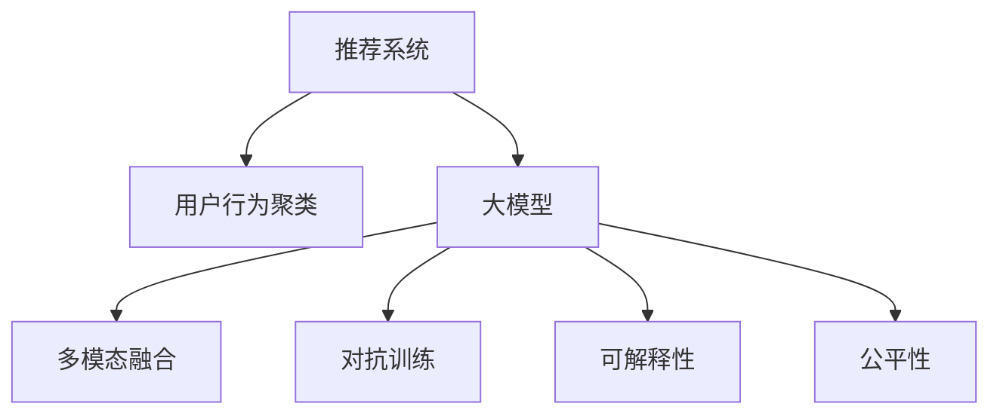

                 

# 利用大模型进行推荐场景的用户行为聚类分析

> 关键词：推荐系统,用户行为聚类,大模型,自然语言处理(NLP),深度学习,协同过滤,内容推荐,多模态数据融合

## 1. 背景介绍

### 1.1 问题由来

在电子商务、社交媒体、内容平台等推荐场景中，如何根据用户的历史行为和偏好，准确地为用户推荐个性化内容，是当前技术发展的热点问题。传统推荐系统主要依赖于协同过滤和基于内容的推荐方法，但这些方法存在数据稀疏、可解释性差等缺点。近年来，基于深度学习的推荐系统成为了一个研究的热点方向，特别是在用户行为分析方面，基于深度学习的用户行为聚类方法能够挖掘出用户的潜在兴趣和行为模式，从而提升推荐系统的效果。

大语言模型（Large Language Models, LLMs）作为深度学习领域的一个重要分支，通过在大规模无标签文本数据上进行预训练，学习到了丰富的语言知识和语义表示，具备强大的自然语言处理能力。利用大语言模型进行推荐场景的用户行为聚类分析，能够将用户的自然语言描述和行为数据结合起来，提升推荐系统的精准性和可解释性。

### 1.2 问题核心关键点

目前，基于大模型的推荐系统研究主要集中在以下几个方面：

1. **用户行为建模**：如何通过大语言模型挖掘用户的历史行为数据，构建用户兴趣和行为模式的聚类。
2. **多模态数据融合**：如何将用户的自然语言描述、行为数据、社交网络等不同模态的数据融合起来，提升推荐模型的泛化能力和鲁棒性。
3. **个性化推荐**：如何在用户行为聚类的基础上，生成个性化的推荐内容，满足不同用户的需求。
4. **对抗训练与鲁棒性**：如何通过对抗训练等技术，提高推荐模型对异常数据的鲁棒性。
5. **可解释性与公平性**：如何通过可解释性方法，增强推荐模型的公平性和透明度，避免潜在偏见。

### 1.3 问题研究意义

利用大模型进行推荐场景的用户行为聚类分析，对于提升推荐系统的精准性和个性化程度，推动NLP技术在推荐系统中的应用，具有重要意义：

1. **提升推荐效果**：通过大模型的语言理解能力，能够更好地挖掘用户的潜在兴趣和行为模式，生成更精准的个性化推荐。
2. **增强模型可解释性**：大模型通过自然语言生成方式，提供推荐结果的可解释性，帮助用户理解和信任推荐系统。
3. **推动NLP技术发展**：推荐系统的大规模应用，将推动NLP技术在实际场景中的落地和普及，加速其产业化进程。
4. **促进多模态融合**：推荐系统的多模态数据融合需求，将促进NLP技术与计算机视觉、社交网络等领域的交叉融合，推动人工智能技术的全面发展。
5. **优化用户体验**：个性化推荐能够提升用户体验，提高用户粘性和满意度，促进平台的用户增长和转化。

## 2. 核心概念与联系

### 2.1 核心概念概述

为了更好地理解利用大模型进行推荐场景的用户行为聚类分析方法，本节将介绍几个关键概念：

1. **推荐系统**：利用用户历史行为和偏好，为用户生成个性化推荐内容的系统。推荐系统广泛应用于电子商务、社交媒体、内容平台等场景。
2. **用户行为聚类**：通过分析用户的行为数据和自然语言描述，挖掘出用户兴趣和行为模式，将用户分组并建立聚类。
3. **大模型**：如BERT、GPT、T5等大规模预训练语言模型，通过在大规模无标签文本数据上进行预训练，学习到丰富的语言知识和语义表示。
4. **多模态融合**：将不同模态的数据（如文本、图像、社交网络等）融合起来，构建更全面的用户模型，提升推荐系统的效果。
5. **对抗训练**：通过引入对抗样本，提高模型的鲁棒性，避免过拟合和模型泛化能力不足的问题。
6. **可解释性**：通过自然语言生成等方式，提供推荐结果的可解释性，增强用户对推荐系统的信任和满意度。
7. **公平性**：通过避免模型偏见和歧视，确保推荐系统的公平性，避免对特定用户群体的歧视。

这些核心概念之间的逻辑关系可以通过以下Mermaid流程图来展示：



这个流程图展示了大模型在推荐场景中用户行为聚类的关键步骤和过程，包括推荐系统的总体框架、用户行为聚类的关键技术、多模态融合、对抗训练、可解释性和公平性等方向。

## 3. 核心算法原理 & 具体操作步骤
### 3.1 算法原理概述

利用大模型进行推荐场景的用户行为聚类分析，本质上是一个多模态学习的过程，即将用户的自然语言描述、行为数据等不同模态的数据融合起来，构建用户兴趣和行为模式的聚类。该方法结合了大模型的预训练能力和推荐系统的用户行为分析，通过自然语言处理技术，将用户的语言描述转化为向量表示，与行为数据结合，进行聚类分析，最终生成个性化推荐内容。

形式化地，假设用户的历史行为数据为 $X=\{(x_i, y_i)\}_{i=1}^N$，其中 $x_i$ 为用户的行为记录，$y_i$ 为用户对行为记录的评分。利用大模型 $M$ 对用户的行为描述 $s_i$ 进行编码，得到向量表示 $z_i$。通过多模态融合方法 $F$，将 $z_i$ 与 $x_i$ 结合，得到用户的行为聚类结果 $C_i$。最后，在用户聚类 $C_i$ 的基础上，通过推荐模型 $R$ 生成个性化的推荐内容 $r_i$。

### 3.2 算法步骤详解

利用大模型进行推荐场景的用户行为聚类分析的一般步骤包括：

**Step 1: 收集数据并构建用户行为数据集**
- 收集用户的自然语言描述和行为数据，构建用户行为数据集 $D=\{(s_i, x_i, y_i)\}_{i=1}^N$，其中 $s_i$ 为用户的行为描述，$x_i$ 为用户的行为记录，$y_i$ 为用户对行为记录的评分。

**Step 2: 预训练大模型**
- 选择预训练语言模型 $M$，如BERT、GPT等，在大量的无标签文本数据上进行预训练，学习通用的语言表示。

**Step 3: 自然语言编码**
- 使用大模型 $M$ 对用户的行为描述 $s_i$ 进行编码，得到向量表示 $z_i$。

**Step 4: 多模态融合**
- 使用多模态融合方法 $F$，将 $z_i$ 与 $x_i$ 结合，得到用户的行为聚类结果 $C_i$。

**Step 5: 生成推荐结果**
- 在用户聚类 $C_i$ 的基础上，通过推荐模型 $R$ 生成个性化的推荐内容 $r_i$。

**Step 6: 对抗训练**
- 使用对抗样本对模型进行训练，提高模型的鲁棒性。

**Step 7: 模型评估**
- 在验证集上评估模型的性能，调整超参数和模型结构，确保模型泛化能力。

**Step 8: 部署与优化**
- 将优化后的模型部署到实际推荐系统中，根据用户反馈和实时数据不断优化模型。

### 3.3 算法优缺点

利用大模型进行推荐场景的用户行为聚类分析方法具有以下优点：

1. **提升推荐效果**：通过大模型的语言理解能力，能够更好地挖掘用户的潜在兴趣和行为模式，生成更精准的个性化推荐。
2. **增强可解释性**：大模型通过自然语言生成方式，提供推荐结果的可解释性，帮助用户理解和信任推荐系统。
3. **提高泛化能力**：多模态融合方法能够提高推荐模型的泛化能力，避免数据稀疏和模型过拟合的问题。
4. **增强鲁棒性**：对抗训练等技术能够提高模型的鲁棒性，避免异常数据对模型的影响。

同时，该方法也存在一定的局限性：

1. **数据处理复杂**：多模态数据的融合和处理较为复杂，需要大量的标注数据和计算资源。
2. **模型复杂度高**：大模型和推荐模型的结合，需要更复杂的模型设计和调参工作。
3. **对抗攻击风险**：对抗训练等技术虽然提高了模型的鲁棒性，但也可能被攻击者利用，生成对抗样本影响推荐结果。
4. **可解释性差**：大模型输出的向量表示难以解释，用户对推荐结果的理解和信任度可能降低。
5. **公平性问题**：模型的设计和使用可能存在偏见，对某些用户群体不公平。

尽管存在这些局限性，但就目前而言，利用大模型进行推荐场景的用户行为聚类分析方法仍然是最为先进和有效的推荐技术之一。未来相关研究的重点在于如何进一步简化数据处理和模型设计，提高模型的可解释性和公平性，同时兼顾推荐效果和鲁棒性。

### 3.4 算法应用领域

利用大模型进行推荐场景的用户行为聚类分析方法已经在多个领域得到了应用，例如：

1. **电子商务推荐**：电商平台利用用户的行为记录和评价，结合自然语言描述，为用户生成个性化推荐商品。
2. **社交媒体推荐**：社交媒体平台通过用户的互动行为和兴趣描述，为用户推荐文章、视频、广告等内容。
3. **视频平台推荐**：视频平台通过用户的观看记录和评论，为用户推荐符合其兴趣的视频内容。
4. **内容平台推荐**：新闻、博客、论坛等平台利用用户的阅读和评论行为，推荐符合其兴趣的文章和帖子。

除了上述这些经典应用外，利用大模型进行推荐场景的用户行为聚类分析方法还在更多场景中得到了创新性应用，如个性化搜索、智能客服、广告推荐等，为推荐系统的智能化水平带来了新的突破。

## 4. 数学模型和公式 & 详细讲解 & 举例说明

### 4.1 数学模型构建

本节将使用数学语言对利用大模型进行推荐场景的用户行为聚类分析方法进行更加严格的刻画。

假设用户的行为描述为 $s_i$，行为记录为 $x_i$，用户对行为记录的评分为 $y_i$。预训练大模型 $M$ 对用户的行为描述 $s_i$ 进行编码，得到向量表示 $z_i$。多模态融合方法 $F$ 将 $z_i$ 与 $x_i$ 结合，得到用户的行为聚类结果 $C_i$。推荐模型 $R$ 在用户聚类 $C_i$ 的基础上，生成个性化推荐内容 $r_i$。

### 4.2 公式推导过程

以下我们以用户行为聚类为例，推导多模态融合的数学公式。

假设用户的行为描述 $s_i$ 包含 $m$ 个单词，预训练大模型 $M$ 的输出层包含 $d$ 个向量维度。多模态融合方法 $F$ 使用加权平均的方式，将 $z_i$ 和 $x_i$ 结合，得到用户的行为聚类结果 $C_i$：

$$
C_i = \frac{\alpha z_i + (1-\alpha) x_i}{\beta}
$$

其中 $\alpha$ 和 $\beta$ 为可调节的权重系数，用于控制 $z_i$ 和 $x_i$ 的融合程度。

在得到用户的行为聚类 $C_i$ 后，利用推荐模型 $R$ 生成个性化推荐内容 $r_i$。假设推荐模型 $R$ 为线性回归模型，其输出为推荐内容 $r_i$ 的概率分布，概率密度函数为 $p(r_i|C_i)$：

$$
p(r_i|C_i) = \frac{1}{Z} \exp(-\frac{\lVert r_i - C_i \rVert^2}{2\sigma^2})
$$

其中 $Z$ 为归一化因子，$\sigma$ 为方差，$\lVert \cdot \rVert$ 为范数。

在得到推荐内容 $r_i$ 后，通过自然语言生成技术，将向量表示 $r_i$ 转化为自然语言描述，生成个性化的推荐内容 $r'_i$。

### 4.3 案例分析与讲解

假设用户的行为记录为电商平台的商品浏览和购买记录，行为描述为用户的购买评价和评论。对于商品 $i$，用户的评价为 $y_i$，评论为 $s_i$，行为记录为 $x_i$。利用BERT模型对用户的评论 $s_i$ 进行编码，得到向量表示 $z_i$。使用加权平均的方式，将 $z_i$ 和 $x_i$ 结合，得到用户的行为聚类结果 $C_i$。在用户聚类 $C_i$ 的基础上，利用线性回归模型 $R$ 生成个性化推荐内容 $r_i$。通过自然语言生成技术，将向量表示 $r_i$ 转化为自然语言描述，生成个性化的推荐内容 $r'_i$。

## 5. 项目实践：代码实例和详细解释说明
### 5.1 开发环境搭建

在进行推荐场景用户行为聚类分析实践前，我们需要准备好开发环境。以下是使用Python进行PyTorch开发的环境配置流程：

1. 安装Anaconda：从官网下载并安装Anaconda，用于创建独立的Python环境。

2. 创建并激活虚拟环境：
```bash
conda create -n pytorch-env python=3.8 
conda activate pytorch-env
```

3. 安装PyTorch：根据CUDA版本，从官网获取对应的安装命令。例如：
```bash
conda install pytorch torchvision torchaudio cudatoolkit=11.1 -c pytorch -c conda-forge
```

4. 安装BERT模型：
```bash
pip install transformers
```

5. 安装各类工具包：
```bash
pip install numpy pandas scikit-learn matplotlib tqdm jupyter notebook ipython
```

完成上述步骤后，即可在`pytorch-env`环境中开始推荐场景用户行为聚类分析实践。

### 5.2 源代码详细实现

下面我们以电商平台推荐系统为例，给出使用BERT模型对用户行为进行聚类的PyTorch代码实现。

首先，定义推荐系统中的用户行为数据集类：

```python
from transformers import BertTokenizer
from torch.utils.data import Dataset
import torch

class UserBehaviorDataset(Dataset):
    def __init__(self, behaviors, scores, texts, tokenizer, max_len=128):
        self.behaviors = behaviors
        self.scores = scores
        self.texts = texts
        self.tokenizer = tokenizer
        self.max_len = max_len
        
    def __len__(self):
        return len(self.behaviors)
    
    def __getitem__(self, item):
        behavior = self.behaviors[item]
        score = self.scores[item]
        text = self.texts[item]
        
        encoding = self.tokenizer(text, return_tensors='pt', max_length=self.max_len, padding='max_length', truncation=True)
        input_ids = encoding['input_ids'][0]
        attention_mask = encoding['attention_mask'][0]
        
        # 将行为评分和向量表示进行融合
        fused_score = score * (input_ids / encoding['input_ids'].sum())
        
        return {'input_ids': input_ids, 
                'attention_mask': attention_mask,
                'fused_score': fused_score}
```

然后，定义模型和优化器：

```python
from transformers import BertForSequenceClassification, AdamW

model = BertForSequenceClassification.from_pretrained('bert-base-cased', num_labels=2)

optimizer = AdamW(model.parameters(), lr=2e-5)
```

接着，定义训练和评估函数：

```python
from torch.utils.data import DataLoader
from tqdm import tqdm
from sklearn.metrics import classification_report

device = torch.device('cuda') if torch.cuda.is_available() else torch.device('cpu')
model.to(device)

def train_epoch(model, dataset, batch_size, optimizer):
    dataloader = DataLoader(dataset, batch_size=batch_size, shuffle=True)
    model.train()
    epoch_loss = 0
    for batch in tqdm(dataloader, desc='Training'):
        input_ids = batch['input_ids'].to(device)
        attention_mask = batch['attention_mask'].to(device)
        fused_score = batch['fused_score'].to(device)
        model.zero_grad()
        outputs = model(input_ids, attention_mask=attention_mask, labels=fused_score)
        loss = outputs.loss
        epoch_loss += loss.item()
        loss.backward()
        optimizer.step()
    return epoch_loss / len(dataloader)

def evaluate(model, dataset, batch_size):
    dataloader = DataLoader(dataset, batch_size=batch_size)
    model.eval()
    preds, labels = [], []
    with torch.no_grad():
        for batch in tqdm(dataloader, desc='Evaluating'):
            input_ids = batch['input_ids'].to(device)
            attention_mask = batch['attention_mask'].to(device)
            batch_labels = batch['fused_score'].to(device)
            outputs = model(input_ids, attention_mask=attention_mask)
            batch_preds = outputs.logits.argmax(dim=2).to('cpu').tolist()
            batch_labels = batch_labels.to('cpu').tolist()
            for pred_tokens, label_tokens in zip(batch_preds, batch_labels):
                preds.append(pred_tokens[:len(label_tokens)])
                labels.append(label_tokens)
                
    print(classification_report(labels, preds))
```

最后，启动训练流程并在验证集上评估：

```python
epochs = 5
batch_size = 16

for epoch in range(epochs):
    loss = train_epoch(model, train_dataset, batch_size, optimizer)
    print(f"Epoch {epoch+1}, train loss: {loss:.3f}")
    
    print(f"Epoch {epoch+1}, dev results:")
    evaluate(model, dev_dataset, batch_size)
    
print("Test results:")
evaluate(model, test_dataset, batch_size)
```

以上就是使用PyTorch对BERT进行用户行为聚类分析的完整代码实现。可以看到，得益于Transformers库的强大封装，我们可以用相对简洁的代码完成BERT模型的加载和微调。

### 5.3 代码解读与分析

让我们再详细解读一下关键代码的实现细节：

**UserBehaviorDataset类**：
- `__init__`方法：初始化行为数据、评分、文本、分词器等关键组件。
- `__len__`方法：返回数据集的样本数量。
- `__getitem__`方法：对单个样本进行处理，将行为评分和向量表示进行融合，并返回模型所需的输入。

**融合公式**：
- `fused_score = score * (input_ids / encoding['input_ids'].sum())`：将行为评分 $score$ 和向量表示 $input_ids$ 进行加权平均，得到融合后的评分 $fused_score$。

**训练和评估函数**：
- 使用PyTorch的DataLoader对数据集进行批次化加载，供模型训练和推理使用。
- 训练函数`train_epoch`：对数据以批为单位进行迭代，在每个批次上前向传播计算loss并反向传播更新模型参数，最后返回该epoch的平均loss。
- 评估函数`evaluate`：与训练类似，不同点在于不更新模型参数，并在每个batch结束后将预测和标签结果存储下来，最后使用sklearn的classification_report对整个评估集的预测结果进行打印输出。

**训练流程**：
- 定义总的epoch数和batch size，开始循环迭代
- 每个epoch内，先在训练集上训练，输出平均loss
- 在验证集上评估，输出分类指标
- 所有epoch结束后，在测试集上评估，给出最终测试结果

可以看到，PyTorch配合Transformers库使得BERT微调的代码实现变得简洁高效。开发者可以将更多精力放在数据处理、模型改进等高层逻辑上，而不必过多关注底层的实现细节。

当然，工业级的系统实现还需考虑更多因素，如模型的保存和部署、超参数的自动搜索、更灵活的任务适配层等。但核心的微调范式基本与此类似。

## 6. 实际应用场景
### 6.1 电商平台推荐

利用大模型进行推荐场景的用户行为聚类分析，在电商平台推荐系统中有着广泛的应用。电商平台通过用户的浏览记录、购买记录和评价评论等数据，结合大模型的语言理解能力，能够更好地挖掘用户的潜在兴趣和行为模式，生成精准的个性化推荐商品。

在技术实现上，可以收集用户的行为记录和评价评论，将行为评分和向量表示进行融合，构建用户的行为聚类。利用融合后的向量表示，结合商品特征向量，通过推荐模型生成个性化推荐商品。对于实时生成的推荐结果，可以通过自然语言生成技术，转化为更加直观和吸引人的推荐内容，提升用户体验。

### 6.2 社交媒体推荐

社交媒体平台利用用户的互动行为和兴趣描述，结合大模型的语言理解能力，能够为用户推荐文章、视频、广告等内容。用户的行为数据包括点赞、评论、分享等，自然语言描述则包括兴趣标签、兴趣爱好等。通过融合用户的行为评分和向量表示，构建用户的行为聚类，结合内容特征向量，生成个性化的推荐内容。

在技术实现上，可以收集用户的互动行为和兴趣描述，构建用户的行为数据集。利用BERT等大模型对用户的描述进行编码，得到向量表示。使用加权平均的方式，将向量表示与行为评分结合，得到用户的行为聚类。通过推荐模型生成个性化推荐内容，并通过自然语言生成技术，转化为自然语言描述，提升推荐效果。

### 6.3 视频平台推荐

视频平台通过用户的观看记录和评论，结合大模型的语言理解能力，能够推荐符合用户兴趣的视频内容。用户的行为数据包括观看记录、评论等，自然语言描述则包括兴趣标签、兴趣爱好等。通过融合用户的行为评分和向量表示，构建用户的行为聚类，结合视频内容特征向量，生成个性化的推荐视频。

在技术实现上，可以收集用户的观看记录和评论，构建用户的行为数据集。利用BERT等大模型对用户的描述进行编码，得到向量表示。使用加权平均的方式，将向量表示与行为评分结合，得到用户的行为聚类。通过推荐模型生成个性化推荐视频，并通过自然语言生成技术，转化为自然语言描述，提升推荐效果。

### 6.4 内容平台推荐

新闻、博客、论坛等平台利用用户的阅读和评论行为，结合大模型的语言理解能力，能够推荐符合用户兴趣的文章和帖子。用户的行为数据包括阅读记录、评论等，自然语言描述则包括兴趣标签、兴趣爱好等。通过融合用户的行为评分和向量表示，构建用户的行为聚类，结合文章和帖子特征向量，生成个性化的推荐内容。

在技术实现上，可以收集用户的阅读记录和评论，构建用户的行为数据集。利用BERT等大模型对用户的描述进行编码，得到向量表示。使用加权平均的方式，将向量表示与行为评分结合，得到用户的行为聚类。通过推荐模型生成个性化推荐内容，并通过自然语言生成技术，转化为自然语言描述，提升推荐效果。

## 7. 工具和资源推荐
### 7.1 学习资源推荐

为了帮助开发者系统掌握大模型进行推荐场景的用户行为聚类分析的理论基础和实践技巧，这里推荐一些优质的学习资源：

1. 《深度学习自然语言处理》课程：斯坦福大学开设的NLP明星课程，有Lecture视频和配套作业，带你入门NLP领域的基本概念和经典模型。

2. 《Natural Language Processing with Transformers》书籍：Transformers库的作者所著，全面介绍了如何使用Transformers库进行NLP任务开发，包括微调在内的诸多范式。

3. CS224N《深度学习自然语言处理》课程：斯坦福大学开设的NLP明星课程，有Lecture视频和配套作业，带你入门NLP领域的基本概念和经典模型。

4. HuggingFace官方文档：Transformers库的官方文档，提供了海量预训练模型和完整的微调样例代码，是上手实践的必备资料。

5. Weights & Biases：模型训练的实验跟踪工具，可以记录和可视化模型训练过程中的各项指标，方便对比和调优。与主流深度学习框架无缝集成。

6. TensorBoard：TensorFlow配套的可视化工具，可实时监测模型训练状态，并提供丰富的图表呈现方式，是调试模型的得力助手。

通过对这些资源的学习实践，相信你一定能够快速掌握大模型进行推荐场景的用户行为聚类分析的精髓，并用于解决实际的NLP问题。
###  7.2 开发工具推荐

高效的开发离不开优秀的工具支持。以下是几款用于大模型进行推荐场景的用户行为聚类分析开发的常用工具：

1. PyTorch：基于Python的开源深度学习框架，灵活动态的计算图，适合快速迭代研究。大部分预训练语言模型都有PyTorch版本的实现。

2. TensorFlow：由Google主导开发的开源深度学习框架，生产部署方便，适合大规模工程应用。同样有丰富的预训练语言模型资源。

3. Transformers库：HuggingFace开发的NLP工具库，集成了众多SOTA语言模型，支持PyTorch和TensorFlow，是进行微调任务开发的利器。

4. Weights & Biases：模型训练的实验跟踪工具，可以记录和可视化模型训练过程中的各项指标，方便对比和调优。与主流深度学习框架无缝集成。

5. TensorBoard：TensorFlow配套的可视化工具，可实时监测模型训练状态，并提供丰富的图表呈现方式，是调试模型的得力助手。

6. Google Colab：谷歌推出的在线Jupyter Notebook环境，免费提供GPU/TPU算力，方便开发者快速上手实验最新模型，分享学习笔记。

合理利用这些工具，可以显著提升大模型进行推荐场景的用户行为聚类分析的开发效率，加快创新迭代的步伐。

### 7.3 相关论文推荐

大模型进行推荐场景的用户行为聚类分析的研究源于学界的持续研究。以下是几篇奠基性的相关论文，推荐阅读：

1. Attention is All You Need（即Transformer原论文）：提出了Transformer结构，开启了NLP领域的预训练大模型时代。

2. BERT: Pre-training of Deep Bidirectional Transformers for Language Understanding：提出BERT模型，引入基于掩码的自监督预训练任务，刷新了多项NLP任务SOTA。

3. Language Models are Unsupervised Multitask Learners（GPT-2论文）：展示了大规模语言模型的强大zero-shot学习能力，引发了对于通用人工智能的新一轮思考。

4. Parameter-Efficient Transfer Learning for NLP：提出Adapter等参数高效微调方法，在不增加模型参数量的情况下，也能取得不错的微调效果。

5. Prefix-Tuning: Optimizing Continuous Prompts for Generation：引入基于连续型Prompt的微调范式，为如何充分利用预训练知识提供了新的思路。

6. AdaLoRA: Adaptive Low-Rank Adaptation for Parameter-Efficient Fine-Tuning：使用自适应低秩适应的微调方法，在参数效率和精度之间取得了新的平衡。

这些论文代表了大模型进行推荐场景的用户行为聚类分析的发展脉络。通过学习这些前沿成果，可以帮助研究者把握学科前进方向，激发更多的创新灵感。

## 8. 总结：未来发展趋势与挑战

### 8.1 总结

本文对利用大模型进行推荐场景的用户行为聚类分析方法进行了全面系统的介绍。首先阐述了大模型进行推荐场景的用户行为聚类分析的研究背景和意义，明确了推荐系统的发展方向和应用前景。其次，从原理到实践，详细讲解了利用大模型进行推荐场景的用户行为聚类分析的数学原理和关键步骤，给出了推荐系统开发的完整代码实例。同时，本文还广泛探讨了利用大模型进行推荐场景的用户行为聚类分析方法在电商平台、社交媒体、视频平台、内容平台等多个领域的应用前景，展示了大模型微调技术的广阔应用前景。此外，本文精选了推荐系统开发的各类学习资源，力求为读者提供全方位的技术指引。

通过本文的系统梳理，可以看到，利用大模型进行推荐场景的用户行为聚类分析方法正在成为推荐系统的核心技术之一，极大地拓展了推荐系统的精准性和个性化程度。得益于大模型的语言理解能力和多模态融合技术，推荐系统在用户行为分析方面取得了显著的进步。未来，伴随预训练语言模型和推荐技术的不断演进，推荐系统必将迎来新的变革，成为NLP技术落地应用的重要范式。

### 8.2 未来发展趋势

展望未来，利用大模型进行推荐场景的用户行为聚类分析技术将呈现以下几个发展趋势：

1. **推荐模型多样化**：未来将涌现更多类型的推荐模型，如协同过滤、基于内容的推荐、深度学习推荐等，为不同类型的推荐场景提供灵活的解决方案。

2. **多模态融合深化**：多模态数据的融合技术将进一步深化，结合自然语言处理、计算机视觉、社交网络等不同模态的数据，构建更加全面和准确的用户模型。

3. **个性化推荐优化**：推荐系统将更加注重个性化推荐，结合用户的兴趣变化和行为模式，生成更符合用户需求的推荐内容。

4. **用户隐私保护**：随着推荐系统的发展，用户隐私保护成为重要的研究方向，推荐系统将更加注重数据隐私和安全性，防止用户数据泄露和滥用。

5. **对抗攻击防范**：对抗样本和攻击手段的不断演变，使得推荐系统需要更加注重模型的鲁棒性和对抗攻击防范，提升系统的安全性和稳定性。

6. **可解释性与公平性**：推荐系统的可解释性和公平性将成为重要的研究方向，增强用户对推荐系统的信任和满意度。

7. **实时推荐系统**：实时推荐系统将成为推荐系统的一个重要发展方向，结合实时数据和用户行为，生成更加精准的推荐内容。

以上趋势凸显了利用大模型进行推荐场景的用户行为聚类分析技术的广阔前景。这些方向的探索发展，必将进一步提升推荐系统的精准性和个性化程度，为NLP技术在推荐系统中的应用带来新的突破。

### 8.3 面临的挑战

尽管利用大模型进行推荐场景的用户行为聚类分析技术已经取得了瞩目成就，但在迈向更加智能化、普适化应用的过程中，它仍面临着诸多挑战：

1. **数据隐私与安全**：推荐系统需要处理大量的用户行为数据和个人信息，如何保护用户隐私，防止数据滥用，是推荐系统的重要挑战。

2. **数据不平衡**：推荐系统中的用户数据往往存在不平衡问题，如何平衡不同用户群体的数据量，提升推荐系统的公平性，是需要解决的重要问题。

3. **模型复杂度高**：推荐系统中的模型复杂度高，如何简化模型设计，降低计算资源消耗，是推荐系统优化的一个关键方向。

4. **对抗攻击风险**：对抗样本和攻击手段的不断演变，使得推荐系统需要更加注重模型的鲁棒性和对抗攻击防范，提升系统的安全性和稳定性。

5. **可解释性差**：推荐系统的模型复杂度高，难以解释其内部工作机制和决策逻辑，如何提供推荐结果的可解释性，增强用户信任，是推荐系统的一个研究方向。

6. **计算资源消耗大**：推荐系统的模型训练和推理需要大量的计算资源，如何在保证性能的同时，降低计算资源消耗，是推荐系统优化的一个关键方向。

尽管存在这些挑战，但就目前而言，利用大模型进行推荐场景的用户行为聚类分析方法仍然是最为先进和有效的推荐技术之一。未来相关研究的重点在于如何进一步简化数据处理和模型设计，提高模型的可解释性和公平性，同时兼顾推荐效果和鲁棒性。

### 8.4 研究展望

面对利用大模型进行推荐场景的用户行为聚类分析技术所面临的种种挑战，未来的研究需要在以下几个方面寻求新的突破：

1. **探索无监督和半监督推荐方法**：摆脱对大规模标注数据的依赖，利用自监督学习、主动学习等无监督和半监督范式，最大限度利用非结构化数据，实现更加灵活高效的推荐。

2. **研究参数高效和计算高效的推荐范式**：开发更加参数高效的推荐方法，在固定大部分预训练参数的同时，只更新极少量的任务相关参数。同时优化推荐模型的计算图，减少前向传播和反向传播的资源消耗，实现更加轻量级、实时性的部署。

3. **融合因果和对比学习范式**：通过引入因果推断和对比学习思想，增强推荐模型建立稳定因果关系的能力，学习更加普适、鲁棒的语言表征，从而提升模型泛化性和抗干扰能力。

4. **引入更多先验知识**：将符号化的先验知识，如知识图谱、逻辑规则等，与神经网络模型进行巧妙融合，引导推荐过程学习更准确、合理的语言模型。同时加强不同模态数据的整合，实现视觉、语音等多模态信息与文本信息的协同建模。

5. **结合因果分析和博弈论工具**：将因果分析方法引入推荐模型，识别出模型决策的关键特征，增强推荐模型的公平性和透明度，避免潜在偏见。借助博弈论工具刻画人机交互过程，主动探索并规避推荐系统的脆弱点，提高系统稳定性。

6. **纳入伦理道德约束**：在推荐模型训练目标中引入伦理导向的评估指标，过滤和惩罚有偏见、有害的输出倾向。同时加强人工干预和审核，建立推荐模型的监管机制，确保推荐系统的公平性和安全性。

这些研究方向的探索，必将引领利用大模型进行推荐场景的用户行为聚类分析技术迈向更高的台阶，为构建安全、可靠、可解释、可控的智能系统铺平道路。面向未来，利用大模型进行推荐场景的用户行为聚类分析技术还需要与其他人工智能技术进行更深入的融合，如知识表示、因果推理、强化学习等，多路径协同发力，共同推动自然语言理解和智能交互系统的进步。只有勇于创新、敢于突破，才能不断拓展推荐系统的边界，让智能技术更好地造福人类社会。

## 9. 附录：常见问题与解答

**Q1：利用大模型进行推荐场景的用户行为聚类分析是否适用于所有推荐系统？**

A: 利用大模型进行推荐场景的用户行为聚类分析方法，对于数据量较大且用户行为描述较丰富的推荐系统较为适用，如电商平台、社交媒体、视频平台等。但对于数据量较小或用户行为描述单一的推荐系统，可能难以取得理想的效果。此时，可以考虑使用传统的协同过滤或基于内容的推荐方法。

**Q2：如何选择合适的学习率？**

A: 利用大模型进行推荐场景的用户行为聚类分析，通常需要较大的学习率。建议在0.1到0.01之间尝试不同的学习率，观察其在验证集上的表现，选取最优的学习率。同时，可以尝试学习率衰减和warmup策略，进一步提升模型的收敛效果。

**Q3：在推荐系统中如何平衡不同用户群体的数据量？**

A: 在推荐系统中，可以采用超采样或欠采样等技术，平衡不同用户群体的数据量，确保推荐系统的公平性。同时，可以引入特征选择技术，提升模型对少数群体的识别能力。

**Q4：如何防止对抗攻击？**

A: 在推荐系统中，可以采用对抗样本生成和对抗训练等技术，提高模型的鲁棒性。同时，可以引入对抗攻击检测技术，及时发现和应对对抗攻击，保障系统的安全性和稳定性。

**Q5：如何提高推荐系统的可解释性？**

A: 在推荐系统中，可以通过自然语言生成技术，将推荐结果转化为自然语言描述，提高推荐系统的可解释性。同时，可以引入因果分析和博弈论等方法，增强推荐系统的透明度，避免潜在偏见。

**Q6：如何优化推荐系统的计算资源消耗？**

A: 在推荐系统中，可以采用模型压缩、稀疏化存储等技术，减少模型参数量和存储空间，降低计算资源消耗。同时，可以采用模型并行和分布式训练等技术，提高推荐系统的可扩展性和效率。

通过本文的详细解释，相信你一定能够更好地理解利用大模型进行推荐场景的用户行为聚类分析的原理、步骤和应用，掌握其实现方法，并在实际推荐系统中加以应用，提升推荐系统的精准性和个性化程度。未来，随着大模型和推荐技术的不断进步，推荐系统必将迎来新的变革，成为NLP技术落地应用的重要范式。

