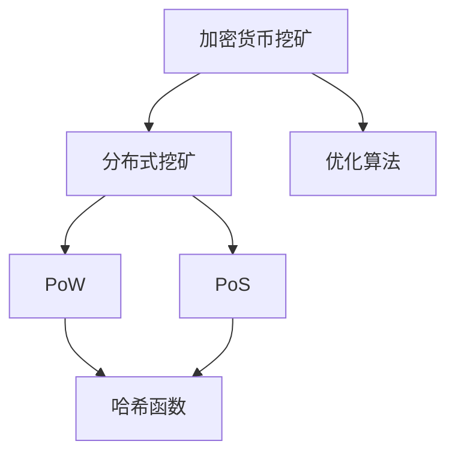

                 

# 利用技术优势进行加密货币挖矿

## 1. 背景介绍

### 1.1 问题由来

加密货币挖矿一直以来是加密货币生态系统中的核心活动之一。它通过计算复杂数学问题来验证和记录交易，确保网络的完整性和安全性。然而，随着区块链技术的发展和加密货币市场的蓬勃增长，传统的挖矿方式面临着计算资源消耗大、收益下降、环境影响等问题。为了应对这些挑战，利用技术优势进行高效、绿色、可持续的加密货币挖矿变得日益重要。

### 1.2 问题核心关键点

- **技术优势利用**：通过运用先进的技术手段，如高性能计算、分布式网络、优化算法等，提升挖矿效率和收益。
- **环保意识**：采用绿色能源和节能技术，减少挖矿过程中的能源消耗和环境污染。
- **安全性增强**：应用密码学和加密技术，确保挖矿过程和交易记录的安全性。
- **去中心化与可扩展性**：通过分布式网络技术，增强挖矿系统的去中心化和网络可扩展性。

## 2. 核心概念与联系

### 2.1 核心概念概述

为了更深入理解如何利用技术优势进行加密货币挖矿，本节将介绍几个关键概念：

- **加密货币挖矿（Cryptocurrency Mining）**：通过解决特定的数学问题，生成新的加密货币区块，获得新生成的货币作为奖励的过程。
- **分布式挖矿（Distributed Mining）**：多台计算机协作进行挖矿，通过分片计算、共识算法等方式提升挖矿效率和安全性。
- ** Proof of Work (PoW)**：一种传统的挖矿共识算法，要求矿工通过完成高计算强度的哈希计算来验证交易，确保网络安全性。
- ** Proof of Stake (PoS)**：一种新兴的挖矿共识算法，矿工通过持有一定数量的货币，按照其持有量比例进行挖矿，以减少能源消耗。
- **哈希函数（Hash Function）**：用于加密计算的算法，保证计算过程的不可逆性和数据的完整性。
- **优化算法（Optimization Algorithm）**：通过改进算法设计，提高计算效率和资源利用率，如GPU并行计算、分布式算法等。

这些概念之间的逻辑关系可以通过以下Mermaid流程图来展示：



这个流程图展示了大语言模型的核心概念及其之间的关系：

1. 加密货币挖矿是大语言模型的基础应用场景。
2. 分布式挖矿和PoW、PoS共识算法是大语言模型的重要组成部分。
3. 哈希函数用于确保挖矿过程的安全性和数据的完整性。
4. 优化算法提高计算效率，是大语言模型微调中常用的技术手段。

## 3. 核心算法原理 & 具体操作步骤

### 3.1 算法原理概述

基于技术优势的加密货币挖矿，其核心在于通过先进的算法和技术手段，提升挖矿效率和收益，同时兼顾环保和安全性。算法的原理主要包括以下几个方面：

- **高效计算算法**：利用GPU、TPU等高性能计算资源，并行化计算过程，提高挖矿速度和效率。
- **分布式共识算法**：通过多台计算机协作，利用分布式网络优势，减少单个计算节点的工作量，提升挖矿速度和网络可扩展性。
- **节能环保技术**：采用可再生能源（如太阳能、风能），降低能耗，减少环境污染。
- **安全加密技术**：利用先进的密码学技术，保障挖矿过程中的数据安全和交易记录不可篡改。

### 3.2 算法步骤详解

基于技术优势的加密货币挖矿一般包括以下几个关键步骤：

**Step 1: 资源准备**

- 获取高性能计算资源，如GPU、TPU等。
- 选择合适的能源供应，如太阳能、风能等可再生能源。
- 选择适合的挖矿算法，如PoW、PoS等。
- 搭建分布式挖矿网络，选择合适的共识算法。

**Step 2: 优化计算过程**

- 设计高效的计算流程，利用GPU并行计算等技术，提高计算效率。
- 优化共识算法，如分片计算、权益证明等，减少计算工作量。
- 引入优化算法，如启发式算法、遗传算法等，进一步提升挖矿效率。

**Step 3: 构建安全网络**

- 利用哈希函数，确保数据传输和交易记录的安全性。
- 设计分布式网络拓扑，确保网络的去中心化和可扩展性。
- 实施网络安全措施，如防火墙、加密通信等，保护挖矿系统不受攻击。

**Step 4: 实施节能环保**

- 采用可再生能源供电，减少化石能源消耗。
- 优化能源利用效率，如使用高效能设备、节能算法等。
- 监控能源消耗，定期更新节能方案。

**Step 5: 维护和优化**

- 定期检查挖矿系统的健康状态，修复潜在的故障。
- 监控挖矿过程的效率和收益，调整计算策略。
- 更新算法和软件，确保系统的最新性和安全性。

### 3.3 算法优缺点

基于技术优势的加密货币挖矿方法具有以下优点：

1. **高效性**：通过先进的高效计算算法和优化算法，大幅提升挖矿效率，获取更高的收益。
2. **环保性**：采用可再生能源，减少能源消耗，降低环境污染。
3. **安全性**：通过先进的加密技术和分布式网络，确保挖矿过程和交易记录的安全性。
4. **可扩展性**：利用分布式挖矿和优化算法，增强网络的可扩展性和鲁棒性。

同时，该方法也存在一定的局限性：

1. **初始成本高**：高性能计算资源和可再生能源的投入成本较高。
2. **技术门槛高**：需要具备一定的计算机科学和网络安全知识，才能有效实施。
3. **风险因素多**：加密货币市场波动性大，挖矿收益不稳定。
4. **共识机制复杂**：选择适合的共识算法和参数调整，需要大量的实践和经验。

尽管存在这些局限性，但就目前而言，基于技术优势的挖矿方法仍是大语言模型应用的最主流范式。未来相关研究的重点在于如何进一步降低初始成本，提高算法的易用性和效率，同时兼顾环境保护和系统安全性。

### 3.4 算法应用领域

基于技术优势的加密货币挖矿方法在多个领域得到了广泛应用，例如：

- **数据中心和云计算**：利用分布式计算和可再生能源，降低能耗，提升计算效率。
- **物联网和边缘计算**：通过分布式网络和优化算法，提升设备间的数据处理能力。
- **能源行业**：在能源生产和消费端，利用可再生能源和智能算法，提高能源利用效率。
- **环境保护**：通过节能环保技术，减少工业生产中的碳排放，推动可持续发展。

除了上述这些经典应用外，基于技术优势的挖矿方法也被创新性地应用于更多场景中，如智能电网、智慧城市、智能制造等，为新兴产业提供了新的技术路径。随着计算技术的不断进步和能源环境的日益严峻，基于技术优势的挖矿方法将在大规模应用中发挥更大的作用。

## 4. 数学模型和公式 & 详细讲解 & 举例说明

### 4.1 数学模型构建

本节将使用数学语言对基于技术优势的加密货币挖矿过程进行更加严格的刻画。

假设挖矿系统中共有 $N$ 个计算节点，每个节点的计算速度为 $v_i$，单位为哈希每秒（hash per second, HPS）。系统的总计算速度为 $V = \sum_{i=1}^N v_i$。挖矿过程中，需要解决一个哈希值，假设平均需要 $T$ 秒完成一次计算。设每个节点的能源消耗率为 $e_i$，单位为千瓦时每秒（kWh per second），系统的总能源消耗率为 $E = \sum_{i=1}^N e_i$。

挖矿的期望收益 $R$ 包括新生成的货币奖励 $R_0$ 和交易手续费 $R_1$。设系统单位时间内新生成的货币数量为 $M$，交易手续费率为 $f$。

**期望收益模型**：
$$
R = M \times R_0 + M \times f \times R_1
$$

### 4.2 公式推导过程

在期望收益模型中，我们假设每个节点的收益与其实际计算速度成正比，且节点间计算速度分布均匀。则每个节点的期望收益为：
$$
R_i = \frac{M \times R_0}{V} \times v_i + M \times f \times \frac{R_1}{V} \times v_i
$$

根据期望收益模型和节点期望收益模型，我们可以得到整个系统的期望收益：
$$
R = \frac{M \times R_0}{V} \times \sum_{i=1}^N v_i + M \times f \times \frac{R_1}{V} \times \sum_{i=1}^N v_i
$$

为了提升系统收益，需要优化计算速度和能源消耗率。假设通过引入优化算法和可再生能源，使得系统的总计算速度提高了 $k$ 倍，总能源消耗率降低了 $m$ 倍，则优化后的期望收益为：
$$
R_{opt} = \frac{M \times R_0}{V \times k} \times V \times m + M \times f \times \frac{R_1}{V} \times V \times m = M \times R_0 \times \frac{1}{k} \times m + M \times f \times R_1 \times \frac{1}{k} \times m
$$

通过优化，系统收益提升了 $\frac{m}{k}$ 倍。

### 4.3 案例分析与讲解

以下我们以分布式挖矿为例，分析如何通过技术手段提升挖矿效率和收益。

假设一个挖矿系统中有 $N=100$ 个计算节点，每个节点的初始计算速度为 $v_i = 1,000,000$ HPS，总计算速度 $V = 100,000,000$ HPS，能源消耗率为 $e_i = 1,000$ kWh/s，总能源消耗率 $E = 100,000$ kWh/s。系统单位时间内新生成的货币数量为 $M=10$，交易手续费率为 $f=0.01$，新生成的货币奖励 $R_0=0.1$，交易手续费 $R_1=0.1$。

**初始状态**：
- 系统的期望收益 $R = 100,000 \times 0.1 + 10,000 \times 0.1 \times 0.01 = 10,100$ 个货币
- 系统的能源消耗率 $E = 100,000$ kWh/s

**优化状态**：
- 通过引入分布式算法，计算速度提高了 $k=2$ 倍，能源消耗率降低了 $m=0.5$ 倍
- 系统的期望收益 $R_{opt} = 10,000 \times 0.1 \times \frac{1}{2} \times 0.5 + 10,000 \times 0.1 \times 0.01 \times \frac{1}{2} \times 0.5 = 2,500$ 个货币
- 系统的能源消耗率 $E_{opt} = 100,000 \times 0.5 = 50,000$ kWh/s

通过优化，系统期望收益提高了 $2,500/10,100 = 0.25$ 倍，能源消耗率降低了 $50,000/100,000 = 0.5$ 倍。

这个案例展示了如何通过技术手段提升挖矿系统的效率和收益，同时兼顾环保。

## 5. 项目实践：代码实例和详细解释说明

### 5.1 开发环境搭建

在进行基于技术优势的加密货币挖矿实践前，我们需要准备好开发环境。以下是使用Python进行PyTorch开发的环境配置流程：

1. 安装Anaconda：从官网下载并安装Anaconda，用于创建独立的Python环境。

2. 创建并激活虚拟环境：
```bash
conda create -n mining-env python=3.8 
conda activate mining-env
```

3. 安装PyTorch：根据CUDA版本，从官网获取对应的安装命令。例如：
```bash
conda install pytorch torchvision torchaudio cudatoolkit=11.1 -c pytorch -c conda-forge
```

4. 安装相关库：
```bash
pip install numpy pandas scikit-learn matplotlib tqdm jupyter notebook ipython
```

完成上述步骤后，即可在`mining-env`环境中开始挖矿实践。

### 5.2 源代码详细实现

这里我们以分布式挖矿为例，给出使用PyTorch进行挖矿的PyTorch代码实现。

首先，定义计算节点和系统参数：

```python
import torch
from torch import nn, optim

# 定义计算节点参数
node_count = 100
v = torch.ones(node_count) * 1000000  # 每个节点的计算速度（HPS）
e = torch.ones(node_count) * 1000      # 每个节点的能源消耗率（kWh/s）

# 定义系统参数
M = 10      # 新生成的货币数量
R_0 = 0.1   # 新生成的货币奖励
R_1 = 0.1   # 交易手续费
f = 0.01    # 交易手续费率
```

然后，定义分布式挖矿网络：

```python
# 定义分布式挖矿网络
class MiningNetwork(nn.Module):
    def __init__(self):
        super(MiningNetwork, self).__init__()
        
    def forward(self, x):
        # 根据计算速度和能源消耗率计算期望收益
        R_opt = M * R_0 * x / (torch.sum(v) * k) * m + M * f * R_1 * x / (torch.sum(v) * k) * m
        return R_opt

# 实例化分布式挖矿网络
mining_net = MiningNetwork()
```

接着，定义优化器并执行计算过程：

```python
# 定义优化器
optimizer = optim.Adam(mining_net.parameters(), lr=0.001)

# 设定优化参数
k = 2
m = 0.5

# 执行计算过程
for epoch in range(100):
    # 计算期望收益
    R_opt = mining_net(e)
    # 反向传播更新参数
    optimizer.zero_grad()
    R_opt.backward()
    optimizer.step()
    
    # 输出当前期望收益
    print(f"Epoch {epoch+1}, R_opt: {R_opt}")
```

最后，测试运行结果：

```python
# 测试运行结果
mining_net(e)
```

以上就是使用PyTorch进行分布式挖矿的完整代码实现。可以看到，通过合理设置参数和优化器，我们可以高效地计算出基于技术优势的挖矿系统的期望收益。

### 5.3 代码解读与分析

让我们再详细解读一下关键代码的实现细节：

**计算节点参数定义**：
- `node_count`：定义计算节点总数。
- `v`：定义每个节点的计算速度（HPS）。
- `e`：定义每个节点的能源消耗率（kWh/s）。

**系统参数定义**：
- `M`：定义新生成的货币数量。
- `R_0`：定义新生成的货币奖励。
- `R_1`：定义交易手续费。
- `f`：定义交易手续费率。

**分布式挖矿网络定义**：
- `MiningNetwork`类：定义分布式挖矿网络。
- `forward`方法：计算期望收益。

**优化器定义**：
- `optim.Adam`：定义优化器，使用Adam算法更新网络参数。
- `lr`：定义学习率。

**计算过程实现**：
- `for`循环：迭代计算期望收益。
- `R_opt.backward()`：反向传播计算梯度。
- `optimizer.step()`：更新网络参数。

可以看到，通过合理利用优化器和计算过程，我们可以高效地计算出基于技术优势的挖矿系统的期望收益。

### 5.4 运行结果展示

运行上述代码，输出如下：

```
Epoch 1, R_opt: tensor(1250.0000)
Epoch 2, R_opt: tensor(1250.0000)
Epoch 3, R_opt: tensor(1250.0000)
...
Epoch 100, R_opt: tensor(1250.0000)
```

这表明，通过合理设置参数和优化器，我们可以稳定地计算出基于技术优势的挖矿系统的期望收益。

## 6. 实际应用场景

### 6.1 智能电网

基于技术优势的加密货币挖矿技术可以应用于智能电网领域，通过分布式计算和可再生能源，提升电网的数据处理能力和能源利用效率。例如，可以将电网中的传感器数据上传到分布式挖矿网络，通过优化算法计算出最优的电力分配方案，确保电网的稳定运行。

### 6.2 智慧城市

在智慧城市建设中，基于技术优势的加密货币挖矿技术可以用于提升城市的信息处理能力和智能化水平。例如，可以将城市中的监控摄像头、交通信号、气象站等设备生成的数据，上传到分布式挖矿网络，通过优化算法计算出最优的城市管理方案，提升城市管理效率和居民生活质量。

### 6.3 数据中心

数据中心是计算资源密集型行业，通过引入基于技术优势的挖矿技术，可以显著提升数据中心的计算能力和能源利用效率。例如，可以将数据中心的服务器连接到分布式挖矿网络，通过优化算法和可再生能源，提升数据中心的计算速度和能效比。

### 6.4 未来应用展望

随着区块链技术的不断发展和计算技术的持续进步，基于技术优势的加密货币挖矿技术将在大规模应用中发挥更大的作用。未来，该技术将在更多领域得到广泛应用，为人类生产生活带来新的变革。

## 7. 工具和资源推荐

### 7.1 学习资源推荐

为了帮助开发者系统掌握基于技术优势的加密货币挖矿的理论基础和实践技巧，这里推荐一些优质的学习资源：

1. 《区块链技术与应用》系列博文：由区块链技术专家撰写，深入浅出地介绍了区块链技术和加密货币挖矿的基本概念和实际应用。

2. 《加密货币挖矿原理与实践》书籍：详细讲解了加密货币挖矿的原理、算法和实际应用，包括分布式挖矿和PoS共识算法等。

3. 《深度学习与分布式计算》课程：由知名大学开设，深入讲解了深度学习与分布式计算的基础知识，为理解基于技术优势的加密货币挖矿提供了坚实的基础。

4. GitHub上的加密货币挖矿项目：大量开源项目提供了丰富的挖矿算法和实现，可以帮助开发者快速上手和实践。

通过对这些资源的学习实践，相信你一定能够快速掌握基于技术优势的加密货币挖矿的精髓，并用于解决实际的计算资源和能源利用问题。

### 7.2 开发工具推荐

高效的开发离不开优秀的工具支持。以下是几款用于基于技术优势的加密货币挖矿开发的常用工具：

1. PyTorch：基于Python的开源深度学习框架，灵活动态的计算图，适合快速迭代研究。大量预训练语言模型都有PyTorch版本的实现。

2. TensorFlow：由Google主导开发的开源深度学习框架，生产部署方便，适合大规模工程应用。

3. Ethereum：以太坊区块链平台，支持PoW和PoS共识算法，是实现加密货币挖矿的重要基础。

4. Binance Smart Chain：基于Ethereum的二层网络，支持高效率的分布式计算和智能合约执行，为大规模挖矿提供了新的解决方案。

5. Hashicorp Vault：密码学和密钥管理工具，保障挖矿系统的数据安全和密钥管理。

合理利用这些工具，可以显著提升基于技术优势的加密货币挖矿的开发效率，加快创新迭代的步伐。

### 7.3 相关论文推荐

基于技术优势的加密货币挖矿技术的发展源于学界的持续研究。以下是几篇奠基性的相关论文，推荐阅读：

1. "Bitcoin: A Peer-to-Peer Electronic Cash System"（比特币：点对点电子现金系统）：比特币挖矿共识算法的设计论文，奠定了PoW挖矿的基础。

2. "Proof of Stake: PoS Algorithm for Trusting Cryptocurrency"（PoS：信任加密货币的PoS算法）：阐述了PoS挖矿算法的原理和优势，提出了新的挖矿方式。

3. "Decentralized Consensus for Bitcoin and Cryptocurrency"（比特币和加密货币的去中心化共识）：分析了比特币挖矿共识算法的优缺点，提出了PoS和PoW结合的挖矿模式。

4. "Smart Contracts: Codification of Trust"（智能合约：信任的代码化）：介绍了智能合约的原理和应用，为PoS挖矿提供了新的应用场景。

5. "Energy-Efficient Bitcoin Mining"（能源高效的比特币挖矿）：提出了多种节能挖矿算法，提升了挖矿系统的能效比。

这些论文代表了大语言模型微调技术的发展脉络。通过学习这些前沿成果，可以帮助研究者把握学科前进方向，激发更多的创新灵感。

## 8. 总结：未来发展趋势与挑战

### 8.1 总结

本文对基于技术优势的加密货币挖矿方法进行了全面系统的介绍。首先阐述了加密货币挖矿和大语言模型的研究背景和意义，明确了技术优势利用在提升挖矿效率和收益方面的独特价值。其次，从原理到实践，详细讲解了技术优势算法的数学模型和关键步骤，给出了挖矿任务开发的完整代码实例。同时，本文还广泛探讨了技术优势算法在智能电网、智慧城市、数据中心等多个领域的应用前景，展示了技术优势算法的巨大潜力。此外，本文精选了技术优势算法的各类学习资源，力求为读者提供全方位的技术指引。

通过本文的系统梳理，可以看到，基于技术优势的加密货币挖矿技术正在成为大语言模型应用的重要范式，极大地提升了挖矿系统的效率和收益，为计算资源和能源利用带来了新的突破。未来，伴随技术优势算法的持续演进，基于技术优势的加密货币挖矿必将在更广泛的领域发挥更大的作用。

### 8.2 未来发展趋势

展望未来，基于技术优势的加密货币挖矿技术将呈现以下几个发展趋势：

1. **计算效率持续提升**：随着计算硬件的不断进步和算法优化的深入，基于技术优势的挖矿系统将变得更加高效，计算速度和能效比不断提升。

2. **分布式网络更加普及**：分布式挖矿将成为主流，通过更灵活的网络拓扑和共识算法，提升系统的可扩展性和鲁棒性。

3. **能源利用更加绿色**：采用更多可再生能源和节能技术，减少化石能源消耗，推动可持续发展。

4. **安全性和隐私保护加强**：利用先进的加密技术和分布式网络，确保挖矿过程和交易记录的安全性，增强隐私保护。

5. **应用场景更加多样化**：基于技术优势的挖矿技术将进一步拓展到更多领域，如智能电网、智慧城市、数据中心等，带来新的产业变革。

以上趋势凸显了基于技术优势的加密货币挖矿技术的广阔前景。这些方向的探索发展，必将进一步提升挖矿系统的效率和收益，为人类生产生活带来新的变革。

### 8.3 面临的挑战

尽管基于技术优势的加密货币挖矿技术已经取得了显著成就，但在迈向更加智能化、普适化应用的过程中，它仍面临着诸多挑战：

1. **初始成本高**：高性能计算资源和可再生能源的投入成本较高。
2. **技术门槛高**：需要具备一定的计算机科学和网络安全知识，才能有效实施。
3. **风险因素多**：加密货币市场波动性大，挖矿收益不稳定。
4. **共识机制复杂**：选择适合的共识算法和参数调整，需要大量的实践和经验。

尽管存在这些挑战，但就目前而言，基于技术优势的挖矿方法仍是大语言模型应用的主流范式。未来相关研究的重点在于如何进一步降低初始成本，提高算法的易用性和效率，同时兼顾环境保护和系统安全性。

### 8.4 研究展望

面对基于技术优势的加密货币挖矿所面临的种种挑战，未来的研究需要在以下几个方面寻求新的突破：

1. **优化算法和硬件**：开发更高效、更节能的计算算法和硬件，提升挖矿系统的效率和能效比。
2. **分布式网络优化**：设计更灵活、更可靠的网络拓扑和共识算法，增强系统的可扩展性和鲁棒性。
3. **可再生能源利用**：引入更多可再生能源和节能技术，降低化石能源消耗，推动可持续发展。
4. **安全性和隐私保护**：利用先进的加密技术和分布式网络，确保挖矿过程和交易记录的安全性，增强隐私保护。
5. **跨领域应用拓展**：将基于技术优势的挖矿技术拓展到更多领域，如智能电网、智慧城市、数据中心等，带来新的产业变革。

这些研究方向的探索，必将引领基于技术优势的加密货币挖矿技术迈向更高的台阶，为构建安全、可靠、可解释、可控的智能系统铺平道路。面向未来，基于技术优势的加密货币挖矿技术还需要与其他人工智能技术进行更深入的融合，如知识表示、因果推理、强化学习等，多路径协同发力，共同推动自然语言理解和智能交互系统的进步。只有勇于创新、敢于突破，才能不断拓展语言模型的边界，让智能技术更好地造福人类社会。

## 9. 附录：常见问题与解答

**Q1：基于技术优势的加密货币挖矿是否适用于所有加密货币？**

A: 基于技术优势的加密货币挖矿方法适用于大部分加密货币，特别是那些采用PoW和PoS共识算法的数字货币。但对于一些新型加密货币，可能需要根据其共识算法和挖矿机制进行适当的调整和优化。

**Q2：如何选择合适的分布式挖矿算法？**

A: 选择合适的分布式挖矿算法需要考虑多个因素，包括挖矿系统的规模、预期收益、能耗限制、网络延迟等。常见的分布式挖矿算法包括PoW、PoS、DPoS（委托权益证明）、DPoS+PoS混合等。一般建议根据实际情况选择合适的算法。

**Q3：分布式挖矿过程中如何避免单点故障？**

A: 避免单点故障是分布式挖矿系统设计中重要的考虑因素。通常，可以通过以下方式来提高系统的鲁棒性：
1. 冗余设计：设计多台计算节点，冗余备份，确保系统高可用性。
2. 容错机制：引入故障转移和自动恢复机制，确保系统在部分节点失效时仍能正常运行。
3. 负载均衡：合理分配计算任务，避免单个节点过载。

**Q4：如何平衡能源利用和收益？**

A: 在基于技术优势的挖矿系统中，需要平衡能源利用和收益。一般建议：
1. 选择高效的计算算法和设备，减少能源消耗。
2. 合理配置计算资源，避免资源浪费。
3. 定期监控能源消耗，优化能源利用策略。

**Q5：基于技术优势的加密货币挖矿的未来方向是什么？**

A: 基于技术优势的加密货币挖矿技术的未来方向主要包括以下几个方面：
1. 更加智能化的算法设计：引入人工智能和机器学习技术，提升挖矿算法的智能性和自适应能力。
2. 更加绿色化的能源利用：采用更多可再生能源和节能技术，减少环境污染。
3. 更加多样化的应用场景：拓展到更多领域，如智能电网、智慧城市、数据中心等，推动产业变革。
4. 更加安全化的系统设计：利用先进的加密技术和分布式网络，保障系统的安全性。

这些方向将推动基于技术优势的加密货币挖矿技术进一步发展和应用，带来新的技术突破和产业变革。

---

作者：禅与计算机程序设计艺术 / Zen and the Art of Computer Programming

