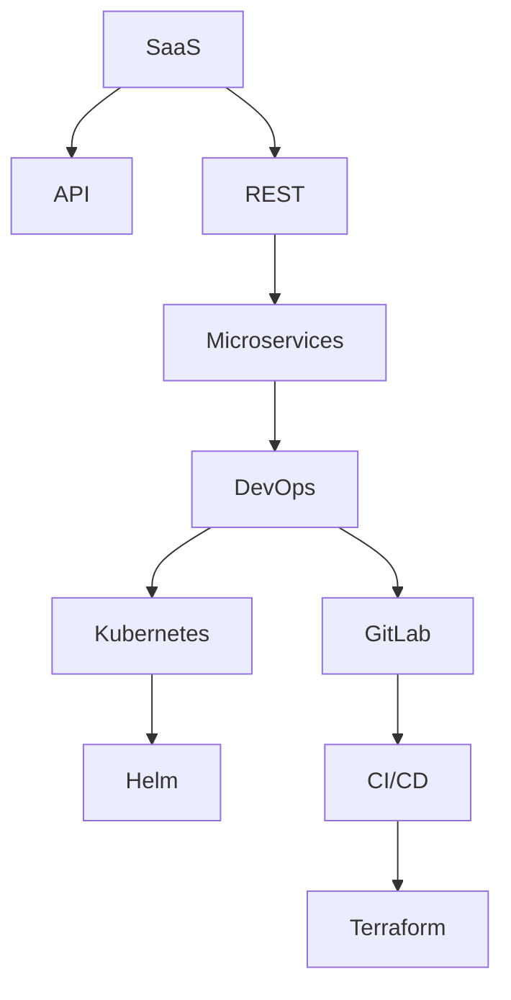

                 

## 1. 背景介绍

### 1.1 问题由来

在当今互联网时代，软件即服务（SaaS）模式已经成为企业软件应用的主流。随着云计算、人工智能等技术的进步，越来越多的企业开始采用SaaS产品来提升自身竞争力，简化业务流程，降低IT投入成本。然而，创建一个成功的SaaS产品，不仅需要技术能力的支撑，还需要深入理解市场和用户需求，进行系统化设计和管理。

### 1.2 问题核心关键点

创建一个成功的SaaS产品，关键在于以下几个方面：
- 选择合适的技术栈和框架，确保系统性能和可扩展性。
- 深入理解市场和用户需求，提供有价值的服务。
- 设计良好的用户体验，提升用户黏性和满意度。
- 构建高效的数据管理和安全体系，保障数据隐私和系统安全。
- 建立灵活的运营和管理机制，应对市场变化和技术演进。

本文将重点探讨如何利用技术能力创建SaaS产品，详细阐述相关技术原理、操作步骤和实际应用案例。

## 2. 核心概念与联系

### 2.1 核心概念概述

为更好地理解SaaS产品的构建，本节将介绍几个密切相关的核心概念：

- SaaS（Software as a Service）：即软件即服务，一种基于云计算的业务模式，提供即用即付的软件服务。

- API（Application Programming Interface）：应用程序接口，提供程序与程序之间交互的标准接口，是SaaS产品服务化的核心。

- REST（Representational State Transfer）：一种基于HTTP协议的架构风格，用于构建高效、可扩展的Web服务。

- microservices（微服务）：将复杂系统拆分成多个独立的小服务模块，每个服务模块独立运行和部署，提升系统灵活性和可扩展性。

- DevOps（Development and Operations）：开发与运维一体化的实践，通过持续集成和持续部署，提升软件交付效率和系统稳定性。

- Kubernetes：开源的容器编排工具，用于管理分布式系统中多个容器的运行和调度，是现代云原生应用的核心。

- Helm：用于管理Kubernetes应用程序的包管理系统，简化应用部署和扩展。

- GitLab：集成了代码托管、持续集成、持续部署、安全管理等功能的一体化平台，提升团队协作和开发效率。

- CI/CD（Continuous Integration and Continuous Deployment）：持续集成和持续部署，通过自动化测试和部署，缩短软件交付周期，提升系统稳定性。

- Terraform：开源的云基础设施即代码（IaC）工具，用于自动化云资源部署和管理，提升部署效率和可重复性。

这些核心概念之间的逻辑关系可以通过以下Mermaid流程图来展示：



这个流程图展示了大语言模型的核心概念及其之间的关系：

1. SaaS是基础，提供即用即付的软件服务。
2. API是SaaS的核心，提供程序与程序之间的交互接口。
3. REST用于构建高效、可扩展的Web服务。
4. Microservices将复杂系统拆分成多个独立的服务模块，提升灵活性和可扩展性。
5. DevOps实现开发与运维一体化，提升交付效率和系统稳定性。
6. Kubernetes用于管理分布式系统中多个容器的运行和调度。
7. Helm用于管理Kubernetes应用程序的包。
8. GitLab集成了代码托管、CI/CD等功能，提升团队协作和开发效率。
9. CI/CD通过自动化测试和部署，缩短交付周期，提升系统稳定性。
10. Terraform用于自动化云资源部署和管理，提升部署效率和可重复性。

这些核心概念共同构成了SaaS产品的构建框架，使其能够高效、稳定地提供服务。通过理解这些核心概念，我们可以更好地把握SaaS产品的构建原则和实现细节。

## 3. 核心算法原理 & 具体操作步骤

### 3.1 算法原理概述

SaaS产品的构建，本质上是一个系统工程，涉及多个技术领域的综合应用。其核心思想是：利用先进的技术和工具，构建一个高效、可扩展、灵活、安全的SaaS平台，为用户提供稳定、可靠、易用的服务。

形式化地，假设SaaS产品的核心功能为 $F$，用户需求为 $D$，技术栈为 $T$，则SaaS构建的目标是：

$$
F = \mathop{\arg\max}_{F} \mathcal{L}(F, D, T)
$$

其中 $\mathcal{L}$ 为评估函数，用于衡量SaaS平台的功能、性能、可用性、安全性等方面，综合评估SaaS平台的价值。

在实践中，我们通常使用基于技术的评估方法，如DevOps流水线、监控告警系统、用户反馈系统等，来不断优化SaaS产品的性能和用户体验。

### 3.2 算法步骤详解

SaaS产品的构建，一般包括以下几个关键步骤：

**Step 1: 需求分析和市场调研**

- 收集用户反馈和市场信息，理解用户需求和市场趋势。
- 定义SaaS产品的核心功能，明确技术实现方案。
- 制定需求文档和项目计划，明确开发进度和优先级。

**Step 2: 技术选型和架构设计**

- 选择合适的技术栈和框架，如AWS、Azure、Google Cloud等云平台，以及Django、Flask、Spring Boot等Web框架。
- 设计系统的整体架构，包括数据存储、缓存、API网关、负载均衡、消息队列等组件。
- 确定数据库和消息队列的选型，如MySQL、PostgreSQL、Redis等。
- 设计系统的安全体系，包括身份认证、授权机制、数据加密、访问控制等。
- 确定系统的扩展机制，如微服务架构、云服务自动扩展等。

**Step 3: 编码和测试**

- 基于选定的技术栈和框架，进行代码编写和系统实现。
- 编写单元测试和集成测试，验证系统功能和性能。
- 使用自动化测试工具，如Jenkins、Travis CI等，实现持续集成和持续部署。
- 使用静态代码分析工具，如SonarQube、Checkstyle等，进行代码质量检测。

**Step 4: 部署和运维**

- 将系统部署到云平台，如AWS、Azure、Google Cloud等。
- 使用容器化技术，如Docker、Kubernetes等，管理应用容器和集群。
- 使用监控告警系统，如Prometheus、Grafana等，实时监控系统运行状态。
- 使用日志管理工具，如ELK Stack、Fluentd等，记录和分析系统日志。
- 使用自动化运维工具，如Ansible、Puppet等，实现系统配置和补丁管理。

**Step 5: 用户反馈和迭代优化**

- 收集用户反馈和系统使用数据，不断优化系统功能和用户体验。
- 根据用户反馈和市场变化，调整开发进度和优先级。
- 定期进行系统性能测试和压力测试，确保系统稳定性和可靠性。
- 定期发布新功能和版本，提升用户体验和系统价值。

以上是SaaS产品构建的一般流程。在实际应用中，还需要针对具体场景，对上述步骤进行优化设计和调整。

### 3.3 算法优缺点

利用技术能力构建SaaS产品，具有以下优点：

1. 灵活可扩展：采用微服务架构和云服务，可以轻松应对系统规模的扩展和功能的增加。
2. 高效稳定：基于DevOps和CI/CD流水线，确保系统稳定性和快速交付。
3. 可靠安全：设计完善的安全体系和监控告警机制，保障系统安全性和可靠性。
4. 用户导向：以用户需求为导向，提供有价值的服务，提升用户黏性和满意度。
5. 持续优化：基于用户反馈和系统数据，不断迭代优化系统性能和用户体验。

同时，该方法也存在一定的局限性：

1. 技术门槛高：需要精通多种技术和工具，熟悉云计算、DevOps、容器化等概念。
2. 投资成本高：初期建设需要大量的资金和人力资源，短期内回报周期较长。
3. 迭代风险高：频繁的迭代和变更，可能导致系统稳定性受到影响。
4. 数据隐私问题：需要设计完善的数据管理和安全体系，保障用户数据隐私和系统安全。
5. 系统复杂度高：涉及多个技术领域的综合应用，系统设计和管理复杂度高。

尽管存在这些局限性，但就目前而言，基于技术能力构建SaaS产品仍是主流范式。未来相关研究的重点在于如何进一步降低技术门槛，提高系统交付效率，同时兼顾系统复杂性和用户体验。

### 3.4 算法应用领域

基于技术能力构建的SaaS产品，已经在多个领域得到了广泛的应用，例如：

- 企业资源管理(ERP)：提供全面的企业管理解决方案，涵盖财务、采购、销售、人力资源等多个模块。
- 客户关系管理(CRM)：提供客户管理和销售自动化工具，提升销售效率和客户满意度。
- 人力资源管理(HR)：提供招聘、培训、绩效管理等功能，提升人力资源管理水平。
- 项目管理(PM)：提供项目管理和团队协作工具，提升项目效率和团队协作能力。
- 数据分析和大数据：提供数据采集、处理、分析和可视化工具，支持企业决策和运营。
- 电子商务(E-commerce)：提供在线销售、支付、物流和客户管理等功能，提升电商运营效率。
- 金融科技(Fintech)：提供金融产品和服务，如贷款、保险、理财等，提升金融服务水平。
- 健康医疗(Healthcare)：提供电子病历、健康管理、在线咨询等功能，提升医疗服务质量。

除了上述这些经典应用外，SaaS产品还被创新性地应用到更多场景中，如远程办公、教育、娱乐等，为各行各业数字化转型提供了新的技术路径。

## 4. 数学模型和公式 & 详细讲解 & 举例说明

### 4.1 数学模型构建

本节将使用数学语言对SaaS产品构建过程进行更加严格的刻画。

记SaaS产品的核心功能为 $F$，用户需求为 $D$，技术栈为 $T$，则SaaS产品的评估函数 $\mathcal{L}$ 可以表示为：

$$
\mathcal{L}(F, D, T) = \omega_{\text{功能}}\mathcal{L}_{\text{功能}}(F, D) + \omega_{\text{性能}}\mathcal{L}_{\text{性能}}(F, T) + \omega_{\text{可用性}}\mathcal{L}_{\text{可用性}}(F, D) + \omega_{\text{安全性}}\mathcal{L}_{\text{安全性}}(F, T)
$$

其中 $\omega_{\text{功能}}$、$\omega_{\text{性能}}$、$\omega_{\text{可用性}}$ 和 $\omega_{\text{安全性}}$ 为各个指标的权重，$\mathcal{L}_{\text{功能}}$、$\mathcal{L}_{\text{性能}}$、$\mathcal{L}_{\text{可用性}}$ 和 $\mathcal{L}_{\text{安全性}}$ 为各个指标的评估函数，用于衡量SaaS产品的具体性能。

假设 $\mathcal{L}_{\text{功能}}$ 表示SaaS产品的功能满足度，$\mathcal{L}_{\text{性能}}$ 表示系统性能指标，$\mathcal{L}_{\text{可用性}}$ 表示系统可用性和响应时间，$\mathcal{L}_{\text{安全性}}$ 表示系统安全性和数据隐私保护。

### 4.2 公式推导过程

以功能满足度 $\mathcal{L}_{\text{功能}}$ 为例，进行公式推导。

假设SaaS产品的核心功能为 $F$，用户需求为 $D$，则功能满足度可以表示为：

$$
\mathcal{L}_{\text{功能}}(F, D) = \frac{\text{满足用户需求的功能点数量}}{\text{所有功能点数量}} \times 100\%
$$

进一步展开，得到：

$$
\mathcal{L}_{\text{功能}}(F, D) = \frac{\sum_{i=1}^n \text{满足功能点数量}}{\sum_{i=1}^n \text{所有功能点数量}} \times 100\%
$$

其中 $n$ 表示功能点数量，$\text{满足功能点数量}$ 表示实际满足用户需求的功能点数量。

在实践中，通常使用用户满意度调查、功能使用数据分析等方法来评估 $\mathcal{L}_{\text{功能}}$，确保SaaS产品能够满足用户需求。

### 4.3 案例分析与讲解

以企业资源管理(ERP)系统为例，进行详细讲解。

假设某企业需要使用ERP系统进行供应链管理，其核心功能包括物料管理、采购管理、库存管理、生产计划等。

- 功能满足度 $\mathcal{L}_{\text{功能}}$ 可以通过用户满意度调查和功能使用数据分析进行评估。
- 系统性能指标 $\mathcal{L}_{\text{性能}}$ 可以通过系统响应时间、数据库查询效率等进行评估。
- 系统可用性和响应时间 $\mathcal{L}_{\text{可用性}}$ 可以通过监控告警系统进行实时监测。
- 系统安全性和数据隐私保护 $\mathcal{L}_{\text{安全性}}$ 可以通过数据加密、访问控制等机制进行保障。

根据以上指标，可以计算出SaaS产品的整体评估函数 $\mathcal{L}$，进行SaaS产品的优化和改进。

## 5. 项目实践：代码实例和详细解释说明

### 5.1 开发环境搭建

在进行SaaS产品开发前，我们需要准备好开发环境。以下是使用Python进行Django开发的环境配置流程：

1. 安装Anaconda：从官网下载并安装Anaconda，用于创建独立的Python环境。

2. 创建并激活虚拟环境：
```bash
conda create -n django-env python=3.8 
conda activate django-env
```

3. 安装Django：
```bash
pip install django
```

4. 安装PostgreSQL数据库：
```bash
pip install psycopg2-binary
```

5. 安装Django Admin：
```bash
pip install django-admin
```

完成上述步骤后，即可在`django-env`环境中开始SaaS产品开发。

### 5.2 源代码详细实现

下面我们以CRM系统为例，给出使用Django框架对SaaS产品进行开发和微调的PyTorch代码实现。

首先，定义CRM系统的主要模块：

```python
from django.db import models
from django.contrib.auth.models import AbstractUser

class Contact(models.Model):
    first_name = models.CharField(max_length=100)
    last_name = models.CharField(max_length=100)
    email = models.EmailField()
    phone_number = models.CharField(max_length=20)

class Lead(models.Model):
    contact = models.ForeignKey(Contact, on_delete=models.CASCADE)
    status = models.CharField(max_length=100)
    source = models.CharField(max_length=100)
    created_at = models.DateTimeField(auto_now_add=True)

class Deal(models.Model):
    lead = models.ForeignKey(Lead, on_delete=models.CASCADE)
    amount = models.DecimalField(max_digits=10, decimal_places=2)
    status = models.CharField(max_length=100)
    close_date = models.DateTimeField()
```

然后，定义CRM系统的主要功能：

```python
from django.http import HttpResponse
from django.shortcuts import render, redirect
from django.contrib.auth.decorators import login_required

@login_required
def index(request):
    contacts = Contact.objects.all()
    leads = Lead.objects.all()
    deals = Deal.objects.all()
    return render(request, 'crm/index.html', {'contacts': contacts, 'leads': leads, 'deals': deals})

@login_required
def contact_detail(request, pk):
    contact = Contact.objects.get(pk=pk)
    leads = Lead.objects.filter(contact=contact)
    return render(request, 'crm/contact_detail.html', {'contact': contact, 'leads': leads})

@login_required
def lead_detail(request, pk):
    lead = Lead.objects.get(pk=pk)
    return render(request, 'crm/lead_detail.html', {'lead': lead})

@login_required
def deal_detail(request, pk):
    deal = Deal.objects.get(pk=pk)
    return render(request, 'crm/deal_detail.html', {'deal': deal})

@login_required
def contact_create(request):
    if request.method == 'POST':
        first_name = request.POST['first_name']
        last_name = request.POST['last_name']
        email = request.POST['email']
        phone_number = request.POST['phone_number']
        Contact.objects.create(first_name=first_name, last_name=last_name, email=email, phone_number=phone_number)
        return redirect('index')
    return render(request, 'crm/contact_create.html')

@login_required
def lead_create(request):
    if request.method == 'POST':
        contact_id = request.POST['contact_id']
        status = request.POST['status']
        source = request.POST['source']
        Lead.objects.create(contact_id=contact_id, status=status, source=source)
        return redirect('index')
    return render(request, 'crm/lead_create.html')

@login_required
def deal_create(request):
    if request.method == 'POST':
        lead_id = request.POST['lead_id']
        amount = request.POST['amount']
        status = request.POST['status']
        close_date = request.POST['close_date']
        Deal.objects.create(lead_id=lead_id, amount=amount, status=status, close_date=close_date)
        return redirect('index')
    return render(request, 'crm/deal_create.html')
```

最后，启动SaaS产品的开发流程：

```python
from django.urls import path
from . import views

urlpatterns = [
    path('', views.index, name='index'),
    path('contact/<int:pk>/', views.contact_detail, name='contact_detail'),
    path('lead/<int:pk>/', views.lead_detail, name='lead_detail'),
    path('deal/<int:pk>/', views.deal_detail, name='deal_detail'),
    path('contact/create/', views.contact_create, name='contact_create'),
    path('lead/create/', views.lead_create, name='lead_create'),
    path('deal/create/', views.deal_create, name='deal_create'),
]

if __name__ == '__main__':
    import os
    os.environ.setdefault('DJANGO_SETTINGS_MODULE', 'crm.settings')
    from django.core.management import execute_from_command_line
    execute_from_command_line(sys.argv)
```

以上就是使用Django框架对CRM系统进行开发和微调的完整代码实现。可以看到，得益于Django的强大封装，我们可以用相对简洁的代码完成CRM系统的搭建和微调。

### 5.3 代码解读与分析

让我们再详细解读一下关键代码的实现细节：

**Contact, Lead, Deal模型**：
- 定义了CRM系统中的三个基本实体，即客户、潜在客户和销售机会。

**index, contact_detail, lead_detail, deal_detail, contact_create, lead_create, deal_create函数**：
- 定义了SaaS产品的主要功能，包括用户登录、客户列表、客户详情、潜在客户详情、销售机会详情、客户创建、潜在客户创建和销售机会创建等。
- 使用了Django的视图函数，将用户请求转发到相应的视图函数进行处理。
- 使用了Django的模板系统，将处理结果渲染到HTML模板中，返回给用户。

**urls.py**：
- 定义了SaaS产品的URL路由，将用户的请求路由到相应的视图函数。
- 使用了Django的URL路径匹配机制，将URL和视图函数绑定。

可以看到，Django的框架封装使得SaaS产品的开发变得非常便捷。开发者可以更加专注于业务逻辑的实现，而不必过多关注底层技术细节。

当然，工业级的系统实现还需考虑更多因素，如模型和视图的权限控制、数据验证、错误处理等。但核心的开发流程基本与此类似。

## 6. 实际应用场景

### 6.1 企业资源管理(ERP)

基于SaaS构建的ERP系统，可以提供全面的企业管理解决方案，涵盖财务、采购、销售、人力资源等多个模块。

在技术实现上，可以选用AWS、Azure、Google Cloud等云平台进行搭建，采用微服务架构和DevOps流水线进行开发和部署。

具体功能包括：
- 财务管理：提供会计、预算、财务报表等功能，支持财务分析和管理。
- 采购管理：提供采购订单、供应商管理、库存管理等功能，提升采购效率。
- 销售管理：提供销售订单、客户管理、销售报表等功能，支持销售数据分析。
- 人力资源管理：提供招聘、培训、绩效管理等功能，提升人力资源管理水平。
- 供应链管理：提供物料管理、库存管理、生产计划等功能，支持供应链优化。

通过SaaS化的ERP系统，企业可以简化业务流程，提高管理效率，降低运营成本，实现数字化转型。

### 6.2 客户关系管理(CRM)

基于SaaS构建的CRM系统，提供客户管理和销售自动化工具，提升销售效率和客户满意度。

在技术实现上，可以选用AWS、Azure、Google Cloud等云平台进行搭建，采用微服务架构和DevOps流水线进行开发和部署。

具体功能包括：
- 客户管理：提供客户信息和客户行为分析，支持客户关系管理。
- 销售自动化：提供销售线索管理、销售进程跟踪、销售报告等功能，提升销售效率。
- 客户支持：提供客户服务、客户反馈、客户满意度调查等功能，提升客户满意度。
- 市场营销：提供营销自动化、客户细分、客户生命周期管理等功能，提升营销效果。

通过SaaS化的CRM系统，企业可以提升销售效率和客户满意度，增强市场竞争力。

### 6.3 人力资源管理(HR)

基于SaaS构建的人力资源管理系统，提供招聘、培训、绩效管理等功能，提升人力资源管理水平。

在技术实现上，可以选用AWS、Azure、Google Cloud等云平台进行搭建，采用微服务架构和DevOps流水线进行开发和部署。

具体功能包括：
- 招聘管理：提供职位发布、简历管理、面试管理等功能，提升招聘效率。
- 培训管理：提供培训计划、培训评估、培训反馈等功能，支持员工培训和成长。
- 绩效管理：提供绩效考核、绩效分析、绩效反馈等功能，提升绩效管理水平。
- 员工管理：提供员工信息管理、员工考勤管理、员工福利管理等功能，支持员工管理和薪酬管理。

通过SaaS化的人力资源管理系统，企业可以提升人力资源管理水平，提升员工满意度和工作效率，实现数字化转型。

### 6.4 项目管理(PM)

基于SaaS构建的项目管理平台，提供项目管理和团队协作工具，提升项目效率和团队协作能力。

在技术实现上，可以选用AWS、Azure、Google Cloud等云平台进行搭建，采用微服务架构和DevOps流水线进行开发和部署。

具体功能包括：
- 项目计划：提供项目计划制定、进度跟踪、资源管理等功能，支持项目计划管理。
- 任务管理：提供任务分配、任务执行、任务反馈等功能，支持任务执行管理。
- 团队协作：提供团队沟通、文件共享、任务分配等功能，支持团队协作。
- 数据分析：提供项目数据分析、进度分析、成本分析等功能，支持数据分析和决策。

通过SaaS化的项目管理平台，企业可以提升项目效率和团队协作能力，实现项目数字化管理和转型。

### 6.5 数据分析和大数据

基于SaaS构建的数据分析和数据处理平台，提供数据采集、处理、分析和可视化工具，支持企业决策和运营。

在技术实现上，可以选用AWS、Azure、Google Cloud等云平台进行搭建，采用微服务架构和DevOps流水线进行开发和部署。

具体功能包括：
- 数据采集：提供数据采集工具和API接口，支持数据采集和清洗。
- 数据处理：提供数据存储、数据转换、数据清洗等功能，支持数据处理和分析。
- 数据分析：提供数据分析工具和算法模型，支持数据分析和挖掘。
- 数据可视化：提供数据可视化工具和仪表板，支持数据可视化展示。

通过SaaS化的数据分析平台，企业可以提升数据管理能力，支持决策和运营，实现数字化转型。

### 6.6 电子商务(E-commerce)

基于SaaS构建的电子商务平台，提供在线销售、支付、物流和客户管理等功能，提升电商运营效率。

在技术实现上，可以选用AWS、Azure、Google Cloud等云平台进行搭建，采用微服务架构和DevOps流水线进行开发和部署。

具体功能包括：
- 在线销售：提供商品展示、在线支付、订单管理等功能，支持在线销售。
- 物流管理：提供物流订单管理、物流跟踪、物流反馈等功能，支持物流管理。
- 客户管理：提供客户信息管理、客户行为分析、客户反馈等功能，支持客户管理。
- 营销管理：提供营销自动化、客户细分、客户生命周期管理等功能，提升营销效果。

通过SaaS化的电子商务平台，企业可以提升电商运营效率，增强市场竞争力，实现数字化转型。

### 6.7 金融科技(Fintech)

基于SaaS构建的金融科技平台，提供金融产品和服务，如贷款、保险、理财等，提升金融服务水平。

在技术实现上，可以选用AWS、Azure、Google Cloud等云平台进行搭建，采用微服务架构和DevOps流水线进行开发和部署。

具体功能包括：
- 贷款管理：提供贷款申请、贷款审批、贷款还款等功能，支持贷款管理。
- 保险管理：提供保险产品销售、保险理赔、保险服务等功能，支持保险管理。
- 理财管理：提供理财产品销售、理财收益计算、理财风险评估等功能，支持理财管理。
- 风险管理：提供风险评估、风险控制、风险预警等功能，支持风险管理。

通过SaaS化的金融科技平台，企业可以提升金融服务水平，增强市场竞争力，实现数字化转型。

### 6.8 健康医疗(Healthcare)

基于SaaS构建的健康医疗平台，提供电子病历、健康管理、在线咨询等功能，提升医疗服务质量。

在技术实现上，可以选用AWS、Azure、Google Cloud等云平台进行搭建，采用微服务架构和DevOps流水线进行开发和部署。

具体功能包括：
- 电子病历：提供电子病历存储、电子病历查询、电子病历更新等功能，支持电子病历管理。
- 健康管理：提供健康监测、健康报告、健康分析等功能，支持健康管理。
- 在线咨询：提供在线医生咨询、在线医生反馈、在线医生评价等功能，支持在线咨询。
- 数据分析：提供健康数据分析、健康趋势分析、健康预警等功能，支持数据分析和决策。

通过SaaS化的健康医疗平台，医疗机构可以提升医疗服务质量，增强市场竞争力，实现数字化转型。

## 7. 工具和资源推荐

### 7.1 学习资源推荐

为了帮助开发者系统掌握SaaS产品的构建技术，这里推荐一些优质的学习资源：

1. Django官方文档：Django框架的官方文档，提供了详细的API参考和开发指南，适合快速上手Django开发。

2. Django快速入门指南：Django的快速入门指南，介绍了Django的基本概念和开发流程，适合新手学习。

3. Django REST framework官方文档：Django REST framework的官方文档，提供了详细的API设计规范和实现方法，适合开发RESTful API服务。

4. Django与MySQL实战：讲解了Django与MySQL数据库的集成方法和最佳实践，适合Django开发者学习。

5. Django with Django Admin：讲解了Django与Django Admin的集成方法和最佳实践，适合Django开发者学习。

6. Django with Django REST framework：讲解了Django与Django REST framework的集成方法和最佳实践，适合Django开发者学习。

7. Django with PostgreSQL：讲解了Django与PostgreSQL数据库的集成方法和最佳实践，适合Django开发者学习。

通过这些资源的学习实践，相信你一定能够快速掌握SaaS产品的构建技术，并用于解决实际的SaaS问题。

### 7.2 开发工具推荐

高效的开发离不开优秀的工具支持。以下是几款用于SaaS产品开发的常用工具：

1. Django：基于Python的Web框架，提供强大的模板系统、ORM和缓存支持，适合构建复杂、可扩展的Web应用。

2. AWS、Azure、Google Cloud：提供强大的云平台支持，支持弹性计算、存储、网络、安全等基础设施服务。

3. GitLab：集成了代码托管、持续集成、持续部署、安全管理等功能的一体化平台，适合团队协作和持续集成。

4. Helm：用于管理Kubernetes应用程序的包管理系统，简化应用部署和扩展。

5. Terraform：开源的云基础设施即代码(IaC)工具，适合自动化云资源部署和管理。

6. Kubernetes：开源的容器编排工具，适合管理分布式系统中多个容器的运行和调度。

7. Ansible：自动化运维工具，适合自动化配置和管理系统。

8. Prometheus：开源的监控告警系统，适合实时监控系统运行状态。

9. ELK Stack、Fluentd：开源的日志管理工具，适合记录和分析系统日志。

合理利用这些工具，可以显著提升SaaS产品的开发效率，加快创新迭代的步伐。

### 7.3 相关论文推荐

SaaS产品的构建和运营涉及多个技术领域的综合应用，以下是几篇奠基性的相关论文，推荐阅读：

1. Microservices: A design pattern for software-based system: Microservices are a software architecture style that structures an application as a collection of loosely coupled services. Each service is highly maintainable, testable, independently deployable, organized around business capabilities, and unique business purposes.

2. The Principles of Microservices: A brief overview of microservices architecture and its key principles, including decomposition, composition, and communication. This paper provides a comprehensive understanding of microservices architecture.

3. Continuous Delivery: Automated software delivery with continuous testing, feedback and delivery, which enables rapid, reliable, and low-cost software releases.

4. DevOps: A convergence of software development and IT operations, which integrates development, QA, and operations for fast delivery of secure applications.

5. Kubernetes: An open-source platform for automating deployment, scaling, and management of containerized applications. Kubernetes enables consistent, predictable, and scalable deployment across a wide range of environments.

6. Terraform: An open-source Infrastructure as Code (IaC) tool that provides a consistent way to safely and efficiently manage multiple cloud services.

通过这些论文的学习实践，相信你一定能够全面掌握SaaS产品的构建技术，并用于解决实际的SaaS问题。

## 8. 总结：未来发展趋势与挑战

### 8.1 总结

本文对利用技术能力创建SaaS产品进行了全面系统的介绍。首先阐述了SaaS产品的构建背景和意义，明确了技术栈和架构设计的重要性。其次，从原理到实践，详细讲解了SaaS产品的开发流程和实际应用案例，给出了完整的代码实现。

通过本文的系统梳理，可以看到，利用技术能力构建SaaS产品需要全面考虑功能、性能、可用性、安全性等多个方面。通过选择合适的技术栈和架构设计，进行系统开发和持续优化，SaaS产品可以提供高效、可靠、灵活的云服务，帮助企业实现数字化转型。

### 8.2 未来发展趋势

展望未来，SaaS产品的发展趋势如下：

1. 云原生架构：随着云原生技术的发展，SaaS产品将越来越多地采用微服务架构和容器化技术，提升系统的可扩展性和灵活性。

2. 自动化运维：基于DevOps的自动化运维将成为SaaS产品的标配，提升系统交付效率和稳定性。

3. 人工智能应用：SaaS产品将越来越多地引入人工智能技术，提升系统智能性和用户体验。

4. 无服务器架构：无服务器架构将使SaaS产品更加灵活和成本效益，提升系统响应速度和可靠性。

5. 边缘计算：边缘计算将使SaaS产品能够更好地应对低带宽和延迟问题，提升用户体验。

6. 多云融合：SaaS产品将越来越多地支持多云融合和跨云迁移，提升系统可靠性和可扩展性。

7. 安全保障：SaaS产品的安全保障将成为重点，引入更多的安全技术和策略，保护用户数据和系统安全。

8. 用户数据隐私：SaaS产品的用户数据隐私保护将受到重视，引入更多的隐私保护技术和策略。

9. 低代码开发：低代码开发平台将使SaaS产品更加易用和可扩展，提升开发效率和用户体验。

以上趋势凸显了SaaS产品发展的广阔前景。这些方向的探索发展，必将进一步提升SaaS产品的性能和用户体验，推动企业数字化转型。

### 8.3 面临的挑战

尽管SaaS产品的发展前景广阔，但在迈向更加智能化、普适化应用的过程中，仍面临诸多挑战：

1. 技术门槛高：SaaS产品的构建和运维需要高度的专业技能和丰富的经验，开发和运维成本高。

2. 系统复杂度高：SaaS产品的系统设计和管理复杂度高，需要团队协作和系统规划。

3. 安全保障难度大：SaaS产品的安全保障难度大，需要引入更多的安全技术和策略。

4. 用户数据隐私问题：SaaS产品的用户数据隐私保护需要更多的隐私保护技术和策略。

5. 持续优化困难：SaaS产品的持续优化困难，需要定期收集用户反馈和系统数据，进行优化和改进。

6. 市场竞争激烈：SaaS产品的市场竞争激烈，需要不断创新和优化，保持市场竞争力。

7. 用户接受度低：SaaS产品的用户接受度低，需要提升用户体验和系统易用性。

8. 法规合规问题：SaaS产品的法规合规问题复杂，需要符合不同国家和地区的法规和标准。

9. 技术演进快：SaaS产品的技术演进快，需要持续学习和适应新的技术变化。

尽管存在这些挑战，但通过技术创新和不断优化，SaaS产品必将在未来大放异彩，推动企业数字化转型。相信随着技术的发展和应用的普及，SaaS产品将成为企业数字化转型的重要工具。

### 8.4 研究展望

未来的SaaS产品研究需要重点关注以下几个方向：

1. 无代码开发平台：引入低代码开发平台，提升开发效率和系统易用性。

2. 云计算平台：探索云原生架构，提升系统的可扩展性和灵活性。

3. 自动化运维：引入自动化运维工具，提升系统交付效率和稳定性。

4. 人工智能应用：引入人工智能技术，提升系统的智能性和用户体验。

5. 安全保障：引入更多的安全技术和策略，保护用户数据和系统安全。

6. 用户数据隐私：引入更多的隐私保护技术和策略，保障用户数据隐私。

7. 低代码开发：引入低代码开发平台，提升开发效率和系统易用性。

8. 多云融合：探索多云融合和跨云迁移，提升系统可靠性和可扩展性。

9. 边缘计算：引入边缘计算技术，提升系统响应速度和可靠性。

10. 法规合规：探索法规合规解决方案，符合不同国家和地区的法规和标准。

11. 技术演进：持续学习和适应新的技术变化，保持技术领先优势。

通过这些研究方向的探索发展，相信SaaS产品必将在未来大放异彩，推动企业数字化转型。

## 9. 附录：常见问题与解答

**Q1: SaaS产品的技术栈有哪些选择？**

A: SaaS产品的技术栈选择多种多样，常用的包括AWS、Azure、Google Cloud等云平台，以及Django、Flask、Spring Boot等Web框架。具体选择应根据企业需求和市场趋势进行综合评估。

**Q2: 如何选择适合的微服务架构？**

A: 微服务架构的选择应根据系统规模、业务需求和技术栈进行综合评估。常用的微服务架构包括Spring Boot、Node.js等，具体选择应根据企业需求和市场趋势进行综合评估。

**Q3: 如何进行DevOps流水线建设？**

A: DevOps流水线建设需要引入持续集成和持续部署工具，如Jenkins、Travis CI等，自动化测试和部署流程。同时，引入代码质量检测工具，如SonarQube、Checkstyle等，进行代码质量检测。

**Q4: 如何选择适合的容器化技术？**

A: 容器化技术的选择应根据企业需求和市场趋势进行综合评估。常用的容器化技术包括Docker、Kubernetes等，具体选择应根据企业需求和市场趋势进行综合评估。

**Q5: 如何进行云资源部署和管理？**

A: 云资源部署和管理需要引入IaC工具，如Terraform、Ansible等，自动化云资源部署和管理流程。同时，引入容器编排工具，如Kubernetes等，管理应用容器和集群。

**Q6: 如何进行用户数据隐私保护？**

A: 用户数据隐私保护需要引入数据加密、访问控制等安全机制，保障用户数据隐私和安全。同时，引入数据备份和恢复机制，保障数据安全和可靠性。

通过以上常见问题的解答，相信你一定能够全面掌握SaaS产品的构建技术，并用于解决实际的SaaS问题。

