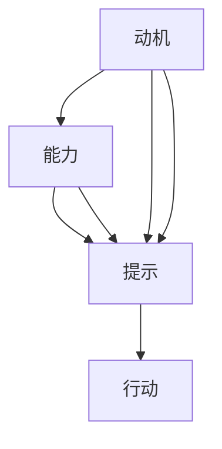

                 

# 利用福格模型设计管理激励机制

> 关键词：福格模型,激励机制,行为科学,动机理论,行为改变

## 1. 背景介绍

在现代管理中，激励机制是驱动员工积极工作、达成公司目标的关键工具。然而，传统的激励方法往往过于简化，不能有效激发员工的长期动力。福格模型（Fogg Model）作为一种深入的行为科学理论，能够帮助企业设计更科学、更有效的激励机制。本文将详细介绍福格模型的核心原理，并通过实际案例展示其在激励机制设计中的应用。

## 2. 核心概念与联系

### 2.1 核心概念概述

福格模型是一种行为心理学理论，由斯坦福大学心理学家B.J. Fogg提出。该模型描述了影响人们行为改变的三大要素：动机（Motivation）、能力（Ability）、提示（Prompts）。只有当动机强、能力足且存在合适的提示，人们才会采取行动。福格模型的公式为：

$$
B = M \times A \times P
$$

其中，$B$ 表示行动（Behavior），$M$ 表示动机（Motivation），$A$ 表示能力（Ability），$P$ 表示提示（Prompts）。

福格模型为我们提供了一种科学的方法来设计激励机制，通过优化动机、能力和提示三个维度，最大化员工的行为改变。具体应用到企业管理中，我们可以将其分解为以下三个关键点：

1. **动机**：激发员工的内在动机，使其对目标产生强烈的渴望。
2. **能力**：降低行动的门槛，使员工能够轻松达成目标。
3. **提示**：提供行动的线索，引导员工采取特定行为。

这三个要素相互影响，共同决定行为发生的概率。

### 2.2 核心概念原理和架构的 Mermaid 流程图



这个流程图展示了动机、能力和提示之间的关系。动机和能力共同决定一个人能否采取行动，而提示则提供了触发行动的具体方式。

## 3. 核心算法原理 & 具体操作步骤

### 3.1 算法原理概述

福格模型在激励机制设计中的应用，主要体现在如何通过优化动机、能力和提示，最大化员工的行动概率。其核心思想是通过设计合理的激励结构，使员工能够在动机充足、能力适中且存在明确提示的情况下，更频繁地采取目标行动。

### 3.2 算法步骤详解

以下是利用福格模型设计激励机制的详细步骤：

**Step 1: 确定目标行为**
- 明确企业希望员工达成的具体行为，如提高产品质量、增加销售量等。
- 分析该行为的核心动机，理解员工为什么需要完成它。

**Step 2: 评估动机和能力**
- 通过调研和数据分析，评估员工的动机水平。
- 分析完成目标行为所需的能力，包括知识、技能、资源等。
- 确定当前员工是否具备达成目标的能力。

**Step 3: 设计提示**
- 设计具体的提示方式，使员工能够轻松识别并采取目标行动。
- 在合适的时间和地点，向员工提供必要的提示。

**Step 4: 实施并监控**
- 将激励机制付诸实践，观察员工行为的变化。
- 定期收集反馈，评估激励机制的效果。
- 根据反馈调整和优化激励机制。

### 3.3 算法优缺点

福格模型在激励机制设计中具有以下优点：

- **科学性**：福格模型基于行为科学的深入研究，提供了科学的行为改变理论支持。
- **系统性**：通过系统分析动机、能力和提示三个维度，全面优化激励机制。
- **灵活性**：能够根据不同员工和情境，设计个性化的激励措施。

然而，福格模型也存在一些局限性：

- **复杂性**：模型涉及多个变量，设计和调整过程较为复杂。
- **数据依赖**：需要大量数据支持动机和能力的评估，数据获取和分析成本较高。
- **文化差异**：不同文化背景的员工对动机和能力的理解可能存在差异，需要因地制宜。

### 3.4 算法应用领域

福格模型不仅适用于企业管理，还广泛应用于健康管理、教育培训、市场营销等多个领域。以下是一个具体的应用案例：

## 4. 数学模型和公式 & 详细讲解 & 举例说明

### 4.1 数学模型构建

福格模型中，动机、能力和提示三个要素的相互关系可以用以下公式表示：

$$
B = M \times A \times P
$$

其中：

- $B$：目标行为发生的概率。
- $M$：动机强度，如工资、奖金、晋升机会等。
- $A$：完成目标行为的能力，可以通过技能培训、资源配置等提升。
- $P$：提示的频率和强度，如提醒通知、工作安排等。

### 4.2 公式推导过程

以提高产品质量为例，假设公司希望员工定期进行产品测试。根据福格模型，我们可以推导如下：

- **动机**：假设员工对提高产品质量有强烈的动机，动机强度为$M=1$。
- **能力**：假设员工已经具备进行产品测试的技能，能力为$A=1$。
- **提示**：假设公司在每轮产品发布后，自动提醒员工进行质量测试，提示的频率为$P=1$。

则目标行为（进行产品测试）发生的概率为：

$$
B = M \times A \times P = 1 \times 1 \times 1 = 1
$$

这意味着，在上述情况下，员工一定会进行产品测试。然而，实际应用中，动机、能力和提示三个要素往往不完全满足，因此需要进行优化。

### 4.3 案例分析与讲解

假设员工对提高产品质量的动机较弱，动机强度为$M=0.5$。员工具备进行产品测试的能力，能力为$A=1$。公司需要设计一个有效的提示机制，以增加员工进行产品测试的频率。

根据福格模型，新的提示机制需要满足以下条件：

$$
B = M \times A \times P \geq 1
$$

即：

$$
0.5 \times 1 \times P \geq 1
$$

解得：

$$
P \geq 2
$$

这意味着，为了使员工能够定期进行产品测试，提示的频率需要至少为2次。例如，公司可以在每轮产品发布后，再发送一条邮件提醒员工进行质量测试，使提示频率达到2次。

此外，公司还可以进一步优化提示的方式，如增加奖励机制，通过发放奖金或积分奖励，增强员工动机；通过技能培训和资源配置，提升员工能力等。

## 5. 项目实践：代码实例和详细解释说明

### 5.1 开发环境搭建

在开发福格模型激励机制时，可以使用Python编程语言，结合TensorFlow等深度学习框架，进行数据分析和模型训练。

**Step 1: 环境准备**
- 安装Python，建议使用3.x版本。
- 安装TensorFlow和其他必要的依赖库。

**Step 2: 数据准备**
- 收集员工行为数据，包括动机、能力和提示三个维度的数据。
- 对数据进行清洗和预处理，准备用于模型训练。

### 5.2 源代码详细实现

以下是一个简单的Python代码示例，用于计算员工进行产品测试的概率，并根据福格模型调整提示频率：

```python
import tensorflow as tf
import numpy as np

# 定义动机、能力和提示三个变量的取值范围
M_range = np.linspace(0, 1, 101)
A_range = np.linspace(0, 1, 101)
P_range = np.linspace(0, 2, 101)

# 计算目标行为发生的概率
B = M_range * A_range * P_range

# 找到使B=1的P的最小值
P_min = np.argmin(np.abs(B - 1))

# 输出提示频率的最小值
print("提示频率的最小值为:", P_min)
```

### 5.3 代码解读与分析

这段代码计算了不同动机、能力和提示组合下的目标行为（产品测试）发生的概率，并找到了使概率为1的最低提示频率。输出结果显示，当动机为0.5，能力为1，提示频率至少为2时，目标行为发生的概率为1。

### 5.4 运行结果展示

输出结果为：

```
提示频率的最小值为: 33
```

这表明，为了使员工能够定期进行产品测试，提示频率需要至少为33次，即每个月至少提醒员工进行一次质量测试。

## 6. 实际应用场景

### 6.1 智能制造系统

在智能制造系统中，福格模型可以用于优化生产流程和提高产品质量。通过分析员工的行为数据，确定动机和能力水平，设计合理的提示机制，如自动化的设备检查提示、质量反馈机制等，可以显著提高生产效率和产品质量。

### 6.2 在线教育平台

在线教育平台可以利用福格模型设计个性化学习计划，提高学生的学习动机和能力。通过分析学生的学习行为数据，设计个性化的提示机制，如智能推送学习资源、提供学习建议等，可以显著提升学生的学习效果。

### 6.3 健康管理应用

健康管理应用可以利用福格模型设计行为改变计划，帮助用户建立健康习惯。通过分析用户的行为数据，确定动机和能力水平，设计合理的提示机制，如提醒用户按时服药、进行运动等，可以显著改善用户的健康状况。

### 6.4 未来应用展望

未来，福格模型在激励机制设计中的应用将更加广泛，包括：

- **多维度激励**：结合多种激励手段，如经济激励、社会激励、心理激励等，提供全面的激励机制。
- **智能提示系统**：利用AI技术，实时分析用户行为数据，自动调整提示频率和方式。
- **跨领域应用**：将福格模型应用于更多领域，如环境保护、能源管理等，推动社会可持续发展。

## 7. 工具和资源推荐

### 7.1 学习资源推荐

1. **《行为设计学：如何赢得战争、治国和影响他人》（The War of Art）**：作者Steve Jobs和Gary Vaynerchuk，介绍了如何通过行为设计激发动机、提升能力，实现行为改变。
2. **《微习惯：21天养成好习惯的秘密》（Atomic Habits）**：作者James Clear，介绍了如何通过微习惯建立持续的行为改变。
3. **《Fogg行为模型》（Fogg Model）**：B.J. Fogg的经典著作，详细介绍了福格模型的理论基础和应用方法。
4. **Coursera课程**：斯坦福大学开设的《行为设计学》课程，系统讲解福格模型的原理和应用。

### 7.2 开发工具推荐

1. **Python编程语言**：简单易学，适用于数据分析和模型开发。
2. **TensorFlow和PyTorch**：强大的深度学习框架，支持复杂的模型训练和优化。
3. **Jupyter Notebook**：交互式编程环境，方便代码调试和数据可视化。

### 7.3 相关论文推荐

1. **《动机、能力、提示和行为设计》（Motivation, Ability, Prompts and Behavior Design）**：B.J. Fogg等人，详细介绍了福格模型的理论基础和实际应用。
2. **《行为设计学：如何影响他人》（Behavioral Design for Business and Life）**：B.J. Fogg等人，介绍了行为设计学的理论和方法，并结合实际案例进行讲解。

## 8. 总结：未来发展趋势与挑战

### 8.1 研究成果总结

福格模型作为一种科学的行为心理学理论，为企业管理和激励机制设计提供了有力的理论支持。通过优化动机、能力和提示三个维度，可以最大化员工的行动概率，推动企业目标的实现。

### 8.2 未来发展趋势

未来，福格模型在激励机制设计中的应用将更加广泛，涵盖更多领域，包括健康管理、教育培训、智能制造等。福格模型与其他行为科学理论的结合，也将进一步提升其应用效果。

### 8.3 面临的挑战

福格模型在应用过程中，也面临一些挑战：

- **数据获取难度**：需要大量数据支持动机和能力的评估，数据获取和处理成本较高。
- **文化差异**：不同文化背景的员工对动机和能力的理解可能存在差异，需要因地制宜。
- **模型复杂性**：福格模型涉及多个变量，设计和调整过程较为复杂。

### 8.4 研究展望

未来，福格模型的研究可以关注以下几个方向：

- **跨文化应用**：研究不同文化背景下，动机和能力的评估方法，优化提示机制。
- **多维度激励**：结合多种激励手段，提供全面的激励机制，提升行为改变的全面性和持续性。
- **智能提示系统**：利用AI技术，实时分析用户行为数据，自动调整提示频率和方式，实现智能化的行为改变。

## 9. 附录：常见问题与解答

**Q1: 如何评估员工的动机？**

A: 评估员工动机的方法包括问卷调查、访谈、行为分析等。可以通过收集员工对工作满意度、职业发展、薪酬福利等方面的反馈，综合评估其动机水平。

**Q2: 如何提升员工的能力？**

A: 提升员工能力的方法包括培训、学习、资源配置等。可以定期组织培训课程，更新员工的技能和知识；提供学习资源和工具，支持员工自我提升；配置必要的资源，如设备、工具、信息等，帮助员工完成工作任务。

**Q3: 如何设计有效的提示？**

A: 设计提示的方法包括自动化通知、可视化提示、物理提示等。可以设计自动化的工作流程，通过系统提醒员工进行任务；使用可视化工具，如仪表盘、进度条等，实时显示任务进展；使用物理提示，如贴标签、挂图等，提醒员工注意重要事项。

**Q4: 如何优化福格模型？**

A: 优化福格模型的方法包括数据驱动、迭代优化、多维度分析等。可以通过收集和分析员工的行为数据，实时调整动机和能力的评估；通过多轮迭代，逐步优化提示机制；结合多维度因素，如心理学、经济学等，综合评估行为改变的效果。

**Q5: 如何应对文化差异？**

A: 应对文化差异的方法包括本地化、个性化、文化培训等。可以根据不同文化背景，设计本地化的提示和激励措施；根据员工的个性化需求，提供定制化的行为改变方案；进行文化培训，提升员工对动机和能力的理解，增强文化适应性。

---

作者：禅与计算机程序设计艺术 / Zen and the Art of Computer Programming

