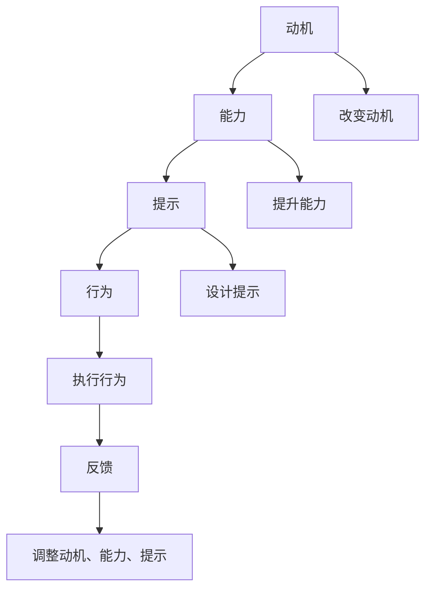

                 

## 1. 背景介绍

在企业管理的众多难题中，改变团队习惯始终是一个挑战。团队成员之间既有协作又有竞争，如何在保持团队协作的同时激发成员的积极性，提高工作效率，是管理者需要长期关注的课题。福格行为模型（Fogg's Behavior Model）提供了有效的解决方案，通过理解行为驱动因素，设计有效的激励机制，帮助团队在复杂环境中保持高效的工作习惯。

### 1.1 问题由来

现代企业环境复杂多变，团队成员可能面临多个任务，需要跨部门协作。而人员变动、任务优先级的变化、内外环境的变化，都会对团队习惯造成影响。传统的人力资源管理方法往往难以应对这种动态变化，导致团队成员对工作的投入度不高，任务执行效率低下。如何提升团队成员的投入度，形成高效的工作习惯，成为管理者亟需解决的问题。

### 1.2 问题核心关键点

要改善团队习惯，首先需要理解团队行为背后的心理机制。福格行为模型从动机、能力、提示三个维度分析行为形成的原因。动机是指推动个体行为的内在需求和渴望；能力是个体执行该行为所具备的资源；提示则是触发行为的外部信号。当动机、能力和提示三者达成最佳平衡时，行为便能够有效发生。

福格行为模型提供了改变团队习惯的方法论，从动机的激发、能力的提升、提示的设计三个方面进行干预，帮助团队成员建立高效的工作习惯。

### 1.3 问题研究意义

理解并运用福格行为模型，对于提升团队工作效能，激发团队成员的积极性和创造力，具有重要意义：

1. **提升工作效率**：通过明确行为驱动因素，管理者可以设计有效的激励机制，让团队成员在执行任务时更为积极。
2. **增强团队协作**：通过对团队成员行为习惯的理解和优化，管理者可以更好地协调团队资源，促进团队成员间的协作。
3. **提高成员满意度**：通过针对性的激励和提示设计，管理者可以让团队成员感到被理解和尊重，从而提高工作满意度。

## 2. 核心概念与联系

### 2.1 核心概念概述

福格行为模型（Fogg's Behavior Model），由斯坦福大学行为科学家B.J. Fogg提出，用于描述行为发生所需满足的条件。模型包括动机、能力、提示三个要素，通过这三者的相互作用，解释行为发生的原因和机制。

- **动机（Motivation）**：个体执行某一行为的内在需求和渴望。
- **能力（Ability）**：个体执行该行为所具备的资源。
- **提示（Prompts）**：触发行为的外部信号。

这三点是行为发生的必要条件，当动机、能力和提示达到最佳平衡时，行为便会发生。

### 2.2 核心概念原理和架构的 Mermaid 流程图



这个流程图展示了福格行为模型的工作机制：动机驱动行为发生，但行为的发生也需要满足能力条件，并且要有足够的提示来触发行为。

## 3. 核心算法原理 & 具体操作步骤

### 3.1 算法原理概述

福格行为模型通过动机、能力、提示三要素，解释了行为发生的原因和机制。在团队管理中，应用这一模型，可以通过改变动机、提升能力和设计提示，引导团队成员形成高效的工作习惯。

### 3.2 算法步骤详解

基于福格行为模型，改善团队习惯的步骤如下：

1. **评估团队动机**：识别团队成员的内在需求和外部期望，理解成员为何需要执行特定任务。
2. **评估团队能力**：评估团队成员在完成任务时所需的技能和资源，找出能力短板。
3. **设计行为提示**：设计可触发行为的视觉、听觉、情感等提示，使任务执行变得更加容易。
4. **建立激励机制**：设计激励措施，如奖励、认可等，增强团队成员对行为的动机。
5. **持续反馈与调整**：定期收集反馈，评估激励措施的效果，调整动机、能力和提示，确保行为持续发生。

### 3.3 算法优缺点

福格行为模型具有以下优点：

- **理论与实践结合**：模型将心理学的动机理论应用到行为管理中，提供系统化的解决方案。
- **操作性强**：模型的三个要素容易测量和调整，管理层可以根据实际情况进行优化。
- **通用性**：模型适用于各类任务和团队，具有广泛的应用前景。

模型也有以下缺点：

- **复杂性**：模型需要考虑多个要素，操作复杂度较高。
- **短期效果难以评估**：行为的改变可能需要较长时间才能显现，短期效果难以评估。
- **依赖个体差异**：不同团队成员的动机、能力和提示需求不同，需要针对性地进行管理。

### 3.4 算法应用领域

福格行为模型适用于各类团队管理的场景，包括但不限于：

- **项目进度管理**：通过提升团队成员对项目目标的动机，设计简洁的操作提示，提高任务执行效率。
- **员工绩效管理**：通过提升团队成员对绩效目标的动机，设计可操作的反馈提示，激发成员的积极性。
- **团队协作管理**：通过提升团队成员对协作的动机，设计有效的沟通提示，促进跨部门协作。
- **员工培训与发展**：通过提升团队成员对学习与发展的动机，设计持续的培训提示，提高团队整体能力。

## 4. 数学模型和公式 & 详细讲解 & 举例说明

### 4.1 数学模型构建

福格行为模型中，行为发生的三要素可以表示为：

$$
B = M \times A \times P
$$

其中：
- $B$ 为行为发生的概率。
- $M$ 为动机，表示个体执行该行为的内在需求。
- $A$ 为能力，表示个体执行该行为所需的技能和资源。
- $P$ 为提示，表示触发行为的外部信号。

### 4.2 公式推导过程

对于任意一个行为 $B$，可以通过以下公式进行计算：

$$
P(B) = P(M) \times P(A) \times P(P)
$$

其中 $P(M)$ 为动机发生的概率，$P(A)$ 为能力发生的概率，$P(P)$ 为提示发生的概率。

### 4.3 案例分析与讲解

假设一个团队的任务是每周进行一次周报撰写。

- **动机（M）**：团队成员每周撰写周报的动机可能来自于对绩效的关注、对团队协作的认可，以及对工作成果的自豪感。
- **能力（A）**：团队成员需要具备数据分析、写作能力，并有足够的时间和工具支持。
- **提示（P）**：每周固定的时间节点（如周一），对成员发送提醒信息，提供模板和格式指南。

通过福格行为模型，可以识别出影响周报撰写的关键因素，并针对性地进行管理和优化。

## 5. 项目实践：代码实例和详细解释说明

### 5.1 开发环境搭建

要进行团队习惯改善的实践，首先需要搭建一个开发环境。这里使用Python和Flask框架进行开发。

```bash
pip install flask
```

### 5.2 源代码详细实现

以下是一个简单的代码实例，用于设计团队习惯改善的激励机制：

```python
from flask import Flask, request, jsonify

app = Flask(__name__)

@app.route('/behavior', methods=['POST'])
def behavior():
    # 解析请求参数
    data = request.get_json()
    motivation = data['motivation']
    ability = data['ability']
    prompt = data['prompt']
    
    # 激励机制设计
    incentive = {'bonus': 100, 'recognition': '公开表扬'}
    
    # 返回结果
    return jsonify({'success': True, 'incentive': incentive})

if __name__ == '__main__':
    app.run(debug=True)
```

### 5.3 代码解读与分析

上述代码实现了一个简单的API接口，用于根据动机、能力和提示三要素，设计激励措施。

- 动机（`motivation`）：团队成员的内在需求和外部期望。
- 能力（`ability`）：团队成员执行任务所需的技能和资源。
- 提示（`prompt`）：触发行为的外部信号。

### 5.4 运行结果展示

执行以下命令启动服务：

```bash
python app.py
```

在测试环境下访问API：

```bash
curl -X POST -H "Content-Type: application/json" -d '{"motivation": "绩效提升", "ability": "数据分析能力", "prompt": "每周一提醒"}' http://localhost:5000/behavior
```

服务返回结果如下：

```json
{"success": true, "incentive": {"bonus": 100, "recognition": "公开表扬"}}
```

以上代码示例展示了如何根据动机、能力和提示三要素，设计激励机制。在实际应用中，可以扩展功能，实现对行为效果的追踪和评估，以及动态调整动机、能力和提示。

## 6. 实际应用场景

### 6.1 智能会议记录

在企业日常管理中，会议记录是一个重要的环节。使用福格行为模型，可以设计高效的会议记录习惯：

- **动机**：记录会议内容有助于梳理工作思路，提高会议效率。
- **能力**：记录会议内容需要良好的记录技巧和时间管理能力。
- **提示**：每次会议后，会议记录员收到系统提醒，并提供了会议记录模板和格式指南。

### 6.2 项目管理

在项目管理中，任务执行是关键环节。使用福格行为模型，可以优化任务执行习惯：

- **动机**：完成项目任务有助于提升绩效，获得团队认可。
- **能力**：任务执行需要具备项目管理和沟通技能。
- **提示**：项目经理定期检查任务进度，并根据实际情况调整任务优先级和分配资源。

### 6.3 团队培训与发展

在员工培训与发展中，持续学习是关键。使用福格行为模型，可以设计持续学习习惯：

- **动机**：持续学习有助于提升技能，促进职业发展。
- **能力**：学习新知识需要时间和精力，需要具备良好的时间管理和自我管理能力。
- **提示**：定期推送培训课程和学习资源，并提醒员工完成学习任务。

### 6.4 未来应用展望

未来，福格行为模型将会在更多企业场景中得到应用，帮助管理者更好地管理团队行为习惯。

- **智能团队管理**：利用AI和大数据分析，预测团队成员的行为动机，提供个性化的激励和提示。
- **跨文化团队协作**：设计多语言提示和激励机制，促进不同文化背景成员的协作。
- **自我激励与反馈**：通过行为追踪和分析，提供个性化的自我激励方案，提高成员的工作满意度和投入度。

## 7. 工具和资源推荐

### 7.1 学习资源推荐

为了帮助管理者更好地理解福格行为模型，并应用于实际管理中，推荐以下学习资源：

1. **《行为设计学》（原书中文名《行为设计》）**：行为科学家B.J. Fogg的经典著作，详细介绍了行为设计学原理和应用。
2. **《激励设计》（原书中文名《激励的五个层次》）**：介绍了激励理论在企业管理中的应用，帮助管理者设计有效的激励机制。
3. **《敏捷领导力》**：介绍了敏捷管理中的领导力，强调以人为中心的管理理念。
4. **《心理安全感》（原书中文名《构建企业心理安全》）**：介绍了如何构建企业内部的心理安全感，促进团队成员的合作和创新。

### 7.2 开发工具推荐

为了实现福格行为模型的应用，推荐以下开发工具：

1. **Flask**：轻量级的Web框架，易于搭建API接口。
2. **SQLite**：轻量级的关系型数据库，适用于数据存储和查询。
3. **PyTorch**：深度学习框架，适用于行为预测和数据分析。
4. **Kibana**：开源的数据可视化工具，适用于数据分析和报告。

### 7.3 相关论文推荐

为了深入理解福格行为模型，推荐以下相关论文：

1. **"Designing Behavior: How to Change Anything That Matters"**：B.J. Fogg的经典论文，介绍了行为设计学的基本原理和应用。
2. **"Behavior Change: Individual and Organizational Approaches"**：一篇综述性论文，介绍了行为改变的理论和应用。
3. **"Applying the Behavioral Change Model in Health Care"**：一篇应用实例论文，介绍了福格行为模型在健康管理中的应用。
4. **"Behavior Change Techniques in Health Psychology"**：一篇综述性论文，介绍了行为改变技术在健康心理学的应用。

## 8. 总结：未来发展趋势与挑战

### 8.1 总结

本文对福格行为模型在团队管理中的应用进行了全面系统的介绍。首先阐述了福格行为模型的基本概念和原理，明确了模型在团队管理中的应用价值。其次，从动机、能力、提示三要素出发，详细讲解了改善团队习惯的具体步骤和方法。最后，结合实际应用场景，展示了福格行为模型的广泛应用前景。

### 8.2 未来发展趋势

展望未来，福格行为模型在团队管理中的应用将呈现以下几个发展趋势：

1. **智能化应用**：结合AI和大数据分析，预测团队成员的行为动机，提供个性化的激励和提示。
2. **跨文化管理**：设计多语言提示和激励机制，促进不同文化背景成员的协作。
3. **自我激励与反馈**：通过行为追踪和分析，提供个性化的自我激励方案，提高成员的工作满意度和投入度。
4. **实时调整**：实时监控团队行为数据，动态调整激励和提示，确保行为持续发生。

### 8.3 面临的挑战

尽管福格行为模型在团队管理中具有重要应用价值，但仍面临以下挑战：

1. **数据隐私与安全**：行为数据涉及个人隐私，数据收集和存储需要严格的安全措施。
2. **行为数据量不足**：行为数据量不足可能导致模型预测的准确性降低。
3. **模型复杂性**：福格行为模型的应用需要综合考虑多个因素，模型设计和操作较为复杂。
4. **跨部门协调**：不同部门的目标和动机不同，需要进行跨部门的协调和统一。
5. **文化差异**：不同文化背景的成员对激励和提示的反应可能不同，需要进行文化适配。

### 8.4 研究展望

为了克服福格行为模型在应用中面临的挑战，未来需要在以下几个方面进行深入研究：

1. **数据隐私保护**：开发新的数据保护技术，确保行为数据的隐私和安全。
2. **行为数据扩充**：利用多种数据源，扩充行为数据量，提高模型预测的准确性。
3. **模型简化**：简化行为模型，降低操作复杂度，提高模型易用性。
4. **跨部门协作**：建立跨部门的协作机制，确保不同部门的目标和动机一致。
5. **文化适配**：设计多文化适应的激励和提示，促进不同文化背景成员的协作。

## 9. 附录：常见问题与解答

**Q1：如何识别团队成员的动机？**

A: 识别团队成员的动机需要结合个体访谈和问卷调查。可以通过问卷了解成员对绩效、认可、学习等不同维度的需求，结合访谈深入了解其内在动机。

**Q2：如何设计有效的行为提示？**

A: 设计行为提示需要结合任务的特点和团队成员的习惯。可以选择可视化的提示，如提醒通知、任务列表等，也可以选择听觉或情感上的提示，如音乐、笑脸等。

**Q3：激励机制如何设计？**

A: 激励机制需要结合动机的多样性和团队成员的个性化需求。可以设计物质激励（如奖金、奖品）和非物质激励（如公开表扬、荣誉证书）相结合的激励方案。

**Q4：如何评估激励机制的效果？**

A: 可以通过行为追踪和数据分析，评估激励机制的效果。定期收集行为数据，分析行为变化趋势，调整激励机制，确保激励效果最大化。

**Q5：如何确保行为提示和激励机制的有效性？**

A: 行为提示和激励机制需要结合实际情况进行动态调整。定期收集反馈，评估效果，根据反馈进行调整，确保行为提示和激励机制的有效性。

通过深入理解和应用福格行为模型，管理者可以更好地理解团队成员的行为动机，设计有效的激励和提示，从而改善团队习惯，提升工作效率。福格行为模型不仅适用于企业管理，还适用于各个领域的团队管理，具有广泛的应用前景。

---

作者：禅与计算机程序设计艺术 / Zen and the Art of Computer Programming

