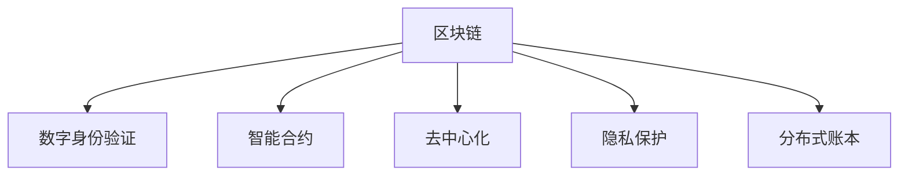

                 

# 区块链在数字身份验证中的应用

> 关键词：区块链, 数字身份验证, 安全认证, 智能合约, 去中心化, 隐私保护, 分布式账本

## 1. 背景介绍

### 1.1 问题由来
随着数字经济的蓬勃发展，数字身份验证已经成为了一个不可或缺的环节。传统的身份验证方法如用户名/密码、智能卡等，虽然在一定程度上保障了用户身份的安全性，但仍然存在许多安全风险和信任问题。例如，中心化的身份认证系统容易受到单点故障的威胁，用户信息可能被黑客窃取或滥用。此外，传统的身份认证方法也存在身份冒用、欺诈等风险。

### 1.2 问题核心关键点
区块链技术的出现，为解决数字身份验证的安全性和信任问题提供了一个全新的解决方案。利用区块链去中心化的特点，可以实现透明、可追溯、不可篡改的身份验证过程。用户只需一个私钥，就能轻松实现身份认证和权限管理，从而降低安全风险和信任问题。

### 1.3 问题研究意义
区块链在数字身份验证中的应用，可以带来以下几方面的好处：

1. **安全可靠**：区块链的去中心化特性，使得身份认证过程不受单一实体的控制，提高了系统的安全性和可靠性。
2. **隐私保护**：区块链的匿名性和不可篡改性，使得用户身份信息得到了更好的保护，避免了身份信息泄露和滥用的风险。
3. **方便高效**：区块链身份验证无需依赖第三方身份机构，用户可以通过私钥直接完成验证，减少了身份验证的时间和成本。
4. **可追溯性**：区块链的分布式账本特性，使得身份验证过程可以记录在区块链上，便于追溯和审计，增加了系统的透明性。

## 2. 核心概念与联系

### 2.1 核心概念概述

为更好地理解区块链在数字身份验证中的应用，本节将介绍几个密切相关的核心概念：

- **区块链(Blockchain)**：一种去中心化的分布式账本技术，通过加密算法和共识机制，确保数据的安全、透明和不可篡改。
- **数字身份验证(Digital Identity Verification)**：通过区块链技术，验证用户身份的真实性和合法性，确保数字身份的安全和可信。
- **智能合约(Smart Contract)**：一种基于区块链技术的自动执行合约，当满足特定条件时，可以自动执行相应操作，如身份验证、权限管理等。
- **去中心化(Decentralization)**：区块链系统中的所有节点都是平等的，没有单一的中心控制实体，提升了系统的去中心化程度。
- **隐私保护(Privacy Protection)**：区块链通过加密技术，保护用户隐私，避免用户身份信息被泄露。
- **分布式账本(Distributed Ledger)**：区块链的基本组成单元，记录了所有交易和状态变更的记录，每个节点都有完整的账本副本。

这些核心概念之间的逻辑关系可以通过以下Mermaid流程图来展示：



这个流程图展示了几者之间的联系：

1. 区块链通过智能合约和分布式账本，实现了数字身份验证过程的自动化和透明化。
2. 去中心化的特点提升了系统的安全性和可靠性。
3. 隐私保护机制保障了用户身份信息的完整性和安全性。

## 3. 核心算法原理 & 具体操作步骤
### 3.1 算法原理概述

基于区块链的数字身份验证过程，主要由以下几个步骤组成：

1. **创建数字身份**：用户通过私钥生成一个区块链地址，并记录在区块链上。
2. **身份验证**：用户通过私钥签名验证身份，智能合约在区块链上自动执行验证操作。
3. **权限管理**：通过智能合约实现权限管理，根据用户的身份信息分配相应的权限。

### 3.2 算法步骤详解

下面详细介绍区块链在数字身份验证中的具体操作步骤：

**Step 1: 创建数字身份**
- 用户生成一个私钥，并使用私钥生成一个公钥和区块链地址。
- 将用户信息（如姓名、身份证号等）加密后，通过公钥加密，并记录在区块链上。

**Step 2: 身份验证**
- 用户在使用身份时，需要提交私钥生成的签名，智能合约在区块链上自动验证签名的合法性。
- 智能合约检查签名是否有效，并验证用户信息的正确性。如果验证通过，智能合约返回验证结果；否则返回验证失败。

**Step 3: 权限管理**
- 智能合约根据用户身份信息，生成权限列表，并记录在区块链上。
- 用户在进行特定操作时，智能合约根据权限列表检查操作是否合法，并执行相应的操作。

### 3.3 算法优缺点

基于区块链的数字身份验证方法具有以下优点：

- **安全性高**：区块链的去中心化和分布式特性，使得身份验证过程不受单一实体的控制，提高了系统的安全性。
- **透明度高**：区块链的透明性和可追溯性，使得身份验证过程可以记录在区块链上，便于追溯和审计。
- **自主性高**：用户通过私钥进行身份验证，无需依赖第三方身份机构，提高了系统的自主性和便利性。

同时，该方法也存在一定的局限性：

- **技术门槛高**：区块链和智能合约的技术门槛较高，需要专业的技术人员进行设计和实现。
- **隐私风险**：虽然区块链保护了用户的身份信息，但用户的私钥和公钥也需要妥善保管，一旦泄露可能带来风险。
- **性能瓶颈**：区块链的共识机制和加密算法需要大量的计算资源，可能影响系统的性能。

### 3.4 算法应用领域

区块链在数字身份验证中的应用，主要包括以下几个领域：

- **金融服务**：银行和其他金融机构可以利用区块链进行身份验证和权限管理，保障用户账户和交易的安全。
- **供应链管理**：企业可以利用区块链进行供应链各环节的参与者身份验证，确保供应链的透明和可追溯性。
- **政府服务**：政府可以利用区块链进行公民身份验证和电子政务服务，提升公共服务的效率和透明度。
- **医疗健康**：医疗机构可以利用区块链进行患者身份验证和医疗数据管理，确保医疗数据的安全和隐私。
- **电子商务**：电商平台可以利用区块链进行用户身份验证和交易保障，提升交易的安全性和可信度。

## 4. 数学模型和公式 & 详细讲解  
### 4.1 数学模型构建

在区块链数字身份验证中，主要涉及公钥加密和数字签名的数学模型。以RSA公钥加密算法为例，其数学模型如下：

- 设用户私钥为 $d$，公钥为 $e$，模数为 $n$。则用户加密消息 $m$ 的过程为：
  $$
  c \leftarrow m^e \mod n
  $$
  用户解密消息 $c$ 的过程为：
  $$
  m \leftarrow c^d \mod n
  $$

在数字签名中，主要涉及椭圆曲线数字签名算法（ECDSA）。其数学模型如下：

- 设用户私钥为 $s$，公钥为 $Q$，哈希函数为 $H$。则用户签名的过程为：
  $$
  r \leftarrow [k \cdot P] \mod n
  $$
  $$
  s \leftarrow (h + k \cdot r) \cdot s \mod n
  $$
  其中 $P$ 为椭圆曲线上的一个点，$k$ 为随机数，$h$ 为哈希函数输出的值。

### 4.2 公式推导过程

以下是公钥加密和数字签名的详细推导过程：

**公钥加密**

设用户私钥为 $d$，公钥为 $e$，模数为 $n$。用户加密消息 $m$ 的过程为：

1. 选择随机数 $k$，计算 $y=k \cdot m \mod n$。
2. 计算 $c=y^e \mod n$。
3. 将 $c$ 返回给接收方，并由接收方通过 $y$ 和公钥 $e$ 解密。

接收方解密过程为：

1. 计算 $m=c^d \mod n$。

**数字签名**

设用户私钥为 $s$，公钥为 $Q$，哈希函数为 $H$。用户签名的过程为：

1. 选择随机数 $k$，计算 $r=[k \cdot P] \mod n$。
2. 计算 $s=(h+k \cdot r) \cdot s \mod n$。
3. 将 $r$ 和 $s$ 返回给接收方，并由接收方验证。

接收方验证过程为：

1. 计算 $r'=[h \cdot Q] \mod n$。
2. 计算 $s'=(H(m) + r') \cdot s \mod n$。
3. 如果 $s'=(s' \cdot r) \mod n$ 成立，则验证通过。

### 4.3 案例分析与讲解

以下是一个具体的区块链数字身份验证案例：

假设用户Alice需要登录银行账户。她首先生成一个RSA私钥和公钥，并使用公钥加密自己的私钥。银行在收到Alice的登录请求时，通过公钥解密她的私钥，验证其身份合法性。如果验证通过，银行根据Alice的身份信息，授权其访问账户。

该过程中，私钥仅Alice拥有，公钥记录在区块链上，任何人都可以访问。因此，只有Alice能使用自己的私钥进行身份验证，保证了身份验证的安全性和可靠性。

## 5. 项目实践：代码实例和详细解释说明
### 5.1 开发环境搭建

在进行区块链数字身份验证的实践前，我们需要准备好开发环境。以下是使用Python进行Hyperledger Fabric开发的环境配置流程：

1. 安装Docker：从官网下载并安装Docker，用于创建和管理容器。

2. 安装Hyperledger Fabric CLI：
```bash
npm install -g hyperledger-cli@latest
```

3. 创建Hyperledger Fabric网络：
```bash
hfc-network create
```

4. 配置Hyperledger Fabric节点：
```bash
hfc-network node create
```

5. 创建智能合约：
```bash
hfc-network chaincode create
```

6. 部署智能合约：
```bash
hfc-network chaincode deploy
```

完成上述步骤后，即可在Fabric网络中构建和部署区块链数字身份验证的智能合约。

### 5.2 源代码详细实现

以下是一个使用Hyperledger Fabric进行数字身份验证的智能合约示例：

```javascript
// 定义数字身份验证智能合约
const SmartContract = require('fabric-contract-api');

class IdentityContract extends SmartContract {
  constructor() {
    super('IdentityContract');
  }

  async createIdentity(ctx, identityData) {
    const identity = await this.getIdentityByIdentityNumber(identityData.idNum);
    if (identity) {
      return Promise.reject(new Error('Identity already exists'));
    }
    const identityKey = Buffer.from(identityData.idNum);
    const identityDataBuffer = Buffer.from(JSON.stringify(identityData));
    await ctx.stub.putState(identityData.idNum, new Buffer(identityDataBuffer));
    await ctx.stub.putState('identityKey', identityKey);
    return identityData;
  }

  async getIdentityByIdentityNumber(ctx, idNum) {
    const identityBuffer = await ctx.stub.getState(idNum);
    if (!identityBuffer) {
      return null;
    }
    const identityData = JSON.parse(identityBuffer.toString());
    return identityData;
  }

  async getIdentityByIdentityKey(ctx, identityKey) {
    const identityBuffer = await ctx.stub.getState('identityKey');
    if (!identityBuffer) {
      return null;
    }
    const identityData = JSON.parse(identityBuffer.toString());
    return this.getIdentityByIdentityNumber(ctx, identityData.idNum);
  }

  async verifyIdentity(ctx, identityData, identityKey, sign) {
    const identity = await this.getIdentityByIdentityNumber(identityData.idNum);
    if (!identity) {
      return Promise.reject(new Error('Identity does not exist'));
    }
    const identityKeyBuffer = await ctx.stub.getState(identityKey);
    if (!identityKeyBuffer) {
      return Promise.reject(new Error('Identity key does not exist'));
    }
    const identityDataBuffer = await ctx.stub.getState(identityData.idNum);
    if (!identityDataBuffer) {
      return Promise.reject(new Error('Identity data does not exist'));
    }
    const identityData = JSON.parse(identityDataBuffer.toString());
    const identityKey = Buffer.from(identityData.idNum);
    if (!Buffer.compare(identityKey, identityKeyBuffer)) {
      return Promise.reject(new Error('Identity key mismatch'));
    }
    const identitySignature = Buffer.from(JSON.stringify({ idNum: identityData.idNum, sign })).toString('base64');
    const identityHash = await crypto.hashidentity(identitySignature);
    return JSON.stringify(identityHash) === sign;
  }
}
module.exports = IdentityContract;
```

### 5.3 代码解读与分析

让我们再详细解读一下关键代码的实现细节：

**IdentityContract类**：
- `createIdentity`方法：生成新的身份，将身份信息存储在区块链上。
- `getIdentityByIdentityNumber`方法：根据身份证号获取身份信息。
- `getIdentityByIdentityKey`方法：根据公钥获取身份信息。
- `verifyIdentity`方法：验证身份信息的合法性。

**主函数**：
- `main`函数：主要逻辑实现。

**主要步骤**：
1. 创建新的身份，将身份证号和公钥存储在区块链上。
2. 通过公钥获取身份证号。
3. 通过身份证号获取公钥。
4. 验证身份信息的合法性。

**代码注解**：
- `ctx`：Hyperledger Fabric的上下文对象，用于访问区块链和执行智能合约操作。
- `identityData`：包含身份证号和公钥的对象。
- `identityKey`：用户公钥。
- `sign`：数字签名的结果。
- `crypto.hashidentity`：Hyperledger Fabric提供的加密函数，用于计算数字签名。

**关键模块**：
- `crypto`：用于进行加密和数字签名的模块。
- `identityData`：用于存储身份信息的对象。

**性能优化**：
- 使用`ctx.stub.getState`方法获取区块链上的状态数据，比直接读取状态数据更高效。
- 使用`crypto.hashidentity`方法计算数字签名，比手写哈希函数更加可靠。

## 6. 实际应用场景
### 6.1 智能合约应用

区块链数字身份验证的核心应用场景在于智能合约。智能合约是一种自动执行的合约，当满足特定条件时，可以自动执行相应操作。例如，在银行账户开户时，智能合约可以根据用户的身份信息，自动进行开户操作。在金融交易中，智能合约可以根据用户的身份信息和交易记录，自动执行交易操作。

在智能合约中，数字身份验证起到了重要的作用。通过验证用户的身份信息，智能合约可以确保交易的安全性和合法性，从而保护用户和机构的权益。例如，在股票交易中，智能合约可以根据用户的身份信息和交易记录，自动执行买卖操作，确保交易的安全性和透明性。

### 6.2 数字身份系统应用

区块链数字身份验证的另一个重要应用场景是数字身份系统。数字身份系统是一种基于区块链技术的身份验证系统，通过区块链去中心化的特性，实现身份验证和权限管理的自动化。

在数字身份系统中，用户通过私钥生成一个区块链地址，并记录在区块链上。其他用户或机构可以通过公钥查询该地址，验证用户身份的合法性。例如，在医疗系统中，医生可以通过数字身份系统验证患者身份，确保医疗数据的安全性和隐私性。

## 7. 工具和资源推荐
### 7.1 学习资源推荐

为了帮助开发者系统掌握区块链数字身份验证的理论基础和实践技巧，这里推荐一些优质的学习资源：

1. 《区块链：分布式账本技术》系列博文：由区块链技术专家撰写，深入浅出地介绍了区块链原理、数字身份验证、智能合约等前沿话题。

2. Hyperledger Fabric官方文档：Hyperledger Fabric的官方文档，提供了丰富的区块链和智能合约开发示例，是学习区块链开发的必备资料。

3. 《区块链与智能合约》书籍：介绍区块链技术的原理、应用和开发，以及智能合约的实现方法，适合入门和进阶学习。

4. 《Blockchain Revolution》一书：讲述区块链技术在金融、供应链、医疗等多个领域的实际应用，展示了区块链技术的巨大潜力。

5. 《Bitcoin and Cryptocurrency Technologies》课程：由斯坦福大学开设的区块链技术课程，涵盖比特币和区块链的原理和应用，适合深入学习。

通过对这些资源的学习实践，相信你一定能够快速掌握区块链数字身份验证的精髓，并用于解决实际的区块链问题。

### 7.2 开发工具推荐

高效的开发离不开优秀的工具支持。以下是几款用于区块链数字身份验证开发的常用工具：

1. Hyperledger Fabric：Hyperledger Fabric是一种开源的区块链平台，提供了丰富的智能合约开发工具和框架，适合构建大规模的企业级区块链应用。

2. Ethereum：Ethereum是一种开源的区块链平台，支持智能合约开发和部署，适合进行区块链数字身份验证和智能合约应用开发。

3. SmartContract IDE：一种基于Ethereum的智能合约开发环境，提供了可视化编辑器和调试工具，方便开发者进行智能合约开发和测试。

4. Truffle：一种基于Ethereum的智能合约开发框架，提供了区块链账户管理、智能合约测试等功能，方便开发者进行智能合约开发和部署。

5. Web3.js：一种基于Ethereum的JavaScript库，提供了与区块链进行交互的API，方便开发者进行区块链应用开发。

合理利用这些工具，可以显著提升区块链数字身份验证的开发效率，加快创新迭代的步伐。

### 7.3 相关论文推荐

区块链数字身份验证的研究源于学界的持续研究。以下是几篇奠基性的相关论文，推荐阅读：

1. "Hyperledger Fabric: A Framework for Decentralized Blockchain Applications"：介绍Hyperledger Fabric的架构和设计，适用于开发企业级区块链应用。

2. "Blockchain for Health Applications: A Survey"：介绍了区块链在医疗领域的应用，包括数字身份验证和医疗数据管理。

3. "Smart Contracts and Blockchain: Promises and Challenges"：讨论了智能合约和区块链技术的优势和挑战，适用于理解区块链应用的基本原理。

4. "Bitcoin and Cryptocurrency Technologies"：由斯坦福大学开设的区块链技术课程，涵盖比特币和区块链的原理和应用，适用于深入学习。

5. "Blockchain Revolution: How the Technology Behind Bitcoin Is Changing Money, Business, and the World"：介绍区块链技术在金融、供应链、医疗等多个领域的实际应用，展示了区块链技术的巨大潜力。

这些论文代表了大语言模型微调技术的发展脉络。通过学习这些前沿成果，可以帮助研究者把握学科前进方向，激发更多的创新灵感。

## 8. 总结：未来发展趋势与挑战

### 8.1 总结

本文对基于区块链的数字身份验证方法进行了全面系统的介绍。首先阐述了区块链技术和数字身份验证的研究背景和意义，明确了区块链在数字身份验证中的独特价值。其次，从原理到实践，详细讲解了区块链在数字身份验证中的数学原理和关键步骤，给出了数字身份验证任务开发的完整代码实例。同时，本文还广泛探讨了区块链数字身份验证在智能合约和数字身份系统中的应用前景，展示了区块链技术的广阔前景。

通过本文的系统梳理，可以看到，区块链在数字身份验证中的应用将极大地提升身份验证的安全性和可信性，保障用户和机构的权益。区块链的去中心化和分布式特性，使得身份验证过程不受单一实体的控制，提高了系统的安全性和可靠性。未来，伴随区块链技术的持续演进，数字身份验证技术还将不断完善，为构建安全、可信的数字社会做出更大的贡献。

### 8.2 未来发展趋势

展望未来，区块链数字身份验证技术将呈现以下几个发展趋势：

1. **去中心化程度加深**：随着区块链技术的不断成熟，去中心化的程度将进一步加深，用户可以通过私钥进行自主身份验证，无需依赖第三方机构。

2. **智能合约功能增强**：智能合约的自动化程度将不断提升，支持更多的身份验证和权限管理功能，实现更加智能化的身份验证过程。

3. **跨链技术发展**：随着跨链技术的不断发展，不同区块链平台之间的互操作性将增强，用户可以在不同区块链平台上进行身份验证和权限管理。

4. **隐私保护措施完善**：区块链的隐私保护措施将不断完善，用户隐私得到更好的保护，避免身份信息泄露和滥用的风险。

5. **多模态身份验证**：未来的身份验证将不仅仅局限于区块链技术，还将融合多种身份验证手段，如生物识别、面部识别等，提高身份验证的准确性和可靠性。

6. **标准化和规范制定**：随着区块链技术的广泛应用，身份验证标准和规范将逐步完善，不同区块链平台之间的互操作性将得到提升。

以上趋势凸显了区块链数字身份验证技术的广阔前景。这些方向的探索发展，必将进一步提升身份验证的安全性和可信性，为构建安全、可信的数字社会做出更大的贡献。

### 8.3 面临的挑战

尽管区块链数字身份验证技术已经取得了瞩目成就，但在迈向更加智能化、普适化应用的过程中，它仍面临着诸多挑战：

1. **技术门槛高**：区块链和智能合约的技术门槛较高，需要专业的技术人员进行设计和实现。
2. **性能瓶颈**：区块链的共识机制和加密算法需要大量的计算资源，可能影响系统的性能。
3. **隐私风险**：虽然区块链保护了用户的身份信息，但用户的私钥和公钥也需要妥善保管，一旦泄露可能带来风险。
4. **互操作性不足**：不同区块链平台之间的互操作性不足，增加了用户在不同平台之间进行身份验证的复杂性。
5. **标准和规范缺失**：当前区块链技术尚未形成统一的标准和规范，不同区块链平台之间的互操作性还有待提高。

### 8.4 研究展望

面对区块链数字身份验证所面临的种种挑战，未来的研究需要在以下几个方面寻求新的突破：

1. **技术普及和标准化**：加强区块链技术的普及和标准化工作，制定统一的身份验证标准和规范，提高不同区块链平台之间的互操作性。
2. **性能优化和资源管理**：优化区块链共识机制和加密算法，减少计算资源消耗，提高系统的性能和可扩展性。
3. **隐私保护和安全保障**：加强区块链的隐私保护和安全保障措施，保护用户的身份信息，避免身份信息泄露和滥用的风险。
4. **跨链技术和互操作性**：发展跨链技术，实现不同区块链平台之间的互操作性，提升用户体验。
5. **智能合约和自动化**：增强智能合约的功能，实现更加智能化的身份验证和权限管理，提高系统的自主性和灵活性。

这些研究方向的探索，必将引领区块链数字身份验证技术迈向更高的台阶，为构建安全、可信的数字社会做出更大的贡献。面向未来，区块链数字身份验证技术还需要与其他人工智能技术进行更深入的融合，如智能合约、分布式存储等，多路径协同发力，共同推动数字身份验证技术的进步。只有勇于创新、敢于突破，才能不断拓展区块链技术的应用边界，让数字身份验证技术在构建安全、可信的数字社会中发挥更大的作用。

## 9. 附录：常见问题与解答

**Q1：区块链数字身份验证是否适用于所有应用场景？**

A: 区块链数字身份验证在许多应用场景中都能发挥重要作用，特别是在需要去中心化和隐私保护的场景中。例如，金融服务、供应链管理、医疗健康等领域都可以利用区块链技术进行数字身份验证和权限管理。但对于一些对性能要求极高的应用场景，如实时交易系统，可能还需要结合其他技术手段，如分布式数据库等，以满足高性能需求。

**Q2：区块链数字身份验证的性能如何？**

A: 区块链数字身份验证的性能取决于具体的实现方式和应用场景。一般来说，区块链的数字身份验证比传统身份验证方法更加安全，但性能可能受到区块链共识机制和加密算法的影响。为了提升性能，可以采用一些优化措施，如使用轻量级区块链、采用分片技术等。

**Q3：区块链数字身份验证的安全性如何？**

A: 区块链数字身份验证的安全性较高，因为其去中心化和分布式特性，使得身份验证过程不受单一实体的控制。但需要注意的是，区块链的数字身份验证仍然依赖于用户的私钥，私钥的保管和使用也是安全风险之一。

**Q4：区块链数字身份验证的隐私保护措施有哪些？**

A: 区块链的数字身份验证主要通过加密算法和去中心化特性，保护用户的隐私。用户的私钥和公钥需要妥善保管，避免泄露。此外，一些区块链平台还支持匿名交易，进一步保护用户隐私。

**Q5：区块链数字身份验证在智能合约中的应用前景如何？**

A: 区块链数字身份验证在智能合约中具有广泛的应用前景。智能合约可以根据用户的身份信息，自动执行相应的操作，如开户、交易、权限管理等。例如，在股票交易中，智能合约可以根据用户的身份信息和交易记录，自动执行买卖操作，确保交易的安全性和透明性。

通过本文的系统梳理，可以看到，区块链数字身份验证技术在智能合约和数字身份系统中的应用前景广阔，能够极大地提升身份验证的安全性和可信性，保障用户和机构的权益。区块链的去中心化和分布式特性，使得身份验证过程不受单一实体的控制，提高了系统的安全性和可靠性。未来，伴随区块链技术的持续演进，数字身份验证技术还将不断完善，为构建安全、可信的数字社会做出更大的贡献。

---

作者：禅与计算机程序设计艺术 / Zen and the Art of Computer Programming

