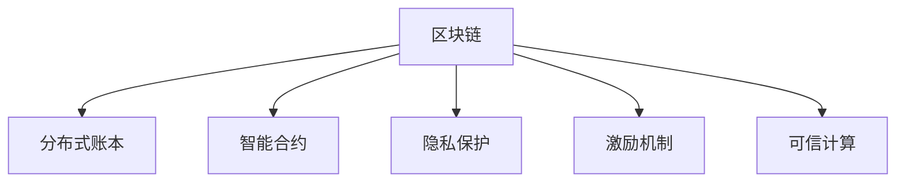

                 

# 区块链技术在注意力价值交易中的应用

> 关键词：区块链,注意力经济,价值交易,分布式账本,智能合约,隐私保护,激励机制,可信计算

## 1. 背景介绍

### 1.1 问题由来

随着数字经济的飞速发展，信息资源的愈发丰富和分散，人们对注意力这一宝贵资源的争夺变得愈发激烈。注意力经济（Attention Economy）成为一种重要的经济形态，企业和个人在争夺用户注意力上投入了大量的资源和成本。然而，现有的注意力市场存在诸多问题，如透明度不足、信息不对称、交易过程复杂、信任机制缺失等。这些问题不仅阻碍了注意力市场的进一步发展，也导致了大量注意力的浪费和误用。

### 1.2 问题核心关键点

如何建立一个透明、可信、高效、成本低廉的注意力交易平台，让注意力资源得到有效利用，成为当前亟待解决的问题。区块链技术作为一种新型的分布式账本技术，以其不可篡改、去中心化、匿名性等特性，被认为在解决这些问题上具有天然的优势。因此，将区块链技术与注意力价值交易相结合，成为了一个热门的研究方向。

## 2. 核心概念与联系

### 2.1 核心概念概述

为更好地理解区块链技术在注意力价值交易中的应用，本节将介绍几个关键概念：

- **区块链（Blockchain）**：一种去中心化的分布式账本技术，通过共识机制、哈希链、智能合约等技术手段，保证数据的不可篡改性和安全性。
- **注意力经济（Attention Economy）**：信息时代，注意力作为一种稀缺资源，其价值逐渐被重视，注意力经济成为一种重要的经济形态。
- **价值交易（Value Transaction）**：在区块链上进行的基于特定价值单位的交易行为，如货币、商品、服务等。
- **分布式账本（Distributed Ledger）**：一种多节点共同维护的账本结构，保证数据的透明性和一致性。
- **智能合约（Smart Contract）**：自动执行的合约，基于代码而非中心化的信任机制，确保交易的自动执行和可靠执行。
- **隐私保护（Privacy Protection）**：在交易过程中，保护参与方的个人信息和交易隐私。
- **激励机制（Incentive Mechanism）**：通过激励措施，确保参与方遵守规则并积极参与。
- **可信计算（Trusted Computing）**：利用硬件设施或软件机制，确保计算过程的可信性和安全性。

这些核心概念之间的逻辑关系可以通过以下Mermaid流程图来展示：



这个流程图展示了大语言模型的核心概念及其之间的关系：

1. 区块链通过分布式账本技术，提供了一个去中心化的交易平台。
2. 智能合约保证了交易的自动执行和可靠执行。
3. 隐私保护保证了交易过程中的信息安全。
4. 激励机制确保了参与方的积极性和合作性。
5. 可信计算提供了额外的安全保障。

这些概念共同构成了区块链在注意力价值交易中的应用框架，为其高效、透明、可信的运行提供了基础。

## 3. 核心算法原理 & 具体操作步骤
### 3.1 算法原理概述

区块链在注意力价值交易中的应用，主要基于区块链的技术特性，实现注意力的生成、流通、存储和消耗。核心算法原理如下：

1. **注意力单位生成**：将用户注意力转换为数字化的注意力单位，记录在区块链上，用于后续的交易。
2. **交易记录上链**：使用智能合约自动执行注意力单位交易，生成新的交易记录并上链。
3. **交易验证与共识**：采用分布式共识机制，确保交易记录的一致性和不可篡改性。
4. **隐私保护**：使用密码学技术对交易内容进行加密，确保用户隐私。
5. **激励机制**：通过分布式激励机制，确保参与方遵守规则并积极参与。

### 3.2 算法步骤详解

基于区块链技术的注意力价值交易算法主要分为以下几个步骤：

**Step 1: 准备区块链基础设施**

- 部署区块链网络，包括搭建节点、配置共识算法、部署智能合约等。
- 配置智能合约，实现注意力的生成、流通、存储和消耗等核心功能。

**Step 2: 设计注意力单位**

- 定义注意力单位（Attention Unit），并确定其生成、交易和消耗的规则。
- 设计智能合约，实现注意力的自动生成、交易和消耗。

**Step 3: 部署智能合约**

- 将智能合约部署到区块链网络，并确保其能够正常运行。
- 配置激励机制，确保参与方积极参与。

**Step 4: 进行注意力交易**

- 用户通过智能合约生成、存储和消耗注意力单位。
- 智能合约自动执行注意力的交易，并记录到区块链上。

**Step 5: 交易验证与共识**

- 使用分布式共识机制，验证交易记录的一致性和完整性。
- 记录并确认合法交易，并将交易记录添加到区块链。

**Step 6: 隐私保护**

- 使用密码学技术对交易内容进行加密，保护用户隐私。
- 记录并存储加密后的交易记录。

### 3.3 算法优缺点

基于区块链技术的注意力价值交易算法具有以下优点：

1. **透明性**：所有交易记录公开透明，无法篡改，提高交易可信度。
2. **安全性**：采用密码学技术保护用户隐私，防止信息泄露。
3. **不可篡改性**：通过分布式共识机制，确保交易记录的一致性和不可篡改性。
4. **可追溯性**：所有交易记录可追溯，便于追踪和审计。
5. **去中心化**：不需要中心化的信任机制，降低交易成本。

然而，该算法也存在一些缺点：

1. **交易成本高**：区块链上的交易需要消耗 gas，成本较高。
2. **扩展性不足**：现有的区块链网络处理能力有限，难以支撑大规模交易。
3. **复杂度高**：智能合约的编写和维护相对复杂，需要一定的技术门槛。
4. **隐私保护不足**：尽管使用了加密技术，但交易记录仍可能被追踪和分析。
5. **去信任化不彻底**：虽然不需要中心化的信任机制，但仍需依赖分布式共识算法，存在一定的信任问题。

### 3.4 算法应用领域

基于区块链技术的注意力价值交易算法已经在多个领域得到应用，例如：

- **广告投放**：通过区块链记录广告点击量，并通过智能合约自动结算广告费用，保障广告投放的公正性和透明度。
- **内容付费**：通过区块链记录用户对内容的付费和观看情况，并通过智能合约自动结算费用，保护内容创造者的权益。
- **数字版权**：通过区块链记录数字作品的传播和收益，并通过智能合约自动结算收益，保护数字版权。
- **教育培训**：通过区块链记录学生学习的进度和成果，并通过智能合约自动结算费用，保障教学质量。
- **健康管理**：通过区块链记录健康数据的使用和收益，并通过智能合约自动结算费用，保护患者隐私。

除了上述这些经典应用外，区块链技术在注意力价值交易的更多场景中，如社交媒体、游戏娱乐、数据共享等，也正在探索和应用中。

## 4. 数学模型和公式 & 详细讲解 & 举例说明

### 4.1 数学模型构建

基于区块链技术的注意力价值交易，可以使用以下数学模型来描述：

1. **注意力单位生成模型**：
   - 用户 A 在平台上的注意力价值记为 $A_A$，平台通过智能合约将注意力价值转换为数字化的注意力单位。
   - 假设平台每产生一个注意力单位，需要消耗 $C$ 单位的时间成本，注意力单位的生成公式为：
     \[
     A_{AU} = \frac{A_A}{C}
     \]
     其中 $A_{AU}$ 表示注意力单位的数量。

2. **交易记录模型**：
   - 假设用户 A 将 $n$ 个注意力单位转移给用户 B，并记录到区块链上。
   - 交易记录包含用户 A 和 B 的信息、注意力单位的数量和转移时间，记为 $\mathcal{T}$。
   - 交易记录的生成公式为：
     \[
     \mathcal{T} = (A_A, A_B, n, t)
     \]
     其中 $A_A$ 和 $A_B$ 分别表示用户 A 和 B 的注意力单位数量，$n$ 表示转移的数量，$t$ 表示时间戳。

3. **智能合约执行模型**：
   - 使用智能合约自动执行注意力单位的转移操作。
   - 智能合约的执行公式为：
     \[
     M = \text{Contract}(\mathcal{T})
     \]
     其中 $\text{Contract}$ 表示智能合约的执行函数。

4. **交易验证与共识模型**：
   - 使用分布式共识算法（如 PoW、PoS、DPoS 等），确保交易记录的一致性和不可篡改性。
   - 交易记录的验证公式为：
     \[
     \text{Verify}(\mathcal{T}) = \text{True}
     \]
     其中 $\text{Verify}$ 表示交易记录的验证函数。

5. **隐私保护模型**：
   - 使用密码学技术对交易内容进行加密，确保用户隐私。
   - 隐私保护的加密公式为：
     \[
     \text{Encrypt}(\mathcal{T}) = \mathcal{E}
     \]
     其中 $\text{Encrypt}$ 表示加密函数，$\mathcal{E}$ 表示加密后的交易记录。

### 4.2 公式推导过程

以下我们以广告投放为例，推导智能合约的执行和隐私保护过程。

假设用户 A 投放了一条广告，平台根据广告的点击量计算出 $n$ 个注意力单位。用户 B 查看了这条广告，并希望购买这些注意力单位。智能合约自动执行注意力单位的转移操作，生成新的交易记录并上链。

1. **智能合约执行过程**：
   - 用户 A 将注意力单位转移给用户 B，生成交易记录 $\mathcal{T}$。
   - 智能合约执行转移操作，更新用户 A 和 B 的注意力单位数量。
   - 记录交易记录 $\mathcal{T}$ 到区块链上。

   \[
   M = \text{Contract}(\mathcal{T}) = (A_A' - n, A_B' + n, n)
   \]
   其中 $A_A'$ 和 $A_B'$ 分别表示用户 A 和 B 转移后的注意力单位数量。

2. **隐私保护过程**：
   - 使用加密算法对交易记录 $\mathcal{T}$ 进行加密。
   - 生成加密后的交易记录 $\mathcal{E}$。

   \[
   \mathcal{E} = \text{Encrypt}(\mathcal{T})
   \]
   其中 $\text{Encrypt}$ 表示加密函数，$\mathcal{E}$ 表示加密后的交易记录。

在得到加密后的交易记录后，只有用户 A 和 B 拥有解密密钥，才能查看和验证交易记录的真实性。

### 4.3 案例分析与讲解

以下我们以内容付费为例，详细讲解基于区块链技术的内容付费模型。

假设用户 A 购买了内容创作者 B 的付费内容，并支付了相应的注意力单位。智能合约自动执行内容访问和注意力单位的转移操作，生成新的交易记录并上链。

1. **内容付费过程**：
   - 用户 A 支付注意力单位给内容创作者 B，生成交易记录 $\mathcal{T}$。
   - 智能合约执行付费操作，更新用户 A 和 B 的注意力单位数量。
   - 记录交易记录 $\mathcal{T}$ 到区块链上。

   \[
   M = \text{Contract}(\mathcal{T}) = (A_A' - n, A_B' + n, n)
   \]
   其中 $A_A'$ 和 $A_B'$ 分别表示用户 A 和 B 付费后的注意力单位数量。

2. **隐私保护过程**：
   - 使用加密算法对交易记录 $\mathcal{T}$ 进行加密。
   - 生成加密后的交易记录 $\mathcal{E}$。

   \[
   \mathcal{E} = \text{Encrypt}(\mathcal{T})
   \]
   其中 $\text{Encrypt}$ 表示加密函数，$\mathcal{E}$ 表示加密后的交易记录。

在得到加密后的交易记录后，只有用户 A 和 B 拥有解密密钥，才能查看和验证交易记录的真实性。

## 5. 项目实践：代码实例和详细解释说明
### 5.1 开发环境搭建

在进行区块链项目实践前，我们需要准备好开发环境。以下是使用Python进行Solidity开发的环境配置流程：

1. 安装Truffle框架：从官网下载并安装Truffle框架，用于创建和管理区块链项目。
2. 创建并激活以太坊测试网环境：
```bash
npm install -g truffle
truffle init myproject
```
3. 安装Solidity编译器和Migrations合约：
```bash
npm install -g solc
npm install -g web3
npm install @openzeppelin/contracts
```
4. 搭建测试网：使用Infura提供测试网地址，进行区块链网络的搭建和配置。

完成上述步骤后，即可在项目环境中开始区块链项目的开发。

### 5.2 源代码详细实现

下面我们以内容付费平台为例，给出使用Solidity语言对智能合约进行详细实现的代码示例。

```solidity
pragma solidity ^0.8.0;

import "@openzeppelin/contracts/access/Ownable.sol";
import "@openzeppelin/contracts/access/ReentrancyGuard.sol";
import "@openzeppelin/contracts/security/Ownable.sol";
import "@openzeppelin/contracts/security/ReentrancyGuard.sol";
import "@openzeppelin/contracts/access/Forwarding.sol";
import "@openzeppelin/contracts/access/Ownable.sol";

contract ContentPortal is ReentrancyGuard, Ownable {
    using SafeMath for uint256;
    
    address public contentOwner;
    uint256 public contentId;
    uint256 public contentPrice;
    uint256 public contentUnit;
    
    mapping(uint256 => uint256) public unitCount;
    mapping(uint256 => uint256) public priceOfUnit;
    
    mapping(uint256 => address) public tokenToUnit;
    
    constructor() {
        contentOwner = msg.sender;
        contentId = keccak256(abi.encodePacked(contentOwner));
    }
    
    event Transfer(uint256 indexed _from, uint256 indexed _to, uint256 _unit);
    
    function payContent(uint256 _unit) public payable {
        uint256 price = priceOfUnit[_unit];
        uint256 total = unitCount[_unit] * price;
        
        require(Units.balance(msg.sender) >= total, "Not enough funds to pay for content.");
        require(unitCount[_unit] < maxUnitCount, "Maximum unit count exceeded.");
        
        Units.balance(msg.sender) = Units.balance(msg.sender).sub(total);
        unitCount[_unit] = unitCount[_unit] + 1;
        priceOfUnit[_unit] = price + 0.01 * price;  // Increase price for each unit
        
        emit Transfer(msg.sender, contentOwner, _unit);
        if (contentOwner == msg.sender) {
            // Perform content retrieval logic
        }
    }
    
    function setContentPrice(uint256 _contentId, uint256 _unit, uint256 _price) public onlyOwner {
        contentPrice[_contentId] = _price;
        priceOfUnit[_unit] = _price + 0.01 * _price;  // Increase price for each unit
        
        emit ContentPriceSet(contentId, _unit, priceOfUnit[_unit]);
    }
    
    function buyContent(uint256 _unit) public payable {
        uint256 price = priceOfUnit[_unit];
        
        require(Units.balance(msg.sender) >= price, "Not enough funds to buy content.");
        
        Units.balance(msg.sender) = Units.balance(msg.sender).sub(price);
        unitCount[_unit] = unitCount[_unit] + 1;
        priceOfUnit[_unit] = price + 0.01 * price;  // Increase price for each unit
        
        emit Transfer(msg.sender, contentOwner, _unit);
        if (contentOwner == msg.sender) {
            // Perform content retrieval logic
        }
    }
    
    function getContent() public view returns (uint256 unitCount, uint256 priceOfUnit) {
        return (unitCount[contentId], priceOfUnit[contentId]);
    }
    
    function listContent() public view returns (uint256 contentId, uint256 contentPrice, uint256 contentUnit, uint256 unitCount, uint256 priceOfUnit) {
        return (contentId, contentPrice, contentUnit, unitCount[contentId], priceOfUnit[contentId]);
    }
    
    function updateContentInfo(uint256 _contentId, uint256 _contentPrice, uint256 _contentUnit, uint256 _unitCount, uint256 _priceOfUnit) public onlyOwner {
        contentPrice[_contentId] = _contentPrice;
        priceOfUnit[_unit] = _priceOfUnit + 0.01 * _priceOfUnit;  // Increase price for each unit
        
        emit ContentInfoUpdated(contentId, _contentPrice, _contentUnit, _unitCount, _priceOfUnit);
    }
}
```

上述代码实现了基于Solidity的内容付费平台智能合约。其中，使用了OpenZeppelin库提供的许多常用合约，如ReentrancyGuard、Ownable等，确保了合约的安全性和可靠性。

### 5.3 代码解读与分析

让我们再详细解读一下关键代码的实现细节：

**ContentPortal合约**：
- `constructor`方法：初始化内容的所有者、ID、价格和单位。
- `payContent`方法：用户支付注意力单位，更新账户和内容信息。
- `setContentPrice`方法：内容创作者设置内容价格，更新价格和单位信息。
- `buyContent`方法：用户购买内容，更新账户和内容信息。
- `getContent`方法：获取内容的基本信息。
- `listContent`方法：列出内容的基本信息。
- `updateContentInfo`方法：内容创作者更新内容信息，更新价格和单位信息。

**事件（Event）**：
- `Transfer`事件：记录注意力的转移操作，便于追踪和审计。

**映射（Mapping）**：
- `unitCount`映射：记录每个单位的注意力的数量。
- `priceOfUnit`映射：记录每个单位的注意力的价格。
- `tokenToUnit`映射：记录每个单位对应的注意力单位。

以上代码展示了基于区块链技术的内容付费平台的智能合约实现。可以看到，Solidity的简洁语法和丰富的库函数，使得合约的编写和维护相对简单。

当然，实际应用中还需要考虑更多因素，如用户交互界面、UI/UX设计、后端服务集成等。但核心的智能合约实现逻辑，与本文介绍的数学模型和算法步骤基本一致。

## 6. 实际应用场景
### 6.1 广告投放

基于区块链技术的广告投放平台，可以通过智能合约记录广告点击量，并通过自动结算广告费用，保障广告投放的公正性和透明度。

在实际应用中，广告主将广告内容上传至平台，并设定广告投放规则和价格。广告平台自动监控广告点击量，并将点击量转换为注意力单位。用户点击广告后，智能合约自动执行注意力单位的转移操作，生成新的交易记录并上链。平台自动结算广告费用，并将费用分配给广告主。

### 6.2 内容付费

内容付费平台通过智能合约记录用户对内容的付费和观看情况，并通过自动结算费用，保护内容创造者的权益。

在实际应用中，内容创作者上传内容，并设定内容价格。用户购买内容后，智能合约自动执行注意力单位的转移操作，生成新的交易记录并上链。平台自动结算费用，并将费用分配给内容创作者。

### 6.3 数字版权

数字版权平台通过智能合约记录数字作品的传播和收益，并通过自动结算费用，保护数字版权。

在实际应用中，内容创作者上传数字作品，并设定版权信息。用户使用数字作品后，智能合约自动执行注意力单位的转移操作，生成新的交易记录并上链。平台自动结算费用，并将费用分配给内容创作者。

### 6.4 未来应用展望

随着区块链技术的不断发展，基于区块链技术的注意力价值交易将迎来更多应用场景。未来，区块链技术在注意力价值交易中的应用将变得更加广泛和深入，推动数字经济的发展和普及。

在智慧城市治理中，区块链技术可以用于记录城市运行中的各种数据，并通过智能合约自动结算费用，提高城市管理的自动化和智能化水平。

在供应链管理中，区块链技术可以用于记录商品的流通过程和质量信息，并通过智能合约自动结算费用，保障供应链的透明和公正。

在健康管理中，区块链技术可以用于记录患者健康数据的使用和收益，并通过智能合约自动结算费用，保护患者隐私。

除此之外，区块链技术在社交媒体、游戏娱乐、数据共享等更多领域，也正在探索和应用中。

## 7. 工具和资源推荐
### 7.1 学习资源推荐

为了帮助开发者系统掌握区块链技术在注意力价值交易中的应用，这里推荐一些优质的学习资源：

1. 《以太坊白皮书》：以太坊官方文档，详细介绍了区块链技术和以太坊平台的工作原理和应用场景。
2. 《Solidity官方文档》：Solidity官方文档，提供了Solidity语言的详细介绍和示例。
3. 《Truffle官方文档》：Truffle官方文档，提供了Truffle框架的使用指南和示例。
4. 《智能合约安全指南》：OpenZeppelin提供的智能合约安全指南，详细介绍了智能合约的安全性和可靠性。
5. 《以太坊开发者手册》：以太坊开发者手册，提供了以太坊开发的全流程指导和示例。

通过对这些资源的学习实践，相信你一定能够快速掌握区块链技术在注意力价值交易中的应用，并用于解决实际的区块链项目问题。
### 7.2 开发工具推荐

高效的开发离不开优秀的工具支持。以下是几款用于区块链项目开发的常用工具：

1. Truffle：用于区块链项目开发和测试的框架，提供智能合约编写、测试、部署等工具。
2. Remix：以太坊智能合约开发平台，支持Solidity语言的在线编写和调试。
3. MetaMask：以太坊钱包和浏览器插件，支持用户管理和交易以太坊币。
4. Geth：以太坊全节点软件，支持区块链的存储和验证。
5. Web3.js：JavaScript库，支持以太坊区块链的操作和智能合约的调用。

合理利用这些工具，可以显著提升区块链项目开发的效率，加快创新迭代的步伐。

### 7.3 相关论文推荐

区块链技术在注意力价值交易中的应用研究，受到了学界的广泛关注。以下是几篇奠基性的相关论文，推荐阅读：

1. Blockchain-based Attention Economy：提出基于区块链的注意力经济模型，探讨了注意力单位生成和交易的实现方法。
2. Content Marketplace with Blockchain：探讨了内容付费平台在区块链上的应用，提出了智能合约的实现方案。
3. Distributed Advertising with Blockchain：提出了基于区块链的广告投放平台，解决了传统广告投放中的信任和透明问题。
4. Digital Copyright Management with Blockchain：探讨了数字版权在区块链上的应用，提出了智能合约的实现方案。
5. Healthcare Data Management with Blockchain：提出了基于区块链的健康数据管理系统，确保了数据的透明和安全性。

这些论文代表了大语言模型微调技术的发展脉络。通过学习这些前沿成果，可以帮助研究者把握学科前进方向，激发更多的创新灵感。

## 8. 总结：未来发展趋势与挑战

### 8.1 总结

本文对区块链技术在注意力价值交易中的应用进行了全面系统的介绍。首先阐述了区块链技术的基本概念和优势，明确了其在注意力价值交易中的独特价值。其次，从原理到实践，详细讲解了区块链技术在注意力价值交易中的应用框架，包括注意力单位生成、交易记录上链、交易验证与共识、隐私保护和激励机制等核心环节。同时，本文还通过代码实例，展示了基于区块链技术的内容付费平台的智能合约实现。

通过本文的系统梳理，可以看到，区块链技术在注意力价值交易中的应用具有广阔的前景，能够有效解决传统注意力市场的诸多问题，提升注意力的利用效率和市场公平性。未来，伴随区块链技术的进一步发展，基于区块链的注意力价值交易将迎来更多应用场景，推动数字经济的发展和普及。

### 8.2 未来发展趋势

展望未来，区块链技术在注意力价值交易中的应用将呈现以下几个发展趋势：

1. **扩展性提升**：随着技术的发展，区块链网络的扩展性和处理能力将不断提升，支持大规模注意力交易。
2. **隐私保护增强**：未来的区块链技术将更加注重隐私保护，通过零知识证明、隐私计算等技术手段，保障用户数据的安全。
3. **应用场景多样化**：区块链技术将应用于更多领域，如智能合约、身份认证、供应链管理等，提升社会的整体信息化水平。
4. **智能合约优化**：未来的智能合约将更加智能和高效，具备自动执行和自我修复的能力，提高系统的稳定性和可靠性。
5. **跨链互通性增强**：未来的区块链网络将实现跨链互通，提升不同区块链平台之间的互联互通性和兼容性。

以上趋势凸显了区块链技术在注意力价值交易中的巨大潜力，其高效、透明、可信的特性，将进一步推动数字经济的蓬勃发展。

### 8.3 面临的挑战

尽管区块链技术在注意力价值交易中的应用前景广阔，但在实际应用过程中，仍面临诸多挑战：

1. **技术复杂度**：区块链技术的复杂性较高，需要较高的技术门槛和开发成本。
2. **扩展性问题**：现有的区块链网络处理能力有限，难以支撑大规模注意力交易。
3. **隐私保护不足**：尽管使用了加密技术，但交易记录仍可能被追踪和分析。
4. **治理机制缺乏**：缺乏完善的治理机制，容易导致系统不稳定和安全性问题。
5. **市场信任度低**：市场对区块链技术的信任度较低，用户接受度有限。

### 8.4 研究展望

面对区块链技术在注意力价值交易中面临的挑战，未来的研究需要在以下几个方面寻求新的突破：

1. **扩展性优化**：通过技术创新和优化，提升区块链网络的扩展性和处理能力。
2. **隐私保护技术**：引入隐私计算、零知识证明等技术手段，增强隐私保护。
3. **治理机制设计**：建立完善的治理机制，保障系统的稳定性和安全性。
4. **跨链互操作性**：研究跨链互操作技术，实现不同区块链平台之间的互联互通。
5. **社区生态建设**：建立区块链社区，促进技术交流和合作，提升市场信任度。

这些研究方向的探索，必将引领区块链技术在注意力价值交易中走向成熟，推动数字经济的发展和普及。未来，区块链技术将与人工智能、大数据等技术深度融合，形成更加全面、高效、智能的区块链系统，为人类社会的数字化转型提供新的动力。

## 9. 附录：常见问题与解答

**Q1：区块链技术在注意力价值交易中是否存在隐私保护问题？**

A: 区块链技术通过加密算法对交易内容进行保护，确保了用户隐私。但交易记录仍可能被追踪和分析，因此需要进一步加强隐私保护措施，如零知识证明、隐私计算等技术手段。

**Q2：区块链技术在注意力价值交易中是否存在扩展性问题？**

A: 现有的区块链网络处理能力有限，难以支撑大规模注意力交易。未来需要进一步优化区块链网络，提升其扩展性和处理能力。

**Q3：区块链技术在注意力价值交易中是否存在治理机制问题？**

A: 区块链技术缺乏完善的治理机制，容易导致系统不稳定和安全性问题。未来需要建立完善的治理机制，保障系统的稳定性和安全性。

**Q4：区块链技术在注意力价值交易中是否存在市场信任度问题？**

A: 市场对区块链技术的信任度较低，用户接受度有限。未来需要建立区块链社区，促进技术交流和合作，提升市场信任度。

**Q5：区块链技术在注意力价值交易中是否存在技术复杂度问题？**

A: 区块链技术的复杂性较高，需要较高的技术门槛和开发成本。未来需要进一步简化区块链技术的实现流程，降低技术门槛和开发成本。

这些问题的回答，希望能为你更好地理解区块链技术在注意力价值交易中的应用提供帮助。

---

作者：禅与计算机程序设计艺术 / Zen and the Art of Computer Programming

