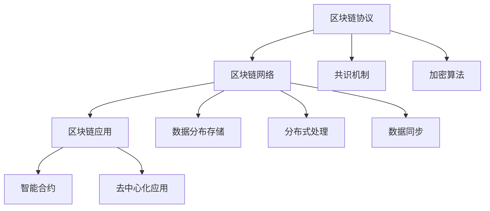

                 

# 区块链技术：去中心化应用开发

## 1. 背景介绍

### 1.1 问题由来

区块链技术作为一种去中心化的分布式账本技术，自2009年比特币成功上线以来，迅速吸引了全球各界关注。区块链不仅可以用于数字货币发行和交易，还能应用于金融、供应链、医疗、政府等诸多行业，为解决传统中心化系统的种种问题提供了全新方案。

在技术发展初期，区块链更多被视为一种新型金融工具。但随着技术生态的日益成熟，业界逐渐意识到其深远的行业应用潜力。区块链的去中心化、不可篡改、透明、可追溯等特性，使其在保障数据安全、提高交易效率、促进协作治理等方面具备独特的优势。

### 1.2 问题核心关键点

要充分理解区块链技术及其在去中心化应用开发中的应用，首先需要明确几个核心概念和关键点：

1. 区块链：基于时间顺序的链式数据结构，通过非对称加密和共识机制，维护一个去中心化的分布式账本。每个区块包含一组交易记录，并通过区块链算法链接起来。

2. 去中心化：指数据的分布式存储和处理，每个参与节点对数据都有同等的访问和操作权限。无需依赖中心化权威机构，所有参与节点共同维护网络，保障数据安全和系统可靠性。

3. 共识机制：用于解决节点间数据一致性的协议，常见的包括PoW、PoS、DPoS等。通过共识算法，节点达成对链上数据的共同认定，从而维护网络的一致性和透明性。

4. 智能合约：一种在区块链上运行的可执行代码，具备自动执行、透明、不可篡改的特性。广泛应用于金融、供应链、物联网等领域，实现自动化、高效的业务逻辑。

5. 加密算法：用于数据安全和身份验证的算法，常见的包括非对称加密、哈希算法等。区块链依赖加密算法保障交易记录的安全性和不可篡改性。

6. 跨链技术：指不同区块链之间实现数据交互、互操作的技术。通过跨链技术，可以实现资产转移、信息共享、多链协同等功能，拓展区块链的应用范围。

这些核心概念和关键点构成了区块链技术的底层框架，为其在各行各业的应用提供了坚实的理论基础。

### 1.3 问题研究意义

研究和开发基于区块链的去中心化应用，具有重要的现实意义：

1. **降低信任成本**：去中心化的区块链网络消除了中心化权威机构，通过加密和共识机制，确保数据真实、可信，降低用户对第三方机构的依赖。

2. **提高交易效率**：区块链通过分布式存储和处理，减少了中心化系统的中间环节，大幅提升了交易处理速度，降低了交易成本。

3. **增强系统韧性**：去中心化的系统设计，通过冗余和容错机制，提高了系统的韧性和稳定性，避免了单点故障。

4. **促进信息透明**：区块链的透明性和不可篡改特性，使得数据公开、可追溯，促进了信息的透明性和公平性。

5. **促进协作治理**：通过智能合约，区块链可以实现自动化、高效的业务逻辑，促进各参与方协同治理，实现多方共赢。

6. **推动创新应用**：区块链为各行各业提供了新的技术范式，推动了诸如金融、供应链、物联网等领域的新应用探索和发展。

## 2. 核心概念与联系

### 2.1 核心概念概述

区块链技术去中心化应用开发的核心理念是通过构建去中心化的分布式账本系统，实现数据的安全、可信、透明和高效管理。这一理念贯穿于区块链的各个组件和技术实现中，下面我们将详细介绍区块链的三个核心组成部分：

1. **区块链协议**：定义了区块链的数据结构、共识机制和网络通信协议，是区块链的基础。
2. **区块链网络**：指参与区块链的多个节点构成的分布式网络，负责数据的存储和处理。
3. **区块链应用**：基于区块链技术构建的各类应用，包括智能合约、去中心化应用等，实现业务逻辑的自动化和高效化。

### 2.2 核心概念联系

区块链的各个核心组成部分通过严格的协议和机制相互连接，共同维护区块链的运行和应用。以下通过Mermaid流程图展示区块链的核心组件及它们之间的联系：



从上图中可以看到，区块链协议通过定义共识机制和加密算法，保障区块链网络的安全和一致性。数据通过分布式存储和处理在网络中传输，并通过智能合约和去中心化应用实现业务逻辑。各组件间相互作用，共同构成了一个高效、安全、可信任的去中心化系统。

## 3. 核心算法原理 & 具体操作步骤
### 3.1 算法原理概述

区块链的去中心化应用开发主要涉及以下几个关键算法：

1. **共识机制**：通过共识算法，节点达成对链上数据的共同认定，从而维护网络的一致性和透明性。

2. **加密算法**：用于数据安全和身份验证的算法，保障交易记录的安全性和不可篡改性。

3. **智能合约**：在区块链上运行的可执行代码，实现自动化、高效的业务逻辑。

### 3.2 算法步骤详解

基于区块链的去中心化应用开发一般包括以下几个步骤：

**Step 1: 设计共识机制**
- 选择合适的共识算法，如PoW、PoS、DPoS等，根据应用场景和需求确定具体算法参数。

**Step 2: 实现区块链协议**
- 根据共识算法和加密算法，设计区块链协议，包括区块结构、交易格式、消息传递协议等。

**Step 3: 部署区块链网络**
- 搭建多个节点构成的分布式网络，并配置网络参数，如网络通信协议、共识参数、存储策略等。

**Step 4: 编写智能合约**
- 使用Solidity等编程语言编写智能合约，定义业务逻辑和自动化操作。

**Step 5: 部署应用和测试**
- 在区块链网络上部署智能合约和相关应用，并进行测试验证，确保应用正常运行。

**Step 6: 监控与维护**
- 实时监控区块链网络状态，及时处理异常和故障，保障应用稳定运行。

### 3.3 算法优缺点

区块链去中心化应用开发具有以下优点：

1. **安全性高**：通过加密和共识机制，保障数据的安全性和不可篡改性。

2. **透明度高**：所有交易和数据公开透明，可追溯和审计，提升了系统的可信度。

3. **灵活性高**：智能合约和分布式应用的编写和部署相对自由，可根据需求实现多样化的业务逻辑。

4. **效率高**：减少了中心化系统的中间环节，交易处理速度快，交易成本低。

5. **可靠性高**：分布式存储和处理提升了系统的冗余性和容错性，保障了系统的可靠性和稳定性。

但同时，也存在以下缺点：

1. **复杂度高**：设计、部署和维护区块链系统需要较高的技术门槛，对开发者要求较高。

2. **扩展性差**：随着网络节点和交易量的增加，系统的扩展性受到限制，可能会遇到性能瓶颈。

3. **隐私保护难度大**：由于所有交易和数据公开透明，如何在保护隐私和保障安全之间取得平衡是一大挑战。

4. **共识成本高**：共识机制需要消耗大量计算资源，对网络硬件和能源成本有较高要求。

5. **智能合约漏洞风险**：由于智能合约的自动执行特性，一旦出现漏洞，可能造成严重损失。

### 3.4 算法应用领域

区块链技术在多个领域都有广泛应用，以下是几个典型的应用场景：

1. **数字货币**：比特币、以太坊等数字货币利用区块链技术实现去中心化的交易和记录，保障交易安全和透明。

2. **供应链管理**：通过区块链记录供应链各环节的数据，实现全程透明、不可篡改，提升供应链的效率和信任度。

3. **医疗健康**：利用区块链存储和共享病历数据，保障数据隐私和安全，提升医疗服务的透明性和可信度。

4. **金融服务**：在金融领域，区块链可用于跨境支付、票据交易、清算结算等，提高交易效率和安全性。

5. **版权保护**：通过区块链记录作品的版权信息，保障版权所有者的权益，防止侵权和盗版。

6. **社交网络**：利用区块链构建去中心化的社交网络，保障用户数据隐私和内容真实性，提升社交平台的安全性和透明性。

7. **物联网**：通过区块链实现物联网设备间的互操作和数据共享，提高物联网系统的可靠性和安全性。

## 4. 数学模型和公式 & 详细讲解 & 举例说明

### 4.1 数学模型构建

区块链的去中心化应用开发涉及到多个数学模型和算法，这里以共识机制为例进行详细讲解。

**共识机制的数学模型**：

共识机制通常包括两种类型：基于工作量证明(PoW)的共识算法和基于权益证明(PoS)的共识算法。

1. **PoW共识机制**：

在PoW机制中，通过计算特定的哈希函数难度较大的值来生成新区块，并保证全网共识。

- 目标函数：`h = H(block_header || transaction_data) < target_difficulty`
- 目标难度：目标难度是一个正整数，表示一个区块需要解决多少个哈希函数才能生成。

- 解决过程：通过不断调整区块头中的随机数，计算哈希函数，直到满足目标难度。

2. **PoS共识机制**：

在PoS机制中，根据参与节点的权益大小，通过随机选择的方式产生新区块的生成者。

- 权益计算：权益大小取决于节点持有的货币数量和存续时间。
- 生成者选择：从所有节点中随机选择，按照权益比例分配选中概率。

### 4.2 公式推导过程

以下以PoW共识机制为例，推导目标函数和目标难度。

**目标函数推导**：

在PoW机制中，需要计算哈希函数满足特定难度条件的值。设目标难度为 `target_difficulty`，目标函数为：

`h = H(block_header || transaction_data)`

其中，`H` 表示哈希函数，`block_header` 表示区块头，`transaction_data` 表示区块中包含的交易数据。

为了满足目标难度，需要不断调整区块头中的随机数，直到生成的哈希值满足 `h < target_difficulty`。

**目标难度推导**：

目标难度的大小通常与网络中交易量成正比。具体计算公式为：

`target_difficulty = 2^256 / network_transaction_volume`

其中，`network_transaction_volume` 表示网络中总交易量，通常为固定值。

通过上述推导，可以看到PoW共识机制的目标函数和目标难度，决定了新区块的生成难度和共识过程。

### 4.3 案例分析与讲解

**案例分析**：

以以太坊网络为例，分析PoS共识机制的具体实现。

**以太坊PoS共识机制**：

以太坊网络采用基于权益证明(PoS)的共识机制，称为以太坊权益证明(ETC)。

- 权益计算：每个节点的权益大小等于其持有的以太币数量。
- 生成者选择：从所有节点中随机选择，按照权益比例分配选中概率。

以太坊的共识机制通过权益证明实现了去中心化的节点选择，同时避免了PoW机制中的高耗能和高成本问题。

## 5. 项目实践：代码实例和详细解释说明

### 5.1 开发环境搭建

在进行区块链开发前，需要搭建好相应的开发环境。以下是以太坊网络为例，搭建开发环境的步骤：

1. **安装Geth**：从以太坊官网下载安装Geth，配置本地节点。

2. **安装Metamask**：下载安装Metamask浏览器插件，用于管理以太币钱包和交易。

3. **安装Truffle**：从Truffle官网下载安装Truffle框架，配置本地测试网络。

4. **编写智能合约**：使用Solidity编写智能合约，并编译生成字节码文件。

5. **部署合约**：在本地测试网络中部署智能合约，并进行测试验证。

6. **交互测试**：使用Metamask进行合约交互测试，验证合约的正确性和可靠性。

### 5.2 源代码详细实现

以下是一个简单的以太坊智能合约示例，展示如何定义一个简单的投票合约：

```solidity
pragma solidity ^0.8.0;

contract Vote {
    uint public voteCount;
    address[] public voters;
    uint public timeLock;

    function vote(uint voterId) public {
        require(!voters[voterId], "Voter already voted");
        voters[voterId] = msg.sender;
        voteCount++;
    }

    function stopVote() public {
        require(msg.sender == owner, "Only owner can stop vote");
        voters = addresses(0);
        voteCount = 0;
    }
}
```

### 5.3 代码解读与分析

**代码解读**：

以上代码定义了一个简单的投票合约，包含以下功能：

1. `voteCount`：投票次数计数器。
2. `voters`：投票者地址列表。
3. `timeLock`：投票时间锁定，防止提前投票。
4. `vote(uint voterId)`：投票函数，接受投票者地址作为参数，记录投票次数，并更新投票者列表。
5. `stopVote()`：停止投票函数，只有合约所有者可以调用，清除投票者列表和投票次数。

**代码分析**：

以上代码展示了如何利用Solidity编写智能合约，定义业务逻辑，并通过函数实现自动化操作。智能合约在区块链上自动执行，无需第三方干预，保障了业务逻辑的透明性和安全性。

### 5.4 运行结果展示

以下是使用Metamask进行合约交互测试的结果：

1. 在Metamask中创建以太币钱包。
2. 在本地测试网络中部署上述投票合约。
3. 使用Metamask进行合约交互，投票。
4. 调用`stopVote()`函数停止投票。

## 6. 实际应用场景

### 6.1 数字货币

**场景描述**：

数字货币利用区块链技术实现去中心化的交易和记录，保障交易安全和透明。

**解决方案**：

通过区块链协议和共识机制，构建数字货币网络，所有交易记录公开透明，不可篡改。每个节点都可以验证交易的真实性，防止欺诈和双花。

**示例应用**：

比特币、以太坊等数字货币通过区块链技术实现了去中心化的交易和记录，保障了交易的安全和透明。

### 6.2 供应链管理

**场景描述**：

供应链管理面临信息孤岛、数据不透明等问题，严重影响了供应链效率和信任度。

**解决方案**：

利用区块链记录供应链各环节的数据，实现全程透明、不可篡改，提升供应链的效率和信任度。

**示例应用**：

IBM Food Trust利用区块链技术记录食品供应链数据，保障食品安全和溯源性。

### 6.3 医疗健康

**场景描述**：

医疗数据隐私和安全问题一直困扰着医疗行业，传统中心化存储方式容易泄露隐私，且数据不透明。

**解决方案**：

利用区块链存储和共享病历数据，保障数据隐私和安全，提升医疗服务的透明性和可信度。

**示例应用**：

Hyperledger Health利用区块链技术构建医疗数据共享平台，保障患者数据隐私和医疗服务的透明性。

### 6.4 未来应用展望

区块链技术未来将在更多领域得到应用，为传统行业带来变革性影响。

1. **智能合约和自动化**：通过智能合约实现自动化操作，提高业务效率和透明度。
2. **数据安全与隐私保护**：利用区块链保障数据安全，保护用户隐私。
3. **多链协同**：通过跨链技术实现不同区块链之间的数据交互和互操作，拓展区块链的应用范围。
4. **去中心化金融**：利用区块链技术构建去中心化金融系统，实现自动化、透明的金融操作。
5. **物联网**：通过区块链实现物联网设备间的互操作和数据共享，提高物联网系统的可靠性和安全性。
6. **边缘计算**：利用区块链技术构建去中心化的边缘计算系统，提高数据处理效率和安全性。

## 7. 工具和资源推荐

### 7.1 学习资源推荐

为了帮助开发者系统掌握区块链技术及其应用，这里推荐一些优质的学习资源：

1. 《区块链技术原理与实战》系列博文：深入浅出地讲解了区块链技术的原理和应用场景，适合初学者入门。

2. 《以太坊开发手册》书籍：以太坊官方文档，详细介绍了以太坊平台和智能合约开发。

3 《智能合约设计与实现》课程：由Blockchain Council开设的在线课程，系统讲解了智能合约设计和实现的基本原理和技巧。

4 《区块链技术应用》书籍：详细介绍了区块链在金融、供应链、医疗等领域的应用案例。

5 以太坊官方社区：提供丰富的技术文档、示例代码和社区支持，帮助开发者快速上手区块链开发。

通过对这些资源的学习实践，相信你一定能够快速掌握区块链技术，并用于解决实际的业务问题。

### 7.2 开发工具推荐

区块链的开发离不开各类工具支持。以下是几款常用的开发工具：

1. Geth：以太坊官方客户端，支持本地节点和测试网络配置。

2. Metamask：以太币钱包和交易管理工具，支持合约交互和交易操作。

3. Truffle：以太坊智能合约开发框架，提供丰富的开发工具和测试环境。

4. Remix IDE：基于浏览器的智能合约编辑器，支持代码编译和合约交互测试。

5. Remix Console：智能合约运行环境，支持本地测试和交互。

6. ConsenSys DevNet：以太坊官方测试网络，提供丰富的测试资源和社区支持。

合理利用这些工具，可以显著提升区块链开发效率，加快创新迭代的步伐。

### 7.3 相关论文推荐

区块链技术的发展离不开学界的持续研究。以下是几篇奠基性的相关论文，推荐阅读：

1. On the Decentralization of Transactions: A Consensus Model for Distributed Databases（Tendermint论文）：提出了一种基于拜占庭容错的共识机制，适用于去中心化应用开发。

2. Smart Contracts: Languages, Compilers, and Architecture (Ethereum白皮书)：介绍了以太坊平台的智能合约语言和架构，奠定了以太坊智能合约开发的基础。

3. BlockCypher: A Blockchain Library for Javascript：提供了一套基于区块链的JavaScript库，支持多种区块链平台和共识算法。

4. Decentralized exchanges and automated market makers（Decentralized Finance白皮书）：介绍了一种基于去中心化交易所（DEX）的自动化市场策略，提升了DeFi系统的自动化和透明性。

5. Consensus in the presence of Byzantine faults（PoS共识机制研究论文）：研究了PoS共识机制在拜占庭故障下的容错性和安全性，为PoS共识算法的改进提供了理论基础。

这些论文代表了大规模区块链技术的研究进展，通过学习这些前沿成果，可以帮助研究者把握学科前进方向，激发更多的创新灵感。

## 8. 总结：未来发展趋势与挑战

### 8.1 总结

本文对区块链技术的去中心化应用开发进行了全面系统的介绍。首先阐述了区块链技术的核心概念和研究背景，明确了区块链在分布式系统中的应用价值。其次，从原理到实践，详细讲解了区块链的共识机制、智能合约等关键技术，并给出了区块链开发的具体步骤和代码示例。同时，本文还广泛探讨了区块链技术在多个行业领域的应用前景，展示了其广阔的发展空间。此外，本文精选了区块链技术的各类学习资源，力求为读者提供全方位的技术指引。

通过本文的系统梳理，可以看到，区块链技术正在成为分布式系统的重要范式，极大地拓展了数据管理和业务逻辑的应用边界，催生了更多的落地场景。得益于其去中心化、透明、安全的特性，区块链技术必将在更多领域大放异彩，推动人类社会的数字化转型。

### 8.2 未来发展趋势

展望未来，区块链技术将呈现以下几个发展趋势：

1. **技术进步**：随着硬件性能和算法的不断提升，区块链的扩展性、安全性和交易速度将进一步提升。

2. **标准化和互操作**：区块链之间的互操作性和标准化协议将成为趋势，推动不同区块链平台之间的数据共享和协同治理。

3. **跨链技术**：通过跨链技术实现不同区块链之间的数据交互和互操作，拓展区块链的应用范围。

4. **隐私保护**：区块链技术将更加注重数据隐私保护，引入零知识证明、同态加密等技术，提升数据安全性。

5. **去中心化应用**：更多的去中心化应用将基于区块链技术构建，提高业务逻辑的自动化和透明性。

6. **边缘计算**：利用区块链技术构建去中心化的边缘计算系统，提高数据处理效率和安全性。

7. **自动化治理**：通过智能合约和去中心化应用，实现自动化、透明化的治理机制，提升系统的效率和可靠性。

以上趋势凸显了区块链技术的广阔前景，这些方向的探索发展，必将进一步提升区块链系统的性能和应用范围，为人类社会的数字化转型注入新的动力。

### 8.3 面临的挑战

尽管区块链技术已经取得了瞩目成就，但在迈向更加智能化、普适化应用的过程中，仍面临诸多挑战：

1. **性能瓶颈**：大规模交易和高共识成本导致区块链系统扩展性受限，网络性能和交易速度有待提高。

2. **安全问题**：智能合约的漏洞、共识机制的安全性、隐私保护等问题仍需进一步解决。

3. **共识机制复杂**：共识机制的实现和优化复杂，需要在安全性、公平性、性能之间取得平衡。

4. **隐私保护难度大**：在保障数据隐私和安全之间找到平衡，是一大挑战。

5. **治理机制不完善**：缺乏完善的治理机制，难以应对节点行为的不确定性。

6. **法规和监管**：区块链技术面临复杂的法规和监管环境，需进一步推动行业标准的制定和实施。

7. **技术门槛高**：区块链技术涉及多学科知识，对开发者技术要求较高，普及度有待提高。

8. **生态系统不成熟**：缺乏完善的应用生态和标准化的开发工具，阻碍技术的广泛应用。

正视区块链技术面临的这些挑战，积极应对并寻求突破，将是大规模区块链技术走向成熟的必由之路。相信随着学界和产业界的共同努力，这些挑战终将一一被克服，区块链技术必将在构建分布式、透明、安全的网络系统中发挥重要作用。

### 8.4 研究展望

面对区块链技术面临的种种挑战，未来的研究需要在以下几个方面寻求新的突破：

1. **高扩展性区块链**：开发高扩展性的共识机制和区块链协议，提升系统的扩展性和交易速度。

2. **隐私保护技术**：引入隐私保护技术，如零知识证明、同态加密等，提升数据隐私和安全。

3. **跨链互操作**：研究跨链互操作技术，实现不同区块链之间的数据交互和协同治理。

4. **自动化治理机制**：引入自动化治理机制，提高系统的自动化和透明性，提升治理效率。

5. **去中心化应用开发工具**：开发易于使用的区块链开发工具和框架，降低技术门槛，促进区块链技术的普及。

6. **行业应用标准化**：推动区块链技术的行业应用标准化，形成统一的技术规范和标准，提升技术成熟度。

7. **生态系统建设**：构建完善的区块链生态系统，推动更多应用场景和行业标准的落地，提升技术的实际应用价值。

这些研究方向的探索，必将引领区块链技术迈向更高的台阶，为构建分布式、透明、安全的网络系统铺平道路。面向未来，区块链技术还需要与其他人工智能技术进行更深入的融合，如知识表示、因果推理、强化学习等，多路径协同发力，共同推动分布式系统和智能交互系统的进步。只有勇于创新、敢于突破，才能不断拓展区块链技术的边界，让智能技术更好地造福人类社会。

## 9. 附录：常见问题与解答

**Q1: 什么是区块链？**

A: 区块链是一种基于时间顺序的链式数据结构，通过非对称加密和共识机制，维护一个去中心化的分布式账本。

**Q2: 区块链的核心组件有哪些？**

A: 区块链的核心组件包括区块链协议、区块链网络和区块链应用。区块链协议定义了数据结构和通信协议，区块链网络负责数据的存储和处理，区块链应用基于区块链技术实现业务逻辑。

**Q3: 什么是智能合约？**

A: 智能合约是一种在区块链上运行的可执行代码，实现自动化、高效的业务逻辑。

**Q4: 区块链技术在供应链管理中的应用案例有哪些？**

A: 区块链在供应链管理中的应用案例包括IBM Food Trust、Walmart TradeLens等，通过记录供应链数据，实现全程透明、不可篡改，提升供应链效率和信任度。

**Q5: 区块链技术在医疗健康中的应用有哪些？**

A: 区块链在医疗健康中的应用包括Hyperledger Health、MEDICJAX等，利用区块链存储和共享病历数据，保障数据隐私和安全，提升医疗服务的透明性和可信度。

通过以上常见问题的解答，相信读者能够更好地理解区块链技术及其应用，为区块链技术的应用实践提供参考和指导。

