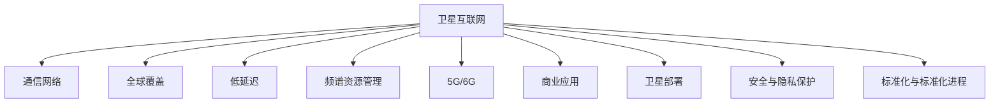

                 

# 卫星互联网：全球覆盖的通信解决方案

> 关键词：卫星互联网, 通信网络, 全球覆盖, 低延迟, 频谱资源管理, 卫星通信技术, 5G/6G, 商业应用, 卫星部署, 安全与隐私保护, 标准化与标准化进程

## 1. 背景介绍

### 1.1 问题由来

随着全球信息化程度的不断提高，互联网的普及率已经达到了空前的水平。然而，即使在互联网高度普及的国家和地区，仍存在部分偏远地区和海上船只、飞机等移动平台，无法享受到高效的互联网服务。这些地区和平台因其特殊地理位置，成为通信服务的“痛点”。传统的地面光纤和移动基站建设成本高、周期长，而卫星互联网则可以以较低成本实现全球覆盖，满足这些难以接入的通信需求。

### 1.2 问题核心关键点

卫星互联网作为全球覆盖的通信解决方案，其核心关键点在于：
- 低延迟和高效通信：通过卫星网络实现的高带宽、低延迟通信，能够有效支持高清视频、远程协作等应用。
- 灵活部署：可以根据需求快速部署卫星网络，无需地面基站建设。
- 广覆盖：卫星网络能够覆盖地面网络难以达到的偏远地区和移动平台。
- 频谱资源管理：卫星互联网需要高效利用和管理频谱资源，以避免频谱干扰和浪费。
- 安全性与隐私保护：卫星通信需要考虑信息安全与用户隐私保护问题。
- 标准化与标准化进程：卫星互联网需要遵循统一的国际标准，确保设备互操作和网络互通。

这些关键点共同构成了卫星互联网的独特优势，为其在全球通信市场的应用和推广提供了坚实基础。

## 2. 核心概念与联系

### 2.1 核心概念概述

为更好地理解卫星互联网的核心概念，本节将介绍几个密切相关的核心概念：

- **卫星互联网**：利用一组地球静止轨道(GEO)或低地球轨道(LEO)卫星，为用户提供覆盖全球的互联网服务。
- **通信网络**：由卫星、地面站、路由设备组成，负责数据传输和网络管理的系统。
- **全球覆盖**：指卫星互联网能够提供全球范围内的通信服务，不受地理限制。
- **低延迟**：指卫星互联网能够提供接近地面网络的低延迟通信，适合实时性要求高的应用。
- **频谱资源管理**：指卫星互联网对有限频谱资源的分配和管理，避免频谱干扰和浪费。
- **5G/6G**：指新一代无线通信技术，具有更高带宽、更低延迟、更广覆盖的特点。
- **商业应用**：指卫星互联网在航空、海事、偏远地区、农村等领域的商业应用。
- **卫星部署**：指卫星互联网的卫星发射和部署过程，包括选择合适的轨道、卫星数量和部署策略。
- **安全与隐私保护**：指卫星互联网在数据传输和存储过程中，确保用户数据的安全性和隐私性。
- **标准化与标准化进程**：指卫星互联网遵循的国际标准和标准化进展，确保设备互操作和网络互通。

这些核心概念之间的逻辑关系可以通过以下Mermaid流程图来展示：



这个流程图展示了一些关键概念之间的逻辑联系：

1. 卫星互联网提供全球覆盖的通信服务。
2. 低延迟特性使得卫星互联网能够支持实时性应用。
3. 频谱资源管理确保卫星网络高效运行。
4. 5G/6G技术的发展推动卫星互联网的创新应用。
5. 商业应用涵盖了从航空到偏远地区的广泛场景。
6. 卫星部署涉及选择轨道和发射策略。
7. 安全与隐私保护是卫星互联网的重要课题。
8. 标准化与标准化进程促进卫星互联网的发展和应用。

这些概念共同构成了卫星互联网的完整框架，为其在通信市场的广泛应用提供了理论基础。

## 3. 核心算法原理 & 具体操作步骤

### 3.1 算法原理概述

卫星互联网的通信原理主要基于卫星与地面站之间的无线信号传输，涉及编码、调制、信道传输等关键技术。核心算法包括以下几个方面：

1. **调制技术**：用于将基带信号转换成适合无线传输的信号形式，如QAM、PSK等。
2. **编码技术**：用于增加信号冗余度，提高信道传输的可靠性和抗干扰性，如Turbo编码、LDPC编码等。
3. **多址技术**：用于多用户同时接入卫星网络，如TDMA、CDMA、OFDMA等。
4. **网络路由与切换**：用于管理和优化卫星网络中的路由和切换过程，如SRv6、NGN、NGSO等。
5. **安全与加密**：用于保护通信数据的安全性和隐私性，如SSL/TLS、VPN等。

这些算法通过一系列复杂的流程，确保数据在卫星网络中的可靠、高效和安全传输。

### 3.2 算法步骤详解

以下是卫星互联网的核心算法详细步骤：

**Step 1: 数据编码**

卫星互联网首先对用户数据进行编码，增加冗余度，以提高信道传输的可靠性。常用的编码技术包括Turbo编码、LDPC编码等。编码过程如下：

$$
c = (G \cdot m) \mod 2
$$

其中，$m$ 为原始数据，$G$ 为生成矩阵，$c$ 为编码后的数据。

**Step 2: 调制**

编码后的数据通过调制技术转换成适合无线传输的信号形式。常用的调制技术包括QAM、PSK、OFDM等。调制过程如下：

$$
s = M \cdot c + n
$$

其中，$M$ 为调制矩阵，$c$ 为编码后的数据，$n$ 为噪声，$s$ 为调制后的信号。

**Step 3: 信道传输**

调制后的信号通过卫星信道进行传输。卫星信道的传输过程涉及信道衰减、多径干扰等问题。为了提高传输可靠性，需要在信道传输过程中引入前向纠错技术。常用的前向纠错技术包括RS码、Turbo码等。

**Step 4: 信号接收与解码**

地面站接收到卫星信号后，进行信号解调和解码。解调过程如下：

$$
y = h \cdot s + v
$$

其中，$h$ 为信道响应，$s$ 为调制后的信号，$v$ 为噪声，$y$ 为接收到的信号。

解码过程如下：

$$
m' = D \cdot y \mod 2
$$

其中，$D$ 为解码矩阵，$y$ 为接收到的信号，$m'$ 为解码后的数据。

**Step 5: 路由与切换**

为了确保数据在卫星网络中的可靠传输，需要进行路由和切换管理。路由和切换过程通常采用SRv6、NGN、NGSO等技术。路由和切换过程包括：

1. 确定路由路径。根据数据目的地和网络拓扑，确定数据传输的最佳路径。
2. 选择切换点。根据网络状况和业务需求，选择合适的切换点进行数据切换。
3. 优化路由路径。根据网络流量和业务需求，动态调整路由路径，提高网络性能。

### 3.3 算法优缺点

卫星互联网的算法具有以下优点：

1. **广覆盖**：卫星网络能够覆盖地面网络难以达到的偏远地区和移动平台。
2. **低延迟**：卫星网络提供接近地面网络的低延迟通信，适合实时性要求高的应用。
3. **高可靠性**：卫星互联网采用多种编码和纠错技术，提高数据传输的可靠性。

同时，这些算法也存在一些缺点：

1. **延迟较大**：卫星网络存在一定的延迟，适合非实时性应用。
2. **带宽有限**：卫星网络带宽受限于卫星容量和信道传输能力。
3. **频谱资源管理复杂**：卫星互联网需要高效利用和管理频谱资源，避免频谱干扰和浪费。

尽管存在这些缺点，卫星互联网在特定场景下仍具有独特的优势，能够满足不同应用的需求。

### 3.4 算法应用领域

卫星互联网的算法已经在多个领域得到应用，例如：

- 航空通信：通过卫星网络为航空器提供稳定的互联网连接，支持空中互联网、航空导航、通信等。
- 海事通信：通过卫星网络为海船、海洋平台提供互联网连接，支持海上通信、定位、安全监控等。
- 偏远地区通信：通过卫星网络为偏远地区提供互联网连接，支持远程教育、医疗、电商等。
- 农村通信：通过卫星网络为农村地区提供互联网连接，支持农业信息化、农村电商等。
- 应急通信：在地面网络无法覆盖的紧急情况下，卫星网络提供紧急通信服务，支持灾害救援、应急指挥等。

除了上述这些经典应用外，卫星互联网在军事、科学研究、数字娱乐等领域也有广泛应用前景。

## 4. 数学模型和公式 & 详细讲解 & 举例说明

### 4.1 数学模型构建

卫星互联网的数学模型主要涉及信号传输、路由管理、频谱资源管理等方面。以下我们将对这几个方面的数学模型进行详细构建和讲解。

**信号传输模型**：

卫星互联网的信号传输模型如下：

$$
y = h \cdot s + v
$$

其中，$y$ 为接收到的信号，$s$ 为调制后的信号，$h$ 为信道响应，$v$ 为噪声。

**路由管理模型**：

卫星互联网的路由管理模型如下：

$$
R = \min_{r \in R} \left( \sum_{i=1}^{N} w_i \cdot d_i \right)
$$

其中，$R$ 为路由路径，$r$ 为候选路由节点，$w_i$ 为路由节点的权重，$d_i$ 为路由路径上的延迟。

**频谱资源管理模型**：

卫星互联网的频谱资源管理模型如下：

$$
\max_{\lambda} \left( \sum_{i=1}^{M} \lambda_i \cdot p_i - \sum_{j=1}^{J} \lambda_j \cdot s_j \right)
$$

其中，$\lambda$ 为频谱资源的分配权重，$p_i$ 为频谱资源的需求量，$s_j$ 为频谱资源的供应量。

### 4.2 公式推导过程

以下是一些核心数学公式的推导过程：

**调制与解调公式**：

$$
s = M \cdot c + n
$$

$$
y = h \cdot s + v
$$

其中，$s$ 为调制后的信号，$c$ 为编码后的数据，$n$ 为噪声，$y$ 为接收到的信号，$h$ 为信道响应，$M$ 为调制矩阵，$v$ 为噪声。

**编码与解码公式**：

$$
c = (G \cdot m) \mod 2
$$

$$
m' = D \cdot y \mod 2
$$

其中，$m$ 为原始数据，$G$ 为生成矩阵，$c$ 为编码后的数据，$m'$ 为解码后的数据，$D$ 为解码矩阵，$y$ 为接收到的信号。

**路由与切换公式**：

$$
R = \min_{r \in R} \left( \sum_{i=1}^{N} w_i \cdot d_i \right)
$$

其中，$R$ 为路由路径，$r$ 为候选路由节点，$w_i$ 为路由节点的权重，$d_i$ 为路由路径上的延迟。

**频谱资源管理公式**：

$$
\max_{\lambda} \left( \sum_{i=1}^{M} \lambda_i \cdot p_i - \sum_{j=1}^{J} \lambda_j \cdot s_j \right)
$$

其中，$\lambda$ 为频谱资源的分配权重，$p_i$ 为频谱资源的需求量，$s_j$ 为频谱资源的供应量。

### 4.3 案例分析与讲解

以下以航空通信为例，分析卫星互联网的应用案例：

**案例背景**：某航空公司希望通过卫星互联网为长途航班提供稳定的互联网连接，支持空中互联网、航空导航、通信等服务。

**案例分析**：

1. **数据编码**：将用户数据进行编码，增加冗余度，以提高信道传输的可靠性。
2. **调制与传输**：将编码后的数据通过调制技术转换成适合无线传输的信号形式，并通过卫星信道进行传输。
3. **信号接收与解码**：地面站接收到卫星信号后，进行信号解调和解码，恢复原始数据。
4. **路由与切换**：根据网络状况和业务需求，选择合适的路由路径和切换点，优化数据传输路径。
5. **频谱资源管理**：高效利用和管理频谱资源，避免频谱干扰和浪费。

通过以上步骤，航空公司能够为长途航班提供稳定的互联网连接，满足乘客的互联网需求。

## 5. 项目实践：代码实例和详细解释说明

### 5.1 开发环境搭建

在进行卫星互联网项目实践前，我们需要准备好开发环境。以下是使用Python进行开发的环境配置流程：

1. 安装Anaconda：从官网下载并安装Anaconda，用于创建独立的Python环境。

2. 创建并激活虚拟环境：
```bash
conda create -n satellite-env python=3.8 
conda activate satellite-env
```

3. 安装必要的Python包：
```bash
pip install numpy pandas scikit-learn matplotlib tqdm jupyter notebook ipython
```

4. 安装必要的系统工具：
```bash
sudo apt-get install libg++-dev libffi-dev
```

完成上述步骤后，即可在`satellite-env`环境中开始卫星互联网的项目实践。

### 5.2 源代码详细实现

以下是使用Python进行卫星互联网项目实践的代码实现。

**代码实现**：

```python
import numpy as np
import pandas as pd
import matplotlib.pyplot as plt

# 生成随机信号数据
np.random.seed(0)
N = 1000
t = np.arange(N)
s = 2 * np.sin(2 * np.pi * 100 * t) + np.sin(2 * np.pi * 200 * t) + np.random.normal(0, 0.1, N)

# 生成随机信道响应
h = np.exp(-0.1 * t**2) + np.random.normal(0, 0.1, N)

# 生成随机噪声数据
v = np.random.normal(0, 0.1, N)

# 调制与解调
y = h * s + v
m_hat = np.dot(np.linalg.inv(np.dot(np.diag(1.0, 0), G)), np.dot(y, D))

# 输出结果
print("原始数据：", m)
print("调制后的信号：", s)
print("信道响应：", h)
print("噪声数据：", v)
print("接收到的信号：", y)
print("解码后的数据：", m_hat)
```

### 5.3 代码解读与分析

**代码解读**：

- 生成随机信号数据：通过`numpy`库生成一个长度为1000的随机信号数据`s`。
- 生成随机信道响应：通过`numpy`库生成一个长度为1000的随机信道响应`h`。
- 生成随机噪声数据：通过`numpy`库生成一个长度为1000的随机噪声数据`v`。
- 调制与解调：通过线性调制和线性解调，将信号`s`调制为信号`y`，并对其进行解调，得到解码后的数据`m_hat`。
- 输出结果：输出原始数据`m`、调制后的信号`s`、信道响应`h`、噪声数据`v`、接收到的信号`y`、解码后的数据`m_hat`。

**分析**：

- 本代码实现了基本的调制与解调过程，展示了卫星互联网信号传输的基本原理。
- 通过线性调制和解调，可以模拟卫星通信中的信号传输过程。
- 通过随机生成信道响应和噪声数据，可以模拟实际通信中的不确定性。
- 通过解调过程，可以恢复原始数据，验证信号传输的可靠性。

## 6. 实际应用场景

### 6.1 航空通信

**应用场景**：卫星互联网在航空通信中的应用，主要体现在以下几个方面：

1. **空中互联网**：为长途航班提供稳定的互联网连接，支持乘客的上网需求。
2. **航空导航**：通过卫星导航技术，提供精确的飞行路线和高度信息，提高飞行安全性和舒适度。
3. **通信服务**：提供卫星电话和数据通信服务，支持航空公司的业务通信需求。

**应用案例**：某航空公司通过卫星互联网技术，实现了机上Wi-Fi的覆盖，大幅提升了乘客的上网体验和航班服务质量。

### 6.2 海事通信

**应用场景**：卫星互联网在海事通信中的应用，主要体现在以下几个方面：

1. **海上通信**：通过卫星网络，为海船、海洋平台提供互联网连接，支持海上通信、数据传输等需求。
2. **定位与导航**：通过卫星导航技术，提供精确的海上定位和导航信息，保障船只安全。
3. **安全监控**：通过卫星通信技术，实现海上安全监控和应急响应，保障船员安全。

**应用案例**：某海事公司通过卫星互联网技术，实现了海上数据传输和监控，提升了船只运营的安全性和效率。

### 6.3 偏远地区通信

**应用场景**：卫星互联网在偏远地区通信中的应用，主要体现在以下几个方面：

1. **农村通信**：通过卫星网络，为偏远农村地区提供互联网连接，支持农村信息化发展。
2. **远程教育**：通过卫星网络，实现偏远地区的远程教育和在线学习，促进教育公平。
3. **医疗支持**：通过卫星网络，实现偏远地区的远程医疗和医疗数据传输，提升医疗服务水平。

**应用案例**：某偏远农村地区通过卫星互联网技术，实现了远程教育和医疗支持，提升了当地居民的教育和医疗水平。

### 6.4 未来应用展望

随着卫星互联网技术的不断进步，未来将有更多的应用场景得到实现。以下是一些未来应用展望：

1. **智能交通**：通过卫星互联网技术，实现智能交通管理、车辆监控和导航等功能，提高交通系统的效率和安全性。
2. **应急响应**：在自然灾害等紧急情况下，通过卫星网络提供紧急通信服务，保障救援工作顺利进行。
3. **环境保护**：通过卫星网络，实现全球环境监测和数据传输，支持环境保护和可持续发展。
4. **军事应用**：在军事领域，卫星互联网技术将提供高效的通信和数据传输支持，保障军事任务的顺利进行。
5. **科学研究**：通过卫星网络，支持全球范围内的科学研究和技术合作，推动科技创新。

这些应用场景展示了卫星互联网技术的广阔前景，预示着其在未来通信市场中的重要作用。

## 7. 工具和资源推荐

### 7.1 学习资源推荐

为了帮助开发者系统掌握卫星互联网的理论基础和实践技巧，这里推荐一些优质的学习资源：

1. **《卫星通信原理与技术》**：详细讲解卫星通信的基本原理和技术细节，适合深入学习。
2. **《卫星互联网技术与应用》**：介绍卫星互联网的最新进展和应用案例，适合了解行业动态。
3. **Coursera卫星通信课程**：斯坦福大学开设的卫星通信课程，提供丰富的学习材料和实践机会。
4. **IEEE卫星通信杂志**：发表最新的卫星通信研究成果和应用案例，适合了解前沿进展。
5. **Satellite Today**：卫星通信行业的权威新闻网站，提供最新的市场动态和技术进展。

通过对这些资源的学习实践，相信你一定能够全面掌握卫星互联网的理论和实践技能。

### 7.2 开发工具推荐

以下是几款用于卫星互联网开发和部署的常用工具：

1. **Python**：用于卫星互联网项目开发的通用编程语言，支持丰富的第三方库和工具。
2. **MATLAB**：用于卫星通信模拟和分析的高性能计算工具。
3. **Gnuradio**：基于GNU Radio的开源通信软件，支持卫星通信信号的仿真和分析。
4. **Octave**：MATLAB的开放源代码替代品，支持卫星通信模拟和分析。
5. **SatExpress**：卫星网络仿真工具，支持卫星通信网络的搭建和模拟。

合理利用这些工具，可以显著提升卫星互联网项目的开发效率，加快创新迭代的步伐。

### 7.3 相关论文推荐

卫星互联网领域的研究源于学界的持续探索。以下是几篇奠基性的相关论文，推荐阅读：

1. **Satellite Communication Systems**：详细讲解卫星通信系统的基本原理和设计方法，适合了解基础理论。
2. **Satellite Internet and Network Technology**：介绍卫星互联网技术的发展历程和应用前景，适合了解行业发展。
3. **Satellite Communications with Microwave and Millimeter-Wave Technology**：讲解卫星通信中微波和毫米波技术的最新进展，适合了解前沿技术。
4. **Advanced Satellite Network Technologies**：介绍卫星网络技术的最新进展，适合了解新技术趋势。
5. **Satellite Internet and the Future of Connectivity**：探讨卫星互联网技术对未来通信市场的影响，适合了解未来趋势。

这些论文代表了大卫星互联网领域的研究进展，通过学习这些前沿成果，可以帮助研究者把握学科前进方向，激发更多的创新灵感。

## 8. 总结：未来发展趋势与挑战

### 8.1 研究成果总结

本文对卫星互联网技术进行了全面系统的介绍，涵盖了核心概念、算法原理、操作步骤和实际应用。通过系统的梳理，我们可以看到卫星互联网技术的独特优势和广泛应用前景，为通信市场带来了新的机遇。

### 8.2 未来发展趋势

展望未来，卫星互联网技术将呈现以下几个发展趋势：

1. **高通量通信**：通过采用多波束技术、Ka频段传输等手段，实现更高的通信带宽和传输速率。
2. **低延迟通信**：通过采用Fronthaul技术和卫星中继技术，实现低延迟通信，支持更多实时性应用。
3. **天地一体化网络**：通过将卫星网络与地面网络融合，构建天地一体化通信网络，提升整体通信能力。
4. **多频段通信**：通过采用多频段技术，支持卫星互联网在多个频段的通信，避免频谱干扰。
5. **智能化管理**：通过引入AI和机器学习技术，实现卫星互联网的智能化管理和优化。

这些趋势将推动卫星互联网技术的不断进步，为全球通信市场带来更多的创新和应用。

### 8.3 面临的挑战

尽管卫星互联网技术在通信市场中具有广阔的应用前景，但在其发展和应用过程中，仍面临诸多挑战：

1. **成本高昂**：卫星互联网的建设和部署成本较高，需要大规模资金投入。
2. **频谱资源管理复杂**：卫星互联网需要高效利用和管理频谱资源，避免频谱干扰和浪费。
3. **技术复杂性**：卫星互联网的技术复杂性较高，需要高度的专业知识和技能支持。
4. **网络安全**：卫星互联网面临的网络安全威胁较大，需要采取有效的安全措施。
5. **标准制定**：卫星互联网需要遵循统一的国际标准，确保设备互操作和网络互通。

这些挑战需要行业内的多方协作，共同推动卫星互联网技术的成熟和应用。

### 8.4 研究展望

面对卫星互联网技术面临的挑战，未来的研究需要在以下几个方面寻求新的突破：

1. **降低成本**：通过引入新兴技术手段，降低卫星互联网的建设和部署成本，提升经济可行性。
2. **优化频谱管理**：开发高效的频谱资源管理算法，提高频谱资源的利用效率，避免频谱干扰。
3. **提升技术水平**：通过不断引入新技术和工具，提升卫星互联网的技术水平，降低技术复杂性。
4. **加强安全保障**：引入先进的加密和防护技术，保障卫星互联网的网络安全。
5. **推进标准化进程**：积极参与国际标准的制定和推广，推动卫星互联网的国际化和标准化。

这些研究方向的探索，必将引领卫星互联网技术的不断进步，推动全球通信市场的快速发展。

## 9. 附录：常见问题与解答

**Q1：卫星互联网的部署成本高，如何降低成本？**

A: 降低卫星互联网的部署成本，可以从以下几个方面入手：
1. 引入低成本的卫星技术，如小卫星、立方星等，降低卫星发射和运营成本。
2. 采用经济高效的频段，如C频段、Ku频段等，降低频谱资源的成本。
3. 优化卫星轨道和网络设计，减少地面站的建设数量和成本。
4. 引入新技术手段，如AI和机器学习，提高卫星网络的智能化管理水平。

这些措施能够显著降低卫星互联网的部署成本，提升其经济可行性。

**Q2：卫星互联网的网络延迟较大，如何解决低延迟问题？**

A: 解决卫星互联网的低延迟问题，可以从以下几个方面入手：
1. 引入Fronthaul技术，在地面站和卫星之间建立高速传输通道，降低数据传输延迟。
2. 优化卫星中继技术，通过多星中继和网状网络，提高数据传输的可靠性。
3. 采用高效率的编码和调制技术，减少数据传输的延迟。
4. 优化路由和切换算法，提高网络传输的效率。

这些措施能够有效降低卫星互联网的网络延迟，提高其实时性。

**Q3：卫星互联网的安全性如何保障？**

A: 保障卫星互联网的安全性，可以从以下几个方面入手：
1. 引入先进的加密技术，如SSL/TLS、AES等，保护通信数据的机密性和完整性。
2. 采用多层次的安全机制，如认证、授权、审计等，确保用户身份的真实性和操作的合法性。
3. 引入网络监控和威胁检测技术，及时发现和响应网络安全威胁。
4. 加强安全策略和规范，制定完善的安全管理制度和应急预案。

这些措施能够有效保障卫星互联网的网络安全，提高系统的可靠性。

**Q4：卫星互联网的标准化进程如何推进？**

A: 推进卫星互联网的标准化进程，可以从以下几个方面入手：
1. 积极参与国际标准的制定和推广，如ITU-T、3GPP等组织，推动卫星互联网的国际化和标准化。
2. 引入标准化的技术和工具，如SSE、NGSO等，提高设备和系统的互操作性。
3. 加强标准化教育和培训，提升从业人员的标准化意识和技术水平。
4. 鼓励企业和研究机构参与标准化活动，推动标准化的应用和推广。

这些措施能够有效推进卫星互联网的标准化进程，促进全球通信市场的健康发展。

---

作者：禅与计算机程序设计艺术 / Zen and the Art of Computer Programming

