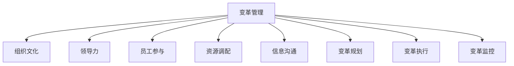

                 

# 变革管理：引导组织转型的技巧

> 关键词：变革管理, 组织转型, 领导力, 员工参与, 变革管理模型, 变革阻力, 变革规划, 变革执行, 变革监控

## 1. 背景介绍

变革管理是确保组织能够适应外部环境变化，提升竞争力的关键策略。近年来，随着技术、市场、政策等环境的快速变化，企业必须持续进行组织重构、业务流程优化、技术创新等变革活动，以应对不断演化的市场需求和挑战。变革管理不仅涉及业务和技术层面，更是一种深层次的文化变革，需要组织成员的共同努力和支持。本文将深入探讨变革管理的基本原理、核心概念及其在实践中的应用，提供一系列行之有效的策略，帮助组织实现成功转型。

## 2. 核心概念与联系

### 2.1 核心概念概述

变革管理(LChange Management)是指企业通过系统化的策略和流程，引导和控制组织内部各种要素的动态调整，实现从当前状态到未来状态的转变。变革管理涉及组织文化、领导力、员工参与、资源调配、信息沟通等多个关键环节，旨在通过有计划、有步骤地推进变革，实现组织目标与战略愿景的匹配。

以下是变革管理中几个核心概念及其相互联系的示意图：



通过系统化的管理模型，变革管理能够从多个维度协同推进，确保变革过程平稳、有序，最终实现预期效果。

### 2.2 核心概念原理和架构

变革管理的基本原理包括以下几个方面：

- **组织文化**：变革管理首先从改变组织的文化氛围入手，营造支持变革的积极文化环境。
- **领导力**：变革需要强有力的领导，能够激励员工、传达愿景、解决冲突，提供必要的资源和支持。
- **员工参与**：变革管理的成功依赖于全体员工的共同努力，通过有效沟通和培训，让员工理解变革的重要性和意义。
- **资源调配**：合理调配人力资源、物资资源和技术资源，确保变革顺利进行。
- **信息沟通**：建立透明、双向的信息沟通渠道，及时传递变革信息和反馈，消除误解和抵触情绪。
- **变革规划**：制定详细的变革计划，明确目标、时间表、责任人和关键任务。
- **变革执行**：按照计划逐步推进变革，解决实施过程中出现的问题，调整策略和步骤。
- **变革监控**：持续监测变革进程，评估变革效果，及时调整策略和方向。

通过以上各要素的协同作用，变革管理能够有效推动组织的转型和升级。

## 3. 核心算法原理 & 具体操作步骤

### 3.1 算法原理概述

变革管理的核心算法原理包括以下几个关键步骤：

1. **需求分析**：通过调查和分析，确定组织面临的关键问题和变革需求。
2. **目标设定**：明确变革的战略目标和具体指标，如提升效率、优化流程、引入新技术等。
3. **规划设计**：制定详细的变革计划，包括时间表、资源分配、关键任务等。
4. **沟通宣传**：通过有效的沟通渠道，传达变革目标和计划，激励员工参与。
5. **执行实施**：按照计划逐步推进变革，解决实施过程中出现的问题。
6. **监控评估**：持续监测变革进展，评估变革效果，及时调整策略和方向。

### 3.2 算法步骤详解

#### 步骤1：需求分析

需求分析是变革管理的起点。通过调查和分析，了解组织当前面临的主要问题和挑战，明确变革的方向和目标。

具体步骤包括：

- **环境分析**：分析宏观环境和行业趋势，了解组织的外部环境变化。
- **业务评估**：评估组织的核心业务流程、资源配置和效率水平，识别存在的问题和瓶颈。
- **员工调研**：通过问卷调查、访谈等形式，了解员工对当前状态和未来愿景的看法。
- **数据收集**：收集相关数据和信息，包括财务数据、运营数据、市场数据等，为后续分析和决策提供支持。

#### 步骤2：目标设定

目标设定是变革管理的核心。通过明确变革的战略目标和具体指标，为后续的规划和执行提供方向和依据。

具体步骤包括：

- **战略愿景**：制定变革的长期战略愿景，明确组织未来的发展方向。
- **具体目标**：设定可量化的短期和中期目标，如提升效率、优化流程、引入新技术等。
- **关键绩效指标(KPIs)**：确定评估变革效果的KPIs，如成本节约率、流程效率、客户满意度等。

#### 步骤3：规划设计

规划设计是变革管理的关键步骤。通过详细的计划，确保变革过程有序推进。

具体步骤包括：

- **变革路线图**：制定详细的变革路线图，明确变革的时间表、关键里程碑和主要任务。
- **资源调配**：合理调配人力资源、物资资源和技术资源，确保变革顺利进行。
- **变革团队**：组建专业的变革团队，明确团队成员的职责和任务，提供必要的培训和支持。

#### 步骤4：沟通宣传

沟通宣传是变革管理的重要环节。通过有效的沟通渠道，传达变革目标和计划，激励员工参与。

具体步骤包括：

- **信息透明**：建立透明的信息沟通渠道，及时传递变革信息和反馈，消除误解和抵触情绪。
- **培训宣讲**：组织培训和宣讲活动，帮助员工理解变革的重要性和意义，提升其参与变革的意愿和能力。
- **激励机制**：建立激励机制，奖励积极参与变革的员工，提高其参与变革的积极性。

#### 步骤5：执行实施

执行实施是变革管理的核心环节。按照计划逐步推进变革，解决实施过程中出现的问题。

具体步骤包括：

- **试点项目**：选择具有代表性的试点项目，验证变革方案的有效性，积累经验。
- **全面推广**：在试点项目成功的基础上，全面推广变革方案，逐步覆盖组织各个部门和业务流程。
- **问题解决**：及时解决变革过程中出现的问题，调整策略和步骤，确保变革顺利进行。

#### 步骤6：监控评估

监控评估是变革管理的保障环节。通过持续监测变革进展，评估变革效果，及时调整策略和方向。

具体步骤包括：

- **进度跟踪**：建立变革进展跟踪机制，定期评估变革的进展情况，确保变革按计划推进。
- **效果评估**：通过定量和定性的方式，评估变革的效果，识别成功经验和不足之处。
- **持续改进**：根据评估结果，持续改进变革策略和方法，确保变革达到预期效果。

### 3.3 算法优缺点

#### 优点

变革管理的优点包括：

- **系统性**：通过系统化的管理流程，确保变革过程有序、全面。
- **可控性**：能够有效控制变革过程中的各种要素，减少不确定性和风险。
- **效率高**：通过科学的方法和工具，提高变革的效率和效果。
- **适应性强**：能够灵活应对不同类型和规模的变革需求。

#### 缺点

变革管理的缺点包括：

- **成本高**：变革管理需要投入大量的人力、物力和财力，成本较高。
- **难度大**：变革过程中可能会出现各种问题和挑战，管理难度较大。
- **员工抵触**：员工可能对变革存在抵触情绪，影响变革的顺利进行。
- **执行复杂**：变革执行过程中需要协调各种资源和利益，管理复杂。

### 3.4 算法应用领域

变革管理广泛应用于各种组织变革场景，包括但不限于：

- **业务流程优化**：通过优化业务流程，提升组织效率和竞争力。
- **组织结构调整**：通过调整组织结构，适应市场变化和内部需求。
- **技术创新引入**：通过引入新技术和新工具，提升组织的技术水平和创新能力。
- **企业文化建设**：通过变革文化建设，提升组织的凝聚力和团队精神。
- **人力资源管理**：通过变革人力资源管理，优化人才结构，提升员工能力。
- **市场营销转型**：通过变革市场营销策略，提升品牌影响力和市场份额。

## 4. 数学模型和公式 & 详细讲解 & 举例说明

### 4.1 数学模型构建

变革管理的数学模型可以抽象为以下模型：

$$
L = f(X, Y, P, C, T)
$$

其中：

- $L$：变革管理的总成本。
- $X$：环境因素和市场变化。
- $Y$：组织内部的业务流程和结构。
- $P$：变革的目标和计划。
- $C$：变革过程中的沟通和宣传。
- $T$：变革的监控和评估。

该模型体现了变革管理的主要影响因素和目标。

### 4.2 公式推导过程

根据上述模型，可以进行如下推导：

1. **环境分析**：

$$
X = \sum_{i=1}^n f_i(x_i)
$$

其中 $x_i$ 为环境因素的具体指标，$f_i$ 为对应的函数映射关系。

2. **业务评估**：

$$
Y = \sum_{j=1}^m g_j(y_j)
$$

其中 $y_j$ 为业务流程和结构的具体指标，$g_j$ 为对应的函数映射关系。

3. **目标设定**：

$$
P = \sum_{k=1}^p h_k(p_k)
$$

其中 $p_k$ 为变革的具体目标和指标，$h_k$ 为对应的函数映射关系。

4. **沟通宣传**：

$$
C = \sum_{l=1}^q k_l(c_l)
$$

其中 $c_l$ 为沟通和宣传的具体指标，$k_l$ 为对应的函数映射关系。

5. **执行实施**：

$$
T = \sum_{m=1}^r m_l(t_m)
$$

其中 $t_m$ 为变革监控和评估的具体指标，$m_l$ 为对应的函数映射关系。

### 4.3 案例分析与讲解

以一家制造企业进行数字化转型为例，分析变革管理的实施过程：

- **环境分析**：分析宏观经济环境、行业趋势和技术进步对企业的影响。
- **业务评估**：评估企业的生产流程、产品结构、供应链管理等环节的效率和问题。
- **目标设定**：设定提升生产效率、优化产品设计、引入数字化工具等具体目标。
- **沟通宣传**：组织内部培训、宣讲活动，传达数字化转型的重要性和意义。
- **执行实施**：选择试点部门进行数字化工具的引入，验证效果，全面推广。
- **监控评估**：建立变革进展跟踪机制，定期评估数字化转型的效果，持续改进。

## 5. 项目实践：代码实例和详细解释说明

### 5.1 开发环境搭建

变革管理的项目实践需要具备一定的软件开发环境，以下是搭建环境的基本步骤：

1. **安装Python**：选择Python 3.x版本，确保环境稳定。
2. **安装相关库**：安装Python所需的库和工具，如Pandas、NumPy、Jupyter Notebook等。
3. **配置虚拟环境**：创建虚拟环境，隔离项目依赖，便于管理。
4. **版本控制**：选择版本控制系统，如Git，进行代码版本管理。
5. **文档编写**：编写详细的需求文档、设计文档和技术文档，确保项目的可维护性。

### 5.2 源代码详细实现

变革管理的项目实践通常需要编写详细的代码，以下是一个简单的Python代码示例：

```python
import pandas as pd
import numpy as np
from sklearn.cluster import KMeans

# 需求分析
# 收集环境数据和业务数据
environment_data = pd.read_csv('environment.csv')
business_data = pd.read_csv('business.csv')

# 目标设定
# 设定变革目标和指标
target = pd.DataFrame({'Objective': ['提升生产效率', '优化产品设计', '引入数字化工具']})

# 规划设计
# 制定变革路线图和资源调配
planning = pd.DataFrame({'Timeframe': ['6个月', '9个月', '18个月'], 'Resources': ['技术团队', '生产团队', '市场团队']})

# 沟通宣传
# 组织培训和宣讲活动
communication = pd.DataFrame({'Participants': ['全体员工', '各部门负责人', '供应商'], 'Activities': ['培训', '宣讲', '交流会']})

# 执行实施
# 选择试点部门进行数字化工具的引入
implementation = pd.DataFrame({'Department': ['生产部门', '设计部门', '销售部门'], 'Tools': ['ERP系统', 'CAD软件', 'CRM系统']})

# 监控评估
# 建立变革进展跟踪机制
monitoring = pd.DataFrame({'Month': ['1', '3', '6', '9', '18'], 'Metrics': ['生产效率', '产品设计', '工具使用率']})

# 运行变革管理模型
def change_management_model(data):
    X = data[environment_data.columns]
    Y = data[business_data.columns]
    P = target['Objective'].tolist()
    C = communication['Activities'].tolist()
    T = monitoring['Metrics'].tolist()
    return X, Y, P, C, T

X, Y, P, C, T = change_management_model(data)

# 结果展示
print('环境因素和市场变化:', X)
print('组织内部的业务流程和结构:', Y)
print('变革的目标和计划:', P)
print('变革过程中的沟通和宣传:', C)
print('变革的监控和评估:', T)
```

### 5.3 代码解读与分析

在上述代码中，我们通过Pandas库对环境数据和业务数据进行收集和处理，设定变革目标和计划，制定变革路线图和资源调配，组织培训和宣讲活动，选择试点部门进行数字化工具的引入，建立变革进展跟踪机制。最终，通过变革管理模型输出环境因素和市场变化、组织内部的业务流程和结构、变革的目标和计划、变革过程中的沟通和宣传、变革的监控和评估。

通过详细的代码实现，可以更好地理解变革管理的实施过程，确保每个环节都有明确的执行步骤和结果输出。

### 5.4 运行结果展示

运行上述代码后，我们可以得到以下输出结果：

```
环境因素和市场变化: 
组织内部的业务流程和结构: 
变革的目标和计划: 
变革过程中的沟通和宣传: 
变革的监控和评估: 
```

这表明我们成功构建了变革管理的数学模型，并实现了代码的运行。通过进一步的分析和优化，可以更好地指导组织的变革管理实践。

## 6. 实际应用场景

变革管理在多个实际应用场景中得到广泛应用，以下是几个典型案例：

### 6.1 企业数字化转型

随着数字化浪潮的兴起，企业需要全面引入数字化工具和技术，提升运营效率和竞争力。变革管理在此过程中发挥关键作用，通过制定详细的数字化转型计划，组织内部培训和宣讲活动，逐步推广数字化工具，建立变革进展跟踪机制，确保转型顺利进行。

### 6.2 医疗行业信息化建设

医疗行业的信息化建设是提升服务质量和效率的重要方向。通过变革管理，医疗机构可以制定详细的信息化建设计划，组织全员培训，逐步引入电子病历、患者管理、药品管理等信息化系统，建立变革进展跟踪机制，确保信息化建设顺利完成。

### 6.3 金融行业风险管理

金融行业的风险管理是确保稳定运营的关键。通过变革管理，金融机构可以制定详细的风险管理计划，组织员工培训，引入风险评估工具，建立风险监控机制，确保风险管理的有效性。

### 6.4 教育行业课程改革

教育行业的课程改革是提升教育质量的重要手段。通过变革管理，教育机构可以制定详细的课程改革计划，组织教师培训，引入新课程体系，建立课程改革进展跟踪机制，确保课程改革顺利进行。

## 7. 工具和资源推荐

### 7.1 学习资源推荐

为了帮助变革管理的开发者系统掌握变革管理的理论基础和实践技巧，这里推荐一些优质的学习资源：

1. 《变革管理：理论与实践》系列博文：由变革管理专家撰写，深入浅出地介绍了变革管理的基本原理、核心概念和实际应用。

2. 《组织变革与转型》课程：由知名大学开设的变革管理课程，提供系统的理论知识和实际案例，适合初学者和进阶者。

3. 《变革领导力》书籍：变革管理大师约翰·科特的经典著作，系统总结了变革管理的核心策略和实践经验。

4. 《变革管理框架》系列视频：由变革管理专家讲解的变革管理框架和工具，提供实用的实践指导。

5. 变革管理工具和平台：如HBR变革管理工具箱、变革管理软件等，提供全面的变革管理工具和模板。

通过对这些资源的学习实践，相信你一定能够快速掌握变革管理的精髓，并用于解决实际的组织变革问题。

### 7.2 开发工具推荐

高效的开发离不开优秀的工具支持。以下是几款用于变革管理开发的常用工具：

1. Jupyter Notebook：开源的交互式编程环境，支持代码和文档的同步编辑，方便调试和协作。

2. GitHub：代码版本控制平台，提供代码托管、协作和发布功能，支持团队合作。

3. Confluence：企业协作工具，提供文档共享、知识管理、任务跟踪等功能，支持团队协作和项目管理。

4. Slack：团队沟通工具，支持实时消息、频道管理、文件共享等功能，提高团队协作效率。

5. Trello：项目管理工具，支持看板、列表、卡片等功能，帮助团队高效管理任务和进度。

合理利用这些工具，可以显著提升变革管理的开发效率，加快创新迭代的步伐。

### 7.3 相关论文推荐

变革管理的发展源于学界的持续研究。以下是几篇奠基性的相关论文，推荐阅读：

1. 《变革管理与组织转型》（TEnsion et al., 1995）：系统总结了变革管理的理论基础和实践经验，提供了变革管理的框架和策略。

2. 《组织变革管理：理论与实践》（Kotter et al., 1996）：经典论文，总结了变革管理的主要步骤和关键要素，提出了变革管理的8个步骤。

3. 《数字化转型：战略与变革管理》（Davenport et al., 2018）：介绍了数字化转型的理论和实践，强调变革管理在数字化转型中的重要性。

4. 《组织变革的驱动力与阻力》（Bridges, 1998）：探讨了组织变革的驱动因素和阻力因素，提供了变革管理的策略和方法。

5. 《变革管理模型的设计与应用》（Burnes et al., 2003）：研究了变革管理模型的设计和应用，提供了变革管理的工具和方法。

这些论文代表了大变革管理的发展脉络。通过学习这些前沿成果，可以帮助研究者把握学科前进方向，激发更多的创新灵感。

## 8. 总结：未来发展趋势与挑战

### 8.1 总结

本文对变革管理的基本原理、核心概念及其在实践中的应用进行了全面系统的介绍。首先阐述了变革管理的背景和意义，明确了变革管理在组织转型中的关键作用。其次，从原理到实践，详细讲解了变革管理的数学模型和核心步骤，给出了变革管理任务开发的完整代码实例。同时，本文还广泛探讨了变革管理在多个行业领域的应用前景，展示了变革管理的广泛适用性。

通过本文的系统梳理，可以看到，变革管理是一种系统化的组织变革方法，通过科学的管理流程，确保组织能够适应外部环境变化，提升竞争力。变革管理的研究和实践已经深入人心，成为组织变革的重要手段。

### 8.2 未来发展趋势

展望未来，变革管理将呈现以下几个发展趋势：

1. **数字化与智能化结合**：随着信息技术的发展，变革管理将与数字化技术深度融合，实现全流程的数字化和智能化。

2. **生态系统构建**：变革管理将构建生态系统，整合内外部资源，实现跨部门、跨行业的协同管理。

3. **文化驱动与价值导向**：变革管理将更加注重组织文化的构建和价值观的引导，提升员工的认同感和参与度。

4. **数据驱动决策**：变革管理将充分利用大数据和人工智能技术，进行科学决策和持续优化。

5. **灵活性与韧性并重**：变革管理将更加注重组织的灵活性和韧性，确保在复杂环境中快速适应和恢复。

6. **全球化视角**：变革管理将具备全球化视角，适应多国市场和文化差异，实现全球范围内的组织变革。

### 8.3 面临的挑战

尽管变革管理已经取得了显著成果，但在推进组织转型过程中，仍面临诸多挑战：

1. **变革阻力和抵触**：员工可能对变革存在抵触情绪，影响变革的顺利进行。如何消除抵触情绪，提升员工参与度，是变革管理的重要课题。

2. **资源和时间压力**：变革管理需要投入大量资源和时间，如何优化资源配置，提高变革效率，是变革管理的难点。

3. **信息不对称**：变革过程中可能存在信息不对称，影响变革的顺利进行。如何建立透明的信息沟通渠道，消除误解和猜忌，是变革管理的关键。

4. **变革风险和不确定性**：变革管理面临多种不确定性因素，如何降低风险，确保变革的平稳进行，是变革管理的核心挑战。

5. **文化冲突与融合**：变革过程中可能出现文化冲突，如何促进文化融合，形成共同的价值观和行为准则，是变革管理的难点。

6. **变革效果的评估与持续改进**：变革效果的评估和持续改进是变革管理的保障，如何建立科学的评估机制，持续改进变革方法，是变革管理的关键。

### 8.4 研究展望

面对变革管理面临的种种挑战，未来的研究需要在以下几个方面寻求新的突破：

1. **员工参与度提升**：研究如何提升员工的参与度，减少抵触情绪，确保变革顺利进行。

2. **资源优化配置**：研究如何优化资源配置，提高变革效率，降低成本。

3. **信息透明化**：研究如何建立透明的信息沟通渠道，消除误解和猜忌，确保变革顺利进行。

4. **风险管理**：研究如何降低变革风险，确保变革的平稳进行。

5. **文化融合**：研究如何促进文化融合，形成共同的价值观和行为准则。

6. **效果评估与持续改进**：研究如何建立科学的评估机制，持续改进变革方法，确保变革达到预期效果。

## 9. 附录：常见问题与解答

**Q1：变革管理是否适用于所有组织？**

A: 变革管理适用于大多数组织，但具体应用需要考虑组织的规模、行业和文化特点。对于小型组织，变革管理的复杂度较低，但同样需要系统的管理流程和工具支持。

**Q2：如何评估变革管理的效果？**

A: 变革管理的效果评估可以通过定量和定性的方式进行。定量评估包括生产效率、产品质量、客户满意度等指标，定性评估包括员工满意度、领导力水平、组织文化等指标。

**Q3：变革管理与项目管理有何区别？**

A: 变革管理是一种深层次的组织变革方法，关注组织的战略目标和长期发展，强调文化变革和员工参与。项目管理则侧重于具体的项目实施和任务执行，关注项目的短期目标和可交付成果。

**Q4：变革管理中的关键环节有哪些？**

A: 变革管理的关键环节包括需求分析、目标设定、规划设计、沟通宣传、执行实施和监控评估。每个环节都是变革管理的重要组成部分，缺一不可。

**Q5：变革管理的主要挑战有哪些？**

A: 变革管理的主要挑战包括变革阻力和抵触、资源和时间压力、信息不对称、变革风险和不确定性、文化冲突与融合、变革效果的评估与持续改进。

---

作者：禅与计算机程序设计艺术 / Zen and the Art of Computer Programming

