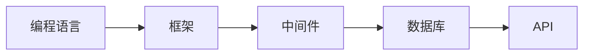

                 

# 后端开发：服务器端编程语言与框架

## 1. 背景介绍

### 1.1 问题由来
在现代软件工程中，后端开发已经成为了系统实现的核心环节之一。后端服务器端程序负责处理各种复杂的逻辑运算、数据库操作、网络通信、数据存储等任务。随着互联网和移动设备的普及，后端系统的负载和复杂度日益增加，开发者对高效、稳定、可扩展的后端框架和编程语言的需求也随之提高。本文将探讨后端开发中常用的几种服务器端编程语言与框架，通过对比分析其特点与适用场景，为开发者提供选择依据。

### 1.2 问题核心关键点
后端开发的成功与否，往往取决于选择合适的编程语言与框架。一个好的框架能够提供成熟的工具库、性能优化、可维护性保证等特性，使开发效率大大提升。编程语言则决定了一个框架的功能与扩展性，直接影响开发者的编码习惯和代码质量。

## 2. 核心概念与联系

### 2.1 核心概念概述
本节将介绍几个后端开发中常用的核心概念，帮助读者理解其相互关系。

- **编程语言（Programming Language）**：后端开发中使用的高级编程语言，用于定义算法、数据结构和程序逻辑。常见的后端语言包括Python、Java、C++、Ruby等。
- **框架（Framework）**：用于组织和管理代码的软件架构，提供了一系列的类、库和工具，简化开发工作并提升代码复用性。
- **中间件（Middleware）**：在应用层与底层之间起到桥梁作用的软件，提供诸如安全、数据缓存、消息队列等常见服务。
- **数据库（Database）**：用于存储和查询数据的系统，支持各种数据结构和查询语言。
- **API（Application Programming Interface）**：应用程序接口，用于不同软件系统之间的通信。

### 2.2 核心概念原理和架构的 Mermaid 流程图



这个流程图展示了后端开发中各个核心概念之间的联系。编程语言通过框架进行组织和管理，框架则通过中间件实现与数据库和API的通信，从而构成了完整的后端系统。

## 3. 核心算法原理 & 具体操作步骤

### 3.1 算法原理概述
后端开发的算法原理主要围绕数据处理和逻辑计算展开。算法分为两个部分：前端算法和后端算法。前端算法负责数据的输入、处理和输出，而后端算法则负责数据的存储、检索和处理。

### 3.2 算法步骤详解
后端开发的基本步骤如下：

1. **需求分析**：根据需求确定功能模块，设计数据模型。
2. **环境搭建**：配置开发环境和测试环境，安装所需的依赖库和中间件。
3. **编码实现**：根据设计文档编写代码，实现业务逻辑。
4. **测试部署**：对代码进行单元测试和集成测试，确保功能正确性。
5. **性能优化**：分析性能瓶颈，进行代码优化和硬件升级。
6. **维护更新**：根据业务需求变化，进行功能升级和性能优化。

### 3.3 算法优缺点
每种编程语言与框架都有其优缺点，具体如下：

- **Python**：优点是易于学习，代码简洁，有丰富的第三方库。缺点是性能较低，不适合对性能要求极高的应用。
- **Java**：优点是性能优异，跨平台性好，适合企业级应用。缺点是语法复杂，学习曲线陡峭。
- **C++**：优点是性能最高，适合对性能要求极高的应用。缺点是开发效率较低，代码复杂。
- **Ruby**：优点是代码简洁，开发效率高。缺点是性能较低，不适合对性能要求极高的应用。

### 3.4 算法应用领域
不同的编程语言与框架适用于不同的应用场景。例如：

- **Python**：适用于数据科学、机器学习、Web应用、自动化脚本等。
- **Java**：适用于企业级应用、大型系统、移动应用后端开发等。
- **C++**：适用于高性能计算、游戏开发、嵌入式系统等。
- **Ruby**：适用于Web应用、快速原型开发等。

## 4. 数学模型和公式 & 详细讲解 & 举例说明

### 4.1 数学模型构建
后端开发中的数学模型主要涉及算法的设计与实现。以排序算法为例，常见的排序算法包括冒泡排序、选择排序、插入排序、快速排序等。以快速排序为例，其基本思想是通过递归将待排序序列分成两部分，一部分小于基准值，一部分大于基准值，再对这两部分分别进行排序。

### 4.2 公式推导过程
以快速排序为例，其公式推导如下：

$$
\text{Quick Sort}(a, p, r) = 
\begin{cases} 
a[p] & \text{if } p = r \\
\text{Quick Sort}(a, p, q) + \text{Quick Sort}(a, q+1, r) & \text{otherwise} 
\end{cases}
$$

其中，$a$ 表示待排序数组，$p$ 和 $r$ 分别表示子序列的左右边界，$q$ 表示基准值的索引。

### 4.3 案例分析与讲解
快速排序的具体实现如下：

```python
def quick_sort(arr, low, high):
    if low < high:
        pivot = partition(arr, low, high)
        quick_sort(arr, low, pivot - 1)
        quick_sort(arr, pivot + 1, high)
    return arr

def partition(arr, low, high):
    pivot = arr[high]
    i = low - 1
    for j in range(low, high):
        if arr[j] < pivot:
            i += 1
            arr[i], arr[j] = arr[j], arr[i]
    arr[i + 1], arr[high] = arr[high], arr[i + 1]
    return i + 1
```

## 5. 项目实践：代码实例和详细解释说明

### 5.1 开发环境搭建
在后端开发中，常用的开发环境包括IDE（如PyCharm、Eclipse、Visual Studio等）、版本控制系统（如Git）和云服务（如AWS、Azure等）。这里以Python开发为例，搭建开发环境的步骤如下：

1. **安装IDE**：下载并安装PyCharm，配置Python版本和项目路径。
2. **配置版本控制**：在PyCharm中安装Git插件，配置本地仓库和远程仓库。
3. **选择云服务**：根据项目需求选择合适的云服务，进行环境搭建和资源配置。

### 5.2 源代码详细实现
以一个简单的Web应用为例，其代码实现如下：

```python
from flask import Flask, request, jsonify

app = Flask(__name__)

@app.route('/hello', methods=['GET'])
def hello():
    name = request.args.get('name')
    return jsonify({'message': f'Hello, {name}'})

if __name__ == '__main__':
    app.run(debug=True)
```

### 5.3 代码解读与分析
上述代码实现了使用Flask框架构建一个简单的Web应用，通过GET请求接收参数，返回JSON格式的响应。Flask是一个轻量级的Web框架，易于学习和使用。

### 5.4 运行结果展示
运行上述代码，可以通过浏览器访问`http://localhost:5000/hello?name=John`，得到响应`{'message': 'Hello, John'}`。

## 6. 实际应用场景

### 6.1 互联网应用
后端开发在互联网应用中扮演着重要角色，负责处理用户请求、数据存储、后台逻辑等。例如，电商平台的订单管理、社交网络的动态发布、在线游戏的服务器端逻辑等。

### 6.2 企业系统
企业系统通常需要处理大规模数据和复杂逻辑，后端开发需要保证系统的稳定性和可扩展性。例如，ERP系统、CRM系统、供应链管理系统等。

### 6.3 移动应用后端
移动应用的后端开发需要实现与前端客户端的通信，处理用户请求，存储和检索数据等。例如，微信后端、支付宝后端、滴滴出行后端等。

### 6.4 未来应用展望
未来，随着物联网、人工智能等技术的不断发展，后端开发将面临更多的挑战和机遇。例如，实时数据处理、边缘计算、自动驾驶等都需要强大的后端支持。

## 7. 工具和资源推荐

### 7.1 学习资源推荐
为了帮助开发者系统掌握后端开发技术，以下是几个推荐的学习资源：

1. **Flask官方文档**：Flask的官方文档提供了详细的教程和API文档，是学习Flask框架的最佳途径。
2. **Django官方文档**：Django是另一个流行的Web框架，其官方文档详细介绍了如何使用Django进行Web应用开发。
3. **Spring官方文档**：Spring是Java开发中最流行的框架之一，其官方文档详细介绍了Spring框架的使用方法。
4. **Udemy Flask课程**：Udemy上的Flask课程提供了系统全面的Flask开发教程。
5. **Coursera Django课程**：Coursera上的Django课程由知名大学教授讲授，内容深入浅出，适合初学者。

### 7.2 开发工具推荐
以下几款工具是后端开发中常用的开发工具：

1. **PyCharm**：PyCharm是一个Python开发环境，提供了丰富的功能和插件，适合Python开发。
2. **Eclipse**：Eclipse是一个Java开发环境，提供了强大的IDE和插件支持。
3. **Visual Studio**：Visual Studio是一个综合性的开发环境，支持多种编程语言和平台。
4. **Git**：Git是一个版本控制系统，适用于代码管理和协作开发。
5. **AWS**：AWS是亚马逊云服务，提供了强大的云资源和开发环境。

### 7.3 相关论文推荐
以下是几篇影响深远的后端开发相关论文：

1. **Programming Language Design and Implementation**：描述了语言设计的基本原则和方法，对编程语言的设计与实现具有指导意义。
2. **Software Architecture Design Patterns**：介绍了常见的软件架构设计模式，适用于指导大型系统的设计。
3. **Middleware Systems**：详细介绍了中间件系统的设计和实现方法，适用于处理复杂的网络通信和数据交互。
4. **Databases in High Performance Computing**：描述了数据库在高性能计算中的应用，适用于大规模数据处理。

## 8. 总结：未来发展趋势与挑战

### 8.1 研究成果总结
后端开发领域的技术不断进步，编程语言和框架也在不断演进。当前流行的后端开发语言包括Python、Java、C++等，流行的框架包括Flask、Django、Spring等。

### 8.2 未来发展趋势
未来，后端开发将面临更多的挑战和机遇，主要包括：

- **跨平台开发**：随着移动设备的普及，跨平台开发成为趋势。
- **微服务架构**：微服务架构是未来系统架构的重要方向，能够提高系统的可维护性和可扩展性。
- **容器化技术**：容器化技术如Docker、Kubernetes等，能够提高系统的部署和管理效率。

### 8.3 面临的挑战
后端开发在发展过程中，面临的挑战主要包括：

- **性能优化**：后端系统通常需要处理大量数据和复杂逻辑，性能优化是关键。
- **安全性和稳定性**：后端系统需要保证数据的安全性和系统的稳定性，防止黑客攻击和数据泄露。
- **可维护性**：后端系统的代码需要易于维护和更新，避免出现“技术债”。

### 8.4 研究展望
未来，后端开发需要不断探索新技术和方法，主要包括：

- **云计算和边缘计算**：云计算和边缘计算将为后端开发提供更强大的计算和存储资源。
- **人工智能和大数据**：人工智能和大数据技术将为后端开发带来更多的应用场景和数据处理能力。
- **自动化和智能化**：自动化和智能化技术将提高后端开发的效率和准确性。

## 9. 附录：常见问题与解答

**Q1：后端开发中的编程语言和框架有什么区别？**

A: 编程语言是一种工具，用于定义算法和数据结构，而框架是一个软件架构，提供了类、库和工具，用于组织和管理代码。

**Q2：如何选择适合后端开发的主流编程语言？**

A: 选择编程语言需要考虑多个因素，包括项目的规模、技术栈、开发效率、性能需求等。例如，小型项目可以选择Python，大型系统可以选择Java或C++。

**Q3：后端开发中的性能优化有哪些方法？**

A: 性能优化可以从多个方面入手，包括代码优化、算法优化、硬件升级等。例如，使用缓存技术、减少数据库查询次数、使用并发处理等。

**Q4：后端开发中的安全性有哪些保障措施？**

A: 后端开发中的安全性保障措施包括数据加密、访问控制、异常处理等。例如，使用HTTPS协议、设置访问权限、记录异常日志等。

**Q5：后端开发中常用的框架有哪些？**

A: 常用的后端框架包括Python的Flask、Django、Java的Spring等。选择框架需要考虑项目需求和开发习惯。

---

作者：禅与计算机程序设计艺术 / Zen and the Art of Computer Programming

