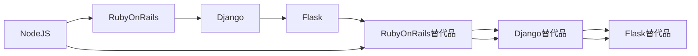

                 

# 后端框架探索：Node.js 之外的选择

> 关键词：后端框架, Node.js, Ruby on Rails, Django, Flask, Node.js 替代品, Ruby on Rails 替代品, Django 替代品, Flask 替代品

## 1. 背景介绍

在当今的Web开发领域，JavaScript生态系统通过Node.js的崛起，占据了极其重要的位置。但随着技术的发展和社区的成熟，越来越多的开发者开始探索使用其他语言和技术栈来构建后端服务，以应对不同类型的项目需求。本文将深入探讨Node.js之外的主要后端框架，并对比它们的优缺点，以便开发者在选择时做出明智的决定。

## 2. 核心概念与联系

### 2.1 核心概念概述

1. **后端框架**：后端框架是用于开发Web应用后端服务的工具集合，通常包括路由、模板引擎、ORM（对象关系映射）、中间件、API、数据处理等组件。它们简化了开发过程，加快了开发速度，并提供了可维护性和可扩展性的基础。

2. **Node.js**：Node.js是一个基于JavaScript运行时环境，允许开发者使用JavaScript编写服务器端代码，构建高性能、非阻塞式的Web应用。

3. **Ruby on Rails**：Ruby on Rails是一个使用Ruby语言开发的Web应用框架，采用约定优于配置（Convention over Configuration）的设计哲学，以快速开发Web应用为目的。

4. **Django**：Django是一个使用Python语言编写的高级Web框架，提供了一系列内置的工具和功能，以支持快速开发高质量的Web应用。

5. **Flask**：Flask是一个轻量级的Python Web应用框架，适合构建小型到中等规模的Web应用，以最小化的依赖和更灵活的扩展性著称。

6. **替代品**：替代品指的是能够提供与Node.js、Ruby on Rails、Django和Flask类似功能，但使用不同语言和技术栈的Web框架。

### 2.2 核心概念原理和架构的 Mermaid 流程图



这个流程图展示了不同Web框架之间的相互替代关系，以及它们在不同技术栈之间的映射。

## 3. 核心算法原理 & 具体操作步骤

### 3.1 算法原理概述

后端框架的核心算法原理通常基于MVC（模型-视图-控制器）架构，旨在将应用程序的逻辑分离为数据模型、用户界面和控制逻辑。这种分离使得代码更加模块化、易于维护和扩展。

### 3.2 算法步骤详解

以下是一些主流后端框架的基本步骤：

1. **安装和配置**：安装所需的后端框架及其依赖，配置数据库、缓存、日志等基础功能。
2. **定义路由**：设置路由规则，指定URL与控制器方法之间的映射。
3. **创建模型和视图**：构建数据模型和视图，用于处理数据和展示用户界面。
4. **实现控制器逻辑**：编写控制器方法，处理用户请求，并调用模型和视图进行数据处理和响应。
5. **配置中间件和插件**：根据需要配置中间件和插件，添加额外的功能如身份验证、缓存、压缩等。
6. **测试和部署**：编写单元测试和集成测试，确保应用程序的稳定性，然后将应用程序部署到服务器。

### 3.3 算法优缺点

| 后端框架 | 优点 | 缺点 |
|---|---|---|
| Node.js | 异步非阻塞I/O模型 | 单线程模型可能导致事件处理复杂，调试困难 |
| Ruby on Rails | 约定优于配置，快速开发 | 性能瓶颈在Ruby解释器 |
| Django | 全面功能集，减少代码量 | 需要配置和遵循严格的规则 |
| Flask | 轻量级，低依赖 | 不适合大项目，功能较弱 |

### 3.4 算法应用领域

后端框架适用于各种规模和类型的Web应用，包括但不限于：

- 电子商务
- 社交网络
- 内容管理系统（CMS）
- 博客和论坛
- API开发
- 数据库管理系统
- 物联网（IoT）应用

## 4. 数学模型和公式 & 详细讲解 & 举例说明

### 4.1 数学模型构建

以Node.js为例，我们可以使用简单的数学模型来描述其非阻塞I/O模型：

\[ \text{I/O操作时间} = \text{操作完成时间} + \text{请求队列长度} \times \text{操作延迟时间} \]

其中，操作完成时间指完成I/O操作所需的时间，操作延迟时间指队列中等待执行的请求数乘以平均等待时间。

### 4.2 公式推导过程

假设有一个请求队列长度为$n$，每个I/O操作需要$t$秒完成，平均等待时间为$\frac{1}{2}$秒。则I/O操作时间公式变为：

\[ \text{I/O操作时间} = n \times t + \frac{n}{2} \times \frac{t}{2} \]

推导结果表明，I/O操作时间与请求队列长度成正比，因此Node.js的非阻塞I/O模型可以有效地处理并发请求，提高应用程序的响应速度。

### 4.3 案例分析与讲解

以Flask为例，Flask的简单模型可以表示为：

\[ \text{处理请求时间} = \text{路由匹配时间} + \text{视图渲染时间} + \text{控制器逻辑时间} \]

其中，路由匹配时间为找到请求对应的视图所花费的时间，视图渲染时间为生成HTML页面所需的时间，控制器逻辑时间为处理请求并生成响应所花费的时间。

## 5. 项目实践：代码实例和详细解释说明

### 5.1 开发环境搭建

1. **安装Node.js和npm**：
```bash
sudo apt-get update
sudo apt-get install nodejs
```

2. **安装Ruby和Rails**：
```bash
sudo apt-get install ruby-full
gem install rails
```

3. **安装Django**：
```bash
pip install django
```

4. **安装Flask**：
```bash
pip install flask
```

### 5.2 源代码详细实现

以下是一个简单的Node.js服务器和Ruby on Rails应用的实现：

**Node.js服务器示例**：
```javascript
const http = require('http');
const url = require('url');

const server = http.createServer((req, res) => {
  const parsedUrl = url.parse(req.url, true);
  if (req.method === 'GET' && parsedUrl.pathname === '/') {
    res.writeHead(200, {'Content-Type': 'text/plain'});
    res.end('Hello World!');
  } else {
    res.writeHead(404, {'Content-Type': 'text/plain'});
    res.end('404 Not Found');
  }
});

server.listen(3000, () => {
  console.log('Server running on port 3000');
});
```

**Ruby on Rails示例**：
```ruby
class HelloWorldController < ApplicationController
  def index
    @message = "Hello World!"
  end
end

Rails.application.routes.draw do
  get 'index'
end
```

### 5.3 代码解读与分析

**Node.js服务器**：
- 使用`http`模块创建HTTP服务器。
- 解析URL并根据请求方法处理请求，返回不同响应。
- 监听端口3000并输出日志。

**Ruby on Rails示例**：
- 定义一个控制器，包含`index`方法，用于渲染视图。
- 设置路由规则，映射`index`方法到根路径。
- 使用Rails的模板引擎渲染视图，输出“Hello World!”。

### 5.4 运行结果展示

- **Node.js服务器**：启动后访问`http://localhost:3000`，看到“Hello World!”。
- **Ruby on Rails示例**：启动后访问`http://localhost:3000`，看到“Hello World!”。

## 6. 实际应用场景

### 6.1 电子商务

Node.js适合处理高并发和大数据量的请求，可以构建高性能的电子商务平台，如亚马逊的AWS Lambda。

### 6.2 社交网络

Ruby on Rails具有快速开发的能力，适合构建具有复杂业务逻辑和用户关系的社交网络应用，如Facebook。

### 6.3 内容管理系统（CMS）

Django提供了强大的ORM和模板引擎，适合构建复杂且需要频繁数据访问的CMS应用，如WordPress。

### 6.4 博客和论坛

Flask轻量级、低依赖，适合构建中小型的博客和论坛应用，如Stack Overflow。

## 7. 工具和资源推荐

### 7.1 学习资源推荐

1. **《JavaScript高级程序设计》**：由Nicholas C. Zakas所著，深入介绍了JavaScript编程技巧和最佳实践。
2. **《Ruby on Rails实战》**：由Sam Ruby和David Heinemeier Hansson所著，介绍了Ruby on Rails框架的使用方法和实践经验。
3. **《Django实战》**：由Marko Fedorkovic和Brad M polite所著，详细介绍了Django框架的构建和使用。
4. **《Flask Web开发》**：由Mitsuhiko所著，介绍了Flask框架的基本使用方法和进阶技巧。

### 7.2 开发工具推荐

1. **Visual Studio Code**：一个轻量级的代码编辑器，支持多种编程语言和扩展。
2. **Git**：版本控制系统，方便团队协作和代码管理。
3. **Docker**：容器化技术，确保应用程序在不同环境中的稳定性。

### 7.3 相关论文推荐

1. **《Node.js的设计哲学》**：探讨Node.js的核心设计思想和架构。
2. **《Ruby on Rails的约定优于配置》**：详细介绍了Ruby on Rails的设计理念和最佳实践。
3. **《Django的高级功能》**：介绍了Django的高级功能和最佳实践。
4. **《Flask的轻量级设计》**：探讨Flask的轻量级设计理念和优化技巧。

## 8. 总结：未来发展趋势与挑战

### 8.1 研究成果总结

后端框架在Web开发中扮演着至关重要的角色，通过对比和选择不同的框架，开发者可以更高效地构建和维护Web应用。Node.js、Ruby on Rails、Django和Flask各具优势，适用于不同类型的项目。

### 8.2 未来发展趋势

未来后端框架将朝着以下方向发展：

1. **性能优化**：提高框架的性能和响应速度，以适应日益增长的Web流量和数据量。
2. **跨平台支持**：支持更多平台和设备，提供更广泛的开发环境。
3. **微服务架构**：采用微服务架构，提高应用程序的可扩展性和可维护性。
4. **自动化部署**：提供自动化部署和运维工具，简化开发和运维流程。

### 8.3 面临的挑战

尽管后端框架带来了许多便利，但也面临一些挑战：

1. **性能瓶颈**：如何平衡性能和可维护性，避免过度优化导致的代码复杂性。
2. **安全性**：防范常见攻击，如SQL注入、跨站脚本（XSS）等。
3. **可扩展性**：框架需要支持大规模和高并发的应用，保证性能稳定。
4. **社区支持**：选择一个有活跃社区和广泛生态的框架，有助于解决问题和获取资源。

### 8.4 研究展望

未来的研究将集中在以下方面：

1. **性能优化**：进一步优化框架性能，提供更高效的数据处理和响应机制。
2. **自动化工具**：开发自动化测试、部署和运维工具，提升开发效率和质量。
3. **跨语言集成**：支持更多编程语言和框架的集成，实现跨语言开发和协作。
4. **新兴技术**：探索新兴技术和架构，如区块链、人工智能等，以增强应用功能。

## 9. 附录：常见问题与解答

### Q1: 什么是后端框架？

A: 后端框架是用于开发Web应用后端服务的工具集合，通常包括路由、模板引擎、ORM、中间件、API、数据处理等组件。

### Q2: Node.js的优缺点是什么？

A: 优点包括异步非阻塞I/O模型，处理高并发和大数据量请求能力强。缺点包括单线程模型可能导致事件处理复杂，调试困难。

### Q3: 什么是约定优于配置？

A: 约定优于配置是Ruby on Rails的设计理念，通过预设一些约定，减少开发者的配置量，提高开发效率。

### Q4: Django的优缺点是什么？

A: 优点包括全面功能集，减少代码量。缺点包括需要配置和遵循严格的规则，学习曲线较陡峭。

### Q5: Flask的特点是什么？

A: Flask的特点包括轻量级、低依赖，适合构建小型到中等规模的Web应用。

---

作者：禅与计算机程序设计艺术 / Zen and the Art of Computer Programming

