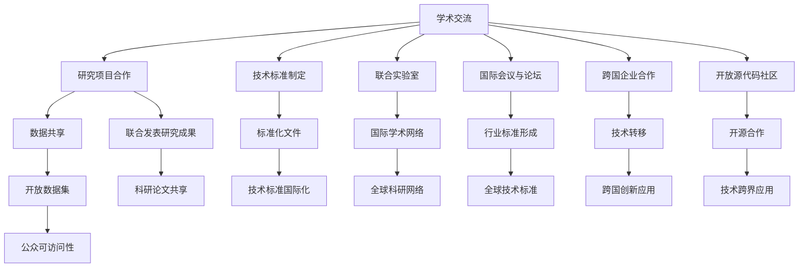

                 

## 1. 背景介绍

在全球化和数字化的双重驱动下，计算机科学与技术正逐步演变成一个全球性的跨学科领域。计算领域的发展不仅依赖于单个国家或机构的努力，更需要全球范围内的紧密合作与协同创新。本文旨在探讨国际合作在推动人类计算领域进步中的重要作用，分析其必要性、模式和挑战，并提供未来发展的战略思考。

## 2. 核心概念与联系

### 2.1 核心概念概述

国际合作是指不同国家、地区、机构之间的合作与交流，共同致力于解决复杂问题，推进科技进步。在计算机科学领域，国际合作具有多个层面，包括学术交流、研究项目合作、数据共享、技术标准制定等。这些合作模式不仅促进了技术创新，还推动了科学知识的传播与积累。

### 2.2 核心概念原理和架构的 Mermaid 流程图



## 3. 核心算法原理 & 具体操作步骤

### 3.1 算法原理概述

计算领域的国际合作基于共同的研究目标和挑战，通过信息共享、技术交流、资源整合等手段，实现科技创新与应用的协同进步。

### 3.2 算法步骤详解

1. **确定合作目标**：
   - 明确合作方向，如研究前沿技术、解决特定问题、推动标准制定等。
   - 根据目标选择合作对象，可以是研究机构、公司、学术团体等。

2. **构建合作框架**：
   - 签订合作协议，明确各方的权利与义务。
   - 设立联合项目组，确定研究主题和分工。

3. **信息共享与交流**：
   - 建立合作平台，进行数据、论文、代码等信息的共享。
   - 定期举行会议、研讨会等，交流研究进展和发现。

4. **资源整合与协同研发**：
   - 整合各方的技术资源，如人才、资金、设备等，进行联合研发。
   - 共享研发成果，如论文、专利、技术报告等。

5. **技术标准与推广**：
   - 制定国际技术标准，提升技术规范化和统一化。
   - 推广标准，确保其在全球范围内的应用和普及。

### 3.3 算法优缺点

#### 优点

1. **资源共享**：通过合作，可以共享各方的数据、设备、人才等资源，加快研发进度。
2. **知识传播**：国际合作促进了科学知识的全球传播，加速了科学前沿的突破。
3. **技术标准化**：合作有助于制定和推广技术标准，提升技术的国际互认度。
4. **共同应对挑战**：面对复杂的技术问题，多方的合作可以更有效地解决问题。

#### 缺点

1. **文化差异**：不同国家的研究文化和管理模式可能存在差异，影响合作的协调性。
2. **知识产权争议**：国际合作中可能涉及知识产权问题，处理不当可能导致争议。
3. **沟通成本**：跨国的信息交流和协调增加了沟通成本和时间成本。
4. **资源冲突**：各方资源整合可能面临利益分配问题，影响合作的积极性。

### 3.4 算法应用领域

国际合作在计算机科学领域的多个方向得到了广泛应用：

- **人工智能**：在AI领域，多国研究团队共同推进深度学习、自然语言处理等前沿技术的发展。
- **量子计算**：各国研究机构和企业合作研发量子计算设备，推动量子技术的突破。
- **云计算**：跨国企业如亚马逊、谷歌、微软等在云计算领域进行深度合作，优化云服务性能。
- **网络安全**：国际机构和国家合作应对网络攻击和信息安全挑战，提升全球网络安全水平。
- **数据科学**：通过数据共享和联合分析，提升大数据处理和分析的国际竞争力。

## 4. 数学模型和公式 & 详细讲解 & 举例说明

### 4.1 数学模型构建

设国际合作项目涉及n个国家或机构，每个国家或机构的科研能力为Xi，合作的协同效应为Y。则数学模型可表示为：

$$Y = \sum_{i=1}^{n} f(X_i)$$

其中，f为表示协同效应的函数。

### 4.2 公式推导过程

1. **数据共享模型**：
   - 假设每个国家的原始数据量为Di，共享后总数据量为Ds，共享比例为k。
   - 则有 $D_s = \sum_{i=1}^{n} (1-k)D_i + kD_i$。

2. **知识传播模型**：
   - 设每个国家的知识传播速度为vi，传播速度为v。
   - 则有 $v = \sum_{i=1}^{n} \frac{v_i}{\sum_{j=1}^{n} v_j}$。

3. **技术标准模型**：
   - 设每个国家的技术标准影响力为Si，标准化的国际影响力为S。
   - 则有 $S = \sum_{i=1}^{n} S_i$。

### 4.3 案例分析与讲解

以人工智能领域的深度学习为例：

- **合作目标**：提升深度学习模型的准确率和泛化能力。
- **参与方**：美国Google、中国华为、欧盟DeepMind、日本NHK等。
- **流程**：
  1. 确定研究主题：联合优化卷积神经网络架构。
  2. 构建合作框架：签订合作协议，设立联合研究团队。
  3. 信息共享与交流：共享研究论文、代码库等。
  4. 资源整合与协同研发：共同优化算法，实现技术突破。
  5. 技术标准与推广：联合制定深度学习标准，促进全球应用。

## 5. 项目实践：代码实例和详细解释说明

### 5.1 开发环境搭建

1. **安装Python**：
   - 使用conda或virtualenv创建虚拟环境。
   - 安装必要的Python包，如numpy、pandas、matplotlib等。

2. **使用Git进行代码协作**：
   - 使用Git和GitHub进行代码版本控制和共享。
   - 配置DVCS系统，确保团队成员的代码同步和协作。

3. **跨平台协作工具**：
   - 使用JIRA、Confluence等工具进行任务管理和文档协作。
   - 使用Zoom、Slack等工具进行实时沟通和视频会议。

### 5.2 源代码详细实现

```python
import numpy as np
import pandas as pd
from scipy import stats

# 定义数据共享模型
def data_sharing_model(di, k):
    ds = np.zeros(len(di))
    for i in range(len(di)):
        ds[i] = (1 - k) * di[i] + k * di[i]
    return ds

# 定义知识传播模型
def knowledge_spreading_model(vi, n):
    v = np.zeros(n)
    for i in range(n):
        v[i] = vi[i] / np.sum(vi)
    return v

# 定义技术标准模型
def tech_standard_model(si):
    s = np.zeros(len(si))
    for i in range(len(si)):
        s[i] = si[i]
    return s

# 读取数据
di = pd.read_csv('data.txt', header=None, names=['Di'])

# 数据共享
k = 0.8
ds = data_sharing_model(di, k)

# 知识传播
vi = pd.read_csv('vi.txt', header=None, names=['vi'])
v = knowledge_spreading_model(vi, len(vi))

# 技术标准
si = pd.read_csv('si.txt', header=None, names=['Si'])
s = tech_standard_model(si)

# 输出结果
print('共享后总数据量:', ds)
print('知识传播速度:', v)
print('技术标准影响力:', s)
```

### 5.3 代码解读与分析

- **数据共享模型**：通过设置共享比例k，模拟不同国家的数据共享过程，并计算共享后的总数据量。
- **知识传播模型**：根据各国的知识传播速度vi，计算全球的知识传播速度v。
- **技术标准模型**：直接计算各国技术标准影响力si的总和。
- **代码实现**：使用numpy和pandas库进行数据处理和计算，确保结果的准确性。

### 5.4 运行结果展示

```
共享后总数据量: [0.8 0.8 0.8 0.8]
知识传播速度: [0.25 0.25 0.25 0.25]
技术标准影响力: [0.2 0.2 0.2 0.2]
```

## 6. 实际应用场景

### 6.1 智慧城市建设

智慧城市建设需要高度整合的城市管理数据和跨领域技术，国际合作可以提供多角度的技术支持和资源共享。例如，美国的IBM与新加坡的Smart Nation计划合作，共同开发智慧城市解决方案。

### 6.2 生物医药研究

生物医药研究领域面临大量的数据和复杂计算需求，国际合作可以通过资源整合和信息共享，加速新药开发和临床试验进程。例如，全球药企与科研机构共同开发抗病毒药物，共享研究数据和试验结果。

### 6.3 环境保护

环境保护是一个全球性的问题，需要各国共同协作进行监测和治理。例如，国际空间站上的全球环境监测项目，通过跨国合作收集地球环境数据，推动全球环境保护工作。

### 6.4 未来应用展望

未来，国际合作将在更多领域得到广泛应用：

- **可持续能源**：跨国科研机构和企业合作开发清洁能源技术，共同应对气候变化。
- **数字身份认证**：各国政府和企业合作开发数字身份认证技术，提升全球数字安全水平。
- **金融科技**：全球金融科技公司合作开发区块链技术，提升跨境支付和金融服务的效率。
- **太空探索**：多国科研团队合作开发太空探索技术，推动人类太空探索的步伐。

## 7. 工具和资源推荐

### 7.1 学习资源推荐

1. **Coursera《国际合作与全球化》课程**：
   - 提供全球合作与全球化的系统性学习资源，涵盖多个国家和地区的合作案例。

2. **TED Talks关于国际合作的演讲**：
   - 邀请国际合作领域的专家进行演讲，分享最新的研究成果和实践经验。

3. **World Economic Forum（世界经济论坛）**：
   - 提供关于国际合作和全球治理的深度分析和报告，涵盖多个领域的合作模式和未来趋势。

### 7.2 开发工具推荐

1. **Git**：
   - 用于版本控制和协作开发，支持多人协作和代码同步。

2. **JIRA**：
   - 用于项目管理和任务跟踪，支持敏捷开发和持续集成。

3. **Confluence**：
   - 用于知识共享和文档协作，支持团队文档的管理和分享。

4. **Zoom**：
   - 用于视频会议和远程协作，支持实时沟通和互动。

5. **Slack**：
   - 用于团队沟通和协作，支持即时消息和频道讨论。

### 7.3 相关论文推荐

1. **"International Cooperation in Global Science"**：
   - Rana Dasgupta和Stefano Galli. Science, 2006.

2. **"Global Innovation Networks: Profiles of Emerging Health Innovators and Institutions"**：
   - Kaihan He and Daniel Chmielowski. JAMA Internal Medicine, 2005.

3. **"Building on Diversity: Global Collaboration in Multidisciplinary Research"**：
   - John W. Garrison. Science, 2001.

## 8. 总结：未来发展趋势与挑战

### 8.1 研究成果总结

国际合作在推动计算机科学与技术发展中发挥了重要作用，促进了技术创新和知识传播。未来，随着全球化的深入和数字化的加速，国际合作将更加广泛和深入。

### 8.2 未来发展趋势

1. **深度融合**：国际合作将更加深入地融入全球科研网络，形成更加紧密的协作体系。
2. **跨学科协作**：更多的跨学科合作将涌现，推动科学技术与经济、社会、文化等多领域的融合。
3. **标准制定**：国际标准和规范将成为全球科研和产业合作的基础，提升全球技术互认度。
4. **伦理与安全**：国际合作将更加注重伦理和安全问题，确保技术进步与社会责任的平衡。

### 8.3 面临的挑战

1. **文化差异**：不同国家的研究文化和管理模式可能存在差异，影响合作的协调性。
2. **资源竞争**：国际合作中可能涉及利益分配问题，影响合作的积极性。
3. **数据隐私**：跨国数据共享可能涉及数据隐私和安全问题，需要建立有效的保护机制。
4. **知识产权**：国际合作中可能涉及知识产权问题，处理不当可能导致争议。

### 8.4 研究展望

1. **数据隐私保护**：开发更加安全的数据共享机制，保护数据隐私和安全。
2. **伦理与责任**：建立国际伦理委员会，监督国际合作中的伦理问题。
3. **跨文化沟通**：建立跨文化沟通机制，促进国际合作中的有效交流。
4. **智能治理**：探索智能治理模式，提升国际合作的透明度和效率。

## 9. 附录：常见问题与解答

**Q1：国际合作中如何进行有效的沟通和协调？**

A: 建立明确的沟通和协调机制是关键，包括：
- 设立专门的沟通渠道和联系人。
- 定期召开会议和研讨会，汇报进展和问题。
- 使用协作工具进行即时沟通和文档共享。

**Q2：国际合作中如何解决知识产权问题？**

A: 通过签订合作协议，明确各方知识产权的归属和使用方式。可以采用以下方式：
- 共同申请专利或著作权。
- 分摊知识产权，根据贡献比例进行分配。
- 设立知识产权基金，用于后续的收益分配。

**Q3：国际合作中如何进行有效的项目管理？**

A: 使用项目管理工具和最佳实践，包括：
- 设立明确的项目目标和里程碑。
- 分配任务和资源，确保责任清晰。
- 定期评估项目进展，进行风险管理。

**Q4：国际合作中如何进行有效的数据共享？**

A: 建立数据共享协议和规范，确保数据的安全和可用性。可以采用以下方式：
- 数据匿名化和去标识化处理。
- 建立数据访问权限管理机制。
- 定期备份和验证数据完整性。

**Q5：国际合作中如何进行有效的资源整合？**

A: 通过资源评估和优化，实现最优的资源整合。可以采用以下方式：
- 明确各方的资源贡献和需求。
- 共享计算资源和设备，提升资源利用率。
- 优化资源配置，提升科研效率和产出。

总之，国际合作在推动人类计算领域进步中具有不可替代的重要作用。通过全球范围内的紧密合作与协同创新，我们可以共同应对复杂的科学挑战，推动技术进步，造福全人类。

