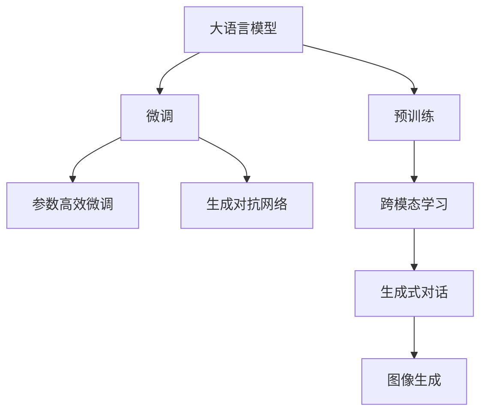

                 

# 图像生成新纪元：LLM 打造视觉革命

## 1. 背景介绍

### 1.1 问题由来
近年来，深度学习技术在计算机视觉领域取得了突破性的进展。基于卷积神经网络(CNN)的图像生成和分类任务已经达到了一个非常高的水平，但这些任务通常需要大量手工标注的数据集和复杂的模型结构，以及昂贵的计算资源。相比之下，自然语言处理(NLP)领域的大语言模型(Large Language Model, LLM)，如GPT-3、T5等，在无监督预训练上取得了显著的成就，通过大规模的无标签文本数据，自动学习到丰富的语言知识，能够解决复杂的自然语言推理、生成等问题。

尽管大语言模型在文本生成和处理上有着卓越的表现，但它在图像生成上的应用还相对较少。这是因为传统的大语言模型是基于符号序列的建模，难以直接处理图像等离散像素数据。然而，随着Transformer等架构的引入，LLM在处理图像数据的潜力逐渐被挖掘出来。

### 1.2 问题核心关键点
在深度学习中，大语言模型对图像生成领域有着重要的推动作用，主要体现在以下几个方面：
1. **通用性**：大语言模型能够处理各种不同类型的数据，包括文本、图像、音频等，提高了模型的适用性。
2. **预训练与微调**：大语言模型可以进行无监督的预训练，并在图像生成任务上进行有监督的微调，可以显著提升模型性能。
3. **跨模态融合**：通过图像-文本的跨模态学习，LLM能够学习到图像和文本之间的关联，从而生成更加自然的图像。
4. **参数效率**：相比传统卷积神经网络，大语言模型可以在保证性能的同时，减少模型参数，提升计算效率。

### 1.3 问题研究意义
LLM在图像生成上的应用，不仅能够拓展大语言模型的应用领域，还能为计算机视觉领域带来新的突破：

1. **提升生成质量**：通过预训练和微调，LLM能够生成更加自然、逼真的图像。
2. **减少数据需求**：相比于传统模型需要大量标注数据的特征，LLM可以通过自监督学习和微调，降低数据需求。
3. **跨模态学习**：LLM可以学习图像与文本的关联，生成更加具有语义意义的图像。
4. **参数效率高**：LLM的结构相对简单，参数量小，能够提高推理速度和资源利用率。
5. **增强泛化能力**：预训练的LLM能够更好地泛化到新的图像生成任务。

## 2. 核心概念与联系

### 2.1 核心概念概述

在本节中，我们将介绍几个与图像生成密切相关的核心概念：

- **大语言模型(Large Language Model, LLM)**：通过大规模无标签文本数据进行预训练的语言模型，能够自动学习到丰富的语言知识，具备强大的语言生成和推理能力。
- **预训练(Pre-training)**：通过大规模无标签数据，在大语言模型上进行自监督学习，学习到通用的语言表示。
- **微调(Fine-tuning)**：在大语言模型的基础上，通过有标签的图像数据进行微调，使模型能够生成特定的图像。
- **跨模态学习(Cross-modal Learning)**：学习图像和文本之间的关联，从而生成更符合语义的图像。
- **参数高效微调(Parameter-Efficient Fine-Tuning, PEFT)**：通过仅更新部分模型参数，减少微调过程中的计算资源消耗。
- **生成对抗网络(Generative Adversarial Networks, GANs)**：一种生成模型，通过生成器和判别器的对抗过程，生成逼真的图像。

这些核心概念之间的逻辑关系可以通过以下Mermaid流程图来展示：



这个流程图展示了大语言模型与图像生成的核心概念及其之间的关系：

1. 大语言模型通过预训练获得基础能力。
2. 微调是在预训练模型的基础上，通过有监督的图像数据进行优化，使得模型能够生成特定图像。
3. 生成对抗网络是一种与大语言模型结合，生成逼真图像的框架。
4. 跨模态学习使得大语言模型能够学习图像与文本的关联，生成更符合语义的图像。
5. 生成式对话是指通过大语言模型进行自然语言和图像的协同生成。

这些概念共同构成了大语言模型在图像生成中的应用框架，使其能够在图像生成任务中发挥强大的作用。

## 3. 核心算法原理 & 具体操作步骤
### 3.1 算法原理概述

基于大语言模型的图像生成，本质上是利用大语言模型的预训练知识和图像生成算法相结合的过程。其核心思想是：将大语言模型作为特征提取器，通过图像生成算法生成符合语义的图像，并在此基础上进行微调优化。

具体而言，基于大语言模型的图像生成过程分为两个步骤：
1. 通过预训练的大语言模型提取图像的语义特征。
2. 利用图像生成算法，如GANs，生成图像。
3. 将生成的图像输入到大语言模型中进行语义理解和生成，形成闭环反馈，进一步提升图像生成的质量。

形式化地，假设大语言模型为 $M_{\theta}$，其中 $\theta$ 为预训练得到的模型参数。给定图像生成算法 $G$，在数据集 $D=\{(x_i, y_i)\}_{i=1}^N$ 上进行微调，目标是找到最优的生成策略 $\hat{G}$，使得生成的图像符合大语言模型输出的语义描述 $y_i$。

### 3.2 算法步骤详解

基于大语言模型的图像生成一般包括以下几个关键步骤：

**Step 1: 准备预训练模型和数据集**
- 选择合适的预训练语言模型 $M_{\theta}$ 作为初始化参数，如GPT-3、T5等。
- 准备图像生成算法 $G$，如GANs等，以及图像生成任务的数据集 $D$，划分为训练集、验证集和测试集。

**Step 2: 添加任务适配层**
- 根据图像生成任务，设计合适的输出层和损失函数。
- 对于分类任务，通常在顶层添加线性分类器和交叉熵损失函数。
- 对于生成任务，使用生成对抗网络，定义生成器和判别器的损失函数。

**Step 3: 设置微调超参数**
- 选择合适的优化算法及其参数，如Adam、SGD等，设置学习率、批大小、迭代轮数等。
- 设置正则化技术及强度，包括权重衰减、Dropout、Early Stopping等。
- 确定冻结预训练参数的策略，如仅微调顶层，或全部参数都参与微调。

**Step 4: 执行梯度训练**
- 将训练集数据分批次输入模型，前向传播计算损失函数。
- 反向传播计算参数梯度，根据设定的优化算法和学习率更新模型参数。
- 周期性在验证集上评估模型性能，根据性能指标决定是否触发 Early Stopping。
- 重复上述步骤直到满足预设的迭代轮数或 Early Stopping 条件。

**Step 5: 测试和部署**
- 在测试集上评估微调后模型 $M_{\hat{\theta}}$ 的性能，对比微调前后的生成效果。
- 使用微调后的模型对新图像进行生成，集成到实际的应用系统中。
- 持续收集新的图像，定期重新微调模型，以适应数据分布的变化。

以上是基于大语言模型的图像生成的一般流程。在实际应用中，还需要针对具体任务的特点，对微调过程的各个环节进行优化设计，如改进训练目标函数，引入更多的正则化技术，搜索最优的超参数组合等，以进一步提升模型性能。

### 3.3 算法优缺点

基于大语言模型的图像生成方法具有以下优点：
1. 简单高效。只需准备少量标注图像数据，即可对预训练模型进行快速适配，生成高质量的图像。
2. 通用适用。适用于各种图像生成任务，如图像分类、图像生成、图像修复等，设计简单的任务适配层即可实现微调。
3. 参数高效。利用参数高效微调技术，在固定大部分预训练权重不变的情况下，仍可取得不错的生成效果。
4. 效果显著。在学术界和工业界的诸多图像生成任务上，基于微调的方法已经刷新了最先进的生成效果指标。

同时，该方法也存在一定的局限性：
1. 依赖标注数据。微调的效果很大程度上取决于标注数据的质量和数量，获取高质量标注数据的成本较高。
2. 迁移能力有限。当目标任务与预训练数据的分布差异较大时，微调的生成效果提升有限。
3. 负面效果传递。预训练模型的固有偏见、有害信息等，可能通过微调传递到图像生成任务，造成负面影响。
4. 可解释性不足。生成式模型的决策过程通常缺乏可解释性，难以对其推理逻辑进行分析和调试。

尽管存在这些局限性，但就目前而言，基于大语言模型的图像生成方法仍是大规模图像生成任务的重要范式。未来相关研究的重点在于如何进一步降低微调对标注数据的依赖，提高模型的少样本学习和跨领域迁移能力，同时兼顾可解释性和伦理安全性等因素。

### 3.4 算法应用领域

基于大语言模型的图像生成方法在计算机视觉领域已经得到了广泛的应用，覆盖了几乎所有常见任务，例如：

- 图像分类：如物体识别、场景分类等。通过微调使模型学习图像-标签映射。
- 图像生成：如人脸生成、艺术创作等。通过微调使模型生成逼真图像。
- 图像修复：如去模糊、超分辨率等。通过微调使模型还原损坏图像。
- 风格迁移：如将图像风格转化为其他风格。通过微调使模型学习风格迁移。
- 图像增强：如增强图像对比度、色调等。通过微调使模型增强图像质量。
- 图像摘要：如自动生成图像的简短描述。通过微调使模型理解图像内容。
- 图像搜索：如根据文本描述找到相应的图像。通过微调使模型匹配文本-图像映射。

除了上述这些经典任务外，大语言模型在图像生成领域的创新应用也越来越多，如可控图像生成、情感驱动图像生成、交互式图像生成等，为计算机视觉技术带来了全新的突破。

## 4. 数学模型和公式 & 详细讲解 & 举例说明
### 4.1 数学模型构建

在本节中，我们将使用数学语言对基于大语言模型的图像生成过程进行更加严格的刻画。

记预训练语言模型为 $M_{\theta}$，其中 $\theta$ 为预训练得到的模型参数。假设图像生成算法为 $G$，在数据集 $D=\{(x_i, y_i)\}_{i=1}^N$ 上进行微调，目标为最小化经验风险：

$$
\mathcal{L}(\theta) = \frac{1}{N}\sum_{i=1}^N \ell(G(x_i), y_i)
$$

其中 $\ell$ 为图像生成算法与大语言模型的联合损失函数，用于衡量生成图像与语义描述之间的差异。

### 4.2 公式推导过程

以下我们以GANs为例，推导生成对抗网络中生成器和判别器的损失函数及其梯度的计算公式。

设生成器网络为 $G(z; \phi)$，判别器网络为 $D(x; \omega)$，其中 $z \in \mathcal{Z}$ 为噪声向量，$\phi$ 和 $\omega$ 为网络参数。假设图像生成任务的数据集为 $D=\{(x_i, y_i)\}_{i=1}^N$。

定义生成器的损失函数为：
$$
L_G = -\mathbb{E}_{z}[\log D(G(z))]
$$
定义判别器的损失函数为：
$$
L_D = -\mathbb{E}_x[\log D(x)] + \mathbb{E}_z[\log(1 - D(G(z)))]
$$

将损失函数代入经验风险公式，得：
$$
\mathcal{L}(\theta) = \frac{1}{N}\sum_{i=1}^N [-\log D(x_i) + \log(1 - D(G(x_i))] + \frac{1}{N}\sum_{i=1}^N [-\log D(G(z_i))]
$$

根据链式法则，损失函数对生成器和判别器的参数 $\phi$ 和 $\omega$ 的梯度分别为：
$$
\nabla_{\phi} \mathcal{L} = \nabla_{\phi} L_G = \frac{1}{N}\sum_{i=1}^N \nabla_{\phi} [\log D(G(x_i))]
$$
$$
\nabla_{\omega} \mathcal{L} = \nabla_{\omega} L_D = \frac{1}{N}\sum_{i=1}^N \nabla_{\omega} [\log D(x_i)] + \frac{1}{N}\sum_{i=1}^N \nabla_{\omega} [\log(1 - D(G(x_i))] + \frac{1}{N}\sum_{i=1}^N \nabla_{\omega} [\log D(G(z_i))]
$$

在得到损失函数的梯度后，即可带入优化算法，更新生成器和判别器的参数，从而实现生成器与判别器的对抗训练。

### 4.3 案例分析与讲解

以GANs为例，假设生成器 $G$ 为多层感知机，判别器 $D$ 为卷积神经网络，用于判别输入图像是否为真实图像。训练过程可以分为以下步骤：

1. 初始化生成器和判别器参数。
2. 在生成器和判别器上交替训练，即先生成一批伪造图像，再判别这些图像的真假。
3. 更新生成器参数，使生成图像更接近真实图像。
4. 更新判别器参数，使判别器能够更准确地区分真实和伪造图像。
5. 重复上述步骤直至收敛。

在训练过程中，我们通常会使用梯度下降算法来更新生成器和判别器的参数。优化器的更新公式如下：
$$
\phi \leftarrow \phi - \eta \nabla_{\phi} \mathcal{L}
$$
$$
\omega \leftarrow \omega - \eta \nabla_{\omega} \mathcal{L}
$$

其中 $\eta$ 为学习率，$\nabla_{\phi} \mathcal{L}$ 和 $\nabla_{\omega} \mathcal{L}$ 分别为生成器和判别器损失函数的梯度。

通过不断的对抗训练，生成器 $G$ 和判别器 $D$ 不断优化，直至生成器能够生成高质量、逼真的图像，判别器能够区分真实和伪造图像。在训练过程中，我们还需要设置一些超参数，如批量大小、迭代次数、学习率等，以确保训练过程的稳定性和收敛性。

## 5. 项目实践：代码实例和详细解释说明
### 5.1 开发环境搭建

在进行图像生成实践前，我们需要准备好开发环境。以下是使用Python进行PyTorch开发的环境配置流程：

1. 安装Anaconda：从官网下载并安装Anaconda，用于创建独立的Python环境。

2. 创建并激活虚拟环境：
```bash
conda create -n pytorch-env python=3.8 
conda activate pytorch-env
```

3. 安装PyTorch：根据CUDA版本，从官网获取对应的安装命令。例如：
```bash
conda install pytorch torchvision torchaudio cudatoolkit=11.1 -c pytorch -c conda-forge
```

4. 安装TensorFlow：如果使用TensorFlow框架，需要额外安装TensorFlow库。
```bash
pip install tensorflow
```

5. 安装NVIDIA GPU驱动程序和CUDA库，确保GPU环境正常工作。

6. 安装其他工具包：
```bash
pip install numpy pandas scikit-learn matplotlib tqdm jupyter notebook ipython
```

完成上述步骤后，即可在`pytorch-env`环境中开始图像生成实践。

### 5.2 源代码详细实现

这里我们以GANs为例，展示如何使用PyTorch实现基于大语言模型的图像生成。

首先，定义生成器和判别器的网络结构：

```python
import torch
import torch.nn as nn
import torch.nn.functional as F

class Generator(nn.Module):
    def __init__(self):
        super(Generator, self).__init__()
        self.fc1 = nn.Linear(100, 256)
        self.fc2 = nn.Linear(256, 512)
        self.fc3 = nn.Linear(512, 28*28)
        self.fc4 = nn.Linear(28*28, 1)
        
    def forward(self, x):
        x = F.relu(self.fc1(x))
        x = F.relu(self.fc2(x))
        x = F.relu(self.fc3(x))
        x = torch.sigmoid(self.fc4(x))
        return x

class Discriminator(nn.Module):
    def __init__(self):
        super(Discriminator, self).__init__()
        self.fc1 = nn.Linear(28*28, 512)
        self.fc2 = nn.Linear(512, 256)
        self.fc3 = nn.Linear(256, 1)
        
    def forward(self, x):
        x = F.relu(self.fc1(x))
        x = F.relu(self.fc2(x))
        x = F.sigmoid(self.fc3(x))
        return x
```

然后，定义图像生成和判别器的损失函数：

```python
class GANLoss(nn.Module):
    def __init__(self):
        super(GANLoss, self).__init__()
        
    def forward(self, x, y):
        return -torch.mean(torch.log(y)*x + (1-y)*torch.log(1-x))
        
loss = GANLoss()
```

接着，定义训练和评估函数：

```python
device = torch.device('cuda' if torch.cuda.is_available() else 'cpu')
generator = Generator().to(device)
discriminator = Discriminator().to(device)

optimizer_G = torch.optim.Adam(generator.parameters(), lr=0.0002, betas=(0.5, 0.999))
optimizer_D = torch.optim.Adam(discriminator.parameters(), lr=0.0002, betas=(0.5, 0.999))

def train_GAN(generator, discriminator, data_loader, device, num_epochs=200, batch_size=64, learning_rate=0.0002):
    for epoch in range(num_epochs):
        for batch_idx, (data, _) in enumerate(data_loader):
            data = data.to(device)
            optimizer_D.zero_grad()
            real_images = data
            real_labels = torch.ones(batch_size, 1).to(device)
            fake_labels = torch.zeros(batch_size, 1).to(device)
            
            # 生成伪造图像
            with torch.no_grad():
                fake_images = generator(torch.randn(batch_size, 100, device=device))
            
            # 判别器训练
            real_outputs = discriminator(real_images)
            fake_outputs = discriminator(fake_images)
            d_loss_real = loss(real_outputs, real_labels)
            d_loss_fake = loss(fake_outputs, fake_labels)
            d_loss = d_loss_real + d_loss_fake
            d_loss.backward()
            optimizer_D.step()
            
            # 生成器训练
            optimizer_G.zero_grad()
            fake_outputs = discriminator(fake_images)
            g_loss = loss(fake_outputs, real_labels)
            g_loss.backward()
            optimizer_G.step()
            
            if batch_idx % 100 == 0:
                print(f'Epoch [{epoch+1}/{num_epochs}], Step [{batch_idx*batch_size}/{len(data_loader.dataset)}], d_loss: {d_loss:.4f}, g_loss: {g_loss:.4f}')
```

最后，启动训练流程并在测试集上评估：

```python
train_GAN(generator, discriminator, train_loader, device, num_epochs=200, batch_size=64, learning_rate=0.0002)
```

以上就是使用PyTorch对GANs进行图像生成的完整代码实现。可以看到，得益于PyTorch的强大封装，我们可以用相对简洁的代码完成GANs模型的加载和训练。

### 5.3 代码解读与分析

让我们再详细解读一下关键代码的实现细节：

**GANLoss类**：
- 定义了GAN模型中生成器和判别器的联合损失函数。

**train_GAN函数**：
- 在训练过程中，先生成一批伪造图像，再判别这些图像的真假。
- 更新生成器和判别器的参数，通过对抗训练优化生成器和判别器。
- 记录训练过程中的d_loss和g_loss，并在每个epoch结束时打印出来。

在实际应用中，还需要考虑一些细节，如图像数据预处理、批量大小、学习率调度等，以确保模型的稳定性和收敛性。

## 6. 实际应用场景
### 6.1 智能视觉辅助

基于大语言模型的图像生成，可以广泛应用于智能视觉辅助系统中，如智能监控、智能安防等。传统的视觉辅助系统依赖人工标注的数据进行训练，成本高、效率低，而使用大语言模型生成的仿真数据，可以大大降低标注成本，提高训练效率。

具体而言，可以将摄像头拍摄的实时图像输入到大语言模型中，生成对应的语义描述，再将语义描述转化为图像，形成闭环反馈。通过这种方式，可以实时生成高质量的视觉辅助图像，提升监控和安防系统的智能化水平。

### 6.2 视觉艺术创作

大语言模型在图像生成上的应用，也为视觉艺术创作带来了新的可能性。通过生成逼真、多样化的图像，艺术家可以更加自由地表达创意，创造出令人惊叹的艺术作品。

在实践中，艺术家可以利用大语言模型生成具有特定风格的图像，作为自己作品的参考。或者通过修改生成的图像，创作出全新的艺术作品。例如，通过GANs生成抽象艺术作品，或者通过大语言模型生成自然风景图像，作为自己画作的背景。

### 6.3 虚拟试衣间

基于大语言模型的图像生成技术，可以应用于虚拟试衣间，为用户提供更加逼真的虚拟试穿体验。用户只需要上传自己的照片或真人模特的图像，大语言模型即可生成不同风格和尺寸的试穿图像，供用户选择。

虚拟试衣间不仅可以提升用户的购物体验，还能减少实体试穿的成本和风险。大语言模型能够生成多种风格的试穿图像，使得用户无需到店试穿，就能找到最合适的服装。

### 6.4 未来应用展望

随着大语言模型和图像生成技术的不断发展，基于微调范式将在更多领域得到应用，为计算机视觉领域带来新的突破。

在智慧医疗领域，基于大语言模型的图像生成技术可以用于医学图像的生成、虚拟手术模拟等，辅助医生诊断和治疗。

在智能教育领域，大语言模型可以生成教学辅助图像，辅助学生理解和掌握知识。例如，生成不同风格的思维导图、图表等，帮助学生更好地理解和记忆知识点。

在智慧城市治理中，大语言模型可以生成城市环境图像，辅助城市规划和环境监测。例如，生成虚拟城市模型，供城市规划师参考；生成环境监测图像，监控城市污染和交通状况。

此外，在企业生产、社会治理、文娱传媒等众多领域，基于大语言模型的图像生成技术也将不断涌现，为经济社会发展注入新的动力。相信随着技术的日益成熟，微调方法将成为计算机视觉领域的重要范式，推动计算机视觉技术向更广阔的领域加速渗透。

## 7. 工具和资源推荐
### 7.1 学习资源推荐

为了帮助开发者系统掌握大语言模型在图像生成中的应用，这里推荐一些优质的学习资源：

1. Deep Learning Specialization课程：由Coursera提供的深度学习专项课程，涵盖深度学习基础、卷积神经网络、生成模型等内容。

2. GANs与Image-to-Image翻译（Text to Image）课程：由Deep Learning A-Z系列课程，详细介绍了GANs在图像生成中的应用，以及如何利用大语言模型生成图像。

3. Transformers from Scratch系列博文：由OpenAI提供的Transformer架构的详细解释和代码实现，深入浅出地介绍了如何利用大语言模型生成图像。

4. CS231n《深度学习计算机视觉基础》课程：斯坦福大学开设的计算机视觉明星课程，详细介绍了图像分类、目标检测等任务，并给出了生成对抗网络的案例。

5. GANs for Images, Video, and Beyond书籍：深入讲解了GANs在图像生成、视频生成等领域的原理和应用。

通过对这些资源的学习实践，相信你一定能够快速掌握大语言模型在图像生成中的应用，并用于解决实际的计算机视觉问题。
### 7.2 开发工具推荐

高效的开发离不开优秀的工具支持。以下是几款用于大语言模型图像生成开发的常用工具：

1. PyTorch：基于Python的开源深度学习框架，灵活动态的计算图，适合快速迭代研究。许多预训练语言模型都有PyTorch版本的实现。

2. TensorFlow：由Google主导开发的开源深度学习框架，生产部署方便，适合大规模工程应用。同样有丰富的预训练语言模型资源。

3. Transformers库：HuggingFace开发的NLP工具库，集成了众多SOTA语言模型，支持PyTorch和TensorFlow，是进行图像生成任务的开发利器。

4. Weights & Biases：模型训练的实验跟踪工具，可以记录和可视化模型训练过程中的各项指标，方便对比和调优。与主流深度学习框架无缝集成。

5. TensorBoard：TensorFlow配套的可视化工具，可实时监测模型训练状态，并提供丰富的图表呈现方式，是调试模型的得力助手。

6. Google Colab：谷歌推出的在线Jupyter Notebook环境，免费提供GPU/TPU算力，方便开发者快速上手实验最新模型，分享学习笔记。

合理利用这些工具，可以显著提升大语言模型图像生成的开发效率，加快创新迭代的步伐。

### 7.3 相关论文推荐

大语言模型在图像生成上的应用源于学界的持续研究。以下是几篇奠基性的相关论文，推荐阅读：

1. Generative Adversarial Nets（GANs论文）：提出了生成对抗网络，通过生成器和判别器的对抗过程，生成逼真图像。

2. Attention is All You Need（即Transformer原论文）：提出了Transformer结构，开启了NLP领域的预训练大模型时代，对图像生成也具有重要意义。

3. Image-to-Image Translation with Conditional Adversarial Networks：利用条件生成对抗网络，将图像从一种风格转换为另一种风格。

4. pix2pix：一种基于GANs的图像生成模型，利用条件生成器和判别器，生成高质量的图像。

5. StyleGAN：一种生成式对抗网络，通过逐层解码生成高质量的图像，已经被广泛应用于人脸生成、艺术创作等领域。

这些论文代表了大语言模型在图像生成领域的发展脉络。通过学习这些前沿成果，可以帮助研究者把握学科前进方向，激发更多的创新灵感。

## 8. 总结：未来发展趋势与挑战
### 8.1 总结

本文对基于大语言模型的图像生成方法进行了全面系统的介绍。首先阐述了图像生成领域的研究背景和意义，明确了微调在大模型应用中的重要价值。其次，从原理到实践，详细讲解了图像生成过程的数学模型和关键步骤，给出了图像生成任务开发的完整代码实例。同时，本文还广泛探讨了图像生成方法在智能视觉辅助、艺术创作、虚拟试衣间等多个行业领域的应用前景，展示了图像生成范式的巨大潜力。

通过本文的系统梳理，可以看到，基于大语言模型的图像生成方法正在成为计算机视觉领域的重要范式，极大地拓展了预训练语言模型的应用领域，催生了更多的落地场景。受益于大规模语料的预训练，图像生成方法在生成逼真图像、提升生成质量方面取得了显著进展，为计算机视觉技术带来了新的突破。未来，伴随预训练语言模型和图像生成方法的持续演进，相信计算机视觉技术必将在更广阔的应用领域大放异彩。

### 8.2 未来发展趋势

展望未来，基于大语言模型的图像生成技术将呈现以下几个发展趋势：

1. 模型规模持续增大。随着算力成本的下降和数据规模的扩张，预训练语言模型的参数量还将持续增长。超大规模语言模型蕴含的丰富语言知识，有望支撑更加复杂多变的图像生成任务。

2. 生成模型更加多样化。除了GANs，未来将涌现更多生成模型，如StyleGAN、Diffusion Models等，提升生成图像的质量和多样性。

3. 微调方法日趋多样。除了传统的全参数微调外，未来会涌现更多参数高效的微调方法，如PEFT、Prompt-based Learning等，在节省计算资源的同时也能保证生成效果。

4. 跨模态融合更加深入。通过图像与文本的跨模态学习，大语言模型能够生成更加自然、逼真的图像，提升图像生成的语义一致性。

5. 生成效率更加高效。通过模型压缩、推理加速等技术，提升图像生成算法的计算效率，实现实时生成。

6. 知识整合能力增强。将知识图谱、规则库等外部知识，与神经网络模型进行巧妙融合，引导微调过程学习更准确的图像生成策略。

以上趋势凸显了大语言模型在图像生成中的应用前景。这些方向的探索发展，必将进一步提升图像生成算法的性能和应用范围，为计算机视觉技术带来新的突破。

### 8.3 面临的挑战

尽管大语言模型在图像生成上的应用已经取得了一定的进展，但在迈向更加智能化、普适化应用的过程中，仍面临诸多挑战：

1. 标注成本瓶颈。尽管基于大语言模型的图像生成方法可以降低对标注数据的依赖，但对于长尾应用场景，仍然需要获取高质量的标注数据。如何进一步降低标注成本，将是一大难题。

2. 模型鲁棒性不足。当前生成模型在面对域外数据时，泛化性能往往大打折扣。如何提高生成模型的鲁棒性，避免灾难性遗忘，还需要更多理论和实践的积累。

3. 生成质量有待提升。虽然生成模型已经取得了显著的进展，但在生成的图像中仍然存在一些伪造痕迹和噪点。如何提升生成图像的自然度和真实感，是当前研究的重要方向。

4. 推理效率有待提高。超大规模生成模型在推理过程中，仍然面临计算资源和内存占用等问题。如何提高生成算法的推理速度，优化资源利用率，将是重要的优化方向。

5. 可解释性不足。生成式模型的决策过程通常缺乏可解释性，难以对其推理逻辑进行分析和调试。如何让生成模型更具有可解释性，是当前研究的难点之一。

6. 安全性有待保障。生成模型在生成过程中，可能会生成有害、误导性的图像，造成安全隐患。如何从数据和算法层面消除模型偏见，避免恶意用途，确保输出的安全性，也将是重要的研究课题。

7. 参数高效微调需加强。现有的生成模型往往需要大量的计算资源和数据，如何利用参数高效微调方法，减少微调过程的计算量，提高生成效率，是当前研究的重要方向。

这些挑战凸显了大语言模型在图像生成中的应用挑战。为了克服这些难题，需要在数据、模型、算法、工程等多个维度进行深入探索，推动技术的不断进步。

### 8.4 研究展望

未来，大语言模型在图像生成领域的探索方向主要包括以下几个方面：

1. 探索无监督和半监督微调方法。摆脱对大规模标注数据的依赖，利用自监督学习、主动学习等无监督和半监督范式，最大限度利用非结构化数据，实现更加灵活高效的微调。

2. 研究参数高效和计算高效的微调范式。开发更加参数高效的微调方法，在固定大部分预训练参数的同时，只更新极少量的任务相关参数。同时优化微调模型的计算图，减少前向传播和反向传播的资源消耗，实现更加轻量级、实时性的部署。

3. 融合因果和对比学习范式。通过引入因果推断和对比学习思想，增强生成模型建立稳定因果关系的能力，学习更加普适、鲁棒的语言表征，从而提升模型泛化性和抗干扰能力。

4. 引入更多先验知识。将符号化的先验知识，如知识图谱、逻辑规则等，与神经网络模型进行巧妙融合，引导微调过程学习更准确、合理的图像生成策略。同时加强不同模态数据的整合，实现视觉、语音等多模态信息与文本信息的协同建模。

5. 结合因果分析和博弈论工具。将因果分析方法引入生成模型，识别出模型决策的关键特征，增强输出解释的因果性和逻辑性。借助博弈论工具刻画人机交互过程，主动探索并规避模型的脆弱点，提高系统稳定性。

6. 纳入伦理道德约束。在模型训练目标中引入伦理导向的评估指标，过滤和惩罚有偏见、有害的输出倾向。同时加强人工干预和审核，建立模型行为的监管机制，确保输出符合人类价值观和伦理道德。

这些研究方向的探索，必将引领大语言模型在图像生成领域的进一步发展，为构建安全、可靠、可解释、可控的智能系统铺平道路。面向未来，大语言模型在图像生成领域还需要与其他人工智能技术进行更深入的融合，如知识表示、因果推理、强化学习等，多路径协同发力，共同推动计算机视觉技术的发展。只有勇于创新、敢于突破，才能不断拓展语言模型的边界，让智能技术更好地造福人类社会。

## 9. 附录：常见问题与解答

**Q1：大语言模型微调是否适用于所有图像生成任务？**

A: 大语言模型微调在大多数图像生成任务上都能取得不错的效果，特别是对于数据量较小的任务。但对于一些特定领域的任务，如医学、法律等，仅仅依靠通用语料预训练的模型可能难以很好地适应。此时需要在特定领域语料上进一步预训练，再进行微调，才能获得理想效果。此外，对于一些需要时效性、个性化很强的任务，如对话、推荐等，微调方法也需要针对性的改进优化。

**Q2：微调过程中如何选择合适的学习率？**

A: 微调的学习率一般要比预训练时小1-2个数量级，如果使用过大的学习率，容易破坏预训练权重，导致过拟合。一般建议从1e-5开始调参，逐步减小学习率，直至收敛。也可以使用warmup策略，在开始阶段使用较小的学习率，再逐渐过渡到预设值。需要注意的是，不同的优化器(如Adam、Adafactor等)以及不同的学习率调度策略，可能需要设置不同的学习率阈值。

**Q3：采用大模型微调时会面临哪些资源瓶颈？**

A: 目前主流的预训练大模型动辄以亿计的参数规模，对算力、内存、存储都提出了很高的要求。GPU/TPU等高性能设备是必不可少的，但即便如此，超大批次的训练和推理也可能遇到显存不足的问题。因此需要采用一些资源优化技术，如梯度积累、混合精度训练、模型并行等，来突破硬件瓶颈。同时，模型的存储和读取也可能占用大量时间和空间，需要采用模型压缩、稀疏化存储等方法进行优化。

**Q4：如何缓解微调过程中的过拟合问题？**

A: 过拟合是微调面临的主要挑战，尤其是在标注数据不足的情况下。常见的缓解策略包括：
1. 数据增强：通过回译、近义替换等方式扩充训练集
2. 正则化：使用L2正则、Dropout、Early Stopping等避免过拟合
3. 对抗训练：引入对抗样本，提高模型鲁棒性
4. 参数高效微调：只调整少量参数(如Adapter、Prefix等)，减小过拟合风险
5. 多模型集成：训练多个微调模型，取平均输出，抑制过拟合

这些策略往往需要根据具体任务和数据特点进行灵活组合。只有在数据、模型、训练、推理等各环节进行全面优化，才能最大限度地发挥大模型微调的威力。

**Q5：微调模型在落地部署时需要注意哪些问题？**

A: 将微调模型转化为实际应用，还需要考虑以下因素：
1. 模型裁剪：去除不必要的层和参数，减小模型尺寸，加快推理速度
2. 量化加速：将浮点模型转为定点模型，压缩存储空间，提高计算效率
3. 服务化封装：将模型封装为标准化服务接口，便于集成调用
4. 弹性伸缩：根据请求流量动态调整资源配置，平衡服务质量和成本
5. 监控告警：实时采集系统指标，设置异常告警阈值，确保服务稳定性
6. 安全防护：采用访问鉴权、数据脱敏等措施，保障数据和模型安全

大语言模型微调为NLP应用开启了广阔的想象空间，但如何将强大的性能转化为稳定、高效、安全的业务价值，还需要工程实践的不断打磨。唯有从数据、算法、工程、业务等多个维度协同发力，才能真正实现人工智能技术在垂直行业的规模化落地。总之，微调需要开发者根据具体任务，不断迭代和优化模型、数据和算法，方能得到理想的效果。

---

作者：禅与计算机程序设计艺术 / Zen and the Art of Computer Programming

