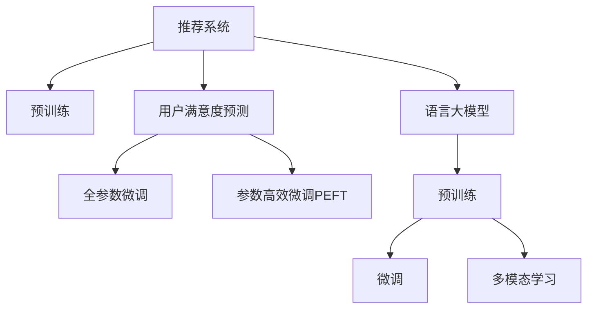

                 

## 1. 背景介绍

在互联网和移动互联网时代，推荐系统已成为提升用户体验、驱动业务增长的重要工具。从电子商务、社交网络到新闻媒体，各大平台纷纷通过个性化推荐满足用户的多样化需求。用户满意度作为衡量推荐系统效能的重要指标，直接影响着用户粘性、留存率和商业转化率。然而，传统的推荐系统往往关注于推荐精度，较少考虑用户的主观体验，难以准确衡量推荐效果。基于语言大模型的推荐系统（Large Language Model-based Recommendation System）通过对用户评论、评分、行为数据的深度学习，能够更加全面地理解用户满意度，为推荐策略优化提供有力支持。

本文聚焦于基于语言大模型（LLM）的用户满意度预测技术，详细介绍了大语言模型在推荐系统中的应用，探讨了模型的原理、架构和训练策略，提供了系统性的技术指导。本文适合对推荐系统和大语言模型有基本了解的读者阅读，预计阅读时间约为30分钟。

## 2. 核心概念与联系

### 2.1 核心概念概述

为更好地理解基于语言大模型的推荐系统用户满意度预测方法，本节将介绍几个密切相关的核心概念：

- **推荐系统(Recommendation System, RS)**：根据用户的历史行为和兴趣偏好，推荐系统能够自动生成个性化推荐列表。经典推荐算法包括协同过滤、基于内容的推荐等。

- **用户满意度(User Satisfaction)**：用户对推荐系统推荐的物品或服务的主观评价。通常通过用户评分、评论等数据进行衡量。

- **语言大模型(Large Language Model, LLM)**：以自回归(如GPT)或自编码(如BERT)模型为代表的大规模预训练语言模型。通过在大规模无标签文本语料上进行预训练，学习到语言的通用表示，具备强大的语言理解和生成能力。

- **预训练(Pre-training)**：指在大规模无标签文本语料上，通过自监督学习任务训练通用语言模型的过程。常见的预训练任务包括言语建模、掩码语言模型等。预训练使得模型学习到语言的通用表示。

- **微调(Fine-tuning)**：指在预训练模型的基础上，使用下游任务的少量标注数据，通过有监督学习优化模型在特定任务上的性能。通常只需要调整顶层分类器或解码器，并以较小的学习率更新全部或部分的模型参数。

- **多模态学习(Multi-modal Learning)**：将不同模态的数据（如文本、图像、音频等）联合起来进行学习，提升模型对复杂场景的理解能力。

这些核心概念之间的逻辑关系可以通过以下Mermaid流程图来展示：



这个流程图展示了大语言模型与推荐系统、用户满意度预测之间的关系：

1. 推荐系统通过预训练语言大模型进行推荐。
2. 预训练大语言模型通过微调学习特定领域的知识，提升推荐效果。
3. 用户满意度预测将推荐结果与用户反馈结合，优化推荐策略。
4. 多模态学习将不同类型数据结合起来，提升推荐系统的表现力。

这些概念共同构成了基于语言大模型的推荐系统用户满意度预测框架，使得推荐系统能够更好地理解用户需求，优化推荐过程。

## 3. 核心算法原理 & 具体操作步骤

### 3.1 算法原理概述

基于语言大模型的推荐系统用户满意度预测，本质上是将语言大模型与推荐系统相结合，通过学习用户评论和行为数据，预测用户对推荐结果的满意度。具体来说，该方法首先通过预训练语言大模型，对推荐结果进行语义理解和情感分析，然后将分析结果与用户反馈数据结合，训练出用户满意度预测模型。

该方法的核心在于：
1. **预训练语言大模型**：通过在大规模无标签文本语料上进行预训练，学习到丰富的语言知识和语义表示。
2. **用户满意度预测模型**：将预训练语言大模型的输出与用户反馈数据结合，训练出用户满意度预测模型。
3. **多模态学习**：将推荐结果的语义表示与用户行为数据结合，提升模型的泛化能力和理解能力。

### 3.2 算法步骤详解

基于语言大模型的推荐系统用户满意度预测一般包括以下几个关键步骤：

**Step 1: 准备预训练模型和数据集**

- **选择预训练语言大模型**：如BERT、GPT等，作为初始化参数。
- **收集用户数据**：包括用户评论、评分、行为数据等，划分为训练集、验证集和测试集。

**Step 2: 预训练模型微调**

- **微调目标**：根据用户满意度预测任务，设计合适的任务适配层和损失函数。
- **微调策略**：选择合适的优化算法（如AdamW、SGD等），设置学习率、批大小、迭代轮数等。
- **正则化技术**：使用L2正则、Dropout、Early Stopping等技术，防止模型过拟合。
- **多模态融合**：将推荐结果的语义表示与用户行为数据（如点击、浏览、购买等）结合起来，进行多模态融合。

**Step 3: 训练用户满意度预测模型**

- **输入数据处理**：将用户评论数据进行处理，转化为模型输入格式。
- **模型训练**：在预训练语言大模型的输出上，训练用户满意度预测模型，最小化损失函数。
- **模型评估**：在验证集和测试集上，评估用户满意度预测模型的性能。

**Step 4: 实时预测与推荐优化**

- **实时预测**：在推荐系统中，实时预测用户对推荐结果的满意度。
- **推荐优化**：根据用户满意度预测结果，调整推荐策略，提升推荐质量。

### 3.3 算法优缺点

基于语言大模型的推荐系统用户满意度预测方法具有以下优点：
1. **语义理解能力强**：大语言模型能够理解复杂文本，准确捕捉用户对推荐结果的情感和语义。
2. **泛化能力强**：多模态学习能够将不同类型的数据结合起来，提升模型的泛化能力和鲁棒性。
3. **预测准确度高**：通过将预训练语言大模型的输出与用户反馈数据结合，能够实现较为准确的满意度预测。

然而，该方法也存在一些局限性：
1. **数据依赖性强**：需要大量的用户评论和行为数据，数据获取成本较高。
2. **模型复杂度高**：大语言模型和用户满意度预测模型均需要大量的计算资源，对硬件要求较高。
3. **实时性要求高**：实时预测需要快速计算，对模型推理速度和系统架构有较高要求。

尽管存在这些局限性，但就目前而言，基于语言大模型的推荐系统用户满意度预测方法仍是一种高效、有效的推荐策略优化手段。未来相关研究的重点在于如何进一步降低数据获取成本，提高模型推理速度，优化系统架构，以实现更高效率和更高精度的用户满意度预测。

### 3.4 算法应用领域

基于语言大模型的推荐系统用户满意度预测方法在电子商务、在线教育、社交网络等领域有着广泛的应用前景：

- **电子商务**：通过预测用户对推荐商品的满意度，优化商品推荐策略，提升用户购买转化率。
- **在线教育**：预测学生对推荐课程的满意度，优化课程推荐，提升学习效果和用户粘性。
- **社交网络**：预测用户对推荐内容的满意度，优化内容推荐，提升用户体验和平台活跃度。

此外，在智能家居、健康医疗、金融服务等多个领域，基于语言大模型的推荐系统用户满意度预测方法也将得到广泛应用，为各行各业带来新的商业机遇和用户价值。

## 4. 数学模型和公式 & 详细讲解

### 4.1 数学模型构建

本节将使用数学语言对基于语言大模型的推荐系统用户满意度预测过程进行更加严格的刻画。

记预训练语言大模型为 $M_{\theta}$，用户满意度预测模型为 $F_{\phi}$，其中 $\theta$ 为预训练语言大模型的参数，$\phi$ 为用户满意度预测模型的参数。假设用户评论数据为 $\{x_i\}_{i=1}^N$，用户满意度数据为 $\{y_i\}_{i=1}^N$，其中 $x_i$ 为评论文本，$y_i$ 为满意度评分（例如1-5分）。

定义损失函数 $\mathcal{L}(\theta, \phi)$ 为：

$$
\mathcal{L}(\theta, \phi) = \frac{1}{N} \sum_{i=1}^N \mathcal{L}_{pred}(y_i, \hat{y}_i) + \frac{1}{N} \sum_{i=1}^N \mathcal{L}_{review}(x_i, M_{\theta}(x_i))
$$

其中，$\mathcal{L}_{pred}$ 为满意度预测损失函数，$\mathcal{L}_{review}$ 为评论情感分析损失函数。在实践中，通常使用交叉熵损失函数进行训练：

$$
\mathcal{L}_{pred} = -\sum_{i=1}^N y_i \log \hat{y}_i
$$

$$
\mathcal{L}_{review} = -\sum_{i=1}^N \sum_{j=1}^M r_{ij} \log M_{\theta}(x_i)
$$

其中，$r_{ij}$ 为评论情感极性标签（例如1表示正面情感，0表示负面情感），$M_{\theta}(x_i)$ 为预训练语言大模型对评论文本 $x_i$ 的语义表示。

### 4.2 公式推导过程

以下我们以情感分析为例，推导评论情感分析损失函数及其梯度的计算公式。

假设评论文本 $x_i$ 的语义表示为 $M_{\theta}(x_i) \in \mathbb{R}^d$，情感极性标签为 $r_i \in \{1,0\}$，则评论情感分析损失函数定义为：

$$
\mathcal{L}_{review} = -\sum_{i=1}^N r_i \log M_{\theta}(x_i)
$$

将其代入整体损失函数公式，得：

$$
\mathcal{L}(\theta, \phi) = -\sum_{i=1}^N y_i \log \hat{y}_i - \sum_{i=1}^N r_i \log M_{\theta}(x_i)
$$

根据链式法则，损失函数对预训练语言大模型参数 $\theta$ 的梯度为：

$$
\frac{\partial \mathcal{L}(\theta, \phi)}{\partial \theta} = -\frac{1}{N} \sum_{i=1}^N \frac{\partial \mathcal{L}_{pred}(y_i, \hat{y}_i)}{\partial \hat{y}_i} \frac{\partial \hat{y}_i}{\partial \theta} - \frac{1}{N} \sum_{i=1}^N \frac{\partial \mathcal{L}_{review}(x_i, M_{\theta}(x_i))}{\partial M_{\theta}(x_i)} \frac{\partial M_{\theta}(x_i)}{\partial \theta}
$$

其中 $\frac{\partial \mathcal{L}_{pred}(y_i, \hat{y}_i)}{\partial \hat{y}_i}$ 为满意度预测损失对预测输出的梯度，$\frac{\partial \mathcal{L}_{review}(x_i, M_{\theta}(x_i))}{\partial M_{\theta}(x_i)}$ 为评论情感分析损失对语义表示的梯度，$\frac{\partial \hat{y}_i}{\partial \theta}$ 和 $\frac{\partial M_{\theta}(x_i)}{\partial \theta}$ 分别为预测输出和语义表示对预训练语言大模型参数的梯度，可通过反向传播算法高效计算。

在得到损失函数的梯度后，即可带入预训练语言大模型和用户满意度预测模型的优化算法，完成模型的迭代优化。重复上述过程直至收敛，最终得到适应下游任务的最优模型参数 $\theta^*$ 和 $\phi^*$。

## 5. 项目实践：代码实例和详细解释说明

### 5.1 开发环境搭建

在进行微调实践前，我们需要准备好开发环境。以下是使用Python进行PyTorch开发的环境配置流程：

1. 安装Anaconda：从官网下载并安装Anaconda，用于创建独立的Python环境。

2. 创建并激活虚拟环境：
```bash
conda create -n pytorch-env python=3.8 
conda activate pytorch-env
```

3. 安装PyTorch：根据CUDA版本，从官网获取对应的安装命令。例如：
```bash
conda install pytorch torchvision torchaudio cudatoolkit=11.1 -c pytorch -c conda-forge
```

4. 安装Transformers库：
```bash
pip install transformers
```

5. 安装各类工具包：
```bash
pip install numpy pandas scikit-learn matplotlib tqdm jupyter notebook ipython
```

完成上述步骤后，即可在`pytorch-env`环境中开始微调实践。

### 5.2 源代码详细实现

这里我们以情感分析任务为例，给出使用Transformers库对BERT模型进行微调的PyTorch代码实现。

首先，定义情感分析任务的数据处理函数：

```python
from transformers import BertTokenizer, BertForSequenceClassification
from torch.utils.data import Dataset, DataLoader
import torch

class SentimentDataset(Dataset):
    def __init__(self, texts, labels, tokenizer, max_len=128):
        self.texts = texts
        self.labels = labels
        self.tokenizer = tokenizer
        self.max_len = max_len
        
    def __len__(self):
        return len(self.texts)
    
    def __getitem__(self, item):
        text = self.texts[item]
        label = self.labels[item]
        
        encoding = self.tokenizer(text, return_tensors='pt', max_length=self.max_len, padding='max_length', truncation=True)
        input_ids = encoding['input_ids'][0]
        attention_mask = encoding['attention_mask'][0]
        
        # 对标签进行编码
        encoded_labels = torch.tensor([label], dtype=torch.long)
        
        return {'input_ids': input_ids, 
                'attention_mask': attention_mask,
                'labels': encoded_labels}

# 标签编码
label2id = {'positive': 1, 'negative': 0}
id2label = {1: 'positive', 0: 'negative'}

# 创建dataset
tokenizer = BertTokenizer.from_pretrained('bert-base-uncased')

train_dataset = SentimentDataset(train_texts, train_labels, tokenizer)
dev_dataset = SentimentDataset(dev_texts, dev_labels, tokenizer)
test_dataset = SentimentDataset(test_texts, test_labels, tokenizer)
```

然后，定义模型和优化器：

```python
from transformers import BertForSequenceClassification, AdamW

model = BertForSequenceClassification.from_pretrained('bert-base-uncased', num_labels=2)

optimizer = AdamW(model.parameters(), lr=2e-5)
```

接着，定义训练和评估函数：

```python
from tqdm import tqdm
from sklearn.metrics import accuracy_score

device = torch.device('cuda') if torch.cuda.is_available() else torch.device('cpu')
model.to(device)

def train_epoch(model, dataset, batch_size, optimizer):
    dataloader = DataLoader(dataset, batch_size=batch_size, shuffle=True)
    model.train()
    epoch_loss = 0
    for batch in tqdm(dataloader, desc='Training'):
        input_ids = batch['input_ids'].to(device)
        attention_mask = batch['attention_mask'].to(device)
        labels = batch['labels'].to(device)
        model.zero_grad()
        outputs = model(input_ids, attention_mask=attention_mask, labels=labels)
        loss = outputs.loss
        epoch_loss += loss.item()
        loss.backward()
        optimizer.step()
    return epoch_loss / len(dataloader)

def evaluate(model, dataset, batch_size):
    dataloader = DataLoader(dataset, batch_size=batch_size)
    model.eval()
    preds, labels = [], []
    with torch.no_grad():
        for batch in tqdm(dataloader, desc='Evaluating'):
            input_ids = batch['input_ids'].to(device)
            attention_mask = batch['attention_mask'].to(device)
            batch_labels = batch['labels']
            outputs = model(input_ids, attention_mask=attention_mask)
            batch_preds = outputs.logits.argmax(dim=1).to('cpu').tolist()
            batch_labels = batch_labels.to('cpu').tolist()
            for pred, label in zip(batch_preds, batch_labels):
                preds.append(pred)
                labels.append(label)
                
    print('Accuracy: {:.2f}%'.format(accuracy_score(labels, preds) * 100))
```

最后，启动训练流程并在测试集上评估：

```python
epochs = 5
batch_size = 16

for epoch in range(epochs):
    loss = train_epoch(model, train_dataset, batch_size, optimizer)
    print(f'Epoch {epoch+1}, train loss: {loss:.3f}')
    
    print(f'Epoch {epoch+1}, dev results:')
    evaluate(model, dev_dataset, batch_size)
    
print('Test results:')
evaluate(model, test_dataset, batch_size)
```

以上就是使用PyTorch对BERT进行情感分析任务微调的完整代码实现。可以看到，得益于Transformers库的强大封装，我们可以用相对简洁的代码完成BERT模型的加载和微调。

### 5.3 代码解读与分析

让我们再详细解读一下关键代码的实现细节：

**SentimentDataset类**：
- `__init__`方法：初始化文本、标签、分词器等关键组件。
- `__len__`方法：返回数据集的样本数量。
- `__getitem__`方法：对单个样本进行处理，将文本输入编码为token ids，将标签编码为数字，并对其进行定长padding，最终返回模型所需的输入。

**label2id和id2label字典**：
- 定义了标签与数字id之间的映射关系，用于将预测结果解码回真实的标签。

**训练和评估函数**：
- 使用PyTorch的DataLoader对数据集进行批次化加载，供模型训练和推理使用。
- 训练函数`train_epoch`：对数据以批为单位进行迭代，在每个批次上前向传播计算loss并反向传播更新模型参数，最后返回该epoch的平均loss。
- 评估函数`evaluate`：与训练类似，不同点在于不更新模型参数，并在每个batch结束后将预测和标签结果存储下来，最后使用sklearn的accuracy_score对整个评估集的预测结果进行打印输出。

**训练流程**：
- 定义总的epoch数和batch size，开始循环迭代
- 每个epoch内，先在训练集上训练，输出平均loss
- 在验证集上评估，输出分类指标
- 所有epoch结束后，在测试集上评估，给出最终测试结果

可以看到，PyTorch配合Transformers库使得BERT微调的代码实现变得简洁高效。开发者可以将更多精力放在数据处理、模型改进等高层逻辑上，而不必过多关注底层的实现细节。

当然，工业级的系统实现还需考虑更多因素，如模型的保存和部署、超参数的自动搜索、更灵活的任务适配层等。但核心的微调范式基本与此类似。

## 6. 实际应用场景

### 6.1 智能推荐

基于语言大模型的推荐系统用户满意度预测技术，可以广泛应用于智能推荐系统。推荐系统通常面临数据稀疏性、冷启动等问题，难以准确预测用户对推荐结果的满意度。通过用户满意度预测，推荐系统可以更加全面地理解用户需求，优化推荐策略，提升推荐质量。

在技术实现上，可以将推荐结果的语义表示输入到预训练语言大模型中，进行情感分析，然后将情感分析结果与用户反馈数据结合，训练出用户满意度预测模型。根据预测结果，调整推荐策略，提升推荐系统的效果。例如，可以优先推荐用户满意度高、情感正面评价多的商品，提升用户体验和转化率。

### 6.2 舆情监测

在舆情监测领域，基于语言大模型的推荐系统用户满意度预测技术同样具有重要应用价值。传统舆情监测系统往往依赖人工标注数据，成本高、效率低。通过预训练语言大模型，对社交媒体上的评论、帖子和新闻进行情感分析，预测用户对事件的满意度，可以大大提升舆情监测的效率和准确性。

在实践过程中，可以收集社交媒体上的文本数据，进行情感分析，然后将情感分析结果与舆情事件的相关信息结合，训练出用户满意度预测模型。根据预测结果，及时调整舆情监测策略，提升对热点事件的监测和应对能力。例如，对于负面舆情，可以及时介入并进行舆论引导，避免负面事件对品牌形象的影响。

### 6.3 个性化广告

在个性化广告领域，基于语言大模型的推荐系统用户满意度预测技术可以显著提升广告投放效果。广告主往往难以准确评估广告的受众满意度，导致投放效果不佳。通过用户满意度预测，广告主可以更加全面地理解用户需求，优化广告内容和投放策略，提升广告投放效果。

在实践过程中，可以收集用户对广告的反馈数据，结合广告内容的语义表示，训练出用户满意度预测模型。根据预测结果，调整广告内容，优化投放策略，提升广告的点击率和转化率。例如，对于用户满意度高的广告，可以增加投放频次，提升广告投放效果。

### 6.4 未来应用展望

随着大语言模型和微调方法的不断发展，基于语言大模型的推荐系统用户满意度预测技术将呈现以下几个发展趋势：

1. **多模态融合能力提升**：未来模型将具备更强的多模态融合能力，能够将文本、图像、音频等多种数据结合起来，提升模型的泛化能力和理解能力。
2. **实时性要求提高**：随着推荐系统实时性要求的提升，未来模型需要支持更高效的推理和计算，优化系统架构，提升实时预测能力。
3. **数据获取成本降低**：通过预训练语言大模型，能够从海量无标签文本中提取到丰富的语言知识和语义表示，减少对标注数据的依赖，降低数据获取成本。
4. **模型可解释性增强**：未来模型将具备更强的可解释性，通过因果分析和对抗训练，增强模型的鲁棒性和透明性。

以上趋势凸显了基于语言大模型的推荐系统用户满意度预测技术的广阔前景。这些方向的探索发展，必将进一步提升推荐系统的性能和应用范围，为各行各业带来新的商业机遇和用户价值。

## 7. 工具和资源推荐

### 7.1 学习资源推荐

为了帮助开发者系统掌握基于语言大模型的推荐系统用户满意度预测的理论基础和实践技巧，这里推荐一些优质的学习资源：

1. 《Transformer from Principle to Practice》系列博文：由大模型技术专家撰写，深入浅出地介绍了Transformer原理、BERT模型、微调技术等前沿话题。

2. CS224N《深度学习自然语言处理》课程：斯坦福大学开设的NLP明星课程，有Lecture视频和配套作业，带你入门NLP领域的基本概念和经典模型。

3. 《Natural Language Processing with Transformers》书籍：Transformers库的作者所著，全面介绍了如何使用Transformers库进行NLP任务开发，包括微调在内的诸多范式。

4. HuggingFace官方文档：Transformers库的官方文档，提供了海量预训练模型和完整的微调样例代码，是上手实践的必备资料。

5. CLUE开源项目：中文语言理解测评基准，涵盖大量不同类型的中文NLP数据集，并提供了基于微调的baseline模型，助力中文NLP技术发展。

通过对这些资源的学习实践，相信你一定能够快速掌握基于语言大模型的推荐系统用户满意度预测的精髓，并用于解决实际的NLP问题。

### 7.2 开发工具推荐

高效的开发离不开优秀的工具支持。以下是几款用于基于语言大模型的推荐系统用户满意度预测开发的常用工具：

1. PyTorch：基于Python的开源深度学习框架，灵活动态的计算图，适合快速迭代研究。大部分预训练语言模型都有PyTorch版本的实现。

2. TensorFlow：由Google主导开发的开源深度学习框架，生产部署方便，适合大规模工程应用。同样有丰富的预训练语言模型资源。

3. Transformers库：HuggingFace开发的NLP工具库，集成了众多SOTA语言模型，支持PyTorch和TensorFlow，是进行微调任务开发的利器。

4. Weights & Biases：模型训练的实验跟踪工具，可以记录和可视化模型训练过程中的各项指标，方便对比和调优。与主流深度学习框架无缝集成。

5. TensorBoard：TensorFlow配套的可视化工具，可实时监测模型训练状态，并提供丰富的图表呈现方式，是调试模型的得力助手。

6. Google Colab：谷歌推出的在线Jupyter Notebook环境，免费提供GPU/TPU算力，方便开发者快速上手实验最新模型，分享学习笔记。

合理利用这些工具，可以显著提升基于语言大模型的推荐系统用户满意度预测任务的开发效率，加快创新迭代的步伐。

### 7.3 相关论文推荐

大语言模型和微调技术的发展源于学界的持续研究。以下是几篇奠基性的相关论文，推荐阅读：

1. Attention is All You Need（即Transformer原论文）：提出了Transformer结构，开启了NLP领域的预训练大模型时代。

2. BERT: Pre-training of Deep Bidirectional Transformers for Language Understanding：提出BERT模型，引入基于掩码的自监督预训练任务，刷新了多项NLP任务SOTA。

3. Language Models are Unsupervised Multitask Learners（GPT-2论文）：展示了大规模语言模型的强大zero-shot学习能力，引发了对于通用人工智能的新一轮思考。

4. Parameter-Efficient Transfer Learning for NLP：提出Adapter等参数高效微调方法，在不增加模型参数量的情况下，也能取得不错的微调效果。

5. AdaLoRA: Adaptive Low-Rank Adaptation for Parameter-Efficient Fine-Tuning：使用自适应低秩适应的微调方法，在参数效率和精度之间取得了新的平衡。

这些论文代表了大语言模型微调技术的发展脉络。通过学习这些前沿成果，可以帮助研究者把握学科前进方向，激发更多的创新灵感。

## 8. 总结：未来发展趋势与挑战

### 8.1 总结

本文对基于语言大模型的推荐系统用户满意度预测方法进行了全面系统的介绍。首先阐述了大语言模型和推荐系统的研究背景和意义，明确了用户满意度预测在推荐策略优化中的独特价值。其次，从原理到实践，详细讲解了语言大模型在推荐系统中的应用，探讨了模型的原理、架构和训练策略，提供了系统性的技术指导。

通过本文的系统梳理，可以看到，基于语言大模型的推荐系统用户满意度预测技术正成为推荐系统策略优化的重要手段，能够更好地理解用户需求，优化推荐过程。通过预训练语言大模型，能够从海量无标签文本中提取到丰富的语言知识和语义表示，减少对标注数据的依赖，降低数据获取成本。未来随着技术不断发展，推荐系统将具备更强的多模态融合能力和实时性，为用户提供更精准、更个性化的推荐服务。

### 8.2 未来发展趋势

展望未来，基于语言大模型的推荐系统用户满意度预测技术将呈现以下几个发展趋势：

1. **多模态融合能力提升**：未来模型将具备更强的多模态融合能力，能够将文本、图像、音频等多种数据结合起来，提升模型的泛化能力和理解能力。
2. **实时性要求提高**：随着推荐系统实时性要求的提升，未来模型需要支持更高效的推理和计算，优化系统架构，提升实时预测能力。
3. **数据获取成本降低**：通过预训练语言大模型，能够从海量无标签文本中提取到丰富的语言知识和语义表示，减少对标注数据的依赖，降低数据获取成本。
4. **模型可解释性增强**：未来模型将具备更强的可解释性，通过因果分析和对抗训练，增强模型的鲁棒性和透明性。

以上趋势凸显了基于语言大模型的推荐系统用户满意度预测技术的广阔前景。这些方向的探索发展，必将进一步提升推荐系统的性能和应用范围，为各行各业带来新的商业机遇和用户价值。

### 8.3 面临的挑战

尽管基于语言大模型的推荐系统用户满意度预测技术已经取得了瞩目成就，但在迈向更加智能化、普适化应用的过程中，它仍面临着诸多挑战：

1. **数据依赖性强**：需要大量的用户评论和行为数据，数据获取成本较高。
2. **模型复杂度高**：大语言模型和用户满意度预测模型均需要大量的计算资源，对硬件要求较高。
3. **实时性要求高**：实时预测需要快速计算，对模型推理速度和系统架构有较高要求。
4. **可解释性不足**：当前模型缺乏可解释性，难以解释其内部工作机制和决策逻辑。

尽管存在这些挑战，但就目前而言，基于语言大模型的推荐系统用户满意度预测方法仍是一种高效、有效的推荐策略优化手段。未来相关研究的重点在于如何进一步降低数据获取成本，提高模型推理速度，优化系统架构，以实现更高效率和更高精度的用户满意度预测。

### 8.4 研究展望

面对基于语言大模型的推荐系统用户满意度预测技术所面临的挑战，未来的研究需要在以下几个方面寻求新的突破：

1. **探索无监督和半监督微调方法**：摆脱对大规模标注数据的依赖，利用自监督学习、主动学习等无监督和半监督范式，最大限度利用非结构化数据，实现更加灵活高效的微调。
2. **研究参数高效和计算高效的微调范式**：开发更加参数高效的微调方法，在固定大部分预训练参数的同时，只更新极少量的任务相关参数。同时优化微调模型的计算图，减少前向传播和反向传播的资源消耗，实现更加轻量级、实时性的部署。
3. **引入因果分析和博弈论工具**：将因果分析方法引入微调模型，识别出模型决策的关键特征，增强输出解释的因果性和逻辑性。借助博弈论工具刻画人机交互过程，主动探索并规避模型的脆弱点，提高系统稳定性。
4. **纳入伦理道德约束**：在模型训练目标中引入伦理导向的评估指标，过滤和惩罚有偏见、有害的输出倾向。同时加强人工干预和审核，建立模型行为的监管机制，确保输出符合人类价值观和伦理道德。

这些研究方向的探索，必将引领基于语言大模型的推荐系统用户满意度预测技术迈向更高的台阶，为构建安全、可靠、可解释、可控的智能系统铺平道路。面向未来，基于语言大模型的推荐系统用户满意度预测技术还需要与其他人工智能技术进行更深入的融合，如知识表示、因果推理、强化学习等，多路径协同发力，共同推动自然语言理解和智能交互系统的进步。只有勇于创新、敢于突破，才能不断拓展语言模型的边界，让智能技术更好地造福人类社会。

## 9. 附录：常见问题与解答

**Q1：预训练语言大模型对推荐系统的效果影响有哪些？**

A: 预训练语言大模型对推荐系统的效果有以下几点影响：
1. **语义理解能力**：大语言模型能够理解复杂的文本语义，提供更精准的推荐结果。
2. **多模态融合**：通过将不同类型的数据结合起来，提升推荐系统的泛化能力和鲁棒性。
3. **情感分析能力**：通过情感分析，能够更好地理解用户的情感倾向，优化推荐策略。
4. **个性化推荐**：通过用户满意度预测，能够实现更加个性化、精准的推荐，提升用户体验。

**Q2：微调过程中如何选择合适的学习率？**

A: 微调的学习率一般要比预训练时小1-2个数量级，如果使用过大的学习率，容易破坏预训练权重，导致过拟合。一般建议从1e-5开始调参，逐步减小学习率，直至收敛。也可以使用warmup策略，在开始阶段使用较小的学习率，再逐渐过渡到预设值。需要注意的是，不同的优化器(如AdamW、Adafactor等)以及不同的学习率调度策略，可能需要设置不同的学习率阈值。

**Q3：微调过程中如何解决过拟合问题？**

A: 过拟合是微调面临的主要挑战，尤其是在标注数据不足的情况下。常见的缓解策略包括：
1. **数据增强**：通过回译、近义替换等方式扩充训练集。
2. **正则化技术**：使用L2正则、Dropout、Early Stopping等技术，防止模型过拟合。
3. **对抗训练**：引入对抗样本，提高模型鲁棒性。
4. **参数高效微调**：只调整少量参数，如Adapter、Prefix等，减小过拟合风险。
5. **多模型集成**：训练多个微调模型，取平均输出，抑制过拟合。

这些策略往往需要根据具体任务和数据特点进行灵活组合。只有在数据、模型、训练、推理等各环节进行全面优化，才能最大限度地发挥预训练语言大模型的优势。

**Q4：如何评估基于语言大模型的推荐系统用户满意度预测模型的性能？**

A: 基于语言大模型的推荐系统用户满意度预测模型的性能评估，通常从以下几个方面进行：
1. **准确率**：通过预测结果与真实标签的对比，评估模型的分类准确率。
2. **召回率**：评估模型对正样本的召回能力，即能够正确预测的正样本占真实正样本的比例。
3. **F1-score**：综合考虑准确率和召回率，评估模型的整体性能。
4. **ROC-AUC**：通过绘制ROC曲线，评估模型的二分类性能。

在实际应用中，可以通过K-Fold交叉验证、留一法验证等技术，进行模型性能的全面评估和优化。

**Q5：预训练语言大模型与用户满意度预测模型之间的关系是什么？**

A: 预训练语言大模型与用户满意度预测模型之间的关系如下：
1. **预训练大语言模型**：通过在大规模无标签文本语料上进行预训练，学习到丰富的语言知识和语义表示。
2. **用户满意度预测模型**：将预训练大语言模型的输出与用户反馈数据结合，训练出用户满意度预测模型。
3. **多模态融合**：将推荐结果的语义表示与用户行为数据结合起来，提升模型的泛化能力和理解能力。

通过预训练语言大模型，能够提取到丰富的语言知识和语义表示，提升用户满意度预测模型的准确性和泛化能力。通过多模态融合，能够将不同类型的数据结合起来，提升推荐系统的表现力。

---

作者：禅与计算机程序设计艺术 / Zen and the Art of Computer Programming

