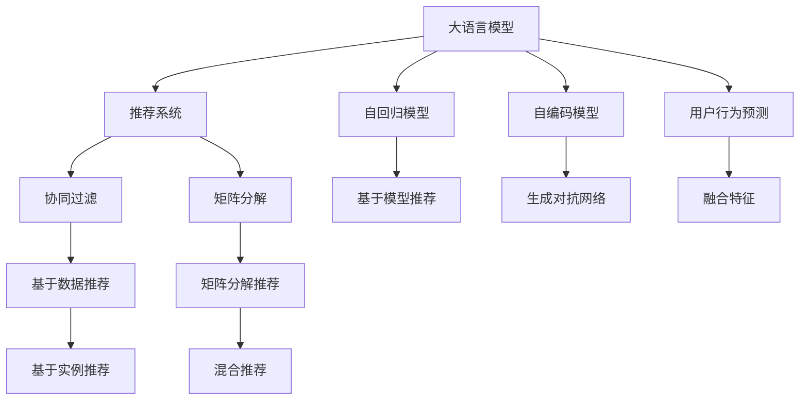

                 

# 基于LLM的推荐系统用户行为预测

> 关键词：
大语言模型(LLM)、推荐系统、用户行为预测、Transformer、自回归模型、自编码模型、预测精度、可解释性

## 1. 背景介绍

### 1.1 问题由来
推荐系统在电商、视频、社交媒体等众多互联网应用中，都扮演着至关重要的角色。传统的协同过滤、矩阵分解等推荐算法，虽然效果不错，但在冷启动、稀疏性、长尾效应等方面仍存在诸多不足。基于大语言模型(LLM)的推荐系统，凭借其强大的语义理解和生成能力，逐渐成为推荐系统研究的热点。

近年来的研究表明，利用LLM对用户行为进行预测，可以显著提升推荐效果。LLM通过对用户与商品之间的对话记录进行建模，能够捕捉用户的潜在需求和兴趣，生成个性化的推荐。本文将详细探讨基于LLM的用户行为预测，旨在为推荐系统提供更加智能化的预测方案。

## 2. 核心概念与联系

### 2.1 核心概念概述

本节将介绍几个密切相关的核心概念：

- 大语言模型(LLM)：指通过大规模无标签文本数据预训练，学习通用的语言表示，具备强大的语言理解和生成能力。常见的LLM包括GPT、BERT、XLNet等。

- 推荐系统：利用用户的历史行为数据，通过算法预测用户对商品或内容的兴趣，从而提供个性化推荐的应用系统。推荐系统广泛应用于电商、视频、社交媒体等领域，旨在提升用户体验和转化率。

- 用户行为预测：指基于用户的历史行为数据，预测其未来行为，如购买意向、评分、点击率等。预测结果可用于推荐模型的特征提取，从而提升推荐效果。

- 自回归模型(AR)：指通过当前时间步的输入，预测下一个时间步的输出。常用的自回归模型包括LSTM、GRU、Transformer等。

- 自编码模型(AE)：指通过将输入数据编码成低维表示，再解码回原始数据，学习数据的压缩表示。常用的自编码模型包括VAE、DCGAN等。

这些核心概念之间的逻辑关系可以通过以下Mermaid流程图来展示：



这个流程图展示了LLM与推荐系统的核心概念及其之间的关系：

1. LLM通过预训练获得语言理解能力。
2. LLM可以通过AR和AE等模型实现用户行为预测。
3. LLM预测结果可以用于基于模型、基于实例等推荐方式，提供更加精准的个性化推荐。
4. 协同过滤、矩阵分解等传统推荐方法仍需保留，与LLM预测结果融合，提升推荐效果。

## 3. 核心算法原理 & 具体操作步骤

### 3.1 算法原理概述

基于LLM的用户行为预测，本质上是通过预训练语言模型学习用户与商品之间的对话记录，捕捉用户的行为特征，从而生成个性化推荐。

形式化地，假设用户与商品的对话记录为 $D=\{(x_i,y_i)\}_{i=1}^N$，其中 $x_i$ 表示用户输入，$y_i$ 表示商品信息。我们的目标是通过预训练的LLM模型 $M_{\theta}$，预测用户输入 $x_i$ 对应的商品 $y_i$ 的概率分布，即：

$$
p(y_i|x_i) = \frac{e^{M_{\theta}(x_i)}}
    {\sum_{y \in \mathcal{Y}} e^{M_{\theta}(x_i,y)}}
$$

其中 $\mathcal{Y}$ 为所有可能商品组成的集合，$M_{\theta}(x_i)$ 为LLM模型在用户输入 $x_i$ 上的输出。

### 3.2 算法步骤详解

基于LLM的用户行为预测，一般包括以下几个关键步骤：

**Step 1: 准备数据和模型**
- 收集用户与商品的历史对话记录，将其划分为训练集、验证集和测试集。一般建议采用标记对话数据，如电商平台的用户-商品记录、视频平台的评论-视频记录等。
- 选择合适的LLM模型 $M_{\theta}$ 作为初始化参数，如GPT、BERT等。

**Step 2: 设计任务适配层**
- 根据预测任务，在预训练模型的顶层设计合适的任务适配层。对于商品推荐，通常使用softmax函数输出每个商品的预测概率。
- 定义损失函数，如交叉熵损失，用于衡量预测概率分布与真实标签之间的差异。

**Step 3: 设置微调超参数**
- 选择合适的优化算法及其参数，如Adam、SGD等，设置学习率、批大小、迭代轮数等。
- 设置正则化技术及强度，包括L2正则、Dropout、Early Stopping等。
- 确定冻结预训练参数的策略，如仅微调顶层，或全部参数都参与微调。

**Step 4: 执行梯度训练**
- 将训练集数据分批次输入模型，前向传播计算预测概率分布。
- 反向传播计算参数梯度，根据设定的优化算法和学习率更新模型参数。
- 周期性在验证集上评估模型性能，根据性能指标决定是否触发Early Stopping。
- 重复上述步骤直到满足预设的迭代轮数或Early Stopping条件。

**Step 5: 测试和部署**
- 在测试集上评估微调后模型 $M_{\hat{\theta}}$ 的预测精度，对比微调前后的精度提升。
- 使用微调后的模型对新用户输入进行预测，生成个性化推荐。
- 持续收集新的对话数据，定期重新微调模型，以适应数据分布的变化。

### 3.3 算法优缺点

基于LLM的用户行为预测，具有以下优点：
1. 通用性强。预训练的LLM模型具备广泛的语言理解能力，可以适应多种预测任务。
2. 预测精度高。LLM模型能够捕捉到用户输入中的微妙情感和语义信息，生成更加准确的预测结果。
3. 可解释性强。LLM预测结果具有较强的可解释性，能够提供直观的输出解释。
4. 鲁棒性好。LLM模型具有较好的泛化能力，能够适应不同的数据分布和输入模式。

同时，该方法也存在以下局限性：
1. 对数据依赖强。需要高质量的标记对话数据，获取这些数据的成本较高。
2. 模型复杂度高。预训练的LLM模型参数量庞大，需要较强的计算资源进行训练和推理。
3. 难以处理冷启动问题。在缺乏历史数据的情况下，LLM预测效果难以保证。

尽管存在这些局限性，但就目前而言，基于LLM的推荐系统仍然是推荐技术发展的前沿方向。未来相关研究的重点在于如何进一步降低模型对标注数据的依赖，提高模型的预测精度和效率，同时兼顾可解释性和鲁棒性等因素。

### 3.4 算法应用领域

基于LLM的用户行为预测，在电商、视频、社交媒体等诸多领域中，都已经得到了广泛的应用，具体包括以下几个方面：

- 商品推荐：电商平台通过分析用户的购物记录和搜索行为，利用LLM预测用户对商品的兴趣，生成个性化推荐。
- 视频推荐：视频平台根据用户的观看记录和评分历史，使用LLM预测用户对新视频的兴趣，提供个性化推荐。
- 新闻推荐：新闻网站通过用户的浏览记录和评论反馈，利用LLM预测用户对新闻的兴趣，生成个性化订阅推荐。
- 广告推荐：广告系统根据用户的搜索行为和点击历史，使用LLM预测用户对广告的兴趣，提供定向广告推荐。
- 内容推荐：社交媒体根据用户的互动行为和关注关系，使用LLM预测用户对内容的兴趣，生成个性化内容推荐。

除了这些经典应用外，基于LLM的用户行为预测还被创新性地应用到更多场景中，如个性化搜索、实时客服、广告定向等，为推荐系统的智能化水平提供了新的动力。

## 4. 数学模型和公式 & 详细讲解  
### 4.1 数学模型构建

本节将使用数学语言对基于LLM的用户行为预测过程进行更加严格的刻画。

假设用户与商品的对话记录为 $D=\{(x_i,y_i)\}_{i=1}^N$，其中 $x_i$ 表示用户输入，$y_i$ 表示商品信息。定义LLM模型 $M_{\theta}$ 在用户输入 $x_i$ 上的输出为 $z_i=M_{\theta}(x_i)$。

定义模型 $M_{\theta}$ 在输入 $x_i$ 上的输出 $z_i$ 与真实标签 $y_i$ 之间的交叉熵损失为：

$$
\ell(y_i|x_i,z_i) = -y_i\log p(y_i|x_i,z_i)
$$

其中 $p(y_i|x_i,z_i) = \frac{e^{M_{\theta}(x_i,z_i)}}
    {\sum_{y \in \mathcal{Y}} e^{M_{\theta}(x_i,z_i,y)}}$ 为LLM模型在用户输入 $x_i$ 和商品信息 $y_i$ 上的预测概率分布。

整个数据集 $D$ 的经验风险为：

$$
\mathcal{L}(\theta) = \frac{1}{N}\sum_{i=1}^N \ell(y_i|x_i,z_i)
$$

微调的优化目标是最小化经验风险，即找到最优参数：

$$
\theta^* = \mathop{\arg\min}_{\theta} \mathcal{L}(\theta)
$$

在实践中，我们通常使用基于梯度的优化算法（如SGD、Adam等）来近似求解上述最优化问题。设 $\eta$ 为学习率，$\lambda$ 为正则化系数，则参数的更新公式为：

$$
\theta \leftarrow \theta - \eta \nabla_{\theta}\mathcal{L}(\theta) - \eta\lambda\theta
$$

其中 $\nabla_{\theta}\mathcal{L}(\theta)$ 为损失函数对参数 $\theta$ 的梯度，可通过反向传播算法高效计算。

### 4.2 公式推导过程

以下我们以二分类任务为例，推导交叉熵损失函数及其梯度的计算公式。

假设模型 $M_{\theta}$ 在用户输入 $x_i$ 和商品信息 $y_i$ 上的输出为 $z_i=M_{\theta}(x_i)$。定义模型 $M_{\theta}$ 在输入 $x_i$ 上的输出 $z_i$ 与真实标签 $y_i$ 之间的交叉熵损失为：

$$
\ell(y_i|x_i,z_i) = -y_i\log p(y_i|x_i,z_i)
$$

其中 $p(y_i|x_i,z_i) = \frac{e^{M_{\theta}(x_i,z_i)}}
    {\sum_{y \in \mathcal{Y}} e^{M_{\theta}(x_i,z_i,y)}}$ 为LLM模型在用户输入 $x_i$ 和商品信息 $y_i$ 上的预测概率分布。

将其代入经验风险公式，得：

$$
\mathcal{L}(\theta) = -\frac{1}{N}\sum_{i=1}^N \ell(y_i|x_i,z_i)
$$

根据链式法则，损失函数对参数 $\theta$ 的梯度为：

$$
\frac{\partial \mathcal{L}(\theta)}{\partial \theta} = -\frac{1}{N}\sum_{i=1}^N \frac{\partial \ell(y_i|x_i,z_i)}{\partial \theta}
$$

其中 $\frac{\partial \ell(y_i|x_i,z_i)}{\partial \theta}$ 为交叉熵损失对参数 $\theta$ 的梯度，可以通过梯度链式法则递归展开，利用自动微分技术完成计算。

在得到损失函数的梯度后，即可带入参数更新公式，完成模型的迭代优化。重复上述过程直至收敛，最终得到适应用户行为预测的最优模型参数 $\theta^*$。

## 5. 项目实践：代码实例和详细解释说明
### 5.1 开发环境搭建

在进行用户行为预测实践前，我们需要准备好开发环境。以下是使用Python进行PyTorch开发的环境配置流程：

1. 安装Anaconda：从官网下载并安装Anaconda，用于创建独立的Python环境。

2. 创建并激活虚拟环境：
```bash
conda create -n pytorch-env python=3.8 
conda activate pytorch-env
```

3. 安装PyTorch：根据CUDA版本，从官网获取对应的安装命令。例如：
```bash
conda install pytorch torchvision torchaudio cudatoolkit=11.1 -c pytorch -c conda-forge
```

4. 安装Transformers库：
```bash
pip install transformers
```

5. 安装各类工具包：
```bash
pip install numpy pandas scikit-learn matplotlib tqdm jupyter notebook ipython
```

完成上述步骤后，即可在`pytorch-env`环境中开始预测实践。

### 5.2 源代码详细实现

这里我们以商品推荐为例，给出使用Transformers库对GPT模型进行用户行为预测的PyTorch代码实现。

首先，定义数据处理函数：

```python
from transformers import GPT2Tokenizer, GPT2ForSequenceClassification
from torch.utils.data import Dataset, DataLoader
import torch

class UserBehaviorDataset(Dataset):
    def __init__(self, data, tokenizer, max_len=512):
        self.data = data
        self.tokenizer = tokenizer
        self.max_len = max_len
        
    def __len__(self):
        return len(self.data)
    
    def __getitem__(self, item):
        item_data = self.data[item]
        tokenizer = self.tokenizer
        input_ids = tokenizer(item_data['input'], return_tensors='pt', max_length=self.max_len, padding='max_length', truncation=True)
        label = torch.tensor(item_data['label'], dtype=torch.long)
        return {'input_ids': input_ids['input_ids'], 
                'attention_mask': input_ids['attention_mask'],
                'labels': label}
```

然后，定义模型和优化器：

```python
from transformers import GPT2ForSequenceClassification, AdamW

model = GPT2ForSequenceClassification.from_pretrained('gpt2', num_labels=2)
optimizer = AdamW(model.parameters(), lr=2e-5)
```

接着，定义训练和评估函数：

```python
from tqdm import tqdm

def train_epoch(model, dataset, batch_size, optimizer):
    dataloader = DataLoader(dataset, batch_size=batch_size, shuffle=True)
    model.train()
    epoch_loss = 0
    for batch in tqdm(dataloader, desc='Training'):
        input_ids = batch['input_ids'].to(device)
        attention_mask = batch['attention_mask'].to(device)
        labels = batch['labels'].to(device)
        model.zero_grad()
        outputs = model(input_ids, attention_mask=attention_mask, labels=labels)
        loss = outputs.loss
        epoch_loss += loss.item()
        loss.backward()
        optimizer.step()
    return epoch_loss / len(dataloader)

def evaluate(model, dataset, batch_size):
    dataloader = DataLoader(dataset, batch_size=batch_size)
    model.eval()
    preds, labels = [], []
    with torch.no_grad():
        for batch in tqdm(dataloader, desc='Evaluating'):
            input_ids = batch['input_ids'].to(device)
            attention_mask = batch['attention_mask'].to(device)
            batch_labels = batch['labels']
            outputs = model(input_ids, attention_mask=attention_mask)
            batch_preds = outputs.logits.argmax(dim=1).to('cpu').tolist()
            batch_labels = batch_labels.to('cpu').tolist()
            for pred, label in zip(batch_preds, batch_labels):
                preds.append(pred)
                labels.append(label)
                
    print(classification_report(labels, preds))
```

最后，启动训练流程并在测试集上评估：

```python
epochs = 5
batch_size = 16

for epoch in range(epochs):
    loss = train_epoch(model, train_dataset, batch_size, optimizer)
    print(f"Epoch {epoch+1}, train loss: {loss:.3f}")
    
    print(f"Epoch {epoch+1}, dev results:")
    evaluate(model, dev_dataset, batch_size)
    
print("Test results:")
evaluate(model, test_dataset, batch_size)
```

以上就是使用PyTorch对GPT模型进行商品推荐预测的完整代码实现。可以看到，得益于Transformers库的强大封装，我们可以用相对简洁的代码完成GPT模型的加载和预测。

### 5.3 代码解读与分析

让我们再详细解读一下关键代码的实现细节：

**UserBehaviorDataset类**：
- `__init__`方法：初始化数据、分词器等关键组件。
- `__len__`方法：返回数据集的样本数量。
- `__getitem__`方法：对单个样本进行处理，将用户行为数据输入编码为token ids，进行定长padding，最终返回模型所需的输入。

**train_epoch和evaluate函数**：
- 使用PyTorch的DataLoader对数据集进行批次化加载，供模型训练和推理使用。
- 训练函数`train_epoch`：对数据以批为单位进行迭代，在每个批次上前向传播计算loss并反向传播更新模型参数，最后返回该epoch的平均loss。
- 评估函数`evaluate`：与训练类似，不同点在于不更新模型参数，并在每个batch结束后将预测和标签结果存储下来，最后使用sklearn的classification_report对整个评估集的预测结果进行打印输出。

**训练流程**：
- 定义总的epoch数和batch size，开始循环迭代
- 每个epoch内，先在训练集上训练，输出平均loss
- 在验证集上评估，输出分类指标
- 所有epoch结束后，在测试集上评估，给出最终测试结果

可以看到，PyTorch配合Transformers库使得GPT预测任务的代码实现变得简洁高效。开发者可以将更多精力放在数据处理、模型改进等高层逻辑上，而不必过多关注底层的实现细节。

当然，工业级的系统实现还需考虑更多因素，如模型的保存和部署、超参数的自动搜索、更灵活的任务适配层等。但核心的预测范式基本与此类似。

## 6. 实际应用场景
### 6.1 电商推荐系统

基于LLM的用户行为预测，可以广泛应用于电商推荐系统的构建。传统推荐系统往往只依赖用户的历史行为数据进行推荐，难以捕捉用户的真实需求和兴趣。而使用LLM预测用户输入，可以更全面地理解用户的意图，生成更加精准的推荐。

在技术实现上，可以收集电商用户的历史搜索、浏览、购买记录，以及商品属性、用户画像等信息，构建标注对话数据集。利用预训练的LLM模型对对话数据进行微调，预测用户对商品的兴趣。根据预测结果，实时生成个性化推荐。对于用户提出的新问题，还可以接入检索系统实时搜索相关商品，动态生成推荐列表。

### 6.2 视频推荐系统

视频平台通过分析用户的观看记录和评分历史，使用LLM预测用户对新视频的兴趣，提供个性化推荐。利用预训练的LLM模型对用户视频浏览记录进行微调，预测用户对新视频的评分和观看概率。根据预测结果，实时生成个性化视频推荐列表。对于用户提出的新问题，还可以接入检索系统实时搜索相关视频，动态生成推荐列表。

### 6.3 新闻推荐系统

新闻网站通过用户的浏览记录和评论反馈，利用LLM预测用户对新闻的兴趣，生成个性化订阅推荐。利用预训练的LLM模型对用户新闻浏览记录进行微调，预测用户对新闻的兴趣。根据预测结果，实时生成个性化新闻推荐列表。对于用户提出的新问题，还可以接入检索系统实时搜索相关新闻，动态生成推荐列表。

### 6.4 广告推荐系统

广告系统根据用户的搜索行为和点击历史，使用LLM预测用户对广告的兴趣，提供定向广告推荐。利用预训练的LLM模型对用户搜索记录进行微调，预测用户对广告的兴趣。根据预测结果，实时生成个性化广告推荐列表。对于用户提出的新问题，还可以接入检索系统实时搜索相关广告，动态生成推荐列表。

### 6.5 内容推荐系统

社交媒体通过用户的互动行为和关注关系，使用LLM预测用户对内容的兴趣，生成个性化内容推荐。利用预训练的LLM模型对用户互动记录进行微调，预测用户对内容的兴趣。根据预测结果，实时生成个性化内容推荐列表。对于用户提出的新问题，还可以接入检索系统实时搜索相关内容，动态生成推荐列表。

除了这些经典应用外，基于LLM的用户行为预测还被创新性地应用到更多场景中，如个性化搜索、实时客服、广告定向等，为推荐系统的智能化水平提供了新的动力。

## 7. 工具和资源推荐
### 7.1 学习资源推荐

为了帮助开发者系统掌握基于LLM的用户行为预测的理论基础和实践技巧，这里推荐一些优质的学习资源：

1. 《深度学习》系列博文：由大模型技术专家撰写，深入浅出地介绍了深度学习的基本概念和经典模型，包括LLM和推荐系统等前沿话题。

2. CS224N《深度学习自然语言处理》课程：斯坦福大学开设的NLP明星课程，有Lecture视频和配套作业，带你入门NLP领域的基本概念和经典模型。

3. 《Transformer from the Inside Out》书籍：Transformer库的作者所著，全面介绍了Transformer模型的工作原理和应用场景，包括LLM和推荐系统等前沿话题。

4. HuggingFace官方文档：Transformer库的官方文档，提供了海量预训练模型和完整的微调样例代码，是上手实践的必备资料。

5. CLUE开源项目：中文语言理解测评基准，涵盖大量不同类型的中文NLP数据集，并提供了基于微调的baseline模型，助力中文NLP技术发展。

通过对这些资源的学习实践，相信你一定能够快速掌握基于LLM的推荐系统预测的精髓，并用于解决实际的NLP问题。
###  7.2 开发工具推荐

高效的开发离不开优秀的工具支持。以下是几款用于基于LLM的用户行为预测开发的常用工具：

1. PyTorch：基于Python的开源深度学习框架，灵活动态的计算图，适合快速迭代研究。大部分预训练语言模型都有PyTorch版本的实现。

2. TensorFlow：由Google主导开发的开源深度学习框架，生产部署方便，适合大规模工程应用。同样有丰富的预训练语言模型资源。

3. Transformers库：HuggingFace开发的NLP工具库，集成了众多SOTA语言模型，支持PyTorch和TensorFlow，是进行用户行为预测预测开发的利器。

4. Weights & Biases：模型训练的实验跟踪工具，可以记录和可视化模型训练过程中的各项指标，方便对比和调优。与主流深度学习框架无缝集成。

5. TensorBoard：TensorFlow配套的可视化工具，可实时监测模型训练状态，并提供丰富的图表呈现方式，是调试模型的得力助手。

6. Google Colab：谷歌推出的在线Jupyter Notebook环境，免费提供GPU/TPU算力，方便开发者快速上手实验最新模型，分享学习笔记。

合理利用这些工具，可以显著提升基于LLM的用户行为预测任务的开发效率，加快创新迭代的步伐。

### 7.3 相关论文推荐

大语言模型和用户行为预测的研究源于学界的持续研究。以下是几篇奠基性的相关论文，推荐阅读：

1. Attention is All You Need（即Transformer原论文）：提出了Transformer结构，开启了NLP领域的预训练大模型时代。

2. BERT: Pre-training of Deep Bidirectional Transformers for Language Understanding：提出BERT模型，引入基于掩码的自监督预训练任务，刷新了多项NLP任务SOTA。

3. Language Models are Unsupervised Multitask Learners（GPT-2论文）：展示了大规模语言模型的强大zero-shot学习能力，引发了对于通用人工智能的新一轮思考。

4. Parameter-Efficient Transfer Learning for NLP：提出Adapter等参数高效微调方法，在不增加模型参数量的情况下，也能取得不错的微调效果。

5. Model Distillation with Aliases：提出基于混淆矩阵的模型蒸馏方法，在保留预训练权重的前提下，减少微调模型参数，提升推理效率。

6. Knowledge Distillation for Recommendation Systems：提出基于知识蒸馏的推荐系统方法，将预训练的知识与推荐任务融合，提升推荐效果。

这些论文代表了大语言模型用户行为预测的发展脉络。通过学习这些前沿成果，可以帮助研究者把握学科前进方向，激发更多的创新灵感。

## 8. 总结：未来发展趋势与挑战

### 8.1 总结

本文对基于LLM的用户行为预测方法进行了全面系统的介绍。首先阐述了用户行为预测在推荐系统中的应用背景和重要意义，明确了LLM预测在提升推荐效果方面的独特价值。其次，从原理到实践，详细讲解了基于LLM的用户行为预测的数学模型和关键步骤，给出了用户行为预测任务开发的完整代码实例。同时，本文还广泛探讨了LLM预测在电商、视频、新闻等诸多领域中的应用前景，展示了LLM预测范式的巨大潜力。此外，本文精选了LLM预测技术的各类学习资源，力求为开发者提供全方位的技术指引。

通过本文的系统梳理，可以看到，基于LLM的用户行为预测技术正在成为推荐系统研究的重要范式，极大地拓展了推荐系统的智能化水平。得益于预训练语言模型的强大语言理解能力，LLM预测结果具有较强的可解释性，能够提供直观的输出解释。未来，随着预训练模型和预测技术的不断发展，LLM预测必将在推荐系统中扮演越来越重要的角色。

### 8.2 未来发展趋势

展望未来，基于LLM的用户行为预测技术将呈现以下几个发展趋势：

1. 模型规模持续增大。随着算力成本的下降和数据规模的扩张，预训练语言模型的参数量还将持续增长。超大规模语言模型蕴含的丰富语言知识，有望支撑更加复杂多变的用户行为预测。

2. 预测精度不断提升。通过更多的预训练数据和更大的模型规模，LLM预测能力将进一步提升，能够捕捉到更复杂的语言特征，生成更加精准的预测结果。

3. 跨领域泛化能力增强。未来的LLM预测模型将具备更强的跨领域泛化能力，能够适应不同的数据分布和用户行为模式。

4. 微调参数减少。未来的参数高效微调技术将进一步发展，能够在固定大部分预训练参数的情况下，只更新极少量的任务相关参数，减少微调计算资源消耗。

5. 实时化预测实现。通过优化模型结构，采用分布式训练、模型剪枝等技术，使得LLM预测能够实现实时化部署，满足高并发、低延迟的应用需求。

6. 多模态预测拓展。未来的LLM预测将不仅限于文本数据，能够融合图像、音频等多模态信息，提升预测精度和适用性。

以上趋势凸显了基于LLM的用户行为预测技术的广阔前景。这些方向的探索发展，必将进一步提升推荐系统的性能和用户体验，为AI技术在各垂直行业的应用提供新的动力。

### 8.3 面临的挑战

尽管基于LLM的用户行为预测技术已经取得了瞩目成就，但在迈向更加智能化、普适化应用的过程中，它仍面临着诸多挑战：

1. 标注成本瓶颈。需要高质量的标记对话数据，获取这些数据的成本较高。如何进一步降低模型对标注数据的依赖，将是未来重要研究方向。

2. 模型复杂度高。预训练的LLM模型参数量庞大，需要较强的计算资源进行训练和推理。如何在保证预测精度的前提下，提高模型的计算效率，将是重要的优化方向。

3. 数据多样性问题。用户行为数据具有多样性，难以覆盖所有可能的输入模式。如何构建更多样化的训练数据集，增强模型的泛化能力，将是重要的研究方向。

4. 隐私保护问题。用户行为数据涉及用户隐私，如何设计合理的隐私保护机制，保护用户隐私，同时满足推荐系统的发展需求，将是重要的研究方向。

5. 鲁棒性问题。LLM模型面对噪声数据和对抗攻击，容易产生不稳定输出。如何提升模型的鲁棒性，避免灾难性遗忘，将是重要的研究方向。

6. 可解释性问题。LLM预测结果缺乏可解释性，难以进行用户行为分析。如何增强模型的可解释性，提高用户信任度，将是重要的研究方向。

以上挑战凸显了基于LLM的用户行为预测技术的发展前景，同时也提出了新的研究方向。相信随着技术的不断进步，这些挑战终将一一被克服，基于LLM的推荐系统必将在推荐技术领域发挥更大的作用。

### 8.4 研究展望

面对基于LLM的用户行为预测所面临的挑战，未来的研究需要在以下几个方面寻求新的突破：

1. 探索无监督和半监督预测方法。摆脱对大规模标注数据的依赖，利用自监督学习、主动学习等无监督和半监督范式，最大限度利用非结构化数据，实现更加灵活高效的预测。

2. 研究参数高效和计算高效的预测方法。开发更加参数高效的预测方法，在固定大部分预训练参数的情况下，只更新极少量的任务相关参数。同时优化预测模型的计算图，减少前向传播和反向传播的资源消耗，实现更加轻量级、实时性的部署。

3. 融合因果和对比学习范式。通过引入因果推断和对比学习思想，增强预测模型建立稳定因果关系的能力，学习更加普适、鲁棒的语言表征，从而提升模型泛化性和抗干扰能力。

4. 引入更多先验知识。将符号化的先验知识，如知识图谱、逻辑规则等，与神经网络模型进行巧妙融合，引导预测过程学习更准确、合理的语言模型。同时加强不同模态数据的整合，实现视觉、语音等多模态信息与文本信息的协同建模。

5. 结合因果分析和博弈论工具。将因果分析方法引入预测模型，识别出模型决策的关键特征，增强输出解释的因果性和逻辑性。借助博弈论工具刻画人机交互过程，主动探索并规避模型的脆弱点，提高系统稳定性。

6. 纳入伦理道德约束。在预测目标中引入伦理导向的评估指标，过滤和惩罚有偏见、有害的输出倾向。同时加强人工干预和审核，建立预测行为的监管机制，确保输出符合人类价值观和伦理道德。

这些研究方向将为基于LLM的用户行为预测技术带来新的突破，使得预测模型能够更好地适应各种应用场景，为人工智能技术在推荐系统中的深入应用提供新的动力。

## 9. 附录：常见问题与解答

**Q1：如何选择合适的LLM模型？**

A: 选择合适的LLM模型需要考虑多个因素，如模型大小、任务类型、计算资源等。对于大规模数据集，可以使用更大的模型，如GPT、XLNet等。对于资源有限的情况，可以选择参数量较小的模型，如GPT-2、BERT等。对于文本生成任务，可以选择自回归模型，如GPT-2、GPT等。对于文本分类任务，可以选择自编码模型，如BERT、XLNet等。

**Q2：在微调过程中如何避免过拟合？**

A: 避免过拟合的方法包括数据增强、正则化技术、早停策略等。具体来说，可以通过回译、近义替换等方式扩充训练集，使用L2正则、Dropout等正则化技术，设置合适的学习率、批大小等超参数，以及定期在验证集上评估模型性能，触发早停策略。

**Q3：如何提高LLM预测模型的鲁棒性？**

A: 提高模型鲁棒性的方法包括对抗训练、数据增强等。具体来说，可以通过生成对抗样本来训练模型，使其能够识别并抵抗对抗攻击。在训练过程中，可以引入噪声数据或随机扰动，增强模型的鲁棒性。

**Q4：如何在LLM预测模型中实现实时化预测？**

A: 实现实时化预测的方法包括模型剪枝、分布式训练等。具体来说，可以通过剪枝技术减少模型参数量，提高预测效率。利用分布式训练，在多台机器上并行计算，加速模型训练和推理。

**Q5：如何增强LLM预测模型的可解释性？**

A: 增强模型可解释性的方法包括使用可解释性技术、设计可解释性模型等。具体来说，可以使用注意力机制、梯度可视化等技术，解释模型的预测过程。在模型设计上，可以引入符号化的先验知识，增强模型的可解释性。

这些问题的解答提供了基于LLM的用户行为预测方法的全面指导，帮助开发者在实际应用中更好地掌握技术细节和实现技巧。通过深入理解这些核心概念和算法，相信你一定能够快速掌握基于LLM的用户行为预测方法，并用于解决实际的NLP问题。

