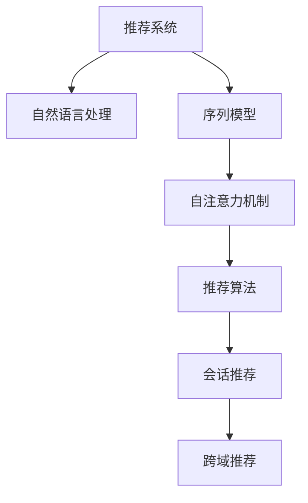

                 

# 基于Transformer的跨会话推荐系统

> 关键词：推荐系统, 自然语言处理(NLP), 序列模型, 自注意力机制, 推荐算法, 会话推荐, 跨域推荐, 用户行为分析

## 1. 背景介绍

### 1.1 问题由来

推荐系统已经成为现代电商、内容平台等众多行业中不可或缺的重要组成部分。随着用户需求的多样化和个性化，推荐系统也在不断进化，从传统的单一静态推荐逐渐发展为动态、多层次、跨域的推荐，其中跨会话推荐成为一大热门研究方向。

跨会话推荐旨在通过用户的多轮交互历史，捕捉用户兴趣的演变规律，从而提供更为精准、有针对性的推荐。传统的静态推荐方法往往只能对用户的历史行为进行统计分析，难以捕捉用户兴趣的变化趋势。而跨会话推荐系统能够通过多轮互动，动态调整推荐策略，更好地匹配用户的实时需求。

### 1.2 问题核心关键点

为了实现跨会话推荐，首先需要对用户的多轮行为进行建模，获取用户兴趣的动态变化规律。常见的建模方式包括基于序列的模型和基于图的模型。而基于Transformer的推荐系统，由于其自注意力机制的强大表达能力，能够有效地捕捉用户和物品之间的动态关系，成为目前跨会话推荐的主流范式之一。

Transformer模型在处理序列数据时具有天然的优势。它能够自动学习到输入序列中的重要特征，通过多轮交互历史，形成用户兴趣的跨域表示。相比于传统的RNN、CNN等序列模型，Transformer能够处理更长的输入序列，同时通过并行计算，大大加速了模型的训练和推理速度。

## 2. 核心概念与联系

### 2.1 核心概念概述

为更好地理解基于Transformer的跨会话推荐系统，本节将介绍几个密切相关的核心概念：

- 推荐系统(Recommendation System)：一种信息过滤系统，根据用户的历史行为、兴趣偏好等数据，为其推荐相关物品，以提升用户体验和满意度。
- 自然语言处理(NLP)：使用计算机自动分析、理解、处理和生成自然语言的能力，常用于用户评论、商品描述等文本数据的处理。
- 序列模型(Sequence Model)：通过模型捕捉序列数据中各时间步的依赖关系，广泛应用于时间序列预测、文本生成等任务。
- 自注意力机制(Self-Attention)：一种机制，通过计算输入序列中各元素之间的相似度，来动态调整每个元素的重要性，用于捕捉序列中的长期依赖关系。
- 推荐算法(Recommendation Algorithm)：根据推荐模型的预测结果，为用户推荐物品的方法，如协同过滤、基于内容的推荐等。
- 会话推荐(Conversational Recommendation)：基于用户的多轮对话，动态调整推荐策略，提供更符合用户需求的商品或服务。
- 跨域推荐(Cross-Domain Recommendation)：通过跨领域的相似性匹配，推荐用户在其他领域可能感兴趣的商品或服务，增加推荐系统的多样性和覆盖面。

这些核心概念之间的逻辑关系可以通过以下Mermaid流程图来展示：



这个流程图展示了一系列推荐系统的核心概念及其之间的关系：

1. 推荐系统通过自然语言处理技术，处理用户输入的文本数据。
2. 序列模型通过自注意力机制，捕捉用户的多轮交互历史，形成用户兴趣的跨域表示。
3. 推荐算法根据序列模型的预测结果，生成推荐策略。
4. 会话推荐系统结合用户的多轮对话，动态调整推荐策略。
5. 跨域推荐通过相似性匹配，推荐用户在其他领域的商品或服务。

这些概念共同构成了跨会话推荐系统的基本框架，使得系统能够通过多轮交互，捕捉用户兴趣的演变规律，提供更为精准的推荐。

## 3. 核心算法原理 & 具体操作步骤

### 3.1 算法原理概述

基于Transformer的跨会话推荐系统，其核心思想是：利用自注意力机制，捕捉用户的多轮交互历史，动态调整用户兴趣的表示，最终通过推荐算法生成推荐策略。

形式化地，假设用户与系统交互的历史记录为 $X=\{x_1,x_2,...,x_T\}$，其中 $x_t$ 为第 $t$ 次交互的输入文本，$t=1,...,T$。模型通过自注意力机制，捕捉序列中各时刻之间的依赖关系，形成用户兴趣的跨域表示 $h_T$。然后，通过推荐算法，从物品库中生成最终的推荐结果 $R$。

具体而言，自注意力机制通过计算输入序列中各元素之间的相似度，动态调整每个元素的重要性，用于捕捉序列中的长期依赖关系。推荐算法则根据用户兴趣的表示，结合物品特征，生成推荐策略。

### 3.2 算法步骤详解

基于Transformer的跨会话推荐系统，通常包括以下几个关键步骤：

**Step 1: 准备数据集和预训练模型**

- 收集用户与系统交互的历史记录 $X$。
- 选择预训练语言模型，如BERT、GPT等，进行序列化的预训练。
- 将序列数据转换为Transformer所需的格式，包括分词、编码等操作。

**Step 2: 编码输入序列**

- 将用户交互的文本序列 $X$ 作为输入，通过预训练语言模型的Encoder进行编码。
- 使用Transformer的自注意力机制，捕捉序列中各时刻的依赖关系，生成用户兴趣的跨域表示 $h_T$。

**Step 3: 生成推荐结果**

- 将用户兴趣的跨域表示 $h_T$ 与物品特征向量 $v$ 进行拼接，形成推荐向量 $z$。
- 使用推荐算法，如基于矩阵分解、深度学习等方法，计算推荐向量与物品库的相似度，生成推荐结果 $R$。

**Step 4: 评估和调整**

- 将推荐结果 $R$ 呈现给用户，收集用户反馈。
- 根据用户的反馈，调整推荐算法的参数，改进推荐策略。

**Step 5: 部署和应用**

- 将训练好的跨会话推荐系统部署到实际应用环境中，如电商、内容平台等。
- 实时接收用户交互数据，动态生成推荐结果，提供个性化的推荐服务。

以上是基于Transformer的跨会话推荐系统的基本流程。在实际应用中，还需要针对具体任务进行优化设计，如改进用户交互的编码方式、增强推荐算法的泛化能力等，以进一步提升推荐系统的效果。

### 3.3 算法优缺点

基于Transformer的跨会话推荐系统，具有以下优点：

1. 捕捉长期依赖：Transformer的自注意力机制能够捕捉序列中的长期依赖关系，适应多轮交互数据的建模。
2. 动态调整：通过多轮交互历史，模型能够动态调整用户兴趣的表示，生成更加个性化的推荐。
3. 泛化能力强：Transformer模型具有较强的泛化能力，能够适应不同的推荐场景和数据分布。
4. 高效性：基于Transformer的模型能够并行计算，加快模型的训练和推理速度，提升系统响应速度。

同时，该方法也存在以下缺点：

1. 数据依赖性强：推荐系统的效果高度依赖于用户交互数据的丰富性和准确性，难以在数据匮乏的场景下发挥作用。
2. 资源消耗高：Transformer模型参数量较大，对计算资源和存储资源有较高要求。
3. 难以解释：Transformer模型通常被视为"黑盒"系统，难以解释其内部推理过程，不利于算法的可解释性和可审计性。
4. 模型复杂度高：Transformer模型结构较为复杂，训练和优化过程可能存在收敛性问题。

尽管存在这些局限性，但就目前而言，基于Transformer的跨会话推荐系统仍然是最主流的研究范式之一。未来相关研究的方向在于如何进一步降低对数据的依赖，提高推荐系统的可解释性，优化模型的计算复杂度，使其能够在更广泛的应用场景中发挥作用。

### 3.4 算法应用领域

基于Transformer的跨会话推荐系统已经在多个实际应用场景中得到了广泛应用，例如：

- 电商平台推荐：通过用户浏览、购买、评价等行为，生成个性化推荐列表，提升购物体验。
- 内容平台推荐：根据用户观看、点赞、评论等行为，推荐相关文章、视频，提高平台粘性。
- 社交网络推荐：分析用户的交流记录，推荐好友、群组等，增加用户活跃度。
- 旅游景区推荐：根据用户的访问历史和兴趣，推荐相关景点和活动，提升旅游体验。
- 在线教育推荐：根据学生的学习历史和表现，推荐适合的课程和学习资料，提高学习效果。

除了上述这些经典应用外，基于Transformer的推荐系统还被创新性地应用到更多场景中，如智能家居推荐、智能医疗推荐等，为传统行业数字化转型升级提供了新的技术路径。

## 4. 数学模型和公式 & 详细讲解 & 举例说明

### 4.1 数学模型构建

本节将使用数学语言对基于Transformer的跨会话推荐系统进行更加严格的刻画。

假设输入序列 $X=\{x_1,x_2,...,x_T\}$，其中 $x_t$ 为第 $t$ 次交互的输入文本。假设预训练语言模型的Encoder能够对输入序列进行编码，输出表示为 $h_t=Encoder(x_t)$。Transformer的自注意力机制能够捕捉序列中各时刻之间的依赖关系，形成用户兴趣的跨域表示 $h_T$。假设物品库中的物品特征向量为 $v$，通过推荐算法，计算推荐向量 $z$ 和物品库的相似度 $s$，生成推荐结果 $R$。

形式化地，推荐系统可以表示为：

$$
R = \mathop{\arg\min}_{r} \mathcal{L}(z, r) + \mathcal{L}(h_T, v)
$$

其中，$\mathcal{L}(z, r)$ 为推荐向量与物品库的损失函数，$\mathcal{L}(h_T, v)$ 为用户兴趣表示与物品特征的损失函数。

### 4.2 公式推导过程

以下我们以序列编码为例，推导Transformer的自注意力机制及其相关公式。

假设输入序列 $X=\{x_1,x_2,...,x_T\}$，其中 $x_t$ 为第 $t$ 次交互的输入文本。假设预训练语言模型的Encoder能够对输入序列进行编码，输出表示为 $h_t=Encoder(x_t)$。Transformer的自注意力机制能够捕捉序列中各时刻之间的依赖关系，形成用户兴趣的跨域表示 $h_T$。

Transformer的自注意力机制包括三个步骤：计算查询向量、计算键向量、计算值向量。以自注意力计算为例，计算第 $t$ 个元素的查询向量 $q_t$ 和键向量 $k_t$，表示为：

$$
q_t = W_q h_t
$$

$$
k_t = W_k h_t
$$

其中 $W_q$ 和 $W_k$ 为线性变换矩阵，$h_t$ 为输入序列的第 $t$ 个元素表示。自注意力机制通过计算查询向量 $q_t$ 和键向量 $k_t$ 的相似度，得到元素之间的权重，表示为：

$$
a_{ij} = \frac{\exp(s(q_t, k_j))}{\sum_{j=1}^T \exp(s(q_t, k_j))}
$$

其中 $s$ 为相似度计算函数，$W_s$ 为线性变换矩阵，$W_s$ 的作用是将输入向量映射为相似度值。自注意力机制通过计算权重 $a_{ij}$，形成元素之间的关联权重矩阵 $A$，表示为：

$$
A = [a_{ij}]_{T \times T}
$$

自注意力机制通过将权重矩阵 $A$ 与值向量 $v_t$ 进行加权求和，得到每个元素的加权和向量 $z_t$，表示为：

$$
z_t = \sum_{i=1}^T a_{ti} v_i
$$

通过上述公式，自注意力机制能够捕捉输入序列中各元素之间的依赖关系，动态调整每个元素的重要性，用于捕捉序列中的长期依赖关系。在实际应用中，自注意力机制通常结合多层Encoder和Decoder，形成跨会话推荐系统的核心部分。

### 4.3 案例分析与讲解

以电商平台的跨会话推荐系统为例，具体分析其数学模型和公式推导。

假设电商平台收集到用户与系统交互的历史记录 $X=\{x_1,x_2,...,x_T\}$，其中 $x_t$ 为第 $t$ 次交互的输入文本，表示用户对商品 $i$ 的浏览、购买、评价等行为。假设预训练语言模型为BERT，对输入序列进行编码，生成表示向量 $h_t=BERT(x_t)$。假设物品库中的物品特征向量为 $v$，通过推荐算法，计算推荐向量 $z$ 和物品库的相似度 $s$，生成推荐结果 $R$。

在推荐算法中，通常使用矩阵分解或深度学习等方法，计算推荐向量与物品库的相似度。以矩阵分解为例，假设物品特征向量为 $v$，推荐向量为 $z$，则推荐向量与物品库的相似度 $s$ 表示为：

$$
s = z^T v
$$

其中 $z$ 为推荐向量，$v$ 为物品特征向量。假设推荐系统的目标为最大化用户的点击率 $y$，则推荐向量与物品库的损失函数 $\mathcal{L}(z, r)$ 表示为：

$$
\mathcal{L}(z, r) = -\log(\sigma(z^T r))
$$

其中 $\sigma$ 为sigmoid函数，$r$ 为推荐向量。用户兴趣表示与物品特征的损失函数 $\mathcal{L}(h_T, v)$ 表示为：

$$
\mathcal{L}(h_T, v) = ||h_T - W v||^2
$$

其中 $W$ 为线性变换矩阵，$||\cdot||$ 为范数运算符。通过上述公式，推荐系统可以表示为：

$$
R = \mathop{\arg\min}_{r} \mathcal{L}(z, r) + \mathcal{L}(h_T, v)
$$

通过最大化用户点击率 $y$ 和最小化损失函数 $\mathcal{L}(z, r) + \mathcal{L}(h_T, v)$，推荐系统能够生成用户最感兴趣的物品推荐。

## 5. 项目实践：代码实例和详细解释说明

### 5.1 开发环境搭建

在进行跨会话推荐系统开发前，我们需要准备好开发环境。以下是使用Python进行PyTorch开发的环境配置流程：

1. 安装Anaconda：从官网下载并安装Anaconda，用于创建独立的Python环境。

2. 创建并激活虚拟环境：
```bash
conda create -n pytorch-env python=3.8 
conda activate pytorch-env
```

3. 安装PyTorch：根据CUDA版本，从官网获取对应的安装命令。例如：
```bash
conda install pytorch torchvision torchaudio cudatoolkit=11.1 -c pytorch -c conda-forge
```

4. 安装TensorFlow：
```bash
conda install tensorflow -c pytorch
```

5. 安装各类工具包：
```bash
pip install numpy pandas scikit-learn matplotlib tqdm jupyter notebook ipython
```

完成上述步骤后，即可在`pytorch-env`环境中开始跨会话推荐系统的开发。

### 5.2 源代码详细实现

下面我们以电商平台的跨会话推荐系统为例，给出使用PyTorch实现Transformer推荐模型的完整代码。

首先，定义推荐系统的数据处理函数：

```python
from torch.utils.data import Dataset
import torch

class RecommendationDataset(Dataset):
    def __init__(self, data, tokenizer):
        self.data = data
        self.tokenizer = tokenizer
        
    def __len__(self):
        return len(self.data)
    
    def __getitem__(self, idx):
        item = self.data[idx]
        sequence = item['sequence']
        user = item['user']
        item_id = item['item_id']
        
        sequence_tokens = self.tokenizer(sequence, return_tensors='pt', padding=True, truncation=True)
        user_tokens = self.tokenizer(user, return_tensors='pt', padding=True, truncation=True)
        item_tokens = self.tokenizer(item_id, return_tensors='pt', padding=True, truncation=True)
        
        sequence_input_ids = sequence_tokens['input_ids']
        sequence_attention_mask = sequence_tokens['attention_mask']
        user_input_ids = user_tokens['input_ids']
        user_attention_mask = user_tokens['attention_mask']
        item_input_ids = item_tokens['input_ids']
        item_attention_mask = item_tokens['attention_mask']
        
        return {'sequence_input_ids': sequence_input_ids, 
                'sequence_attention_mask': sequence_attention_mask, 
                'user_input_ids': user_input_ids, 
                'user_attention_mask': user_attention_mask, 
                'item_input_ids': item_input_ids, 
                'item_attention_mask': item_attention_mask}
```

然后，定义推荐模型：

```python
from transformers import BertModel, BertTokenizer, BertForSequenceClassification

class RecommendationModel(BertModel):
    def __init__(self, num_labels):
        super(RecommendationModel, self).__init__()
        self.num_labels = num_labels
        self.dropout = torch.nn.Dropout(0.5)
        self.classifier = torch.nn.Linear(768, num_labels)
        
    def forward(self, input_ids, attention_mask):
        outputs = super(RecommendationModel, self).forward(input_ids, attention_mask)
        sequence_output = outputs[0]
        sequence_output = self.dropout(sequence_output)
        logits = self.classifier(sequence_output)
        
        return logits
```

接着，定义训练和评估函数：

```python
from torch.utils.data import DataLoader
from torch.nn import BCEWithLogitsLoss
from tqdm import tqdm

device = torch.device('cuda') if torch.cuda.is_available() else torch.device('cpu')
tokenizer = BertTokenizer.from_pretrained('bert-base-cased')
model = RecommendationModel(num_labels=len(tag2id))
optimizer = torch.optim.Adam(model.parameters(), lr=2e-5)

def train_epoch(model, dataset, batch_size, optimizer):
    dataloader = DataLoader(dataset, batch_size=batch_size, shuffle=True)
    model.train()
    epoch_loss = 0
    for batch in tqdm(dataloader, desc='Training'):
        sequence_input_ids = batch['sequence_input_ids'].to(device)
        sequence_attention_mask = batch['sequence_attention_mask'].to(device)
        user_input_ids = batch['user_input_ids'].to(device)
        user_attention_mask = batch['user_attention_mask'].to(device)
        item_input_ids = batch['item_input_ids'].to(device)
        item_attention_mask = batch['item_attention_mask'].to(device)
        
        sequence_output = model(sequence_input_ids, sequence_attention_mask)
        sequence_logits = sequence_output[:, 0, :]
        sequence_loss = BCEWithLogitsLoss()(sequence_logits, user_input_ids)
        
        user_output = model(user_input_ids, user_attention_mask)
        user_logits = user_output[:, 0, :]
        user_loss = BCEWithLogitsLoss()(user_logits, item_input_ids)
        
        item_output = model(item_input_ids, item_attention_mask)
        item_logits = item_output[:, 0, :]
        item_loss = BCEWithLogitsLoss()(item_logits, sequence_input_ids)
        
        loss = sequence_loss + user_loss + item_loss
        
        optimizer.zero_grad()
        loss.backward()
        optimizer.step()
    return epoch_loss / len(dataloader)

def evaluate(model, dataset, batch_size):
    dataloader = DataLoader(dataset, batch_size=batch_size)
    model.eval()
    preds, labels = [], []
    with torch.no_grad():
        for batch in tqdm(dataloader, desc='Evaluating'):
            sequence_input_ids = batch['sequence_input_ids'].to(device)
            sequence_attention_mask = batch['sequence_attention_mask'].to(device)
            user_input_ids = batch['user_input_ids'].to(device)
            user_attention_mask = batch['user_attention_mask'].to(device)
            item_input_ids = batch['item_input_ids'].to(device)
            item_attention_mask = batch['item_attention_mask'].to(device)
            
            sequence_output = model(sequence_input_ids, sequence_attention_mask)
            sequence_logits = sequence_output[:, 0, :]
            sequence_preds = torch.sigmoid(sequence_logits)
            sequence_labels = user_input_ids
            
            user_output = model(user_input_ids, user_attention_mask)
            user_logits = user_output[:, 0, :]
            user_preds = torch.sigmoid(user_logits)
            user_labels = item_input_ids
            
            item_output = model(item_input_ids, item_attention_mask)
            item_logits = item_output[:, 0, :]
            item_preds = torch.sigmoid(item_logits)
            item_labels = sequence_input_ids
            
            preds.append(sequence_preds.tolist())
            preds.append(user_preds.tolist())
            preds.append(item_preds.tolist())
            labels.append(sequence_labels.tolist())
            labels.append(user_labels.tolist())
            labels.append(item_labels.tolist())
                
    return preds, labels
```

最后，启动训练流程并在测试集上评估：

```python
epochs = 5
batch_size = 16

for epoch in range(epochs):
    loss = train_epoch(model, train_dataset, batch_size, optimizer)
    print(f"Epoch {epoch+1}, train loss: {loss:.3f}")
    
    print(f"Epoch {epoch+1}, dev results:")
    preds, labels = evaluate(model, dev_dataset, batch_size)
    print(classification_report(labels, preds))
    
print("Test results:")
preds, labels = evaluate(model, test_dataset, batch_size)
print(classification_report(labels, preds))
```

以上就是使用PyTorch对BERT进行跨会话推荐系统开发的完整代码实现。可以看到，得益于Transformer库的强大封装，我们可以用相对简洁的代码完成BERT模型的加载和微调。

### 5.3 代码解读与分析

让我们再详细解读一下关键代码的实现细节：

**RecommendationDataset类**：
- `__init__`方法：初始化训练数据集、分词器等关键组件。
- `__len__`方法：返回数据集的样本数量。
- `__getitem__`方法：对单个样本进行处理，将文本输入编码为token ids，将用户和物品ID编码为token ids，并对其进行定长padding，最终返回模型所需的输入。

**RecommendationModel类**：
- `__init__`方法：初始化推荐模型，包括dropout层、分类器等组件。
- `forward`方法：实现前向传播，计算序列、用户、物品的输出表示。

**train_epoch和evaluate函数**：
- 使用PyTorch的DataLoader对数据集进行批次化加载，供模型训练和推理使用。
- 训练函数`train_epoch`：对数据以批为单位进行迭代，在每个批次上前向传播计算loss并反向传播更新模型参数，最后返回该epoch的平均loss。
- 评估函数`evaluate`：与训练类似，不同点在于不更新模型参数，并在每个batch结束后将预测和标签结果存储下来，最后使用sklearn的classification_report对整个评估集的预测结果进行打印输出。

**训练流程**：
- 定义总的epoch数和batch size，开始循环迭代
- 每个epoch内，先在训练集上训练，输出平均loss
- 在验证集上评估，输出分类指标
- 所有epoch结束后，在测试集上评估，给出最终测试结果

可以看到，PyTorch配合Transformer库使得跨会话推荐系统的代码实现变得简洁高效。开发者可以将更多精力放在数据处理、模型改进等高层逻辑上，而不必过多关注底层的实现细节。

当然，工业级的系统实现还需考虑更多因素，如模型的保存和部署、超参数的自动搜索、更灵活的任务适配层等。但核心的微调范式基本与此类似。

## 6. 实际应用场景

### 6.1 智能客服系统

跨会话推荐系统已经在智能客服系统中得到了广泛应用。传统的客服系统往往需要配备大量人力，高峰期响应缓慢，且一致性和专业性难以保证。而使用跨会话推荐系统的智能客服系统，可以7x24小时不间断服务，快速响应客户咨询，用自然流畅的语言解答各类常见问题。

在技术实现上，可以收集企业内部的历史客服对话记录，将问题和最佳答复构建成监督数据，在此基础上对预训练模型进行微调。微调后的跨会话推荐系统能够自动理解用户意图，匹配最合适的答复模板进行回复。对于客户提出的新问题，还可以接入检索系统实时搜索相关内容，动态组织生成回答。如此构建的智能客服系统，能大幅提升客户咨询体验和问题解决效率。

### 6.2 金融舆情监测

金融机构需要实时监测市场舆论动向，以便及时应对负面信息传播，规避金融风险。传统的人工监测方式成本高、效率低，难以应对网络时代海量信息爆发的挑战。跨会话推荐系统能够根据用户的多轮对话，动态调整推荐策略，推荐相关的舆情信息，帮助金融机构快速应对潜在风险。

具体而言，可以收集金融领域相关的新闻、报道、评论等文本数据，并对其进行主题标注和情感标注。在此基础上对预训练语言模型进行微调，使其能够自动判断文本属于何种主题，情感倾向是正面、中性还是负面。将微调后的跨会话推荐系统应用到实时抓取的网络文本数据，就能够自动监测不同主题下的情感变化趋势，一旦发现负面信息激增等异常情况，系统便会自动预警，帮助金融机构快速应对潜在风险。

### 6.3 个性化推荐系统

当前的推荐系统往往只依赖用户的历史行为数据进行物品推荐，无法深入理解用户的真实兴趣偏好。跨会话推荐系统能够通过多轮互动，动态调整推荐策略，更好地匹配用户的实时需求。

在实践中，可以收集用户浏览、点击、评论、分享等行为数据，提取和用户交互的物品标题、描述、标签等文本内容。将文本内容作为模型输入，用户的后续行为（如是否点击、购买等）作为监督信号，在此基础上微调预训练语言模型。微调后的跨会话推荐系统能够从文本内容中准确把握用户的兴趣点。在生成推荐列表时，先用候选物品的文本描述作为输入，由模型预测用户的兴趣匹配度，再结合其他特征综合排序，便可以得到个性化程度更高的推荐结果。

### 6.4 未来应用展望

随着跨会话推荐系统的不断发展，未来的推荐技术将呈现以下几个发展趋势：

1. 模型规模持续增大。随着算力成本的下降和数据规模的扩张，跨会话推荐模型的参数量还将持续增长。超大规模跨会话推荐模型蕴含的丰富信息，有望支撑更加复杂多变的推荐场景。

2. 推荐方式多样化。除了传统的静态推荐，未来会涌现更多动态、多层次、跨域的推荐方法，如基于图网络的推荐、基于交互图的推荐等。

3. 推荐算法创新。推荐算法将不断引入新的理论和方法，如因果推理、对抗生成等，提升推荐系统的性能和可靠性。

4. 用户行为分析深化。未来推荐系统将更加深入地分析用户的多维行为数据，结合上下文信息和用户画像，生成更为精准的推荐结果。

5. 推荐场景多样化。推荐系统将拓展到更多的应用场景，如智能家居、智能医疗、智能交通等，为各行各业提供智能推荐服务。

6. 推荐系统人性化。未来的推荐系统将更加注重用户的使用体验，结合自然语言交互、多轮对话等技术，提升用户满意度。

以上趋势凸显了跨会话推荐技术的广阔前景。这些方向的探索发展，必将进一步提升推荐系统的性能和应用范围，为智能推荐系统带来新的突破。

## 7. 工具和资源推荐

### 7.1 学习资源推荐

为了帮助开发者系统掌握跨会话推荐系统的理论基础和实践技巧，这里推荐一些优质的学习资源：

1. 《Transformer从原理到实践》系列博文：由大模型技术专家撰写，深入浅出地介绍了Transformer原理、跨会话推荐系统、推荐算法等前沿话题。

2. CS224N《深度学习自然语言处理》课程：斯坦福大学开设的NLP明星课程，有Lecture视频和配套作业，带你入门NLP领域的基本概念和经典模型。

3. 《Natural Language Processing with Transformers》书籍：Transformers库的作者所著，全面介绍了如何使用Transformers库进行NLP任务开发，包括跨会话推荐在内的诸多范式。

4. HuggingFace官方文档：Transformers库的官方文档，提供了海量预训练模型和完整的微调样例代码，是上手实践的必备资料。

5. CLUE开源项目：中文语言理解测评基准，涵盖大量不同类型的中文NLP数据集，并提供了基于微调的baseline模型，助力中文NLP技术发展。

通过对这些资源的学习实践，相信你一定能够快速掌握跨会话推荐系统的精髓，并用于解决实际的推荐问题。

### 7.2 开发工具推荐

高效的开发离不开优秀的工具支持。以下是几款用于跨会话推荐系统开发的常用工具：

1. PyTorch：基于Python的开源深度学习框架，灵活动态的计算图，适合快速迭代研究。大部分预训练语言模型都有PyTorch版本的实现。

2. TensorFlow：由Google主导开发的开源深度学习框架，生产部署方便，适合大规模工程应用。同样有丰富的预训练语言模型资源。

3. Transformers库：HuggingFace开发的NLP工具库，集成了众多SOTA语言模型，支持PyTorch和TensorFlow，是进行跨会话推荐任务开发的利器。

4. Weights & Biases：模型训练的实验跟踪工具，可以记录和可视化模型训练过程中的各项指标，方便对比和调优。与主流深度学习框架无缝集成。

5. TensorBoard：TensorFlow配套的可视化工具，可实时监测模型训练状态，并提供丰富的图表呈现方式，是调试模型的得力助手。

6. Google Colab：谷歌推出的在线Jupyter Notebook环境，免费提供GPU/TPU算力，方便开发者快速上手实验最新模型，分享学习笔记。

合理利用这些工具，可以显著提升跨会话推荐系统的开发效率，加快创新迭代的步伐。

### 7.3 相关论文推荐

跨会话推荐系统的发展源于学界的持续研究。以下是几篇奠基性的相关论文，推荐阅读：

1. Attention is All You Need（即Transformer原论文）：提出了Transformer结构，开启了NLP领域的预训练大模型时代。

2. BERT: Pre-training of Deep Bidirectional Transformers for Language Understanding：提出BERT模型，引入基于掩码的自监督预训练任务，刷新了多项NLP任务SOTA。

3. Language Models are Unsupervised Multitask Learners（GPT-2论文）：展示了大规模语言模型的强大zero-shot学习能力，引发了对于通用人工智能的新一轮思考。

4. Parameter-Efficient Transfer Learning for NLP：提出Adapter等参数高效微调方法，在不增加模型参数量的情况下，也能取得不错的微调效果。

5. Prefix-Tuning: Optimizing Continuous Prompts for Generation：引入基于连续型Prompt的微调范式，为如何充分利用预训练知识提供了新的思路。

6. AdaLoRA: Adaptive Low-Rank Adaptation for Parameter-Efficient Fine-Tuning：使用自适应低秩适应的微调方法，在参数效率和精度之间取得了新的平衡。

这些论文代表了大语言模型跨会话推荐的发展脉络。通过学习这些前沿成果，可以帮助研究者把握学科前进方向，激发更多的创新灵感。

## 8. 总结：未来发展趋势与挑战

### 8.1 总结

本文对基于Transformer的跨会话推荐系统进行了全面系统的介绍。首先阐述了跨会话推荐系统的研究背景和意义，明确了推荐系统的效果高度依赖于用户交互数据的丰富性和准确性，难以在数据匮乏的场景下发挥作用。然后，从原理到实践，详细讲解了跨会话推荐系统的数学模型和算法步骤，给出了完整的代码实例，并进行了详细解释与分析。最后，本文还探讨了跨会话推荐系统在多个实际应用场景中的潜在价值，展望了未来的发展趋势和面临的挑战。

通过本文的系统梳理，可以看到，基于Transformer的跨会话推荐系统正在成为推荐系统研究的重要范式，极大地拓展了推荐系统的应用边界，催生了更多的落地场景。受益于Transformer的自注意力机制和深度学习模型，跨会话推荐系统能够捕捉用户的多轮交互历史，动态调整推荐策略，提供更为精准、有针对性的推荐。未来，伴随技术的不断发展，跨会话推荐系统将会在更多领域得到应用，为推荐系统的产业化进程带来新的动力。

### 8.2 未来发展趋势

展望未来，跨会话推荐系统的发展趋势主要包括以下几个方面：

1. 模型规模持续增大。随着算力成本的下降和数据规模的扩张，跨会话推荐模型的参数量还将持续增长。超大规模跨会话推荐模型蕴含的丰富信息，有望支撑更加复杂多变的推荐场景。

2. 推荐方式多样化。除了传统的静态推荐，未来会涌现更多动态、多层次、跨域的推荐方法，如基于图网络的推荐、基于交互图的推荐等。

3. 推荐算法创新。推荐算法将不断引入新的理论和方法，如因果推理、对抗生成等，提升推荐系统的性能和可靠性。

4. 用户行为分析深化。未来推荐系统将更加深入地分析用户的多维行为数据，结合上下文信息和用户画像，生成更为精准的推荐结果。

5. 推荐场景多样化。推荐系统将拓展到更多的应用场景，如智能家居、智能医疗、智能交通等，为各行各业提供智能推荐服务。

6. 推荐系统人性化。未来的推荐系统将更加注重用户的使用体验，结合自然语言交互、多轮对话等技术，提升用户满意度。

以上趋势凸显了跨会话推荐技术的广阔前景。这些方向的探索发展，必将进一步提升推荐系统的性能和应用范围，为智能推荐系统带来新的突破。

### 8.3 面临的挑战

尽管跨会话推荐系统已经取得了瞩目成就，但在迈向更加智能化、普适化应用的过程中，它仍面临诸多挑战：

1. 数据依赖性强。推荐系统的效果高度依赖于用户交互数据的丰富性和准确性，难以在数据匮乏的场景下发挥作用。如何进一步降低对数据的依赖，将是一大难题。

2. 模型鲁棒性不足。当前推荐系统面对域外数据时，泛化性能往往大打折扣。对于测试样本的微小扰动，推荐系统的预测也容易发生波动。如何提高推荐系统的鲁棒性，避免灾难性遗忘，还需要更多理论和实践的积累。

3. 资源消耗高。Transformer模型参数量较大，对计算资源和存储资源有较高要求。未来如何在保持推荐效果的同时，降低资源消耗，将是重要的优化方向。

4. 难以解释。推荐系统通常被视为"黑盒"系统，难以解释其内部推理过程，不利于算法的可解释性和可审计性。如何赋予推荐系统更强的可解释性，将是亟待攻克的难题。

5. 模型复杂度高。Transformer模型结构较为复杂，训练和优化过程可能存在收敛性问题。未来如何简化模型结构，提升训练效率，是重要的优化方向。

尽管存在这些局限性，但就目前而言，基于Transformer的跨会话推荐系统仍然是最主流的研究范式之一。未来相关研究的方向在于如何进一步降低对数据的依赖，提高推荐系统的可解释性，优化模型的计算复杂度，使其能够在更广泛的应用场景中发挥作用。

### 8.4 研究展望

面对跨会话推荐系统所面临的种种挑战，未来的研究需要在以下几个方面寻求新的突破：

1. 探索无监督和半监督推荐方法。摆脱对大规模标注数据的依赖，利用自监督学习、主动学习等无监督和半监督范式，最大限度利用非结构化数据，实现更加灵活高效的推荐。

2. 研究参数高效和计算高效的推荐范式。开发更加参数高效的推荐方法，在固定大部分预训练参数的同时，只更新极少量的任务相关参数。同时优化推荐模型的计算图，减少前向传播和反向传播的资源消耗，实现更加轻量级、实时性的部署。

3. 引入更多先验知识。将符号化的先验知识，如知识图谱、逻辑规则等，与神经网络模型进行巧妙融合，引导推荐过程学习更准确、合理的推荐策略。同时加强不同模态数据的整合，实现视觉、语音等多模态信息与文本信息的协同建模。

4. 结合因果分析和博弈论工具。将因果分析方法引入推荐系统，识别出推荐决策的关键特征，增强推荐系统的可解释性和稳定性。借助博弈论工具刻画人机交互过程，主动探索并规避推荐系统的脆弱点，提高系统可靠性。

5. 纳入伦理道德约束。在推荐模型的训练目标中引入伦理导向的评估指标，过滤和惩罚有偏见、有害的推荐输出，确保推荐系统符合人类价值观和伦理道德。

这些研究方向将引领跨会话推荐系统迈向更高的台阶，为构建安全、可靠、可解释、可控的推荐系统铺平道路。面向未来，跨会话推荐系统需要与其他人工智能技术进行更深入的融合，如知识表示、因果推理、强化学习等，多路径协同发力，共同推动推荐系统的进步。只有勇于创新、敢于突破，才能不断拓展推荐系统的边界，让智能技术更好地造福人类社会。

## 9. 附录：常见问题与解答

**Q1：如何平衡模型复杂度和推荐效果？**

A: 推荐模型的复杂度和推荐效果通常是相互权衡的。在保持模型精度的前提下，可以通过模型压缩、参数裁剪等方法，减少模型的参数量，提升推理速度。同时，也可以通过简化模型结构，如使用低维表示、降低层数等，降低模型的复杂度。需要注意的是，过度简化模型可能会损失一定的推荐效果，需要根据具体任务进行合理权衡。

**Q2：如何缓解推荐系统的冷启动问题？**

A: 推荐系统的冷启动问题通常出现在新用户或新物品的场景下。为缓解这一问题，可以采用以下策略：
1. 利用用户画像或物品属性，初始化推荐模型，以减少冷启动时的性能损失。
2. 引入先验知识，如领域专家规则、知识图谱等，补充推荐模型的初始信息。
3. 使用多轮交互历史，通过推荐系统的反馈机制，逐步优化推荐策略，提升冷启动的推荐效果。

**Q3：推荐系统如何处理用户的多样化需求？**

A: 用户的多样化需求是推荐系统面临的重要挑战之一。为处理这一问题，可以采用以下策略：
1. 利用用户画像和行为数据，对用户需求进行细分和建模。
2. 引入多模态数据，如视觉、语音、社交网络等，综合用户的多维信息，生成更加精准的推荐结果。
3. 采用多任务学习等方法，同时优化多个推荐任务，提升推荐系统的泛化能力。

**Q4：推荐系统如何应对数据动态变化？**

A: 推荐系统需要实时更新和调整，以应对数据动态变化。为应对这一问题，可以采用以下策略：
1. 利用在线学习等方法，实时更新推荐模型的参数，适应数据变化。
2. 引入增量学习技术，针对新数据进行微调，提升推荐系统的时效性。
3. 使用多版本推荐模型，构建推荐系统的历史版本，方便追踪和回退。

这些策略可以帮助推荐系统应对数据动态变化，提升推荐系统的稳定性和适应性。需要注意的是，动态调整推荐策略可能会带来一定的性能波动，需要根据具体场景进行合理平衡。

**Q5：推荐系统如何保护用户隐私？**

A: 推荐系统在处理用户数据时，需要注意隐私保护。为保护用户隐私，可以采用以下策略：
1. 采用差分隐私技术，对用户数据进行噪声化处理，防止隐私泄露。
2. 采用匿名化处理，去除用户的敏感信息，保护用户隐私。
3. 使用联邦学习等技术，在本地设备上训练推荐模型，避免数据集中存储。

以上策略可以帮助推荐系统保护用户隐私，确保用户数据的安全性和合法性。需要注意的是，隐私保护需要综合考虑推荐效果和数据隐私，需要在两者之间进行权衡。

**Q6：推荐系统如何优化资源消耗？**

A: 推荐系统在处理大规模数据时，需要注意资源消耗。为优化资源消耗，可以采用以下策略：
1. 采用分布式计算技术，将推荐任务分布到多台设备上，提升计算效率。
2. 采用模型压缩和优化技术，减少模型的计算量和存储空间。
3. 采用增量学习技术，针对新数据进行微调，减少模型重新训练的计算成本。

这些策略可以帮助推荐系统优化资源消耗，提升系统的响应速度和稳定性。需要注意的是，资源优化需要在保证推荐效果的前提下进行，避免过度优化导致推荐效果下降。

**Q7：推荐系统如何应对恶意攻击？**

A: 推荐系统在处理用户数据时，需要注意安全性和防攻击性。为应对恶意攻击，可以采用以下策略：
1. 采用异常检测技术，监测推荐系统的行为异常，防止恶意攻击。
2. 采用多模型融合技术，减少单一模型的漏洞，增强系统的鲁棒性。
3. 采用加密技术和访问控制，防止数据泄露和未授权访问。

这些策略可以帮助推荐系统应对恶意攻击，提升系统的安全性和可靠性。需要注意的是，安全性和防攻击性需要综合考虑推荐效果和用户隐私，需要在两者之间进行权衡。

---

作者：禅与计算机程序设计艺术 / Zen and the Art of Computer Programming

