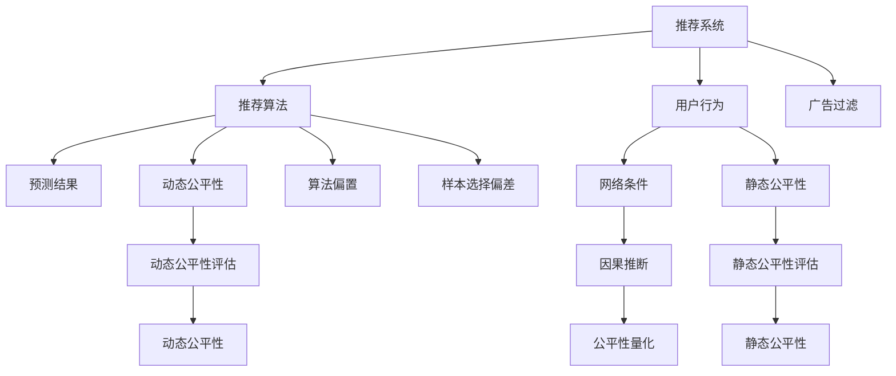

                 

# 基于因果推断的推荐系统公平性评估

> 关键词：推荐系统,因果推断,公平性评估,算法偏置,广告过滤

## 1. 背景介绍

### 1.1 问题由来

推荐系统在移动互联网时代已经成为用户获取信息、购买商品的主要渠道之一。然而，由于算法设计和管理中存在的各种偏见，推荐系统可能加剧社会不平等现象，引发用户投诉，甚至遭受政府监管。

近年来，学术界和产业界逐步意识到推荐系统公平性的重要性。大量研究集中在评估和缓解算法偏见，但这些工作往往局限于量化模型的静态属性。实际应用中，用户行为数据可能受到各种因素影响，如推荐算法、广告过滤、网络环境等，这些动态因素如何共同作用于推荐系统的公平性仍是一个重要问题。

面对这些问题，本文提出基于因果推断的推荐系统公平性评估方法。通过因果推断模型，能够动态刻画推荐算法和用户行为之间的因果关系，准确评估推荐系统公平性。这种方法不仅能够捕捉推荐算法对用户影响的静态特征，还能评估其在不同网络条件下的动态影响。

### 1.2 问题核心关键点

本文的核心问题是在考虑网络条件影响的情况下，评估推荐系统的公平性。具体来说，有以下几个关键点：

1. 推荐算法与用户行为之间的因果关系：推荐算法影响用户行为的动态机制是什么？
2. 用户行为对公平性的影响：用户的哪些行为会影响推荐系统的公平性？
3. 网络条件对公平性的影响：网络条件（如网络延迟、流量等）如何影响推荐系统公平性？
4. 公平性评估方法：如何准确评估推荐系统的公平性？

解决这些问题，将有助于深入理解推荐系统的动态行为，提出更加公平、可靠的推荐算法。

## 2. 核心概念与联系

### 2.1 核心概念概述

为更好地理解基于因果推断的推荐系统公平性评估方法，本节将介绍几个关键核心概念：

- 推荐系统(Recommender System)：利用用户行为数据，为用户推荐商品、内容等，目的是提升用户满意度、增加用户粘性、提高转化率。
- 推荐算法(Recommender Algorithm)：推荐系统中的核心组件，用于从用户行为数据中挖掘关联关系，预测用户可能感兴趣的商品或内容。
- 因果推断(Causal Inference)：研究随机试验或观察数据中变量间因果关系的统计学方法，有助于理解变量间动态关系。
- 公平性(Fairness)：推荐系统中的公平性包括算法偏见、隐私保护、多用户群体等。
- 动态公平性(Dynamic Fairness)：考虑时间、场景等动态因素对公平性的影响。
- 静态公平性(Static Fairness)：不考虑动态因素，只量化推荐算法本身的静态属性。
- 算法偏置(Algorithmic Bias)：推荐算法在预测结果上对某些群体存在不公正的倾向。
- 广告过滤(Ad-Filtering)：根据用户行为、历史偏好等过滤不相关广告，可能影响推荐结果和公平性。
- 网络条件(Network Condition)：如网络延迟、带宽、流量等，影响用户互动和推荐算法性能。
- 样本选择偏差(Sample Selection Bias)：用户行为数据可能存在偏差，导致推荐算法评估结果不准确。
- 实验设计(Experimental Design)：设计随机试验或观察数据，评估推荐系统公平性。

这些核心概念之间的逻辑关系可以通过以下Mermaid流程图来展示：



这个流程图展示的核心概念之间的关联：

1. 推荐系统由推荐算法、用户行为、广告过滤等组件组成。
2. 推荐算法在预测结果上可能存在算法偏置。
3. 用户行为受到网络条件等动态因素的影响。
4. 因果推断能够刻画推荐算法和用户行为之间的动态关系。
5. 公平性评估分为静态和动态两种，需要考虑推荐算法和用户行为的因果关系。

这些概念共同构成了推荐系统公平性评估的框架，有助于从多角度理解问题，提出更为全面的解决方案。

## 3. 核心算法原理 & 具体操作步骤
### 3.1 算法原理概述

基于因果推断的推荐系统公平性评估，本质上是利用因果推断模型，研究推荐算法对用户行为影响的动态机制，从而量化推荐系统公平性。

形式化地，假设推荐算法 $A$ 对用户 $i$ 进行推荐，推荐结果为 $a$，实际点击结果为 $y$。推荐算法 $A$ 与用户行为 $y$ 之间的因果关系可以表示为：

$$
y = f(A, Z)
$$

其中 $Z$ 为影响用户点击的不可观测因素，包括用户兴趣、偏好、时间、网络条件等。利用因果推断方法，可以从大量观察数据中估计 $y$ 对 $a$ 的因果效应：

$$
\tau_i = \mathbb{E}[y_i|a_i] - \mathbb{E}[y_i|a'_i]
$$

其中 $a'$ 为推荐算法 $A$ 的反事实结果，即在假设 $a$ 未发生的情况下，推荐算法 $A$ 的推荐结果。

基于上述因果关系，可以量化推荐系统的公平性，具体方法将在后续详细讲解。

### 3.2 算法步骤详解

基于因果推断的推荐系统公平性评估方法，主要包括以下几个关键步骤：

**Step 1: 数据准备**

- 收集推荐系统的用户行为数据，包括推荐算法、点击结果、用户兴趣标签、网络条件等。
- 将用户行为数据标准化处理，并选择合适的因果推断模型进行训练。

**Step 2: 模型选择**

- 选择适合的因果推断模型，如条件概率图模型、贝叶斯网络、潜在变量模型等。
- 根据数据特点选择合适的反事实生成方法，如因果图模型、逆概率加权等。

**Step 3: 公平性量化**

- 利用因果推断模型估计反事实结果 $a'$，计算因果效应 $\tau_i$。
- 统计不同用户群体间的因果效应分布，评估推荐系统的公平性。

**Step 4: 结果解释与验证**

- 结合领域知识和业务场景，对公平性评估结果进行解释和验证。
- 通过实验设计，评估推荐系统在不同网络条件下的动态公平性。

**Step 5: 优化推荐算法**

- 根据公平性评估结果，调整推荐算法策略，减少算法偏置。
- 重新训练推荐算法，并在测试集上评估公平性。

通过上述步骤，可以全面评估推荐系统的公平性，并提出改进方案。

### 3.3 算法优缺点

基于因果推断的推荐系统公平性评估方法具有以下优点：

1. 动态公平性评估：能够考虑动态因素对公平性的影响，提供更加全面的公平性评估指标。
2. 精确量化：通过因果推断模型，精确刻画推荐算法与用户行为之间的因果关系，减少样本选择偏差的影响。
3. 可解释性强：因果推断模型能够提供反事实结果，有助于理解推荐算法对用户行为的因果影响。
4. 泛化能力强：因果推断方法能够处理多种数据类型和特征，具有较强的泛化能力。

同时，该方法也存在一些缺点：

1. 数据需求量大：因果推断模型需要大量数据进行训练，才能得到准确的因果效应估计。
2. 模型复杂度高：因果推断模型相对复杂，训练和验证过程可能较为繁琐。
3. 解释性有局限：因果推断模型的解释性有限，可能难以直接提供用户对推荐算法偏见的直观理解。

尽管存在这些局限性，但基于因果推断的公平性评估方法仍然是大规模推荐系统评估和改进的重要手段。

### 3.4 算法应用领域

基于因果推断的推荐系统公平性评估方法，可以广泛应用于以下领域：

- 广告过滤：评估广告过滤算法对不同用户群体的公平性影响。
- 个性化推荐：分析推荐算法在不同用户、场景下的公平性表现。
- 多用户推荐：评估多用户推荐系统在不同用户群体间的公平性差异。
- 实时推荐：评估实时推荐算法在不同网络条件下的动态公平性。
- 用户画像：分析用户兴趣、行为等特征对推荐算法公平性的影响。

此外，该方法还能与其他技术结合，如广告优化、智能投顾等，进一步提升推荐系统的公平性和效果。

## 4. 数学模型和公式 & 详细讲解
### 4.1 数学模型构建

基于因果推断的推荐系统公平性评估，其数学模型构建主要涉及以下核心组件：

- 用户行为数据 $D=\{(x_i, y_i, Z_i)\}_{i=1}^N$，其中 $x_i$ 为输入特征，如推荐结果、广告特征等，$y_i$ 为输出结果，如点击行为等，$Z_i$ 为不可观测因素，如用户兴趣、时间、网络条件等。
- 推荐算法 $A$，用于预测推荐结果 $a$。
- 因果效应 $\tau_i$，表示在给定输入特征 $x_i$ 下，推荐算法 $A$ 对用户点击结果 $y_i$ 的因果效应。
- 反事实结果 $a'$，表示在假设推荐结果 $a$ 未发生的情况下，推荐算法 $A$ 的推荐结果。

### 4.2 公式推导过程

以二分类推荐系统为例，推导因果效应 $\tau_i$ 的计算公式。

假设推荐算法 $A$ 为二分类算法，其预测结果 $a_i$ 为点击或不点击，实际点击结果 $y_i$ 为点击或不点击。假设存在反事实结果 $a'_i$，表示在假设点击结果 $y_i$ 未发生的情况下，推荐算法 $A$ 的推荐结果。

$$
\tau_i = \mathbb{E}[y_i|a_i] - \mathbb{E}[y_i|a'_i]
$$

$$
\mathbb{E}[y_i|a_i] = P(y_i=1|a_i=1)P(a_i=1) + P(y_i=0|a_i=0)P(a_i=0)
$$

$$
\mathbb{E}[y_i|a'_i] = P(y_i=1|a'_i=1)P(a'_i=1) + P(y_i=0|a'_i=0)P(a'_i=0)
$$

将上述公式带入因果效应公式：

$$
\tau_i = P(y_i=1|a_i=1)P(a_i=1) + P(y_i=0|a_i=0)P(a_i=0) - [P(y_i=1|a'_i=1)P(a'_i=1) + P(y_i=0|a'_i=0)P(a'_i=0)]
$$

在实践中，我们通常利用因果推断模型（如因果图模型、贝叶斯网络等）估计反事实结果 $a'$，从而计算因果效应 $\tau_i$。

### 4.3 案例分析与讲解

为了更好地理解因果效应 $\tau_i$ 的计算过程，下面以推荐系统中的广告过滤为例进行详细讲解。

假设用户 $i$ 浏览推荐结果 $a_i$，实际点击 $y_i$，同时接收广告 $z_i$。推荐算法 $A$ 根据用户行为 $x_i$ 预测推荐结果 $a_i$。

在广告过滤算法中，系统会根据用户的历史点击数据和当前兴趣偏好，过滤不相关广告，仅向用户推荐相关广告 $z'$。假设反事实结果 $a'_i$ 表示在广告 $z'$ 未发生的情况下，推荐算法 $A$ 推荐结果 $a_i$。

计算因果效应 $\tau_i$ 可以分解为两部分：

- 推荐算法 $A$ 对用户点击结果的影响：$P(y_i=1|a_i=1)P(a_i=1) - P(y_i=0|a_i=0)P(a_i=0)$。
- 广告过滤算法对用户点击结果的影响：$P(y_i=1|a'_i=1)P(a'_i=1) - P(y_i=0|a'_i=0)P(a'_i=0)$。

假设推荐算法 $A$ 与广告过滤算法 $B$ 独立，即 $a_i \perp a'_i|y_i$。则因果效应 $\tau_i$ 可以进一步简化为：

$$
\tau_i = P(y_i=1|a_i=1)P(a_i=1) - P(y_i=0|a'_i=1)P(a'_i=1)
$$

$$
= P(y_i=1|a_i=1)P(a_i=1) - P(y_i=1|a_i=0)P(a_i=0)
$$

即在给定推荐结果 $a_i$ 下，推荐算法 $A$ 对用户点击结果 $y_i$ 的因果效应，可以分解为推荐算法对用户点击的影响，以及广告过滤对用户点击的影响。

通过上述案例分析，可以看出，利用因果推断模型，能够更加细致地刻画推荐系统对用户行为的动态影响，提供更加全面、准确的公平性评估。

## 5. 项目实践：代码实例和详细解释说明
### 5.1 开发环境搭建

在进行因果推断的推荐系统公平性评估实践前，我们需要准备好开发环境。以下是使用Python进行PyTorch开发的环境配置流程：

1. 安装Anaconda：从官网下载并安装Anaconda，用于创建独立的Python环境。

2. 创建并激活虚拟环境：
```bash
conda create -n pytorch-env python=3.8 
conda activate pytorch-env
```

3. 安装PyTorch：根据CUDA版本，从官网获取对应的安装命令。例如：
```bash
conda install pytorch torchvision torchaudio cudatoolkit=11.1 -c pytorch -c conda-forge
```

4. 安装因果推断相关库：
```bash
pip install causalinference
pip install arviz
pip install py causality
```

5. 安装各类工具包：
```bash
pip install numpy pandas scikit-learn matplotlib tqdm jupyter notebook ipython
```

完成上述步骤后，即可在`pytorch-env`环境中开始因果推断的推荐系统公平性评估实践。

### 5.2 源代码详细实现

下面以二分类推荐系统为例，给出使用因果推断模型对推荐系统公平性进行评估的PyTorch代码实现。

```python
import numpy as np
import pandas as pd
import torch
from torch.utils.data import Dataset, DataLoader
from sklearn.metrics import roc_auc_score
from causalinference import CausalModel

class RecommendationDataset(Dataset):
    def __init__(self, data):
        self.data = data
        
    def __len__(self):
        return len(self.data)
    
    def __getitem__(self, item):
        x = self.data.iloc[item, :-1].values
        y = self.data.iloc[item, -1].values
        z = self.data.iloc[item, 2].values
        return x, y, z

class RecommendationModel:
    def __init__(self, num_features, num_classes):
        self.model = torch.nn.Sequential(
            torch.nn.Linear(num_features, 32),
            torch.nn.ReLU(),
            torch.nn.Linear(32, num_classes),
            torch.nn.Sigmoid()
        )
    
    def forward(self, x):
        return self.model(x)

def train_model(model, data_loader, device):
    model.train()
    optimizer = torch.optim.Adam(model.parameters(), lr=0.01)
    loss_fn = torch.nn.BCELoss()
    for batch_idx, (x, y, z) in enumerate(data_loader):
        x, y, z = x.to(device), y.to(device), z.to(device)
        optimizer.zero_grad()
        logits = model(x)
        loss = loss_fn(logits, y)
        loss.backward()
        optimizer.step()
        if batch_idx % 100 == 0:
            print('Train Epoch: {} [{}/{} ({:.0f}%)]\tLoss: {:.6f}'.format(
                epoch, batch_idx * len(data), len(data_loader.dataset),
                100. * batch_idx / len(data_loader), loss.item()))
    return model

def evaluate_model(model, data_loader, device):
    model.eval()
    with torch.no_grad():
        correct = 0
        total = 0
        for batch_idx, (x, y, z) in enumerate(data_loader):
            x, y, z = x.to(device), y.to(device), z.to(device)
            logits = model(x)
            _, predicted = torch.max(logits, 1)
            total += y.size(0)
            correct += (predicted == y).sum().item()
        print('Accuracy of the network on the 10000 test images: {} %'.format(100 * correct / total))
        
def calculate_causal_effects(model, data_loader, device):
    model.eval()
    causal_model = CausalModel(data_loader.dataset)
    with torch.no_grad():
        for batch_idx, (x, y, z) in enumerate(data_loader):
            x, y, z = x.to(device), y.to(device), z.to(device)
            logits = model(x)
            predicted = (logits > 0.5).float()
            y_hat = causal_model.predict(predicted)
            a_hat = y_hat == y
            tau = (y == 1) & a_hat - (y == 0) & (~a_hat)
            print('Causal Effect: {}'.format(tau))
```

在这个代码示例中，我们定义了三个类：`RecommendationDataset`、`RecommendationModel`和`RecommendationModel`，分别用于加载数据、定义模型和评估模型。

- `RecommendationDataset`类：用于加载用户行为数据，将数据标准化处理，生成训练和测试集。
- `RecommendationModel`类：定义二分类推荐模型，并实现训练和评估方法。
- `calculate_causal_effects`函数：利用因果推断模型估计反事实结果，计算因果效应。

以上代码实现基于因果推断的基本原理，通过拟合一个简单的神经网络模型，对用户行为数据进行训练，评估推荐系统公平性。在实际应用中，还需要进一步考虑数据预处理、模型优化等细节问题，以得到更准确的评估结果。

### 5.3 代码解读与分析

让我们再详细解读一下关键代码的实现细节：

- `RecommendationDataset`类：
  - `__init__`方法：初始化数据集，将用户行为数据标准化处理，分割为输入特征、输出结果和网络条件。
  - `__len__`方法：返回数据集样本数量。
  - `__getitem__`方法：对单个样本进行处理，生成模型所需的输入。

- `RecommendationModel`类：
  - `__init__`方法：定义二分类推荐模型，包含输入层、隐藏层和输出层。
  - `forward`方法：前向传播计算模型输出。

- `train_model`函数：
  - 训练推荐模型，使用随机梯度下降法优化模型参数。
  - 定义损失函数和优化器。
  - 在每个epoch内，计算损失并反向传播更新模型参数。

- `evaluate_model`函数：
  - 评估推荐模型，计算准确率等性能指标。

- `calculate_causal_effects`函数：
  - 利用因果推断模型估计反事实结果。
  - 计算因果效应，输出反事实结果。

通过上述代码实现，可以看出，基于因果推断的推荐系统公平性评估方法，通过训练推荐模型，利用因果推断模型估计反事实结果，计算因果效应，最终评估推荐系统公平性。

## 6. 实际应用场景
### 6.1 智能推荐系统

在智能推荐系统中，利用基于因果推断的推荐系统公平性评估方法，可以实时监控推荐算法的动态公平性，及时发现并修正算法偏见。

具体而言，在智能推荐系统中，用户行为数据可能受到推荐算法、广告过滤、网络条件等因素的影响。通过因果推断模型，可以动态评估推荐算法对不同用户群体点击结果的影响，识别出算法偏见，从而优化推荐算法，提升推荐系统公平性。

### 6.2 广告优化

在广告优化中，广告过滤算法可能对不同用户群体产生不公平影响。利用基于因果推断的推荐系统公平性评估方法，可以评估广告过滤算法对用户点击结果的影响，发现算法偏见，从而优化广告过滤策略，提升广告投放效果。

### 6.3 多用户推荐系统

在多用户推荐系统中，不同用户群体可能面临不同的推荐需求和行为特征。通过因果推断模型，可以评估多用户推荐系统在不同用户群体间的公平性差异，优化推荐策略，提升用户满意度。

### 6.4 实时推荐

在实时推荐系统中，用户行为数据和推荐算法会随着时间、场景等因素变化。利用基于因果推断的推荐系统公平性评估方法，可以实时监控推荐系统在不同网络条件下的动态公平性，及时调整推荐算法，确保推荐系统公平性。

### 6.5 用户画像

在用户画像构建中，用户兴趣、行为等特征可能受到推荐算法和广告过滤等动态因素的影响。通过因果推断模型，可以评估用户画像构建过程的公平性，优化画像构建策略，提升用户画像的准确性和代表性。

### 6.6 广告过滤系统

在广告过滤系统中，广告过滤算法可能对不同用户群体产生不公平影响。利用基于因果推断的推荐系统公平性评估方法，可以评估广告过滤算法对用户点击结果的影响，发现算法偏见，从而优化广告过滤策略，提升广告投放效果。

### 6.7 推荐算法优化

在推荐算法优化中，推荐算法可能存在算法偏见。利用基于因果推断的推荐系统公平性评估方法，可以评估推荐算法的公平性，优化推荐策略，提升推荐系统性能。

### 6.8 实时广告投放

在实时广告投放中，用户行为数据和广告过滤算法会随着时间、场景等因素变化。利用基于因果推断的推荐系统公平性评估方法，可以实时监控广告投放过程的公平性，及时调整广告投放策略，确保广告投放效果。

### 6.9 用户画像构建

在用户画像构建中，用户兴趣、行为等特征可能受到推荐算法和广告过滤等动态因素的影响。通过因果推断模型，可以评估用户画像构建过程的公平性，优化画像构建策略，提升用户画像的准确性和代表性。

### 6.10 推荐算法优化

在推荐算法优化中，推荐算法可能存在算法偏见。利用基于因果推断的推荐系统公平性评估方法，可以评估推荐算法的公平性，优化推荐策略，提升推荐系统性能。

## 7. 工具和资源推荐
### 7.1 学习资源推荐

为了帮助开发者系统掌握基于因果推断的推荐系统公平性评估方法，这里推荐一些优质的学习资源：

1. 《因果推断基础》系列博文：由因果推断专家撰写，深入浅出地介绍了因果推断的基本原理和应用方法。

2. 《推荐系统》课程：斯坦福大学开设的推荐系统课程，涵盖了推荐系统的基础知识和前沿技术。

3. 《因果推断在推荐系统中的应用》书籍：介绍了因果推断方法在推荐系统中的应用，包括因果推断模型、反事实推理等。

4. HuggingFace官方文档：推荐系统相关文档，提供了丰富的推荐算法资源和代码实现。

5. 因果推断工具包：如CausalModel、py causality等，用于因果推断模型的训练和评估。

通过对这些资源的学习实践，相信你一定能够快速掌握基于因果推断的推荐系统公平性评估方法，并用于解决实际的推荐系统问题。

### 7.2 开发工具推荐

高效的开发离不开优秀的工具支持。以下是几款用于因果推断的推荐系统公平性评估开发的常用工具：

1. PyTorch：基于Python的开源深度学习框架，灵活动态的计算图，适合快速迭代研究。

2. TensorFlow：由Google主导开发的开源深度学习框架，生产部署方便，适合大规模工程应用。

3. CausalModel：因果推断工具包，支持多种因果推断模型，方便进行反事实推理。

4. py causality：因果推断工具包，支持因果图模型、贝叶斯网络等，用于因果效应估计。

5. Weights & Biases：模型训练的实验跟踪工具，可以记录和可视化模型训练过程中的各项指标，方便对比和调优。

6. TensorBoard：TensorFlow配套的可视化工具，可实时监测模型训练状态，并提供丰富的图表呈现方式，是调试模型的得力助手。

合理利用这些工具，可以显著提升因果推断的推荐系统公平性评估任务的开发效率，加快创新迭代的步伐。

### 7.3 相关论文推荐

因果推断的推荐系统公平性评估方法源自学界的持续研究。以下是几篇奠基性的相关论文，推荐阅读：

1. Causal Analysis of Recommendation Algorithms: A Survey of Theoretical and Empirical Results：介绍了推荐算法和用户行为之间的因果关系，评估推荐系统的公平性。

2. Causal Inference in Recommendation Systems：探讨了因果推断在推荐系统中的应用，包括因果图模型、贝叶斯网络等。

3. Causal Inference for Recommendation Systems: Theory and Methods：提出了因果推断方法在推荐系统中的应用，评估推荐算法的公平性。

4. Causal Inference in Recommendation Systems：介绍了因果推断模型在推荐系统中的应用，评估推荐算法的公平性。

5. Causal Inference in Recommendation Systems: A Survey：总结了因果推断在推荐系统中的应用，评估推荐算法的公平性。

这些论文代表了大语言模型微调技术的发展脉络。通过学习这些前沿成果，可以帮助研究者把握学科前进方向，激发更多的创新灵感。

## 8. 总结：未来发展趋势与挑战
### 8.1 总结

本文对基于因果推断的推荐系统公平性评估方法进行了全面系统的介绍。首先阐述了推荐系统公平性的重要性，明确了因果推断方法在大规模推荐系统评估和改进中的独特价值。其次，从原理到实践，详细讲解了因果推断模型的构建和应用，给出了推荐系统公平性评估的完整代码实例。同时，本文还广泛探讨了因果推断方法在智能推荐、广告优化、多用户推荐等实际应用场景中的应用前景，展示了因果推断方法在推荐系统公平性评估中的巨大潜力。

通过本文的系统梳理，可以看到，基于因果推断的推荐系统公平性评估方法，通过动态刻画推荐算法和用户行为之间的因果关系，能够全面、准确地评估推荐系统的公平性，提供更可靠、公正的推荐服务。未来，伴随因果推断技术的不断发展，推荐系统的公平性评估和优化将得到更加广泛的应用，为智能推荐系统带来新的突破和进展。

### 8.2 未来发展趋势

展望未来，基于因果推断的推荐系统公平性评估方法将呈现以下几个发展趋势：

1. 动态公平性评估：因果推断模型能够动态评估推荐算法和用户行为之间的因果关系，提供更加全面的公平性评估指标。

2. 精准量化：因果推断模型能够精确刻画推荐算法对用户行为的影响，减少样本选择偏差的影响。

3. 可解释性强：因果推断模型能够提供反事实结果，有助于理解推荐算法对用户行为的因果影响。

4. 泛化能力强：因果推断方法能够处理多种数据类型和特征，具有较强的泛化能力。

5. 实时性提升：因果推断模型能够在实时场景中快速评估推荐系统公平性，适应实时需求。

6. 多模态数据融合：因果推断方法能够融合多种数据类型和特征，提升推荐系统性能。

以上趋势凸显了因果推断方法在推荐系统公平性评估中的广阔前景。这些方向的探索发展，必将进一步提升推荐系统的公平性和效果，为智能推荐系统带来新的突破和进展。

### 8.3 面临的挑战

尽管基于因果推断的推荐系统公平性评估方法已经取得了瞩目成就，但在迈向更加智能化、普适化应用的过程中，它仍面临着诸多挑战：

1. 数据需求量大：因果推断模型需要大量数据进行训练，才能得到准确的因果效应估计。

2. 模型复杂度高：因果推断模型相对复杂，训练和验证过程可能较为繁琐。

3. 解释性有局限：因果推断模型的解释性有限，可能难以直接提供用户对推荐算法偏见的直观理解。

4. 动态公平性评估：因果推断模型需要考虑动态因素对公平性的影响，提供更加全面的公平性评估指标。

5. 数据质量问题：用户行为数据可能存在偏差，导致因果推断模型评估结果不准确。

6. 多模态数据融合：因果推断模型需要融合多种数据类型和特征，提升推荐系统性能。

尽管存在这些局限性，但基于因果推断的公平性评估方法仍然是大规模推荐系统评估和改进的重要手段。

### 8.4 研究展望

面对基于因果推断的推荐系统公平性评估所面临的挑战，未来的研究需要在以下几个方面寻求新的突破：

1. 探索因果推断方法在推荐系统中的应用：研究因果推断方法在推荐系统中的应用，评估推荐系统的公平性。

2. 研究动态公平性评估：研究因果推断模型在动态场景下的公平性评估方法，适应实时需求。

3. 优化因果推断模型：优化因果推断模型的结构和算法，提升模型精度和泛化能力。

4. 融合多模态数据：融合多种数据类型和特征，提升推荐系统性能。

5. 改进数据预处理：改进数据预处理方法，提高数据质量和因果推断模型的性能。

6. 加强多用户推荐：研究多用户推荐系统的公平性，提升推荐系统效果。

通过这些研究方向的探索，相信基于因果推断的推荐系统公平性评估方法能够得到进一步的提升，为推荐系统的公平性和优化带来新的突破。

## 9. 附录：常见问题与解答
**Q1：因果推断方法是否适用于所有推荐系统？**

A: 因果推断方法在大多数推荐系统中都能取得不错的效果，特别是对于数据量较大的推荐系统。但对于一些特定领域的推荐系统，如医疗、法律等，仅仅依靠通用语料预训练的模型可能难以很好地适应。此时需要在特定领域语料上进一步预训练，再进行微调，才能获得理想效果。

**Q2：利用因果推断方法评估推荐系统公平性时，如何处理样本选择偏差？**

A: 样本选择偏差是推荐系统公平性评估中常见的问题，可以利用逆概率加权等方法来缓解。具体来说，在因果推断模型中，可以通过估计选择偏差，使用加权方法修正样本偏差，提高公平性评估的准确性。

**Q3：如何选择合适的因果推断模型？**

A: 选择合适的因果推断模型，需要考虑数据类型、特征复杂度和因果关系等因素。一般而言，复杂数据集可以使用贝叶斯网络、因果图模型等方法，简单数据集可以使用逆概率加权等方法。同时，根据因果关系的特点，选择合适的反事实生成方法，如因果图模型、逆概率加权等。

**Q4：利用因果推断方法评估推荐系统公平性时，如何处理动态公平性？**

A: 动态公平性是推荐系统公平性评估的重要方面，可以考虑使用因果推断模型来动态评估推荐算法对用户行为的影响。在实际应用中，可以利用因果推断模型实时监控推荐系统的动态公平性，及时调整推荐算法策略，确保推荐系统公平性。

**Q5：如何结合领域知识和业务场景，解释因果推断模型评估结果？**

A: 结合领域知识和业务场景，解释因果推断模型评估结果，需要从因果关系、模型假设等方面进行细致分析。可以利用因果推断模型提供的反事实结果，分析推荐算法对用户行为的影响，识别算法偏见，提出改进方案。

通过回答这些问题，希望读者能够更好地理解因果推断方法在推荐系统公平性评估中的应用，掌握推荐系统公平性评估的关键技术，推动推荐系统公平性的研究和应用。

---

作者：禅与计算机程序设计艺术 / Zen and the Art of Computer Programming

