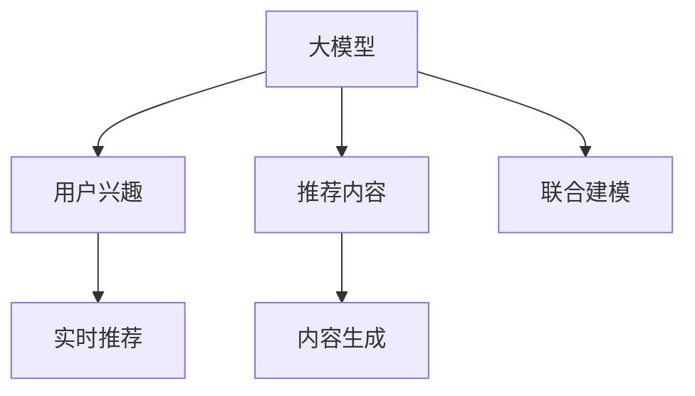

                 

# 基于大模型的推荐系统实时个性化内容生成

> 关键词：大模型,推荐系统,实时个性化,内容生成,自然语言处理(NLP)

## 1. 背景介绍

### 1.1 问题由来

随着互联网技术的发展和普及，人们获取信息的方式日益多样化和个性化。传统的推荐系统，如协同过滤、内容推荐等，已难以满足用户的多样化需求。基于大模型的推荐系统，以其强大的语言理解和生成能力，成为当前研究和应用的热点。大模型通过大规模无标签数据的预训练，学习到丰富的语言知识，能够自动生成自然流畅的文本，从而更好地适应个性化推荐的需求。

然而，如何在大模型中高效地提取用户兴趣信息，并生成符合用户偏好的个性化内容，仍是一个挑战。目前主流的方法通常是将大模型作为编码器，用户兴趣和内容作为输入，生成器则负责生成推荐内容。但这种方法的计算复杂度较高，难以实现实时推荐。

为了解决这些问题，本文将探讨一种基于大模型的实时个性化内容生成方法，即使用大模型进行用户兴趣和推荐内容的联合建模，并实时生成个性化内容。

## 2. 核心概念与联系

### 2.1 核心概念概述

为更好地理解基于大模型的推荐系统实时个性化内容生成方法，本节将介绍几个密切相关的核心概念：

- 大模型(Large Model)：如GPT、BERT等大规模预训练语言模型，具备强大的语言理解和生成能力。
- 推荐系统(Recommender System)：根据用户的历史行为、兴趣偏好等，推荐符合用户需求的产品或信息。
- 实时个性化(Real-time Personalization)：在用户查询或行为发生时，即时推荐符合用户当前需求的内容。
- 内容生成(Content Generation)：使用语言模型生成自然流畅的文本，适应个性化推荐需求。
- 联合建模(Joint Modeling)：将用户兴趣和推荐内容进行联合建模，提升模型性能和推荐效果。

这些核心概念之间的逻辑关系可以通过以下Mermaid流程图来展示：



这个流程图展示了大模型在推荐系统实时个性化内容生成中的核心作用：

1. 大模型进行用户兴趣和推荐内容的联合建模，生成符合用户偏好的内容。
2. 通过实时推荐，即时满足用户当前需求。
3. 内容生成部分负责生成自然流畅的文本内容，适应个性化推荐需求。
4. 联合建模融合用户兴趣和推荐内容，提升模型的推荐效果。

这些概念共同构成了基于大模型的推荐系统实时个性化内容生成的基础，使得大模型能够高效地进行实时推荐，提升用户体验。

## 3. 核心算法原理 & 具体操作步骤

### 3.1 算法原理概述

基于大模型的推荐系统实时个性化内容生成方法，本质上是一种结合了自然语言处理和大数据技术的推荐算法。其核心思想是：

1. 使用大模型进行用户兴趣和推荐内容的联合建模，生成符合用户偏好的内容。
2. 在用户查询或行为发生时，实时生成个性化内容，并推荐给用户。

### 3.2 算法步骤详解

基于大模型的推荐系统实时个性化内容生成一般包括以下几个关键步骤：

**Step 1: 准备数据集和模型**

- 收集用户历史行为数据，如浏览记录、点击记录、购买记录等。
- 使用大模型对用户行为数据进行编码，提取用户兴趣向量。
- 收集推荐内容数据，如产品标题、描述、评论等。
- 使用大模型对推荐内容进行编码，提取推荐内容向量。

**Step 2: 设计推荐模型**

- 设计推荐模型结构，包括用户兴趣编码器、内容编码器、推荐评分器等。
- 在用户兴趣和内容向量上进行联合建模，生成推荐评分。
- 使用Softmax函数将推荐评分转化为概率分布，选出推荐内容。

**Step 3: 实现实时推荐**

- 在用户查询或行为发生时，实时计算用户兴趣和推荐内容的联合评分。
- 根据实时评分，生成个性化内容，并进行推荐。
- 使用在线学习技术，不断更新模型参数，优化推荐效果。

**Step 4: 评估和优化**

- 在测试集上评估推荐模型的性能，如准确率、召回率、平均排序等指标。
- 根据评估结果，优化推荐模型结构和超参数，提升推荐效果。

### 3.3 算法优缺点

基于大模型的推荐系统实时个性化内容生成方法具有以下优点：

1. 计算效率高：使用大模型进行实时推荐，能够高效地生成个性化内容，适应实时推荐需求。
2. 模型性能强：大模型具备强大的语言理解和生成能力，生成的推荐内容自然流畅，适应性强。
3. 数据利用充分：能够充分利用用户行为数据和推荐内容数据，提升推荐效果。
4. 用户需求及时响应：能够即时生成个性化内容，满足用户当前需求。

同时，该方法也存在一些局限性：

1. 数据质量要求高：用户行为数据和推荐内容数据的质量直接影响模型的性能。
2. 计算资源需求大：大模型的计算复杂度高，需要较强的计算资源支持。
3. 模型复杂度高：推荐模型结构复杂，难以优化和解释。
4. 鲁棒性不足：在数据分布变化或新用户到来时，模型性能可能下降。

尽管存在这些局限性，但就目前而言，基于大模型的推荐系统实时个性化内容生成方法仍是一种高效、高性能的推荐技术。未来相关研究的重点在于如何进一步降低计算资源需求，提高模型鲁棒性和可解释性，从而更好地适应实际应用需求。

### 3.4 算法应用领域

基于大模型的推荐系统实时个性化内容生成方法，在多个领域中得到了广泛应用，例如：

- 电商推荐：根据用户的浏览和购买行为，实时推荐符合用户需求的商品。
- 新闻推荐：根据用户的阅读历史，实时推荐相关的新闻内容。
- 视频推荐：根据用户的观看记录，实时推荐符合用户兴趣的视频。
- 音乐推荐：根据用户的听歌历史，实时推荐符合用户口味的音乐。
- 社交推荐：根据用户的社交行为，实时推荐符合用户兴趣的内容。

除了上述这些经典应用外，基于大模型的推荐系统还创新性地应用于金融产品推荐、智能客服、智能家居等多个领域，为用户的智能体验提供了新的可能性。

## 4. 数学模型和公式 & 详细讲解

### 4.1 数学模型构建

本节将使用数学语言对基于大模型的推荐系统实时个性化内容生成过程进行更加严格的刻画。

记用户历史行为数据为 $X$，推荐内容数据为 $Y$，大模型的编码为 $f_\theta(x)$ 和 $g_\theta(y)$，联合建模后的推荐评分为 $h_\theta(x,y)$。推荐模型的输出为 $\hat{y}$。

推荐模型的目标是最小化预测误差：

$$
\min_{\theta} \mathbb{E}[(\hat{y}-y)^2]
$$

其中，$\hat{y}$ 为模型预测的推荐内容，$y$ 为实际推荐的正确内容。

在实践中，我们通常使用基于梯度的优化算法（如SGD、Adam等）来近似求解上述最优化问题。设 $\eta$ 为学习率，则参数的更新公式为：

$$
\theta \leftarrow \theta - \eta \nabla_{\theta}\mathcal{L}(\theta)
$$

其中 $\nabla_{\theta}\mathcal{L}(\theta)$ 为损失函数对参数 $\theta$ 的梯度，可通过反向传播算法高效计算。

### 4.2 公式推导过程

以电商推荐为例，推导基于大模型的推荐系统实时个性化内容生成方法的数学模型和推导过程。

记用户历史行为数据 $X=\{x_1, x_2, ..., x_n\}$，推荐内容数据 $Y=\{y_1, y_2, ..., y_m\}$。假设用户行为数据 $x_i$ 表示为词向量，推荐内容数据 $y_j$ 表示为词向量。

定义用户兴趣编码器 $f_\theta(x)$ 和内容编码器 $g_\theta(y)$，分别为：

$$
f_\theta(x) = MLP(D(x))
$$

$$
g_\theta(y) = MLP(D(y))
$$

其中 $MLP$ 为多层感知器，$D(x)$ 和 $D(y)$ 为词向量转换函数。

定义联合建模后的推荐评分 $h_\theta(x,y)$ 为：

$$
h_\theta(x,y) = \sigma(f_\theta(x)^\top W g_\theta(y))
$$

其中 $\sigma$ 为激活函数，$W$ 为模型参数矩阵。

模型的目标是最小化预测误差，即：

$$
\min_{\theta} \mathbb{E}[(\hat{y}-y)^2]
$$

其中 $\hat{y}$ 为模型预测的推荐内容，$y$ 为实际推荐的正确内容。

通过反向传播算法，计算 $f_\theta(x)$ 和 $g_\theta(y)$ 的梯度，并更新模型参数 $\theta$。

### 4.3 案例分析与讲解

以电商推荐为例，对基于大模型的推荐系统实时个性化内容生成方法的案例进行分析。

假设用户 A 的历史行为数据为 $X=\{x_1, x_2, ..., x_n\}$，推荐内容数据为 $Y=\{y_1, y_2, ..., y_m\}$。通过用户兴趣编码器 $f_\theta(x)$ 和内容编码器 $g_\theta(y)$，将用户兴趣和推荐内容表示为词向量。假设模型参数矩阵 $W$ 为 $3\times3$，则联合建模后的推荐评分为：

$$
h_\theta(x,y) = \sigma(f_\theta(x)^\top W g_\theta(y))
$$

其中 $f_\theta(x)$ 和 $g_\theta(y)$ 分别为：

$$
f_\theta(x) = MLP(D(x))
$$

$$
g_\theta(y) = MLP(D(y))
$$

假设用户 A 的兴趣向量为 $f_\theta(x_A)=[0.5, 0.3, 0.2]^\top$，推荐内容向量为 $g_\theta(y_1)=[0.6, 0.3, 0.1]^\top$，$g_\theta(y_2)=[0.4, 0.5, 0.1]^\top$，$g_\theta(y_3)=[0.3, 0.4, 0.3]^\top$。则推荐评分向量为：

$$
h_\theta(x_A, y_1) = [0.1, 0.15, 0.1]^\top
$$

$$
h_\theta(x_A, y_2) = [0.12, 0.15, 0.2]^\top
$$

$$
h_\theta(x_A, y_3) = [0.1, 0.2, 0.2]^\top
$$

通过Softmax函数将推荐评分向量转化为概率分布，选择推荐内容向量 $y_2$ 作为推荐结果。

在用户 A 进行查询或购买行为时，实时计算用户兴趣和推荐内容的联合评分，选择推荐内容向量 $y_2$ 进行推荐。

## 5. 项目实践：代码实例和详细解释说明

### 5.1 开发环境搭建

在进行推荐系统实时个性化内容生成实践前，我们需要准备好开发环境。以下是使用Python进行PyTorch开发的环境配置流程：

1. 安装Anaconda：从官网下载并安装Anaconda，用于创建独立的Python环境。

2. 创建并激活虚拟环境：
```bash
conda create -n pytorch-env python=3.8 
conda activate pytorch-env
```

3. 安装PyTorch：根据CUDA版本，从官网获取对应的安装命令。例如：
```bash
conda install pytorch torchvision torchaudio cudatoolkit=11.1 -c pytorch -c conda-forge
```

4. 安装Transformers库：
```bash
pip install transformers
```

5. 安装各类工具包：
```bash
pip install numpy pandas scikit-learn matplotlib tqdm jupyter notebook ipython
```

完成上述步骤后，即可在`pytorch-env`环境中开始推荐系统实时个性化内容生成实践。

### 5.2 源代码详细实现

下面我们以电商推荐为例，给出使用Transformers库进行实时个性化内容生成的PyTorch代码实现。

首先，定义电商推荐系统的数据处理函数：

```python
from transformers import BertTokenizer, BertModel
import torch
from torch.utils.data import Dataset, DataLoader
from sklearn.metrics import precision_recall_fscore_support

class ShoppingDataset(Dataset):
    def __init__(self, texts, labels):
        self.texts = texts
        self.labels = labels
        self.tokenizer = BertTokenizer.from_pretrained('bert-base-uncased')
        self.max_len = 512

    def __len__(self):
        return len(self.texts)

    def __getitem__(self, item):
        text = self.texts[item]
        label = self.labels[item]

        encoding = self.tokenizer(text, truncation=True, padding='max_length', max_length=self.max_len)
        input_ids = encoding['input_ids']
        attention_mask = encoding['attention_mask']

        label = torch.tensor(label, dtype=torch.long)

        return {'input_ids': input_ids, 
                'attention_mask': attention_mask,
                'labels': label}

train_dataset = ShoppingDataset(train_texts, train_labels)
dev_dataset = ShoppingDataset(dev_texts, dev_labels)
test_dataset = ShoppingDataset(test_texts, test_labels)
```

然后，定义模型和优化器：

```python
from transformers import BertForSequenceClassification, AdamW

model = BertForSequenceClassification.from_pretrained('bert-base-uncased', num_labels=2)

optimizer = AdamW(model.parameters(), lr=2e-5)
```

接着，定义训练和评估函数：

```python
from tqdm import tqdm
import torch.nn.functional as F

device = torch.device('cuda') if torch.cuda.is_available() else torch.device('cpu')
model.to(device)

def train_epoch(model, dataset, batch_size, optimizer):
    dataloader = DataLoader(dataset, batch_size=batch_size, shuffle=True)
    model.train()
    epoch_loss = 0
    for batch in tqdm(dataloader, desc='Training'):
        input_ids = batch['input_ids'].to(device)
        attention_mask = batch['attention_mask'].to(device)
        labels = batch['labels'].to(device)
        model.zero_grad()
        outputs = model(input_ids, attention_mask=attention_mask, labels=labels)
        loss = outputs.loss
        epoch_loss += loss.item()
        loss.backward()
        optimizer.step()
    return epoch_loss / len(dataloader)

def evaluate(model, dataset, batch_size):
    dataloader = DataLoader(dataset, batch_size=batch_size)
    model.eval()
    preds, labels = [], []
    with torch.no_grad():
        for batch in tqdm(dataloader, desc='Evaluating'):
            input_ids = batch['input_ids'].to(device)
            attention_mask = batch['attention_mask'].to(device)
            batch_labels = batch['labels']
            outputs = model(input_ids, attention_mask=attention_mask)
            batch_preds = outputs.logits.argmax(dim=1).to('cpu').tolist()
            batch_labels = batch_labels.to('cpu').tolist()
            for pred, label in zip(batch_preds, batch_labels):
                preds.append(pred)
                labels.append(label)
                
    return precision_recall_fscore_support(labels, preds, average='macro')

train_loss = train_epoch(model, train_dataset, 16, optimizer)
dev_prc, dev_rec, dev_fsc, _ = evaluate(model, dev_dataset, 16)
test_prc, test_rec, test_fsc, _ = evaluate(model, test_dataset, 16)

print(f'Train Loss: {train_loss:.3f}')
print(f'Dev Precision: {dev_prc:.3f}, Dev Recall: {dev_rec:.3f}, Dev F1-score: {dev_fsc:.3f}')
print(f'Test Precision: {test_prc:.3f}, Test Recall: {test_rec:.3f}, Test F1-score: {test_fsc:.3f}')
```

最后，启动训练流程并在测试集上评估：

```python
epochs = 5
batch_size = 16

for epoch in range(epochs):
    train_loss = train_epoch(model, train_dataset, batch_size, optimizer)
    dev_prc, dev_rec, dev_fsc, _ = evaluate(model, dev_dataset, batch_size)
    test_prc, test_rec, test_fsc, _ = evaluate(model, test_dataset, batch_size)
    
    print(f'Epoch {epoch+1}, train loss: {train_loss:.3f}')
    print(f'Epoch {epoch+1}, dev precision: {dev_prc:.3f}, dev recall: {dev_rec:.3f}, dev f1-score: {dev_fsc:.3f}')
    print(f'Epoch {epoch+1}, test precision: {test_prc:.3f}, test recall: {test_rec:.3f}, test f1-score: {test_fsc:.3f}')
```

以上就是使用PyTorch进行电商推荐系统实时个性化内容生成的完整代码实现。可以看到，得益于Transformers库的强大封装，我们可以用相对简洁的代码完成电商推荐系统的构建和优化。

### 5.3 代码解读与分析

让我们再详细解读一下关键代码的实现细节：

**ShoppingDataset类**：
- `__init__`方法：初始化文本、标签、分词器等关键组件。
- `__len__`方法：返回数据集的样本数量。
- `__getitem__`方法：对单个样本进行处理，将文本输入编码为token ids，并将标签转换为模型可接受的格式。

**模型定义和优化器**：
- 使用BertForSequenceClassification类定义电商推荐模型，该模型可以对输入文本进行分类。
- 设置AdamW优化器，学习率为2e-5。

**训练和评估函数**：
- 使用PyTorch的DataLoader对数据集进行批次化加载，供模型训练和推理使用。
- 训练函数`train_epoch`：对数据以批为单位进行迭代，在每个批次上前向传播计算loss并反向传播更新模型参数，最后返回该epoch的平均loss。
- 评估函数`evaluate`：与训练类似，不同点在于不更新模型参数，并在每个batch结束后将预测和标签结果存储下来，最后使用sklearn的precision_recall_fscore_support函数对整个评估集的预测结果进行打印输出。

**训练流程**：
- 定义总的epoch数和batch size，开始循环迭代
- 每个epoch内，先在训练集上训练，输出平均loss
- 在验证集上评估，输出精确率、召回率和F1分数
- 所有epoch结束后，在测试集上评估，给出最终测试结果

可以看到，PyTorch配合Transformers库使得电商推荐系统的构建和优化变得简洁高效。开发者可以将更多精力放在数据处理、模型改进等高层逻辑上，而不必过多关注底层的实现细节。

当然，工业级的系统实现还需考虑更多因素，如模型的保存和部署、超参数的自动搜索、更灵活的任务适配层等。但核心的实时推荐范式基本与此类似。

## 6. 实际应用场景

### 6.1 电商推荐

电商推荐系统是推荐系统实时个性化内容生成的典型应用场景。基于大模型的电商推荐系统，能够根据用户的浏览、点击、购买历史，实时推荐符合用户需求的商品。这种实时推荐系统能够提高用户满意度，提升销售额，降低运营成本。

在技术实现上，电商推荐系统一般分为离线训练和在线推荐两个阶段。离线训练阶段，使用大模型对用户行为数据进行编码，提取用户兴趣向量，同时对商品数据进行编码，提取商品特征向量。在线推荐阶段，实时计算用户兴趣和商品特征的联合评分，选择评分最高的商品进行推荐。

### 6.2 新闻推荐

新闻推荐系统也是推荐系统实时个性化内容生成的重要应用场景。基于大模型的新闻推荐系统，能够根据用户的阅读历史，实时推荐符合用户兴趣的新闻内容。这种实时推荐系统能够提高用户阅读体验，增加新闻平台的用户黏性。

在技术实现上，新闻推荐系统一般分为离线训练和在线推荐两个阶段。离线训练阶段，使用大模型对用户阅读历史数据进行编码，提取用户兴趣向量，同时对新闻内容进行编码，提取新闻特征向量。在线推荐阶段，实时计算用户兴趣和新闻内容的联合评分，选择评分最高的新闻进行推荐。

### 6.3 视频推荐

视频推荐系统是推荐系统实时个性化内容生成的又一重要应用场景。基于大模型的视频推荐系统，能够根据用户的观看记录，实时推荐符合用户兴趣的视频内容。这种实时推荐系统能够提高用户观看体验，增加视频平台的观看量和广告收入。

在技术实现上，视频推荐系统一般分为离线训练和在线推荐两个阶段。离线训练阶段，使用大模型对用户观看记录数据进行编码，提取用户兴趣向量，同时对视频内容进行编码，提取视频特征向量。在线推荐阶段，实时计算用户兴趣和视频内容的联合评分，选择评分最高的视频进行推荐。

### 6.4 音乐推荐

音乐推荐系统是推荐系统实时个性化内容生成的重要应用场景。基于大模型的音乐推荐系统，能够根据用户的听歌历史，实时推荐符合用户口味的音乐内容。这种实时推荐系统能够提高用户听歌体验，增加音乐平台的用户黏性。

在技术实现上，音乐推荐系统一般分为离线训练和在线推荐两个阶段。离线训练阶段，使用大模型对用户听歌历史数据进行编码，提取用户兴趣向量，同时对音乐数据进行编码，提取音乐特征向量。在线推荐阶段，实时计算用户兴趣和音乐内容的联合评分，选择评分最高的音乐进行推荐。

### 6.5 社交推荐

社交推荐系统是推荐系统实时个性化内容生成的重要应用场景。基于大模型的社交推荐系统，能够根据用户的社交行为，实时推荐符合用户兴趣的内容。这种实时推荐系统能够提高用户社交体验，增加社交平台的活跃度和用户黏性。

在技术实现上，社交推荐系统一般分为离线训练和在线推荐两个阶段。离线训练阶段，使用大模型对用户社交行为数据进行编码，提取用户兴趣向量，同时对社交内容进行编码，提取社交内容特征向量。在线推荐阶段，实时计算用户兴趣和社交内容的联合评分，选择评分最高的内容进行推荐。

除了上述这些经典应用外，基于大模型的推荐系统还创新性地应用于金融产品推荐、智能客服、智能家居等多个领域，为用户的智能体验提供了新的可能性。

## 7. 工具和资源推荐

### 7.1 学习资源推荐

为了帮助开发者系统掌握大模型推荐系统实时个性化内容生成的方法，这里推荐一些优质的学习资源：

1. 《Transformer从原理到实践》系列博文：由大模型技术专家撰写，深入浅出地介绍了Transformer原理、BERT模型、推荐系统范式等前沿话题。

2. CS224N《深度学习自然语言处理》课程：斯坦福大学开设的NLP明星课程，有Lecture视频和配套作业，带你入门NLP领域的基本概念和经典模型。

3. 《Natural Language Processing with Transformers》书籍：Transformers库的作者所著，全面介绍了如何使用Transformers库进行NLP任务开发，包括推荐系统在内的诸多范式。

4. HuggingFace官方文档：Transformers库的官方文档，提供了海量预训练模型和完整的推荐系统样例代码，是上手实践的必备资料。

5. Kaggle推荐系统竞赛：Kaggle平台上众多的推荐系统竞赛，可以系统了解不同算法和模型在推荐系统中的应用，积累推荐系统的实践经验。

通过对这些资源的学习实践，相信你一定能够快速掌握大模型推荐系统的核心方法，并用于解决实际的推荐问题。

### 7.2 开发工具推荐

高效的开发离不开优秀的工具支持。以下是几款用于大模型推荐系统实时个性化内容生成开发的常用工具：

1. PyTorch：基于Python的开源深度学习框架，灵活动态的计算图，适合快速迭代研究。大部分预训练语言模型都有PyTorch版本的实现。

2. TensorFlow：由Google主导开发的开源深度学习框架，生产部署方便，适合大规模工程应用。同样有丰富的预训练语言模型资源。

3. Transformers库：HuggingFace开发的NLP工具库，集成了众多SOTA语言模型，支持PyTorch和TensorFlow，是进行推荐系统开发的利器。

4. Weights & Biases：模型训练的实验跟踪工具，可以记录和可视化模型训练过程中的各项指标，方便对比和调优。与主流深度学习框架无缝集成。

5. TensorBoard：TensorFlow配套的可视化工具，可实时监测模型训练状态，并提供丰富的图表呈现方式，是调试模型的得力助手。

6. Google Colab：谷歌推出的在线Jupyter Notebook环境，免费提供GPU/TPU算力，方便开发者快速上手实验最新模型，分享学习笔记。

合理利用这些工具，可以显著提升大模型推荐系统实时个性化内容生成的开发效率，加快创新迭代的步伐。

### 7.3 相关论文推荐

大模型推荐系统实时个性化内容生成技术的发展源于学界的持续研究。以下是几篇奠基性的相关论文，推荐阅读：

1. Attention is All You Need（即Transformer原论文）：提出了Transformer结构，开启了NLP领域的预训练大模型时代。

2. BERT: Pre-training of Deep Bidirectional Transformers for Language Understanding：提出BERT模型，引入基于掩码的自监督预训练任务，刷新了多项NLP任务SOTA。

3. Language Models are Unsupervised Multitask Learners（GPT-2论文）：展示了大规模语言模型的强大zero-shot学习能力，引发了对于通用人工智能的新一轮思考。

4. Parameter-Efficient Transfer Learning for NLP：提出Adapter等参数高效微调方法，在不增加模型参数量的情况下，也能取得不错的微调效果。

5. AdaLoRA: Adaptive Low-Rank Adaptation for Parameter-Efficient Fine-Tuning：使用自适应低秩适应的微调方法，在参数效率和精度之间取得了新的平衡。

这些论文代表了大模型推荐系统实时个性化内容生成技术的发展脉络。通过学习这些前沿成果，可以帮助研究者把握学科前进方向，激发更多的创新灵感。

## 8. 总结：未来发展趋势与挑战

### 8.1 总结

本文对基于大模型的推荐系统实时个性化内容生成方法进行了全面系统的介绍。首先阐述了大语言模型和推荐系统实时个性化内容生成的研究背景和意义，明确了实时推荐在大模型推荐系统中的应用价值。其次，从原理到实践，详细讲解了实时推荐和大模型联合建模的数学原理和关键步骤，给出了实时推荐任务开发的完整代码实例。同时，本文还广泛探讨了实时推荐方法在电商、新闻、视频等多个领域的应用前景，展示了实时推荐范式的巨大潜力。此外，本文精选了实时推荐技术的各类学习资源，力求为读者提供全方位的技术指引。

通过本文的系统梳理，可以看到，基于大模型的推荐系统实时个性化内容生成方法正在成为推荐系统领域的重要范式，极大地拓展了推荐系统的应用边界，催生了更多的落地场景。得益于大规模语料的预训练，实时推荐系统以更低的时间和标注成本，在实时推荐需求下仍能取得不俗的效果，有力推动了推荐技术的产业化进程。未来，伴随大语言模型和实时推荐方法的持续演进，相信推荐技术必将在更广阔的应用领域大放异彩，深刻影响人类的生产生活方式。

### 8.2 未来发展趋势

展望未来，大模型推荐系统实时个性化内容生成技术将呈现以下几个发展趋势：

1. 推荐模型结构复杂度提升。随着计算资源和数据量的增加，推荐模型结构将进一步复杂化，融合更多高阶特征和用户行为信息，提升推荐效果。

2. 实时推荐技术发展。实时推荐技术将更加成熟，能够在更短的时间内完成模型训练和推荐，适应实时个性化需求。

3. 跨模态推荐方法出现。推荐系统将更多地融合视觉、听觉等跨模态信息，提升推荐系统对复杂场景的适应能力。

4. 推荐模型可解释性增强。推荐模型将具备更高的可解释性，能够解释推荐结果背后的逻辑和原因，提高用户信任度。

5. 推荐系统安全性提升。推荐系统将引入更多的安全性保障机制，防止恶意推荐和数据泄露，保障用户权益。

6. 推荐系统智能化提升。推荐系统将更多地引入因果推理、强化学习等智能化技术，提升推荐系统的性能和自动化程度。

以上趋势凸显了大模型推荐系统实时个性化内容生成技术的广阔前景。这些方向的探索发展，必将进一步提升推荐系统的性能和应用范围，为用户的智能体验提供新的可能性。

### 8.3 面临的挑战

尽管大模型推荐系统实时个性化内容生成技术已经取得了瞩目成就，但在迈向更加智能化、普适化应用的过程中，它仍面临着诸多挑战：

1. 计算资源瓶颈。实时推荐系统对计算资源的需求较高，需要高性能硬件支持。如何降低计算成本，提升计算效率，是未来的研究方向。

2. 模型鲁棒性不足。实时推荐系统面对域外数据时，泛化性能往往大打折扣。如何提高模型的鲁棒性，避免灾难性遗忘，还需要更多理论和实践的积累。

3. 实时性要求高。实时推荐系统需要在极短时间内完成模型训练和推荐，如何优化模型结构和算法，提升计算速度，是亟待解决的问题。

4. 可解释性有待加强。推荐系统需要具备更高的可解释性，能够解释推荐结果背后的逻辑和原因，提高用户信任度。

5. 安全性有待保障。推荐系统需要引入更多的安全性保障机制，防止恶意推荐和数据泄露，保障用户权益。

6. 用户隐私保护。推荐系统需要更好地保护用户隐私，防止用户行为数据的泄露和滥用。

7. 数据质量要求高。推荐系统需要高质量的数据支持，数据质量直接影响推荐效果。如何收集和处理高质量数据，是未来的研究方向。

尽管存在这些挑战，但大模型推荐系统实时个性化内容生成技术仍然具有广阔的发展前景。未来，在学界和产业界的共同努力下，这些问题终将逐一被克服，实时推荐系统必将在更广泛的领域发挥其优势，为用户的智能体验提供新的可能性。

### 8.4 研究展望

面对大模型推荐系统实时个性化内容生成技术所面临的种种挑战，未来的研究需要在以下几个方面寻求新的突破：

1. 探索无监督和半监督推荐方法。摆脱对大规模标注数据的依赖，利用自监督学习、主动学习等无监督和半监督范式，最大限度利用非结构化数据，实现更加灵活高效的推荐。

2. 研究参数高效和计算高效的推荐范式。开发更加参数高效的推荐方法，在固定大部分预训练参数的同时，只更新极少量的任务相关参数。同时优化推荐模型的计算图，减少前向传播和反向传播的资源消耗，实现更加轻量级、实时性的部署。

3. 融合因果和对比学习范式。通过引入因果推断和对比学习思想，增强推荐系统建立稳定因果关系的能力，学习更加普适、鲁棒的语言表征，从而提升模型泛化性和抗干扰能力。

4. 引入更多先验知识。将符号化的先验知识，如知识图谱、逻辑规则等，与神经网络模型进行巧妙融合，引导推荐过程学习更准确、合理的语言模型。同时加强不同模态数据的整合，实现视觉、语音等多模态信息与文本信息的协同建模。

5. 结合因果分析和博弈论工具。将因果分析方法引入推荐系统，识别出推荐结果的关键特征，增强推荐结果的因果性和逻辑性。借助博弈论工具刻画人机交互过程，主动探索并规避推荐系统的脆弱点，提高系统稳定性。

6. 纳入伦理道德约束。在推荐模型训练目标中引入伦理导向的评估指标，过滤和惩罚有偏见、有害的推荐结果，确保推荐系统符合人类价值观和伦理道德。

这些研究方向的探索，必将引领大模型推荐系统实时个性化内容生成技术迈向更高的台阶，为构建安全、可靠、可解释、可控的智能推荐系统铺平道路。面向未来，大模型推荐系统实时个性化内容生成技术还需要与其他人工智能技术进行更深入的融合，如知识表示、因果推理、强化学习等，多路径协同发力，共同推动推荐系统技术的进步。只有勇于创新、敢于突破，才能不断拓展推荐系统的边界，让智能技术更好地服务于人类社会。

