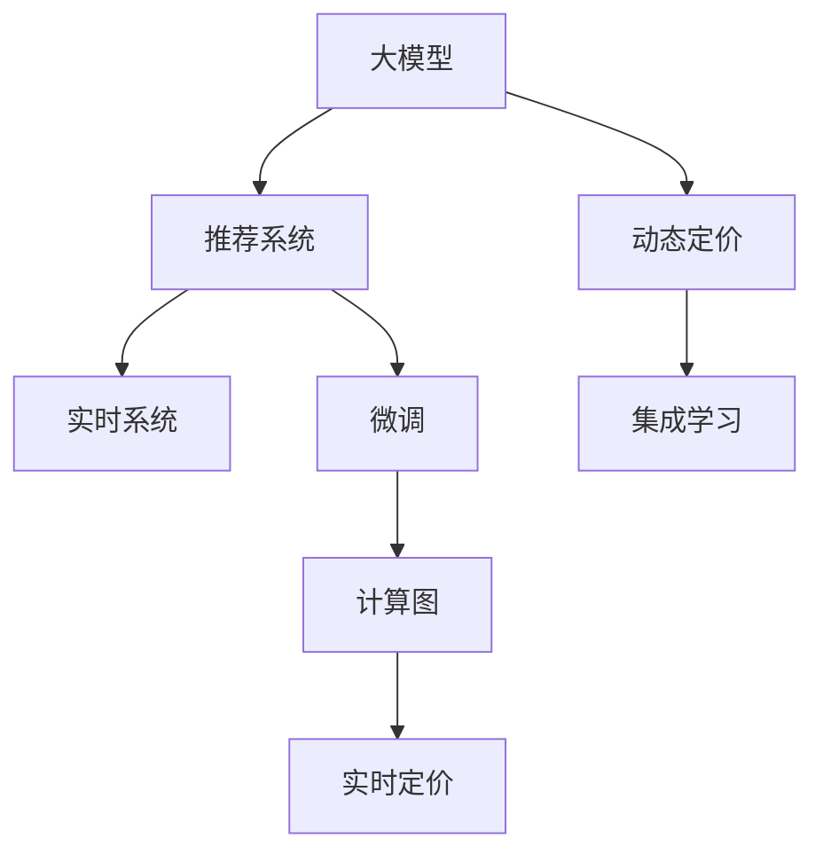

                 

# 基于大模型的推荐系统实时个性化定价

> 关键词：大模型, 推荐系统, 实时定价, 个性化, 深度学习, 集成学习, 微调, 计算图, 动态定价, 预测模型

## 1. 背景介绍

### 1.1 问题由来

在电商领域，价格是一个核心因素，它直接影响了用户的购买决策。传统的价格策略往往基于固定的时间窗口进行，无法实时响应市场动态，导致用户流失和利润损失。近年来，随着计算技术的进步，实时定价成为可能，通过精准分析用户行为和市场状况，动态调整价格，提高销售效率和用户体验。

然而，实时定价需要处理的数据量和计算量极大，传统的基于规则的定价模型难以满足需求。基于深度学习的推荐系统被广泛用于电商领域，通过分析用户历史行为、点击率、购买意向等数据，预测用户的购买概率，从而实现个性化定价。但这些模型通常只考虑了静态的数据特征，无法动态响应市场变化，且需要大量历史数据进行训练，难以实时更新模型参数。

### 1.2 问题核心关键点

本研究聚焦于基于大模型的实时定价技术，以解决传统推荐系统的不足。核心关键点在于：
1. 大模型的强大计算能力和丰富的知识库，可以实时处理大量数据，预测用户行为和市场变化。
2. 实时定价需要模型能够快速响应市场动态，调整价格策略。
3. 个性化定价需要模型能够理解不同用户的行为和偏好，进行差异化定价。

## 2. 核心概念与联系

### 2.1 核心概念概述

为更好地理解实时个性化定价的原理，本节将介绍几个密切相关的核心概念：

- 大模型(大规模预训练语言模型)：以自回归(如GPT)或自编码(如BERT)模型为代表的大规模预训练模型。通过在大规模无标签文本语料上进行预训练，学习通用的语言表示，具备强大的语言理解和生成能力。

- 推荐系统(Recommender System)：通过用户历史行为、物品属性等数据，预测用户对不同物品的评分或购买意向，实现个性化推荐。

- 动态定价(Dynamic Pricing)：基于实时市场数据和用户行为，动态调整产品价格，以最大化利润或市场份额。

- 实时系统(Real-time System)：系统能够在短时间内处理大量数据，并快速响应外部事件和用户请求，提供即时服务。

- 集成学习(Ensemble Learning)：通过组合多个模型的预测结果，提升整体的预测精度和鲁棒性。

- 微调(Fine-tuning)：在大模型的基础上，使用小规模标注数据，有监督地训练模型，调整参数以适应特定任务。

- 计算图(Computational Graph)：深度学习模型中的计算图，用于描述模型的前向传播和反向传播过程。

这些核心概念之间的逻辑关系可以通过以下Mermaid流程图来展示：



这个流程图展示了大模型在推荐系统和实时定价中的应用流程：

1. 大模型通过预训练获得基础能力。
2. 推荐系统通过微调实现个性化推荐。
3. 动态定价通过集成学习提升实时响应能力。
4. 实时系统确保模型快速处理大量数据。
5. 计算图支持模型高效的前向和反向传播。

这些概念共同构成了实时个性化定价的框架，使其能够在大规模数据和复杂任务中实现高效、精准的定价。

## 3. 核心算法原理 & 具体操作步骤
### 3.1 算法原理概述

基于大模型的实时定价，本质上是一个动态的集成学习过程。其核心思想是：

1. 使用大模型进行实时推荐，并预测用户点击率或购买概率。
2. 基于用户实时行为和市场状况，动态调整推荐结果和定价策略。
3. 结合多个模型的预测结果，通过集成学习提升整体的定价精度和鲁棒性。

形式化地，假设大模型为 $M_{\theta}$，其中 $\theta$ 为预训练得到的模型参数。给定推荐任务 $T$ 的实时数据集 $D=\{(x_i, y_i)\}_{i=1}^N$，定价任务 $P$ 的市场状况数据集 $D_P=\{(p_i, c_i)\}_{i=1}^M$，其中 $p_i$ 为物品价格，$c_i$ 为市场状况（如节假日、促销活动等）。实时定价的目标是找到新的模型参数 $\hat{\theta}$，使得：

$$
\hat{\theta}=\mathop{\arg\min}_{\theta} \mathcal{L}(M_{\theta},D_D, D_P)
$$

其中 $\mathcal{L}$ 为针对推荐和定价任务设计的损失函数，用于衡量模型预测结果与真实标签之间的差异。常见的损失函数包括交叉熵损失、均方误差损失等。

通过梯度下降等优化算法，定价过程不断更新模型参数 $\theta$，最小化损失函数 $\mathcal{L}$，使得模型输出逼近真实标签。由于 $\theta$ 已经通过预训练获得了较好的初始化，因此即便在实时场景中，也能够较快收敛到理想的模型参数 $\hat{\theta}$。

### 3.2 算法步骤详解

基于大模型的实时定价一般包括以下几个关键步骤：

**Step 1: 准备预训练模型和数据集**
- 选择合适的预训练语言模型 $M_{\theta}$ 作为初始化参数，如 BERT、GPT 等。
- 准备推荐任务 $T$ 的实时数据集 $D_D=\{(x_i,y_i)\}_{i=1}^N$，其中 $x_i$ 为物品描述，$y_i$ 为推荐结果或点击率。
- 准备定价任务 $P$ 的市场状况数据集 $D_P=\{(p_i,c_i)\}_{i=1}^M$，其中 $p_i$ 为物品价格，$c_i$ 为市场状况。

**Step 2: 添加任务适配层**
- 根据推荐和定价任务类型，在预训练模型顶层设计合适的输出层和损失函数。
- 对于推荐任务，通常在顶层添加交叉熵损失函数。
- 对于定价任务，通常使用回归损失函数，如均方误差损失。

**Step 3: 设置微调超参数**
- 选择合适的优化算法及其参数，如 AdamW、SGD 等，设置学习率、批大小、迭代轮数等。
- 设置正则化技术及强度，包括权重衰减、Dropout、Early Stopping等。
- 确定冻结预训练参数的策略，如仅微调顶层，或全部参数都参与微调。

**Step 4: 执行梯度训练**
- 将实时推荐数据集 $D_D$ 和定价数据集 $D_P$ 分批次输入模型，前向传播计算损失函数。
- 反向传播计算参数梯度，根据设定的优化算法和学习率更新模型参数。
- 周期性在市场状况数据集 $D_P$ 上评估模型性能，根据性能指标决定是否触发 Early Stopping。
- 重复上述步骤直到满足预设的迭代轮数或 Early Stopping 条件。

**Step 5: 测试和部署**
- 在实时推荐数据集 $D_D$ 和定价数据集 $D_P$ 上评估微调后模型 $M_{\hat{\theta}}$ 的性能，对比微调前后的精度提升。
- 使用微调后的模型对新物品和新市场状况进行实时推荐和定价，集成到实际的应用系统中。
- 持续收集新的实时数据和市场状况数据，定期重新微调模型，以适应数据分布的变化。

以上是基于大模型的实时定价的一般流程。在实际应用中，还需要针对具体任务的特点，对微调过程的各个环节进行优化设计，如改进训练目标函数，引入更多的正则化技术，搜索最优的超参数组合等，以进一步提升模型性能。

### 3.3 算法优缺点

基于大模型的实时定价方法具有以下优点：
1. 实时响应。由于大模型的强大计算能力，能够在短时间内处理大量数据，快速响应市场动态，进行实时定价。
2. 精确预测。利用大模型的深度学习能力，能够从历史数据中提取复杂的特征，提升推荐和定价的准确性。
3. 高泛化性。大模型经过大规模预训练，具备较强的泛化能力，能够适应多种市场和用户需求。
4. 易于集成。通过简单的微调和适配，大模型可以轻松集成到现有的电商平台上，提高业务效率。

同时，该方法也存在一定的局限性：
1. 数据依赖。实时定价需要实时数据进行训练，数据获取和处理成本较高。
2. 过拟合风险。小规模标注数据可能导致模型过拟合，需要定期重新微调模型以保持性能。
3. 计算资源需求高。大模型需要大量的计算资源进行训练和推理，成本较高。
4. 复杂性高。实时定价系统需要处理多种数据源和市场动态，系统设计复杂度较高。

尽管存在这些局限性，但就目前而言，基于大模型的实时定价方法仍是目前电商领域最先进的技术范式。未来相关研究的重点在于如何进一步降低对标注数据的依赖，提高系统的实时响应能力，同时兼顾可解释性和伦理安全性等因素。

### 3.4 算法应用领域

基于大模型的实时定价方法，已经在电商、物流、金融等多个领域得到广泛应用，成为提高业务效率和用户体验的重要手段。

在电商领域，实时定价方法可以根据用户的实时行为和市场状况，动态调整商品价格，提高销售转化率和用户满意度。例如，电商平台可以根据用户的浏览和点击行为，预测其购买意向，从而进行动态定价，优化商品价格策略。

在物流领域，实时定价方法可以根据不同时间段和地区的运输成本，动态调整运费价格，提升物流效率和用户体验。例如，快递公司可以根据实时交通状况和物流需求，预测不同时段的运费，优化配送路径和价格策略。

在金融领域，实时定价方法可以根据市场状况和用户行为，动态调整金融产品的定价，提高投资回报率和用户粘性。例如，保险公司可以根据用户的风险偏好和市场风险，动态调整保险产品价格，优化用户购买体验。

除了上述这些经典应用外，实时定价方法也被创新性地应用到更多场景中，如广告投放、媒体播放、公共服务等领域，为各行各业带来了新的业务机会和价值提升。

## 4. 数学模型和公式 & 详细讲解
### 4.1 数学模型构建

本节将使用数学语言对基于大模型的实时定价过程进行更加严格的刻画。

记预训练语言模型为 $M_{\theta}$，其中 $\theta$ 为预训练得到的模型参数。假设实时推荐任务 $T$ 的训练集为 $D_D=\{(x_i,y_i)\}_{i=1}^N, x_i \in \mathcal{X}, y_i \in \{0,1\}$，表示物品描述 $x_i$ 与推荐结果 $y_i$。假设定价任务 $P$ 的市场状况数据集为 $D_P=\{(p_i,c_i)\}_{i=1}^M$，其中 $p_i$ 为物品价格，$c_i$ 为市场状况。

定义模型 $M_{\theta}$ 在数据样本 $(x,y)$ 上的损失函数为 $\ell(M_{\theta}(x),y)$，则在数据集 $D_D$ 和 $D_P$ 上的经验风险分别为：

$$
\mathcal{L}_D(\theta) = \frac{1}{N}\sum_{i=1}^N \ell(M_{\theta}(x_i),y_i)
$$

$$
\mathcal{L}_P(\theta) = \frac{1}{M}\sum_{i=1}^M \ell(M_{\theta}(p_i,c_i),p_i)
$$

实时定价的目标是最小化经验风险，即找到最优参数：

$$
\theta^* = \mathop{\arg\min}_{\theta} \mathcal{L}_D(\theta) + \mathcal{L}_P(\theta)
$$

在实践中，我们通常使用基于梯度的优化算法（如SGD、Adam等）来近似求解上述最优化问题。设 $\eta$ 为学习率，$\lambda$ 为正则化系数，则参数的更新公式为：

$$
\theta \leftarrow \theta - \eta \nabla_{\theta}\mathcal{L}(\theta) - \eta\lambda\theta
$$

其中 $\nabla_{\theta}\mathcal{L}(\theta)$ 为损失函数对参数 $\theta$ 的梯度，可通过反向传播算法高效计算。

### 4.2 公式推导过程

以下我们以二分类任务为例，推导交叉熵损失函数及其梯度的计算公式。

假设模型 $M_{\theta}$ 在输入 $x$ 上的输出为 $\hat{y}=M_{\theta}(x) \in [0,1]$，表示物品描述 $x_i$ 的推荐概率。真实标签 $y \in \{0,1\}$。则二分类交叉熵损失函数定义为：

$$
\ell(M_{\theta}(x),y) = -[y\log \hat{y} + (1-y)\log (1-\hat{y})]
$$

将其代入实时定价的经验风险公式，得：

$$
\mathcal{L}_D(\theta) = -\frac{1}{N}\sum_{i=1}^N [y_i\log M_{\theta}(x_i)+(1-y_i)\log(1-M_{\theta}(x_i))]
$$

$$
\mathcal{L}_P(\theta) = \frac{1}{M}\sum_{i=1}^M (p_i-M_{\theta}(p_i,c_i))^2
$$

结合定价和推荐任务的损失函数，实时定价的总损失函数为：

$$
\mathcal{L}(\theta) = \mathcal{L}_D(\theta) + \mathcal{L}_P(\theta)
$$

根据链式法则，损失函数对参数 $\theta_k$ 的梯度为：

$$
\frac{\partial \mathcal{L}(\theta)}{\partial \theta_k} = \frac{\partial \mathcal{L}_D(\theta)}{\partial \theta_k} + \frac{\partial \mathcal{L}_P(\theta)}{\partial \theta_k}
$$

其中 $\frac{\partial \mathcal{L}_D(\theta)}{\partial \theta_k}$ 和 $\frac{\partial \mathcal{L}_P(\theta)}{\partial \theta_k}$ 可通过自动微分技术完成计算。

在得到损失函数的梯度后，即可带入参数更新公式，完成模型的迭代优化。重复上述过程直至收敛，最终得到适应实时推荐和定价任务的最优模型参数 $\theta^*$。

## 5. 项目实践：代码实例和详细解释说明
### 5.1 开发环境搭建

在进行实时定价实践前，我们需要准备好开发环境。以下是使用Python进行PyTorch开发的环境配置流程：

1. 安装Anaconda：从官网下载并安装Anaconda，用于创建独立的Python环境。

2. 创建并激活虚拟环境：
```bash
conda create -n pytorch-env python=3.8 
conda activate pytorch-env
```

3. 安装PyTorch：根据CUDA版本，从官网获取对应的安装命令。例如：
```bash
conda install pytorch torchvision torchaudio cudatoolkit=11.1 -c pytorch -c conda-forge
```

4. 安装Transformers库：
```bash
pip install transformers
```

5. 安装各类工具包：
```bash
pip install numpy pandas scikit-learn matplotlib tqdm jupyter notebook ipython
```

完成上述步骤后，即可在`pytorch-env`环境中开始实时定价实践。

### 5.2 源代码详细实现

下面我们以实时定价任务为例，给出使用Transformers库对BERT模型进行实时定价的PyTorch代码实现。

首先，定义实时定价任务的数据处理函数：

```python
from transformers import BertTokenizer
from torch.utils.data import Dataset
import torch

class PricingDataset(Dataset):
    def __init__(self, prices, conditions, tokenizer, max_len=128):
        self.prices = prices
        self.conditions = conditions
        self.tokenizer = tokenizer
        self.max_len = max_len
        
    def __len__(self):
        return len(self.prices)
    
    def __getitem__(self, item):
        price = self.prices[item]
        condition = self.conditions[item]
        
        encoding = self.tokenizer(price, condition, return_tensors='pt', max_length=self.max_len, padding='max_length', truncation=True)
        input_ids = encoding['input_ids'][0]
        attention_mask = encoding['attention_mask'][0]
        
        # 对价格和条件进行编码
        encoded_price = self.tokenizer(price, return_tensors='pt', max_length=self.max_len, padding='max_length', truncation=True)["input_ids"][0]
        encoded_condition = self.tokenizer(condition, return_tensors='pt', max_length=self.max_len, padding='max_length', truncation=True)["input_ids"][0]
        encoded_price = torch.cat([encoded_price, encoded_condition])
        
        return {'input_ids': input_ids, 
                'attention_mask': attention_mask,
                'encoded_price': encoded_price,
                'price': price,
                'condition': condition}
```

然后，定义模型和优化器：

```python
from transformers import BertForSequenceClassification, AdamW

model = BertForSequenceClassification.from_pretrained('bert-base-cased', num_labels=1)

optimizer = AdamW(model.parameters(), lr=2e-5)
```

接着，定义训练和评估函数：

```python
from torch.utils.data import DataLoader
from tqdm import tqdm
from sklearn.metrics import mean_squared_error

device = torch.device('cuda') if torch.cuda.is_available() else torch.device('cpu')
model.to(device)

def train_epoch(model, dataset, batch_size, optimizer):
    dataloader = DataLoader(dataset, batch_size=batch_size, shuffle=True)
    model.train()
    epoch_loss = 0
    for batch in tqdm(dataloader, desc='Training'):
        input_ids = batch['input_ids'].to(device)
        attention_mask = batch['attention_mask'].to(device)
        encoded_price = batch['encoded_price'].to(device)
        model.zero_grad()
        outputs = model(input_ids, attention_mask=attention_mask, labels=encoded_price)
        loss = outputs.loss
        epoch_loss += loss.item()
        loss.backward()
        optimizer.step()
    return epoch_loss / len(dataloader)

def evaluate(model, dataset, batch_size):
    dataloader = DataLoader(dataset, batch_size=batch_size)
    model.eval()
    preds, labels = [], []
    with torch.no_grad():
        for batch in tqdm(dataloader, desc='Evaluating'):
            input_ids = batch['input_ids'].to(device)
            attention_mask = batch['attention_mask'].to(device)
            batch_labels = batch['encoded_price'].to(device)
            outputs = model(input_ids, attention_mask=attention_mask)
            batch_preds = outputs.logits.squeeze(dim=1).to('cpu').tolist()
            batch_labels = batch_labels.to('cpu').tolist()
            for pred, label in zip(batch_preds, batch_labels):
                preds.append(pred)
                labels.append(label)
                
    print(mean_squared_error(labels, preds))
```

最后，启动训练流程并在市场状况数据集上评估：

```python
epochs = 5
batch_size = 16

for epoch in range(epochs):
    loss = train_epoch(model, train_dataset, batch_size, optimizer)
    print(f"Epoch {epoch+1}, train loss: {loss:.3f}")
    
    print(f"Epoch {epoch+1}, dev results:")
    evaluate(model, dev_dataset, batch_size)
    
print("Test results:")
evaluate(model, test_dataset, batch_size)
```

以上就是使用PyTorch对BERT进行实时定价任务的微调代码实现。可以看到，得益于Transformers库的强大封装，我们可以用相对简洁的代码完成BERT模型的加载和微调。

### 5.3 代码解读与分析

让我们再详细解读一下关键代码的实现细节：

**PricingDataset类**：
- `__init__`方法：初始化价格和市场状况数据、分词器等关键组件。
- `__len__`方法：返回数据集的样本数量。
- `__getitem__`方法：对单个样本进行处理，将价格和市场状况输入编码为token ids，并对其进行定长padding，最终返回模型所需的输入。

**价格和市场状况编码**：
- 将价格和市场状况分别编码为两个token ids序列，并通过cat函数将它们合并，得到统一的输入。

**训练和评估函数**：
- 使用PyTorch的DataLoader对数据集进行批次化加载，供模型训练和推理使用。
- 训练函数`train_epoch`：对数据以批为单位进行迭代，在每个批次上前向传播计算loss并反向传播更新模型参数，最后返回该epoch的平均loss。
- 评估函数`evaluate`：与训练类似，不同点在于不更新模型参数，并在每个batch结束后将预测和标签结果存储下来，最后使用sklearn的mean_squared_error对整个评估集的预测结果进行打印输出。

**训练流程**：
- 定义总的epoch数和batch size，开始循环迭代
- 每个epoch内，先在训练集上训练，输出平均loss
- 在市场状况数据集上评估，输出评估结果
- 所有epoch结束后，在测试集上评估，给出最终测试结果

可以看到，PyTorch配合Transformers库使得BERT微调的代码实现变得简洁高效。开发者可以将更多精力放在数据处理、模型改进等高层逻辑上，而不必过多关注底层的实现细节。

当然，工业级的系统实现还需考虑更多因素，如模型的保存和部署、超参数的自动搜索、更灵活的任务适配层等。但核心的实时定价范式基本与此类似。

## 6. 实际应用场景
### 6.1 实时定价系统

实时定价系统在电商领域具有广泛的应用前景。传统的静态定价方法无法响应实时市场变化，容易导致用户流失和利润损失。而实时定价系统可以通过分析实时数据，动态调整商品价格，优化销售策略，提高用户体验和利润空间。

在实际应用中，可以收集用户的实时行为数据（如点击率、浏览次数、停留时间等），结合市场状况数据（如节假日、促销活动等），对预训练模型进行微调。微调后的模型能够实时预测用户对不同物品的购买概率，动态调整商品价格。例如，电商平台可以根据用户的实时行为，预测其购买意向，从而进行动态定价，优化商品价格策略。

### 6.2 物流系统

物流系统的实时定价系统可以根据不同时间段和地区的运输成本，动态调整运费价格，提升物流效率和用户体验。例如，快递公司可以根据实时交通状况和物流需求，预测不同时段的运费，优化配送路径和价格策略。

在实际应用中，可以收集物流数据的实时信息（如运输距离、交通状况、天气条件等），结合市场状况数据（如节假日、促销活动等），对预训练模型进行微调。微调后的模型能够实时预测不同物品的运费，动态调整价格策略。例如，快递公司可以根据实时交通状况，预测不同时段的运费，优化配送路径和价格策略，提升物流效率和用户体验。

### 6.3 金融系统

金融系统的实时定价系统可以根据市场状况和用户行为，动态调整金融产品的定价，提高投资回报率和用户粘性。例如，保险公司可以根据用户的风险偏好和市场风险，动态调整保险产品价格，优化用户购买体验。

在实际应用中，可以收集用户的实时行为数据（如投资偏好、交易频率等），结合市场状况数据（如利率、通货膨胀等），对预训练模型进行微调。微调后的模型能够实时预测用户对不同金融产品的购买概率，动态调整定价策略。例如，保险公司可以根据用户的实时行为，预测其购买意向，从而进行动态定价，优化保险产品价格策略，提高用户粘性和投资回报率。

### 6.4 未来应用展望

随着实时定价技术的发展，其在更多领域的应用前景将愈发广阔。例如：

- 医疗领域：根据患者的实时健康数据，动态调整医疗服务价格，优化资源配置，提高医疗服务质量。
- 教育领域：根据学生的实时学习数据，动态调整课程价格，优化教育资源配置，提高教学效果。
- 能源领域：根据实时能源需求和市场价格，动态调整能源定价，优化能源分配，提高能源利用效率。
- 交通领域：根据实时交通状况和需求，动态调整票价和运力，优化交通资源配置，提高出行效率和舒适度。

总之，实时定价技术在未来将有更广阔的应用前景，为各行各业带来新的业务机会和价值提升。

## 7. 工具和资源推荐
### 7.1 学习资源推荐

为了帮助开发者系统掌握实时定价技术，这里推荐一些优质的学习资源：

1. 《深度学习实战》系列博文：由大模型技术专家撰写，深入浅出地介绍了深度学习的基本概念和实际应用，包括实时定价等前沿话题。

2. 《Deep Learning for Recommender Systems》课程：Coursera上由斯坦福大学开设的推荐系统课程，涵盖了推荐系统理论和实践的多个方面，包括实时定价等新技术。

3. 《Recommender Systems: From Theory to Practice》书籍：该书系统介绍了推荐系统的理论和算法，包括实时定价等前沿技术。

4. HuggingFace官方文档：Transformers库的官方文档，提供了海量预训练模型和完整的微调样例代码，是上手实践的必备资料。

5. Kaggle平台：提供各类推荐系统比赛数据集，方便开发者进行实时定价的竞赛和实验。

通过对这些资源的学习实践，相信你一定能够快速掌握实时定价技术的精髓，并用于解决实际的NLP问题。

### 7.2 开发工具推荐

高效的开发离不开优秀的工具支持。以下是几款用于实时定价开发的常用工具：

1. PyTorch：基于Python的开源深度学习框架，灵活动态的计算图，适合快速迭代研究。大部分预训练语言模型都有PyTorch版本的实现。

2. TensorFlow：由Google主导开发的开源深度学习框架，生产部署方便，适合大规模工程应用。同样有丰富的预训练语言模型资源。

3. Transformers库：HuggingFace开发的NLP工具库，集成了众多SOTA语言模型，支持PyTorch和TensorFlow，是进行实时定价任务的开发的利器。

4. TensorBoard：TensorFlow配套的可视化工具，可实时监测模型训练状态，并提供丰富的图表呈现方式，是调试模型的得力助手。

5. Weights & Biases：模型训练的实验跟踪工具，可以记录和可视化模型训练过程中的各项指标，方便对比和调优。与主流深度学习框架无缝集成。

6. Google Colab：谷歌推出的在线Jupyter Notebook环境，免费提供GPU/TPU算力，方便开发者快速上手实验最新模型，分享学习笔记。

合理利用这些工具，可以显著提升实时定价任务的开发效率，加快创新迭代的步伐。

### 7.3 相关论文推荐

实时定价技术的发展源于学界的持续研究。以下是几篇奠基性的相关论文，推荐阅读：

1. Deep Recurrent Network with Cyclical Learning Rates: Application to Competitive Trading：提出了一种带循环学习率的RNN模型，用于高频交易和动态定价。

2. High-Frequency Financial Analysis using Deep Learning Techniques：展示了基于深度学习的金融动态定价方法，并通过实验验证了其有效性。

3. Real-Time Supply Chain Pricing in e-commerce：提出了一种基于深度学习的实时供应链定价方法，实现了供应链的动态优化。

4. Learning to Trade with Deep Reinforcement Learning：通过深度强化学习实现了高频交易的动态定价，并取得了不错的实验结果。

5. A Comprehensive Survey on Recommendation Systems: From Theory to Practice：系统介绍了推荐系统的理论和实践，包括实时定价等前沿技术。

这些论文代表了大语言模型微调技术的发展脉络。通过学习这些前沿成果，可以帮助研究者把握学科前进方向，激发更多的创新灵感。

## 8. 总结：未来发展趋势与挑战
### 8.1 总结

本文对基于大模型的实时定价方法进行了全面系统的介绍。首先阐述了实时定价在电商、物流、金融等领域的应用背景和重要性，明确了实时定价的实际需求和挑战。其次，从原理到实践，详细讲解了实时定价的数学原理和关键步骤，给出了实时定价任务开发的完整代码实例。同时，本文还广泛探讨了实时定价方法在电商、物流、金融等多个行业领域的应用前景，展示了实时定价技术的巨大潜力。此外，本文精选了实时定价技术的各类学习资源，力求为读者提供全方位的技术指引。

通过本文的系统梳理，可以看到，基于大模型的实时定价技术正在成为电商、物流、金融等领域的重要技术范式，极大地拓展了价格策略的灵活性和精准度。利用大模型的强大计算能力和丰富的知识库，实时定价能够实现对市场动态的实时响应，提升业务效率和用户体验。未来，伴随预训练语言模型和实时定价方法的持续演进，实时定价技术必将在更多领域得到应用，为各行各业带来新的业务机会和价值提升。

### 8.2 未来发展趋势

展望未来，实时定价技术将呈现以下几个发展趋势：

1. 模型规模持续增大。随着算力成本的下降和数据规模的扩张，预训练语言模型的参数量还将持续增长。超大规模语言模型蕴含的丰富语言知识，有望支撑更加复杂多变的定价任务。

2. 实时响应能力提升。未来的实时定价系统将具备更高的数据处理能力和更快的响应速度，能够实时处理海量数据，实现对市场动态的即时响应。

3. 定价精度提升。利用大模型的深度学习能力，能够从历史数据中提取复杂的特征，提升定价的准确性和鲁棒性。

4. 系统设计优化。实时定价系统将更加注重系统的可扩展性和稳定性，采用分布式计算、数据流等技术，确保系统的稳定运行。

5. 用户反馈机制完善。未来的实时定价系统将更加注重用户反馈，通过用户的反馈数据，动态调整定价策略，优化用户体验。

6. 安全性和隐私保护。实时定价系统将更加注重数据的安全性和隐私保护，采用差分隐私、联邦学习等技术，确保数据的安全性。

以上趋势凸显了实时定价技术的广阔前景。这些方向的探索发展，必将进一步提升实时定价系统的性能和应用范围，为各行各业带来新的业务机会和价值提升。

### 8.3 面临的挑战

尽管实时定价技术已经取得了瞩目成就，但在迈向更加智能化、普适化应用的过程中，它仍面临着诸多挑战：

1. 标注成本瓶颈。实时定价需要实时数据进行训练，数据获取和处理成本较高。如何降低对标注数据的依赖，将是一大难题。

2. 计算资源需求高。大模型需要大量的计算资源进行训练和推理，成本较高。如何优化计算资源使用，降低系统成本，将是重要的研究方向。

3. 系统复杂度高。实时定价系统需要处理多种数据源和市场动态，系统设计复杂度较高。如何设计高效、可扩展的实时定价系统，将是一大挑战。

4. 过拟合风险。小规模标注数据可能导致模型过拟合，需要定期重新微调模型以保持性能。如何设计更加鲁棒的实时定价模型，避免过拟合，将是一大挑战。

5. 实时性能保证。实时定价系统需要保证模型的实时响应能力，如何优化模型的推理速度和计算效率，确保系统的实时性，将是一大挑战。

6. 安全性风险。实时定价系统可能面临数据泄露、模型被攻击等安全风险，如何保障系统安全，将是重要的研究方向。

尽管存在这些挑战，但就目前而言，基于大模型的实时定价方法仍是目前电商领域最先进的技术范式。未来相关研究的重点在于如何进一步降低对标注数据的依赖，提高系统的实时响应能力，同时兼顾可解释性和伦理安全性等因素。

### 8.4 研究展望

面对实时定价技术所面临的种种挑战，未来的研究需要在以下几个方面寻求新的突破：

1. 探索无监督和半监督微调方法。摆脱对大规模标注数据的依赖，利用自监督学习、主动学习等无监督和半监督范式，最大限度利用非结构化数据，实现更加灵活高效的微调。

2. 研究参数高效和计算高效的微调范式。开发更加参数高效的微调方法，在固定大部分预训练参数的同时，只更新极少量的任务相关参数。同时优化微调模型的计算图，减少前向传播和反向传播的资源消耗，实现更加轻量级、实时性的部署。

3. 引入更多先验知识。将符号化的先验知识，如知识图谱、逻辑规则等，与神经网络模型进行巧妙融合，引导微调过程学习更准确、合理的语言模型。同时加强不同模态数据的整合，实现视觉、语音等多模态信息与文本信息的协同建模。

4. 纳入伦理道德约束。在模型训练目标中引入伦理导向的评估指标，过滤和惩罚有偏见、有害的输出倾向。同时加强人工干预和审核，建立模型行为的监管机制，确保输出符合人类价值观和伦理道德。

这些研究方向的探索，必将引领实时定价技术迈向更高的台阶，为构建安全、可靠、可解释、可控的智能系统铺平道路。面向未来，实时定价技术还需要与其他人工智能技术进行更深入的融合，如知识表示、因果推理、强化学习等，多路径协同发力，共同推动自然语言理解和智能交互系统的进步。只有勇于创新、敢于突破，才能不断拓展价格策略的边界，让智能技术更好地造福人类社会。

## 9. 附录：常见问题与解答

**Q1：实时定价系统如何保证数据的时效性？**

A: 实时定价系统需要实时数据进行训练和推理。通常通过数据流技术，将数据源（如点击率、浏览次数、交通状况等）与实时定价模型集成，确保数据的时效性。具体而言，可以采用以下措施：

1. 数据缓存：使用缓存技术，将最近的数据存储在高速存储中，减少数据读取时间，提高系统响应速度。

2. 数据流处理：采用流式处理技术，实时读取数据流，并进行高效处理，确保数据的时效性。

3. 数据压缩：对数据进行压缩，减少数据存储和传输成本，提高数据处理效率。

4. 数据冗余：对关键数据进行冗余存储，确保数据可用性和完整性，避免数据丢失。

5. 数据监控：实时监控数据流，检测数据异常和延迟，及时处理数据问题。

通过这些措施，可以确保实时定价系统能够实时响应市场动态，进行动态定价，提升业务效率和用户体验。

**Q2：实时定价系统如何处理大规模数据？**

A: 实时定价系统需要处理大规模数据，通常采用以下措施：

1. 分布式计算：采用分布式计算框架（如Spark、Hadoop等），将数据和计算任务分散到多个节点上进行处理，提高数据处理能力。

2. 数据分区：将数据按照分区规则（如时间、地域、用户等）进行分区，并分配到不同的计算节点上进行处理，提高数据处理效率。

3. 数据采样：采用数据采样技术，对大规模数据进行抽样处理，减少数据量，提高数据处理速度。

4. 数据压缩：对数据进行压缩，减少数据存储和传输成本，提高数据处理效率。

5. 数据缓存：使用缓存技术，将最近的数据存储在高速存储中，减少数据读取时间，提高系统响应速度。

6. 数据流处理：采用流式处理技术，实时读取数据流，并进行高效处理，确保数据的时效性。

通过这些措施，可以确保实时定价系统能够高效处理大规模数据，实时响应市场动态，进行动态定价，提升业务效率和用户体验。

**Q3：实时定价系统如何提高系统的鲁棒性？**

A: 实时定价系统需要具备高度的鲁棒性，以应对市场动态的快速变化。通常采用以下措施：

1. 模型集成：通过集成多个模型的预测结果，提升整体的定价精度和鲁棒性。例如，可以使用不同的微调模型，取平均输出，抑制过拟合。

2. 参数优化：采用优化算法（如AdamW、Adafactor等），选择最优的超参数组合，提升模型的稳定性和鲁棒性。

3. 数据增强：通过数据增强技术，扩充训练集，增加模型的泛化能力，提升模型的鲁棒性。例如，可以通过回译、近义替换等方式扩充训练集。

4. 正则化技术：采用正则化技术（如L2正则、Dropout等），避免模型过拟合，提升模型的鲁棒性。

5. 对抗训练：引入对抗样本，训练模型对攻击的鲁棒性，提升模型的鲁棒性。

6. 在线学习：采用在线学习技术，实时更新模型参数，避免模型过时，提升模型的鲁棒性。

通过这些措施，可以确保实时定价系统具备高度的鲁棒性，实时响应市场动态，进行动态定价，提升业务效率和用户体验。

**Q4：实时定价系统如何实现实时性能保证？**

A: 实时定价系统需要保证模型的实时响应能力，通常采用以下措施：

1. 数据缓存：使用缓存技术，将最近的数据存储在高速存储中，减少数据读取时间，提高系统响应速度。

2. 数据流处理：采用流式处理技术，实时读取数据流，并进行高效处理，确保数据的时效性。

3. 数据采样：采用数据采样技术，对大规模数据进行抽样处理，减少数据量，提高数据处理速度。

4. 数据压缩：对数据进行压缩，减少数据存储和传输成本，提高数据处理效率。

5. 数据分区：将数据按照分区规则（如时间、地域、用户等）进行分区，并分配到不同的计算节点上进行处理，提高数据处理效率。

6. 数据缓存：使用缓存技术，将最近的数据存储在高速存储中，减少数据读取时间，提高系统响应速度。

7. 数据流处理：采用流式处理技术，实时读取数据流，并进行高效处理，确保数据的时效性。

通过这些措施，可以确保实时定价系统具备高实时性，实时响应市场动态，进行动态定价，提升业务效率和用户体验。

**Q5：实时定价系统如何保障数据安全？**

A: 实时定价系统需要保障数据安全，通常采用以下措施：

1. 数据加密：对敏感数据进行加密处理，防止数据泄露。

2. 访问控制：采用访问控制技术，限制对数据的访问权限，确保数据安全性。

3. 数据脱敏：对敏感数据进行脱敏处理，隐藏用户隐私信息，防止数据泄露。

4. 数据监控：实时监控数据流，检测数据异常和泄露，及时处理数据问题。

5. 数据备份：对关键数据进行备份，防止数据丢失，确保数据可用性。

6. 安全审计：定期进行安全审计，检测数据泄露和安全漏洞，确保数据安全性。

通过这些措施，可以确保实时定价系统保障数据安全，防止数据泄露和攻击，确保系统的稳定运行。

**Q6：实时定价系统如何优化计算资源使用？**

A: 实时定价系统需要优化计算资源使用，通常采用以下措施：

1. 模型裁剪：去除不必要的层和参数，减小模型尺寸，加快推理速度。

2. 量化加速：将浮点模型转为定点模型，压缩存储空间，提高计算效率。

3. 混合精度训练：采用混合精度训练技术，使用16位浮点数和32位浮点数混合计算，提高计算效率。

4. 模型并行：采用模型并行技术，将模型分布在多个计算节点上进行计算，提高计算效率。

5. 数据压缩：对数据进行压缩，减少数据存储和传输成本，提高数据处理效率。

6. 数据缓存：使用缓存技术，将最近的数据存储在高速存储中，减少数据读取时间，提高系统响应速度。

通过这些措施，可以确保实时定价系统优化计算资源使用，降低系统成本，提高系统性能。

**Q7：实时定价系统如何设计高效的系统架构？**

A: 实时定价系统需要设计高效的系统架构，通常采用以下措施：

1. 分布式计算：采用分布式计算框架（如Spark、Hadoop等），将数据和计算任务分散到多个节点上进行处理，提高数据处理能力。

2. 数据分区：将数据按照分区规则（如时间、地域、用户等）进行分区，并分配到不同的计算节点上进行处理，提高数据处理效率。

3. 数据采样：采用数据采样技术，对大规模数据进行抽样处理，减少数据量，提高数据处理速度。

4. 数据缓存：使用缓存技术，将最近的数据存储在高速存储中，减少数据读取时间，提高系统响应速度。

5. 数据流处理：采用流式处理技术，实时读取数据流，并进行高效处理，确保数据的时效性。

6. 数据压缩：对数据进行压缩，减少数据存储和传输成本，提高数据处理效率。

通过这些措施，可以确保实时定价系统具备高效的系统架构，实时响应市场动态，进行动态定价，提升业务效率和用户体验。

**Q8：实时定价系统如何设计用户反馈机制？**

A: 实时定价系统需要设计用户反馈机制，通常采用以下措施：

1. 反馈渠道：提供多种反馈渠道，如线上调查

