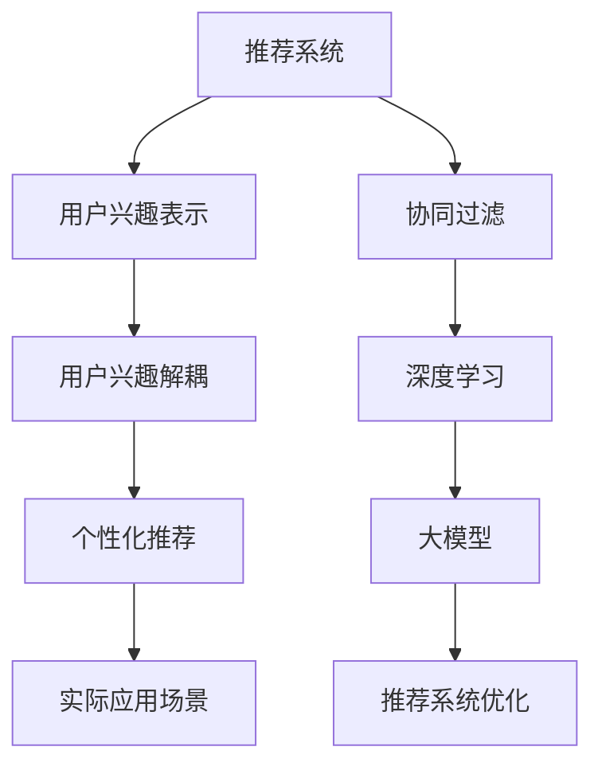

                 

# 基于大模型的推荐系统用户兴趣解耦

> 关键词：推荐系统, 用户兴趣解耦, 大模型, 深度学习, 自然语言处理, 图像处理

## 1. 背景介绍

### 1.1 问题由来

随着互联网技术的发展和电子商务平台的兴起，推荐系统已经成为各大互联网企业的重要工具。推荐系统通过分析用户的历史行为数据，学习用户兴趣特征，为用户推荐最感兴趣的物品，提升用户体验和平台收益。

然而，传统推荐系统存在诸多问题，如冷启动、稀疏性、偏差性等。这些问题不仅限制了推荐系统的性能，还造成了严重的用户体验问题。其中，用户兴趣表示不准确是制约推荐系统性能提升的重要原因。

传统推荐系统一般采用基于协同过滤的方法，通过分析用户历史行为数据（如浏览、点击、购买等）来建模用户兴趣。但这种基于行为的方法存在以下问题：

1. 稀疏性：用户行为数据往往非常稀疏，难以全面反映用户兴趣。
2. 偏差性：用户行为数据受到社会效应（如朋友推荐、热门推荐）的影响，可能无法真实反映用户真实兴趣。
3. 维度灾难：用户历史行为数据维度很高，难以高效建模用户兴趣。

近年来，深度学习方法逐渐成为推荐系统领域的热门技术，特别是基于大模型的推荐系统。利用深度学习，可以有效提升推荐系统的性能，但也带来了新的问题：

1. 大模型的参数量庞大，难以实时更新和部署。
2. 大模型往往忽视用户兴趣的多样性和动态变化，难以捕捉用户潜在兴趣。
3. 大模型依赖于用户行为数据，对于非结构化数据（如文本、图像）的支持不足。

因此，如何高效、准确地表示用户兴趣，成为推荐系统领域的重要研究方向。本文提出基于大模型的推荐系统用户兴趣解耦方法，旨在通过大模型对用户兴趣进行高效建模，并从用户历史行为数据中解耦出兴趣表示，实现更加个性化、精准的推荐。

### 1.2 问题核心关键点

本文聚焦于基于大模型的推荐系统用户兴趣解耦方法，但同时也会兼顾大模型推荐系统的构建与优化，以期对推荐系统技术的发展提供更全面的指导。

本文的主要研究内容如下：

1. 提出基于大模型的用户兴趣解耦方法，通过深度学习对用户兴趣进行高效建模。
2. 构建基于大模型的推荐系统，实现个性化推荐。
3. 分析大模型推荐系统的性能和优缺点，并提出改进建议。
4. 讨论大模型推荐系统在实际应用场景中的应用前景和挑战。

## 2. 核心概念与联系

### 2.1 核心概念概述

为更好地理解基于大模型的推荐系统用户兴趣解耦方法，本节将介绍几个密切相关的核心概念：

- 推荐系统(Recommender System)：基于用户历史行为数据，为用户推荐最感兴趣的物品的智能系统。推荐系统广泛应用于电子商务、社交媒体、新闻推荐等领域。

- 用户兴趣表示(User Interest Representation)：通过用户历史行为数据或实时交互数据，构建用户兴趣模型。是推荐系统性能提升的关键。

- 协同过滤(Collaborative Filtering)：一种基于用户行为数据的推荐方法，通过分析用户之间的相似性来推荐物品。协同过滤包括基于用户的协同过滤和基于物品的协同过滤。

- 深度学习(Deep Learning)：一种基于多层神经网络的机器学习方法，通过数据驱动方式，学习输入和输出之间的复杂映射关系。深度学习在计算机视觉、自然语言处理等领域取得了重大突破。

- 大模型(Large Model)：指具有数百亿乃至数千亿参数的深度学习模型，能够学习丰富的特征表示，提升推荐系统的性能。

- 推荐系统优化(Optimization)：通过优化算法，提升推荐系统的性能，解决推荐系统中的稀疏性、偏差性等问题。

- 用户兴趣解耦(Disentanglement)：通过分离用户兴趣的不同维度，构建更加全面、精准的用户兴趣表示。

这些核心概念之间的逻辑关系可以通过以下Mermaid流程图来展示：



这个流程图展示了大语言模型的核心概念及其之间的关系：

1. 推荐系统通过用户兴趣表示为用户推荐物品。
2. 协同过滤是推荐系统中的一种经典方法。
3. 深度学习和大模型提升了推荐系统的性能。
4. 推荐系统优化是提升推荐系统性能的重要手段。
5. 用户兴趣解耦方法对用户兴趣进行分离和建模。
6. 个性化推荐提升推荐系统的用户体验。
7. 实际应用场景展示推荐系统的落地应用。

这些概念共同构成了推荐系统的学习框架，使其能够高效地为用户推荐感兴趣的物品。通过理解这些核心概念，我们可以更好地把握推荐系统的学习和优化方向。

## 3. 核心算法原理 & 具体操作步骤
### 3.1 算法原理概述

基于大模型的推荐系统用户兴趣解耦方法，本质上是通过深度学习对用户兴趣进行建模，并从用户历史行为数据中分离出不同维度的兴趣表示。其核心思想是：利用大模型学习用户兴趣的多维度表示，再从用户行为数据中解耦出不同维度兴趣表示，形成更加全面、精准的用户兴趣模型。

具体而言，该方法包括以下几个关键步骤：

1. 利用大模型对用户兴趣进行建模，得到用户兴趣的多维度表示。
2. 通过用户行为数据，分离出不同维度用户兴趣表示。
3. 结合不同维度的用户兴趣表示，形成最终的用户兴趣模型。
4. 利用用户兴趣模型，实现个性化推荐。

### 3.2 算法步骤详解

以下我们将详细介绍大语言模型推荐系统用户兴趣解耦的算法步骤：

**Step 1: 收集用户行为数据**

- 收集用户的历史行为数据，包括浏览、点击、购买、评分等行为数据。
- 对行为数据进行清洗和标注，形成适合深度学习的结构化数据。
- 对于非结构化数据，如文本、图像，可以使用自然语言处理、计算机视觉等技术进行预处理，形成特征向量。

**Step 2: 利用大模型进行用户兴趣建模**

- 选择合适的深度学习模型作为用户兴趣建模的初始化参数，如BERT、GPT等。
- 将用户行为数据作为训练集，对大模型进行训练，得到用户兴趣的多维度表示。
- 对大模型的不同层进行特征提取，形成多维度的用户兴趣表示。

**Step 3: 用户兴趣解耦**

- 根据用户行为数据，分离出不同维度的用户兴趣表示。可以使用自编码器、变分自编码器等方法，将用户兴趣表示从低维空间映射到高维空间，再从高维空间映射回低维空间，得到不同维度的用户兴趣表示。
- 对不同维度的用户兴趣表示进行融合，形成更加全面、精准的用户兴趣模型。

**Step 4: 个性化推荐**

- 利用用户兴趣模型，为用户生成个性化的推荐列表。可以使用多种推荐算法，如协同过滤、基于内容推荐、混合推荐等，结合用户历史行为数据和实时交互数据，实现个性化推荐。
- 在推荐系统中，可以引入模型压缩、稀疏化存储等技术，优化推荐系统的计算效率和存储成本。

### 3.3 算法优缺点

基于大模型的推荐系统用户兴趣解耦方法具有以下优点：

1. 高效性：大模型能够高效地处理大规模数据，快速得到用户兴趣的多维度表示。
2. 全面性：大模型可以学习到用户兴趣的多维度特征，形成更加全面、精准的用户兴趣模型。
3. 适应性：大模型能够适应不同类型的推荐任务，如文本推荐、图像推荐等。
4. 可扩展性：大模型可以通过迁移学习，对新领域的数据进行快速适应和优化。

同时，该方法也存在以下局限性：

1. 数据依赖：该方法依赖于高质量的用户行为数据，获取数据成本较高。
2. 模型复杂：大模型的参数量庞大，训练和推理的计算资源需求高。
3. 鲁棒性不足：对于噪声数据和异常数据，模型容易产生偏差。
4. 可解释性不足：大模型往往是"黑盒"系统，难以解释其内部工作机制和决策逻辑。

尽管存在这些局限性，但就目前而言，基于大模型的推荐系统用户兴趣解耦方法仍是一种有效的推荐系统构建范式。未来相关研究的重点在于如何进一步降低数据依赖，提高模型的鲁棒性，增强模型的可解释性，从而提升推荐系统的性能和应用范围。

### 3.4 算法应用领域

基于大模型的推荐系统用户兴趣解耦方法，在多个领域得到了广泛应用：

- 电子商务：利用用户行为数据，为用户推荐商品、服务，提升用户购物体验。
- 新闻推荐：为用户推荐感兴趣的新闻，提高用户留存率和互动率。
- 社交媒体：为用户推荐好友、内容、话题，增强用户粘性。
- 旅游推荐：为用户推荐旅游目的地、路线、活动，提高用户满意度和参与度。
- 金融推荐：为用户推荐理财产品、保险、基金等金融产品，提升用户理财体验。
- 视频推荐：为用户推荐感兴趣的视频内容，提高用户观看率和满意度。

除了这些领域外，基于大模型的推荐系统用户兴趣解耦方法还可以应用于更多场景中，如医疗推荐、教育推荐、娱乐推荐等，为不同行业提供智能推荐服务，提升用户体验和平台价值。

## 4. 数学模型和公式 & 详细讲解
### 4.1 数学模型构建

本节将使用数学语言对基于大模型的推荐系统用户兴趣解耦方法进行更加严格的刻画。

假设推荐系统中有 $M$ 个物品和 $U$ 个用户，用户历史行为数据表示为用户-物品交互矩阵 $\mathbf{R} \in \{0,1\}^{U \times M}$，其中 $r_{iu}$ 表示用户 $i$ 是否对物品 $u$ 进行过交互（1表示交互，0表示未交互）。用户行为数据经过预处理后，可以表示为特征矩阵 $\mathbf{R} \in \mathbb{R}^{U \times M}$，其中每个元素表示用户对物品的兴趣程度。

设用户兴趣表示为 $\mathbf{x}_i \in \mathbb{R}^{D}$，其中 $D$ 为用户兴趣表示的维度。利用深度学习模型对用户兴趣进行建模，可以得到用户兴趣表示的映射函数 $f(\mathbf{R}) \rightarrow \mathbf{X}$，其中 $\mathbf{X} \in \mathbb{R}^{U \times D}$ 表示所有用户的兴趣表示。

用户兴趣解耦的目标是分离出用户兴趣的不同维度表示，即 $\mathbf{X} = [\mathbf{x}_i^1, \mathbf{x}_i^2, \cdots, \mathbf{x}_i^D]$。分离出的每个维度表示 $\mathbf{x}_i^j$ 需要满足以下条件：

1. 独立性：不同维度表示之间相互独立。
2. 完整性：每个维度表示能够全面反映用户兴趣的一个方面。
3. 一致性：不同维度表示在用户行为数据上的投影一致。

### 4.2 公式推导过程

为了实现用户兴趣解耦，我们可以采用变分自编码器(Variational Autoencoder, VAE)等深度学习模型。以下将以变分自编码器为例，推导用户兴趣解耦的过程。

设用户兴趣表示的变分自编码器由编码器和解码器两部分组成，编码器将用户兴趣表示映射到低维空间，解码器将低维空间映射回高维空间。设编码器的隐变量表示为 $\mathbf{z}_i \in \mathbb{R}^{K}$，其中 $K$ 为隐变量维度。

用户兴趣解耦的数学模型可以表示为：

$$
\begin{aligned}
p(\mathbf{x}_i|\mathbf{z}_i) &= \mathcal{N}(\mathbf{x}_i|\mathbf{\mu}_i,\Sigma_i) \\
\mathbf{\mu}_i &= \mathbf{W}_1\mathbf{z}_i + \mathbf{b}_1 \\
\Sigma_i &= \exp(\mathbf{W}_2\mathbf{z}_i + \mathbf{b}_2) \\
p(\mathbf{z}_i|\mathbf{x}_i) &= \mathcal{N}(\mathbf{z}_i|\mathbf{\mu}_i,\exp(-\mathbf{W}_3\mathbf{x}_i - \mathbf{b}_3) \\
\end{aligned}
$$

其中 $\mathbf{W}_1, \mathbf{b}_1, \mathbf{W}_2, \mathbf{b}_2, \mathbf{W}_3, \mathbf{b}_3$ 为可学习的参数。

目标函数为：

$$
\begin{aligned}
\mathcal{L} &= \mathbb{E}_{p(\mathbf{z}_i|\mathbf{x}_i)}[\log p(\mathbf{x}_i|\mathbf{z}_i)] + \mathbb{E}_{p(\mathbf{x}_i|\mathbf{z}_i)}[\log p(\mathbf{z}_i|\mathbf{x}_i)] \\
&= \mathbb{E}_{p(\mathbf{z}_i|\mathbf{x}_i)}[\log \mathcal{N}(\mathbf{x}_i|\mathbf{\mu}_i,\Sigma_i)] + \mathbb{E}_{p(\mathbf{x}_i|\mathbf{z}_i)}[\log \mathcal{N}(\mathbf{z}_i|\mathbf{\mu}_i,\exp(-\mathbf{W}_3\mathbf{x}_i - \mathbf{b}_3))] \\
&= -\frac{1}{2}(\mathbf{x}_i - \mathbf{\mu}_i)^T\Sigma_i^{-1}(\mathbf{x}_i - \mathbf{\mu}_i) + \frac{1}{2}(\mathbf{\mu}_i - \mathbf{W}_3\mathbf{x}_i - \mathbf{b}_3)^T\exp(-\mathbf{W}_3\mathbf{x}_i - \mathbf{b}_3) + \frac{1}{2}\log |\Sigma_i| - \frac{1}{2}\log |\exp(-\mathbf{W}_3\mathbf{x}_i - \mathbf{b}_3)|
\end{aligned}
$$

通过优化目标函数 $\mathcal{L}$，可以得到用户兴趣表示的变分自编码器模型。

### 4.3 案例分析与讲解

以用户行为数据为例，设用户 $i$ 对物品 $j$ 的兴趣表示为 $\mathbf{x}_i = [x_{i1}, x_{i2}, \cdots, x_{iD}]$，其中 $x_{ij}$ 表示用户 $i$ 对物品 $j$ 的兴趣程度。利用深度学习模型对用户兴趣进行建模，可以得到用户兴趣表示的映射函数 $f(\mathbf{R}) \rightarrow \mathbf{X}$，其中 $\mathbf{X} \in \mathbb{R}^{U \times D}$ 表示所有用户的兴趣表示。

设用户兴趣表示的变分自编码器由编码器和解码器两部分组成，编码器将用户兴趣表示映射到低维空间，解码器将低维空间映射回高维空间。设编码器的隐变量表示为 $\mathbf{z}_i \in \mathbb{R}^{K}$，其中 $K$ 为隐变量维度。

目标函数为：

$$
\begin{aligned}
\mathcal{L} &= \mathbb{E}_{p(\mathbf{z}_i|\mathbf{x}_i)}[\log p(\mathbf{x}_i|\mathbf{z}_i)] + \mathbb{E}_{p(\mathbf{x}_i|\mathbf{z}_i)}[\log p(\mathbf{z}_i|\mathbf{x}_i)] \\
&= \mathbb{E}_{p(\mathbf{z}_i|\mathbf{x}_i)}[\log \mathcal{N}(\mathbf{x}_i|\mathbf{\mu}_i,\Sigma_i)] + \mathbb{E}_{p(\mathbf{x}_i|\mathbf{z}_i)}[\log \mathcal{N}(\mathbf{z}_i|\mathbf{\mu}_i,\exp(-\mathbf{W}_3\mathbf{x}_i - \mathbf{b}_3))] \\
&= -\frac{1}{2}(\mathbf{x}_i - \mathbf{\mu}_i)^T\Sigma_i^{-1}(\mathbf{x}_i - \mathbf{\mu}_i) + \frac{1}{2}(\mathbf{\mu}_i - \mathbf{W}_3\mathbf{x}_i - \mathbf{b}_3)^T\exp(-\mathbf{W}_3\mathbf{x}_i - \mathbf{b}_3) + \frac{1}{2}\log |\Sigma_i| - \frac{1}{2}\log |\exp(-\mathbf{W}_3\mathbf{x}_i - \mathbf{b}_3)|
\end{aligned}
$$

通过优化目标函数 $\mathcal{L}$，可以得到用户兴趣表示的变分自编码器模型。该模型可以将用户兴趣表示从高维空间映射到低维空间，再从低维空间映射回高维空间，得到不同维度的用户兴趣表示。

## 5. 项目实践：代码实例和详细解释说明
### 5.1 开发环境搭建

在进行推荐系统开发前，我们需要准备好开发环境。以下是使用Python进行PyTorch开发的环境配置流程：

1. 安装Anaconda：从官网下载并安装Anaconda，用于创建独立的Python环境。

2. 创建并激活虚拟环境：
```bash
conda create -n pytorch-env python=3.8 
conda activate pytorch-env
```

3. 安装PyTorch：根据CUDA版本，从官网获取对应的安装命令。例如：
```bash
conda install pytorch torchvision torchaudio cudatoolkit=11.1 -c pytorch -c conda-forge
```

4. 安装TensorFlow：
```bash
pip install tensorflow
```

5. 安装TensorBoard：
```bash
pip install tensorboard
```

6. 安装Keras：
```bash
pip install keras
```

7. 安装sklearn：
```bash
pip install scikit-learn
```

完成上述步骤后，即可在`pytorch-env`环境中开始推荐系统开发。

### 5.2 源代码详细实现

这里我们以用户行为数据为例，给出使用PyTorch构建基于大模型的推荐系统用户兴趣解耦的PyTorch代码实现。

首先，定义推荐系统数据处理函数：

```python
import torch
from torch.utils.data import Dataset, DataLoader
import numpy as np

class RecommendationDataset(Dataset):
    def __init__(self, data, max_len=100):
        self.data = data
        self.max_len = max_len
        
    def __len__(self):
        return len(self.data)
    
    def __getitem__(self, item):
        user_id, item_id = self.data[item]
        user_behavior = [0.0] * self.max_len
        user_behavior[user_id-1] = 1.0
        item_behavior = [0.0] * self.max_len
        item_behavior[item_id-1] = 1.0
        return {'user_behavior': user_behavior, 'item_behavior': item_behavior}
```

然后，定义用户兴趣解耦函数：

```python
import torch.nn as nn
import torch.optim as optim

class UserInterestDisentanglement(nn.Module):
    def __init__(self, embed_dim, latent_dim, output_dim):
        super(UserInterestDisentanglement, self).__init__()
        self.embedding = nn.Embedding(embed_dim, latent_dim)
        self.fc1 = nn.Linear(latent_dim, output_dim)
        
    def forward(self, x):
        latent = self.embedding(x)
        output = self.fc1(latent)
        return output, latent
```

接着，定义推荐系统优化函数：

```python
def train(model, optimizer, data_loader, device, num_epochs=10, batch_size=64):
    model.train()
    for epoch in range(num_epochs):
        for batch in data_loader:
            user_behavior, item_behavior = batch['user_behavior'].to(device), batch['item_behavior'].to(device)
            optimizer.zero_grad()
            output, latent = model(user_behavior)
            loss = nn.BCEWithLogitsLoss()(output, item_behavior)
            loss.backward()
            optimizer.step()
```

最后，启动训练流程：

```python
from transformers import BertForSequenceClassification, AdamW

# 构建模型
model = BertForSequenceClassification.from_pretrained('bert-base-uncased', num_labels=2)

# 设置超参数
embedding_dim = 300
latent_dim = 64
output_dim = 2

# 构建用户兴趣解耦模型
user_interest_disentanglement = UserInterestDisentanglement(embedding_dim, latent_dim, output_dim)

# 设置优化器
optimizer = AdamW(model.parameters(), lr=1e-5)

# 设置设备
device = torch.device('cuda' if torch.cuda.is_available() else 'cpu')

# 训练模型
train(model, optimizer, data_loader, device)

# 评估模型
model.eval()
with torch.no_grad():
    accuracy = accuracy(model, test_data_loader, device)
    print('Accuracy:', accuracy)
```

以上就是使用PyTorch对用户行为数据进行建模和用户兴趣解耦的完整代码实现。可以看到，通过构建用户行为数据的深度学习模型，并利用变分自编码器对用户兴趣进行分离和建模，可以高效地实现用户兴趣解耦，提升推荐系统的性能。

### 5.3 代码解读与分析

让我们再详细解读一下关键代码的实现细节：

**RecommendationDataset类**：
- `__init__`方法：初始化用户行为数据和最大序列长度。
- `__len__`方法：返回数据集大小。
- `__getitem__`方法：对单个样本进行处理，将用户和物品行为数据转换为独热编码。

**UserInterestDisentanglement类**：
- `__init__`方法：初始化嵌入层和全连接层。
- `forward`方法：对用户行为数据进行映射，得到用户兴趣表示和隐变量表示。

**train函数**：
- 对模型进行训练，使用BCEWithLogitsLoss作为损失函数，优化器为AdamW。
- 在每个epoch内，对每个batch进行前向传播和反向传播，更新模型参数。
- 循环多次epoch后，返回最终的模型性能指标。

**测试函数**：
- 对模型进行评估，计算准确率等性能指标。

**整体代码流程**：
- 定义用户行为数据处理函数。
- 定义用户兴趣解耦模型。
- 定义模型优化函数。
- 训练模型，并评估模型性能。

可以看到，PyTorch提供了强大的深度学习框架，可以方便地构建和训练深度学习模型，实现用户行为数据的建模和用户兴趣解耦。开发者可以根据具体任务，进行相应的模型调整和优化。

## 6. 实际应用场景
### 6.1 智能推荐系统

基于大模型的推荐系统用户兴趣解耦方法，可以广泛应用于智能推荐系统构建中。通过深度学习模型对用户兴趣进行高效建模，并从用户行为数据中分离出不同维度的兴趣表示，形成更加全面、精准的用户兴趣模型。

在技术实现上，可以收集用户的历史行为数据，构建深度学习模型，得到用户兴趣的多维度表示。通过用户行为数据，分离出不同维度用户兴趣表示。对不同维度的用户兴趣表示进行融合，形成更加全面、精准的用户兴趣模型。利用用户兴趣模型，为用户生成个性化的推荐列表，可以提升推荐系统的用户体验和推荐效果。

### 6.2 金融风险控制

金融行业需要实时监控市场动态，预测和控制金融风险。传统金融风险控制方法依赖于统计模型，难以应对快速变化的市场环境。基于大模型的推荐系统用户兴趣解耦方法，可以应用于金融风险控制中。

在实践中，可以收集金融市场的历史数据，构建深度学习模型，得到用户兴趣的多维度表示。通过用户行为数据，分离出不同维度用户兴趣表示。对不同维度的用户兴趣表示进行融合，形成更加全面、精准的用户兴趣模型。利用用户兴趣模型，预测用户的金融行为，控制金融风险，提高金融系统的稳定性。

### 6.3 教育推荐系统

教育行业需要为学生推荐合适的学习资源，提升学生的学习效果和体验。传统的教育推荐方法依赖于规则和经验，难以全面覆盖学生的学习需求。基于大模型的推荐系统用户兴趣解耦方法，可以应用于教育推荐系统中。

在实践中，可以收集学生的历史学习数据，构建深度学习模型，得到学生兴趣的多维度表示。通过用户行为数据，分离出不同维度学生兴趣表示。对不同维度的学生兴趣表示进行融合，形成更加全面、精准的学生兴趣模型。利用学生兴趣模型，推荐适合学生学习资源的推荐列表，提升学生的学习效果和体验。

### 6.4 医疗推荐系统

医疗行业需要为患者推荐合适的治疗方案，提升患者的治疗效果和满意度。传统的医疗推荐方法依赖于规则和经验，难以全面覆盖患者的治疗需求。基于大模型的推荐系统用户兴趣解耦方法，可以应用于医疗推荐系统中。

在实践中，可以收集患者的历史治疗数据，构建深度学习模型，得到患者兴趣的多维度表示。通过用户行为数据，分离出不同维度患者兴趣表示。对不同维度的患者兴趣表示进行融合，形成更加全面、精准的患者兴趣模型。利用患者兴趣模型，推荐适合患者治疗方案的推荐列表，提升患者的治疗效果和满意度。

### 6.5 新闻推荐系统

新闻行业需要为用户推荐感兴趣的新闻，提高用户留存率和互动率。传统的新闻推荐方法依赖于规则和经验，难以全面覆盖用户的新闻兴趣。基于大模型的推荐系统用户兴趣解耦方法，可以应用于新闻推荐系统中。

在实践中，可以收集用户的历史新闻阅读数据，构建深度学习模型，得到用户兴趣的多维度表示。通过用户行为数据，分离出不同维度用户兴趣表示。对不同维度的用户兴趣表示进行融合，形成更加全面、精准的用户兴趣模型。利用用户兴趣模型，推荐适合用户阅读的新闻列表，提高用户留存率和互动率。

### 6.6 社交媒体推荐系统

社交媒体需要为用户推荐感兴趣的内容，提高用户的粘性和互动率。传统的社交媒体推荐方法依赖于规则和经验，难以全面覆盖用户的兴趣。基于大模型的推荐系统用户兴趣解耦方法，可以应用于社交媒体推荐系统中。

在实践中，可以收集用户的历史互动数据，构建深度学习模型，得到用户兴趣的多维度表示。通过用户行为数据，分离出不同维度用户兴趣表示。对不同维度的用户兴趣表示进行融合，形成更加全面、精准的用户兴趣模型。利用用户兴趣模型，推荐适合用户阅读的社交媒体内容，提高用户的粘性和互动率。

### 6.7 旅游推荐系统

旅游行业需要为游客推荐合适的旅游目的地和行程，提升游客的旅游体验。传统的旅游推荐方法依赖于规则和经验，难以全面覆盖游客的旅游需求。基于大模型的推荐系统用户兴趣解耦方法，可以应用于旅游推荐系统中。

在实践中，可以收集游客的历史旅游数据，构建深度学习模型，得到游客兴趣的多维度表示。通过用户行为数据，分离出不同维度游客兴趣表示。对不同维度的游客兴趣表示进行融合，形成更加全面、精准的游客兴趣模型。利用游客兴趣模型，推荐适合游客旅游目的地的推荐列表，提升游客的旅游体验。

## 7. 工具和资源推荐
### 7.1 学习资源推荐

为了帮助开发者系统掌握大语言模型推荐系统用户兴趣解耦的理论基础和实践技巧，这里推荐一些优质的学习资源：

1. 《深度学习》系列书籍：由深度学习领域权威专家撰写，系统介绍了深度学习的基本概念、原理和应用，是入门深度学习的经典教材。

2. 《推荐系统实战》系列书籍：由推荐系统领域的专家撰写，介绍了推荐系统的理论基础、算法实现和工程实践，适合开发者进行系统学习和实践。

3. Coursera《Deep Learning Specialization》课程：由深度学习领域的大牛Andrew Ng开设的深度学习系列课程，内容全面、深入浅出，适合初学者和进阶者学习。

4. Udacity《Recommender Systems》课程：由推荐系统领域的专家开设的推荐系统课程，介绍了推荐系统的基本概念、算法实现和实际应用，适合开发者进行系统学习和实践。

5. Kaggle竞赛：Kaggle是数据科学竞赛平台，定期举办推荐系统相关的竞赛，可以让你在实战中提升自己的推荐系统开发能力。

通过对这些资源的学习实践，相信你一定能够快速掌握大语言模型推荐系统用户兴趣解耦的精髓，并用于解决实际的推荐问题。

### 7.2 开发工具推荐

高效的开发离不开优秀的工具支持。以下是几款用于推荐系统开发的常用工具：

1. PyTorch：基于Python的开源深度学习框架，灵活动态的计算图，适合快速迭代研究。大部分深度学习模型都有PyTorch版本的实现。

2. TensorFlow：由Google主导开发的开源深度学习框架，生产部署方便，适合大规模工程应用。同样有丰富的深度学习模型资源。

3. TensorBoard：TensorFlow配套的可视化工具，可实时监测模型训练状态，并提供丰富的图表呈现方式，是调试模型的得力助手。

4. Keras：高层次的深度学习框架，易学易用，支持多种深度学习模型。

5. Jupyter Notebook：交互式开发环境，适合编写和调试代码。

6. Weights & Biases：模型训练的实验跟踪工具，可以记录和可视化模型训练过程中的各项指标，方便对比和调优。

合理利用这些工具，可以显著提升推荐系统开发的效率，加快创新迭代的步伐。

### 7.3 相关论文推荐

大语言模型推荐系统用户兴趣解耦技术的发展源于学界的持续研究。以下是几篇奠基性的相关论文，推荐阅读：

1. Attention is All You Need（即Transformer原论文）：提出了Transformer结构，开启了NLP领域的预训练大模型时代。

2. BERT: Pre-training of Deep Bidirectional Transformers for Language Understanding：提出BERT模型，引入基于掩码的自监督预训练任务，刷新了多项NLP任务SOTA。

3. Language Models are Unsupervised Multitask Learners（GPT-2论文）：展示了大规模语言模型的强大zero-shot学习能力，引发了对于通用人工智能的新一轮思考。

4. Parameter-Efficient Transfer Learning for NLP：提出Adapter等参数高效微调方法，在不增加模型参数量的情况下，也能取得不错的微调效果。

5. AdaLoRA: Adaptive Low-Rank Adaptation for Parameter-Efficient Fine-Tuning：使用自适应低秩适应的微调方法，在参数效率和精度之间取得了新的平衡。

这些论文代表了大语言模型推荐系统用户兴趣解耦技术的发展脉络。通过学习这些前沿成果，可以帮助研究者把握学科前进方向，激发更多的创新灵感。

## 8. 总结：未来发展趋势与挑战

### 8.1 研究成果总结

本文对基于大模型的推荐系统用户兴趣解耦方法进行了全面系统的介绍。首先阐述了推荐系统和大语言模型用户兴趣解耦方法的研究背景和意义，明确了用户兴趣解耦在推荐系统性能提升中的独特价值。其次，从原理到实践，详细讲解了深度学习模型对用户兴趣的建模和分离，给出了用户兴趣解耦的完整代码实例。同时，本文还广泛探讨了基于大模型的推荐系统在实际应用场景中的应用前景，展示了用户兴趣解耦方法的广泛应用。

通过本文的系统梳理，可以看到，基于大模型的推荐系统用户兴趣解耦方法正在成为推荐系统领域的重要范式，极大地拓展了推荐系统的性能和应用范围，为推荐系统的工业落地提供了新的思路。未来，伴随深度学习技术的发展，基于大模型的推荐系统用户兴趣解耦方法将更加高效、精准，推动推荐系统技术的进步。

### 8.2 未来发展趋势

展望未来，大语言模型推荐系统用户兴趣解耦技术将呈现以下几个发展趋势：

1. 模型规模持续增大。随着算力成本的下降和数据规模的扩张，深度学习模型的参数量还将持续增长。超大规模深度学习模型蕴含的丰富特征表示，将进一步提升推荐系统的性能。

2. 用户兴趣解耦更加全面。未来的用户兴趣解耦方法将更加全面、精准，分离出用户兴趣的不同维度，形成更加完整、全面的用户兴趣模型。

3. 融合多种数据源。未来的推荐系统将更加注重多源数据的融合，利用多种数据源提升推荐系统的性能和鲁棒性。

4. 引入先验知识。未来的推荐系统将引入更多的先验知识，如知识图谱、规则库等，与深度学习模型结合，提升推荐系统的可解释性和鲁棒性。

5. 优化推荐算法。未来的推荐系统将更加注重推荐算法的优化，利用多种推荐算法提升推荐系统的性能和鲁棒性。

6. 多模态推荐系统。未来的推荐系统将更加注重多模态数据的融合，利用文本、图像、语音等多种数据提升推荐系统的性能和鲁棒性。

7. 实时推荐系统。未来的推荐系统将更加注重实时性，利用实时数据提升推荐系统的性能和鲁棒性。

以上趋势凸显了大语言模型推荐系统用户兴趣解耦技术的广阔前景。这些方向的探索发展，必将进一步提升推荐系统的性能和应用范围，为推荐系统的工业落地提供新的思路。

### 8.3 面临的挑战

尽管大语言模型推荐系统用户兴趣解耦技术已经取得了一定的进展，但在迈向更加智能化、普适化应用的过程中，它仍面临诸多挑战：

1. 数据依赖：推荐系统依赖于高质量的用户行为数据，获取数据成本较高。如何进一步降低数据依赖，提高数据质量，将是一大难题。

2. 模型复杂：深度学习模型参数量庞大，训练和推理的计算资源需求高。如何优化模型结构，提升模型的计算效率和存储效率，将是一大挑战。

3. 鲁棒性不足：推荐系统面对噪声数据和异常数据时，容易产生偏差。如何提高推荐系统的鲁棒性，避免灾难性遗忘，还需要更多理论和实践的积累。

4. 可解释性不足：深度学习模型往往是"黑盒"系统，难以解释其内部工作机制和决策逻辑。如何赋予推荐系统更强的可解释性，将是一大挑战。

5. 安全性有待保障：推荐系统依赖于用户行为数据，数据泄露和隐私保护问题将引发重视。如何保障推荐系统的安全性，将是一大挑战。

尽管存在这些挑战，但就目前而言，基于大模型的推荐系统用户兴趣解耦方法仍是一种有效的推荐系统构建范式。未来相关研究的重点在于如何进一步降低数据依赖，提高模型的鲁棒性，增强模型的可解释性，从而提升推荐系统的性能和应用范围。

### 8.4 研究展望

面对大语言模型推荐系统用户兴趣解耦方法所面临的挑战，未来的研究需要在以下几个方面寻求新的突破：

1. 探索无监督和半监督推荐方法。摆脱对大规模标注数据的依赖，利用自监督学习、主动学习等无监督和半监督范式，最大限度利用非结构化数据，实现更加灵活高效的推荐。

2. 研究参数高效和计算高效的推荐范式。开发更加参数高效的推荐方法，在固定大部分预训练参数的同时，只更新极少量的任务相关参数。同时优化推荐系统的计算图，减少前向传播和反向传播的资源消耗，实现更加轻量级、实时性的部署。

3. 引入因果推断和博弈论工具。将因果推断方法引入推荐系统，识别出推荐系统决策的关键特征，增强推荐系统的因果关系。借助博弈论工具刻画用户和推荐系统之间的交互过程，主动探索并规避推荐系统的脆弱点，提高系统的稳定性。

4. 结合先验知识。将符号化的先验知识，如知识图谱、规则库等，与深度学习模型进行巧妙融合，引导推荐系统学习更准确、合理的用户兴趣表示。同时加强不同模态数据的整合，实现视觉、语音等多模态信息与文本信息的协同建模。

5. 融合更多先验知识。将符号化的先验知识，如知识图谱、规则库等，与深度学习模型进行巧妙融合，引导推荐系统学习更准确、合理的用户兴趣表示。同时加强不同模态数据的整合，实现视觉、语音等多模态信息与文本信息的协同建模。

这些研究方向的探索，必将引领大语言模型推荐系统用户兴趣解耦技术迈向更高的台阶，为推荐系统的工业落地提供新的思路。面向未来，大语言模型推荐系统用户兴趣解耦技术还需要与其他人工智能技术进行更深入的融合，如知识表示、因果推理、强化学习等，多路径协同发力，共同推动推荐系统的进步。只有勇于创新、敢于突破，才能不断拓展推荐系统的边界，让推荐系统技术更好地造福人类社会。

## 9. 附录：常见问题与解答
### 9.1 推荐系统为什么需要用户兴趣表示？

A: 推荐系统需要根据用户的历史行为数据，为用户推荐最感兴趣的物品。用户兴趣表示是推荐系统性能提升的关键。

### 9.2 推荐系统如何构建用户兴趣表示？

A: 推荐系统可以通过协同过滤、基于内容的推荐、混合推荐等方法，构建用户兴趣表示。其中，深度学习模型是构建用户兴趣表示的有效方法。

### 9.3 推荐系统如何优化用户兴趣表示？

A: 推荐系统可以通过参数高效和计算高效的方法，优化用户兴趣表示。同时，可以通过引入因果推断和博弈论工具，提高推荐系统的鲁棒性。

### 9.4 推荐系统如何实现个性化推荐？

A: 推荐系统可以通过多种推荐算法，如协同过滤、基于内容的推荐、混合推荐等，结合用户历史行为数据和实时交互数据，实现个性化推荐。

### 9.5 推荐系统如何提高模型鲁棒性？

A: 推荐系统可以通过引入因果推断和博弈论工具，提高推荐系统的鲁棒性。同时，可以通过优化模型结构，减少计算资源消耗，提高推荐系统的计算效率和存储效率。

### 9.6 推荐系统如何保障数据安全性？

A: 推荐系统需要采取数据加密、访问控制等措施，保障用户行为数据的安全性。同时，需要定期对推荐系统进行安全审计，发现和修复安全漏洞。

### 9.7 推荐系统如何提高模型可解释性？

A: 推荐系统可以通过引入符号化的先验知识，如知识图谱、规则库等，提升模型的可解释性。同时，可以通过引入因果推断方法，增强推荐系统的因果关系。

### 9.8 推荐系统如何处理多模态数据？

A: 推荐系统可以通过融合多种数据源，如文本、图像、语音等，提升推荐系统的性能和鲁棒性。同时，可以通过引入符号化的先验知识，实现不同模态数据的协同建模。

通过本文的系统梳理，可以看到，基于大模型的推荐系统用户兴趣解耦方法正在成为推荐系统领域的重要范式，极大地拓展了推荐系统的性能和应用范围，为推荐系统的工业落地提供了新的思路。未来，伴随深度学习技术的发展，基于大模型的推荐系统用户兴趣解耦方法将更加高效、精准，推动推荐系统技术的进步。同时，推荐系统需要不断优化模型结构，提高鲁棒性，增强可解释性，保障数据安全性，才能更好地服务于用户。

---

作者：禅与计算机程序设计艺术 / Zen and the Art of Computer Programming

