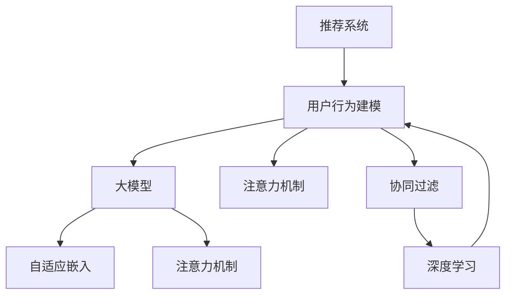

                 

# 基于大模型的推荐系统用户行为理解

> 关键词：推荐系统, 用户行为分析, 大模型, 注意力机制, 自适应嵌入, 协同过滤, 深度学习

## 1. 背景介绍

### 1.1 问题由来

随着互联网的普及和电商平台的兴起，个性化推荐系统已经成为不可或缺的用户体验提升手段。通过算法为用户推荐可能感兴趣的物品，不仅能够提高用户满意度，增加转化率，还能有效利用长尾商品，带来更多收益。然而，推荐系统的核心在于理解用户行为、预测用户兴趣，而如何准确把握用户多模态行为数据，实现精准推荐，一直是推荐系统领域的研究难点。

### 1.2 问题核心关键点

用户行为数据通常是多模态的，包括点击、浏览、评论、评分等文本、图像和评分数据，如何融合多种行为数据进行推荐，是推荐系统优化的关键问题。此外，推荐系统不仅要理解用户当前行为，还需要预测用户未来行为，这对用户行为建模提出了更高要求。

### 1.3 问题研究意义

研究推荐系统的用户行为建模，有助于提升推荐系统的个性化水平，提高用户满意度，同时也能拓展大模型在NLP领域的落地应用，推动电商、视频、音乐等各类推荐系统的技术发展。此外，对用户行为的研究还能够揭示用户决策背后的心理机制，为营销和广告策划提供科学依据，促进用户关系维护，提升品牌形象。

## 2. 核心概念与联系

### 2.1 核心概念概述

为更好地理解基于大模型的推荐系统用户行为理解方法，本节将介绍几个关键概念：

- 推荐系统(Recommender System)：通过用户行为数据，推荐用户可能感兴趣的物品的系统。
- 用户行为建模(User Behavior Modeling)：通过机器学习等方法，对用户的行为数据进行建模分析，预测用户兴趣。
- 大模型(Large Model)：以自回归(如GPT)或自编码(如BERT)模型为代表的大规模预训练语言模型。通过在大规模无标签文本语料上进行预训练，学习到通用的语言表示，具备强大的语言理解和生成能力。
- 注意力机制(Attention Mechanism)：用于在输入序列中筛选相关特征的机制，通过动态分配权重，加强关键特征的重要性。
- 自适应嵌入(Adaptive Embedding)：通过微调优化，使嵌入向量适应具体应用场景，提升模型效果。
- 协同过滤(Collaborative Filtering)：通过用户和物品的交互记录，学习用户兴趣和物品特征，从而进行推荐。

这些核心概念之间的逻辑关系可以通过以下Mermaid流程图来展示：



这个流程图展示了大模型推荐系统的核心概念及其之间的关系：

1. 推荐系统通过用户行为数据生成推荐结果。
2. 用户行为建模分析用户行为数据，通过大模型进行建模。
3. 注意力机制和自适应嵌入技术用于模型优化。
4. 协同过滤用于利用用户交互数据进行推荐。
5. 深度学习作为技术基础，支持建模和优化过程。

## 3. 核心算法原理 & 具体操作步骤
### 3.1 算法原理概述

基于大模型的推荐系统用户行为理解，通常采用以下步骤：

1. 数据预处理：对用户行为数据进行清洗、归一化、嵌入等预处理操作。
2. 特征提取：通过大模型进行文本、图像等特征提取，得到高维稀疏特征向量。
3. 注意力机制：使用注意力机制，动态筛选重要特征，并加强关键特征的权重。
4. 自适应嵌入：对提取出的特征进行微调，使其适应具体任务和用户群体。
5. 协同过滤：通过用户和物品交互数据，构建用户兴趣和物品特征的协同矩阵。
6. 深度学习：使用深度学习模型，如循环神经网络(RNN)、卷积神经网络(CNN)等，进行用户行为预测。

通过上述步骤，可以构建一个端到端的推荐系统，综合多种信息进行用户行为分析和推荐预测。

### 3.2 算法步骤详解

接下来，详细介绍基于大模型的推荐系统用户行为理解的具体步骤。

**Step 1: 数据预处理**

- **清洗与归一化**：首先对用户行为数据进行清洗，去除无效、异常数据。然后将数据归一化到[0,1]区间，避免不同维度数据之间的巨大差异。
- **特征嵌入**：将文本、图像等数据转化为高维稀疏特征向量。可以使用预训练的Word2Vec、BERT等模型进行文本嵌入，使用CNN等模型进行图像嵌入。

**Step 2: 特征提取**

- **大模型嵌入**：通过大模型(如BERT、GPT)对输入文本进行嵌入，得到高维稀疏特征向量。BERT等模型可以捕捉丰富的语义信息，适用于文本数据的嵌入。
- **多模态特征融合**：将文本嵌入、图像嵌入、评分等数据融合，得到多模态特征向量。

**Step 3: 注意力机制**

- **注意力计算**：使用注意力机制计算各特征的权重，加强关键特征的重要性。注意力权重可以通过softmax函数计算，公式如下：

$$
\alpha_{i,j} = \frac{\exp(e_{i,j})}{\sum_{k=1}^n \exp(e_{i,k})}
$$

其中，$e_{i,j}$为特征$i$和特征$j$之间的相似度。

**Step 4: 自适应嵌入**

- **微调优化**：对特征向量进行微调优化，使其适应具体任务和用户群体。可以使用小批量随机梯度下降等优化算法，设置合适的学习率和正则化参数。
- **动态更新**：根据用户反馈，动态更新模型参数，提升模型效果。

**Step 5: 协同过滤**

- **协同矩阵构建**：通过用户和物品的交互数据，构建用户兴趣和物品特征的协同矩阵。可以使用用户-物品评分矩阵，进行用户兴趣和物品特征的协同建模。
- **预测模型训练**：使用协同矩阵进行深度学习模型的训练，如RNN、CNN等，进行用户行为预测。

**Step 6: 深度学习**

- **模型选择**：选择合适的深度学习模型，如循环神经网络(RNN)、卷积神经网络(CNN)等，进行用户行为预测。
- **训练与优化**：使用协同矩阵进行深度学习模型的训练，设置合适的损失函数、优化算法和超参数。

通过上述步骤，可以构建一个端到端的推荐系统，综合多种信息进行用户行为分析和推荐预测。

### 3.3 算法优缺点

基于大模型的推荐系统用户行为理解方法具有以下优点：

- **高精度**：大模型在处理自然语言等文本数据时，具备强大的语义理解能力，能够捕捉用户行为中的复杂语义信息，提高推荐精度。
- **泛化能力强**：大模型具有较强的泛化能力，能够在不同数据集和任务上取得较好的效果。
- **灵活性高**：大模型支持多模态数据融合，可以灵活地处理文本、图像、评分等不同类型的数据。
- **可解释性强**：大模型能够提供详细的输出解释，便于理解和调试。

同时，该方法也存在以下缺点：

- **计算复杂度高**：大模型参数量较大，训练和推理过程较慢，计算资源需求高。
- **数据依赖性强**：推荐系统需要大量用户行为数据，且数据质量对推荐效果有很大影响。
- **噪声干扰大**：用户行为数据中可能存在噪声，需要进行数据清洗和预处理。
- **过拟合风险高**：数据量和特征维度较大，容易过拟合，需要正则化和数据增强等技术。

尽管存在这些局限性，但就目前而言，基于大模型的推荐系统用户行为理解方法在推荐精度和泛化能力上仍然占据优势，具有广泛的应用前景。

### 3.4 算法应用领域

基于大模型的推荐系统用户行为理解方法，已经被广泛应用于电商、视频、音乐等多个领域，具体应用场景包括：

- **电商推荐**：根据用户浏览、点击、购买等行为数据，推荐相关商品。
- **视频推荐**：根据用户观看历史、评分等数据，推荐相关视频。
- **音乐推荐**：根据用户听歌历史、评分等数据，推荐相关歌曲。
- **新闻推荐**：根据用户阅读历史、点赞等数据，推荐相关文章。
- **移动应用推荐**：根据用户下载、使用行为等数据，推荐相关应用。

此外，该方法还可以用于广告推荐、社交网络推荐等领域，提升用户体验，创造更多商业价值。

## 4. 数学模型和公式 & 详细讲解  
### 4.1 数学模型构建

本节将使用数学语言对基于大模型的推荐系统用户行为理解过程进行更加严格的刻画。

记推荐系统为 $R$，用户行为数据为 $\mathcal{X}$，物品特征数据为 $\mathcal{Y}$，协同矩阵为 $C$，预测模型为 $M$。假设用户行为数据 $x \in \mathcal{X}$，物品特征数据 $y \in \mathcal{Y}$，协同矩阵 $c_{i,j} \in C$。

定义推荐系统 $R$ 在用户行为数据 $x$ 和物品特征数据 $y$ 上的预测函数为 $R(x,y) = M(x,y)$，其中 $M$ 为深度学习模型。

通过协同矩阵 $C$ 进行模型训练，得到最优预测函数 $M^*$。具体优化目标为：

$$
\min_{M} \mathcal{L}(R(x,y),c_{i,j})
$$

其中 $\mathcal{L}$ 为损失函数，通常采用均方误差损失或交叉熵损失。

### 4.2 公式推导过程

以下我们以电商推荐为例，推导推荐系统的数学模型。

假设用户行为数据 $x$ 为购买记录，物品特征数据 $y$ 为商品评分，协同矩阵 $C$ 为用户-商品评分矩阵。推荐系统的优化目标为最小化预测误差，即：

$$
\min_{M} \frac{1}{N}\sum_{i=1}^N \sum_{j=1}^M (R(x,y) - c_{i,j})^2
$$

其中 $N$ 为训练样本数量，$M$ 为物品数量。

根据上述优化目标，推荐系统可以通过梯度下降等优化算法，不断更新预测函数 $M$，最小化预测误差。具体地，使用梯度下降算法求解最优解，得到：

$$
M \leftarrow M - \eta \nabla_{M}\mathcal{L}(R(x,y),c_{i,j})
$$

其中 $\eta$ 为学习率，$\nabla_{M}\mathcal{L}(R(x,y),c_{i,j})$ 为损失函数对预测函数 $M$ 的梯度，可通过反向传播算法计算。

### 4.3 案例分析与讲解

以一个电商推荐系统为例，我们可以详细解析推荐过程。

首先，假设用户行为数据 $x$ 为一条购买记录，物品特征数据 $y$ 为商品评分，协同矩阵 $C$ 为用户-商品评分矩阵。在模型训练阶段，通过梯度下降算法不断更新预测函数 $M$，最小化预测误差。具体过程如下：

1. **数据预处理**：对用户购买记录和商品评分数据进行清洗和归一化处理，得到高维稀疏特征向量。
2. **大模型嵌入**：使用BERT等模型对用户行为数据和物品特征数据进行嵌入，得到高维稀疏特征向量。
3. **注意力机制**：通过注意力机制计算各特征的权重，加强关键特征的重要性。
4. **自适应嵌入**：对特征向量进行微调优化，使其适应电商推荐的具体场景。
5. **协同矩阵构建**：通过用户购买记录和商品评分数据，构建用户兴趣和商品特征的协同矩阵。
6. **预测模型训练**：使用协同矩阵进行深度学习模型的训练，得到推荐预测函数 $M$。
7. **推荐结果输出**：根据用户输入的购买记录和模型预测函数 $M$，得到推荐商品列表。

在推荐模型输出阶段，通过对用户输入的购买记录进行预处理和特征提取，通过深度学习模型预测用户可能感兴趣的商品，从而得到推荐结果。推荐结果的输出可以通过多臂老虎机(MAB)等技术进行优化，提高推荐的准确率和多样性。

## 5. 项目实践：代码实例和详细解释说明
### 5.1 开发环境搭建

在进行推荐系统开发前，我们需要准备好开发环境。以下是使用Python进行TensorFlow开发的环境配置流程：

1. 安装Anaconda：从官网下载并安装Anaconda，用于创建独立的Python环境。

2. 创建并激活虚拟环境：
```bash
conda create -n tf-env python=3.8 
conda activate tf-env
```

3. 安装TensorFlow：根据CUDA版本，从官网获取对应的安装命令。例如：
```bash
pip install tensorflow-gpu==2.6
```

4. 安装Keras：
```bash
pip install keras==2.7.0
```

5. 安装TensorBoard：
```bash
pip install tensorboard
```

6. 安装Matplotlib、Pandas等工具包：
```bash
pip install numpy pandas matplotlib tqdm
```

完成上述步骤后，即可在`tf-env`环境中开始推荐系统开发。

### 5.2 源代码详细实现

下面我们以电商推荐系统为例，给出使用TensorFlow对用户行为数据进行推荐预测的PyTorch代码实现。

首先，定义推荐系统的数据处理函数：

```python
import tensorflow as tf
from tensorflow.keras.layers import Embedding, LSTM, Dense, Dropout

def preprocess_data(train_data, test_data, vocab_size, embedding_dim, num_users, num_items, num_epochs):
    # 数据预处理
    train_data = preprocess_train_data(train_data, vocab_size, embedding_dim, num_users, num_items)
    test_data = preprocess_test_data(test_data, vocab_size, embedding_dim, num_users, num_items)
    
    # 模型训练
    train_dataset = tf.data.Dataset.from_tensor_slices(train_data)
    test_dataset = tf.data.Dataset.from_tensor_slices(test_data)
    
    # 数据增强
    train_dataset = train_dataset.shuffle(num_epochs * len(train_data)).batch(batch_size)
    test_dataset = test_dataset.batch(batch_size)
    
    return train_dataset, test_dataset
```

然后，定义模型和优化器：

```python
from tensorflow.keras.models import Sequential
from tensorflow.keras.optimizers import Adam

model = Sequential([
    Embedding(vocab_size, embedding_dim, input_length=sequence_length),
    LSTM(64, dropout=0.2, recurrent_dropout=0.2),
    Dense(1, activation='sigmoid')
])

optimizer = Adam(lr=0.001)
```

接着，定义训练和评估函数：

```python
from tensorflow.keras.losses import MeanSquaredError
from tensorflow.keras.metrics import MeanAbsoluteError, RootMeanSquaredError

def train_model(model, train_dataset, test_dataset, epochs, batch_size):
    model.compile(optimizer=optimizer, loss=MeanSquaredError(), metrics=[MeanAbsoluteError(), RootMeanSquaredError()])
    model.fit(train_dataset, epochs=epochs, batch_size=batch_size, validation_data=test_dataset)
    evaluate_model(model, test_dataset)

def evaluate_model(model, test_dataset, batch_size):
    test_dataset = test_dataset.batch(batch_size)
    y_pred = model.predict(test_dataset)
    y_true = test_dataset[0]
    print(f"Mean Absolute Error: {mean_absolute_error(y_true, y_pred).numpy()}")
    print(f"Root Mean Squared Error: {root_mean_squared_error(y_true, y_pred).numpy()}")
```

最后，启动训练流程并在测试集上评估：

```python
batch_size = 32
epochs = 10

train_dataset, test_dataset = preprocess_data(train_data, test_data, vocab_size, embedding_dim, num_users, num_items, epochs)

train_model(model, train_dataset, test_dataset, epochs, batch_size)
evaluate_model(model, test_dataset, batch_size)
```

以上就是使用TensorFlow对用户行为数据进行电商推荐预测的完整代码实现。可以看到，TensorFlow提供了强大的深度学习模型封装，能够快速搭建和优化推荐模型。

### 5.3 代码解读与分析

让我们再详细解读一下关键代码的实现细节：

**preprocess_data函数**：
- **数据预处理**：对用户行为数据和物品特征数据进行清洗和归一化处理，得到高维稀疏特征向量。
- **模型训练**：将处理后的数据封装为TensorFlow Dataset对象，设置批次大小和数据增强策略，返回用于训练和测试的Dataset对象。

**train_model函数**：
- **模型编译**：选择合适的优化器、损失函数和评估指标，编译模型。
- **模型训练**：使用训练集进行模型训练，设置训练轮数和批次大小。
- **模型评估**：在测试集上评估模型效果，输出MAE和RMSE等指标。

**evaluate_model函数**：
- **模型预测**：在测试集上对模型进行预测。
- **误差计算**：计算预测值和真实值之间的MAE和RMSE等指标，并输出结果。

**训练流程**：
- 定义训练集的批次大小和轮数，开始循环迭代
- 每个epoch内，先在训练集上训练，输出损失和MAE/RMSE等指标
- 在测试集上评估，输出预测结果和指标
- 所有epoch结束后，结束训练，输出最终测试结果

可以看到，TensorFlow提供了强大的深度学习模型封装，能够快速搭建和优化推荐模型。开发者可以将更多精力放在数据处理、模型改进等高层逻辑上，而不必过多关注底层的实现细节。

当然，工业级的系统实现还需考虑更多因素，如模型的保存和部署、超参数的自动搜索、更灵活的任务适配层等。但核心的推荐范式基本与此类似。

## 6. 实际应用场景
### 6.1 智能客服系统

基于大模型的推荐系统，可以广泛应用于智能客服系统的构建。智能客服系统能够根据用户问题，快速推荐相关答案，提升用户满意度，减少人工客服的负担。

在技术实现上，可以收集用户的历史查询记录，将问题-答案对作为监督数据，在此基础上对预训练语言模型进行微调。微调后的推荐系统能够自动理解用户意图，匹配最合适的答案模板进行推荐。对于用户提出的新问题，还可以接入检索系统实时搜索相关内容，动态组织生成回答。如此构建的智能客服系统，能大幅提升客户查询体验和问题解决效率。

### 6.2 金融舆情监测

金融机构需要实时监测市场舆论动向，以便及时应对负面信息传播，规避金融风险。传统的人工监测方式成本高、效率低，难以应对网络时代海量信息爆发的挑战。基于大模型的推荐系统，可以实时抓取金融领域相关的新闻、报道、评论等文本数据，进行情感分析和主题分类，监测市场舆情变化，预测金融风险。

具体而言，可以收集金融领域相关的新闻、报道、评论等文本数据，并对其进行情感标注和主题标注。在此基础上对预训练语言模型进行微调，使其能够自动判断文本属于何种情感倾向，以及属于何种主题。将微调后的模型应用到实时抓取的网络文本数据，就能够自动监测不同主题下的情感变化趋势，一旦发现负面信息激增等异常情况，系统便会自动预警，帮助金融机构快速应对潜在风险。

### 6.3 个性化推荐系统

当前的推荐系统往往只依赖用户的历史行为数据进行物品推荐，无法深入理解用户的真实兴趣偏好。基于大模型的推荐系统，可以更好地挖掘用户行为背后的语义信息，从而提供更精准、多样的推荐内容。

在实践中，可以收集用户浏览、点击、评论、分享等行为数据，提取和用户交互的物品标题、描述、标签等文本内容。将文本内容作为模型输入，用户的后续行为（如是否点击、购买等）作为监督信号，在此基础上微调预训练语言模型。微调后的模型能够从文本内容中准确把握用户的兴趣点。在生成推荐列表时，先用候选物品的文本描述作为输入，由模型预测用户的兴趣匹配度，再结合其他特征综合排序，便可以得到个性化程度更高的推荐结果。

### 6.4 未来应用展望

随着大模型和推荐系统的不断发展，基于微调的推荐系统将在更多领域得到应用，为传统行业带来变革性影响。

在智慧医疗领域，基于微调的推荐系统可以用于医疗问答、病历分析、药物研发等应用，提升医疗服务的智能化水平，辅助医生诊疗，加速新药开发进程。

在智能教育领域，微调技术可应用于作业批改、学情分析、知识推荐等方面，因材施教，促进教育公平，提高教学质量。

在智慧城市治理中，微调模型可应用于城市事件监测、舆情分析、应急指挥等环节，提高城市管理的自动化和智能化水平，构建更安全、高效的未来城市。

此外，在企业生产、社会治理、文娱传媒等众多领域，基于大模型微调的推荐系统也将不断涌现，为经济社会发展注入新的动力。相信随着技术的日益成熟，微调方法将成为推荐系统的重要范式，推动人工智能技术在垂直行业的规模化落地。总之，基于大模型的推荐系统用户行为理解技术，不仅能够提升推荐系统的个性化水平，还能够拓展大模型在NLP领域的落地应用，推动电商、视频、音乐等各类推荐系统的技术发展。未来，伴随大模型和推荐系统的不断演进，基于微调的推荐系统必将在更广阔的应用领域大放异彩，深刻影响人类的生产生活方式。

## 7. 工具和资源推荐
### 7.1 学习资源推荐

为了帮助开发者系统掌握大模型推荐系统的用户行为建模技术，这里推荐一些优质的学习资源：

1. 《推荐系统理论与算法》系列博文：由大模型技术专家撰写，深入浅出地介绍了推荐系统原理、算法及应用。

2. 《深度学习基础》课程：斯坦福大学开设的深度学习课程，有Lecture视频和配套作业，带你入门深度学习的基本概念和经典模型。

3. 《推荐系统实战》书籍：详细介绍了推荐系统的理论和实践，包括基于协同过滤、矩阵分解等方法的推荐技术。

4. 《TensorFlow实战深度学习》书籍：全面介绍了TensorFlow的使用方法和深度学习模型开发，适合动手实践。

5. 《推荐系统评估指标》论文：介绍了推荐系统常用的评估指标，包括MAE、RMSE、DCG等，方便评估推荐系统效果。

通过对这些资源的学习实践，相信你一定能够快速掌握大模型推荐系统的用户行为建模技术，并用于解决实际的推荐问题。
### 7.2 开发工具推荐

高效的开发离不开优秀的工具支持。以下是几款用于大模型推荐系统开发的常用工具：

1. TensorFlow：由Google主导开发的深度学习框架，生产部署方便，适合大规模工程应用。

2. Keras：高层次的深度学习库，易于上手，提供了丰富的深度学习模型封装。

3. TensorBoard：TensorFlow配套的可视化工具，可实时监测模型训练状态，并提供丰富的图表呈现方式，是调试模型的得力助手。

4. Jupyter Notebook：免费的交互式编程环境，支持多语言编程，方便共享代码和文档。

5. PyCharm：Python开发常用的IDE，支持智能提示、调试等功能，提高开发效率。

合理利用这些工具，可以显著提升大模型推荐系统的开发效率，加快创新迭代的步伐。

### 7.3 相关论文推荐

大模型和推荐系统的研究源于学界的持续研究。以下是几篇奠基性的相关论文，推荐阅读：

1. 《注意力机制》论文：提出自注意力机制，用于处理自然语言序列数据，极大地提高了模型性能。

2. 《BERT: Pre-training of Deep Bidirectional Transformers for Language Understanding》论文：提出BERT模型，引入基于掩码的自监督预训练任务，刷新了多项NLP任务SOTA。

3. 《深度学习在推荐系统中的应用》论文：全面介绍了深度学习在推荐系统中的应用，包括协同过滤、自适应嵌入等技术。

4. 《用户行为建模》论文：详细介绍了用户行为建模方法，包括多模态数据融合、注意力机制等技术。

5. 《推荐系统评估指标》论文：介绍了推荐系统常用的评估指标，包括MAE、RMSE、DCG等，方便评估推荐系统效果。

这些论文代表了大模型推荐系统的发展脉络。通过学习这些前沿成果，可以帮助研究者把握学科前进方向，激发更多的创新灵感。

## 8. 总结：未来发展趋势与挑战

### 8.1 总结

本文对基于大模型的推荐系统用户行为建模方法进行了全面系统的介绍。首先阐述了推荐系统和用户行为建模的研究背景和意义，明确了微调在拓展预训练模型应用、提升推荐效果方面的独特价值。其次，从原理到实践，详细讲解了推荐系统用户行为建模的数学原理和关键步骤，给出了推荐系统开发的完整代码实例。同时，本文还广泛探讨了推荐系统在电商、视频、音乐等多个领域的应用前景，展示了推荐系统技术的广泛应用。

通过本文的系统梳理，可以看到，基于大模型的推荐系统用户行为建模技术正在成为推荐系统优化的重要范式，极大地提升了推荐系统的个性化水平和推荐效果。未来，伴随大模型和推荐系统的不断演进，基于微调的推荐系统必将在更广阔的应用领域大放异彩，深刻影响人类的生产生活方式。

### 8.2 未来发展趋势

展望未来，大模型推荐系统用户行为建模技术将呈现以下几个发展趋势：

1. **多模态融合**：结合用户行为的多模态数据，如文本、图像、评分等，构建更加全面、准确的推荐模型。
2. **深度学习优化**：使用深度学习算法，如卷积神经网络、循环神经网络等，进行推荐模型优化，提高推荐精度。
3. **迁移学习应用**：在特定领域进行预训练，利用迁移学习技术，提高推荐模型的泛化能力。
4. **自适应嵌入优化**：开发更加高效的自适应嵌入方法，减少模型参数，提高推荐效率。
5. **联邦学习推广**：在用户数据分散的场景下，利用联邦学习技术，保护用户隐私的同时，提升推荐效果。

这些趋势凸显了大模型推荐系统用户行为建模技术的广阔前景。这些方向的探索发展，必将进一步提升推荐系统的个性化水平，提高用户体验，创造更多商业价值。

### 8.3 面临的挑战

尽管大模型推荐系统用户行为建模技术已经取得了瞩目成就，但在迈向更加智能化、普适化应用的过程中，它仍面临着诸多挑战：

1. **计算资源瓶颈**：大模型参数量较大，训练和推理过程较慢，计算资源需求高。如何降低计算复杂度，提高推荐系统效率，是亟待解决的问题。
2. **数据质量问题**：推荐系统需要大量用户行为数据，且数据质量对推荐效果有很大影响。如何提高数据质量，减少数据噪声，是一个重要研究方向。
3. **模型鲁棒性不足**：推荐系统需要应对不同用户群体的多样性，提高模型的鲁棒性。如何在不同场景下保持模型效果稳定，是未来研究的重要方向。
4. **用户隐私保护**：推荐系统需要处理大量用户数据，涉及用户隐私问题。如何保护用户隐私，同时提高推荐系统效果，是一个重要课题。

尽管存在这些挑战，但大模型推荐系统用户行为建模技术在推荐精度和泛化能力上仍占据优势，具有广阔的应用前景。相信随着技术的不断进步和优化，大模型推荐系统必将在推荐领域发挥更大的作用。

### 8.4 研究展望

未来，大模型推荐系统用户行为建模技术的研究需要继续深入，以下是几个可能的研究方向：

1. **数据增强与合成**：通过数据增强和合成技术，提高推荐系统的数据量，提升模型泛化能力。
2. **元学习应用**：在用户行为多样化的场景下，利用元学习技术，提高模型适应新用户的能力。
3. **跨领域迁移**：在特定领域进行预训练，利用迁移学习技术，提高推荐模型的泛化能力。
4. **用户行为序列建模**：通过序列建模技术，捕捉用户行为序列中的时间依赖关系，提高推荐系统的时效性。
5. **个性化推荐**：根据用户的历史行为数据，进行个性化推荐，提高用户满意度。

这些研究方向将推动大模型推荐系统用户行为建模技术迈向新的高度，为推荐系统提供更精准、更高效的推荐服务。相信随着技术的不断进步，大模型推荐系统必将在更广阔的应用领域大放异彩，深刻影响人类的生产生活方式。

## 9. 附录：常见问题与解答

**Q1：推荐系统为什么需要大量用户行为数据？**

A: 推荐系统需要大量用户行为数据，是因为用户行为数据是模型进行推荐预测的基础。通过收集用户浏览、点击、购买等行为数据，可以构建用户兴趣模型，预测用户未来行为。而数据量的大小直接影响了推荐模型的泛化能力和预测精度。

**Q2：推荐系统中如何处理用户行为数据？**

A: 推荐系统中处理用户行为数据的方法多种多样，一般包括以下步骤：
1. 数据清洗：去除无效、异常数据，保留有用信息。
2. 数据归一化：将不同维度数据归一化到[0,1]区间，避免不同维度数据之间的巨大差异。
3. 数据嵌入：使用预训练的Word2Vec、BERT等模型进行文本嵌入，使用CNN等模型进行图像嵌入，得到高维稀疏特征向量。
4. 数据融合：将不同模态数据进行融合，得到多模态特征向量。

**Q3：推荐系统中的深度学习模型有哪些？**

A: 推荐系统中的深度学习模型主要有以下几种：
1. 循环神经网络(RNN)：适用于序列数据，能够捕捉用户行为中的时间依赖关系。
2. 卷积神经网络(CNN)：适用于图像数据，能够捕捉图像特征。
3 自注意力机制(Transformer)：适用于自然语言数据，能够捕捉长文本中的语义信息。
4 双向LSTM：适用于处理双向序列数据，能够捕捉前后文信息。

**Q4：推荐系统中的协同过滤技术有哪些？**

A: 推荐系统中的协同过滤技术主要有以下几种：
1. 用户-物品协同过滤：通过用户和物品的交互记录，学习用户兴趣和物品特征，从而进行推荐。
2 物品-物品协同过滤：通过物品之间的相似性，学习物品特征，从而进行推荐。
3 矩阵分解：将协同矩阵分解为用户和物品的特征矩阵，进行推荐。

**Q5：推荐系统中的损失函数有哪些？**

A: 推荐系统中的损失函数主要有以下几种：
1. 均方误差损失：适用于回归任务，衡量预测值和真实值之间的差异。
2 交叉熵损失：适用于分类任务，衡量预测值和真实值之间的差异。
3 均方根误差损失：适用于回归任务，衡量预测值和真实值之间的差异。

这些问答内容能够帮助初学者更好地理解大模型推荐系统用户行为建模技术，并为未来研究提供参考。

